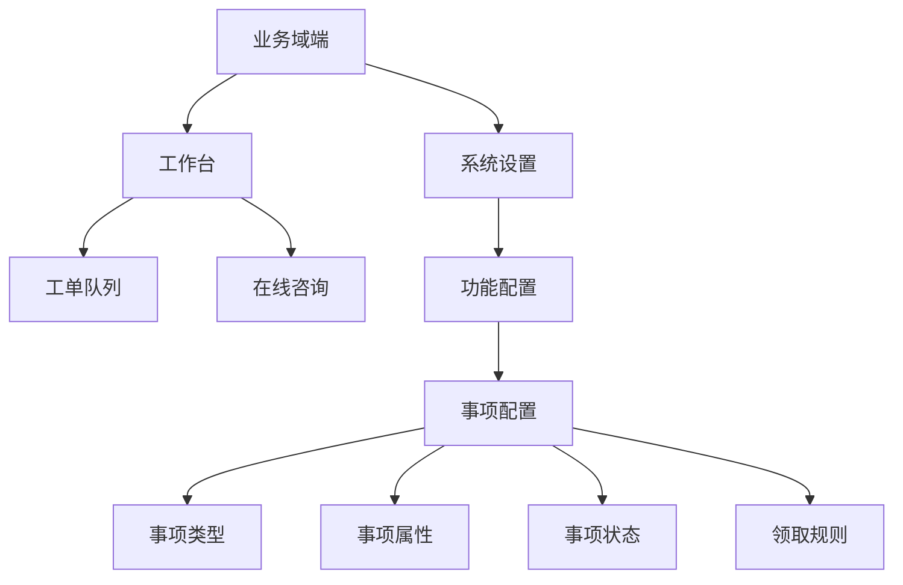
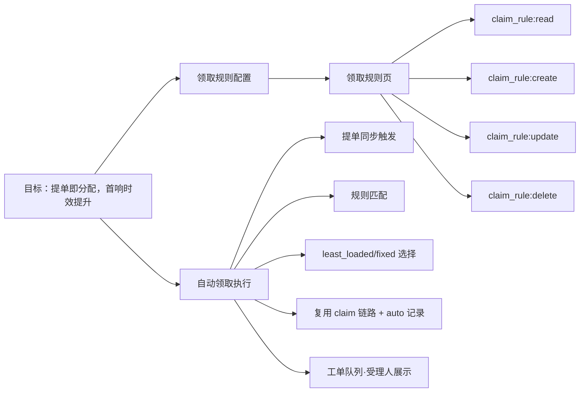

# PRD：工单领取规则（自动领取机制）

> 生成方式：prd-generator（Story Design）｜研究来源：@trellis-research 2026-08-15 工单自动领取机制研究（research/auto-claim-mechanism 结论回填）｜用户确认：方案 + 名称定为「领取规则」

## 一、版本说明

| 版本 | 日期 | 变更 |
|---|---|---|
| v0.1 | 2026-08-15 | 初稿：生成方案经用户确认（名称「自动领取」→「领取规则」） |

## 二、背景与目标

**背景**：客户提单后工单处于"未领取"状态，SLA 首响依赖员工人工盯单/抢单；多员工场景下无人认领时首响超时。需要"提单即分配"的自动领取机制，减少人工盯单，提升首响时效。

**目标**（可衡量）：
- 新工单（客户提单）自动领取覆盖率 ≥ 90%（命中规则且成功分配）
- 自动领取场景下，从提单到受理人确定（assignedTo 落库）平均耗时 < 10 秒（同步触发）

## 三、故事介绍

### 3.1 场景描述

- 域管理员在「事项配置 → 领取规则」配置规则：feedback 类型、normal 优先级 → 自动分配给当前受理最少员工
- 客户提单后，系统自动将工单分配给候选员工（least_loaded），员工打开工作台即见「我的待办」
- 值班场景：配置 fixed 策略指定值班员工，工单自动落入值班人
- 规则失效/无候选员工时，工单保持未领取，员工手动领取兜底

### 3.2 价值分析

自动领取将"人工抢单"变为"系统分配"：消除无人认领的真空期，SLA 首响计时从提单即启动（受理即首响），员工无需盯列表，聚焦处理。

### 3.3 用户核心路径

- 配置者：进入事项配置 → 领取规则 → 新建规则（类型/优先级/策略/指定人）→ 启用
- 处理者：客户提单 → 系统自动领取 → 工作台「我的待办」可见 → 处理工单
- 兜底：无规则/无候选 → 工单未领取 → 员工手动领取

### 3.4 漏斗目标

| 步骤 | 指标 |
|---|---|
| 提单 → 自动领取成功 | 覆盖率 ≥ 90% |
| 自动领取 → 员工处理 | 领取后 24h 内处理率（跟踪） |
| 手动领取兜底 | 未覆盖工单 100% 在 SLA 首响前被领取（人工保障） |

### 3.5 路径规划（阶段二，本次不做）

- 定时扫描兜底（@EnableScheduling，未领取超时重试分配）
- online_first（在线优先）/ round_robin（轮询）策略
- 自动领取后站内信通知被分配员工（复用 NotificationCenterService）
- 规则生效时段（effective_start/end）
- 规则来源维度（match_source）
- 队列「自动领取」标识（Tag）

## 四、概要设计

### 4.1 模块图

```
M1 领取规则配置（域级）          M2 自动领取执行（系统动作）
├── 规则 CRUD                    ├── 提单同步触发
├── 规则匹配（具体度优先）        ├── 候选池筛选
└── 权限：domain.ticket_claim_rule.*  └── 策略分配 + 复用 claim 链路
```

### 4.2 功能清单

| 编号 | 模块 | 功能 | 说明 |
|---|---|---|---|
| M1 | 领取规则配置 | | |
| F1-1 | | 查看领取规则列表 | 分页列表 + 启用状态 + 匹配维度 + 策略 |
| F1-2 | | 新建领取规则 | 类型/优先级（可空=全部）+ 策略 + 指定人 |
| F1-3 | | 编辑/启停规则 | 修改匹配与策略；Switch 启停 |
| F1-4 | | 删除规则 | ConfirmPopover 确认 |
| M2 | 自动领取执行 | | |
| F2-1 | | 提单触发自动领取 | 客户提单事务内同步调用（try-catch 不阻断提单） |
| F2-2 | | 规则匹配 | 域 + 类型/NULL + 优先级/NULL，具体度优先（sla_rule selectPolicy 同构） |
| F2-3 | | 领取人选择 | least_loaded（受理最少）/ fixed（指定人）；候选池=域 active 成员×staff active×就业 active |
| F2-4 | | 领取执行与记录 | 复用 updateClaim（乐观锁）；历史记录 payload auto:true；SLA 首响落库 |

### 4.3 页面结构图

| 页面名称 | 路由 | 菜单访问路径 | 备注 |
|---|---|---|---|
| 领取规则 | /domain/ticket-config?section=claim-rule | 系统设置 > 功能配置 > 事项配置 > 领取规则 | 事项配置页 sider 第四段；列表+编辑 Modal；需 domain.ticket_claim_rule.read |
| 工单队列（受理人展示） | /domain/workbench?tab=ticket（原 /domain/ticket-queue） | 工作台 > 工单队列 | 复用现有页面，受理人列自动显示 assigneeName，无新增 |

### 4.4 菜单结构树



```text
业务域端
├── 工作台
│   ├── 工单队列
│   └── 在线咨询
└── 系统设置
    └── 功能配置
        └── 事项配置
            ├── 事项类型
            ├── 事项属性
            ├── 事项状态
            └── 领取规则 ← 新增
```

### 4.5 功能页面图

| 功能 | 页面 | 权限码 | 备注 |
|---|---|---|---|
| 查看领取规则 | 领取规则 | domain.ticket_claim_rule:read | 列表+启用状态 |
| 新建领取规则 | 领取规则 | domain.ticket_claim_rule:create | 弹窗表单 |
| 编辑/启停规则 | 领取规则 | domain.ticket_claim_rule:update | Switch 启停同码 |
| 删除规则 | 领取规则 | domain.ticket_claim_rule:delete | ConfirmPopover |
| 提单自动领取（系统动作） | —（后端） | 无（Service 层调用，绕过权限拦截） | 历史记录 auto:true |

### 4.6 整体结构图



## 五、详细设计

### 5.1 规则表 ticket_claim_rule（Flyway 迁移）

| 字段 | 类型 | 说明 |
|---|---|---|
| id | bigint unsigned PK | 雪花 |
| business_domain_id | bigint unsigned | 域隔离（索引 idx 域+类型） |
| name | varchar(128) | 规则名 |
| enabled | tinyint default 1 | 总开关 |
| match_ticket_type_id | bigint unsigned NULL | NULL=全部类型 |
| match_priority_level_id | bigint unsigned NULL | NULL=全部优先级（join ticket_priority_level.code 匹配 ticket.priority，与 sla_rule 同口径） |
| strategy | varchar(32) default 'least_loaded' | least_loaded / fixed（MVP） |
| assignee_staff_account_id | bigint unsigned NULL | strategy=fixed 必填 |
| grace_minutes | int default 0 | 定时兜底延迟（阶段二用，MVP 落库不生效） |
| created_at / updated_at | datetime(3) | 审计 |

约束：外键域/类型/优先级/指定人；不设唯一（多规则同型，匹配取最具体一条）。

### 5.2 规则匹配（与 SlaRuleMapper.selectPolicy 同构）

```
WHERE business_domain_id=? AND enabled=1
  AND (match_ticket_type_id=? OR match_ticket_type_id IS NULL)
  AND (match_priority_level_id IS NULL OR tpl.code=ticket.priority)
ORDER BY match_ticket_type_id IS NOT NULL DESC,
         match_priority_level_id IS NOT NULL DESC, id DESC
LIMIT 1
```
多规则命中：具体度优先，同度取 id 大（后创建）。

### 5.3 触发与执行

- 触发点：`createTicketForCustomer`（insertTicketWithRetry 之后）调用 `ClaimRuleService.tryAutoClaim(domainId, ticketId, ticketTypeId, priority)`，**try-catch 包裹，失败仅日志，绝不回滚提单**
- 候选池：`domain_member(status=active, deleted_at IS NULL) JOIN staff_account(status=active) JOIN user_account(employment_status=active)` 且域内角色含 agent/domain_admin
- least_loaded：候选池内 `COUNT(ticket WHERE assignee_staff_account_id=? AND status IN('open','new','processing'))` 最少；并列取最近分配久者
- fixed：指定人必须在候选池，否则跳过记日志（不回退其他策略）
- 执行：复用 `updateClaim`（乐观锁 version）；`recordHistory(claim, context=null, payload {"auto":true})`；SLA 首响落库（与手动一致，见待确认①）
- 并发安全：自动领取与人工抢单都走乐观锁 UPDATE，谁先到谁生效；自动领取失败/被抢 → 跳过（未领取）

### 5.4 边界处理

| 场景 | 处理 |
|---|---|
| 无匹配规则 / 规则禁用 | 不自动领取，维持现状 |
| 无候选员工 / 全部禁用 | 保持未领取 + 日志（阶段二通知域管理员） |
| 指定人失效 | 跳过该规则记日志 |
| 自动领取后人工再领取 | **待确认②**：建议修复 claim 前置校验（仅 open/new 且未指派可领取） |
| 并发提单 / 人工抢单 | 乐观锁，幂等 |
| 同步触发失败 | 降级未领取，阶段二定时兜底 |

### 5.5 配置页交互（事项配置 sider 第四段「领取规则」）

- 结构：Card + Table（名称/启用 Switch/匹配类型/匹配优先级/策略/指定人/操作：编辑+删除）+ 编辑 Modal（名称、启用、类型 Select 全部/指定、优先级 Select 全部/指定、策略 Radio、指定人 Select（fixed 时显示）、延迟分钟（展示，阶段二生效））
- 数据源：类型/优先级复用队列页 loadMeta（ticket-statuses/priority-levels）
- 校验：fixed 必填指定人且为域内 active 成员；类型/优先级须属当前域
- 权限：sider 入口 entryAuth 含 domain.ticket_claim_rule.read（agent 只读可见）

### 5.6 权限与角色

- 新权限码 4 个：`domain.ticket_claim_rule.read/create/update/delete`（permission_scope=domain，path_pattern 对应 API）
- 角色绑定：domain_admin 全量 + agent 只读（照 V20260813140000 SLA 先例幂等补全）
- API：`/api/v1/admin/domains/{domain_id}/ticket-claim-rules` CRUD（照 SlaController 先例；delete 复用 update 码）

## 六、交付设计

### 6.1 数据买点

| Action | View | Code |
|---|---|---|
| 自动领取触发（规则命中） | 后端 | ticket_claim_rule.hit |
| 自动领取分配成功 | 后端 | ticket_claim_rule.assigned |
| 自动领取降级未分配 | 后端 | ticket_claim_rule.degraded |
| 规则新建/启停 | 领取规则页 | ticket_claim_rule.manage |

数据需求：自动领取覆盖率 = assigned / hit；平均领取耗时（提单→assigned 时间差）。

### 6.2 上线筹备

- 历史数据：不影响存量工单（仅新提单触发）；无迁移
- 依赖：Flyway 迁移（表+4 权限码+角色绑定+事项配置 sider 第四段前端）；claim 回归（TicketServiceTests/TicketWorkflowTests 不回归）
- 若采纳待确认②：claim/assign 前置校验修复需联动回归 EMP2 批量领取语义

## 附录 A：设计图集（含于正文 4.3-4.6）

## 附录 B：研究参考

| 主题 | 研究文件 | 结论摘要 | 对应章节 | 状态 |
|---|---|---|---|---|
| 自动领取机制 | research/auto-claim-mechanism | 触发=同步+定时兜底；策略=least_loaded/fixed 主推；规则表对齐 sla_rule | 四/五 | 研究参考·已采纳 |
| 权限/入口 | 同上 | 4 新码 + 事项配置 sider 第四段 | 5.5/5.6 | 研究参考·已采纳（更名「领取规则」） |

## 自洽校验

- ① 菜单树叶节点（领取规则）↔ ② 页面结构行（领取规则）✓；工单队列为复用页面非新增 ✓
- ③ F1-1~F1-4 均落「领取规则」页且权限码唯一 ✓；F2-1~F2-4 为后端系统动作（无页面归属，标注）✓
- ④ 节点均可回查 ①②③ ✓
- 功能清单 ↔ 页面结构：无多余页面、无漏页 ✓

## 待确认项（生成时按推荐值写入，可一句话推翻）

1. **SLA 首响**：自动领取计入首响（与手动一致）——已按推荐写入
2. **claim 覆盖缺口修复**：已指派工单可被再领取的现状缺口，按推荐**列入实现范围**（F2 增强项，实现时同步修复）
3. **阶段二路径规划**：定时兜底/online_first/通知/时段/来源——已列入 3.5（本次不做）
