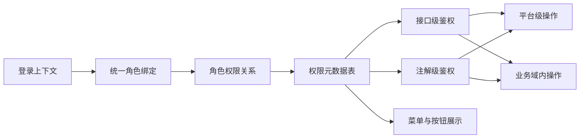
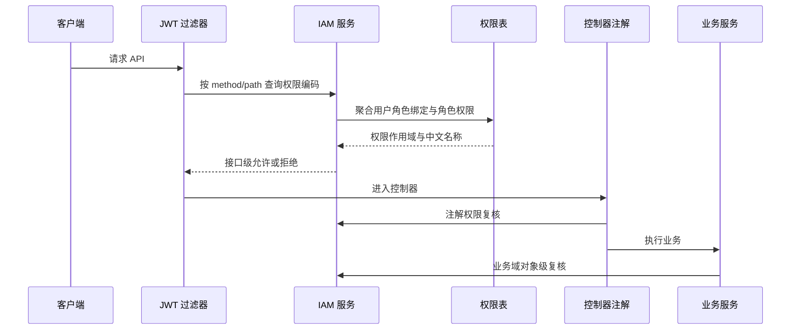

# IAM 权限体系重构开发清单

## 0. 文档说明
- [x] 本清单用于落实“权限表落库、编码注解、平台/域级权限分层、默认展示名称中文化”。
- [x] 默认展示名称必须使用中文，包含角色名称、资源名称、权限名称、菜单名称、按钮名称、审计展示文本。
- [x] `code` 字段仅作为机器识别标识，允许使用英文风格编码，禁止把编码作为默认展示名称。
- [ ] 本清单完成后再进入后续更大范围的业务对象级权限收口。

## 1. 目标
- [x] 权限元数据落库，权限编码稳定唯一。
- [x] Java 注解使用权限编码常量，不在业务代码中散落裸字符串。
- [x] 平台级角色可以持有平台权限，也可以持有跨所有业务域生效的域级权限。
- [x] 域级角色只能持有域级权限，并且仅在绑定业务域内生效。
- [x] 平台级和域级权限重合时拆成不同权限，例如“创建平台用户”和“创建域用户”。

## 2. 当前现状
- [x] 当前 IAM 已有 `role`、`user_global_role`、`user_domain_role`、`iam_resource`、`iam_role_resource`。
- [x] Admin 菜单链路已有 `iam_admin_menu`、`iam_admin_role_menu_relation`。
- [x] 当前后端仍存在单角色 `UserContext.role()` 决策链路。
- [x] 当前 Admin 权限编码由 `AdminPermissionCatalog` 静态维护。
- [x] 当前业务域对象级权限尚未完全收口到 Service 层。

## 3. 方案设计
- [x] 新增 `iam_permission`，保存权限编码、中文名称、中文说明、权限作用域、资源编码、动作编码、接口映射。
- [x] 新增 `iam_role_permission`，保存角色与权限的关系。
- [x] 新增 `iam_role_binding`，统一表达用户的全局角色绑定和业务域角色绑定。
- [x] 新增 `PermissionCodes`，集中维护权限编码常量。
- [x] 新增 `RequirePermission`，作为编码级权限注解。
- [x] 新增权限作用域裁决规则：`role.scope + binding_scope + permission_scope + business_domain_id` 联合判断。

## 4. 功能模块示意

## 5. 鉴权链路示意

## 6. 数据库模型
- [x] `iam_permission.code`：机器编码，稳定唯一。
- [x] `iam_permission.name`：中文默认名称。
- [x] `iam_permission.description`：中文说明。
- [x] `iam_permission.permission_scope`：`platform` 或 `domain`。
- [x] `iam_permission.resource_code`：资源机器编码。
- [x] `iam_permission.action_code`：动作机器编码。
- [x] `iam_role_permission`：角色权限关系。
- [x] `iam_role_binding`：统一角色绑定，使用生成列规避 `NULL` 唯一索引语义。

## 7. 开发任务
- [x] 创建开发清单文件。
- [x] 新增权限编码常量、权限注解、作用域裁决测试。
- [x] 新增权限编码常量、权限注解、作用域裁决实现。
- [x] 改造 Admin 权限目录为中文名称和新权限编码。
- [x] 新增权限表、角色权限表、统一角色绑定表 Flyway 脚本。
- [x] 改造接口级鉴权优先读取权限表。
- [x] 改造创建用户链路，区分创建平台用户与创建域用户。
- [x] 改造权限快照，动作权限返回中文名称。
- [x] 同步前端权限类型与系统路由权限编码。
- [x] 同步 **Flyway 迁移所落库表结构** 与 `doc/数据库设计.md`（`doc/schema.sql` 已废弃，不再作为对照物）。
- [x] 运行后端测试与必要前端类型检查。

## 8. 验收标准
- [x] 默认角色、资源、权限、菜单、按钮均展示中文名称。
- [x] 注解引用 `PermissionCodes` 常量，不直接写权限编码裸字符串。
- [x] 域级角色绑定平台级权限时被拒绝。
- [x] 平台级角色拥有域级权限时可跨所有业务域生效。
- [x] 域级角色拥有域级权限时只能作用于绑定业务域。
- [x] 权限快照同时返回机器编码和中文名称。
- [x] 旧菜单授权链路在迁移期保持兼容。

## 9. 本轮验证
- [x] 后端定向测试通过：`.\mvnw.cmd -q "-Dtest=PermissionScopePolicyTests,AdminPermissionCatalogTests,RequirePermissionInterceptorTests" test`。
- [x] 后端完整测试通过：`.\mvnw.cmd -q test`。
- [x] 后端完整验证通过：`.\mvnw.cmd -q -DskipTests=false verify`。
- [x] Flyway 已在本地 MySQL 从版本 `202604271000` 迁移到 `202604281000`。
- [x] 受影响前端工具测试通过：`pnpm --filter admin-web jest -- src/utils/systemPermission.test.ts src/utils/auth-session-persistence.test.ts`。
- [ ] AdminWeb 全量类型检查仍有既有登录测试空值类型错误，需在登录测试专项中处理。
## 12. 2026-05-06 权限码目录收口
- [x] `AdminPermissionCatalog` 已补齐 `PermissionCodes` 全量常量，目录数量与常量数量一致。
- [x] `GET /api/v1/iam/admin-permission-codes` 已支持 `scope` 过滤，平台/业务域/共享权限可按需筛选。
- [x] `AdminMenuService.listPermissionCodes(scope)` 已支持空值兼容与 scope 过滤。
- [x] `AdminPermissionCatalogTests` 已补充总量、唯一性与 scope 过滤验证。
