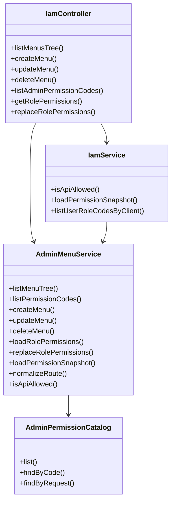

# IAM 菜单模块迁移改造清单

## 0. 文档说明
- [x] 本清单已进入开发实施阶段，内容以“已落地代码 + 当前剩余事项”为准。
- [x] 本次实施遵循 `AGENTS.md`：UTF-8、Flyway 仅追加、最小变更、开发清单先行。
- [x] 本次范围仅覆盖 AdminWeb 菜单模块、角色授权页、权限快照链路，不扩展到 customer-web。

## 1. 已确认约束
- [x] `client_scope` 不进入新 Admin 菜单模型。
- [x] 菜单内部业务编码字段固定为 `code`，与主键 `id` 分离。
- [x] 菜单路由输入后，前端实时显示“完整访问路由预览”。
- [x] 项目注释、文档、描述性内容统一使用中文。
- [x] 项目文件统一使用 UTF-8（无 BOM）。

## 2. 当前最终态（已实施）
- [x] Admin 菜单树切换为单表模型：`目录 / 菜单 / 按钮` 同表存储。
- [x] Admin 角色授权切换为节点关系表：角色直接授权菜单节点与按钮节点。
- [x] 访问权限编码不再落库到注册表表，统一改为后端静态权限目录。
- [x] AdminWeb 菜单管理页不再维护“客户端范围”和“菜单编码”输入。
- [x] 菜单节点的默认查询权限改为“菜单表单必填 + 保存时自动创建 required 查询按钮”。

## 3. 前端实施结果（UnionDeskWeb / AdminWeb）

### 3.1 菜单管理页
- [x] `/system/menus` 改为树表展示。
- [x] 无子节点时不显示展开能力（基于表格树 `rowExpandable`）。
- [x] 行操作支持“新增下级 / 编辑 / 删除”。
- [x] 按钮节点不显示“新增下级”。
- [x] 弹窗改为双列布局。
- [x] “父菜单”更名为“上级菜单”，并改为树形下拉。
- [x] “菜单路径”更名为“菜单路由”。
- [x] “客户端范围”从页面移除。
- [x] “菜单编码”从页面移除。
- [x] “类型”字段改为 `目录 / 菜单 / 按钮`。
- [x] 类型为目录时，不展示菜单路由、前端组件、访问权限编码。
- [x] 类型为菜单时，必须填写访问权限编码，用于自动创建默认查询按钮。
- [x] 类型为按钮时，必须填写访问权限编码。
- [x] 排序默认值固定为 `0`。
- [x] “是否隐藏”默认值固定为“否”。
- [x] “启用状态”改为按钮式分段控件。
- [x] 菜单路由输入后实时展示完整访问路由预览。

### 3.2 图标与组件
- [x] 图标输入改为 `@ant-design/pro-editor` 的 `IconPicker`。
- [x] 前端组件字段改为静态注册表下拉。
- [x] 已配置但未注册的组件会给出明确提示，不阻断历史数据展示。
- [x] 组件候选按目录/文件树展示。
- [x] `403 / 404` 等未注册页面不做强制阻断，保留历史值提示。

### 3.3 角色授权页
- [x] 角色授权页改为读取新菜单树，而非旧 `iam_resource` 列表。
- [x] 角色授权提交改为 `menuIds + buttonIds`。
- [x] required 查询按钮在前端禁用取消，并在菜单勾选后自动补入已选集合。

### 3.4 前端保留不变
- [x] `getInitialState + access + menuDataRender` 仍为菜单可见性链路。
- [x] 未新增前端越权兜底逻辑，菜单显示仍以后端权限快照为准。

## 4. 后端实施结果（UnionDesk / IAM）

### 4.1 新增类
- [x] `com.uniondesk.iam.admin.AdminMenuService`
- [x] `com.uniondesk.iam.admin.AdminPermissionCatalog`

### 4.2 服务规则
- [x] 支持 `catalog / menu / button` 三种节点类型校验。
- [x] 按钮节点仅允许挂载在菜单节点下。
- [x] 目录节点仅允许挂载在目录节点下。
- [x] 菜单节点允许挂载在目录或菜单节点下。
- [x] 创建菜单时自动创建 required 查询按钮。
- [x] required 查询按钮不可删除。
- [x] 角色授权替换时，required 查询按钮自动补齐。
- [x] 菜单路由统一规范化：补前导 `/`、转小写、压缩重复分隔符。
- [x] 菜单业务编码由后端自动生成，格式为 `ADM` + 零填充数字串。

### 4.3 接口与返回
- [x] 复用原 URL：`/api/v1/iam/menus/tree`
- [x] 复用原 URL：`POST /api/v1/iam/menus`
- [x] 复用原 URL：`PUT /api/v1/iam/menus/{id}`
- [x] 复用原 URL：`DELETE /api/v1/iam/menus/{id}`
- [x] 复用原 URL：`GET /api/v1/iam/roles/{roleId}/permissions`
- [x] 复用原 URL：`PUT /api/v1/iam/roles/{roleId}/permissions`
- [x] 新增只读接口：`GET /api/v1/iam/admin-permission-codes`
- [x] 菜单树返回补充 `nodeType / routePath / componentKey / permissionCode / required`
- [x] 权限快照在 `ud-admin-web` 下改为从新表聚合菜单与按钮权限

### 4.4 当前类图（已落地）

### 4.5 类职责说明（已落地）
- [x] `IamController`：保留 IAM 入口，菜单与角色授权相关请求改委托给 `AdminMenuService`。
- [x] `IamService`：继续负责旧 IAM 主链路，同时在 `ud-admin-web` 场景下把权限快照与部分 API 权限校验切换到新 Admin 菜单模型。
- [x] `AdminMenuService.createMenu()`：统一接收目录/菜单/按钮创建请求；菜单类型自动补建 required 查询按钮。
- [x] `AdminMenuService.updateMenu()`：同类型更新；菜单更新时同步 required 查询按钮的权限编码。
- [x] `AdminMenuService.deleteMenu()`：执行子节点、角色绑定、required 按钮删除约束校验。
- [x] `AdminMenuService.replaceRolePermissions()`：收束菜单与按钮授权，自动补齐父菜单和 required 查询按钮。
- [x] `AdminMenuService.normalizeRoute()`：统一菜单路由规范化规则，前后端保持一致。
- [x] `AdminPermissionCatalog`：作为访问权限编码唯一真相源，维护 `code / name / httpMethod / pathPattern`。

## 5. 数据库最终模型（已落地）

### 5.1 目标表
- [x] `iam_admin_menu`
- [x] `iam_admin_role_menu_relation`
- [x] 不再创建 `iam_admin_permission_registry`

### 5.2 `iam_admin_menu`
- [x] `id bigint unsigned` 主键，自增
- [x] `code varchar(64)` 业务编码，唯一，非空
- [x] `node_type varchar(16)`：`catalog / menu / button`
- [x] `name varchar(128)` 中文名称，非空
- [x] `route_path varchar(255)`：仅菜单使用
- [x] `component_key varchar(255)`：仅菜单使用
- [x] `permission_code varchar(128)`：仅按钮使用
- [x] `parent_id bigint unsigned`：自关联
- [x] `order_no int` 默认 `0`
- [x] `icon varchar(64)` 可空
- [x] `hidden tinyint` 默认 `0`
- [x] `status tinyint` 默认 `1`
- [x] `required tinyint` 默认 `0`
- [x] `created_at / updated_at datetime(3)`

### 5.3 `iam_admin_role_menu_relation`
- [x] `id bigint unsigned` 主键，自增
- [x] `role_id int unsigned`
- [x] `menu_id bigint unsigned`
- [x] `created_at datetime(3)`
- [x] 唯一键 `uk_iam_admin_role_menu(role_id, menu_id)`

### 5.4 当前关键约束
- [x] `catalog` 节点禁止填写菜单路由、前端组件、访问权限编码
- [x] `menu` 节点要求 `route_path + component_key`
- [x] `button` 节点要求 `permission_code`
- [x] `route_path` 唯一
- [x] `permission_code` 唯一
- [x] 节点层级合法性在服务层校验

## 6. Flyway 与迁移结果
- [x] 追加脚本：`V202604271000__migrate_admin_menu_runtime.sql`
- [x] 创建 `iam_admin_menu`
- [x] 创建 `iam_admin_role_menu_relation`
- [x] 将当前系统管理相关菜单迁入新表，并统一中文名称
- [x] 将当前系统管理相关动作迁为按钮节点
- [x] 将旧角色授权关系迁移到新关系表
- [x] 为迁入菜单补齐 required 查询按钮
- [ ] “未归类动作目录”尚未落地；当前迁移范围聚焦已上线的系统管理菜单链路
- [ ] 旧 `iam_resource / iam_role_resource` 物理下线尚未执行，本阶段仅保留兼容

## 7. 文档同步结果
- [x] 本清单已按真实最终态回写
- [x] Flyway 迁移脚本已作为 schema 最终态来源；`doc/schema.sql` 已移除，表结构以仓库内 Flyway 脚本与 `doc/数据库设计.md` 为准
- [x] `doc/数据库设计.md` 已同步身份与权限模型说明

## 8. 本轮新增实施（2026-05-05）
- [x] 菜单管理页完全重写：对接新 API（`fetchMenusTree`/`createMenu`/`updateMenu`/`deleteMenu`），移除旧 mock API
- [x] 菜单管理页树表展示，无子节点时不显示展开能力
- [x] 行操作支持"新增下级 / 编辑 / 删除"，按钮节点不显示"新增下级"，required 节点不显示删除
- [x] 弹窗双列布局，类型联动：目录不展示路由/组件/权限码，菜单必填权限码，按钮必填权限码
- [x] 权限码字段改为下拉选择（从 `fetchAdminPermissionCodes` 加载）
- [x] 菜单路由输入后实时展示完整访问路由预览
- [x] 上级菜单改为树形下拉选择
- [x] 路由迁移：菜单管理和角色管理从 `/system` 迁移到 `/permission`
- [x] 系统管理重组：`系统管理 > 系统配置 > 用户管理/部门管理` 三级结构
- [x] i18n 更新：新增权限管理、系统配置菜单翻译及菜单管理页新字段翻译

## 9. 排查修复实施（2026-05-06）

### 角色管理页迁移（P0）
- [x] `role/index.tsx` 迁移：使用 `fetchRoles`/`deleteRole`/`fetchRolePermissions`/`fetchMenusTree` 替代旧 mock API
- [x] `role/constants.tsx` 迁移：数据类型从 `RoleItemType` 改为 `IamRole`，新增 scope/system 列
- [x] `role/components/detail.tsx` 完全重写：
  - [x] 使用 `createRole`/`updateRole`/`updateRolePermissions` 新 API
  - [x] 授权树改为读取新菜单树 (`MenuTreeNode[]`)
  - [x] 提交拆分为 `menuIds` + `buttonIds`
  - [x] required 按钮自动勾选且禁止取消（`disabled` 标记）
  - [x] 系统内置角色不可删除
- [x] i18n 新增角色管理字段：scope/global/domain/system

### IconPicker 集成（P1）
- [x] 新增 `icon-picker.tsx` 组件：基于 `menuIcons` 注册表实现图标选择器
- [x] 弹窗中目录和菜单类型的图标字段从 `ProFormText` 改为 `IconPicker`
- [x] 选项展示图标预览 + 名称，支持搜索

### 前端组件注册表下拉（P2）
- [x] 新增 `component-registry.ts`：静态注册 25 个页面组件路径
- [x] 弹窗中 `componentKey` 字段从 `ProFormText` 改为 `ProFormSelect`
- [x] 未注册的历史值给出提示文案，不阻断展示

### 死代码清理（P3）
- [x] 删除 `tree-menu.tsx`（无引用 Demo 残留）
- [x] 删除 `src/api/system/` 目录（旧 mock API，已无引用）

## 10. 后续待办
- [ ] 为菜单页和角色授权页补更多前端交互测试
- [ ] 为 `AdminMenuService` 补单元/集成测试
- [ ] 根据真实业务范围决定是否继续迁移旧 `api.*` Admin 动作
- [ ] 评估是否把 `super_admin` 对 `/api/v1/iam/**` 的特殊放行进一步收束为更细粒度的静态权限校验

## 11. 验证结果
- [x] 后端编译通过：`UnionDesk\\mvnw.cmd -q -DskipTests compile`
- [x] 后端现有测试通过：`UnionDesk\\mvnw.cmd -q test`
- [x] 前端类型检查通过：`pnpm --filter admin-web typecheck`（2026-05-06 再次验证通过）
- [x] 前端测试通过：27 文件 40 用例全绿（2026-05-06 再次验证通过）
- [x] 前端构建通过：`pnpm --filter admin-web build`
- [x] 新增前端工具测试通过：`pnpm --filter admin-web jest -- src/utils/adminMenu.test.ts`

---

评审记录：
- 评审日期：`2026-04-27`
- 评审人：`Codex + 用户交互确认`
- 结论：`已进入实施并完成首轮落地`
- 备注：`2026-05-06 排查修复：角色页迁移新 API、IconPicker、组件注册表、死代码清理`
## 12. 2026-05-06 权限码分组收口
- [x] `fetchAdminPermissionCodes(scope?)` 已支持可选 scope 查询参数。
- [x] 菜单管理弹窗的权限码下拉已按 `platform / domain / shared` 三组展示，并保留搜索能力。
- [x] `system.json` 已补充 `platformPermissions / domainPermissions / sharedPermissions` 中英文文案。

## 13. 2026-05-07 菜单图标字段栅格修复
- [x] 菜单管理弹窗的 `icon` 字段已改为 `ProForm.Item + MenuIconPicker`，通过 ProForm 表单栅格继续参与布局。
- [x] 图标选择改为图标网格弹窗，保留预览、清空与字符串回填能力。
