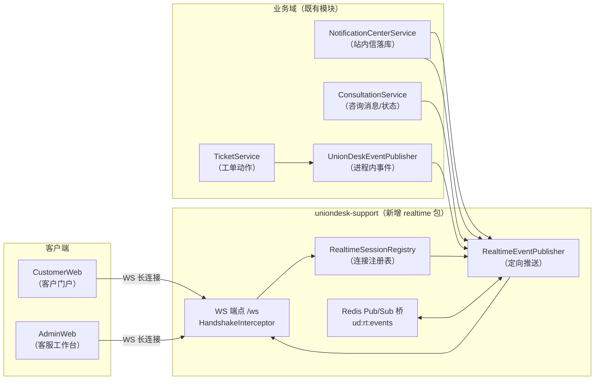
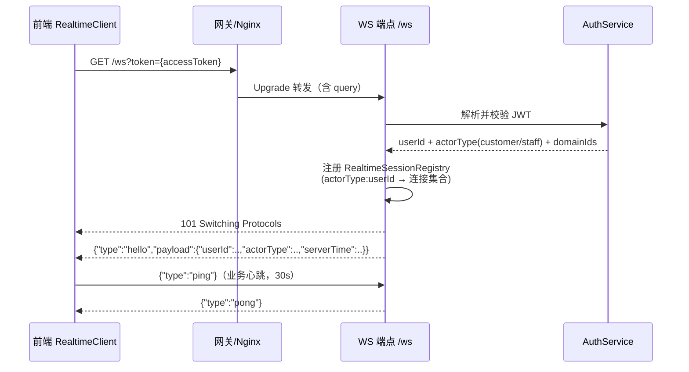
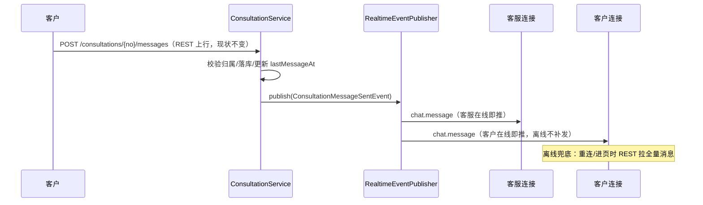

# ADR-003：实时消息架构（WebSocket + 事件推送）

> 状态：**已采纳**（2026-08-16 拍板：D1 统一 WS / D2 REST 上行+WS 下行 / D3 P1+P2 / D4 首期多实例 / D5 无坐席提示） · 关联：[ADR-001 外部依赖](adr-external-dependencies.md)、[ADR-002 SLA 双层配置](adr-sla-two-tier-config.md)

## 1. 背景与目标

当前 UnionDesk 的实时性现状（已勘察核实）：

| 场景 | 现状 | 缺口 |
|---|---|---|
| 客户咨询聊天 | 3s 轮询拉消息（CustomerWeb `chat/index.tsx:91-94`） | 非实时、延迟 3s、流量浪费 |
| 客服咨询聊天 | V2 后 3s 轮询当前会话消息（AdminWeb `consultations/index.tsx`） | 同上；多会话无法同时感知新消息 |
| 客服在线/排队 | Redis presence 30s 心跳（`AgentQueueService`），会话分配走 Redis 队列 | 无推送，前端轮询 presence |
| 站内信 | `NotificationCenterService` 落库，前端拉取 `/inbox` + `/inbox/unread-count` | 无推送，角标不实时 |
| 工单事件 | 进程内 Spring 事件（`UnionDeskEventPublisher` + `@TransactionalEventListener(AFTER_COMMIT)` + `@Async`）→ 站内信落库 | 事件仅用于站内信，无实时通道 |

**目标**：设计统一实时消息架构，覆盖 咨询聊天 / 工单事件 / 站内信 三类场景，采用业界最佳实践，兼顾当前单实例部署与未来多实例扩展。

## 2. 现状关键事实

- **无 WebSocket/STOMP/SSE 依赖**（pom 全查无）；Spring Boot 3 + Java 21。
- **事件总线已存在**：`UnionDeskDomainEvent`（sealed interface，当前 5 种事件）+ `UnionDeskEventPublisher`（进程内 `ApplicationEventPublisher`）+ `NotificationEventListener`（`AFTER_COMMIT + @Async` 落站内信）。事件→站内信链路是成熟的挂载点。
- **通知中心**：`NotificationCenterService.notifyTicketCreated/StatusChanged/Reply/Merged/SatisfactionInvite/RiskLogin`，落库 `inbox_message`；`unreadCount/ listInboxMessages/ markRead` 齐备；客户与员工共用（recipientUserId）。
- **Redis 基建在跑**：`spring-boot-starter-data-redis` + `StringRedisTemplate`（`AgentQueueService` 的 `agent:online:*` 哈希、`queue:consult:*` 列表）。30379 端口，AUTH 密码走环境变量。
- **模块依赖**：`uniondesk-ticket → uniondesk-support → uniondesk-iam`（ticket 依赖 support）；事件定义在 `uniondesk-common`。
- **权限体系**：JWT（accessToken）登录；咨询消息 REST 端点已有完整业务校验（角色/会话归属/撤回窗口），测试覆盖。

## 3. 架构总览



**分层原则**：
1. **业务层不改写**：工单/咨询/站内信的落库逻辑与 REST API 全部保持现状，只在关键动作点追加「发布实时事件」。
2. **推送层单向**：`RealtimeEventPublisher` 只做下行推送，不做业务判断；事件→接收人（recipient）的映射由各业务事件携带，推送层做硬校验。
3. **存储与实时分离**：WS 只做实时提醒通道，数据一致性永远以 REST/DB 为准（页面加载、刷新、重连后拉取）。

## 4. 传输层决策（待拍板 §8-D1）

| 方案 | 通道 | 优点 | 缺点 |
|---|---|---|---|
| **A. 统一 WebSocket 单通道（推荐）** | 一个 `/ws` 连接承载 咨询/工单/站内信 全部推送；咨询消息上行走既有 REST | 前端基建一次到位；协议统一；咨询聊天室自然形态 | 后端需处理连接生命周期/心跳/重连（一次投入） |
| B. 咨询 WS + 其余 SSE | 咨询走 WS 双向；工单/站内信走 `text/event-stream` 单向 | 单向推送服务端更简单；SSE 自动重连 | 双通道两套基建；浏览器 SSE 连接数限制（HTTP/1.1 6 条） |
| C. 咨询 WS + 其余轮询 | 仅咨询升级 WS，工单/站内信维持轮询 | 改动最小 | 角标/工单进展仍不实时 |

**推荐 A**：三类场景共用一个长连接，前端封装一个 `RealtimeClient` 即可；SSE 的「服务端简单」优势在 Spring 下并不明显（两者都要写心跳/重连），且咨询聊天必须 WS 的情况下双通道无收益。

## 5. 详细设计

### 5.1 连接与鉴权



- **握手鉴权**：浏览器 WebSocket API 无法自定义 Header，token 走 query 参数（`?token=`）；Nginx 需配置 `proxy_read_timeout` ≥ 心跳间隔×3 并放行 Upgrade 头。
- **身份解析**：复用现有 JWT 解析（`uniondesk-iam`），握手时解析 `userId + actorType + 可访问 domainId 列表`，失败返回 401 并关闭。
- **Token 续期**：握手时校验即可；运行期不强制（长会话中 token 过期仅影响下一次握手，MVP 接受）。可选增强：每 5 分钟用 `hello/ping` 帧携带最新 token 校验。
- **连接注册表**：`RealtimeSessionRegistry` 维护 `(actorType, userId) → Set<WebSocketSession>`（一个用户多标签页多连接，推送 fan-out 到全部连接）；`domainId → staff 连接集合`（域级广播用）；单用户连接上限 5，超限关最旧。

### 5.2 事件协议（JSON Envelope）

下行帧统一结构：

```json
{
  "v": 1,
  "id": "evt_01HZ...",          // 事件唯一 ID（服务端生成，客户端可去重）
  "type": "chat.message",        // 事件类型（见 5.4）
  "ts": 1723812000000,           // 服务端毫秒时间戳
  "payload": { }                 // 各事件载荷
}
```

上行帧仅两类（其余一律 REST）：

```json
{ "v": 1, "type": "ping", "ts": 1723812000000 }
{ "v": 1, "type": "pong", "ts": 1723812000000 }
```

### 5.3 事件类型清单

| type | 方向 | 载荷要点 | 接收人 |
|---|---|---|---|
| `hello` | 下行 | userId/actorType/serverTime | 连接方 |
| `chat.message` | 下行 | sessionNo/senderRole/content/messageId/createdAt | 会话双方（客户 + 客服） |
| `chat.session` | 下行 | sessionNo/status/assignedTo/linkedTicketNo | 会话双方（接入/结束/转单感知） |
| `chat.queue` | 下行 | domainId/queueSize | 域内在线客服（排队数实时） |
| `ticket.created` | 下行 | ticketId/ticketNo/typeId/domainId | 客户（本人）；域员工（P3 域广播） |
| `ticket.replied` | 下行 | ticketId/replyId/senderType/snippet | 客户（本人） |
| `ticket.updated` | 下行 | ticketId/newStatus/actorUserId | 客户（本人）；被指派员工（P3） |
| `inbox.new` | 下行 | messageId/templateCode/unreadCount | 收件人（客户/员工） |
| `ping` / `pong` | 双向 | — | — |

> 客户只收自己数据（服务端按 recipient 硬校验）；员工只收自己域数据（域广播按 `domainId → staff` 连接集合）。

### 5.4 业务接入点



- **咨询消息**：`ConsultationService.sendMessage` 落库后发 `ConsultationMessageSentEvent`（携带 sessionNo、session 双方 userId、消息行）→ 推给会话双方全部在线连接。**上行保持 REST**（权限/撤回窗口/会话归属校验与测试覆盖不动），WS 不接上行消息。
- **咨询会话状态**：`claimSession / endSession / convertToTicket` 发 `ConsultationSessionChangedEvent` → 客户感知「客服已接入/已结束/已转工单」；`createSession` 后域内在线客服收到 `chat.queue` 排队数变化。
- **站内信**：`NotificationCenterService.notifyXxx` 落库后（保持 `@TransactionalEventListener(AFTER_COMMIT)` + `@Async` 语义）追加发 `InboxCreatedEvent` → 推 `inbox.new`（含最新 unreadCount，前端直接刷新角标，无需再请求）。
- **工单**：新增 `TicketCreatedEvent / TicketRepliedEvent / TicketAssignedEvent`（与既有 `TicketStatusChangedEvent` 并列，均实现 `UnionDeskDomainEvent`），在 `TicketService` 对应动作点发布 → 客户收本人工单事件；员工域广播（P3）。
- **presence 互通**：客服在线状态已有 Redis（`agent:online:*`），MVP 不向客户推送「客服在线」；客服之间不互推（保持现状轮询）。P3 可选。

### 5.5 可靠性与心跳

- **心跳**：客户端 30s 发 `ping`，服务端 10s 内回 `pong`；服务端 90s 无任何帧则关闭连接；客户端 `onclose` 后指数退避重连（1s/2s/4s/8s…上限 30s + 随机 jitter）。
- **重连兜底**：重连成功后客户端收到 `hello` 即触发「增量刷新」：咨询页拉当前会话全量消息、通知中心拉最新列表、工单详情拉最新状态——WS 丢帧不影响数据一致性。
- **幂等**：推送帧带 `id`，客户端按 `(type,id)` 去重（防多实例重复推送）。
- **多实例（P3）**：事件发布 → Redis Pub/Sub 频道 `ud:rt:events` → 各实例订阅后推送到本机连接。当前单实例部署可直推，但 `RealtimeEventPublisher` 接口预留「本地推 + 广播」两段式，P3 只改桥接实现。
- **背压**：推送失败（连接断开竞态）静默丢弃并注销该连接——WS 非可靠传输，丢失由重连拉取兜底，不做重发队列（避免复杂度）。

### 5.6 前端设计

- `packages/shared` 新增 `realtime/realtime-client.ts`：单例 WS 客户端（URL/token 注入、自动重连、`on(type, handler)` 订阅、`off` 注销、心跳定时器、`hello` 触发重连回调）。AdminWeb 与 CustomerWeb 共用。
- 替换点：
  - CustomerWeb `chat/index.tsx`：3s 轮询 → `chat.message` 订阅（保留进页全量拉取）；会话列表状态变化由 `chat.session` 驱动刷新。
  - AdminWeb `consultations/index.tsx`：3s 轮询 → `chat.message` 订阅；排队数 `chat.queue` 刷新统计条；`inbox.new` 刷新侧边栏未读角标。
  - 工单详情/通知中心：订阅 `ticket.*` / `inbox.new` 做增量刷新（P2）。
- 降级：WS 连不上（网络/代理拦截）时自动退回现状轮询（P0 不做，P1 可选开关）。

### 5.7 安全

- 握手 token 校验失败即关闭（401）；query token 会进 Nginx 日志，MVP 接受（与现有 `?token=` 模式一致），可选优化为 `Sec-WebSocket-Protocol` 子协议头携带。
- 推送路由硬校验：`chat.message` 只推会话双方（服务端查 session 归属，不信任连接声明）；`ticket.*` 客户侧只推本人；`inbox.new` 只推收件人；域广播只进 `domainId → staff` 集合。
- 连接数上限 5/用户；推送帧不拼接用户输入（原样透传，前端渲染已转义，与现状一致）。

## 6. 实施分期

| 阶段 | 内容 | 后端 | 前端 | 验收 |
|---|---|---|---|---|
| **P1 咨询实时** | WS 端点/鉴权/注册表/心跳/重连 + `chat.message` + `chat.session` | support 新增 `realtime` 包 + ConsultationService 两处事件 | shared RealtimeClient + 两端聊天页替换轮询 | 客户/客服互发消息 <1s 到达；断线重连后消息不丢（拉取兜底） |
| **P2 站内信+工单（客户视角）** | `inbox.new` + `ticket.created/replied/updated` 客户定向 | NotificationCenter 追加事件 + TicketService 3 处新事件 | 通知角标实时、工单详情实时刷新 | 新站内信/回复/状态变更即时出现；未读数正确 |
| **P3 域广播+多实例** | 员工端域级广播（新工单/排队数/指派）、presence 互通（可选）、Redis Pub/Sub 桥 | RealtimeEventPublisher 桥接实现 + 广播路由 | 工作台队列实时刷新、排队统计实时 | 多实例部署下事件不重不漏 |

## 7. 术语表

| 术语 | 定义 |
|---|---|
| RealtimeSessionRegistry | 服务端连接注册表：`(actorType, userId) → 连接集合`，支持定向推送与域广播 |
| RealtimeEventPublisher | 推送层出口：业务事件 → 按接收人路由 → 本地连接（P3 起经 Redis Pub/Sub 广播） |
| Envelope（信封帧） | 统一下行 JSON 帧：`{v, id, type, ts, payload}` |
| 上行 / 下行 | 上行=客户端发服务端（仅 ping/pong，业务一律 REST）；下行=服务端推送 |
| 重连兜底（Reconcile） | 重连/进页后以 REST 拉全量数据修正状态，WS 丢失帧不产生不一致 |
| ActorType | 身份维度：`customer` / `staff`，决定路由与越权校验范围 |
| 域广播 | 按 `domainId → staff 连接集合` 的推送，仅员工端（P3） |

## 8. 决策记录（已拍板 2026-08-16）

- **D1 传输层**：统一 WebSocket 单通道（方案 A）。
- **D2 咨询上行**：REST 上行 + WS 下行。
- **D3 分期**：P1（咨询实时）+ P2（站内信+工单客户定向）合并实施。
- **D4 多实例**：首期即按多实例设计——事件发布统一走 Redis Pub/Sub（`ud:rt:events`）广播，各实例推本机连接；单实例部署同样经此路径（广播即本地订阅）。
- **D5 客服在线可见性**：不向客户推送客服在线/离线；但客户发起咨询/排队时提示「当前无坐席」（`GET /domains/{id}/consultations/availability` 返回 `has_online_agent`，无坐席时前端提示排队等待）。
