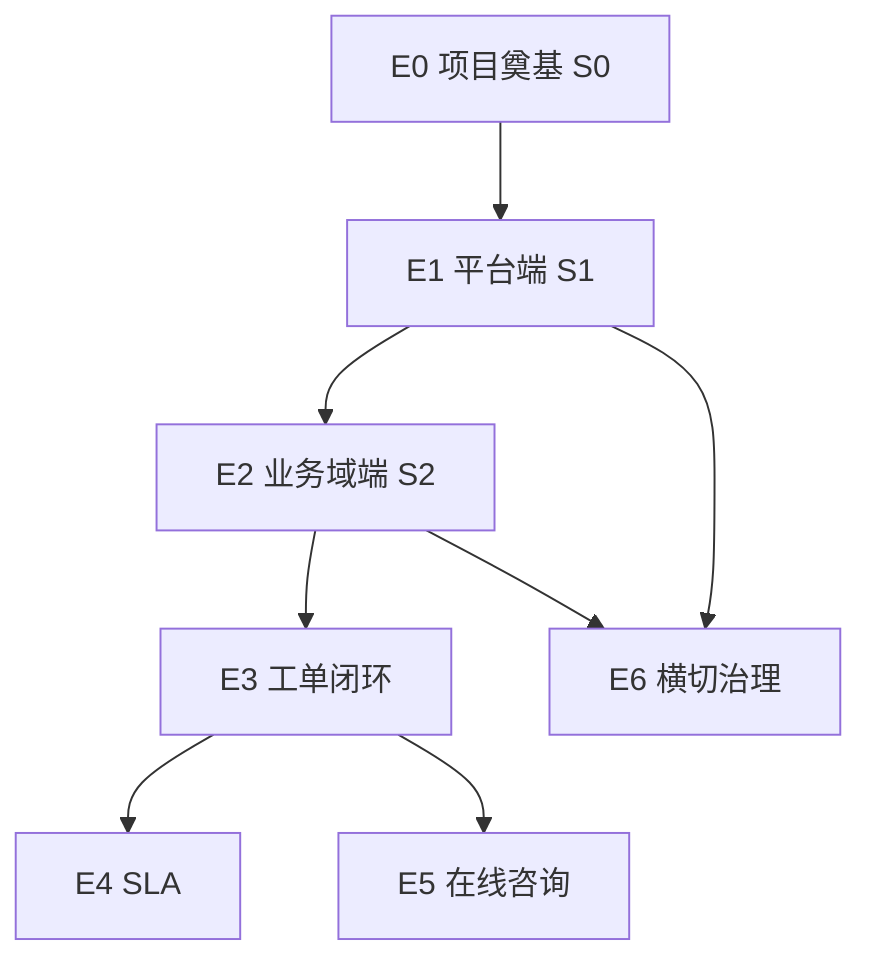

# Product Backlog — Epic 地图

| 文档版本 | 日期 | 说明 |
|:---|:---|:---|
| 1.2 | 2026-05-24 | 管理端双端；FR-03 403 中文；S1 平台端范围 §8.0 |

> 权威链见 [`../README.md`](../README.md)。User Story 明细见 [`backlog-stories.md`](./backlog-stories.md)。S0 执行见 [`sprint-0-plan.md`](./sprint-0-plan.md)。

---

## 1. 与北极星 / 管理端双端

### 1.1 北极星

| 北极星（[`vision.md`](./vision.md)） | 主要 Epic |
|:---|:---|
| 1 个业务域工单闭环率 100% | **E3** 工单最小闭环（下轮规划） |
| 跨域越权 0 次 | **E1** 平台端 + **E2** 业务域端 + **E6** 治理 |
| P0 验收用例 100% | 各 Epic 对应 AC + 后续 qa 目录 |

### 1.2 管理端双端（代码锚点）

同一应用 `UnionDeskAdminWeb`，按路由前缀与 `iam_admin_menu.scope` 分轨（与 [`app-scope.ts`](../../UnionDeskWeb/apps/UnionDeskAdminWeb/src/router/extra-info/app-scope.ts) 一致）：

| 端 | 路由锚点 | 菜单 | 盘点 |
|:---|:---|:---|:---|
| **员工平台端** | **`/platform/`** + 各功能模块 | `scope=platform`，`route_path` 以 `/platform/` 为前缀 | [`implementation-inventory.md`](./implementation-inventory.md) §1～§5 |
| **员工业务域端** | **`/` 根级** + 各功能模块（**非** `/platform/` 前缀） | `scope=business`；路径以后台菜单为准（如 `/home`、`/system/user` 等） | inventory **§7**（待补） |

### 1.3 产品决策（反馈/建议）

- **MVP**：反馈/建议作为 **工单类型预置**（`ticket_type`），在工单类型设计中 **启用/停用**；不单独做 feedback 管理模块。
- **`feedback` 表**：库表保留，MVP 逻辑不使用（见 [`data-model.md`](../architecture/data-model.md) 脚注）。
- **PRD §3.1.1**：独立反馈入口列为二期或与工单类型合并表述（见 [`prd.md`](./prd.md) 修订说明）。

---

## 2. Epic 一览

| Epic | 名称 | Sprint | 状态 | 目标 |
|:---|:---|:---|:---|:---|
| **E0** | 项目奠基与工程骨架 | **S0** | 收口 | Backlog、联调说明、increment-plan、管理端盘点（平台端）、ADR；**零业务功能** |
| **E1** | 员工平台端完善 | **S1** | Committed | **`/platform/*`**：登录、动态菜单、业务域、组织、全局用户/IAM、审计等（PRD §3.4） |
| **E2** | 员工业务域端完善 | **S2** | 规划 | **根级非 `/platform/`** 模块 + 域内配置（PRD §3.3）；business 菜单成品化 |
| **E3** | 工单最小闭环 | S3+ | 占位 | 客户提单 → 客服处理 → 客户查单；含预置反馈/建议类型（PRD §3.1–3.2） |
| **E4** | SLA v1 | S3+ | 占位 | 规则、计时、列表/详情预警 |
| **E5** | 在线咨询 | S3+ | 占位 | 会话、坐席、转工单 |
| **E6** | 平台治理横切 | 跨 Sprint | 部分在 S1 | 审计、step-up、登录日志、敏感操作（PRD §2.4、§3.4.3） |

> **E3–E5**：下轮规划再拆 User Story 与 SP。**E2** 不作为 S0/S1 Committed。

---

## 3. E0→E1 门禁与 PRD 对照

### 3.0 E0→E1 门禁（不另造 E0 定义）

满足 [`sprint-0-plan.md`](./sprint-0-plan.md) **§5 Definition of Done** 且运行时可用：

| 检查项 | 依据 |
|:---|:---|
| S0 文档 DoD | sprint-0-plan §5（inventory、backlog、L3/L4/L5、ADR、无新业务代码） |
| 联调可启动 | sprint-0-plan §3：health、AdminWeb 登录页 |
| Flyway 版本 | 团队确认 ≥ `202605250001`（见 sprint-0-plan §3.2） |
| 平台端可达 | 平台管理员可登录并进入 `/platform/home` |
| IAM 快照 | `GET /api/v1/iam/me/permission-snapshot` 可返回平台菜单 |

未通过则 **S1 / E1 顺延**；**不扩大 S0 范围**。

### 3.1 PRD 功能对照

| PRD | Epic | 路由/说明 |
|:---|:---|:---|
| §3.4 平台管理后台 | **E1** | `/platform/*` |
| §3.3 域管理后台 | **E2** | 根级 + 域上下文（非 `/platform/`） |
| §3.2 员工工单/咨询工作台 | **E3** / **E5** | **不属于 E2**（作业台，非域配置端） |
| §3.1 客户端 | **E3** 等 | CustomerWeb；US-S1-05 仍属 S1 Story，脚注可标后续归 E3 |
| §2.x 身份/域/权限 | **E1**、**E2** | 平台 IAM + 域内角色/成员 |

---

## 4. 时间轴

| 步 | Sprint | Committed | 说明 |
|:---|:---|:---|:---|
| **当前** | **S0** | **E0** | 按 sprint-0-plan、US-S0-01～06 执行；**不重写** |
| **第 2 步** | **S1** | **E1** + **E6** 部分 | 约 13 SP；完善 **`/platform/`**；见 sprint-0-plan §7 |
| **第 3 步** | **S2** | **E2** | 业务域端；**非**当前两步承诺 |
| 下轮 | S3+ | **E3**… | 工单、SLA、咨询 |

**速率假设（solo + Agent）**：S0 ≈ 7 SP；S1 ≈ 13 SP / 2 周。

---

## 5. Epic 依赖

---

## 6. 范围边界

### 6.1 E0（与 sprint-0-plan 一致，不重写）

**做**：Backlog、implementation-inventory（平台端 §1～§5）、sprint-0-plan、increment-plan 骨架、ADR、L3/L4/L5 口径对齐。

**不做**：docker-compose 部署、Flyway rebaseline、新业务 API/UI、CustomerWeb 真实联调。

### 6.2 E1 — 员工平台端（`/platform/`）

**做**：PRD §3.4；inventory §1～§5 中 Partial/Todo 补齐；动态菜单 `scope=platform`。

**不做**：业务域端根级菜单成品化（归 E2）；工单/咨询运行时（归 E3/E5）。

### 6.3 E2 — 员工业务域端（根级非 `/platform/`）

**做**：PRD §3.3（工单类型设计、域 SLA/通知模板、域内成员/客户/角色 UI）；`iam_admin_menu.scope=business` 与页面成品化；反馈/建议 **ticket_type 预置 + 启用/停用**。

**不做**：PRD §3.2 客服作业台（归 E3/E5）；独立 `feedback` 表业务（MVP 不用）。

### 6.4 E3+ 

工单闭环、SLA、在线咨询、客户端深度联调；北极星主路径在 **E3** 验收。

---

## 7. 脚注

|  topic | 说明 |
|:---|:---|
| vision 1 域 vs PRD 3 域 | 演示以 vision 单域为准；多域回归见 PRD §4.1 |
| 环境交付 | 日常联调以 sprint-0-plan §3 已部署环境为准；compose 仅结构参考 |
| inventory 范围 | §1～§5 = 平台端；§7 = 业务域端（待扩） |

---

## 8. E1 平台端 S1 验收摘要

### 8.0 S1 与双控制台边界

- **S1 主验收面 = `/platform/` 平台管理端**（Epic E1）；**不**以 business scope（根级非 `/platform/`）页面成品化作为 S1 完成条件。
- **业务域管理端**菜单与域内配置 UI 归 **S2 / Epic E2**（inventory §7）。
- **US-S1-04/05/06** 为跨端 API 或 CustomerWeb，保留在 S1 Story 列表中，**不**用于判定「业务域管理端已完善」。

1. 平台管理员登录后，动态菜单与 `iam_admin_menu`（**`/platform/`** 模块）一致。
2. 业务域列表/详情/创建可用；入域双配置可 CRUD（与 Git/联调库一致）。
3. 用户、组织、IAM（角色/权限/菜单）**平台侧**主路径可演示（如 `/platform/user`、`/platform/system/menu`；**非** `/system/*` 骨架成品化）。
4. 登录日志、操作日志只读可查。
5. 跨域 API 拒绝（FR-02）有 Story 覆盖。

详见 [`implementation-inventory.md`](./implementation-inventory.md) 与 [`backlog-stories.md`](./backlog-stories.md) Sprint 1。
