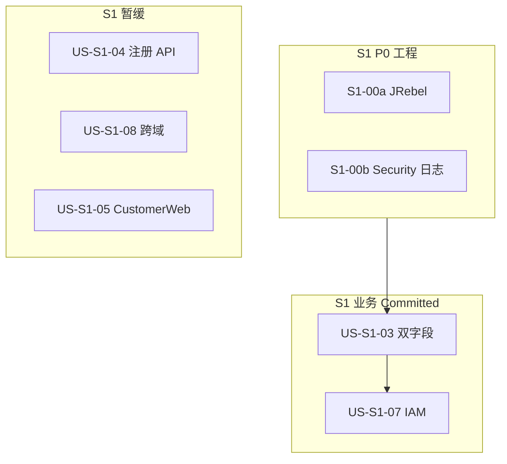

# Sprint 1 计划 — 员工平台端（E1）

| 文档版本 | 日期 | 周期 | 说明 |
|:---|:---|:---|:---|
| 1.2 | 2026-05-26 | 2 周（建议） | **S1 已签 off**（L6 承诺内 Story Done；04/05/08 暂缓） |

> **状态**：**Sprint 1 已关闭**（签 off 见 §11）。下一迭代见 [`sprint-2-plan.md`](./sprint-2-plan.md)（**待负责人更新** Committed）。  
> Committed Story 见 [`backlog-stories.md`](./backlog-stories.md) Sprint 1 章节；Epic 见 [`backlog-epics.md`](./backlog-epics.md) E1。  
> 联调环境继承 [`sprint-0-plan.md`](./sprint-0-plan.md) §3；Flyway 基线 **`202605250001`**。

---

## 1. Sprint 目标

1. **P0 联调工程**：JRebel Maven 热更新（无 IDEA）、消除 Spring Security 默认密码启动日志
2. **三态对齐**：文档 / 联调库 / Git HEAD 均已双字段（`registration_enabled` / `invitation_enabled`）；**US-S1-03 Done**
3. **平台端收口**：IAM（US-S1-07 Done）、域与客户（US-S1-02/06 Done）、日志（US-S1-09 Done）；**US-S1-04 / US-S1-08 / US-S1-05** 仍 **S1 暂缓**
4. **不擅自展开** S2+ Epic（E2 业务域端、E3 工单闭环等，见 backlog §Sprint 2）

---

## 2. Committed Stories（约 13 SP 内）

| 顺序 | ID | 标题 | SP | 类型 | 状态 |
|:---|:---|:---|:---|:---|:---|
| 0a | S1-00a | JRebel Maven 热更新 | 1 | 工程 P0 | Done |
| 0b | S1-00b | 消除 Security 默认密码日志 | 0.5 | 工程 P0 | Done |
| 1 | US-S1-03 | 入域双配置 CRUD | 3 | 业务 | Done |
| 2 | US-S1-07 | IAM 角色/权限/按钮 | 5 | 业务 | Done |

**说明**：

- **US-S1-04**（客户注册 API，3 SP）、**US-S1-08**（跨域访问拒绝，3 SP）、**US-S1-05**（CustomerWeb，5 SP）：**S1 暂缓**（US-S1-04 决策 2026-05-30；其余 2026-05-26），不占用 Committed 顺序与签 off 前提；Story 仍保留于 backlog，后续 Sprint 再排（US-S1-04/05 建议归 E3）。
- **0a/0b 最高优先**：后续 S1 编码均受益；评审通过后先落地再进业务 Story。
- US-S1-01/02/06/09 随主路径联调验收，**不单独占 Committed 顺序**；截至 2026-05-26 均已 **Done**（详见 backlog）。



---

## 3. 三态提醒（US-S1-03 前置）

| 态 | 现状（2026-05-26） |
|:---|:---|
| **文档**（L3/L5/L6） | `registration_enabled` / `invitation_enabled` |
| **联调库** | Flyway max **`202605330003`**；`business_domain` 双字段列存在，无 `registration_policy` |
| **Git HEAD 代码** | domain / AdminWeb `domains/` **无** `registration_policy` 残留 |

---

## 4. P0 工程：S1-00a JRebel Maven 热更新

> **状态**：Done（2026-05-25 确认；commit `3ebfc60`）。

### 4.1 目标

- 后端 Java 类变更后 **不整进程重启**（在 JRebel 能力边界内）
- 通过 Maven 插件在 `process-resources` 生成 `rebel.xml`
- 文档化无 IDEA 启动方式

### 4.2 实现规格

| 项 | 内容 |
|:---|:---|
| 插件 | `org.zeroturnaround:jrebel-maven-plugin` **1.2.1** |
| 绑定 | `process-resources` → `generate` |
| 产出 | `UnionDesk/target/classes/rebel.xml`（**不入 Git**） |
| 改动文件 | [`UnionDesk/pom.xml`](../../UnionDesk/pom.xml)、[`UnionDesk/README.md`](../../UnionDesk/README.md) 或本文 §6 |

**pom.xml 要点**：

```xml
<plugin>
  <groupId>org.zeroturnaround</groupId>
  <artifactId>jrebel-maven-plugin</artifactId>
  <version>1.2.1</version>
  <configuration>
    <addResourcesDirToRebelXml>true</addResourcesDirToRebelXml>
  </configuration>
  <executions>
    <execution>
      <id>generate-rebel-xml</id>
      <phase>process-resources</phase>
      <goals><goal>generate</goal></goals>
    </execution>
  </executions>
</plugin>
```

**生成命令**：

```powershell
cd UnionDesk
.\mvnw.cmd process-resources
# 或
.\mvnw.cmd jrebel:generate -Drebel.generate.show=true
```

**运行**（本机已安装 JRebel 与有效 license；路径按 `JREBEL_HOME` 调整）：

```powershell
$env:JREBEL_HOME = "C:\path\to\jrebel"
cd UnionDesk
.\mvnw.cmd spring-boot:run `
  -Dspring-boot.run.jvmArguments="-agentpath:$env:JREBEL_HOME\lib\jrebel64.dll"
```

### 4.3 验收

- [x] `target/classes/rebel.xml` 存在，classpath 指向 `target/classes` 与 `src/main/resources`
- [x] 修改任意 `@RestController` 方法后 **不重启进程** 即可在联调中生效
- [x] JRebel 控制台无报错

### 4.4 边界

- **Flyway / DDL / 实体映射涉及 schema** 变更仍须重启并 migrate
- JRebel 为 **开发联调** 能力；CI / 生产构建 **不** 依赖 JRebel
- License 自备，**不入库**

---

## 5. P0 工程：S1-00b 消除 Security 默认密码日志

> **状态**：Done（`application.yml` exclude `UserDetailsServiceAutoConfiguration`）。

### 5.1 现象

启动时出现：

```text
Using generated security password: ...
This generated password is for development use only...
```

### 5.2 根因

- 项目已引入 `spring-boot-starter-security`，[`CorsSecurityConfig`](../../UnionDesk/src/main/java/com/uniondesk/common/web/CorsSecurityConfig.java) 为 **JWT 无状态**（禁用 formLogin / httpBasic）
- 未提供 `UserDetailsService` / `AuthenticationManager` Bean 时，Spring Boot 仍启用 `UserDetailsServiceAutoConfiguration`，自动生成 `user` 并打印密码

### 5.3 推荐修复

在 [`application.yml`](../../UnionDesk/src/main/resources/application.yml) 增加：

```yaml
spring:
  autoconfigure:
    exclude:
      - org.springframework.boot.autoconfigure.security.servlet.UserDetailsServiceAutoConfiguration
```

**备选**（若 exclude 与后续测试冲突）：提供占位 `UserDetailsService` Bean — 优先 exclude，改动更小。

### 5.4 验收

- [x] 启动日志 **不再** 出现 `Using generated security password`
- [x] `/api/v1/auth/login`、JWT 过滤器、403 中文响应 **行为不变**
- [x] [`JwtAuthenticationFilterTests`](../../UnionDesk/src/test/java/com/uniondesk/auth/core/JwtAuthenticationFilterTests.java) 通过

### 5.5 不做

- 不引入 HTTP Basic 默认用户
- 不为此单独加 `spring.security.user.*` 假账号（仍可能打日志）

---

## 6. 联调环境

> **完整说明见 [`sprint-0-plan.md`](./sprint-0-plan.md) §3。** 开发环境已部署，勿重复 docker-compose。

### 6.1 日常启动（无 JRebel）

```powershell
# 后端
cd UnionDesk
.\mvnw.cmd spring-boot:run

# 管理端
cd UnionDeskWeb
pnpm install
pnpm -C apps/UnionDeskAdminWeb dev
```

### 6.2 检查项

| 检查项 | 预期 |
|:---|:---|
| 后端 health | `GET http://127.0.0.1:8080/actuator/health` → `{"status":"UP"}` |
| AdminWeb | Vite 本地端口，登录页可访问 |
| 登录默认首页 | 具备 `platformAccess` 的账号登录后进入 `/platform/home`，**非** `/system/menu`（`resolve-home-path.ts`） |
| Flyway | 启动日志 schema 版本 ≥ `202605250001` |

### 6.3 后端变更后

- 涉及 Flyway / 配置 / Bean 结构：须 **重启** 后端并确认 health（AGENTS 约定）
- JRebel 生效后：**纯 Java 类** 热更可免重启（见 §4）

---

## 7. Flyway 策略（S1）

见 [`database-increment-plan.md`](../architecture/database-increment-plan.md) §1。

- **S1 进行中**：增量写入 `db/migration/current/`；**迁移前** 运行 [`backup-db`](../../UnionDesk/scripts/backup-db.ps1)（见 [`backup-restore.md`](../operations/backup-restore.md)）
- **S1 末**：评估管理端菜单稳定后 squash rebaseline（**须先全库备份**）
- **US-S1-03**：`V202605250001` 已在联调库执行；代码对齐时确认 Git 中迁移脚本与 history 一致

---

## 8. Definition of Done

- [x] S1-00a / S1-00b 验收通过（§4.3、§5.4）
- [x] Committed Story（§2 表）AC 满足，backlog 状态已更新（US-S1-03/07 Done；04/05/08 暂缓）
- [x] 双字段三态对齐：API / UI / 库表无 `registration_policy` 残留（联调库 2026-05-26 复验）
- [x] 无擅自展开 S2+ Story（E2/E3 未 Committed）
- [x] Flyway 新版本已在 increment-plan §2 登记（至 V202605330003）
- [x] 与代码偏差已登记 [`qa/implementation-traceability.md`](../qa/implementation-traceability.md)

---

## 9. 风险

| 风险 | 缓解 |
|:---|:---|
| JRebel license / Agent 路径因机器而异 | 文档写占位路径；各开发自备 license |
| JRebel vs Flyway | 改 `db/migration/*.sql` 或 schema 映射时仍须重启 + migrate |
| exclude `UserDetailsServiceAutoConfiguration` | 若未来 Security 集成测试依赖默认用户，改测试配置 |
| CustomerWeb / 注册 API 与联调不一致 | US-S1-04 / US-S1-05 S1 暂缓，后续 E3 再排 |
| 菜单迁移过多 | S1 末 rebaseline（同 sprint-0-plan §4） |

---

## 10. 评审后编码顺序

待本计划评审通过后，按序执行（**不在计划文档任务内**）：

1. `UnionDesk/pom.xml` — jrebel-maven-plugin
2. `application.yml` — exclude `UserDetailsServiceAutoConfiguration`
3. `UnionDesk/README.md` — JRebel 启动步骤
4. US-S1-03 及 §2 表后续业务 Story

---

## 11. 签 off（权威记录）

| 项 | 内容 |
|:---|:---|
| **结论** | **Sprint 1 通过**（L6 承诺范围内 Story 均已 Done） |
| **签 off 日期** | 2026-05-26 |
| **负责人** | 待填写 |
| **暂缓（不纳入 S1）** | US-S1-04、US-S1-05、US-S1-08 |
| **偏差登记** | [`qa/implementation-traceability.md`](../qa/implementation-traceability.md) |

> 临时勾选见 [`.codex-tmp/S1-closure-tracker.md`](../../.codex-tmp/S1-closure-tracker.md)（不入 Git）；**以本节与 L6 backlog 为准**。
