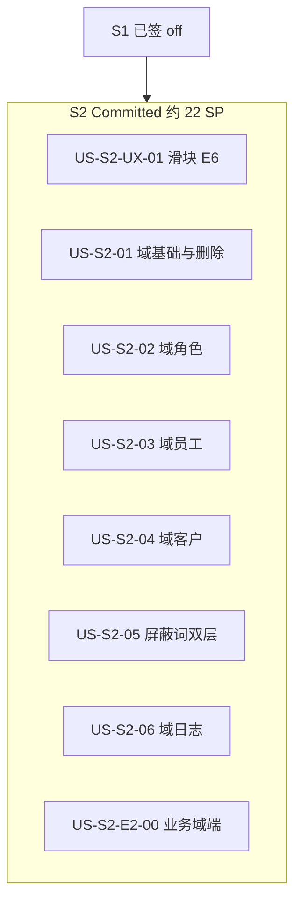

# Sprint 2 计划 — E2 业务域端 + 平台域详情深化 + 登录体验

| 文档版本 | 日期 | 周期 | 说明 |
|:---|:---|:---|:---|
| 2.1 | 2026-05-26 | 2 周（建议） | Story 权限码与范围细化（02 只读；软删字段约定） |

> **状态**：**Committed**（与 L6 [`backlog-stories.md`](./backlog-stories.md) Sprint 2 章节同步）。  
> **前提**：S1 已签 off（见 [`sprint-1-plan.md`](./sprint-1-plan.md) §11）。  
> 联调环境继承 [`sprint-0-plan.md`](./sprint-0-plan.md) §3；Flyway 策略见 [`database-increment-plan.md`](../architecture/database-increment-plan.md) §3。

---

## 1. Sprint 目标

1. **E2 主路径**：员工**业务域端**最小可达（`scope=business`，根级非 `/platform/`）—— **US-S2-E2-00**。
2. **平台域超额（S2 扩展）**：在 **`/platform/domains/*`** 详情内完善业务域配置、域内角色/员工/客户、双层屏蔽词库、域内业务日志—— **US-S2-01～06**（后端 API 多已存在，以 UI/交互与缺口 API 为主）。
3. **体验（E6 横切）**：**US-S2-UX-01** 登录滑块交互优化（纳入 S2 签 off，可与上列并行）。
4. **不擅自展开**：S3+（E3 工单闭环、E4 SLA、E5 咨询）、**US-S2-E2-01** 工单类型设计（Stretch）、**US-S1-08** 跨域拦截、**US-S1-04/05** 客户注册/CustomerWeb。



---

## 2. Committed Stories

> 详细 AC 见 [`backlog-stories.md`](./backlog-stories.md) Sprint 2 章节；**不以本表代替 L6**。

| 顺序 | ID | 标题 | SP | 类型 | 状态 |
|:---|:---|:---|:---|:---|:---|
| UX | US-S2-UX-01 | 登录滑块验证体验优化 | 2 | E6 横切 | Todo |
| 1 | US-S2-01 | 业务域基础信息与安全删除 | 3 | 平台域超额 | Todo |
| 2 | US-S2-02 | 角色管理（只读） | 2 | 平台域超额 | Todo |
| 3 | US-S2-03 | 域内员工管理 | 5 | 平台域超额 | Todo |
| 4 | US-S2-04 | 域内客户管理完善 | 2 | 平台域超额 | Todo |
| 5 | US-S2-05 | 双层屏蔽词库（平台全局 + 域内） | 3 | 平台域超额 | Todo |
| 6 | US-S2-06 | 域内业务日志 | 2 | 平台域超额 | Todo |
| E2 | US-S2-E2-00 | 业务域端最小可达 | 3 | E2 主路径 | Todo |
| | | **合计** | **22** | | |

### 2.1 Stretch / 延后（不纳入 S2 签 off）

| ID | 说明 |
|:---|:---|
| US-S2-E2-01 | 工单类型设计（PRD §3.3.1） |
| US-S1-08 | 跨域访问拒绝 |
| US-S1-04 / US-S1-05 | 客户注册 API / CustomerWeb（建议 E3） |

---

## 3. 范围边界

### 3.1 做

| 范围 | Story | 要点 |
|:---|:---|:---|
| 平台域详情 | US-S2-01～06 | `/platform/domains/detail` 各 Tab；`shared` API 封装；权限 Flyway |
| 业务域端 | US-S2-E2-00 | `scope=business` 菜单/首页/至少一条主路径 |
| 登录滑块 | US-S2-UX-01 | §4；无后端变更 |
| 删除域 | US-S2-01 | 软删写 `deleted_at`/`updated_at`/`updated_by`；**无 `deleted` 列**；权限 **`platform.domain.control.deleted`** |
| 角色管理 | US-S2-02 | **只读**；权限 **`platform.domain.roles.*`** |
| 屏蔽词 | US-S2-05 | **`platform.blocked_word.*`**（全局）/ **`platform.domain.blocked_word.*`**（域内） |
| 域日志 | US-S2-06 | **`platform.audit-logs.read`** |
| E2 首页 | US-S2-E2-00 | 快照含任意 **`platform.*`** 权限 → 视为平台权限 |

### 3.2 不做

- E3 工单运行时、CustomerWeb 滑块（除非另立 Story）
- 改写 captcha 后端校验算法（`/api/v1/auth/captcha/*`）
- 客户自助注册 API（US-S1-04 仍延后）
- 首页仪表盘真实聚合（inventory §1 Partial）

---

## 4. US-S2-UX-01 登录滑块验证体验优化

> **状态**：Todo（S2 Committed；可与 §2 平台域 Story 并行）。

### 4.1 用户故事

作为登录用户，我希望滑块验证按住有清晰反馈、滑到终点可自然松手，以便完成验证时不困惑。

### 4.2 验收标准（AC）

1. **按住反馈**：指针按下滑块按钮时，按钮视觉放大（如 `scale` 或尺寸增大）；松开且未进入成功态时恢复默认尺寸。
2. **终点松手**：滑动至最右侧（≥95%，与现 [`utils.ts`](../../UnionDeskWeb/packages/shared/src/components/SliderCaptcha/utils.ts) 逻辑一致）后松开指针，无「粘住 / 无法脱手」感；松手后进入校验中或成功态过渡自然，**无多余回弹到起点**（除非校验失败）。
3. **顿挫感**：拖动过程中滑块 `left` 无多余 CSS 过渡；终点松手到成功 / 失败反馈之间无明显卡顿（允许异步校验 loading，但需有**即时**视觉反馈）。
4. **范围**：改动 shared `SliderCaptcha` + AdminWeb `LoginCaptcha` 联调通过；`pnpm -C UnionDeskWeb run typecheck` 通过。

### 4.3 实现要点

| 用户诉求 | 建议实现 |
|:---|:---|
| 按住变大 | `status === 'moving'` 或 `:active` 时为 `.slider-captcha-slider` 增加 `transform: scale(1.08)`（及略强 shadow）；`transition` **仅**用于 transform，**不**用于 `left` |
| 未按住恢复 | `handleEnd` / `reset` / 未拖满回弹时移除 `moving` 类，scale 还原 |
| 终点脱手 / 顿挫 | ① 拖动中 `left` 保持 `transition: none`（已有 `.moving`）② 终点松手后保持滑块位置，设 `verifying` 或等价态 ③ 可选 Pointer Events + `setPointerCapture` ④ 校验失败再 `reset()` |

**疑似根因**：[`styles.css`](../../UnionDeskWeb/packages/shared/src/components/SliderCaptcha/styles.css) 中 `.slider-captcha-slider` 对 `left` 设置了 `transition: 0.3s ease`。

### 4.4 代码锚点

| 项 | 路径 |
|:---|:---|
| 滑块组件 | `UnionDeskWeb/packages/shared/src/components/SliderCaptcha/index.tsx` |
| 样式 | `UnionDeskWeb/packages/shared/src/components/SliderCaptcha/styles.css` |
| AdminWeb 接入 | `UnionDeskWeb/apps/UnionDeskAdminWeb/src/pages/login/components/login-captcha.tsx` |

---

## 5. 平台域 / E2 Story 摘要（AC 详见 backlog）

| ID | 验收要点 |
|:---|:---|
| US-S2-01 | 回显/更新；软删写 **`updated_at`/`updated_by`/`deleted_at`**（**无 `deleted` 列**）；删除权限 **`platform.domain.control.deleted`**；code + Step-up |
| US-S2-02 | Tab 名 **「角色管理」**；**只读**列表（可选只读权限查看）；**`platform.domain.roles.*`** |
| US-S2-03 | 添加员工、改角色、移除；**成员禁用/启用 API**；最后 `domain_admin` 校验 |
| US-S2-04 | 在 US-S1-06 基础上：单条编辑/启停、筛选与空态；不含注册 API |
| US-S2-05 | 全局 **`platform.blocked_word.*`** + 域内 **`platform.domain.blocked_word.*`** |
| US-S2-06 | 操作/登录日志 Tab；**`platform.audit-logs.read`** |
| US-S2-E2-00 | 无 `platform.*` 权限 → 业务域首页；快照含 **`platform.*`** → 视为平台权限 |

---

## 6. 联调与验证

### 6.1 环境

继承 [`sprint-0-plan.md`](./sprint-0-plan.md) §3；涉及 Flyway 须重启后端并确认 `GET /actuator/health` → UP。

### 6.2 US-S2-UX-01 手工检查项

| 检查项 | 预期 |
|:---|:---|
| 按住滑块 | 按钮放大；光标为 grabbing |
| 中途松开（未拖满） | 按钮恢复默认尺寸；滑块回起点 |
| 拖至最右松手 | 无粘滞；校验通过后 success |
| typecheck | `pnpm -C UnionDeskWeb run typecheck` 通过 |

### 6.3 命令

```powershell
cd UnionDeskWeb
pnpm run typecheck
pnpm -C apps/UnionDeskAdminWeb dev

cd UnionDesk
.\mvnw.cmd test
.\mvnw.cmd spring-boot:run
```

---

## 7. Definition of Done

- [ ] §2 Committed Story（含 **US-S2-UX-01**）AC 满足，`backlog-stories.md` 状态已更新
- [ ] 无擅自展开 Stretch / S3+ Story
- [ ] S2 相关 Flyway 已在 [`database-increment-plan.md`](../architecture/database-increment-plan.md) §3 登记并执行
- [ ] 与代码偏差登记 [`qa/implementation-traceability.md`](../qa/implementation-traceability.md)（若有）
- [ ] `implementation-inventory.md` §3 / §7 与交付一致

---

## 8. 风险

| 风险 | 缓解 |
|:---|:---|
| Committed **22 SP** 仍偏满 | Stretch 仅 E2-01；US-S2-02 已降为只读 2 SP |
| 全局屏蔽词需 schema 变更 | 开发前登记 increment-plan；先备份库 |
| 成员启停无现成 API | US-S2-03 前置后端接口 + 权限码 |
| 滑块改动影响轨迹校验 | 不改归一化算法；仅交互与 CSS |

---

## 9. 评审后编码顺序

**可并行（无后端）**：US-S2-UX-01

**建议主序**：

1. US-S2-01
2. US-S2-03（含成员 status API）
3. US-S2-02（只读角色管理）
4. US-S2-04 / US-S2-05 / US-S2-06（可并行）
5. US-S2-05 全局词库（Flyway + 重启）
6. US-S2-E2-00
