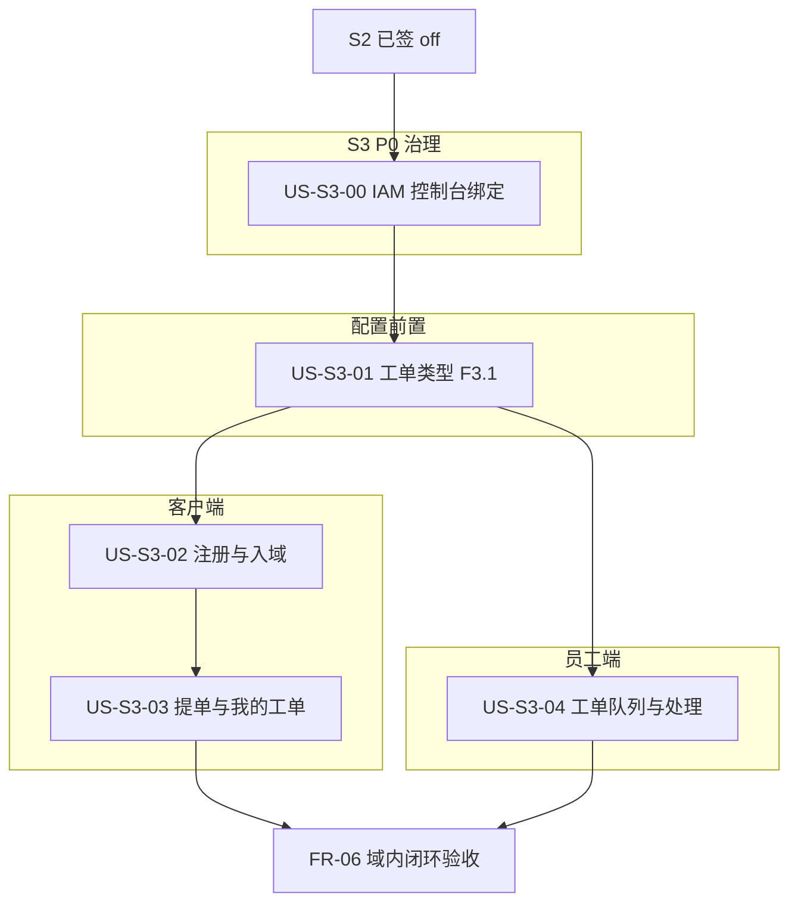

# Sprint 3 计划 — E3 工单最小闭环 + IAM 治理前置

| 文档版本 | 日期 | 周期 | 说明 |
|:---|:---|:---|:---|
| 1.0 | 2026-06-16 | 2 周（建议） | S2 已签 off；S3 Committed 草案待评审 |
| 1.1 | 2026-06-17 | 2 周（建议） | US-S3-00 Done；US-S3-01 Done |

> **状态**：**编码中**（US-S3-00、US-S3-01 Done，2026-06-17；Committed 余 US-S3-02～04）。  
> **前提**：S2 已签 off（见 [`sprint-2-plan.md`](./sprint-2-plan.md) §10，2026-06-15）。  
> 联调环境继承 [`sprint-0-plan.md`](./sprint-0-plan.md) §3；Flyway 策略见 [`database-increment-plan.md`](../architecture/database-increment-plan.md) §3。

---

## 1. Sprint 目标

1. **北极星主路径（E3）**：在 **至少 1 个已启用业务域** 内跑通 **FR-06** 工单最小闭环——客户提单 → 客服处理 → 客户可查进度与公开回复（见 `[vision.md](./vision.md)` §2、`foundation-rules.md` §5.1 FR-06）。
2. **配置前置（E2 余量）**：域内 **工单类型与模板** 可配置（承接 S2 Stretch **US-S2-E2-01**，US-S3-01 F3.1 已交付），支撑提单动态字段与状态流校验（TR-01）。
3. **客户端入域（E3）**：完成 S1 暂缓的 **US-S1-04/05**——客户注册/入域走真实 API，替代 CustomerWeb demo portal。
4. **治理前置（E6）**：**US-S3-00** IAM 角色—控制台绑定对齐，避免 `platform.`* 与 `ticket.*` 混包导致菜单/首页/工单权限验收失真。
5. **不擅自展开**：E4 SLA 完整 UI、E5 在线咨询运行时、工单低代码画布全量、docker-compose 一键交付、US-S1-08 跨域系统化（均列 Stretch 或 S4+）。




---

## 2. Committed Stories

> 详细 AC 见 `[backlog-stories.md](./backlog-stories.md)` Sprint 3 章节；**不以本表代替 L6**。


| 顺序  | ID       | 标题                   | SP     | 类型       | 状态   |
| --- | -------- | -------------------- | ------ | -------- | ---- |
| P0 | US-S3-00 | IAM 角色—控制台绑定对齐 | 3 | E6 横切 | Done |
| 1   | US-S3-01 | 工单类型与模板配置（F3.1）       | 5      | E2/E3 前置 | Done |
| 2   | US-S3-02 | 客户注册与 CustomerWeb 入域 | 4      | E3 客户端   | Todo |
| 3   | US-S3-03 | CustomerWeb 提单与我的工单  | 5      | E3 客户端   | Todo |
| 4   | US-S3-04 | 员工端工单队列与处理           | 5      | E3 员工端   | Todo |
|     |          | **合计**               | **22** |          |      |


### 2.1 Stretch / 延后（不纳入 S3 签 off）


| ID             | 说明                                                | 建议归属            |
| -------------- | ------------------------------------------------- | --------------- |
| US-S3-E4-01    | SLA 规则配置 UI（后端 `SlaController` 已有）                | S3 Stretch / S4 |
| US-S3-E4-02    | 工单列表/详情 SLA 高亮感知                                  | S3 Stretch / S4 |
| US-S3-UX-02    | 审计日志语义化（openspec `audit-log-semantics`）           | Stretch         |
| US-S3-UX-03    | 平台日志页双入口收敛（`platform/log/`* vs `audit-logs` Tabs） | Stretch         |
| US-S1-08       | 跨域访问拒绝 FR-02 系统化                                  | S4+             |
| US-S2-01 AC4   | 已软删域直链详情门控                                        | S3+             |
| US-S2-E2-01 余量 | 工单状态流可视化画布 / Formily 设计器全量                        | S4+             |
| US-S3-E5-01    | 在线咨询工作台运行时                                        | S4+（E5）         |


### 2.2 S1/S2 承接映射


| 原 Story                     | S3 承接                                            |
| --------------------------- | ------------------------------------------------ |
| US-S2-E2-01 工单类型设计（Stretch） | **US-S3-01**（F3.1：Formily + DAG + 系统字段 + 模板 CRUD） |
| US-S1-04 客户注册 API           | **US-S3-02** AC 之一                               |
| US-S1-05 CustomerWeb 真实 API | **US-S3-02** + **US-S3-03**                      |


---

## 3. 现状与差距（2026-06-16）


| 能力         | 后端                              | 前端                                             | S3 动作                          |
| ---------- | ------------------------------- | ---------------------------------------------- | ------------------------------ |
| 工单 CRUD/流转 | `TicketController` 已齐           | `ticket-pool` / `ticket-detail` 为 P0，含 demo 回退 | **US-S3-04** 成品化 + business 菜单 |
| 工单类型/模板    | `TicketConfigController` + Validators | 域详情「工单管理」Tab + Drawer 设计器 | **US-S3-01 Done**              |
| 客户提单/查单    | 客户侧 API 已齐                      | CustomerWeb 走 demo `portal`                    | **US-S3-03**                   |
| 客户注册       | `register` 存在；S1 未验完整 AC        | CustomerWeb 未接真实 API                           | **US-S3-02**                   |
| SLA        | `SlaController` + 单测            | 无配置/感知 UI                                      | Stretch                        |
| 在线咨询       | `ConsultationController` 为 demo | 无                                              | 不做                             |
| IAM 双控制台 | Flyway + 策略/快照校验已落地 | E2-00 三元规则 | **Done**（US-S3-00） |


---

## 4. 范围边界

### 4.1 做


| 范围     | Story    | 要点                                                                                                   |
| ------ | -------- | ---------------------------------------------------------------------------------------------------- |
| IAM 治理 | US-S3-00 | `role.scope` 与菜单/权限包一致；`admin`→`platform_admin`；快照过滤；见 openspec `iam-role-console-binding-alignment` |
| 工单配置   | US-S3-01 | 平台域详情「工单管理」Tab；Formily 表单 + React Flow DAG；`GET/POST/PUT/DELETE .../ticket-types` + templates |
| 客户端入域  | US-S3-02 | DR-01/DR-02；`/api/v1/auth/register`；域列表尊重 `registration_enabled`                                     |
| 客户端工单  | US-S3-03 | 提单、我的工单列表/详情、公开回复、撤回（TR-03）                                                                          |
| 员工工单   | US-S3-04 | business scope 队列 + 详情；领取/指派/回复/状态变更；权限 `ticket.`* + `AuthGuarded`                                   |
| 闭环验收   | §6       | 单域端到端：客户账号 → 提单 → agent 领取处理 → 客户可见回复                                                                |


### 4.2 不做

- 在线咨询排队/聊天/转工单（E5）
- SLA 工作日历引擎、违约动作全量（E4 余量）
- 工单 Formily 低代码画布、状态流 DAG 可视化编辑器全量
- CustomerWeb 滑块/captcha 算法改造（除非另立 Story）
- 知识库、BI、i18n（vision §4 非目标）
- 改写 `/api/v1/auth/captcha/*` 后端校验算法

---

## 5. Story 摘要（AC 详见 backlog）

### US-S3-00 IAM 角色—控制台绑定对齐

- 平台角色（`scope=global`）仅 `platform.*` + `iam_admin_menu.scope=platform`
- 域角色（`scope=domain`）仅 business 菜单 + 非 `platform.*` 业务码（`ticket.*`、`domain.*` 等）
- 保存角色菜单/权限时 scope 校验；快照合并双重过滤
- `admin` 种子绑定 `platform_admin`；清理混包直授
- Flyway 登记 increment-plan §3

### US-S3-01 工单类型与模板配置（F3.1）

- 域详情「工单管理」Tab：类型 + 模板双列表；Drawer 三 Tab（基础 / Formily 表单 / React Flow DAG）
- 系统字段 title、description 必填且不可删；TR-01 终态校验 + 图完整性
- 预置「反馈」「建议」类型可启用/停用；权限 `platform.domain.control.ticket_type.*`
- Flyway `V202606170001`；openspec `ticket-type-config-s3-01`

### US-S3-02 客户注册与 CustomerWeb 入域

- 注册 API 完整 AC：双字段校验、邀请码 `invitation_enabled`、中文错误
- CustomerWeb 登录/注册页调用真实 API；域下拉仅 `registration_enabled=allowed`
- 完成 US-S1-04/05 backlog 状态 → Done

### US-S3-03 CustomerWeb 提单与我的工单

- 服务首页/提单页调用 `POST /api/v1/domains/{id}/tickets`
- 我的工单：`GET .../tickets/my`、详情、客户回复、撤回
- 错误与空态中文；typecheck 通过

### US-S3-04 员工端工单队列与处理

- business scope 菜单挂载工单队列（非仅 `/platform/ticket-pool` P0）
- 列表筛选（状态/关键词）；详情时间线、领取、指派、回复、状态变更
- 对接 `GET/POST/PATCH .../admin/domains/{id}/tickets*`；移除 demo 回退为主路径
- 权限 `ticket.view_domain_all`、`ticket.claim`、`ticket.reply`、`ticket.close` 等

---

## 6. 联调与验证

### 6.1 环境

继承 sprint-0-plan §3；Flyway 变更后重启后端，`GET /actuator/health` → UP。

### 6.2 FR-06 闭环手工检查项


| 步骤  | 角色       | 预期                               |
| --- | -------- | -------------------------------- |
| 1   | 域管理员     | 配置至少 1 个启用工单类型（US-S3-01）         |
| 2   | 客户       | 注册并入域（US-S3-02）                  |
| 3   | 客户       | 提交工单，获得工单号（US-S3-03）             |
| 4   | 客服 agent | 在 business 工单队列看到工单并领取（US-S3-04） |
| 5   | 客服       | 公开回复并变更状态至终态                     |
| 6   | 客户       | 我的工单可见回复与状态更新                    |


### 6.3 命令

```powershell
cd UnionDeskWeb
pnpm run typecheck
pnpm -C apps/UnionDeskAdminWeb dev
pnpm -C apps/UnionDeskCustomerWeb dev

cd UnionDesk
.\mvnw.cmd test
.\mvnw.cmd spring-boot:run
```

---

## 7. Definition of Done

- §2 Committed Story AC 满足，`backlog-stories.md` 状态已更新
- FR-06 单域闭环可演示（§6.2）
- 无擅自展开 Stretch / S4+ Story
- S3 相关 Flyway 已在 `database-increment-plan.md` §3 登记并执行
- 偏差登记 `qa/implementation-traceability.md`
- `implementation-inventory.md` §7 / 工单相关行与交付一致

---

## 8. 风险


| 风险                             | 缓解                                     |
| ------------------------------ | -------------------------------------- |
| Committed **22 SP** 与 S2 同量级偏满 | Stretch 明确不纳入签 off |
| IAM Flyway 影响现有账号快照 | US-S3-00 已 Done；联调库 migrate 后 `admin` 冒烟 |
| 工单权限码与菜单未挂 business 树 | US-S3-04 阶段补 Flyway 菜单 + 联调 |
| CustomerWeb 仍混用 demo portal    | US-S3-02/03 明确移除主路径 demo 回退            |
| 后端 API 已存在但 DTO 与前端类型漂移        | 以 `shared` 封装为单点；提 PR 前 typecheck      |


---

## 9. 评审后编码顺序

**建议主序**：

1. ~~**US-S3-00**（IAM 对齐 + Flyway）~~ **Done**
2. ~~**US-S3-01**（工单类型 F3.1 + Flyway V202606170001）~~ **Done**
3. **US-S3-02**（客户注册与入域）← **当前**
4. **US-S3-03**（客户提单，依赖 02）
5. **US-S3-04**（员工处理，可与 03 并行）

**可并行**：US-S3-03 与 US-S3-04 在 US-S3-02 就绪后并行。

---

## 10. 签 off


| 项                   | 记录                                            |
| ------------------- | --------------------------------------------- |
| **签 off 日期**        | *待 S3 完成*                                     |
| **Committed Story** | US-S3-00～04                                   |
| **Stretch 未纳入**     | §2.1 表                                        |
| **收口跟踪**            | `.codex-tmp/S3-closure-tracker.md`（编码启动时可选创建） |
| **合并基线**            | S2 签 off 后 `master` HEAD                      |


