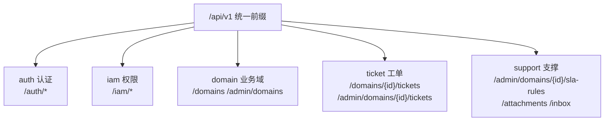
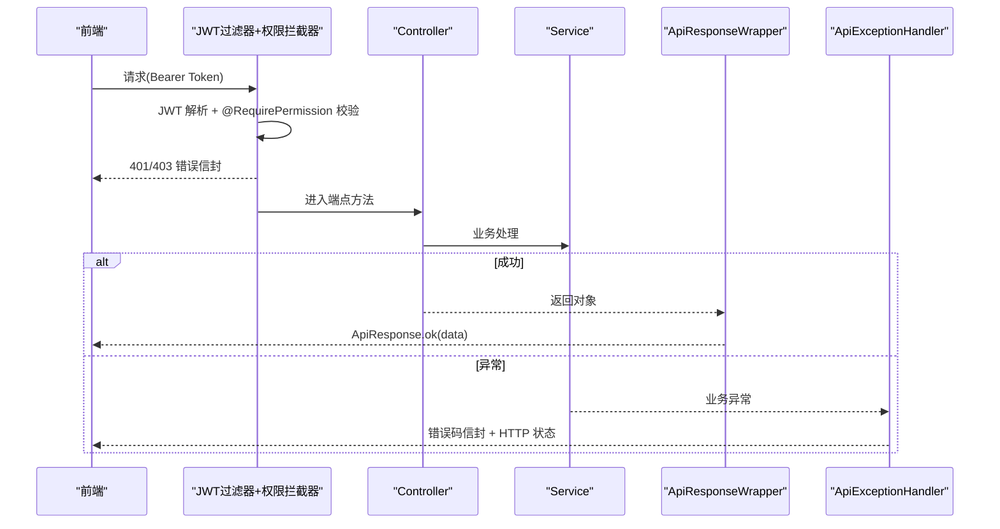
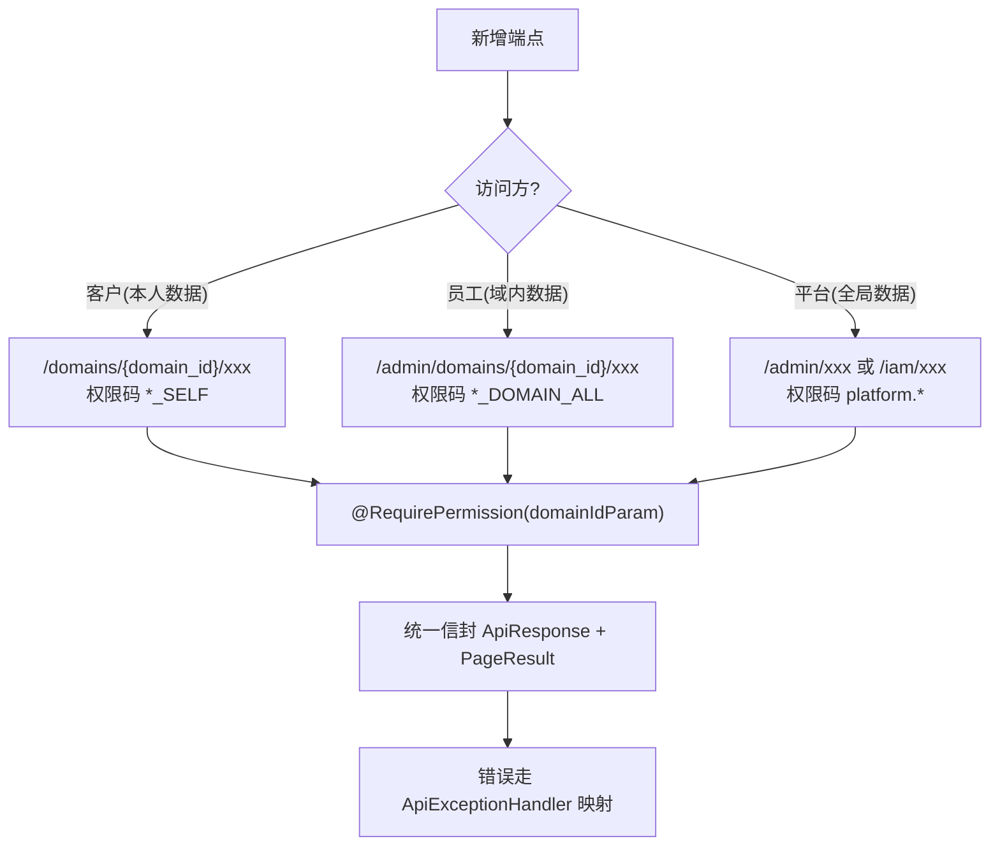
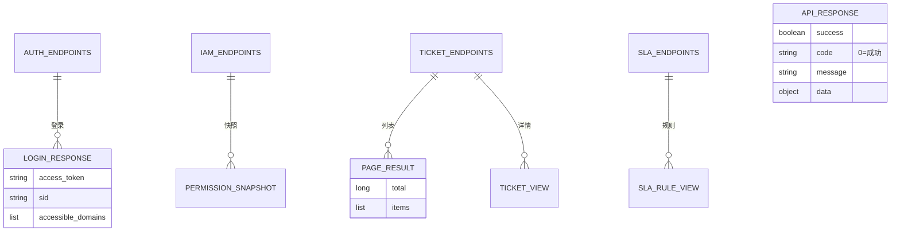

<cite>
- [UnionDesk/uniondesk-app/src/main/java/com/uniondesk/auth/web/AuthController.java](file://UnionDesk/uniondesk-app/src/main/java/com/uniondesk/auth/web/AuthController.java#L31-L96)
- [UnionDesk/uniondesk-iam/src/main/java/com/uniondesk/iam/web/IamController.java](file://UnionDesk/uniondesk-iam/src/main/java/com/uniondesk/iam/web/IamController.java#L1-L20)
- [UnionDesk/uniondesk-domain/src/main/java/com/uniondesk/domain/web/DomainController.java](file://UnionDesk/uniondesk-domain/src/main/java/com/uniondesk/domain/web/DomainController.java#L1-L20)
- [UnionDesk/uniondesk-support/src/main/java/com/uniondesk/sla/web/SlaController.java](file://UnionDesk/uniondesk-support/src/main/java/com/uniondesk/sla/web/SlaController.java#L1-L20)
- [UnionDesk/uniondesk-ticket/src/main/java/com/uniondesk/ticket/web/TicketController.java](file://UnionDesk/uniondesk-ticket/src/main/java/com/uniondesk/ticket/web/TicketController.java#L22-L45)
- [UnionDesk/uniondesk-ticket/src/main/java/com/uniondesk/ticket/web/TicketController.java](file://UnionDesk/uniondesk-ticket/src/main/java/com/uniondesk/ticket/web/TicketController.java#L83-L107)
- [UnionDesk/uniondesk-common/src/main/java/com/uniondesk/common/web/ApiResponse.java](file://UnionDesk/uniondesk-common/src/main/java/com/uniondesk/common/web/ApiResponse.java#L3-L16)
- [UnionDesk/uniondesk-app/src/main/java/com/uniondesk/common/web/ApiExceptionHandler.java](file://UnionDesk/uniondesk-app/src/main/java/com/uniondesk/common/web/ApiExceptionHandler.java#L25-L76)
</cite>

# UnionDesk API 接口总览

## 简介

本文档总览 UnionDesk 全部 REST API 端点：按 Controller 模块分组（auth 认证 / iam 权限 / domain 业务域 / ticket 工单 / support 支撑），统一前缀 `/api/v1`、统一认证头（Bearer JWT）、统一响应包装（`ApiResponse` 信封）与错误码（`ErrorCodes`）。本文是各 API 专篇的导航索引。

章节来源：
- [UnionDesk/uniondesk-app/src/main/java/com/uniondesk/auth/web/AuthController.java](file://UnionDesk/uniondesk-app/src/main/java/com/uniondesk/auth/web/AuthController.java#L31-L96)
- [UnionDesk/uniondesk-common/src/main/java/com/uniondesk/common/web/ApiResponse.java](file://UnionDesk/uniondesk-common/src/main/java/com/uniondesk/common/web/ApiResponse.java#L3-L16)

## 项目结构

端点按模块分组：



图表来源：
- [UnionDesk/uniondesk-app/src/main/java/com/uniondesk/auth/web/AuthController.java](file://UnionDesk/uniondesk-app/src/main/java/com/uniondesk/auth/web/AuthController.java#L31-L31)
- [UnionDesk/uniondesk-iam/src/main/java/com/uniondesk/iam/web/IamController.java](file://UnionDesk/uniondesk-iam/src/main/java/com/uniondesk/iam/web/IamController.java#L1-L1)

## 核心组件

**1. auth 认证端点（/api/v1/auth）**：`captcha/challenge`、`captcha/verify`、`login`、`register`、`password/reset-request`、`password/reset`、`PUT password`（改密）、`refresh`、`me`、`PUT me/default-domain`、`switch-domain`、`step-up`、`login-config`（GET/PUT）、`session`、`online-sessions`、`online-sessions/{sid}/revoke`、`users/{userId}/revoke-sessions`、`logout`（AuthController L31-96 全端点）。

**2. iam 权限端点（/api/v1/iam）**：`resources`（CRUD）、`roles/{roleId}/resources`（角色资源）、`menus/tree`、`menus`（CRUD）、`admin-permission-codes`、`roles`（CRUD）、`roles/{roleId}/permissions`（GET/PUT）、`me/menu-resources`、`me/permission-snapshot`（IamController 全端点）。

**3. domain 业务域端点（/api/v1）**：`GET /domains`、`GET /domains/{id}`（客户视角）；`GET /admin/domains`、`GET/POST/PUT/DELETE /admin/domains/{id}`（管理视角）——管理端点权限码保护。

**4. ticket 工单端点（/api/v1）**：客户 `POST /domains/{domain_id}/tickets`（创建，L38-45）、`GET .../tickets/my`（我的）、`GET .../my/{ticket_id}`（详情）、`POST .../my/{ticket_id}/replies`（回复）、`POST .../withdraw`（撤回）；管理 `GET /admin/domains/{domain_id}/tickets`（列表分页，L83-107）、`GET .../tickets/{ticket_id}`（详情）、状态流转/受理/指派等。

**5. support 支撑端点**：SLA `GET/POST/PUT/DELETE /admin/domains/{domainId}/sla-rules`、`sla-calendars`（SlaController 全端点）；附件 `POST /attachments/upload|presign|confirm`、`GET /attachments/{id}/download`；站内信 `/inbox/*`；审计 `/admin/audit-logs`；屏蔽词 `/domains/{id}/blocked-words`。

**6. 统一约定**：认证 `Authorization: Bearer <accessToken>`；成功 `{success:true, code:"0", message:"ok", data}`；失败 `{success:false, code, message, data:null}` + HTTP 状态（401/403/404/400/500）。

章节来源：
- [UnionDesk/uniondesk-app/src/main/java/com/uniondesk/auth/web/AuthController.java](file://UnionDesk/uniondesk-app/src/main/java/com/uniondesk/auth/web/AuthController.java#L42-L96)
- [UnionDesk/uniondesk-iam/src/main/java/com/uniondesk/iam/web/IamController.java](file://UnionDesk/uniondesk-iam/src/main/java/com/uniondesk/iam/web/IamController.java#L1-L20)
- [UnionDesk/uniondesk-ticket/src/main/java/com/uniondesk/ticket/web/TicketController.java](file://UnionDesk/uniondesk-ticket/src/main/java/com/uniondesk/ticket/web/TicketController.java#L38-L107)

## 架构总览

一次带认证的 API 调用链路：



图表来源：
- [UnionDesk/uniondesk-app/src/main/java/com/uniondesk/common/web/ApiResponseWrapper.java](file://UnionDesk/uniondesk-app/src/main/java/com/uniondesk/common/web/ApiResponseWrapper.java#L41-L52)
- [UnionDesk/uniondesk-app/src/main/java/com/uniondesk/common/web/ApiExceptionHandler.java](file://UnionDesk/uniondesk-app/src/main/java/com/uniondesk/common/web/ApiExceptionHandler.java#L25-L76)

## 详细分析

**API 设计约定**：

1. **统一前缀与版本**：全部端点 `/api/v1` 前缀（Controller `@RequestMapping`）；拦截器 `addPathPatterns("/api/v1/**")` 全覆盖（见 IAM 文档）。
2. **路径语义双轨**：客户视角 `/domains/{domain_id}/...`（本人数据）；管理视角 `/admin/domains/{domain_id}/...`（域内全量）——权限码区分（`TICKET_VIEW_SELF` vs `TICKET_VIEW_DOMAIN_ALL`）。
3. **域参数路径化**：域 ID 走路径变量（`domain_id`），`@RequirePermission(domainIdParam="domain_id")` 从 URI 模板解析做域级校验——防跨域越权。
4. **分页参数约定**：`page`（默认 1）+ `page_size`（默认 20，兼容 `limit` 回退）；返回 `{total, items}` 信封（TicketController L87-96 兼容逻辑）。
5. **错误码分布**：通用错误码 `ErrorCodes`（10001 认证/40001 校验/40301 权限/40401 不存在/50001 系统）；业务错误码模块化（`DomainErrorCodes` 41101 等）——前端按 `code` 分支处理。
6. **REST 风格**：POST 创建（201）、PUT 更新、DELETE 删除、GET 查询；`@ResponseStatus` 显式状态（如创建 201，L39）。



图表来源：
- [UnionDesk/uniondesk-ticket/src/main/java/com/uniondesk/ticket/web/TicketController.java](file://UnionDesk/uniondesk-ticket/src/main/java/com/uniondesk/ticket/web/TicketController.java#L38-L107)
- [UnionDesk/uniondesk-common/src/main/java/com/uniondesk/common/web/ApiResponse.java](file://UnionDesk/uniondesk-common/src/main/java/com/uniondesk/common/web/ApiResponse.java#L3-L16)

## 数据模型

端点与响应结构：



图表来源：
- [UnionDesk/uniondesk-app/src/main/java/com/uniondesk/auth/web/AuthController.java](file://UnionDesk/uniondesk-app/src/main/java/com/uniondesk/auth/web/AuthController.java#L54-L60)
- [UnionDesk/uniondesk-ticket/src/main/java/com/uniondesk/ticket/web/TicketController.java](file://UnionDesk/uniondesk-ticket/src/main/java/com/uniondesk/ticket/web/TicketController.java#L28-L30)

## 依赖关系分析

```mermaid
classDiagram
    class AuthController {
        +login/register/refresh/me
        <</api/v1/auth>>
    }
    class IamController {
        +resources/roles/menus/permission-snapshot
        <</api/v1/iam>>
    }
    class DomainController {
        +GET /domains 客户域列表
        +admin/domains CRUD
        <</api/v1>>
    }
    class TicketController {
        +POST /domains/{id}/tickets 客户提单
        +admin/domains/{id}/tickets 管理列表
        <</api/v1>>
    }
    class SlaController {
        +sla-rules CRUD
        +sla-calendars CRUD
        <</api/v1/admin/domains/{id}>>
    }
    class ApiResponse {
        +ok(data)/error(code, message)
        <<统一信封>>
    }
    AuthController --> ApiResponse : 包装
    IamController --> ApiResponse : 包装
    TicketController --> ApiResponse : 包装
    SlaController --> ApiResponse : 包装
```

图表来源：
- [UnionDesk/uniondesk-app/src/main/java/com/uniondesk/auth/web/AuthController.java](file://UnionDesk/uniondesk-app/src/main/java/com/uniondesk/auth/web/AuthController.java#L31-L96)
- [UnionDesk/uniondesk-iam/src/main/java/com/uniondesk/iam/web/IamController.java](file://UnionDesk/uniondesk-iam/src/main/java/com/uniondesk/iam/web/IamController.java#L1-L20)
- [UnionDesk/uniondesk-support/src/main/java/com/uniondesk/sla/web/SlaController.java](file://UnionDesk/uniondesk-support/src/main/java/com/uniondesk/sla/web/SlaController.java#L1-L20)

## 性能与安全考虑

- **性能**：列表分页 `page/page_size` 控制返回量；`PageResult` 信封统一；缓存（权限快照 30s）降低重复查询。
- **安全**：全端点经 JWT 过滤器 + 权限拦截器（`/api/v1/**`）；域参数路径化 + 域级校验防跨域；`@Valid` 请求体校验防注入；错误码不泄露内部细节。
- **一致性**：统一信封（成功 code="0"）；分页结构稳定（total/items）；REST 语义 + HTTP 状态双轨。
- **兼容**：`page_size` 与 `limit` 回退兼容旧客户端（TicketController L87-96）。

章节来源：
- [UnionDesk/uniondesk-ticket/src/main/java/com/uniondesk/ticket/web/TicketController.java](file://UnionDesk/uniondesk-ticket/src/main/java/com/uniondesk/ticket/web/TicketController.java#L86-L96)
- [UnionDesk/uniondesk-app/src/main/java/com/uniondesk/common/web/ApiExceptionHandler.java](file://UnionDesk/uniondesk-app/src/main/java/com/uniondesk/common/web/ApiExceptionHandler.java#L66-L76)

## 故障排查指南

| 现象 | 原因 | 处理建议 |
| --- | --- | --- |
| 端点 404 | 路径与 Controller 映射不符或未带前缀 | 核对 `@RequestMapping` 与完整路径 |
| 端点 401/403 | 未带 Token 或权限码不足 | 检查认证头与 `@RequirePermission` 声明 |
| 列表字段名不符 | 前端期望 items 而后端返回 list | 统一 `PageResult(total, list)` + 前端解包 |
| 错误码未知 | 异常类型未映射到 `ErrorCodes` | 检查 `ApiExceptionHandler` 处理器；补业务异常 |
| 分页参数失效 | `page_size` 未传回退 limit 逻辑异常 | 核对兼容分支；确认默认值 |

章节来源：
- [UnionDesk/uniondesk-ticket/src/main/java/com/uniondesk/ticket/web/TicketController.java](file://UnionDesk/uniondesk-ticket/src/main/java/com/uniondesk/ticket/web/TicketController.java#L86-L96)
- [UnionDesk/uniondesk-app/src/main/java/com/uniondesk/common/web/ApiExceptionHandler.java](file://UnionDesk/uniondesk-app/src/main/java/com/uniondesk/common/web/ApiExceptionHandler.java#L47-L59)

## 结论

UnionDesk API 以「**统一前缀、路径双轨（客户/管理）、域参数路径化、统一信封**」为骨架：全部端点 `/api/v1` 前缀，客户视角与管理视角路径分离并用权限码区分，域 ID 走路径变量配合域级校验，响应统一 `ApiResponse` 包装（成功 code="0"、错误码分层）。各专篇（认证/工单/业务域/IAM/支撑）在此框架下逐个展开。

章节来源：
- [UnionDesk/uniondesk-app/src/main/java/com/uniondesk/auth/web/AuthController.java](file://UnionDesk/uniondesk-app/src/main/java/com/uniondesk/auth/web/AuthController.java#L31-L96)
- [UnionDesk/uniondesk-ticket/src/main/java/com/uniondesk/ticket/web/TicketController.java](file://UnionDesk/uniondesk-ticket/src/main/java/com/uniondesk/ticket/web/TicketController.java#L22-L107)

## 附录

端点速查与验证：

```bash
# 1. 健康检查（公开端点）
curl http://127.0.0.1:8080/api/health

# 2. 登录获取令牌
curl -X POST http://127.0.0.1:8080/api/v1/auth/login \
  -H "Content-Type: application/json" \
  -d '{"username":"admin","password":"***","clientCode":"uniondesk-admin"}'

# 3. 权限快照（iam 端点示例）
curl http://127.0.0.1:8080/api/v1/iam/me/permission-snapshot \
  -H "Authorization: Bearer <token>"

# 4. 域列表（domain 端点示例）
curl http://127.0.0.1:8080/api/v1/admin/domains?page=1\&page_size=20 \
  -H "Authorization: Bearer <token>"

# 5. SLA 规则（support 端点示例）
curl http://127.0.0.1:8080/api/v1/admin/domains/1/sla-rules \
  -H "Authorization: Bearer <token>"
```

章节来源：
- [UnionDesk/uniondesk-app/src/main/java/com/uniondesk/auth/web/AuthController.java](file://UnionDesk/uniondesk-app/src/main/java/com/uniondesk/auth/web/AuthController.java#L54-L60)
- [UnionDesk/uniondesk-support/src/main/java/com/uniondesk/sla/web/SlaController.java](file://UnionDesk/uniondesk-support/src/main/java/com/uniondesk/sla/web/SlaController.java#L1-L20)
