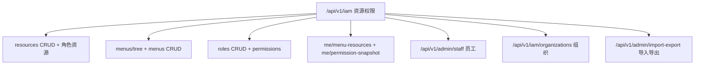
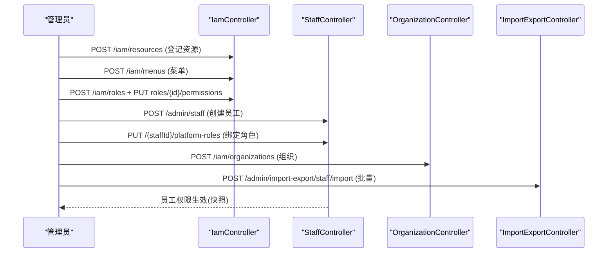
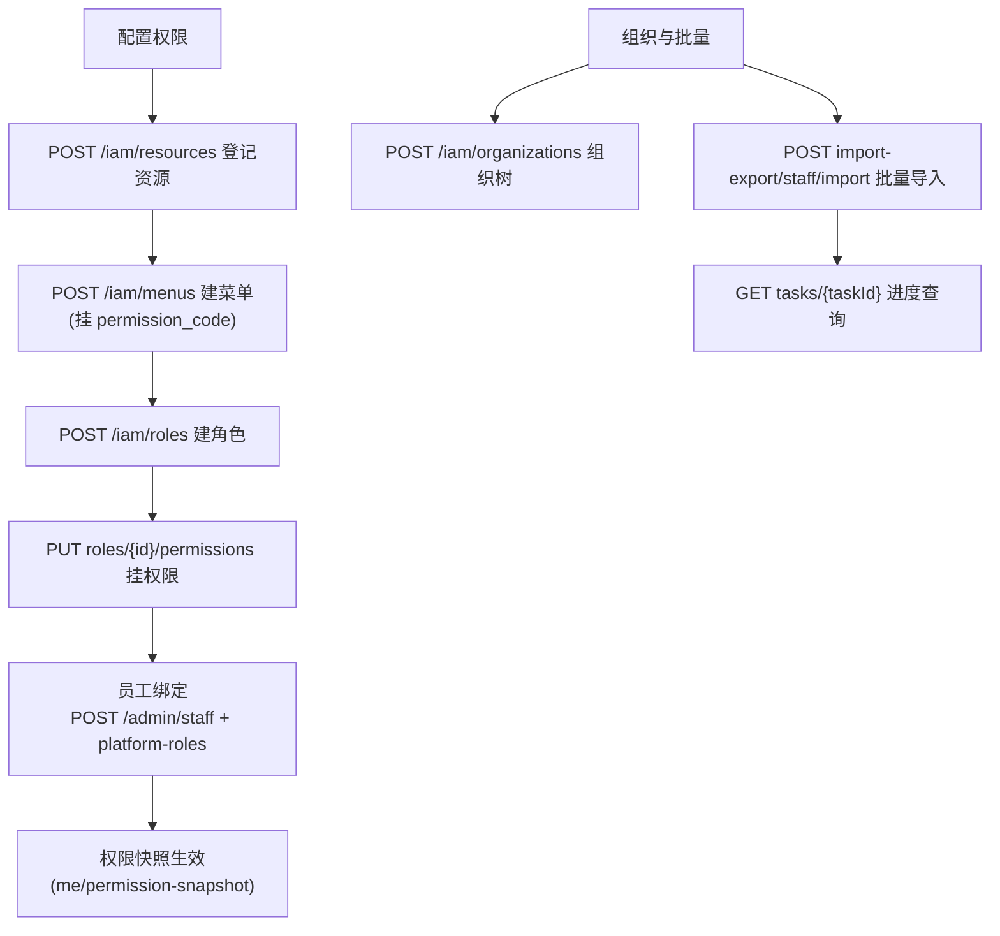
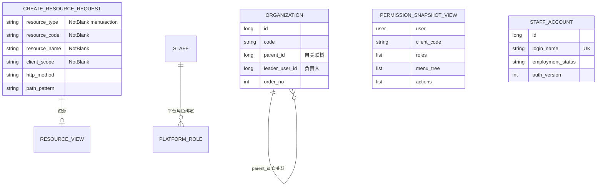

<cite>
- [UnionDesk/uniondesk-iam/src/main/java/com/uniondesk/iam/web/IamController.java](file://UnionDesk/uniondesk-iam/src/main/java/com/uniondesk/iam/web/IamController.java#L1-L20)
- [UnionDesk/uniondesk-iam/src/main/java/com/uniondesk/iam/web/StaffController.java](file://UnionDesk/uniondesk-iam/src/main/java/com/uniondesk/iam/web/StaffController.java#L1-L15)
- [UnionDesk/uniondesk-iam/src/main/java/com/uniondesk/iam/web/OrganizationController.java](file://UnionDesk/uniondesk-iam/src/main/java/com/uniondesk/iam/web/OrganizationController.java#L1-L8)
- [UnionDesk/uniondesk-iam/src/main/java/com/uniondesk/iam/web/ImportExportController.java](file://UnionDesk/uniondesk-iam/src/main/java/com/uniondesk/iam/web/ImportExportController.java#L1-L8)
- [UnionDesk/uniondesk-iam/src/main/java/com/uniondesk/iam/entity/OrganizationPo.java](file://UnionDesk/uniondesk-iam/src/main/java/com/uniondesk/iam/entity/OrganizationPo.java#L5-L18)
- [UnionDesk/uniondesk-iam/src/main/java/com/uniondesk/iam/web/IamDtos.java](file://UnionDesk/uniondesk-iam/src/main/java/com/uniondesk/iam/web/IamDtos.java#L13-L78)
- [UnionDesk/uniondesk-iam/src/main/java/com/uniondesk/iam/entity/StaffAccountPo.java](file://UnionDesk/uniondesk-iam/src/main/java/com/uniondesk/iam/entity/StaffAccountPo.java#L5-L56)
- [UnionDesk/uniondesk-iam/src/main/resources/mapper/iam/RoleMapper.xml](file://UnionDesk/uniondesk-iam/src/main/resources/mapper/iam/RoleMapper.xml#L81-L100)
</cite>

# UnionDesk IAM 与组织接口

## 简介

本文档详解 IAM 与组织全部接口：资源/权限/角色/菜单管理（`IamController /api/v1/iam`）、员工账号管理（`StaffController /api/v1/admin/staff`）、组织管理（`OrganizationController /api/v1/iam/organizations`）、导入导出（`ImportExportController /api/v1/admin/import-export`）。覆盖端点、权限码与请求/响应契约。

章节来源：
- [UnionDesk/uniondesk-iam/src/main/java/com/uniondesk/iam/web/IamController.java](file://UnionDesk/uniondesk-iam/src/main/java/com/uniondesk/iam/web/IamController.java#L1-L20)
- [UnionDesk/uniondesk-iam/src/main/java/com/uniondesk/iam/web/StaffController.java](file://UnionDesk/uniondesk-iam/src/main/java/com/uniondesk/iam/web/StaffController.java#L1-L15)

## 项目结构

IAM 接口分组：



图表来源：
- [UnionDesk/uniondesk-iam/src/main/java/com/uniondesk/iam/web/IamController.java](file://UnionDesk/uniondesk-iam/src/main/java/com/uniondesk/iam/web/IamController.java#L1-L20)
- [UnionDesk/uniondesk-iam/src/main/java/com/uniondesk/iam/web/StaffController.java](file://UnionDesk/uniondesk-iam/src/main/java/com/uniondesk/iam/web/StaffController.java#L1-L15)

## 核心组件

**1. 资源权限（IamController /api/v1/iam）**：`GET/POST /resources`（资源目录 CRUD）、`PUT /resources/{id}`、`GET/PUT /roles/{roleId}/resources`（角色资源）、`GET /admin-permission-codes`（权限码目录）——`CreateResourceRequest` 含 `@NotBlank resourceType/resourceCode/resourceName/clientScope`（IamDtos L13-26）。

**2. 菜单管理**：`GET /menus/tree`（菜单树）、`POST /menus`、`PUT/DELETE /menus/{menuId}`——`AdminMenuPo` 节点类型目录/菜单/按钮。

**3. 角色管理**：`GET/POST /roles`、`PUT/DELETE /roles/{roleId}`、`GET/PUT /roles/{roleId}/permissions`（权限查看/替换）、`GET /me/menu-resources`（我的菜单）、`GET /me/permission-snapshot`（我的权限快照 `PermissionSnapshotView` L63-71）——角色绑定经 `insertUserGlobalRole`/`insertUserDomainRole` 幂等写入（RoleMapper L81-100）。

**4. 员工账号（StaffController /api/v1/admin/staff）**：`GET`（分页列表）、`GET /{staffId}`、`POST`（创建）、`PUT /{staffId}`（更新）、`POST /{staffId}/disable`（禁用）、`POST /{staffId}/offboard`（离职）、`POST /{staffId}/restore`（恢复）、`PUT /{staffId}/status`（状态）、`GET/PUT /{staffId}/platform-roles`（平台角色绑定）——`StaffAccountPo` 含 `employmentStatus/offboardedAt/authVersion`（L5-56）。

**5. 组织管理（OrganizationController /api/v1/iam/organizations）**：`GET`（组织树）、`POST`（创建）、`PUT/DELETE /{id}`（更新/删除）——`OrganizationPo` 自关联树（`parentId`）+ `leaderUserId` 负责人（L5-18）。

**6. 导入导出（ImportExportController /api/v1/admin/import-export）**：`POST /staff/import`（员工批量导入，POI Excel）、`GET /tasks/{taskId}`（任务进度）、`GET /staff/export`（员工导出）——异步任务化导入。

章节来源：
- [UnionDesk/uniondesk-iam/src/main/java/com/uniondesk/iam/web/IamController.java](file://UnionDesk/uniondesk-iam/src/main/java/com/uniondesk/iam/web/IamController.java#L1-L20)
- [UnionDesk/uniondesk-iam/src/main/java/com/uniondesk/iam/web/StaffController.java](file://UnionDesk/uniondesk-iam/src/main/java/com/uniondesk/iam/web/StaffController.java#L1-L15)
- [UnionDesk/uniondesk-iam/src/main/java/com/uniondesk/iam/web/ImportExportController.java](file://UnionDesk/uniondesk-iam/src/main/java/com/uniondesk/iam/web/ImportExportController.java#L1-L8)

## 架构总览

权限配置到员工生效的时序：



图表来源：
- [UnionDesk/uniondesk-iam/src/main/java/com/uniondesk/iam/web/IamController.java](file://UnionDesk/uniondesk-iam/src/main/java/com/uniondesk/iam/web/IamController.java#L1-L20)
- [UnionDesk/uniondesk-iam/src/main/java/com/uniondesk/iam/web/StaffController.java](file://UnionDesk/uniondesk-iam/src/main/java/com/uniondesk/iam/web/StaffController.java#L1-L15)

## 详细分析

**接口设计要点**：

1. **资源-权限-角色三层**：`/iam/resources` 登记能力（menu/action + clientScope）；`/iam/roles/{roleId}/permissions` 挂权限码；`/iam/roles/{roleId}/resources` 挂资源——三层可独立管理，权限快照聚合下发（`me/permission-snapshot`）。
2. **员工全生命周期**：创建 → 更新 → 禁用/恢复 → 离职（offboard）→ 平台角色绑定——`StaffAccountPo` 的 `employmentStatus/offboardedAt/authVersion` 支撑（L5-56）；`PUT /{staffId}/platform-roles` 幂等替换（RoleMapper `insertUserGlobalRole` ON DUPLICATE，L81-88）。
3. **组织树管理**：`OrganizationPo` `parentId` 自关联 + `leaderUserId`（L5-18）——组织 CRUD 维护层级；删除需校验子树与引用。
4. **导入导出任务化**：`staff/import` 批量导入（POI Excel）→ `GET /tasks/{taskId}` 查询任务进度（异步执行，`ImportTask` 表）——大批量员工入驻不阻塞请求。
5. **权限码目录**：`GET /admin-permission-codes` 供前端权限配置页拉取全部可用码——「可配置的权限项」数据源。
6. **`@Valid` 校验**：资源创建 `@NotBlank` 四字段（IamDtos L13-26）；`ReplaceRoleResourcesRequest @NotNull List<Long>`（L43-45）。



图表来源：
- [UnionDesk/uniondesk-iam/src/main/java/com/uniondesk/iam/web/IamController.java](file://UnionDesk/uniondesk-iam/src/main/java/com/uniondesk/iam/web/IamController.java#L1-L20)
- [UnionDesk/uniondesk-iam/src/main/resources/mapper/iam/RoleMapper.xml](file://UnionDesk/uniondesk-iam/src/main/resources/mapper/iam/RoleMapper.xml#L81-L100)

## 数据模型

IAM 接口数据对象：



图表来源：
- [UnionDesk/uniondesk-iam/src/main/java/com/uniondesk/iam/web/IamDtos.java](file://UnionDesk/uniondesk-iam/src/main/java/com/uniondesk/iam/web/IamDtos.java#L13-L78)
- [UnionDesk/uniondesk-iam/src/main/java/com/uniondesk/iam/entity/OrganizationPo.java](file://UnionDesk/uniondesk-iam/src/main/java/com/uniondesk/iam/entity/OrganizationPo.java#L5-L18)
- [UnionDesk/uniondesk-iam/src/main/java/com/uniondesk/iam/entity/StaffAccountPo.java](file://UnionDesk/uniondesk-iam/src/main/java/com/uniondesk/iam/entity/StaffAccountPo.java#L5-L56)

## 依赖关系分析

```mermaid
classDiagram
    class IamController {
        +resources/menus/roles CRUD
        +me/permission-snapshot
        <<@RestController /api/v1/iam>>
    }
    class StaffController {
        +staff CRUD + disable/offboard/restore
        +platform-roles 绑定
        <<@RestController /api/v1/admin/staff>>
    }
    class OrganizationController {
        +organizations CRUD
        <<@RestController /api/v1/iam/organizations>>
    }
    class ImportExportController {
        +staff/import 批量
        +tasks/{taskId} 进度
        +staff/export
        <<@RestController>>
    }
    class IamService {
        +权限快照/缓存
        <<支撑>>
    }
    class StaffImportService {
        +POI 解析导入
        <<支撑>>
    }
    IamController --> IamService : 权限
    StaffController --> StaffAccountService : 账号
    StaffController --> IamService : 角色绑定
    ImportExportController --> StaffImportService : 导入
```

图表来源：
- [UnionDesk/uniondesk-iam/src/main/java/com/uniondesk/iam/web/IamController.java](file://UnionDesk/uniondesk-iam/src/main/java/com/uniondesk/iam/web/IamController.java#L1-L20)
- [UnionDesk/uniondesk-iam/src/main/java/com/uniondesk/iam/web/StaffController.java](file://UnionDesk/uniondesk-iam/src/main/java/com/uniondesk/iam/web/StaffController.java#L1-L15)

## 性能与安全考虑

- **性能**：权限快照 30s 缓存；`me/menu-resources` 免重复查询；导入任务异步化不阻塞请求。
- **安全**：全部端点权限码保护（`platform.iam.*`/`platform.role.*`/`PLATFORM_USER_*` 族）；员工禁用/离职联动会话吊销（authVersion）；组织删除校验引用；导入模板校验防脏数据。
- **一致性**：角色绑定幂等（ON DUPLICATE）；资源-权限-菜单三层唯一键；快照缓存可失效。
- **可追溯**：权限变更审计（`PLATFORM_ROLE_PERMISSIONS_UPDATE` 等动作码）。

章节来源：
- [UnionDesk/uniondesk-iam/src/main/resources/mapper/iam/RoleMapper.xml](file://UnionDesk/uniondesk-iam/src/main/resources/mapper/iam/RoleMapper.xml#L81-L88)
- [UnionDesk/uniondesk-iam/src/main/java/com/uniondesk/iam/entity/StaffAccountPo.java](file://UnionDesk/uniondesk-iam/src/main/java/com/uniondesk/iam/entity/StaffAccountPo.java#L15-L19)

## 故障排查指南

| 现象 | 原因 | 处理建议 |
| --- | --- | --- |
| 权限快照缺失新权限 | 30s 缓存未失效 | 调 `evictAuthorizationCache`；等待 TTL |
| 员工禁用后仍可登录 | 会话未吊销（authVersion 未推进） | 检查禁用流程；`revokeSessionsByUser` 联动 |
| 组织删除失败 | 存在子组织或引用 | 先删子树/解引用；检查 parentId |
| 导入任务卡住 | 异步线程池异常或文件格式错误 | 查看 `import_task` 状态与日志 |
| 角色绑定不生效 | 角色码与平台角色码不匹配 | 检查 `platform_role.code` 桥接；核对 ID |

章节来源：
- [UnionDesk/uniondesk-iam/src/main/java/com/uniondesk/iam/web/StaffController.java](file://UnionDesk/uniondesk-iam/src/main/java/com/uniondesk/iam/web/StaffController.java#L1-L15)
- [UnionDesk/uniondesk-iam/src/main/resources/mapper/iam/RoleMapper.xml](file://UnionDesk/uniondesk-iam/src/main/resources/mapper/iam/RoleMapper.xml#L81-L100)

## 结论

IAM 与组织接口以「**资源-权限-角色三层、员工全生命周期、组织树管理、导入任务化**」为核心：`/api/v1/iam` 管理资源/菜单/角色/权限快照，`/admin/staff` 覆盖员工创建到离职全流程（含平台角色绑定），`/iam/organizations` 维护组织树，`/admin/import-export` 异步批量导入导出。该接口族支撑平台级账号与权限治理。

章节来源：
- [UnionDesk/uniondesk-iam/src/main/java/com/uniondesk/iam/web/IamController.java](file://UnionDesk/uniondesk-iam/src/main/java/com/uniondesk/iam/web/IamController.java#L1-L20)
- [UnionDesk/uniondesk-iam/src/main/java/com/uniondesk/iam/web/StaffController.java](file://UnionDesk/uniondesk-iam/src/main/java/com/uniondesk/iam/web/StaffController.java#L1-L15)

## 附录

IAM 接口验证命令：

```bash
# 1. 资源列表
curl http://127.0.0.1:8080/api/v1/iam/resources -H "Authorization: Bearer <token>"

# 2. 创建资源
curl -X POST http://127.0.0.1:8080/api/v1/iam/resources \
  -H "Authorization: Bearer <token>" -H "Content-Type: application/json" \
  -d '{"resourceType":"action","resourceCode":"ticket:export","resourceName":"工单导出","clientScope":"ud-admin-web","httpMethod":"GET","pathPattern":"/api/v1/admin/domains/*/tickets/export"}'

# 3. 角色权限替换
curl -X PUT http://127.0.0.1:8080/api/v1/iam/roles/3/permissions \
  -H "Authorization: Bearer <token>" -H "Content-Type: application/json" \
  -d '{"permissionCodes":["platform.menu.read","domain.customer.read"]}'

# 4. 员工列表
curl "http://127.0.0.1:8080/api/v1/admin/staff?page=1&page_size=20" -H "Authorization: Bearer <token>"

# 5. 员工批量导入
curl -X POST http://127.0.0.1:8080/api/v1/admin/import-export/staff/import \
  -H "Authorization: Bearer <token>" -H "Content-Type: application/json" \
  -d '{"fileId":1001}'
```

章节来源：
- [UnionDesk/uniondesk-iam/src/main/java/com/uniondesk/iam/web/IamDtos.java](file://UnionDesk/uniondesk-iam/src/main/java/com/uniondesk/iam/web/IamDtos.java#L13-L26)
- [UnionDesk/uniondesk-iam/src/main/java/com/uniondesk/iam/web/ImportExportController.java](file://UnionDesk/uniondesk-iam/src/main/java/com/uniondesk/iam/web/ImportExportController.java#L1-L8)
