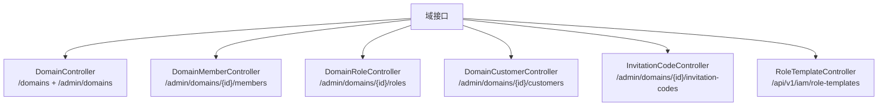
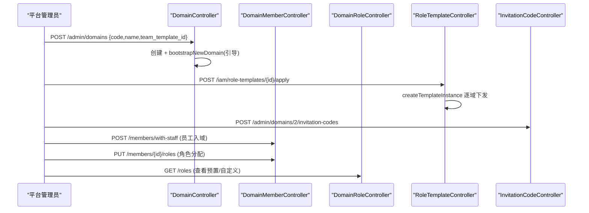
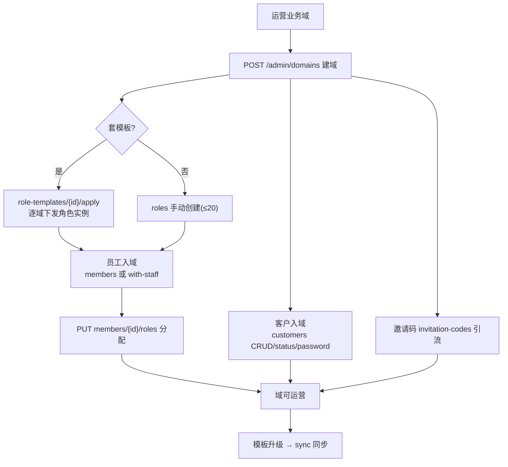
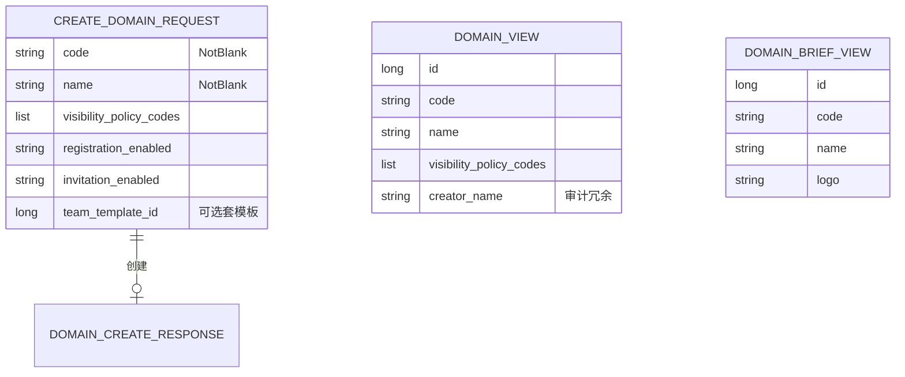

<cite>
- [UnionDesk/uniondesk-domain/src/main/java/com/uniondesk/domain/web/DomainController.java](file://UnionDesk/uniondesk-domain/src/main/java/com/uniondesk/domain/web/DomainController.java#L1-L20)
- [UnionDesk/uniondesk-domain/src/main/java/com/uniondesk/domain/web/DomainMemberController.java](file://UnionDesk/uniondesk-domain/src/main/java/com/uniondesk/domain/web/DomainMemberController.java#L1-L15)
- [UnionDesk/uniondesk-domain/src/main/java/com/uniondesk/domain/web/DomainRoleController.java](file://UnionDesk/uniondesk-domain/src/main/java/com/uniondesk/domain/web/DomainRoleController.java#L1-L15)
- [UnionDesk/uniondesk-domain/src/main/java/com/uniondesk/domain/web/DomainCustomerController.java](file://UnionDesk/uniondesk-domain/src/main/java/com/uniondesk/domain/web/DomainCustomerController.java#L1-L20)
- [UnionDesk/uniondesk-domain/src/main/java/com/uniondesk/domain/web/RoleTemplateController.java](file://UnionDesk/uniondesk-domain/src/main/java/com/uniondesk/domain/web/RoleTemplateController.java#L1-L20)
- [UnionDesk/uniondesk-domain/src/main/java/com/uniondesk/domain/web/InvitationCodeController.java](file://UnionDesk/uniondesk-domain/src/main/java/com/uniondesk/domain/web/InvitationCodeController.java#L1-L10)
- [UnionDesk/uniondesk-domain/src/main/java/com/uniondesk/domain/web/DomainDtos.java](file://UnionDesk/uniondesk-domain/src/main/java/com/uniondesk/domain/web/DomainDtos.java#L12-L61)
- [UnionDesk/uniondesk-domain/src/main/java/com/uniondesk/domain/core/DomainRoleService.java](file://UnionDesk/uniondesk-domain/src/main/java/com/uniondesk/domain/core/DomainRoleService.java#L117-L166)
</cite>

# UnionDesk 业务域接口

## 简介

本文档详解业务域全部接口：域 CRUD（`DomainController` 客户/管理双视角）、域成员（`DomainMemberController`）、域角色（`DomainRoleController` + `RoleTemplateController` 角色模板）、域客户（`DomainCustomerController`）、邀请码（`InvitationCodeController`）。覆盖端点、请求/响应契约与权限语义。

章节来源：
- [UnionDesk/uniondesk-domain/src/main/java/com/uniondesk/domain/web/DomainController.java](file://UnionDesk/uniondesk-domain/src/main/java/com/uniondesk/domain/web/DomainController.java#L1-L20)
- [UnionDesk/uniondesk-domain/src/main/java/com/uniondesk/domain/web/DomainMemberController.java](file://UnionDesk/uniondesk-domain/src/main/java/com/uniondesk/domain/web/DomainMemberController.java#L1-L15)

## 项目结构

业务域接口分组：



图表来源：
- [UnionDesk/uniondesk-domain/src/main/java/com/uniondesk/domain/web/DomainController.java](file://UnionDesk/uniondesk-domain/src/main/java/com/uniondesk/domain/web/DomainController.java#L1-L20)
- [UnionDesk/uniondesk-domain/src/main/java/com/uniondesk/domain/web/RoleTemplateController.java](file://UnionDesk/uniondesk-domain/src/main/java/com/uniondesk/domain/web/RoleTemplateController.java#L1-L20)

## 核心组件

**1. 域 CRUD（DomainController /api/v1）**：客户视角 `GET /domains`（可访问域列表）、`GET /domains/{id}`（域详情）；管理视角 `GET /admin/domains`（分页+筛选）、`GET/POST/PUT/DELETE /admin/domains/{id}`（详情/创建/更新/删除）——创建触发引导（`bootstrapNewDomain`）。

**2. 域成员（DomainMemberController /api/v1/admin/domains/{domainId}）**：`GET /members`（分页列表）、`GET /members/staff-candidates`（候选员工）、`POST /members`（已有员工入域）、`POST /members/with-staff`（新员工+成员一体创建）、`PUT /members/{memberId}/roles`（角色分配）、`PUT /members/{memberId}/status`（启停用）、`DELETE /members/{memberId}`（移除）。

**3. 域角色（DomainRoleController）**：`GET /roles`（列表）、`POST /roles`（创建，容量≤20）、`PUT /roles/{roleId}`（更新）、`GET/PUT /roles/{roleId}/permissions`（权限查看/更新）、`DELETE /roles/{roleId}`（删除，引用保护）、`GET /permission-items`（权限项目录）。

**4. 角色模板（RoleTemplateController /api/v1/iam/role-templates）**：`GET`（列表）、`GET /{templateId}`（详情）、`GET /permission-items`、`POST`（创建）、`PUT/DELETE /{templateId}`、`POST /{templateId}/apply`（下发到域）、`POST /{templateId}/sync`（同步到已下发域）、`POST /{templateId}/unapply`（撤回）、`POST /{templateId}/bind-members`（绑定成员）——模板批量运营（`createTemplateInstance`/`syncTemplateInstance`）。

**5. 域客户（DomainCustomerController）**：`GET /customers`（分页）、`GET /customers/{customerId}`、`POST /customers`（创建）、`POST /customers/manual`（手动）、`POST /customers/from-staff`（员工转客户）、`PUT/PATCH /customers/{customerId}/status`（状态）、`PUT /customers/{customerId}`（更新）、`PUT /customers/{customerId}/password`（重置密码）。

**6. 邀请码（InvitationCodeController）**：`GET /invitation-codes`（分页）、`POST /invitation-codes`（创建，限时限量）、`DELETE /invitation-codes/{codeId}`（删除）。

**7. 请求/响应契约（DomainDtos）**：`CreateDomainRequest{code, name, description, logo, visibility_policy_codes, registration_enabled, invitation_enabled, team_template_id}`（L38-47）；`DomainView`（含审计字段，L12-29）；`DomainBriefView{id, code, name, logo}`（L31-36）；`DomainCreateResponse{id, code}`（L60-61）。

章节来源：
- [UnionDesk/uniondesk-domain/src/main/java/com/uniondesk/domain/web/DomainMemberController.java](file://UnionDesk/uniondesk-domain/src/main/java/com/uniondesk/domain/web/DomainMemberController.java#L1-L15)
- [UnionDesk/uniondesk-domain/src/main/java/com/uniondesk/domain/web/RoleTemplateController.java](file://UnionDesk/uniondesk-domain/src/main/java/com/uniondesk/domain/web/RoleTemplateController.java#L1-L20)
- [UnionDesk/uniondesk-domain/src/main/java/com/uniondesk/domain/web/DomainDtos.java](file://UnionDesk/uniondesk-domain/src/main/java/com/uniondesk/domain/web/DomainDtos.java#L12-L61)

## 架构总览

建域 → 配角色/模板 → 邀请成员/客户的时序：



图表来源：
- [UnionDesk/uniondesk-domain/src/main/java/com/uniondesk/domain/web/DomainController.java](file://UnionDesk/uniondesk-domain/src/main/java/com/uniondesk/domain/web/DomainController.java#L1-L20)
- [UnionDesk/uniondesk-domain/src/main/java/com/uniondesk/domain/web/RoleTemplateController.java](file://UnionDesk/uniondesk-domain/src/main/java/com/uniondesk/domain/web/RoleTemplateController.java#L1-L20)

## 详细分析

**接口设计要点**：

1. **客户/管理双视角域**：`GET /domains` 客户可访问域（`DomainBriefView` 精简）；`/admin/domains` 管理全量（`DomainView` 含审计/软删字段）——权限码区分（`DOMAIN_*` 权限码族）。
2. **成员双通道**：`POST /members`（已有员工）与 `POST /members/with-staff`（新员工一体创建）——批量运营入口；`PUT /members/{id}/roles` 角色分配走 `updateMemberRoles`。
3. **角色模板批量运营**：`apply` 把模板下发到目标域（`createTemplateInstance` 逐域独立事务，L117-136）；`sync` 把模板当前版本同步到已下发实例（L141-153）；`unapply` 撤回；`bind-members` 绑定成员——模板生命周期完整闭环。
4. **域客户管理**：`POST /customers`（创建）、`from-staff`（员工转客户）、`PUT/PATCH status`（启停用）、`PUT /customers/{id}/password`（重置密码）——客户入域全生命周期。
5. **邀请码风控**：创建带 `expiresAt/maxUses`；`DELETE` 删除即失效——限时限量防滥用。
6. **`@Valid` 校验**：创建请求 `@NotBlank code/name`（DomainDtos L38-47）；`team_template_id` 可选（建域套模板）。
7. **审计**：域/角色/成员变更写审计（`AuditLogWriter`，见审计文档）。



图表来源：
- [UnionDesk/uniondesk-domain/src/main/java/com/uniondesk/domain/web/DomainDtos.java](file://UnionDesk/uniondesk-domain/src/main/java/com/uniondesk/domain/web/DomainDtos.java#L38-L47)
- [UnionDesk/uniondesk-domain/src/main/java/com/uniondesk/domain/core/DomainRoleService.java](file://UnionDesk/uniondesk-domain/src/main/java/com/uniondesk/domain/core/DomainRoleService.java#L117-L153)

## 数据模型

业务域接口数据对象：



图表来源：
- [UnionDesk/uniondesk-domain/src/main/java/com/uniondesk/domain/web/DomainDtos.java](file://UnionDesk/uniondesk-domain/src/main/java/com/uniondesk/domain/web/DomainDtos.java#L12-L61)
- [UnionDesk/uniondesk-domain/src/main/java/com/uniondesk/domain/core/DomainRoleService.java](file://UnionDesk/uniondesk-domain/src/main/java/com/uniondesk/domain/core/DomainRoleService.java#L26-L26)

## 依赖关系分析

```mermaid
classDiagram
    class DomainController {
        +GET /domains 客户列表
        +admin/domains CRUD
        <<@RestController>>
    }
    class DomainMemberController {
        +POST /members/with-staff
        +PUT /members/{id}/roles
        <<域成员>>
    }
    class DomainRoleController {
        +roles CRUD + permissions
        +permission-items
        <<域角色>>
    }
    class DomainCustomerController {
        +customers CRUD/status/password
        <<域客户>>
    }
    class InvitationCodeController {
        +invitation-codes CRUD
        <<邀请码>>
    }
    class RoleTemplateController {
        +apply/sync/unapply/bind-members
        <<角色模板>>
    }
    DomainController --> DomainDtos : 契约
    DomainMemberController --> DomainMemberService : 调用
    DomainRoleController --> DomainRoleService : 调用
    RoleTemplateController --> DomainRoleService : 模板下发
    InvitationCodeController --> InvitationCodeService : 调用
```

图表来源：
- [UnionDesk/uniondesk-domain/src/main/java/com/uniondesk/domain/web/DomainMemberController.java](file://UnionDesk/uniondesk-domain/src/main/java/com/uniondesk/domain/web/DomainMemberController.java#L1-L15)
- [UnionDesk/uniondesk-domain/src/main/java/com/uniondesk/domain/web/RoleTemplateController.java](file://UnionDesk/uniondesk-domain/src/main/java/com/uniondesk/domain/web/RoleTemplateController.java#L1-L20)

## 性能与安全考虑

- **性能**：成员/客户/邀请码列表分页；`staff-candidates` 预查询候选员工；模板 `apply/sync` 逐域独立事务防大事务。
- **安全**：全部管理端点权限码保护（`DOMAIN_*`）；域隔离（`domainId` 路径 + 校验）；角色容量上限（20）防资源滥用；模板锁定字段防域端越权修改（40302）；邀请码限时限量。
- **一致性**：建域引导幂等（IfNotExists）；成员/角色绑定复合唯一键；模板同步版本化。
- **审计**：域/角色/成员变更全记录（操作者/动作/目标）。

章节来源：
- [UnionDesk/uniondesk-domain/src/main/java/com/uniondesk/domain/core/DomainRoleService.java](file://UnionDesk/uniondesk-domain/src/main/java/com/uniondesk/domain/core/DomainRoleService.java#L162-L166)
- [UnionDesk/uniondesk-domain/src/main/java/com/uniondesk/domain/web/DomainDtos.java](file://UnionDesk/uniondesk-domain/src/main/java/com/uniondesk/domain/web/DomainDtos.java#L38-L47)

## 故障排查指南

| 现象 | 原因 | 处理建议 |
| --- | --- | --- |
| 建域后无预置角色 | `bootstrapNewDomain` 未执行或失败 | 检查创建调用链与引导日志 |
| 创建角色超限 | 已达 20 个自定义角色 | 清理未用角色或提高上限 |
| 成员无法分配角色 | 成员状态非 active 或角色不存在 | 检查成员状态与角色 ID |
| 模板 apply 失败 | 模板停用或类型项为空 | 检查模板状态与 `findItemsByTemplateId` |
| 邀请码不可用 | 过期或用量耗尽 | 重新生成邀请码 |

章节来源：
- [UnionDesk/uniondesk-domain/src/main/java/com/uniondesk/domain/core/DomainRoleService.java](file://UnionDesk/uniondesk-domain/src/main/java/com/uniondesk/domain/core/DomainRoleService.java#L117-L166)
- [UnionDesk/uniondesk-domain/src/main/java/com/uniondesk/domain/web/InvitationCodeController.java](file://UnionDesk/uniondesk-domain/src/main/java/com/uniondesk/domain/web/InvitationCodeController.java#L1-L10)

## 结论

业务域接口以「**双视角域管理、成员双通道、模板批量运营、客户全生命周期**」为核心：`/domains` 客户视角与 `/admin/domains` 管理视角分离，成员支持已有员工入域与一体创建，角色模板 apply/sync/unapply 完整闭环，域客户含状态与密码管理，邀请码限时限量引流。业务域作为租户单元，其管理接口覆盖从建域到运营的全过程。

章节来源：
- [UnionDesk/uniondesk-domain/src/main/java/com/uniondesk/domain/web/DomainController.java](file://UnionDesk/uniondesk-domain/src/main/java/com/uniondesk/domain/web/DomainController.java#L1-L20)
- [UnionDesk/uniondesk-domain/src/main/java/com/uniondesk/domain/web/RoleTemplateController.java](file://UnionDesk/uniondesk-domain/src/main/java/com/uniondesk/domain/web/RoleTemplateController.java#L1-L20)

## 附录

业务域接口验证命令：

```bash
# 1. 创建业务域（套模板）
curl -X POST http://127.0.0.1:8080/api/v1/admin/domains \
  -H "Authorization: Bearer <token>" -H "Content-Type: application/json" \
  -d '{"code":"demo4","name":"演示域4","visibility_policy_codes":["public"],"team_template_id":1}'

# 2. 员工入域（一体创建）
curl -X POST http://127.0.0.1:8080/api/v1/admin/domains/2/members/with-staff \
  -H "Authorization: Bearer <token>" -H "Content-Type: application/json" \
  -d '{"username":"agent01","phone":"13900000001","roles":[{"roleId":6}]}'

# 3. 分配角色
curl -X PUT http://127.0.0.1:8080/api/v1/admin/domains/2/members/100/roles \
  -H "Authorization: Bearer <token>" -H "Content-Type: application/json" \
  -d '{"roleIds":[5,6]}'

# 4. 角色模板下发
curl -X POST http://127.0.0.1:8080/api/v1/iam/role-templates/3/apply \
  -H "Authorization: Bearer <token>" -H "Content-Type: application/json" \
  -d '{"domainIds":[3,4]}'

# 5. 创建邀请码
curl -X POST http://127.0.0.1:8080/api/v1/admin/domains/2/invitation-codes \
  -H "Authorization: Bearer <token>" -H "Content-Type: application/json" \
  -d '{"channel":"wechat","expiresAt":"2026-09-01T00:00:00","maxUses":100}'
```

章节来源：
- [UnionDesk/uniondesk-domain/src/main/java/com/uniondesk/domain/web/DomainDtos.java](file://UnionDesk/uniondesk-domain/src/main/java/com/uniondesk/domain/web/DomainDtos.java#L38-L47)
- [UnionDesk/uniondesk-domain/src/main/java/com/uniondesk/domain/web/DomainMemberController.java](file://UnionDesk/uniondesk-domain/src/main/java/com/uniondesk/domain/web/DomainMemberController.java#L1-L15)
- [UnionDesk/uniondesk-domain/src/main/java/com/uniondesk/domain/web/RoleTemplateController.java](file://UnionDesk/uniondesk-domain/src/main/java/com/uniondesk/domain/web/RoleTemplateController.java#L1-L20)
