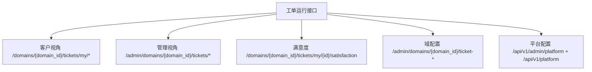
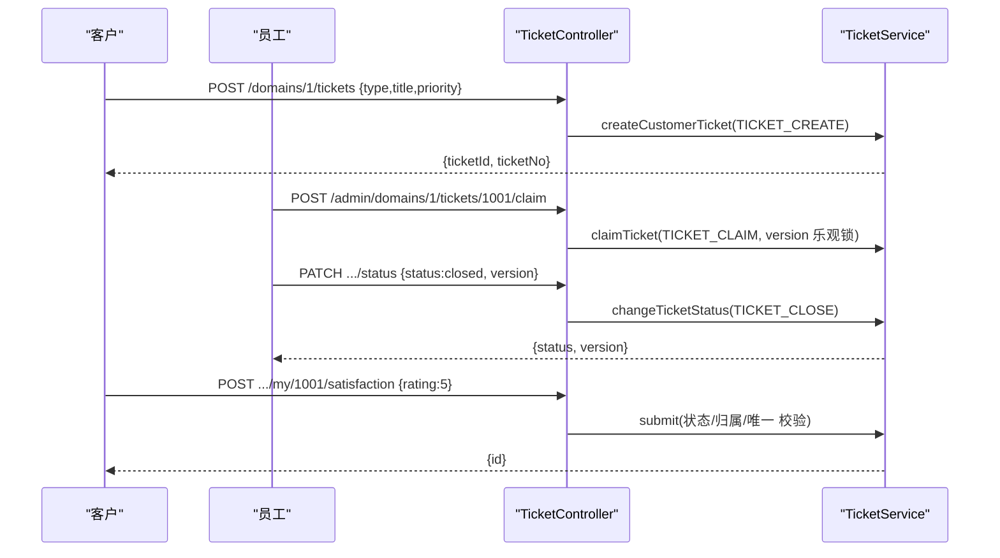
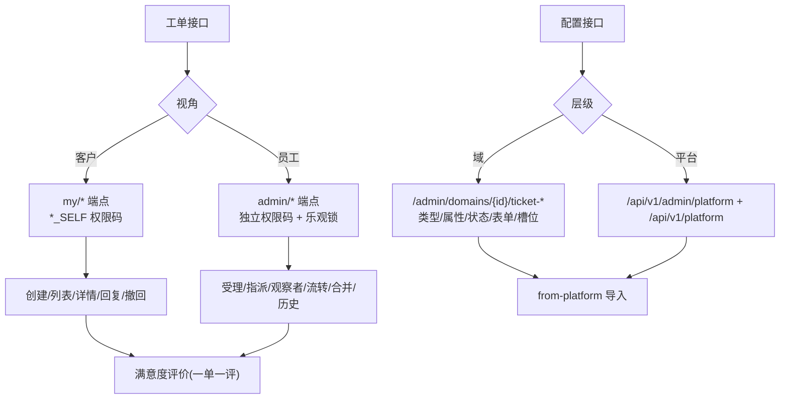
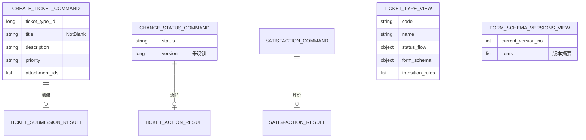
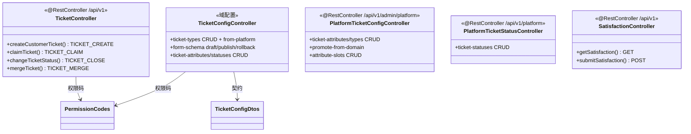

<cite>
- [UnionDesk/uniondesk-ticket/src/main/java/com/uniondesk/ticket/web/TicketController.java](file://UnionDesk/uniondesk-ticket/src/main/java/com/uniondesk/ticket/web/TicketController.java#L38-L107)
- [UnionDesk/uniondesk-ticket/src/main/java/com/uniondesk/ticket/web/TicketController.java](file://UnionDesk/uniondesk-ticket/src/main/java/com/uniondesk/ticket/web/TicketController.java#L108-L184)
- [UnionDesk/uniondesk-ticket/src/main/java/com/uniondesk/ticket/web/TicketConfigController.java](file://UnionDesk/uniondesk-ticket/src/main/java/com/uniondesk/ticket/web/TicketConfigController.java#L1-L30)
- [UnionDesk/uniondesk-ticket/src/main/java/com/uniondesk/ticket/web/PlatformTicketConfigController.java](file://UnionDesk/uniondesk-ticket/src/main/java/com/uniondesk/ticket/web/PlatformTicketConfigController.java#L1-L30)
- [UnionDesk/uniondesk-ticket/src/main/java/com/uniondesk/ticket/web/PlatformTicketStatusController.java](file://UnionDesk/uniondesk-ticket/src/main/java/com/uniondesk/ticket/web/PlatformTicketStatusController.java#L1-L8)
- [UnionDesk/uniondesk-ticket/src/main/java/com/uniondesk/ticket/web/SatisfactionController.java](file://UnionDesk/uniondesk-ticket/src/main/java/com/uniondesk/ticket/web/SatisfactionController.java#L1-L8)
- [UnionDesk/uniondesk-ticket/src/main/java/com/uniondesk/ticket/web/TicketConfigDtos.java](file://UnionDesk/uniondesk-ticket/src/main/java/com/uniondesk/ticket/web/TicketConfigDtos.java#L12-L78)
- [UnionDesk/uniondesk-iam/src/main/java/com/uniondesk/iam/core/PermissionCodes.java](file://UnionDesk/uniondesk-iam/src/main/java/com/uniondesk/iam/core/PermissionCodes.java#L5-L36)
</cite>

# UnionDesk 工单与配置接口

## 简介

本文档详解工单运行与配置全部接口：工单 CRUD/受理/指派/回复/流转/历史/合并/满意度（`TicketController` + `SatisfactionController`）、域级配置（`TicketConfigController` 类型/属性/状态/表单/槽位）、平台级配置（`PlatformTicketConfigController` + `PlatformTicketStatusController`）。覆盖端点、权限码、请求/响应契约。

章节来源：
- [UnionDesk/uniondesk-ticket/src/main/java/com/uniondesk/ticket/web/TicketController.java](file://UnionDesk/uniondesk-ticket/src/main/java/com/uniondesk/ticket/web/TicketController.java#L38-L107)
- [UnionDesk/uniondesk-ticket/src/main/java/com/uniondesk/ticket/web/TicketConfigController.java](file://UnionDesk/uniondesk-ticket/src/main/java/com/uniondesk/ticket/web/TicketConfigController.java#L1-L30)

## 项目结构

工单接口分组：



图表来源：
- [UnionDesk/uniondesk-ticket/src/main/java/com/uniondesk/ticket/web/TicketController.java](file://UnionDesk/uniondesk-ticket/src/main/java/com/uniondesk/ticket/web/TicketController.java#L38-L184)
- [UnionDesk/uniondesk-ticket/src/main/java/com/uniondesk/ticket/web/PlatformTicketConfigController.java](file://UnionDesk/uniondesk-ticket/src/main/java/com/uniondesk/ticket/web/PlatformTicketConfigController.java#L1-L30)

## 核心组件

**1. 客户工单端点（/domains/{domain_id}/tickets/my）**：`POST .../tickets`（创建，L38-45，`TICKET_CREATE`）、`GET .../tickets/my`（我的列表，L47-55，`TICKET_VIEW_SELF`）、`GET .../my/{ticket_id}`（详情，L57-63）、`POST .../my/{ticket_id}/replies`（回复，L65-72，`TICKET_REPLY_SELF`）、`POST .../my/{ticket_id}/withdraw`（撤回，L74-81，`TICKET_WITHDRAW_SELF`）。

**2. 管理工单端点（/admin/domains/{domain_id}/tickets）**：`GET .../tickets`（列表分页，L83-107，`TICKET_VIEW_DOMAIN_ALL`）、`GET .../tickets/{ticket_id}`（详情，L109-115）、`POST .../claim`（受理，L117-124，`TICKET_CLAIM`）、`POST .../assign`（指派，L126-133，`TICKET_ASSIGN`）、`POST .../watchers`（观察者，L135-142）、`POST .../replies`（回复，L144-151，`TICKET_REPLY`）、`PATCH .../status`（流转，L153-160，`TICKET_CLOSE`）、`GET .../history`（历史，L162-169）、`POST .../merge`（合并，L171-178，`TICKET_MERGE`）。

**3. 满意度端点**：`GET/POST /domains/{domain_id}/tickets/my/{ticket_id}/satisfaction`（查询/提交，SatisfactionController）——提交 `{rating 1-5, comment}`，一单一评。

**4. 域配置端点（TicketConfigController）**：类型 `GET/POST /admin/domains/{domain_id}/ticket-types`、`POST .../from-platform`（平台导入）、`PUT .../{type_id}`、表单 `PUT .../form-schema/draft`、`POST .../form-schema/publish`、`GET/POST .../form-release/*`、`POST .../form-schema/versions/{version_no}/rollback`；属性 `GET/POST/PUT/DELETE .../ticket-attributes`、`POST .../from-platform`、`PUT .../reorder`；状态 `GET/POST/PUT/DELETE .../ticket-statuses`、`POST .../from-platform`；槽位 `GET .../ticket-types/{type_id}/attribute-slots`。

**5. 平台配置端点（PlatformTicketConfigController /api/v1/admin/platform）**：属性 CRUD + `promote-from-domain/{domain_id}`（域上架）、类型 CRUD + reorder + 槽位 CRUD + form-release；`PlatformTicketStatusController /api/v1/platform`：状态 CRUD。

**6. 请求/响应契约（TicketConfigDtos）**：`CreateTicketTypeRequest{code, name, description, description_template_md, icon, template_key, status_flow, form_schema}`（L30-39）、`TicketTypeView`（含 status_flow/form_schema/transition_rules，L12-28）、`FormSchemaVersionsView`（L61-64）、`ImportPlatformTicketTypesRequest{platform_type_ids}`（L41-43，@NotEmpty）。

章节来源：
- [UnionDesk/uniondesk-ticket/src/main/java/com/uniondesk/ticket/web/TicketController.java](file://UnionDesk/uniondesk-ticket/src/main/java/com/uniondesk/ticket/web/TicketController.java#L38-L178)
- [UnionDesk/uniondesk-ticket/src/main/java/com/uniondesk/ticket/web/TicketConfigDtos.java](file://UnionDesk/uniondesk-ticket/src/main/java/com/uniondesk/ticket/web/TicketConfigDtos.java#L12-L78)

## 架构总览

一次工单创建 → 受理 → 流转 → 满意度时序：



图表来源：
- [UnionDesk/uniondesk-ticket/src/main/java/com/uniondesk/ticket/web/TicketController.java](file://UnionDesk/uniondesk-ticket/src/main/java/com/uniondesk/ticket/web/TicketController.java#L38-L160)
- [UnionDesk/uniondesk-ticket/src/main/java/com/uniondesk/ticket/web/SatisfactionController.java](file://UnionDesk/uniondesk-ticket/src/main/java/com/uniondesk/ticket/web/SatisfactionController.java#L1-L8)

## 详细分析

**接口设计要点**：

1. **权限码精细划分**：客户操作 `*_SELF`（TICKET_VIEW_SELF/TICKET_REPLY_SELF/TICKET_WITHDRAW_SELF），员工操作独立码（TICKET_CLAIM/TICKET_ASSIGN/TICKET_REPLY/TICKET_CLOSE/TICKET_MERGE）——「谁能做什么」按操作粒度声明；全部带 `domainIdParam="domain_id"` 域级校验。
2. **乐观锁贯穿写操作**：claim/assign/status 请求体带 `version`（`ClaimTicketCommand`/`ChangeTicketStatusCommand`），Service 比对版本防并发覆盖（见生命周期文档）。
3. **双视角路径**：客户 `my` 前缀（本人数据）+ 管理 `/admin` 前缀（域内全量）——同一资源两种视角，权限码隔离。
4. **配置端点分域/平台**：域配置（类型/属性/状态/表单）带 `domain_id` 路径；平台配置 `/api/v1/admin/platform`（类型/属性/槽位）+ `/api/v1/platform`（状态）——平台定义 → 域 `from-platform` 导入模式。
5. **表单版本化端点**：`PUT form-schema/draft` 存草稿、`POST form-schema/publish` 发布（版本+1）、`POST versions/{version_no}/rollback` 回滚（TicketConfigController）——发布管理闭环。
6. **`@Valid` 校验**：创建/回复/流转请求体 `@Valid`（L43/71/122 等），空标题/空内容前置拦截；`ImportPlatformTicketTypesRequest` `@NotEmpty` 列表校验（L41-43）。



图表来源：
- [UnionDesk/uniondesk-ticket/src/main/java/com/uniondesk/ticket/web/TicketController.java](file://UnionDesk/uniondesk-ticket/src/main/java/com/uniondesk/ticket/web/TicketController.java#L38-L178)
- [UnionDesk/uniondesk-ticket/src/main/java/com/uniondesk/ticket/web/PlatformTicketConfigController.java](file://UnionDesk/uniondesk-ticket/src/main/java/com/uniondesk/ticket/web/PlatformTicketConfigController.java#L1-L30)

## 数据模型

工单接口的数据对象：



图表来源：
- [UnionDesk/uniondesk-ticket/src/main/java/com/uniondesk/ticket/web/TicketConfigDtos.java](file://UnionDesk/uniondesk-ticket/src/main/java/com/uniondesk/ticket/web/TicketConfigDtos.java#L12-L78)
- [UnionDesk/uniondesk-ticket/src/main/java/com/uniondesk/ticket/web/TicketController.java](file://UnionDesk/uniondesk-ticket/src/main/java/com/uniondesk/ticket/web/TicketController.java#L28-L30)

## 依赖关系分析



图表来源：
- [UnionDesk/uniondesk-ticket/src/main/java/com/uniondesk/ticket/web/TicketController.java](file://UnionDesk/uniondesk-ticket/src/main/java/com/uniondesk/ticket/web/TicketController.java#L38-L178)
- [UnionDesk/uniondesk-ticket/src/main/java/com/uniondesk/ticket/web/TicketConfigDtos.java](file://UnionDesk/uniondesk-ticket/src/main/java/com/uniondesk/ticket/web/TicketConfigDtos.java#L12-L78)

## 性能与安全考虑

- **性能**：列表分页 `page/page_size`（兼容 limit 回退）；详情单查询聚合（域/类型/SLA/回复统计）；历史限量。
- **安全**：全部端点 `@RequirePermission` + 域级校验（`domainIdParam`）；客户 `*_SELF` 只能操作本人工单；乐观锁防并发覆盖；满意度归属/唯一校验；`@Valid` 请求体校验。
- **一致性**：配置端点 `from-platform` 导入幂等（查重）；表单版本化（draft/published/rollback）；`ImportPlatformTicketTypesRequest` 列表批量导入。
- **兼容**：`page_size` 与 `limit` 回退（L87-96）；`@JsonAlias` 字段兼容。

章节来源：
- [UnionDesk/uniondesk-ticket/src/main/java/com/uniondesk/ticket/web/TicketController.java](file://UnionDesk/uniondesk-ticket/src/main/java/com/uniondesk/ticket/web/TicketController.java#L86-L96)
- [UnionDesk/uniondesk-ticket/src/main/java/com/uniondesk/ticket/web/TicketController.java](file://UnionDesk/uniondesk-ticket/src/main/java/com/uniondesk/ticket/web/TicketController.java#L117-L160)

## 故障排查指南

| 现象 | 原因 | 处理建议 |
| --- | --- | --- |
| 受理/流转 403 | 权限码不足（TICKET_CLAIM/TICKET_CLOSE 未授权） | 检查角色权限绑定；核对 `domainIdParam` |
| 流转报「已被他人修改」 | version 乐观锁冲突 | 刷新重载；确认 version 传递 |
| 满意度提交失败 | 状态非 closed/resolved 或已评价 | 检查工单状态；查询 satisfaction 记录 |
| 平台导入重复报错 | 域内已存在同源类型/属性 | 查询 `source_global_type_id` 溯源；删除旧实例 |
| 表单发布后渲染异常 | schema 与插件版本不兼容 | 检查 `plugin_revision`；回滚版本 |

章节来源：
- [UnionDesk/uniondesk-ticket/src/main/java/com/uniondesk/ticket/web/TicketController.java](file://UnionDesk/uniondesk-ticket/src/main/java/com/uniondesk/ticket/web/TicketController.java#L117-L160)
- [UnionDesk/uniondesk-ticket/src/main/java/com/uniondesk/ticket/web/TicketConfigController.java](file://UnionDesk/uniondesk-ticket/src/main/java/com/uniondesk/ticket/web/TicketConfigController.java#L1-L30)

## 结论

工单与配置接口以「**双视角路径、权限码细化、乐观锁贯穿、配置双层级**」为核心：客户 `my` 与员工 `admin` 视角分离并各配权限码，写操作带 version 乐观锁，配置端点分域（`/admin/domains/{id}/ticket-*`）与平台（`/api/v1/admin/platform` + `/api/v1/platform`）双层，`from-platform` 实现平台→域导入，表单 draft/publish/rollback 闭环。工单运行与配置能力在此框架下完整开放。

章节来源：
- [UnionDesk/uniondesk-ticket/src/main/java/com/uniondesk/ticket/web/TicketController.java](file://UnionDesk/uniondesk-ticket/src/main/java/com/uniondesk/ticket/web/TicketController.java#L38-L184)
- [UnionDesk/uniondesk-ticket/src/main/java/com/uniondesk/ticket/web/PlatformTicketConfigController.java](file://UnionDesk/uniondesk-ticket/src/main/java/com/uniondesk/ticket/web/PlatformTicketConfigController.java#L1-L30)

## 附录

工单接口验证命令：

```bash
# 1. 客户创建工单
curl -X POST http://127.0.0.1:8080/api/v1/domains/1/tickets \
  -H "Authorization: Bearer <customer-token>" -H "Content-Type: application/json" \
  -d '{"ticket_type_id":5,"title":"订单问题","description":"订单未发货","priority":"high"}'

# 2. 员工受理（乐观锁 version）
curl -X POST http://127.0.0.1:8080/api/v1/admin/domains/1/tickets/1001/claim \
  -H "Authorization: Bearer <token>" -H "Content-Type: application/json" \
  -d '{"version":0}'

# 3. 状态流转
curl -X PATCH http://127.0.0.1:8080/api/v1/admin/domains/1/tickets/1001/status \
  -H "Authorization: Bearer <token>" -H "Content-Type: application/json" \
  -d '{"status":"closed","version":2}'

# 4. 满意度提交
curl -X POST http://127.0.0.1:8080/api/v1/domains/1/tickets/my/1001/satisfaction \
  -H "Authorization: Bearer <customer-token>" -H "Content-Type: application/json" \
  -d '{"rating":5,"comment":"很满意"}'

# 5. 平台类型导入域
curl -X POST http://127.0.0.1:8080/api/v1/admin/domains/2/ticket-types/from-platform \
  -H "Authorization: Bearer <token>" -H "Content-Type: application/json" \
  -d '{"platform_type_ids":[3,4]}'
```

章节来源：
- [UnionDesk/uniondesk-ticket/src/main/java/com/uniondesk/ticket/web/TicketController.java](file://UnionDesk/uniondesk-ticket/src/main/java/com/uniondesk/ticket/web/TicketController.java#L38-L160)
- [UnionDesk/uniondesk-ticket/src/main/java/com/uniondesk/ticket/web/TicketConfigDtos.java](file://UnionDesk/uniondesk-ticket/src/main/java/com/uniondesk/ticket/web/TicketConfigDtos.java#L30-L43)
