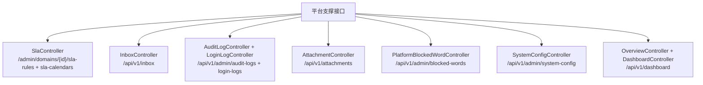
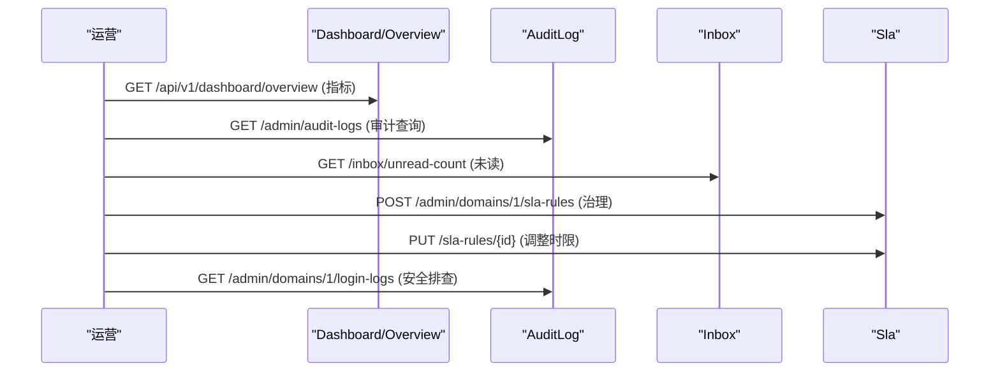
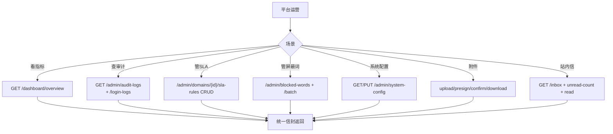
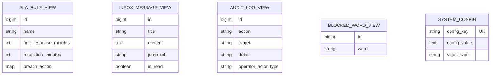
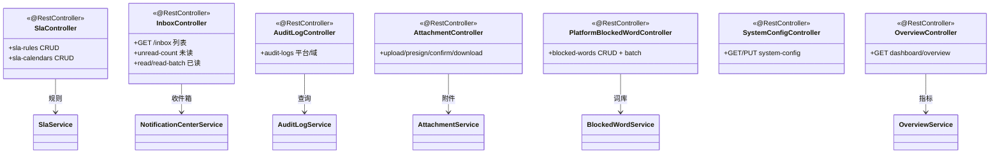

<cite>
- [UnionDesk/uniondesk-support/src/main/java/com/uniondesk/sla/web/SlaController.java](file://UnionDesk/uniondesk-support/src/main/java/com/uniondesk/sla/web/SlaController.java#L1-L20)
- [UnionDesk/uniondesk-support/src/main/java/com/uniondesk/notification/web/InboxController.java](file://UnionDesk/uniondesk-support/src/main/java/com/uniondesk/notification/web/InboxController.java#L1-L12)
- [UnionDesk/uniondesk-support/src/main/java/com/uniondesk/audit/web/AuditLogController.java](file://UnionDesk/uniondesk-support/src/main/java/com/uniondesk/audit/web/AuditLogController.java#L1-L12)
- [UnionDesk/uniondesk-support/src/main/java/com/uniondesk/attachment/web/AttachmentController.java](file://UnionDesk/uniondesk-support/src/main/java/com/uniondesk/attachment/web/AttachmentController.java#L1-L15)
- [UnionDesk/uniondesk-support/src/main/java/com/uniondesk/config/web/SystemConfigController.java](file://UnionDesk/uniondesk-support/src/main/java/com/uniondesk/config/web/SystemConfigController.java#L1-L10)
- [UnionDesk/uniondesk-support/src/main/java/com/uniondesk/dashboard/web/OverviewController.java](file://UnionDesk/uniondesk-support/src/main/java/com/uniondesk/dashboard/web/OverviewController.java#L1-L8)
- [UnionDesk/uniondesk-support/src/main/java/com/uniondesk/dashboard/web/DashboardController.java](file://UnionDesk/uniondesk-support/src/main/java/com/uniondesk/dashboard/web/DashboardController.java#L1-L8)
- [UnionDesk/uniondesk-support/src/main/java/com/uniondesk/blockedword/web/PlatformBlockedWordController.java](file://UnionDesk/uniondesk-support/src/main/java/com/uniondesk/blockedword/web/PlatformBlockedWordController.java#L1-L12)
- [UnionDesk/uniondesk-support/src/main/java/com/uniondesk/audit/web/LoginLogController.java](file://UnionDesk/uniondesk-support/src/main/java/com/uniondesk/audit/web/LoginLogController.java#L1-L10)
</cite>

# UnionDesk 平台支撑接口

## 简介

本文档详解平台支撑类全部接口：SLA 规则/工作日历（`SlaController`）、站内信（`InboxController`）、审计与登录日志（`AuditLogController`/`LoginLogController`）、附件（`AttachmentController`）、屏蔽词（`PlatformBlockedWordController` 平台 + 域端点）、系统配置（`SystemConfigController`）、仪表盘（`OverviewController`/`DashboardController`）。这些端点承载工单主链路之外的横切能力。

章节来源：
- [UnionDesk/uniondesk-support/src/main/java/com/uniondesk/sla/web/SlaController.java](file://UnionDesk/uniondesk-support/src/main/java/com/uniondesk/sla/web/SlaController.java#L1-L20)
- [UnionDesk/uniondesk-support/src/main/java/com/uniondesk/notification/web/InboxController.java](file://UnionDesk/uniondesk-support/src/main/java/com/uniondesk/notification/web/InboxController.java#L1-L12)

## 项目结构

支撑接口分组：



图表来源：
- [UnionDesk/uniondesk-support/src/main/java/com/uniondesk/sla/web/SlaController.java](file://UnionDesk/uniondesk-support/src/main/java/com/uniondesk/sla/web/SlaController.java#L1-L20)
- [UnionDesk/uniondesk-support/src/main/java/com/uniondesk/dashboard/web/OverviewController.java](file://UnionDesk/uniondesk-support/src/main/java/com/uniondesk/dashboard/web/OverviewController.java#L1-L8)

## 核心组件

**1. SLA 接口（SlaController /api/v1/admin/domains/{domainId}）**：`GET/POST sla-rules`、`PUT/DELETE sla-rules/{ruleId}`（规则 CRUD）；`GET/POST sla-calendars`、`PUT/DELETE sla-calendars/{calendarId}`（工作日历 CRUD）——全部按域隔离。

**2. 站内信（InboxController /api/v1/inbox）**：`GET`（消息列表）、`GET /unread-count`（未读数）、`POST /{message_id}/read`（已读）、`POST /read-batch`（批量已读）——按当前登录用户隔离。

**3. 审计/登录日志（AuditLogController /api/v1/admin）**：`GET /audit-logs`（平台审计分页）、`GET /domains/{domainId}/audit-logs`（域审计）；`LoginLogController`：`GET /login-logs`（平台登录日志）、`GET /domains/{domainId}/login-logs`（域登录日志）。

**4. 附件（AttachmentController /api/v1/attachments）**：`POST /upload`（上传）、`POST /presign`（预签名）、`PUT /{attachment_id}/confirm`（确认）、`GET /{attachment_id}/download`（下载）——见附件文档。

**5. 屏蔽词（PlatformBlockedWordController /api/v1/admin/blocked-words）**：`GET`（平台词库分页）、`POST`（新增）、`POST /batch`（批量）、`DELETE /{word_id}`（删除）；域端点 `/domains/{id}/blocked-words` 同构。

**6. 系统配置（SystemConfigController /api/v1/admin/system-config）**：`GET`（配置列表）、`PUT`（更新）——平台级键值配置。

**7. 仪表盘（OverviewController /api/v1/dashboard/overview）**：`GET`（概览统计）；`DashboardController /api/v1/dashboard`：`GET`（仪表盘聚合）——工单量/响应率等运营指标。

章节来源：
- [UnionDesk/uniondesk-support/src/main/java/com/uniondesk/sla/web/SlaController.java](file://UnionDesk/uniondesk-support/src/main/java/com/uniondesk/sla/web/SlaController.java#L1-L20)
- [UnionDesk/uniondesk-support/src/main/java/com/uniondesk/notification/web/InboxController.java](file://UnionDesk/uniondesk-support/src/main/java/com/uniondesk/notification/web/InboxController.java#L1-L12)
- [UnionDesk/uniondesk-support/src/main/java/com/uniondesk/blockedword/web/PlatformBlockedWordController.java](file://UnionDesk/uniondesk-support/src/main/java/com/uniondesk/blockedword/web/PlatformBlockedWordController.java#L1-L12)

## 架构总览

支撑接口的一次典型使用（运营查看 + 治理操作）：



图表来源：
- [UnionDesk/uniondesk-support/src/main/java/com/uniondesk/dashboard/web/OverviewController.java](file://UnionDesk/uniondesk-support/src/main/java/com/uniondesk/dashboard/web/OverviewController.java#L1-L8)
- [UnionDesk/uniondesk-support/src/main/java/com/uniondesk/audit/web/AuditLogController.java](file://UnionDesk/uniondesk-support/src/main/java/com/uniondesk/audit/web/AuditLogController.java#L1-L12)

## 详细分析

**接口设计要点**：

1. **按域隔离的治理端点**：SLA/审计/屏蔽词/登录日志均带 `domainId`（管理路径 `/admin/domains/{domainId}/...` 或平台全局 `/admin/...`）——平台运营与域运营双维度。
2. **当前用户上下文**：站内信端点不传用户参数（`InboxController`），从 `UserContextHolder` 取当前用户——天然防越权。
3. **分页统一**：审计/屏蔽词/登录日志列表 `page/page_size` + `PageResult` 信封。
4. **附件四步流程**：upload（代理上传）/presign（直传）/confirm（确认）/download（下载）——大文件直传与下载权限见附件文档。
5. **批量治理**：屏蔽词 `POST /batch` 批量导入；站内信 `POST /read-batch` 批量已读——运营效率。
6. **配置与仪表盘**：`system-config` 键值配置（GET/PUT）；`dashboard/overview` 聚合运营指标——管理驾驶舱。



图表来源：
- [UnionDesk/uniondesk-support/src/main/java/com/uniondesk/notification/web/InboxController.java](file://UnionDesk/uniondesk-support/src/main/java/com/uniondesk/notification/web/InboxController.java#L1-L12)
- [UnionDesk/uniondesk-support/src/main/java/com/uniondesk/attachment/web/AttachmentController.java](file://UnionDesk/uniondesk-support/src/main/java/com/uniondesk/attachment/web/AttachmentController.java#L1-L15)

## 数据模型

支撑接口数据对象：



图表来源：
- [UnionDesk/uniondesk-support/src/main/java/com/uniondesk/audit/web/AuditLogController.java](file://UnionDesk/uniondesk-support/src/main/java/com/uniondesk/audit/web/AuditLogController.java#L1-L12)
- [UnionDesk/uniondesk-support/src/main/java/com/uniondesk/config/web/SystemConfigController.java](file://UnionDesk/uniondesk-support/src/main/java/com/uniondesk/config/web/SystemConfigController.java#L1-L10)

## 依赖关系分析



图表来源：
- [UnionDesk/uniondesk-support/src/main/java/com/uniondesk/audit/web/AuditLogController.java](file://UnionDesk/uniondesk-support/src/main/java/com/uniondesk/audit/web/AuditLogController.java#L1-L12)
- [UnionDesk/uniondesk-support/src/main/java/com/uniondesk/dashboard/web/OverviewController.java](file://UnionDesk/uniondesk-support/src/main/java/com/uniondesk/dashboard/web/OverviewController.java#L1-L8)

## 性能与安全考虑

- **性能**：审计/屏蔽词/站内信列表分页；未读数走索引（`idx_inbox_recipient_read`）；仪表盘聚合 SQL（`OverviewMapper`）轻量统计。
- **安全**：站内信按当前用户上下文隔离；SLA/屏蔽词按域隔离 + 权限码；审计/登录日志需管理权限；附件下载归属校验。
- **一致性**：屏蔽词批量幂等；配置键值唯一；SLA 规则删除校验影响行数。
- **可观测**：审计 + 登录日志双轨支撑安全排查；仪表盘提供运营视图。

章节来源：
- [UnionDesk/uniondesk-support/src/main/java/com/uniondesk/notification/web/InboxController.java](file://UnionDesk/uniondesk-support/src/main/java/com/uniondesk/notification/web/InboxController.java#L1-L12)
- [UnionDesk/uniondesk-support/src/main/java/com/uniondesk/blockedword/web/PlatformBlockedWordController.java](file://UnionDesk/uniondesk-support/src/main/java/com/uniondesk/blockedword/web/PlatformBlockedWordController.java#L1-L12)

## 故障排查指南

| 现象 | 原因 | 处理建议 |
| --- | --- | --- |
| 未读数不准 | `markRead` 未同步或接收方不匹配 | 检查已读调用与 `recipient_subject_id` |
| 审计查询慢 | 日志表膨胀 | 按时间归档；检查索引 |
| SLA 规则删除 404 | 域不匹配（隔离） | 核对 domainId；确认 ruleId |
| 屏蔽词批量部分失败 | 重复词或超长词 | 查看批量结果明细 |
| 仪表盘指标为空 | 概览数据未生成或权限不足 | 检查 `OverviewMapper` 与权限码 |

章节来源：
- [UnionDesk/uniondesk-support/src/main/java/com/uniondesk/audit/web/AuditLogController.java](file://UnionDesk/uniondesk-support/src/main/java/com/uniondesk/audit/web/AuditLogController.java#L1-L12)
- [UnionDesk/uniondesk-support/src/main/java/com/uniondesk/sla/web/SlaController.java](file://UnionDesk/uniondesk-support/src/main/java/com/uniondesk/sla/web/SlaController.java#L1-L20)

## 结论

平台支撑接口以「**按域隔离、当前用户上下文、分页统一、批量治理**」为核心：SLA/审计/屏蔽词/登录日志按域或平台维度开放，站内信按当前用户自动隔离，附件四步流程支撑上传下载，系统配置键值管理，仪表盘提供运营指标。这些端点与工单主链路解耦，承载平台运营与治理的完整能力面。

章节来源：
- [UnionDesk/uniondesk-support/src/main/java/com/uniondesk/sla/web/SlaController.java](file://UnionDesk/uniondesk-support/src/main/java/com/uniondesk/sla/web/SlaController.java#L1-L20)
- [UnionDesk/uniondesk-support/src/main/java/com/uniondesk/notification/web/InboxController.java](file://UnionDesk/uniondesk-support/src/main/java/com/uniondesk/notification/web/InboxController.java#L1-L12)

## 附录

支撑接口验证命令：

```bash
# 1. SLA 规则列表
curl http://127.0.0.1:8080/api/v1/admin/domains/1/sla-rules -H "Authorization: Bearer <token>"

# 2. 站内信未读数
curl http://127.0.0.1:8080/api/v1/inbox/unread-count -H "Authorization: Bearer <token>"

# 3. 审计日志
curl "http://127.0.0.1:8080/api/v1/admin/audit-logs?page=1&page_size=20" -H "Authorization: Bearer <token>"

# 4. 登录日志（域）
curl "http://127.0.0.1:8080/api/v1/admin/domains/1/login-logs?page=1&page_size=20" -H "Authorization: Bearer <token>"

# 5. 屏蔽词批量
curl -X POST http://127.0.0.1:8080/api/v1/admin/blocked-words/batch \
  -H "Authorization: Bearer <token>" -H "Content-Type: application/json" \
  -d '{"words":["词A","词B"]}'

# 6. 仪表盘概览
curl http://127.0.0.1:8080/api/v1/dashboard/overview -H "Authorization: Bearer <token>"

# 7. 系统配置
curl http://127.0.0.1:8080/api/v1/admin/system-config -H "Authorization: Bearer <token>"
```

章节来源：
- [UnionDesk/uniondesk-support/src/main/java/com/uniondesk/audit/web/LoginLogController.java](file://UnionDesk/uniondesk-support/src/main/java/com/uniondesk/audit/web/LoginLogController.java#L1-L10)
- [UnionDesk/uniondesk-support/src/main/java/com/uniondesk/config/web/SystemConfigController.java](file://UnionDesk/uniondesk-support/src/main/java/com/uniondesk/config/web/SystemConfigController.java#L1-L10)
- [UnionDesk/uniondesk-support/src/main/java/com/uniondesk/dashboard/web/OverviewController.java](file://UnionDesk/uniondesk-support/src/main/java/com/uniondesk/dashboard/web/OverviewController.java#L1-L8)
