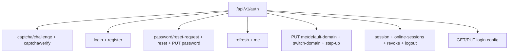
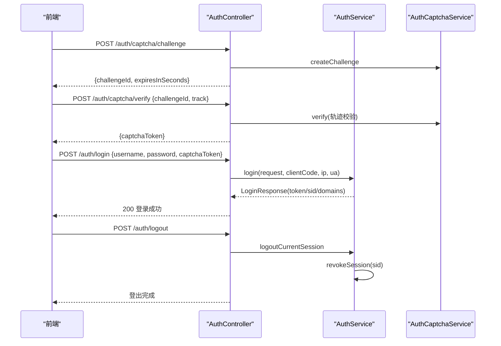
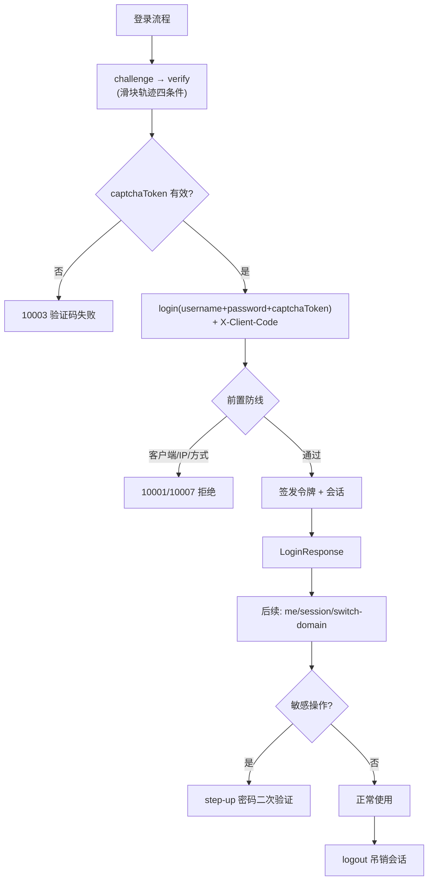
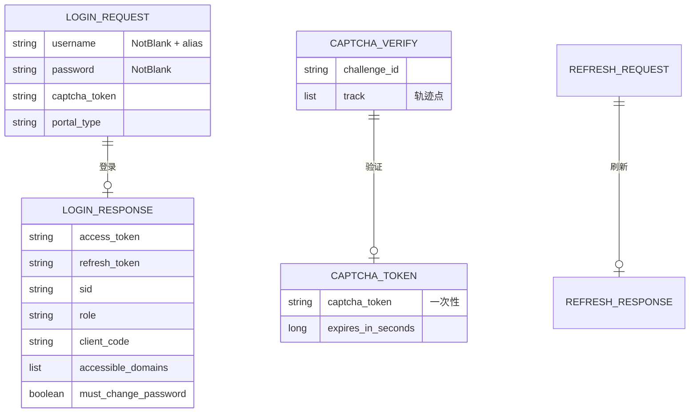
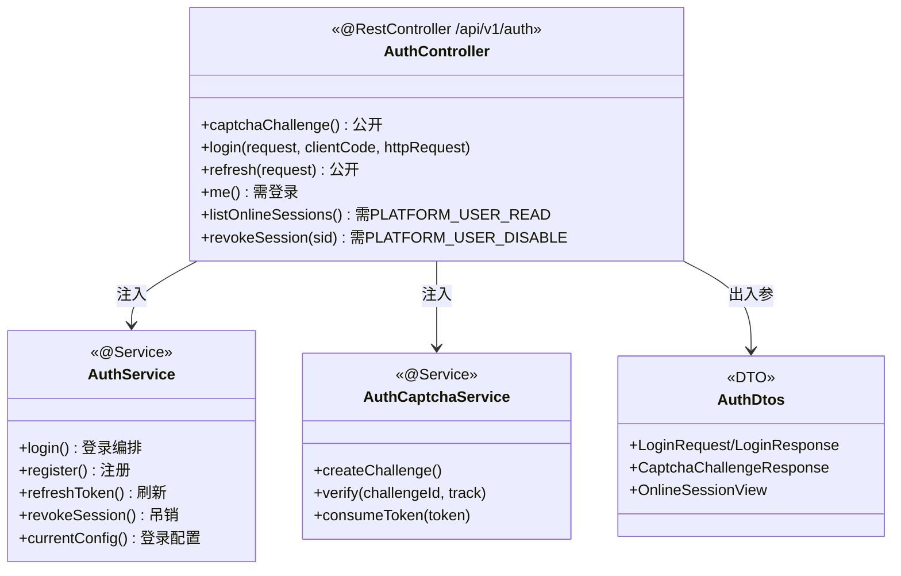

<cite>
- [UnionDesk/uniondesk-app/src/main/java/com/uniondesk/auth/web/AuthController.java](file://UnionDesk/uniondesk-app/src/main/java/com/uniondesk/auth/web/AuthController.java#L30-L68)
- [UnionDesk/uniondesk-app/src/main/java/com/uniondesk/auth/web/AuthController.java](file://UnionDesk/uniondesk-app/src/main/java/com/uniondesk/auth/web/AuthController.java#L70-L113)
- [UnionDesk/uniondesk-app/src/main/java/com/uniondesk/auth/web/AuthController.java](file://UnionDesk/uniondesk-app/src/main/java/com/uniondesk/auth/web/AuthController.java#L115-L182)
- [UnionDesk/uniondesk-app/src/main/java/com/uniondesk/auth/web/AuthDtos.java](file://UnionDesk/uniondesk-app/src/main/java/com/uniondesk/auth/web/AuthDtos.java#L16-L44)
- [UnionDesk/uniondesk-app/src/main/java/com/uniondesk/auth/web/AuthDtos.java](file://UnionDesk/uniondesk-app/src/main/java/com/uniondesk/auth/web/AuthDtos.java#L85-L102)
- [UnionDesk/uniondesk-iam/src/main/java/com/uniondesk/auth/core/AuthCaptchaService.java](file://UnionDesk/uniondesk-iam/src/main/java/com/uniondesk/auth/core/AuthCaptchaService.java#L32-L59)
- [UnionDesk/uniondesk-app/src/main/java/com/uniondesk/auth/core/AuthService.java](file://UnionDesk/uniondesk-app/src/main/java/com/uniondesk/auth/core/AuthService.java#L108-L199)
- [UnionDesk/uniondesk-common/src/main/java/com/uniondesk/common/web/ApiResponse.java](file://UnionDesk/uniondesk-common/src/main/java/com/uniondesk/common/web/ApiResponse.java#L3-L16)
</cite>

# UnionDesk 认证与登录接口

## 简介

本文档详解认证与登录全部接口：滑块验证码（challenge/verify）、密码登录、注册、密码找回（reset-request/reset）、改密、刷新令牌、当前用户、默认域/切域、会话管理（session/online-sessions/revoke）、登录配置、登出。覆盖请求/响应 JSON、校验规则、权限声明与错误码。

章节来源：
- [UnionDesk/uniondesk-app/src/main/java/com/uniondesk/auth/web/AuthController.java](file://UnionDesk/uniondesk-app/src/main/java/com/uniondesk/auth/web/AuthController.java#L30-L68)
- [UnionDesk/uniondesk-app/src/main/java/com/uniondesk/auth/web/AuthDtos.java](file://UnionDesk/uniondesk-app/src/main/java/com/uniondesk/auth/web/AuthDtos.java#L16-L44)

## 项目结构

认证端点分组：



图表来源：
- [UnionDesk/uniondesk-app/src/main/java/com/uniondesk/auth/web/AuthController.java](file://UnionDesk/uniondesk-app/src/main/java/com/uniondesk/auth/web/AuthController.java#L42-L182)

## 核心组件

**1. 验证码端点**：
- `POST /auth/captcha/challenge`（L42-46）：创建滑块挑战，返回 `{challengeId, expiresInSeconds}`（2 分钟）。
- `POST /auth/captcha/verify`（L48-52）：提交轨迹 `{challengeId, track}` 校验，返回 `{captchaToken, expiresInSeconds}`——一次性 token（AuthCaptchaService L39-48）。

**2. 登录/注册**：
- `POST /auth/login`（L54-60）：`LoginRequest{username, password, captchaToken, portalType}`（@JsonAlias 兼容 identifier/login_name）+ `X-Client-Code` 头（L57）→ `LoginResponse{accessToken, refreshToken, sid, role, clientCode, accessibleDomains, defaultBusinessDomainId, mustChangePassword}`（AuthDtos L85-102）。
- `POST /auth/register`（L62-68）：`RegisterRequest{loginName, password, displayName, phone, email, domainId, invitationCode, captchaToken}` → `RegisterResponse{accessToken, refreshToken, accountId}`。

**3. 密码端点**：
- `POST /auth/password/reset-request`（L70-76）：`{loginName, portalType, captchaToken}` → `{channel, hint}`。
- `POST /auth/password/reset`（L78-82）：`{token, newPassword}` → EmptyResponse。
- `PUT /auth/password`（L84-88，需登录）：`{oldPassword, newPassword}` → EmptyResponse。

**4. 令牌与用户**：`POST /auth/refresh`（L90-93）`{refreshToken}` → 新令牌；`GET /auth/me`（L95-98）→ `CurrentUserResponse`。

**5. 域与升级**：`PUT /auth/me/default-domain`（L100-103）、`POST /auth/switch-domain`（L105-108）、`POST /auth/step-up`（L110-113，密码二次验证）。

**6. 会话管理**：`GET /auth/session`（L144-147 当前会话）、`GET /auth/online-sessions`（L149-156，需 `PLATFORM_USER_READ`）、`POST /auth/online-sessions/{sid}/revoke`（L158-165，需 `PLATFORM_USER_DISABLE`）、`POST /auth/users/{userId}/revoke-sessions`（L167-174）、`POST /auth/logout`（L176-182）。

**7. 登录配置**：`GET /auth/login-config`（L115-118 公开读取）；`PUT /auth/login-config`（L120-142，需 `PLATFORM_PERMISSION_MANAGE`）——密码/用户名/邮箱/手机/验证码/微信开关、会话 TTL、失败锁定、IP 白名单等。

章节来源：
- [UnionDesk/uniondesk-app/src/main/java/com/uniondesk/auth/web/AuthController.java](file://UnionDesk/uniondesk-app/src/main/java/com/uniondesk/auth/web/AuthController.java#L42-L142)
- [UnionDesk/uniondesk-app/src/main/java/com/uniondesk/auth/web/AuthController.java](file://UnionDesk/uniondesk-app/src/main/java/com/uniondesk/auth/web/AuthController.java#L144-L182)

## 架构总览

登录 + 会话管理时序：



图表来源：
- [UnionDesk/uniondesk-app/src/main/java/com/uniondesk/auth/web/AuthController.java](file://UnionDesk/uniondesk-app/src/main/java/com/uniondesk/auth/web/AuthController.java#L42-L60)
- [UnionDesk/uniondesk-app/src/main/java/com/uniondesk/auth/web/AuthController.java](file://UnionDesk/uniondesk-app/src/main/java/com/uniondesk/auth/web/AuthController.java#L176-L182)

## 详细分析

**接口细节**：

1. **客户端标识头**：登录/注册/重置请求必须带 `X-Client-Code`（`AuthClientHeaders.CLIENT_CODE_HEADER`，L57/64/72）——服务端校验客户端合法性（`auth_client` 表）。
2. **字段兼容**：`@JsonAlias` 接受 `identifier/loginName/login_name/captcha_token/portal_type` 等旧字段名（AuthDtos L16-27）——前后端字段演进平滑。
3. **权限声明**：`online-sessions` 需 `PLATFORM_USER_READ`、`revoke` 需 `PLATFORM_USER_DISABLE`、`login-config` 更新需 `PLATFORM_PERMISSION_MANAGE`（L121/150/159）——管理端点权限码保护；`me/session/logout` 仅需登录（`requireCurrentUser` L184-190，未登录 401）。
4. **错误语义**：登录失败 10001（模糊文案）、验证码 10003、禁用 10004、无可用域 10005、锁定 10006、IP 不允许 10007；会话吊销目标不存在 40401（L162-164/171-173）。
5. **step-up 二次验证**：敏感操作（如改权限）需密码二次确认（L110-113）——操作级安全。
6. **在线会话管理**：`listOnlineSessions`（limit 默认 100）返回 sid/user/角色/域/登录标识脱敏/IP/UA（L214-231）；`revokeSession` 按 sid 吊销（原因 admin_revoke）、`revokeSessionsByUser` 批量吊销——管理员强制下线。



图表来源：
- [UnionDesk/uniondesk-app/src/main/java/com/uniondesk/auth/web/AuthController.java](file://UnionDesk/uniondesk-app/src/main/java/com/uniondesk/auth/web/AuthController.java#L42-L113)
- [UnionDesk/uniondesk-iam/src/main/java/com/uniondesk/auth/core/AuthCaptchaService.java](file://UnionDesk/uniondesk-iam/src/main/java/com/uniondesk/auth/core/AuthCaptchaService.java#L39-L59)

## 数据模型

认证接口的数据对象：



图表来源：
- [UnionDesk/uniondesk-app/src/main/java/com/uniondesk/auth/web/AuthDtos.java](file://UnionDesk/uniondesk-app/src/main/java/com/uniondesk/auth/web/AuthDtos.java#L16-L44)
- [UnionDesk/uniondesk-app/src/main/java/com/uniondesk/auth/web/AuthDtos.java](file://UnionDesk/uniondesk-app/src/main/java/com/uniondesk/auth/web/AuthDtos.java#L85-L102)

## 依赖关系分析



图表来源：
- [UnionDesk/uniondesk-app/src/main/java/com/uniondesk/auth/web/AuthController.java](file://UnionDesk/uniondesk-app/src/main/java/com/uniondesk/auth/web/AuthController.java#L34-L40)
- [UnionDesk/uniondesk-app/src/main/java/com/uniondesk/auth/web/AuthController.java](file://UnionDesk/uniondesk-app/src/main/java/com/uniondesk/auth/web/AuthController.java#L192-L231)

## 性能与安全考虑

- **性能**：验证码内存态（ConcurrentHashMap + 过期清理）零 IO；会话 `validateAndTouch` 轻量续期；`me` 免查库（JWT 解析）。
- **安全**：滑块轨迹四条件防机器（点数/时长/速度/进度）；验证码一次性消费防重放；BCrypt 密码；refresh 令牌哈希存储；IP 白名单 + 失败锁定；`requireCurrentUser` 统一 401；管理端点权限码保护。
- **一致性**：登出/吊销改会话状态（可追溯）；`step-up` 敏感操作二次验证；登录配置变更即时生效。
- **合规**：登录成功/失败/会话事件全审计（见认证机制文档）。

章节来源：
- [UnionDesk/uniondesk-app/src/main/java/com/uniondesk/auth/web/AuthController.java](file://UnionDesk/uniondesk-app/src/main/java/com/uniondesk/auth/web/AuthController.java#L158-L174)
- [UnionDesk/uniondesk-app/src/main/java/com/uniondesk/auth/web/AuthController.java](file://UnionDesk/uniondesk-app/src/main/java/com/uniondesk/auth/web/AuthController.java#L184-L190)

## 故障排查指南

| 现象 | 原因 | 处理建议 |
| --- | --- | --- |
| 登录 40001 校验失败 | 请求体缺必填字段（username/password） | 对照 `LoginRequest` 校验注解补参 |
| 登录 10003 验证码失败 | 轨迹不满足规则或 token 已消费 | 重新 challenge/verify；检查一次性消费 |
| 登录 10001 但密码正确 | 客户端头缺失/非法或 IP 白名单 | 检查 `X-Client-Code` 头；核对 auth_client 与白名单 |
| refresh 失败 | refreshToken 过期或格式错误 | 重新登录获取新令牌对 |
| me 401 | Token 缺失/过期 | 检查 Authorization 头；走 refresh 或重登 |

章节来源：
- [UnionDesk/uniondesk-app/src/main/java/com/uniondesk/auth/web/AuthController.java](file://UnionDesk/uniondesk-app/src/main/java/com/uniondesk/auth/web/AuthController.java#L54-L60)
- [UnionDesk/uniondesk-app/src/main/java/com/uniondesk/auth/web/AuthController.java](file://UnionDesk/uniondesk-app/src/main/java/com/uniondesk/auth/web/AuthController.java#L90-L98)

## 结论

认证与登录接口以「**验证码前置、客户端标识、令牌双轨、会话可管**」为核心：captcha challenge/verify 两步验证码、login/register 带 `X-Client-Code` 头、refresh/me 支撑令牌生命周期、online-sessions/revoke/logout 会话可管理、login-config 可配置登录策略。全部响应统一 `ApiResponse` 信封，错误码分层（10001-10007/40101 等），是系统安全的第一道 API 门面。

章节来源：
- [UnionDesk/uniondesk-app/src/main/java/com/uniondesk/auth/web/AuthController.java](file://UnionDesk/uniondesk-app/src/main/java/com/uniondesk/auth/web/AuthController.java#L42-L182)
- [UnionDesk/uniondesk-common/src/main/java/com/uniondesk/common/web/ApiResponse.java](file://UnionDesk/uniondesk-common/src/main/java/com/uniondesk/common/web/ApiResponse.java#L3-L16)

## 附录

认证接口验证命令：

```bash
# 1. 获取滑块挑战
curl -X POST http://127.0.0.1:8080/api/v1/auth/captcha/challenge

# 2. 验证轨迹（得到 captchaToken）
curl -X POST http://127.0.0.1:8080/api/v1/auth/captcha/verify \
  -H "Content-Type: application/json" \
  -d '{"challengeId":"xxx","track":[{"x":10,"y":5,"t":120},{"x":90,"y":8,"t":950}]}'

# 3. 登录（X-Client-Code 头）
curl -X POST http://127.0.0.1:8080/api/v1/auth/login \
  -H "Content-Type: application/json" \
  -H "X-Client-Code: uniondesk-admin" \
  -d '{"username":"admin","password":"***","captchaToken":"xxx"}'

# 4. 刷新令牌
curl -X POST http://127.0.0.1:8080/api/v1/auth/refresh \
  -H "Content-Type: application/json" \
  -d '{"refreshToken":"eyJ..."}'

# 5. 在线会话列表（管理权限）
curl http://127.0.0.1:8080/api/v1/auth/online-sessions?limit=50 \
  -H "Authorization: Bearer <token>"

# 6. 强制下线
curl -X POST http://127.0.0.1:8080/api/v1/auth/online-sessions/{sid}/revoke \
  -H "Authorization: Bearer <token>"
```

章节来源：
- [UnionDesk/uniondesk-app/src/main/java/com/uniondesk/auth/web/AuthController.java](file://UnionDesk/uniondesk-app/src/main/java/com/uniondesk/auth/web/AuthController.java#L42-L96)
- [UnionDesk/uniondesk-app/src/main/java/com/uniondesk/auth/web/AuthController.java](file://UnionDesk/uniondesk-app/src/main/java/com/uniondesk/auth/web/AuthController.java#L149-L182)
