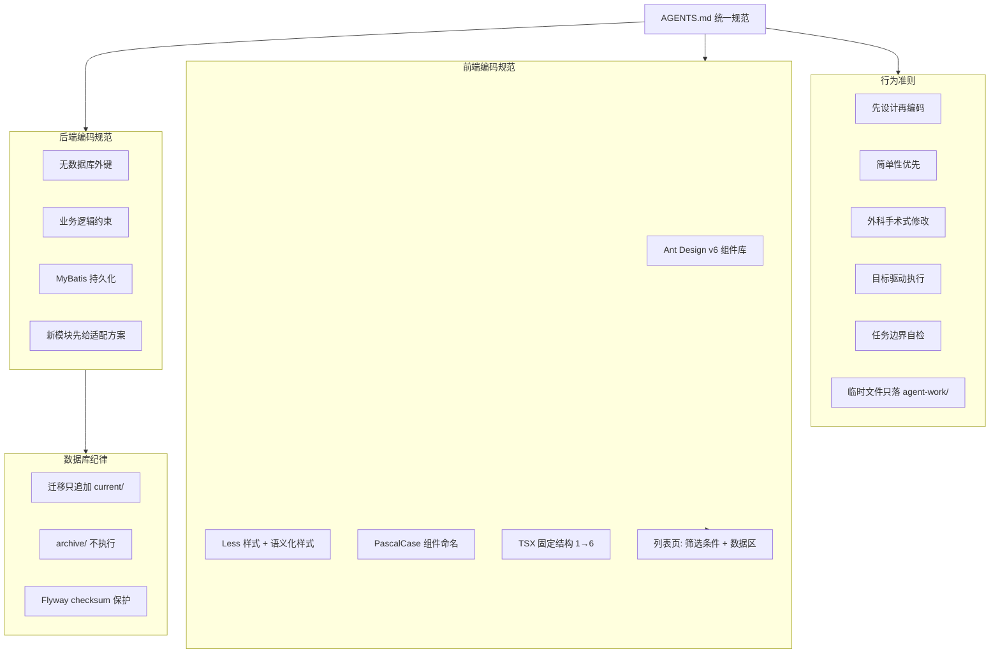
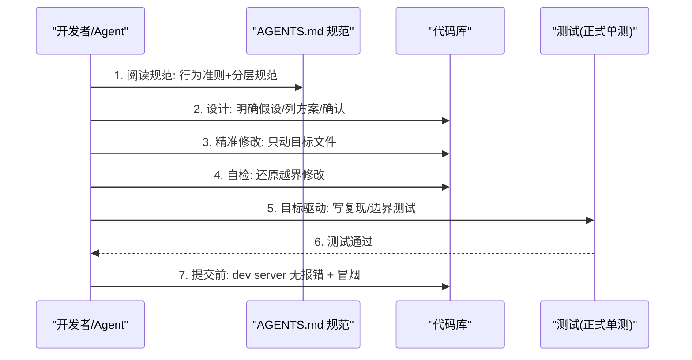
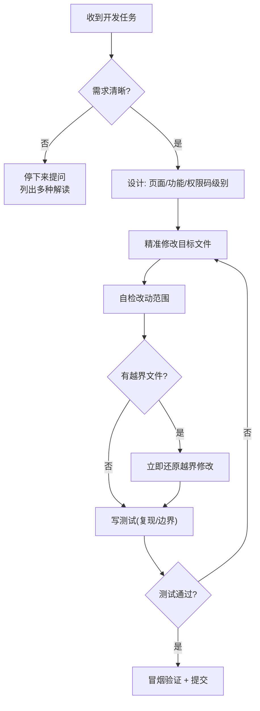
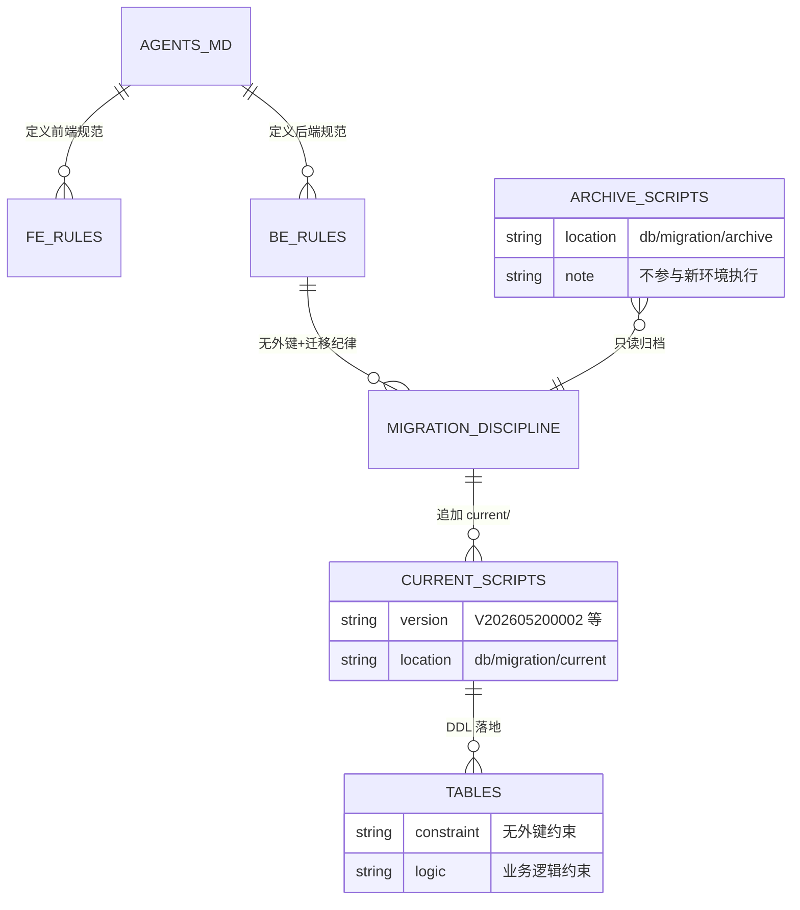
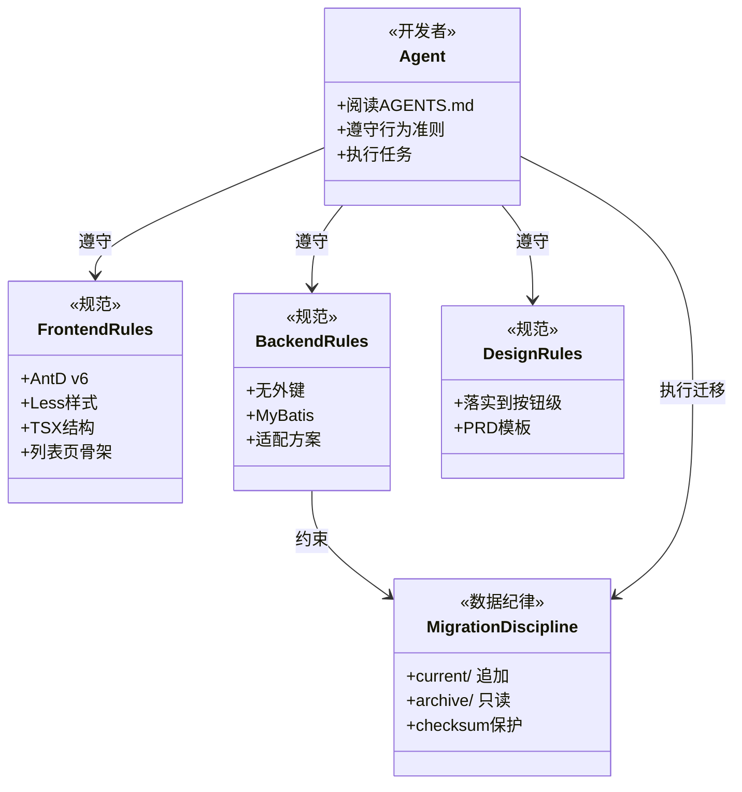

<cite>
- [AGENTS.md](file://AGENTS.md#L27-L113)
- [AGENTS.md](file://AGENTS.md#L117-L229)
- [UnionDesk/uniondesk-app/src/main/resources/db/migration/current/V202605200002__rebaseline_current_schema.sql](file://UnionDesk/uniondesk-app/src/main/resources/db/migration/current/V202605200002__rebaseline_current_schema.sql#L1-L4)
- [UnionDesk/uniondesk-app/src/main/java/com/uniondesk/UnionDeskApplication.java](file://UnionDesk/uniondesk-app/src/main/java/com/uniondesk/UnionDeskApplication.java#L9-L17)
- [UnionDesk/uniondesk-app/pom.xml](file://UnionDesk/uniondesk-app/pom.xml#L76-L96)
- [UnionDeskWeb/apps/UnionDeskAdminWeb/src/router/utils/generate-routes-from-backend.ts](file://UnionDeskWeb/apps/UnionDeskAdminWeb/src/router/utils/generate-routes-from-backend.ts#L14-L48)
- [UnionDeskWeb/apps/UnionDeskAdminWeb/package.json](file://UnionDeskWeb/apps/UnionDeskAdminWeb/package.json#L21-L35)
</cite>

# UnionDesk 开发者指南

## 简介

本文档面向在 UnionDesk 仓库中工作的开发者（含 AI Agent），汇总必须遵守的编码规范与开发纪律：行为准则（简单性优先、精准修改、任务边界）、前端编码规范（AntD v6 + Less + 组件拆分）、后端编码规范（无外键、MyBatis）、Flyway 迁移纪律与验收测试要求。所有规则以仓库根 `AGENTS.md` 为权威来源。

章节来源：
- [AGENTS.md](file://AGENTS.md#L27-L113)
- [AGENTS.md](file://AGENTS.md#L213-L229)

## 项目结构

开发规范与工程结构的对应关系：规范按「角色定义 → 行为准则 → 前端规范 → 后端规范 → 设计规范 → 项目参考」组织，工程按「前端 React / 后端 MyBatis / 数据库 Flyway」三块落地。



图表来源：
- [AGENTS.md](file://AGENTS.md#L117-L217)（前端/后端规范）
- [UnionDesk/uniondesk-app/src/main/resources/db/migration/current/V202605200002__rebaseline_current_schema.sql](file://UnionDesk/uniondesk-app/src/main/resources/db/migration/current/V202605200002__rebaseline_current_schema.sql#L1-L4)（迁移目录双轨制）

## 核心组件

| 规范组件 | 核心要求 |
| --- | --- |
| 行为准则 | ①先设计思考并声明假设 ②最少代码、零投机 ③只动必须动的（最高警戒） ④目标驱动 + 检查点 ⑤越界修改立即还原 ⑥临时文件仅 `agent-work/` ⑦任务结束按「名称+总结」格式回复 |
| 前端组件库 | 必须 AntD v6；样式优先级：语义化（classNames/styles）→ Design Token → 自定义 CSS |
| 样式方案 | Less 后缀；超过一行的样式抽独立 Less 文件；禁止混用 CSS-in-JS 与 Less |
| TSX 结构 | 导入 → 类型 → 常量 → 辅助函数 → 组件（状态/ref/副作用/事件/派生/渲染）→ 导出 |
| 常量与拆分 | 路由 Path/查询参数 key 禁止抽常量；单组件使用的逻辑留在文件内；跨模块复用才进 `src/utils/` |
| 列表页骨架 | `Card「筛选条件」(TableSearchForm)` + `Card「列表」(Table + 分页)`；工具栏进 `extra` 且 `AuthGuarded` 包裹 |
| 后端规范 | 不使用外键、仅业务逻辑约束；改模块先给适配方案；MyBatis |
| 设计规范 | 设计落实到按钮级别：页面清单、功能清单、权限码级别 |

章节来源：
- [AGENTS.md](file://AGENTS.md#L54-L113)（行为准则 1-7）
- [AGENTS.md](file://AGENTS.md#L119-L222)（前端/后端/设计规范）

## 架构总览

开发者在一次典型功能开发中的规范执行时序：



图表来源：
- [AGENTS.md](file://AGENTS.md#L54-L89)（行为准则 1-4）
- [AGENTS.md](file://AGENTS.md#L175-L178)（测试与验证）

## 详细分析

**关键规范细则**：

1. **外科手术式修改（最高警戒）**：禁止顺手改相邻代码、禁止重构没坏的东西、禁止夹带私货；产生孤儿内容（未使用的导入/变量/函数）必须删除；无关死代码只提不改。
2. **任务边界机制**：拒绝过度泛化（不把其他任务带入）；完成后检查改动范围，发现越界文件**立即自行还原**再交付；发现他模块隐患只能报告、不得私改。
3. **临时文件落盘约束**：调试/探测/一次性脚本只允许写入 `agent-work/`（gitignore 忽略）；禁止散落 `_tmp_*`、`*-test-output.txt`、临时截图等到业务目录；正式测试（`*.test.ts(x)`、`src/test/`）除外；用完即清。
4. **前端规范要点**：AntD v6 组件库 + `ConfigProvider.theme` Design Token；Less 文件局部作用域（CSS Modules/BEM）；中文注释与 UI 文本；UTF-8。
5. **列表页骨架**：查询栏统一 `TableSearchForm`（禁止自写查询/重置按钮）；`onFinish` 查询重置到第 1 页；分页 `page/page_size/total` 默认 20、`showSizeChanger`；删除用 `ConfirmPopover`；菜单页特例用 `MenuScopeFilter` + `BasicTable` 树表。
6. **后端与数据库纪律**：无外键（业务逻辑约束）；改表走 Flyway，脚本追加到 `current/`，禁止修改已执行脚本（checksum 校验保护）；归档脚本在 `archive/` 不执行。



图表来源：
- [AGENTS.md](file://AGENTS.md#L68-L113)（行为准则 3-7）
- [AGENTS.md](file://AGENTS.md#L180-L209)（列表页布局规范）

## 数据模型

规范与数据层的关系：数据库结构变更必须经 Flyway 迁移脚本承载，不允许手工改库绕过；`current/` 是唯一可执行的迁移来源。



图表来源：
- [UnionDesk/uniondesk-app/src/main/resources/db/migration/current/V202605200002__rebaseline_current_schema.sql](file://UnionDesk/uniondesk-app/src/main/resources/db/migration/current/V202605200002__rebaseline_current_schema.sql#L1-L4)
- [AGENTS.md](file://AGENTS.md#L213-L217)（后端编码规范）

## 依赖关系分析



图表来源：
- [AGENTS.md](file://AGENTS.md#L117-L229)（三类规范）
- [UnionDesk/uniondesk-app/pom.xml](file://UnionDesk/uniondesk-app/pom.xml#L76-L96)（Flyway 插件与迁移位置）

## 性能与安全考虑

- **迁移安全**：Flyway checksum 校验防止篡改已执行脚本；`cleanDisabled=false` 仅用于可控的本地/CI 环境，生产严禁 clean；数据库凭据在插件配置中为本地开发值，生产须外置。
- **代码质量**：目标驱动要求「写测试再验证」——新增验证写无效输入测试、修复 Bug 写复现测试、重构保证前后测试通过；提交前 dev server 无报错 + 冒烟。
- **敏感信息**：不得把密钥/真实密码写入可提交路径；临时文件目录 `agent-work/` 已在 .gitignore 忽略。
- **依赖方向**：后端业务模块只依赖 common，app 聚合全部模块；`@MapperScan("com.uniondesk.**.mapper")` 通配扫描要求新模块 Mapper 遵循统一包名。

章节来源：
- [AGENTS.md](file://AGENTS.md#L95-L99)（临时文件与敏感信息）
- [UnionDesk/uniondesk-app/src/main/java/com/uniondesk/UnionDeskApplication.java](file://UnionDesk/uniondesk-app/src/main/java/com/uniondesk/UnionDeskApplication.java#L9-L17)（Mapper 扫描约定）
- [UnionDesk/uniondesk-app/pom.xml](file://UnionDesk/uniondesk-app/pom.xml#L76-L96)

## 故障排查指南

| 现象 | 原因 | 处理建议 |
| --- | --- | --- |
| 提交被 lint-staged / commitlint 拦截 | 代码不符合 eslint 或 commit message 不符合 conventional | 执行 `pnpm lint:fix`；commit message 用 `type(scope): subject` 格式 |
| 迁移后应用启动失败 Validate failed | 修改了 `current/` 中已执行脚本 | 恢复脚本原内容；新增迁移脚本承载变更；用 `DbFlywayCheck.java` 定位 |
| 新增 Mapper 注入失败 | 包名不在 `com.uniondesk.**.mapper`，或模块未加入 app 依赖 | 检查 Mapper 包路径与 `uniondesk-app/pom.xml` 依赖 |
| 前端新增路由不生效 | 路由 Path/查询 key 被错误抽成常量，或页面不在 `src/pages/` | 使用处直接写字面量；页面放 `src/pages/` 并遵守路由生成规则 |
| 代码审查发现越界修改 | Agent 修改了非目标文件 | 遵守自检协议：立即还原越界文件后再交付 |

章节来源：
- [AGENTS.md](file://AGENTS.md#L68-L93)（精准修改与自检）
- [UnionDeskWeb/apps/UnionDeskAdminWeb/package.json](file://UnionDeskWeb/apps/UnionDeskAdminWeb/package.json#L21-L35)（lint/测试脚本）

## 结论

UnionDesk 开发纪律的核心是「**规范先行、精准修改、目标驱动、迁移只追加**」：AGENTS.md 是唯一权威规范源，覆盖行为准则与前端/后端/设计三层编码规范；数据库变更必须走 `db/migration/current/` 追加式迁移；测试是验收的硬门槛。任何 Agent 或开发者进入本仓库开发，都应先读 AGENTS.md 再动手。

章节来源：
- [AGENTS.md](file://AGENTS.md#L27-L113)
- [AGENTS.md](file://AGENTS.md#L117-L229)

## 附录

常用开发命令：

```bash
# 前端：安装依赖 / 启动 / 测试 / 类型检查
cd UnionDeskWeb
pnpm install
cd apps/UnionDeskAdminWeb && pnpm dev
pnpm test
pnpm typecheck
pnpm lint:fix

# 后端：编译 / 启动
cd UnionDesk
mvn -pl uniondesk-app -am spring-boot:run

# 数据库：查看迁移状态
mvn -pl uniondesk-app flyway:info
```

新增功能的自检清单（提交前逐项确认）：

```bash
# 1. 改动范围检查：仅目标文件
git status

# 2. 目标驱动测试
pnpm test --run

# 3. 类型与 lint
pnpm typecheck && pnpm lint

# 4. 迁移校验（若改库）
mvn -pl uniondesk-app flyway:validate
```

章节来源：
- [UnionDeskWeb/apps/UnionDeskAdminWeb/package.json](file://UnionDeskWeb/apps/UnionDeskAdminWeb/package.json#L21-L35)
- [UnionDesk/uniondesk-app/pom.xml](file://UnionDesk/uniondesk-app/pom.xml#L76-L96)
