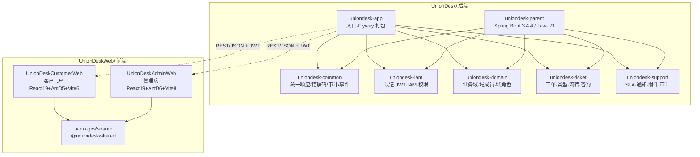
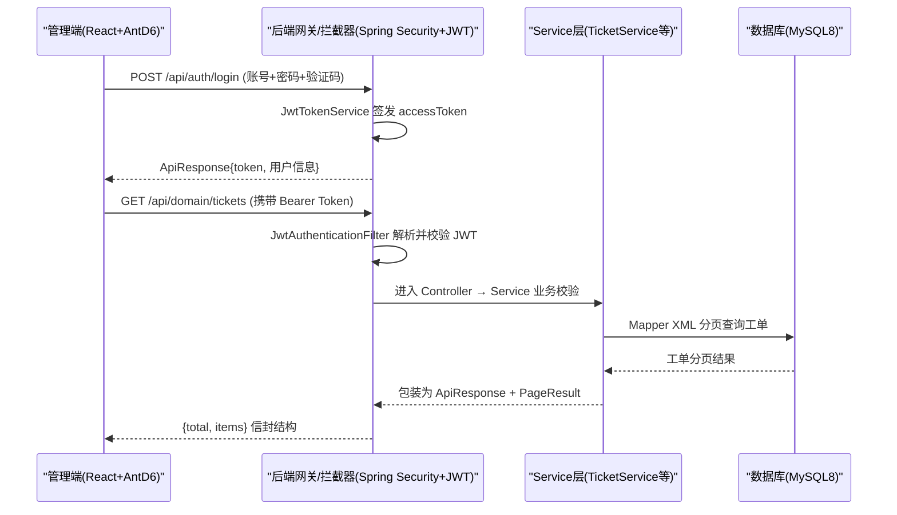
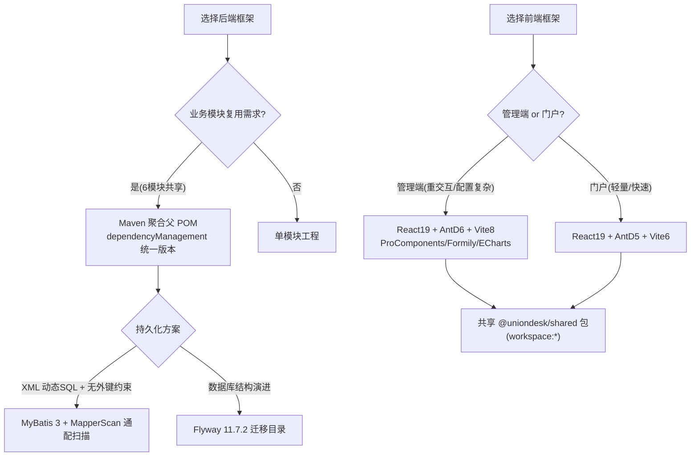
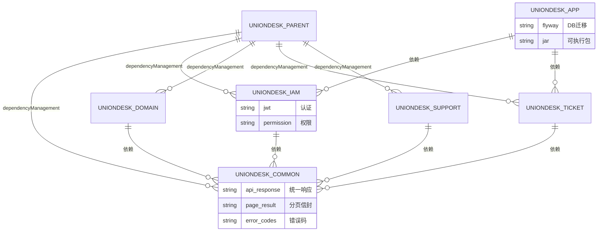

<cite>
- [UnionDesk/pom.xml](file://UnionDesk/pom.xml#L7-L128)
- [UnionDesk/uniondesk-app/pom.xml](file://UnionDesk/uniondesk-app/pom.xml#L17-L98)
- [UnionDesk/uniondesk-iam/pom.xml](file://UnionDesk/uniondesk-iam/pom.xml#L17-L38)
- [UnionDeskWeb/apps/UnionDeskAdminWeb/package.json](file://UnionDeskWeb/apps/UnionDeskAdminWeb/package.json#L1-L154)
- [UnionDeskWeb/apps/UnionDeskCustomerWeb/package.json](file://UnionDeskWeb/apps/UnionDeskCustomerWeb/package.json#L1-L36)
- [UnionDeskWeb/packages/shared/src/index.ts](file://UnionDeskWeb/packages/shared/src/index.ts#L1-L10)
- [UnionDesk/uniondesk-app/src/main/java/com/uniondesk/UnionDeskApplication.java](file://UnionDesk/uniondesk-app/src/main/java/com/uniondesk/UnionDeskApplication.java#L9-L17)
- [UnionDeskWeb/packages/shared/src/api.ts](file://UnionDeskWeb/packages/shared/src/api.ts#L1-L80)
</cite>

# UnionDesk 技术栈

## 简介

本文档覆盖 UnionDesk 客服工作台系统的技术选型与版本基线：后端采用 Spring Boot 3.4 + Java 21 的 Maven 多模块工程，MyBatis 3 持久化 + Flyway 迁移 + MySQL 8 数据库，JWT 无状态认证；前端采用 React 19 + TypeScript 的 pnpm monorepo，平台管理端基于 Ant Design v6 与 Vite 8，客户门户端基于 Ant Design v5 与 Vite 6，两端共享 `@uniondesk/shared` 包。文档用于指导新成员快速理解「用什么技术、为什么分层、版本边界在哪」。

章节来源：
- [UnionDesk/pom.xml](file://UnionDesk/pom.xml#L7-L36)
- [UnionDeskWeb/apps/UnionDeskAdminWeb/package.json](file://UnionDeskWeb/apps/UnionDeskAdminWeb/package.json#L1-L35)

## 项目结构

仓库由 `UnionDesk/`（后端）与 `UnionDeskWeb/`（前端 monorepo）两大根目录组成。后端聚合父模块 `uniondesk-parent` 管理 6 个子模块；前端由 `apps/`（两个应用）+ `packages/shared`（共享包）构成。



图表来源：
- [UnionDesk/pom.xml](file://UnionDesk/pom.xml#L21-L28)（模块清单）
- [UnionDesk/uniondesk-app/pom.xml](file://UnionDesk/uniondesk-app/pom.xml#L17-L37)（app 聚合依赖）
- [UnionDeskWeb/apps/UnionDeskAdminWeb/package.json](file://UnionDeskWeb/apps/UnionDeskAdminWeb/package.json#L64-L92)（共享包与前端依赖）

## 核心组件

**后端 Maven 模块**（每个模块职责见 `pom.xml` description）：
- `uniondesk-parent`：聚合父 POM，统一版本管理（Java 21、Flyway 11.7.2、AWS SDK 2.29.45、POI 5.2.5），声明 6 个子模块与 `dependencyManagement`。
- `uniondesk-common`：跨模块公共层——`ApiResponse`/`PageResult` 统一响应、`ErrorCodes` 错误码、审计动作目录、领域事件定义。
- `uniondesk-iam`：鉴权中心，依赖 `spring-boot-starter-security`、`mybatis-spring-boot-starter`、`poi-ooxml`（导入导出），提供 JWT 认证、登录会话、账号、角色、菜单、权限。
- `uniondesk-domain`：业务域中心，域管理、域成员、域角色、域客户、邀请码、角色模板。
- `uniondesk-ticket`：工单中心，工单全生命周期、工单类型/属性/状态/流转配置、团队模板、在线咨询。
- `uniondesk-support`：支撑服务，SLA、通知/站内信、附件对象存储、审计日志、屏蔽词、系统配置、仪表盘。
- `uniondesk-app`：应用入口，聚合全部业务模块，承载 Flyway 迁移与可执行 jar 打包。

**前端应用**：
- `UnionDeskAdminWeb`：平台管理端，`react-antd-admin` 工程，AntD v6 + ProComponents + Formily/Designable 表单设计器 + ECharts 图表 + zustand 状态。
- `UnionDeskCustomerWeb`：客户门户端，轻量应用，AntD v5 + react-router-dom v6。
- `@uniondesk/shared`：共享包，导出类型、存储、API、权限、客户门户、追踪、滑块验证码组件。

章节来源：
- [UnionDesk/pom.xml](file://UnionDesk/pom.xml#L14-L28)
- [UnionDesk/uniondesk-iam/pom.xml](file://UnionDesk/uniondesk-iam/pom.xml#L13-L38)
- [UnionDeskWeb/packages/shared/src/index.ts](file://UnionDeskWeb/packages/shared/src/index.ts#L1-L10)

## 架构总览

一次典型的「管理端登录 → 业务域工单处理」交互，展示前后端 + 数据库三层协作时序：



图表来源：
- [UnionDesk/uniondesk-app/src/main/java/com/uniondesk/UnionDeskApplication.java](file://UnionDesk/uniondesk-app/src/main/java/com/uniondesk/UnionDeskApplication.java#L9-L17)（`@MapperScan` 全模块扫描）
- [UnionDeskWeb/packages/shared/src/api.ts](file://UnionDeskWeb/packages/shared/src/api.ts#L1-L80)（前端 API 类型与请求契约）

## 详细分析

**技术栈决策要点**：

1. **Java 21 + Spring Boot 3.4.4**：父 POM 声明 `java.version=21` 与 `spring-boot-starter-parent 3.4.4`，模块继承统一版本，避免依赖冲突。
2. **MyBatis 3.0.4**：`mybatis-spring-boot-starter` 提供 XML 映射；`UnionDeskApplication` 上通过 `@MapperScan(value = "com.uniondesk.**.mapper", nameGenerator = FullyQualifiedAnnotationBeanNameGenerator.class)` 通配扫描全部模块 Mapper，并启用「全限定类名」Bean 命名生成器规避同名 Mapper 冲突。
3. **Flyway 11.7.2 + flyway-mysql**：app 模块内置 `flyway-maven-plugin`，`locations` 指向 `db/migration/current` 目录，随应用启动自动迁移。
4. **认证安全**：iam 模块引入 `spring-boot-starter-security` 但以 JWT 过滤器 + 自定义权限拦截器方式落地（见安全设计文档），数据库为 MySQL + `mysql-connector-j`。
5. **前端双栈差异**：管理端 AntD v6（`antd ^6.3.7`）+ Vite 8 + TS 6；客户门户 AntD v5（`antd 5.24.5`）+ Vite 6 + TS 5.8 —— 两端独立锁版本，仅共享 `@uniondesk/shared`（workspace 协议引用）。
6. **工程化设施**：管理端配置 commitlint + simple-git-hooks + lint-staged（pre-commit eslint）、vitest 单测、circular-dependency-scanner 循环依赖检查、vite-plugin-fake-server 本地假数据。



图表来源：
- [UnionDesk/pom.xml](file://UnionDesk/pom.xml#L30-L93)（版本与依赖管理）
- [UnionDesk/uniondesk-app/src/main/java/com/uniondesk/UnionDeskApplication.java](file://UnionDesk/uniondesk-app/src/main/java/com/uniondesk/UnionDeskApplication.java#L9-L17)
- [UnionDeskWeb/apps/UnionDeskAdminWeb/package.json](file://UnionDeskWeb/apps/UnionDeskAdminWeb/package.json#L36-L93)

## 数据模型

技术栈层面关注「依赖关系」而非业务表，此处用 erDiagram 表达后端模块与基础设施之间的供给关系：



图表来源：
- [UnionDesk/pom.xml](file://UnionDesk/pom.xml#L38-L93)（子模块 dependencyManagement）
- [UnionDesk/uniondesk-app/pom.xml](file://UnionDesk/uniondesk-app/pom.xml#L17-L37)（app 聚合依赖）

## 依赖关系分析

用 classDiagram 表达模块关键类型与技术设施的关系：

```mermaid
classDiagram
    class UnionDeskApplication {
        +main(String[] args)
        <<@SpringBootApplication>>
        <<@MapperScan com.uniondesk.**.mapper>>
    }
    class UnionDeskParent {
        java.version = 21
        flyway.version = 11.7.2
        aws.sdk.version = 2.29.45
        poi.version = 5.2.5
        <<packaging pom>>
    }
    class UnionDeskAdminWeb {
        antd ^6.3.7
        react ^19.2.5
        vite ^8.0.10
        typescript ^6.0.3
        <<pnpm app>>
    }
    class UnionDeskCustomerWeb {
        antd 5.24.5
        react ^19.2.5
        vite 6.2.6
        typescript 5.8.3
        <<pnpm app>>
    }
    class UnionDeskShared {
        +SliderCaptcha
        +api()
        +permission()
        +storage()
        <<workspace:*>>
    }
    UnionDeskParent <|-- UnionDeskApplication : "继承 parent"
    UnionDeskAdminWeb --> UnionDeskShared : "依赖 workspace:*"
    UnionDeskCustomerWeb --> UnionDeskShared : "依赖 workspace:*"
```

图表来源：
- [UnionDesk/pom.xml](file://UnionDesk/pom.xml#L7-L12)（parent 继承）
- [UnionDeskWeb/apps/UnionDeskAdminWeb/package.json](file://UnionDeskWeb/apps/UnionDeskAdminWeb/package.json#L64-L92)
- [UnionDeskWeb/apps/UnionDeskCustomerWeb/package.json](file://UnionDeskWeb/apps/UnionDeskCustomerWeb/package.json#L13-L20)

## 性能与安全考虑

- **JVM 构建参数**：surefire 配置 `-Djdk.net.URLClassPath.disableClassPathURLCheck=true` 提升 JDK21 下测试类路径扫描性能；前端构建使用 `NODE_OPTIONS=--max-old-space-size=8192` 规避 Vite 构建 OOM。
- **MyBatis 性能**：XML 手写 SQL 精准控制查询列与联表，避免 N+1；分页使用 `PageResult` 信封统一封装。
- **安全基线**：iam 模块引入 Spring Security 依赖作为过滤器链底座；JWT 无状态令牌 + 会话库双轨；Flyway 插件配置中显式 `useSSL=false&allowPublicKeyRetrieval=true` 为本地开发环境，生产应替换为 SSL 连接与密钥库保管（密码不应提交到仓库）。
- **前端安全**：管理端依赖 `safe-redirect`/`safe-iframe-url` 工具规避开放重定向与 iframe 注入；共享包统一 API 客户端收敛请求出口。

章节来源：
- [UnionDesk/pom.xml](file://UnionDesk/pom.xml#L96-L127)
- [UnionDesk/uniondesk-app/pom.xml](file://UnionDesk/uniondesk-app/pom.xml#L76-L96)
- [UnionDeskWeb/apps/UnionDeskAdminWeb/package.json](file://UnionDeskWeb/apps/UnionDeskAdminWeb/package.json#L21-L35)

## 故障排查指南

| 现象 | 原因 | 处理建议 |
| --- | --- | --- |
| 后端启动报 `NoSuchBeanDefinition`（Mapper 未注入） | `@MapperScan` 通配路径与模块包名不匹配，或依赖模块未加入 app 聚合 | 确认 `com.uniondesk.**.mapper` 扫描路径；检查 `uniondesk-app/pom.xml` 是否引入对应业务模块 |
| 前端 `pnpm install` 后 `@uniondesk/shared` 解析失败 | workspace 协议（`workspace:*`）未生效，或共享包未在 `pnpm-workspace.yaml` 声明 | 检查 `packages/shared` 是否位于 pnpm workspace 根；先 `pnpm install` 再 `pnpm dev` |
| Flyway 迁移报 `Validate failed` | `db/migration/current` 下脚本 checksum 与历史已执行脚本不一致 | 查看 `flyway_schema_history` 表定位差异；迁移脚本只允许追加，禁止修改已执行脚本 |
| 管理端构建报内存不足 | Vite 8 + 大型依赖（AntD/Formily/ECharts）堆内存不够 | 使用 package.json 中 `NODE_OPTIONS=--max-old-space-size=8192` 执行 `pnpm build` |
| 登录后接口 401 循环刷新 | JWT 过期且 refresh 令牌失效，或客户端头（`AuthClientHeaders`）缺失 | 检查刷新令牌链路与客户端标识头注入；清空本地存储重新登录 |

章节来源：
- [UnionDesk/uniondesk-app/src/main/java/com/uniondesk/UnionDeskApplication.java](file://UnionDesk/uniondesk-app/src/main/java/com/uniondesk/UnionDeskApplication.java#L9-L17)
- [UnionDesk/uniondesk-app/pom.xml](file://UnionDesk/uniondesk-app/pom.xml#L76-L96)

## 结论

UnionDesk 采用「后端 Maven 多模块 + 前端 pnpm monorepo」的双轨架构：后端以 `uniondesk-common` 为底座、`app` 为聚合出口，用 MyBatis + Flyway 守住数据层一致性与迁移纪律；前端以 `@uniondesk/shared` 为唯一共享边界，管理端（AntD6）与门户端（AntD5）各自锁定版本。技术栈选择的核心逻辑是**按业务域切模块、按端切应用、共享包只放契约**，为后续按领域横向扩展提供清晰边界。

章节来源：
- [UnionDesk/pom.xml](file://UnionDesk/pom.xml#L21-L28)
- [UnionDeskWeb/packages/shared/src/index.ts](file://UnionDeskWeb/packages/shared/src/index.ts#L1-L10)

## 附录

后端 Maven 构建命令（根目录 `UnionDesk/`）：

```bash
# 全量编译（跳过测试）
mvn clean package -DskipTests

# 仅编译某个模块及其依赖
mvn -pl uniondesk-ticket -am compile

# 启动应用（app 模块聚合打包为可执行 jar）
java -jar uniondesk-app/target/uniondesk-app-0.0.1-SNAPSHOT.jar
```

前端命令（`UnionDeskWeb/` 下）：

```bash
# 安装全部 workspace 依赖
pnpm install

# 启动管理端（Vite dev server）
cd apps/UnionDeskAdminWeb && pnpm dev

# 启动客户门户（Vite dev server，端口 5173）
cd apps/UnionDeskCustomerWeb && pnpm dev

# 管理端类型检查 + 单测
pnpm typecheck && pnpm test
```

健康检查（应用启动后）：

```bash
curl http://127.0.0.1:8080/api/health
```

章节来源：
- [UnionDeskWeb/apps/UnionDeskAdminWeb/package.json](file://UnionDeskWeb/apps/UnionDeskAdminWeb/package.json#L21-L35)
- [UnionDeskWeb/apps/UnionDeskCustomerWeb/package.json](file://UnionDeskWeb/apps/UnionDeskCustomerWeb/package.json#L5-L12)
- [UnionDesk/uniondesk-app/pom.xml](file://UnionDesk/uniondesk-app/pom.xml#L62-L76)
