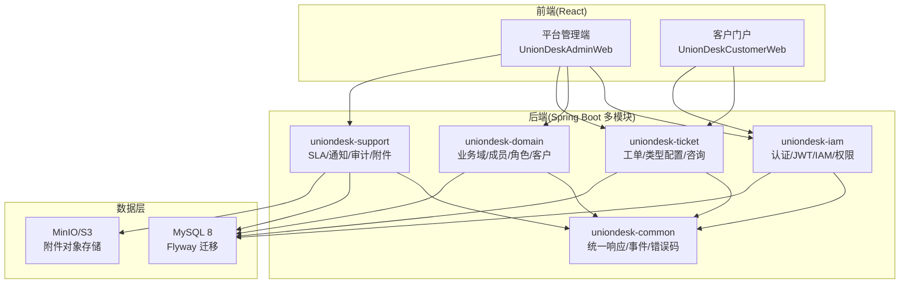
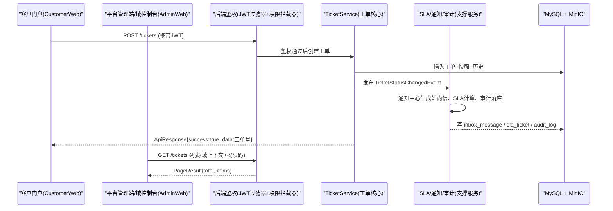
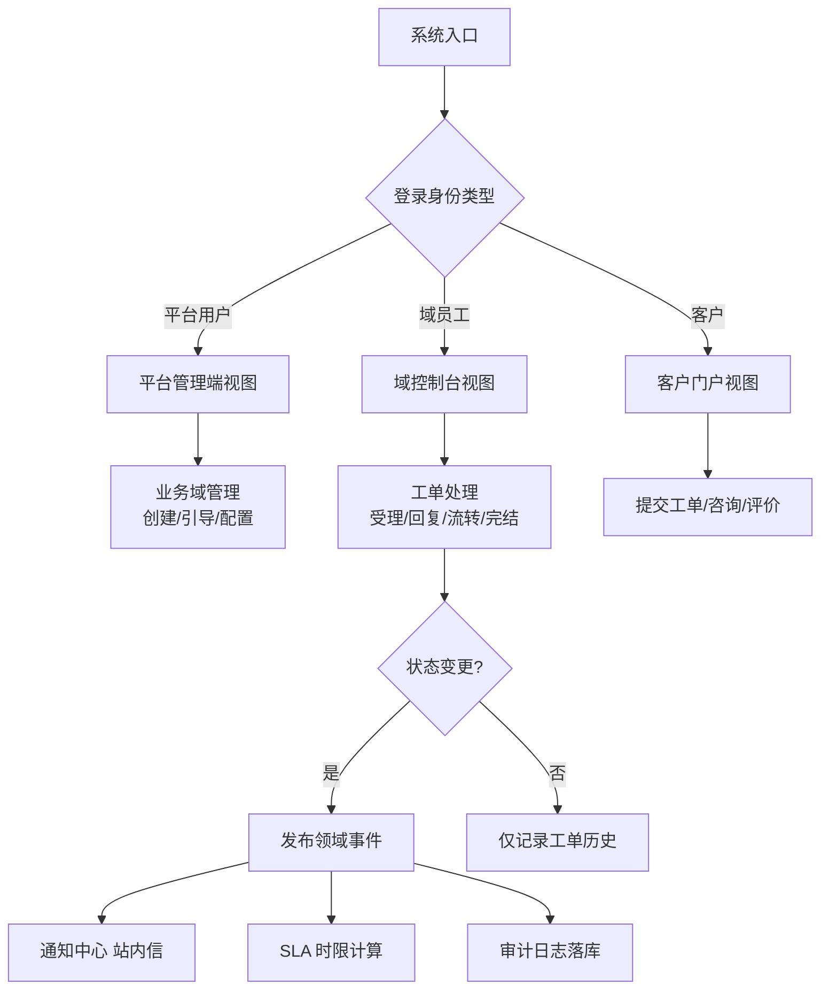
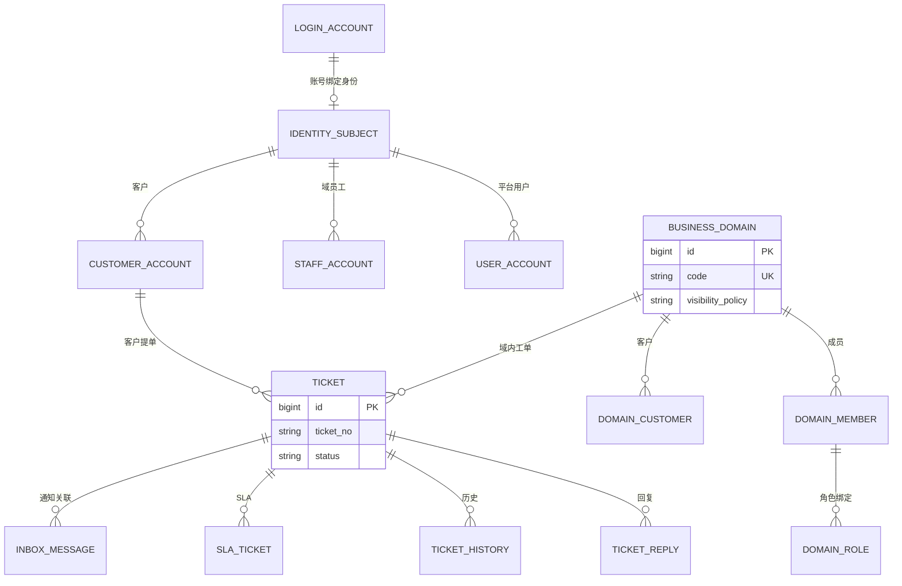
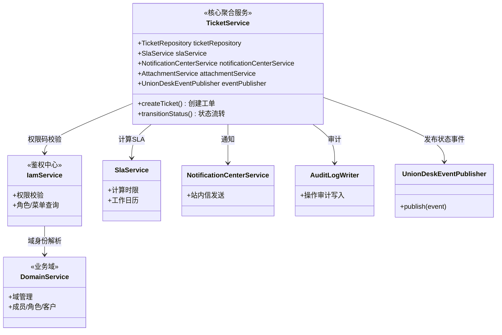

<cite>
- [UnionDesk/uniondesk-app/src/main/java/com/uniondesk/UnionDeskApplication.java](file://UnionDesk/uniondesk-app/src/main/java/com/uniondesk/UnionDeskApplication.java#L9-L17)
- [UnionDesk/uniondesk-common/src/main/java/com/uniondesk/common/web/ApiResponse.java](file://UnionDesk/uniondesk-common/src/main/java/com/uniondesk/common/web/ApiResponse.java#L1-L16)
- [UnionDesk/uniondesk-ticket/src/main/java/com/uniondesk/ticket/core/TicketService.java](file://UnionDesk/uniondesk-ticket/src/main/java/com/uniondesk/ticket/core/TicketService.java#L52-L77)
- [UnionDeskWeb/apps/UnionDeskAdminWeb/src/router/routes/config.ts](file://UnionDeskWeb/apps/UnionDeskAdminWeb/src/router/routes/config.ts#L1-L7)
- [UnionDeskWeb/apps/UnionDeskAdminWeb/src/router/utils/generate-routes-from-backend.ts](file://UnionDeskWeb/apps/UnionDeskAdminWeb/src/router/utils/generate-routes-from-backend.ts#L14-L48)
- [UnionDeskWeb/packages/shared/src/api.ts](file://UnionDeskWeb/packages/shared/src/api.ts#L1-L80)
- [UnionDesk/uniondesk-ticket/src/main/java/com/uniondesk/ticket/core/TicketService.java](file://UnionDesk/uniondesk-ticket/src/main/java/com/uniondesk/ticket/core/TicketService.java#L1-L50)
</cite>

# UnionDesk 系统概述

## 简介

UnionDesk 是一套多租户客服工作台系统，面向「平台运营方 + 业务域（租户）+ 客户」三类角色提供工单处理、业务域管理、权限治理与客户服务能力。系统包含平台管理端、业务域控制台、客户门户三端视图，后端以 Spring Boot 多模块工程承载八大业务领域：工单、业务域、IAM 权限、SLA、通知、审计、附件、在线咨询。

章节来源：
- [UnionDesk/uniondesk-app/src/main/java/com/uniondesk/UnionDeskApplication.java](file://UnionDesk/uniondesk-app/src/main/java/com/uniondesk/UnionDeskApplication.java#L9-L17)
- [UnionDesk/uniondesk-ticket/src/main/java/com/uniondesk/ticket/core/TicketService.java](file://UnionDesk/uniondesk-ticket/src/main/java/com/uniondesk/ticket/core/TicketService.java#L1-L50)

## 项目结构

系统从「端」和「领域」两个维度组织：前端两套应用对应三端中的管理端与门户端；后端五个业务模块 + 一个公共模块对应八大领域。



图表来源：
- [UnionDesk/uniondesk-app/src/main/java/com/uniondesk/UnionDeskApplication.java](file://UnionDesk/uniondesk-app/src/main/java/com/uniondesk/UnionDeskApplication.java#L9-L17)（Mapper 扫描全部模块）
- [UnionDesk/uniondesk-ticket/src/main/java/com/uniondesk/ticket/core/TicketService.java](file://UnionDesk/uniondesk-ticket/src/main/java/com/uniondesk/ticket/core/TicketService.java#L1-L50)（工单服务跨模块依赖：domain/sla/notification/attachment）

## 核心组件

**三端视图**：
- 平台管理端：面向平台运营方，提供业务域管理、平台用户/角色/菜单、全局工单配置、SLA、审计日志、附件、屏蔽词、导入导出等能力。
- 业务域控制台：面向域管理员与员工，提供域内工单队列、客户管理、成员与角色、域配置、工单类型/流程/表单设计、SLA 展示。
- 客户门户：面向最终客户，提供工单提交、进度查看、满意度评价、在线咨询、消息通知。

**八大领域组件**：
| 领域 | 承载模块 | 核心能力 |
| --- | --- | --- |
| 工单 | uniondesk-ticket | 工单全生命周期、回复、历史、状态机、满意度 |
| 业务域 | uniondesk-domain | 域 CRUD、成员、角色、客户、邀请码、角色模板 |
| IAM 权限 | uniondesk-iam | 登录认证、JWT、账号、权限码、菜单、组织 |
| SLA | uniondesk-support | SLA 规则、工作日历、工单 SLA 计算 |
| 通知 | uniondesk-support | 模板、站内信、事件驱动通知 |
| 审计 | uniondesk-support + common | 操作审计、登录日志、审计动作目录 |
| 附件 | uniondesk-support | 上传/下载、策略、对象存储 |
| 咨询 | uniondesk-ticket | 在线咨询会话与消息 |

**公共底座**：`ApiResponse` 统一响应信封（`success/code/message/data`）、`PageResult` 分页、`ErrorCodes` 错误码、领域事件（`UnionDeskEventPublisher`）。

章节来源：
- [UnionDesk/uniondesk-common/src/main/java/com/uniondesk/common/web/ApiResponse.java](file://UnionDesk/uniondesk-common/src/main/java/com/uniondesk/common/web/ApiResponse.java#L1-L16)
- [UnionDesk/uniondesk-ticket/src/main/java/com/uniondesk/ticket/core/TicketService.java](file://UnionDesk/uniondesk-ticket/src/main/java/com/uniondesk/ticket/core/TicketService.java#L52-L77)

## 架构总览

以「客户在门户提交工单 → 域员工处理 → 通知/审计联动」为端到端主线：



图表来源：
- [UnionDesk/uniondesk-ticket/src/main/java/com/uniondesk/ticket/core/TicketService.java](file://UnionDesk/uniondesk-ticket/src/main/java/com/uniondesk/ticket/core/TicketService.java#L73-L77)（通知/SLA/附件/事件发布器注入）
- [UnionDesk/uniondesk-common/src/main/java/com/uniondesk/common/web/ApiResponse.java](file://UnionDesk/uniondesk-common/src/main/java/com/uniondesk/common/web/ApiResponse.java#L3-L16)

## 详细分析

**系统关键机制**：

1. **三端共用一套后端**：管理端与门户端均通过 REST 访问同一后端；`config.ts` 中 `isSendRoutingRequest=true` 表示管理端单独拉取后端路由，门户端使用静态路由，两套前端按端隔离构建。
2. **域上下文（App Scope）**：管理端可同时管理平台全局与某个业务域，请求层通过域上下文区分数据范围，权限码体系按「平台/域」双作用域设计。
3. **工单领域的聚合边界**：`TicketService` 是工单聚合根，注入 10+ 仓储与 5 个跨领域服务（SLA、通知、附件、事件发布、观察者），承担「创建、流转、回复、完结」全流程编排，事务边界与事件发布点集中于此。
4. **事件驱动的旁路联动**：工单状态变更发布 `TicketStatusChangedEvent`，通知中心、审计、SLA 作为监听方异步联动，避免业务主链路耦合。
5. **统一响应契约**：所有接口返回 `ApiResponse` 信封（成功 `code="0"`），前端 API 层统一解包 `{total, items}` 分页信封后渲染。



图表来源：
- [UnionDeskWeb/apps/UnionDeskAdminWeb/src/router/routes/config.ts](file://UnionDeskWeb/apps/UnionDeskAdminWeb/src/router/routes/config.ts#L1-L7)
- [UnionDesk/uniondesk-ticket/src/main/java/com/uniondesk/ticket/core/TicketService.java](file://UnionDesk/uniondesk-ticket/src/main/java/com/uniondesk/ticket/core/TicketService.java#L52-L77)

## 数据模型

系统级实体关系（领域间关联通过业务键而非数据库外键）：



图表来源：
- [UnionDesk/uniondesk-ticket/src/main/java/com/uniondesk/ticket/core/TicketService.java](file://UnionDesk/uniondesk-ticket/src/main/java/com/uniondesk/ticket/core/TicketService.java#L57-L77)（工单聚合依赖的实体与仓储）
- [UnionDeskWeb/packages/shared/src/api.ts](file://UnionDeskWeb/packages/shared/src/api.ts#L1-L80)（前后端契约类型：工单/客户/域/角色）

## 依赖关系分析



图表来源：
- [UnionDesk/uniondesk-ticket/src/main/java/com/uniondesk/ticket/core/TicketService.java](file://UnionDesk/uniondesk-ticket/src/main/java/com/uniondesk/ticket/core/TicketService.java#L52-L77)

## 性能与安全考虑

- **性能**：工单列表走 MyBatis 手写分页 SQL + 信封分页；列表页前端统一 `TableSearchForm + Table` 骨架，查询条件收敛；审计/通知异步写入（`@Async`），主链路不阻塞。
- **安全**：全部接口经 JWT 过滤器认证；业务接口通过 `@RequirePermission` 注解 + 拦截器做权限码校验；域数据按域上下文隔离；附件按策略（类型/大小）约束；登录有验证码与登录日志审计。
- **审计合规**：敏感操作（登录、权限变更、工单流转）写入审计日志，供平台侧追溯。

章节来源：
- [UnionDesk/uniondesk-ticket/src/main/java/com/uniondesk/ticket/core/TicketService.java](file://UnionDesk/uniondesk-ticket/src/main/java/com/uniondesk/ticket/core/TicketService.java#L73-L77)
- [UnionDesk/uniondesk-common/src/main/java/com/uniondesk/common/web/ApiResponse.java](file://UnionDesk/uniondesk-common/src/main/java/com/uniondesk/common/web/ApiResponse.java#L3-L16)

## 故障排查指南

| 现象 | 原因 | 处理建议 |
| --- | --- | --- |
| 管理端打开某个页面 403 | 当前角色缺少对应权限码，或域上下文未切换 | 检查角色权限绑定与 `@RequirePermission` 权限码；确认当前 app-scope 是否正确 |
| 工单创建成功但客户未收到站内信 | 通知监听器异步执行失败，或模板缺失 | 查看 `notification_log` 与异步线程池日志；检查模板 key 是否存在 |
| SLA 显示异常（超时时间不对） | 工作日历/规则配置缺失，或状态变更未触发重算 | 核对 `sla_rule`、`sla_calendar` 配置；确认状态流转事件被监听 |
| 门户端登录 50001 类错误 | 客户账号被禁用或身份解析失败 | 检查 `customer_account` 状态与 `identity_subject` 绑定关系 |
| 响应缺少 data 字段 | 接口直接返回实体而非 ApiResponse 包装 | 统一使用 `ApiResponse.ok(data)` 包装返回 |

章节来源：
- [UnionDesk/uniondesk-common/src/main/java/com/uniondesk/common/web/ApiResponse.java](file://UnionDesk/uniondesk-common/src/main/java/com/uniondesk/common/web/ApiResponse.java#L3-L16)
- [UnionDesk/uniondesk-ticket/src/main/java/com/uniondesk/ticket/core/TicketService.java](file://UnionDesk/uniondesk-ticket/src/main/java/com/uniondesk/ticket/core/TicketService.java#L57-L77)

## 结论

UnionDesk 是一个「三端视图、八大领域、事件驱动旁路联动」的客服工作台系统：前端按端隔离（管理端/门户），后端按领域切模块（iam/domain/ticket/support），公共契约（统一响应、错误码、事件）沉淀在 common 模块。工单领域作为业务核心聚合了 SLA、通知、审计、附件等支撑能力，通过领域事件保持旁路解耦。系统具备完整的权限治理（平台/域双作用域）与审计追溯能力，适合多业务域共享一套平台的运营场景。

章节来源：
- [UnionDesk/uniondesk-app/src/main/java/com/uniondesk/UnionDeskApplication.java](file://UnionDesk/uniondesk-app/src/main/java/com/uniondesk/UnionDeskApplication.java#L9-L17)
- [UnionDesk/uniondesk-ticket/src/main/java/com/uniondesk/ticket/core/TicketService.java](file://UnionDesk/uniondesk-ticket/src/main/java/com/uniondesk/ticket/core/TicketService.java#L1-L77)

## 附录

验证系统端到端可用性（应用启动后）：

```bash
# 1. 健康检查
curl http://127.0.0.1:8080/api/health

# 2. 登录获取令牌（以平台用户为例，实际凭据以环境为准）
curl -X POST http://127.0.0.1:8080/api/auth/login \
  -H "Content-Type: application/json" \
  -d '{"identifier":"admin","password":"***","clientCode":"uniondesk-admin"}'

# 3. 携带令牌查询工单列表（信封结构）
curl http://127.0.0.1:8080/api/tickets?page=1\&page_size=20 \
  -H "Authorization: Bearer <accessToken>"
```

前端联调：

```bash
# 管理端启动（假数据模式由 vite-plugin-fake-server 提供）
cd UnionDeskWeb/apps/UnionDeskAdminWeb && pnpm dev

# 门户端启动
cd UnionDeskWeb/apps/UnionDeskCustomerWeb && pnpm dev
```

章节来源：
- [UnionDeskWeb/packages/shared/src/api.ts](file://UnionDeskWeb/packages/shared/src/api.ts#L1-L80)（API 契约类型）
- [UnionDeskWeb/apps/UnionDeskAdminWeb/src/router/utils/generate-routes-from-backend.ts](file://UnionDeskWeb/apps/UnionDeskAdminWeb/src/router/utils/generate-routes-from-backend.ts#L14-L48)
