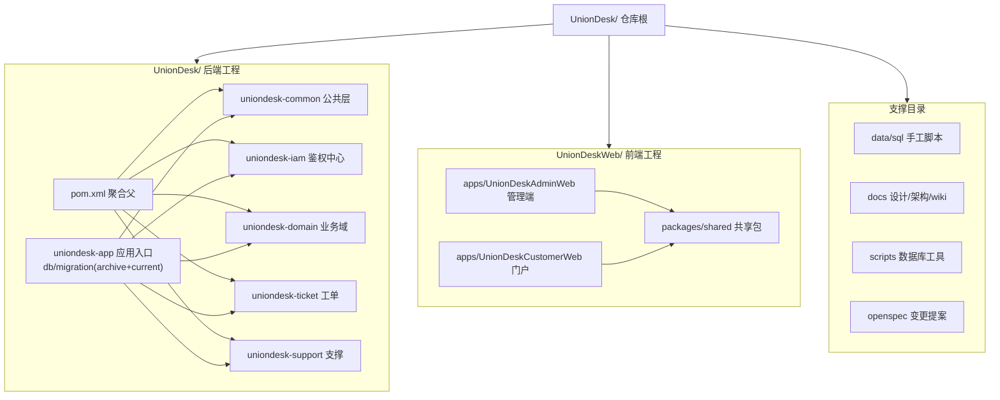
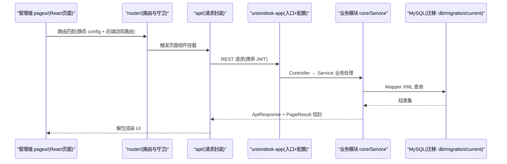
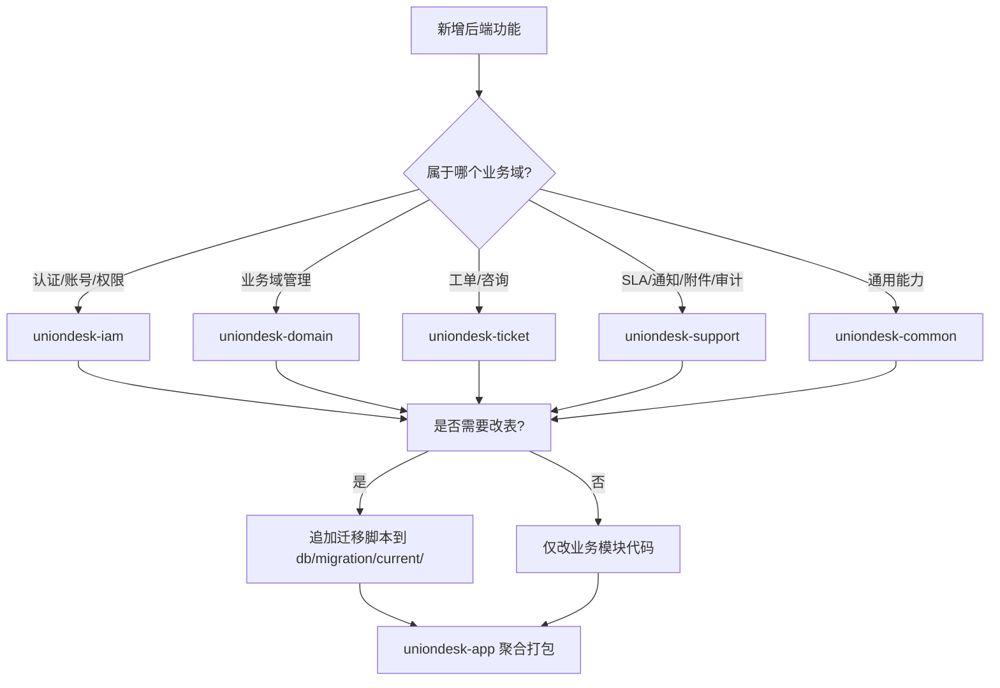
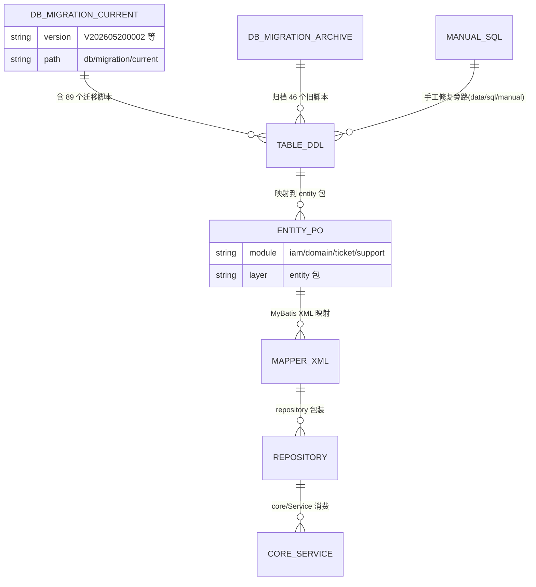

<cite>
- [UnionDesk/pom.xml](file://UnionDesk/pom.xml#L21-L28)
- [UnionDesk/uniondesk-app/pom.xml](file://UnionDesk/uniondesk-app/pom.xml#L13-L15)
- [UnionDesk/uniondesk-app/src/main/resources/db/migration/current/V202605200002__rebaseline_current_schema.sql](file://UnionDesk/uniondesk-app/src/main/resources/db/migration/current/V202605200002__rebaseline_current_schema.sql#L1-L4)
- [UnionDeskWeb/apps/UnionDeskAdminWeb/src/router/routes/config.ts](file://UnionDeskWeb/apps/UnionDeskAdminWeb/src/router/routes/config.ts#L1-L7)
- [UnionDeskWeb/packages/shared/src/api.ts](file://UnionDeskWeb/packages/shared/src/api.ts#L1-L80)
- [UnionDeskWeb/apps/UnionDeskAdminWeb/src/router/utils/generate-routes-from-backend.ts](file://UnionDeskWeb/apps/UnionDeskAdminWeb/src/router/utils/generate-routes-from-backend.ts#L14-L48)
- [UnionDesk/uniondesk-app/src/main/java/com/uniondesk/UnionDeskApplication.java](file://UnionDesk/uniondesk-app/src/main/java/com/uniondesk/UnionDeskApplication.java#L9-L17)
- [UnionDeskWeb/apps/UnionDeskCustomerWeb/package.json](file://UnionDeskWeb/apps/UnionDeskCustomerWeb/package.json#L1-L20)
</cite>

# UnionDesk 项目目录结构详解

## 简介

本文档详解 UnionDesk 仓库根目录的物理布局与模块边界：根目录下并行存在 `UnionDesk/`（后端 Maven 多模块）与 `UnionDeskWeb/`（前端 pnpm monorepo），以及 `data/`、`docs/`、`scripts/`、`openspec/` 等支撑目录。理解该布局是定位代码、判断「代码应放哪个模块」的前提。

章节来源：
- [UnionDesk/pom.xml](file://UnionDesk/pom.xml#L21-L28)
- [UnionDesk/uniondesk-app/pom.xml](file://UnionDesk/uniondesk-app/pom.xml#L13-L15)

## 项目结构

仓库整体分为「后端工程 / 前端工程 / 支撑目录」三大区，其中后端 6 个 Maven 模块、前端 2 个应用 + 1 个共享包。



图表来源：
- [UnionDesk/pom.xml](file://UnionDesk/pom.xml#L21-L28)（后端模块清单）
- [UnionDeskWeb/apps/UnionDeskCustomerWeb/package.json](file://UnionDeskWeb/apps/UnionDeskCustomerWeb/package.json#L13-L20)（前端 workspace 依赖）

## 核心组件

**后端模块内部统一采用分层包结构**（以 `uniondesk-ticket` 为例）：`core/`（Service 业务逻辑）、`web/`（Controller + Dtos）、`entity/`（Po 实体）、`mapper/`（MyBatis 接口）、`repository/`（数据仓储）、`consultation/`（子领域在线咨询）。

| 目录/文件 | 职责 |
| --- | --- |
| `UnionDesk/pom.xml` | 聚合父 POM，声明 6 子模块与统一依赖版本 |
| `UnionDesk/uniondesk-{common,iam,domain,ticket,support}/` | 五大业务/技术模块，各自含 `core/web/entity/mapper/repository` 包 |
| `UnionDesk/uniondesk-app/` | 应用入口：`UnionDeskApplication` 启动类、全局配置、`db/migration/` 数据库迁移 |
| `UnionDesk/uniondesk-app/src/main/resources/db/migration/current/` | **当前生效**的 Flyway 迁移脚本目录（89 个脚本），新迁移只允许追加 |
| `UnionDesk/uniondesk-app/src/main/resources/db/migration/archive/` | 已归档的历史迁移（46 个），仅保留基线参考，不参与新环境执行 |
| `UnionDeskWeb/apps/UnionDeskAdminWeb/src/` | 管理端源码：`api/` `pages/` `router/` `store/` `components/` `layout/` `hooks/` `utils/` 等 |
| `UnionDeskWeb/apps/UnionDeskCustomerWeb/src/` | 客户门户源码：`routes/` `pages/` `components/` `utils/` |
| `UnionDeskWeb/packages/shared/src/` | 共享包：`api.ts` `types.ts` `storage.ts` `permission.tsx` `crypto/` `components/SliderCaptcha` |
| `data/sql/manual/` | 手工执行的运维 SQL（菜单修复、数据修复） |
| `docs/` | 设计文档、架构图、checklist、wiki（本 wiki 输出目录） |
| `scripts/` | Java 工具脚本：`DbBackup`、`DbFlywayCheck`、`GenerateBaselineReference` |

章节来源：
- [UnionDesk/pom.xml](file://UnionDesk/pom.xml#L21-L28)
- [UnionDesk/uniondesk-app/src/main/resources/db/migration/current/V202605200002__rebaseline_current_schema.sql](file://UnionDesk/uniondesk-app/src/main/resources/db/migration/current/V202605200002__rebaseline_current_schema.sql#L1-L4)
- [UnionDeskWeb/packages/shared/src/index.ts](file://UnionDeskWeb/packages/shared/src/index.ts#L1-L10)

## 架构总览

「管理端页面 → 路由 → API → 后端模块 → 数据库」的调用路径与目录职责一一对应：



图表来源：
- [UnionDeskWeb/apps/UnionDeskAdminWeb/src/router/utils/generate-routes-from-backend.ts](file://UnionDeskWeb/apps/UnionDeskAdminWeb/src/router/utils/generate-routes-from-backend.ts#L14-L48)（路由→页面组件映射）
- [UnionDesk/uniondesk-app/src/main/java/com/uniondesk/UnionDeskApplication.java](file://UnionDesk/uniondesk-app/src/main/java/com/uniondesk/UnionDeskApplication.java#L9-L17)（Mapper 全模块扫描）

## 详细分析

**目录划分的六条关键约定**：

1. **后端按领域模块化而非按层模块化**：6 个模块中 5 个对应业务域（iam 鉴权、domain 业务域、ticket 工单、support 支撑），每个模块内部再分 `core/web/entity/mapper/repository` 层——「模块=领域，包=层」。
2. **应用入口单点聚合**：`uniondesk-app` 依赖全部业务模块并在启动类上 `@MapperScan` 通配扫描 `com.uniondesk.**.mapper`，业务模块自身不打包成可运行应用。
3. **迁移脚本目录双轨制**：`current/` 存放所有当前生效迁移（89 个，含 rebaseline 基线），`archive/` 存放被基线替代的旧脚本（46 个）；`V202605200002__rebaseline_current_schema.sql` 文件头明确注释了该策略。
4. **前端按应用拆分、共享包收口**：`apps/` 下两个应用通过 `workspace:*` 依赖 `packages/shared`；管理端 `src/` 下按职责分区（api/router/store/components/pages/layout），页面组件统一放 `pages/`。
5. **页面组件与路由解耦**：`generate-routes-from-backend.ts` 用 `import.meta.glob("/src/pages/**/*.tsx")` 建立「路由 component 字段 → 实际页面文件」的映射，后端只下发路由配置字符串，前端按需懒加载。
6. **支撑目录职责单一**：`data/sql/manual` 只放手写运维脚本（不参与 Flyway）、`docs` 只放文档、`scripts` 只放数据库工具类 Java 脚本、`openspec` 存放变更提案。



图表来源：
- [UnionDesk/pom.xml](file://UnionDesk/pom.xml#L21-L28)
- [UnionDesk/uniondesk-app/src/main/resources/db/migration/current/V202605200002__rebaseline_current_schema.sql](file://UnionDesk/uniondesk-app/src/main/resources/db/migration/current/V202605200002__rebaseline_current_schema.sql#L1-L4)

## 数据模型

目录结构与数据层的关系：迁移脚本目录决定数据库对象来源，`data/sql/manual` 与 `data/databases`（备份）为旁路。



图表来源：
- [UnionDesk/uniondesk-app/src/main/resources/db/migration/current/V202605200002__rebaseline_current_schema.sql](file://UnionDesk/uniondesk-app/src/main/resources/db/migration/current/V202605200002__rebaseline_current_schema.sql#L1-L4)
- [UnionDesk/uniondesk-app/pom.xml](file://UnionDesk/uniondesk-app/pom.xml#L85-L87)（Flyway locations 指向 current）

## 依赖关系分析

```mermaid
classDiagram
    class UnionDeskParent {
        +modules: 6 个子模块
        +java.version = 21
        <<聚合 pom>>
    }
    class UnionDeskApp {
        +UnionDeskApplication 启动类
        +db/migration/current 迁移
        +Flyway 插件配置
        <<应用入口>>
    }
    class BusinessModule {
        +core/ Service
        +web/ Controller+Dtos
        +entity/ Po
        +mapper/ Mapper接口
        +repository/ 仓储
        <<iam/domain/ticket/support>>
    }
    class CommonModule {
        +ApiResponse/PageResult
        +ErrorCodes
        +AuditActionCatalog
        +领域事件
        <<uniondesk-common>>
    }
    class AdminWeb {
        +src/pages 页面
        +src/router 路由
        +src/api 请求
        <<apps/UnionDeskAdminWeb>>
    }
    class SharedPackage {
        +api.ts 类型契约
        +SliderCaptcha 组件
        +storage/permission
        <<packages/shared>>
    }
    UnionDeskParent --> BusinessModule : 聚合
    UnionDeskParent --> CommonModule : 聚合
    BusinessModule --> CommonModule : 依赖
    UnionDeskApp --> BusinessModule : 依赖
    UnionDeskApp --> CommonModule : 依赖
    AdminWeb --> SharedPackage : workspace:*
```

图表来源：
- [UnionDesk/pom.xml](file://UnionDesk/pom.xml#L21-L28)
- [UnionDeskWeb/apps/UnionDeskAdminWeb/package.json](file://UnionDeskWeb/apps/UnionDeskAdminWeb/package.json#L64-L65)

## 性能与安全考虑

- **目录即边界，避免依赖倒灌**：业务模块只允许依赖 `uniondesk-common`，app 聚合业务模块；违反该方向会导致编译期循环依赖，`dependencyManagement` 统一版本降低冲突概率。
- **迁移脚本只追加不修改**：`current/` 目录内已执行脚本改动会触发 Flyway checksum 校验失败，必须新增脚本而非编辑旧脚本；`archive/` 目录不可再执行。
- **前端构建体积**：管理端使用 `import.meta.glob` 懒加载页面 chunk（排除 `exception` 页），目录新增页面会自动参与按需分包，减少首屏体积。
- **敏感文件防护**：`UnionDesk/config/jrebel.local.properties`、数据库密码等本地配置不应提交；`agent-work/` 为 .gitignore 忽略的临时文件目录。

章节来源：
- [UnionDesk/uniondesk-app/pom.xml](file://UnionDesk/uniondesk-app/pom.xml#L76-L96)（Flyway 插件配置）
- [UnionDeskWeb/apps/UnionDeskAdminWeb/src/router/utils/generate-routes-from-backend.ts](file://UnionDeskWeb/apps/UnionDeskAdminWeb/src/router/utils/generate-routes-from-backend.ts#L14-L18)（glob 懒加载）

## 故障排查指南

| 现象 | 原因 | 处理建议 |
| --- | --- | --- |
| 后端启动找不到某个 Mapper Bean | 新增的 Mapper 所在模块未加入 `uniondesk-app` 依赖，或包名不在 `com.uniondesk.**.mapper` 下 | 检查 `uniondesk-app/pom.xml` 依赖；确认 Mapper 接口位于 `com.uniondesk.<模块>.mapper` |
| Flyway 迁移 Validate 失败 | 修改了 `db/migration/current/` 中已执行过的脚本 | 用 `scripts/DbFlywayCheck.java` 定位差异；恢复旧脚本内容，新增迁移脚本承载变更 |
| 前端新增页面后路由 404 | 后端下发的路由 component 路径与实际页面文件不匹配 | 页面必须放 `src/pages/` 下，component 以 `./` 或 `/src/pages/` 开头；参考 `getComponentPathByRoute` 的路径解析规则 |
| `pnpm install` 后共享包缺失导出 | `packages/shared/src` 新增文件未在 `index.ts` 收口导出 | 在 `UnionDeskWeb/packages/shared/src/index.ts` 追加 `export *`，两端才能引用 |

章节来源：
- [UnionDeskWeb/apps/UnionDeskAdminWeb/src/router/utils/generate-routes-from-backend.ts](file://UnionDeskWeb/apps/UnionDeskAdminWeb/src/router/utils/generate-routes-from-backend.ts#L24-L48)
- [UnionDeskWeb/packages/shared/src/index.ts](file://UnionDeskWeb/packages/shared/src/index.ts#L1-L10)

## 结论

UnionDesk 的目录结构遵循「**后端按领域切模块、前端按端切应用、共享契约单独收口、数据迁移双目录管理**」四项原则。定位代码时：先判断业务域（iam/domain/ticket/support/common），再进入模块内分层包（core/web/entity/mapper/repository）；前端先判断端（AdminWeb/CustomerWeb），再进入 src 的职责分区。数据库变更一律追加到 `db/migration/current/`，禁止触碰已执行脚本与 `archive/`。

章节来源：
- [UnionDesk/pom.xml](file://UnionDesk/pom.xml#L21-L28)
- [UnionDesk/uniondesk-app/src/main/resources/db/migration/current/V202605200002__rebaseline_current_schema.sql](file://UnionDesk/uniondesk-app/src/main/resources/db/migration/current/V202605200002__rebaseline_current_schema.sql#L1-L4)

## 附录

查看目录结构关键命令：

```bash
# 后端模块清单
ls UnionDesk/uniondesk-*

# 当前生效的迁移脚本列表（按版本号排序）
ls UnionDesk/uniondesk-app/src/main/resources/db/migration/current/ | sort

# 检查 Flyway 迁移状态（scripts 工具）
mvn -f UnionDesk/pom.xml -pl uniondesk-app flyway:info

# 前端 workspace 依赖树
cd UnionDeskWeb && pnpm ls -r --depth 1

# 新增页面后验证路由懒加载映射是否生效
cd apps/UnionDeskAdminWeb && pnpm typecheck
```

章节来源：
- [UnionDesk/uniondesk-app/pom.xml](file://UnionDesk/uniondesk-app/pom.xml#L76-L96)（flyway:info 可用的插件配置）
- [UnionDeskWeb/apps/UnionDeskAdminWeb/package.json](file://UnionDeskWeb/apps/UnionDeskAdminWeb/package.json#L21-L35)
