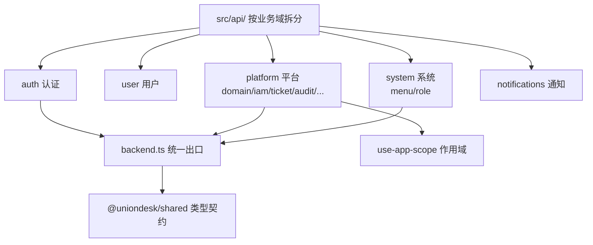
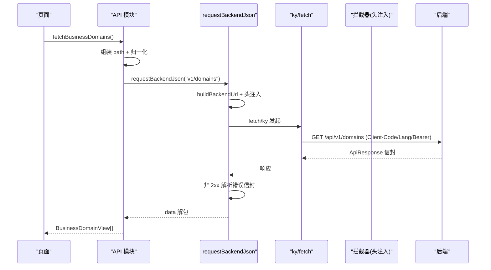
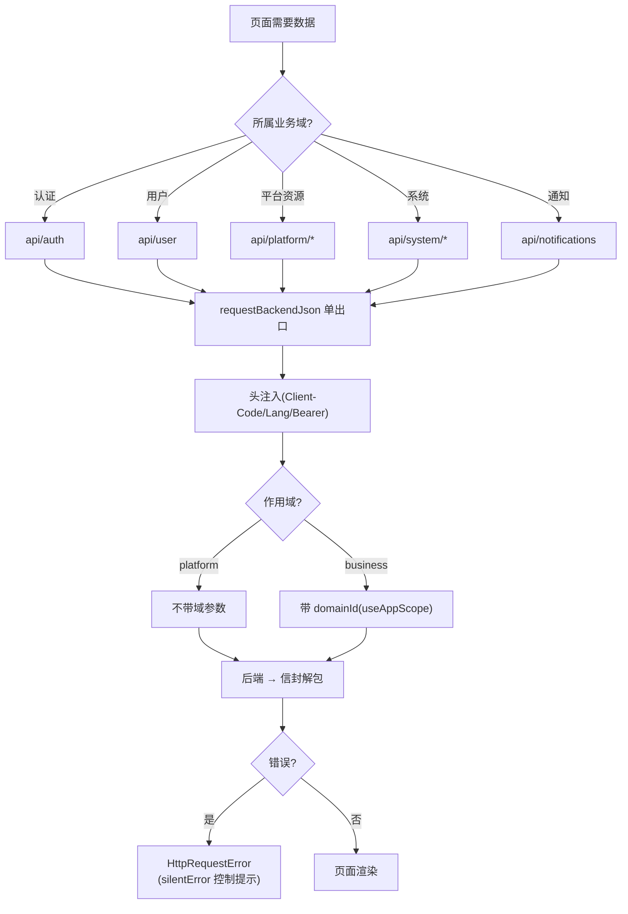
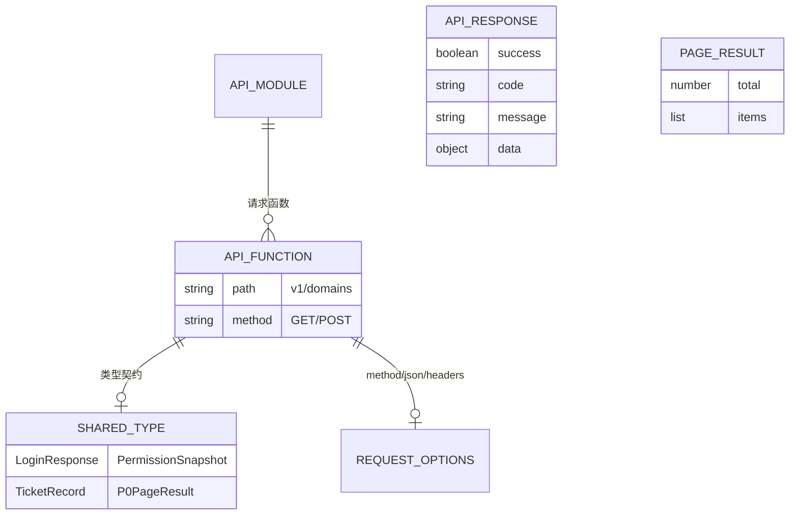
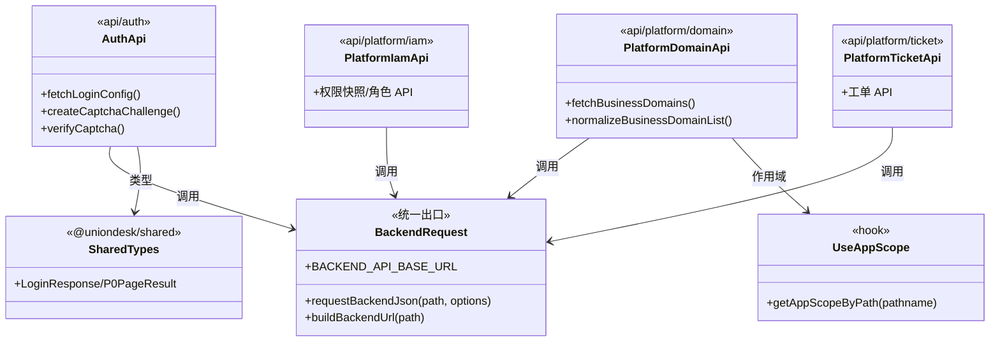

<cite>
- [UnionDeskWeb/apps/UnionDeskAdminWeb/src/api/backend.ts](file://UnionDeskWeb/apps/UnionDeskAdminWeb/src/api/backend.ts#L1-L60)
- [UnionDeskWeb/apps/UnionDeskAdminWeb/src/api/platform/domain.ts](file://UnionDeskWeb/apps/UnionDeskAdminWeb/src/api/platform/domain.ts#L1-L13)
- [UnionDeskWeb/apps/UnionDeskAdminWeb/src/api/auth/index.ts](file://UnionDeskWeb/apps/UnionDeskAdminWeb/src/api/auth/index.ts#L1-L57)
- [UnionDeskWeb/apps/UnionDeskAdminWeb/src/hooks/use-app-scope/index.ts](file://UnionDeskWeb/apps/UnionDeskAdminWeb/src/hooks/use-app-scope/index.ts#L1-L13)
- [UnionDeskWeb/apps/UnionDeskAdminWeb/src/utils/request/index.ts](file://UnionDeskWeb/apps/UnionDeskAdminWeb/src/utils/request/index.ts#L103-L118)
- [UnionDeskWeb/packages/shared/src/api.ts](file://UnionDeskWeb/packages/shared/src/api.ts#L1-L80)
- [UnionDeskWeb/apps/UnionDeskAdminWeb/src/api/platform/ticket.ts](file://UnionDeskWeb/apps/UnionDeskAdminWeb/src/api/platform/ticket.ts#L1-L30)
- [UnionDeskWeb/apps/UnionDeskAdminWeb/src/api/platform/iam.ts](file://UnionDeskWeb/apps/UnionDeskAdminWeb/src/api/platform/iam.ts#L1-L20)
</cite>

# UnionDesk 前端 API 调用集成

## 简介

本文档详解前端 API 调用集成：`api/` 目录按业务域拆分（auth/user/platform/system/notifications）、类型定义（shared 包 + 各模块 types）、统一请求出口（`backend.ts` 的 `requestBackendJson` + `utils/request` 的 ky 客户端）、平台/域双作用域切换（`useAppScope`）、错误提示与国际化（LANG_HEADER + i18n）。API 层是页面与后端契约的桥。

章节来源：
- [UnionDeskWeb/apps/UnionDeskAdminWeb/src/api/backend.ts](file://UnionDeskWeb/apps/UnionDeskAdminWeb/src/api/backend.ts#L1-L60)
- [UnionDeskWeb/apps/UnionDeskAdminWeb/src/api/auth/index.ts](file://UnionDeskWeb/apps/UnionDeskAdminWeb/src/api/auth/index.ts#L1-L57)

## 项目结构

API 层组织：



图表来源：
- [UnionDeskWeb/apps/UnionDeskAdminWeb/src/api/backend.ts](file://UnionDeskWeb/apps/UnionDeskAdminWeb/src/api/backend.ts#L1-L29)
- [UnionDeskWeb/apps/UnionDeskAdminWeb/src/api/platform/domain.ts](file://UnionDeskWeb/apps/UnionDeskAdminWeb/src/api/platform/domain.ts#L1-L13)

## 核心组件

**1. 统一请求出口（backend.ts）**：`requestBackendJson<T>(path, options)`（L29-60）——`BACKEND_API_BASE_URL`（L10）+ `buildBackendUrl`（L25-27）；注入 `X-Client-Code`（ud-admin-web）+ `LANG_HEADER`（L31-32）+ 非白名单 `Bearer token`（L34-38）；JSON 序列化（L40-44）；非 2xx 解析错误信封（L52-60）——单出口统一行为。

**2. 业务 API 模块**：
- `platform/domain.ts`（L1-13）：`fetchBusinessDomains`（L11-12）——`BusinessDomainListResponse` 归一化（数组或 `{list}`，L5-9）。
- `auth/index.ts`（L1-57）：`fetchLoginConfig/updateLoginConfig/createCaptchaChallenge/verifyCaptcha`（L35-57）——类型全部 re-export 自 shared（L20-33）。
- `platform/ticket.ts`/`platform/iam.ts`：工单与权限 API（`requestBackendJson` 调用）。
- `system/menu|role`、`notifications`：系统与通知模块。

**3. 类型定义双轨**：跨端共享类型在 `@uniondesk/shared`（api.ts L1-80 全部请求/响应类型）；单端内部类型在模块 `types.ts`（auth L16 引用 `#src/api/user/types`）。

**4. useAppScope（hooks/use-app-scope）**：`getAppScopeByPath(pathname)`（L9-13）——当前路由判定 platform/business 作用域——API 层据此组装域参数。

**5. 双请求客户端**：`requestBackendJson`（fetch 直连，backend.ts）与 `utils/request` 的 ky 客户端（request/backendRequest，L103-118）——业务与调试双通道。

**6. 错误与国际化**：非 2xx 解析后端信封 `{code, message}`（L52-60）→ `HttpRequestError`（L6）；`LANG_HEADER` 随请求传语言偏好（L32）——服务端文案国际化。

章节来源：
- [UnionDeskWeb/apps/UnionDeskAdminWeb/src/api/backend.ts](file://UnionDeskWeb/apps/UnionDeskAdminWeb/src/api/backend.ts#L29-L60)
- [UnionDeskWeb/apps/UnionDeskAdminWeb/src/api/auth/index.ts](file://UnionDeskWeb/apps/UnionDeskAdminWeb/src/api/auth/index.ts#L35-L57)
- [UnionDeskWeb/apps/UnionDeskAdminWeb/src/hooks/use-app-scope/index.ts](file://UnionDeskWeb/apps/UnionDeskAdminWeb/src/hooks/use-app-scope/index.ts#L9-L13)

## 架构总览

页面调用 API 的完整链路：



图表来源：
- [UnionDeskWeb/apps/UnionDeskAdminWeb/src/api/backend.ts](file://UnionDeskWeb/apps/UnionDeskAdminWeb/src/api/backend.ts#L29-L60)
- [UnionDeskWeb/apps/UnionDeskAdminWeb/src/api/platform/domain.ts](file://UnionDeskWeb/apps/UnionDeskAdminWeb/src/api/platform/domain.ts#L5-L13)

## 详细分析

**API 集成设计要点**：

1. **按业务域拆文件**：`api/auth|user|platform|system|notifications`——与后端模块对应；`platform/` 内再按资源（domain/iam/ticket/audit/attachment/overview）拆——定位即达。
2. **单出口统一行为**：所有 API 模块只调 `requestBackendJson`（backend.ts）——头注入/错误解析/白名单集中一处；`silentError` 选项（L22）让调用方决定是否弹全局错误。
3. **类型契约收口**：跨端类型（LoginResponse/PermissionSnapshot/TicketRecord 等）在 `@uniondesk/shared`（api.ts）——双端共用防漂移；模块级类型（`user/types.ts`）承载单端细节。
4. **信封归一化**：`normalizeBusinessDomainList`（domain.ts L7-9）兼容数组与 `{list}` 两种响应——历史演进兼容。
5. **作用域驱动参数**：`useAppScope` 判定当前端（platform/business）→ API 组装 `menuScope/domainId` 参数（如权限快照查询）——平台/域双作用域切换。
6. **错误提示与国际化**：`HttpRequestError` 携带后端 code/message（L6）；`LANG_HEADER` 传语言（L32）——文案由后端按语言返回，前端 i18n 兜底。
7. **调试通道**：`utils/request` 的 `backendRequest`（L118）直连本地后端——联调不停服。



图表来源：
- [UnionDeskWeb/apps/UnionDeskAdminWeb/src/api/backend.ts](file://UnionDeskWeb/apps/UnionDeskAdminWeb/src/api/backend.ts#L17-L60)
- [UnionDeskWeb/apps/UnionDeskAdminWeb/src/hooks/use-app-scope/index.ts](file://UnionDeskWeb/apps/UnionDeskAdminWeb/src/hooks/use-app-scope/index.ts#L1-L13)

## 数据模型

API 层数据对象：



图表来源：
- [UnionDeskWeb/apps/UnionDeskAdminWeb/src/api/backend.ts](file://UnionDeskWeb/apps/UnionDeskAdminWeb/src/api/backend.ts#L17-L50)
- [UnionDeskWeb/packages/shared/src/api.ts](file://UnionDeskWeb/packages/shared/src/api.ts#L1-L80)

## 依赖关系分析



图表来源：
- [UnionDeskWeb/apps/UnionDeskAdminWeb/src/api/backend.ts](file://UnionDeskWeb/apps/UnionDeskAdminWeb/src/api/backend.ts#L1-L29)
- [UnionDeskWeb/apps/UnionDeskAdminWeb/src/api/auth/index.ts](file://UnionDeskWeb/apps/UnionDeskAdminWeb/src/api/auth/index.ts#L1-L57)
- [UnionDeskWeb/apps/UnionDeskAdminWeb/src/api/platform/domain.ts](file://UnionDeskWeb/apps/UnionDeskAdminWeb/src/api/platform/domain.ts#L1-L13)

## 性能与安全考虑

- **性能**：单出口集中配置（超时/重试）；列表分页参数化；类型化避免运行时解析开销。
- **安全**：JWT 统一注入（白名单除外）；`silentError` 控制错误暴露；敏感操作 step-up；`LANG_HEADER` 语言参数。
- **一致性**：信封解包（success/code）统一分支；`{total, items}` 分页稳定；shared 类型防字段漂移。
- **可维护性**：按业务域拆文件定位即达；单出口改动一处生效；双客户端支持联调。

章节来源：
- [UnionDeskWeb/apps/UnionDeskAdminWeb/src/api/backend.ts](file://UnionDeskWeb/apps/UnionDeskAdminWeb/src/api/backend.ts#L12-L15)
- [UnionDeskWeb/apps/UnionDeskAdminWeb/src/api/backend.ts](file://UnionDeskWeb/apps/UnionDeskAdminWeb/src/api/backend.ts#L34-L38)

## 故障排查指南

| 现象 | 原因 | 处理建议 |
| --- | --- | --- |
| 接口 401 | token 未注入（白名单误判）或已过期 | 检查 `requestWhiteList`；走刷新链路 |
| 数据字段 undefined | shared 类型与后端契约不一致 | 更新 `@uniondesk/shared` 类型 |
| 列表为空但接口有数据 | 信封归一化失败（数组 vs {list}） | 检查 `normalizeBusinessDomainList`；对齐响应格式 |
| 错误提示不显示 | `silentError=true` 或错误码未映射 | 检查调用方 `silentError` 参数；补充映射 |
| 平台/域参数错误 | `useAppScope` 判定与路由不符 | 检查 `getAppScopeByPath`；核对路径前缀 |

章节来源：
- [UnionDeskWeb/apps/UnionDeskAdminWeb/src/api/backend.ts](file://UnionDeskWeb/apps/UnionDeskAdminWeb/src/api/backend.ts#L17-L23)
- [UnionDeskWeb/apps/UnionDeskAdminWeb/src/api/platform/domain.ts](file://UnionDeskWeb/apps/UnionDeskAdminWeb/src/api/platform/domain.ts#L5-L9)

## 结论

前端 API 调用集成以「**按域拆分、单出口、类型收口、作用域驱动**」为核心：`api/` 按 auth/user/platform/system/notifications 拆分与后端对应，`requestBackendJson` 单出口统一头注入与错误解析，类型契约收口到 `@uniondesk/shared` 防漂移，`useAppScope` 驱动平台/域双作用域参数，错误提示与国际化经 `LANG_HEADER` + `HttpRequestError` 落地。新增接口只需「建函数 + 引类型 + 走单出口」三步。

章节来源：
- [UnionDeskWeb/apps/UnionDeskAdminWeb/src/api/backend.ts](file://UnionDeskWeb/apps/UnionDeskAdminWeb/src/api/backend.ts#L1-L60)
- [UnionDeskWeb/apps/UnionDeskAdminWeb/src/api/auth/index.ts](file://UnionDeskWeb/apps/UnionDeskAdminWeb/src/api/auth/index.ts#L1-L57)

## 附录

API 集成模板：

```ts
// 1. 业务 API 模块（api/platform/demo.ts）
import type { DemoView } from "@uniondesk/shared";
import { requestBackendJson } from "#src/api/backend";

export function fetchDemos(params: { page: number; page_size: number }) {
	return requestBackendJson<{ total: number; items: DemoView[] }>("v1/admin/demos", {
		searchParams: params,
	});
}

// 2. 页面使用（useAppScope 驱动域参数）
const scope = useAppScope();
const domainId = scope === "business" ? currentDomainId : undefined;

// 3. 错误静默处理（调用方自定义提示）
try {
	await fetchDemos({ page: 1, page_size: 20 });
}
catch (error) {
	if (error instanceof HttpRequestError) {
		message.error(error.message);
	}
}
```

章节来源：
- [UnionDeskWeb/apps/UnionDeskAdminWeb/src/api/backend.ts](file://UnionDeskWeb/apps/UnionDeskAdminWeb/src/api/backend.ts#L17-L60)
- [UnionDeskWeb/apps/UnionDeskAdminWeb/src/hooks/use-app-scope/index.ts](file://UnionDeskWeb/apps/UnionDeskAdminWeb/src/hooks/use-app-scope/index.ts#L9-L13)
- [UnionDeskWeb/apps/UnionDeskAdminWeb/src/api/platform/ticket.ts](file://UnionDeskWeb/apps/UnionDeskAdminWeb/src/api/platform/ticket.ts#L1-L30)
