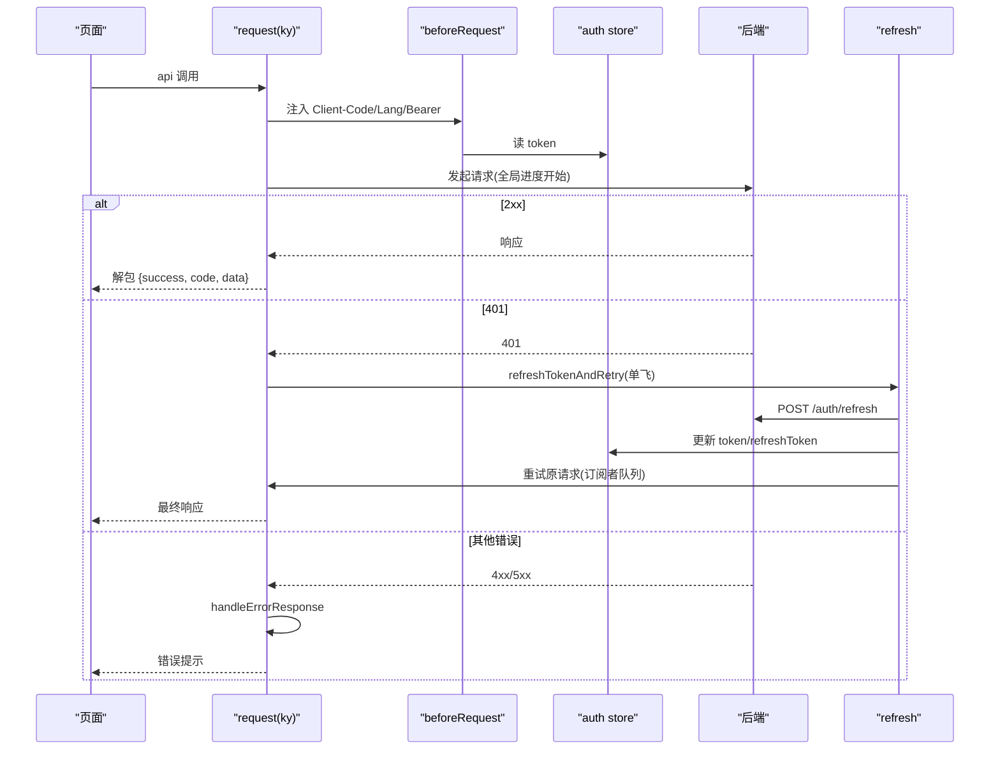
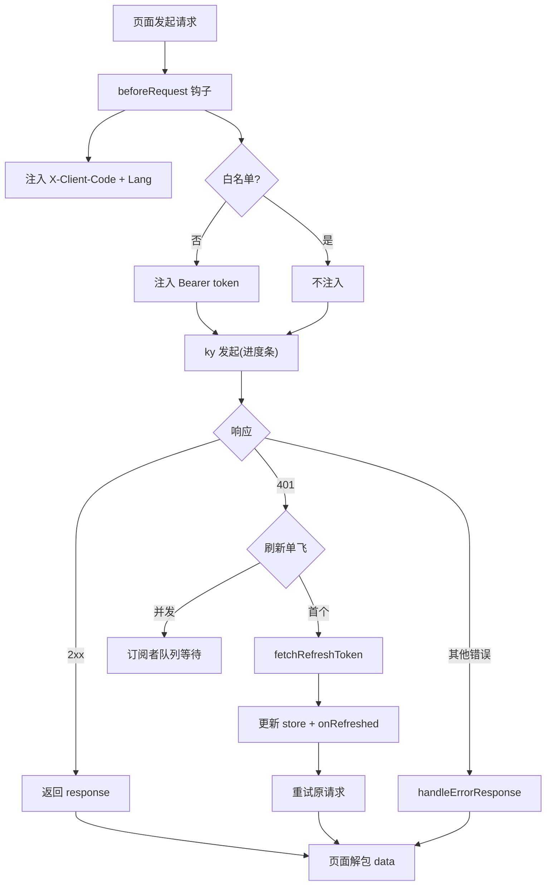
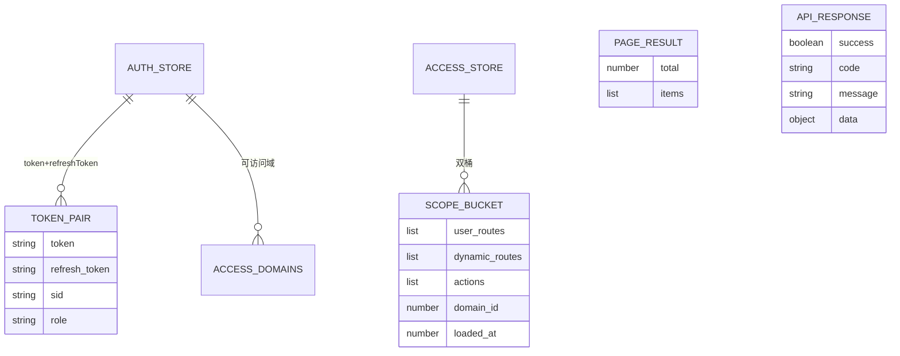
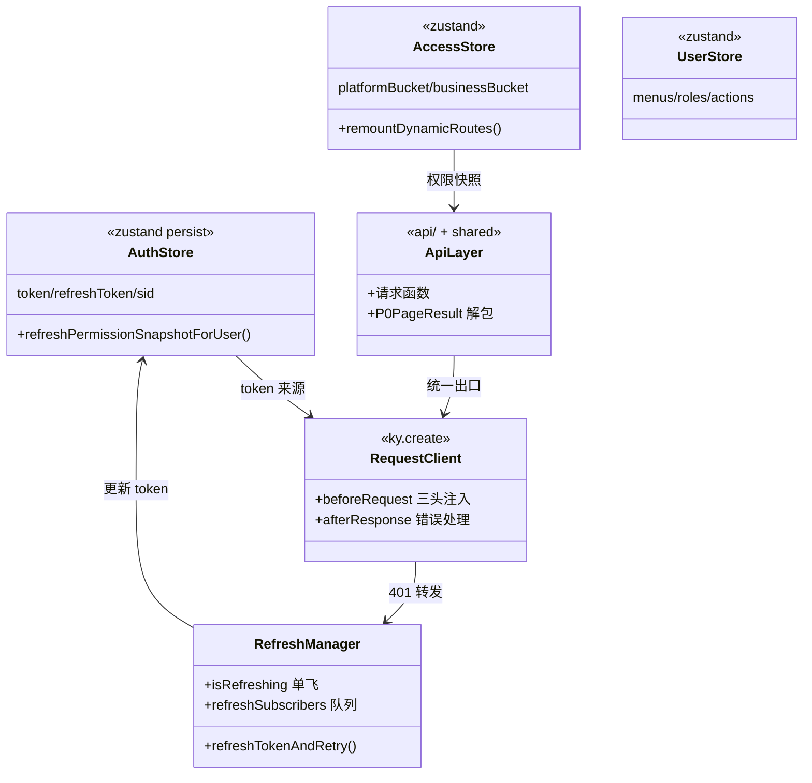

<cite>
- [UnionDeskWeb/apps/UnionDeskAdminWeb/src/store/auth.ts](file://UnionDeskWeb/apps/UnionDeskAdminWeb/src/store/auth.ts#L32-L56)
- [UnionDeskWeb/apps/UnionDeskAdminWeb/src/store/auth.ts](file://UnionDeskWeb/apps/UnionDeskAdminWeb/src/store/auth.ts#L60-L80)
- [UnionDeskWeb/apps/UnionDeskAdminWeb/src/store/access.ts](file://UnionDeskWeb/apps/UnionDeskAdminWeb/src/store/access.ts#L17-L54)
- [UnionDeskWeb/apps/UnionDeskAdminWeb/src/utils/request/index.ts](file://UnionDeskWeb/apps/UnionDeskAdminWeb/src/utils/request/index.ts#L1-L118)
- [UnionDeskWeb/apps/UnionDeskAdminWeb/src/utils/request/refresh.ts](file://UnionDeskWeb/apps/UnionDeskAdminWeb/src/utils/request/refresh.ts#L9-L114)
- [UnionDeskWeb/apps/UnionDeskAdminWeb/src/api/backend.ts](file://UnionDeskWeb/apps/UnionDeskAdminWeb/src/api/backend.ts#L1-L30)
- [UnionDeskWeb/packages/shared/src/api.ts](file://UnionDeskWeb/packages/shared/src/api.ts#L1-L80)
</cite>

# UnionDesk 全局状态管理与网络层

## 简介

本文档详解前端全局状态管理与网络层：zustand store（auth/user/access/tabs/global/preferences）、ky 请求封装（`utils/request` 拦截器：客户端头/语言头/JWT 注入/全局进度/白名单）、令牌刷新（`refresh.ts` 单飞刷新 + 订阅者队列）、错误处理（`handleErrorResponse`）、API 层信封解包（`{total, items}`）。网络层是前后端契约的执行者。

章节来源：
- [UnionDeskWeb/apps/UnionDeskAdminWeb/src/store/auth.ts](file://UnionDeskWeb/apps/UnionDeskAdminWeb/src/store/auth.ts#L32-L56)
- [UnionDeskWeb/apps/UnionDeskAdminWeb/src/utils/request/index.ts](file://UnionDeskWeb/apps/UnionDeskAdminWeb/src/utils/request/index.ts#L1-L28)

## 项目结构

状态与网络层组件：

```mermaid
graph TB
    STORE["store/ zustand"]
    AUTH["auth 登录态"]
    USER["user 用户信息"]
    ACCESS["access 权限包双桶"]
    TABS["tabs 页签"]
    PREFS["preferences 偏好"]
    REQ["utils/request ky 封装"]
    HOOKS["beforeRequest + afterResponse"]
    REFRESH["refresh 令牌单飞刷新"]
    ERR["error-response 错误处理"]
    STORE --> AUTH & USER & ACCESS & TABS & PREFS
    REQ --> HOOKS & REFRESH & ERR
    AUTH --> REQ : token 注入
```

图表来源：
- [UnionDeskWeb/apps/UnionDeskAdminWeb/src/utils/request/index.ts](file://UnionDeskWeb/apps/UnionDeskAdminWeb/src/utils/request/index.ts#L8-L28)
- [UnionDeskWeb/apps/UnionDeskAdminWeb/src/store/access.ts](file://UnionDeskWeb/apps/UnionDeskAdminWeb/src/store/access.ts#L17-L54)

## 核心组件

**1. auth store**：`initialState`（L32-56）——`token/refreshToken/sid/role/clientCode/tokenType/expiresInSeconds/defaultBusinessDomainId/accessibleDomains/user`；`persist` 中间件持久化；`refreshPermissionSnapshotForUser`（L60-80）登录后按 business/platform 作用域拉权限快照重建用户信息。

**2. access store（权限包双桶）**：`ScopeAccessBucket`（L17-25）——`userRoutes/dynamicRoutes/actions/domainId/loadedAt`；`platformBucket/businessBucket` 双桶（L29-30）+ 当前投影（userMenus/routeList/flatRouteList）——切换域按桶投影。

**3. user/tabs/global/preferences store**：用户信息（menus/roles/actions/域访问）、顶栏页签、全局偏好（语言/主题）。

**4. request 封装（utils/request/index.ts）**：ky.create（L103-115）——`prefix`（VITE_API_BASE_URL）、`timeout` 10s、`retry.limit=3`；`beforeRequestHook`（L30-62）：注入 `X-Client-Code`（默认 ud-admin-web）+ `LANG_HEADER` + 非白名单请求注入 `Bearer token`；`afterResponseHook`（L64-101）：全局进度完成 → 非 2xx 处理（白名单直返错误 / 401 刷新重试 / 其他错误响应）；`request` 与 `backendRequest`（L117-118）双客户端。

**5. 令牌刷新（refresh.ts）**：`refreshTokenAndRetry`（L20-70）——`isRefreshing` 单飞标志：首个请求调 `fetchRefreshToken` 换新 token → `onRefreshed` 通知订阅者重试；并发请求进订阅者队列（L55-69）等待；失败 `onRefreshFailed` + `goLogin`（L41-49）。

**6. API 层（api/backend.ts + shared/api.ts）**：请求函数 + 类型契约集中（`backend.ts` 后端调用、`shared/api.ts` 双端共享类型与信封）——列表接口解包 `{total, items}`（`P0PageResult`）。

章节来源：
- [UnionDeskWeb/apps/UnionDeskAdminWeb/src/utils/request/index.ts](file://UnionDeskWeb/apps/UnionDeskAdminWeb/src/utils/request/index.ts#L30-L118)
- [UnionDeskWeb/apps/UnionDeskAdminWeb/src/utils/request/refresh.ts](file://UnionDeskWeb/apps/UnionDeskAdminWeb/src/utils/request/refresh.ts#L20-L114)
- [UnionDeskWeb/apps/UnionDeskAdminWeb/src/store/access.ts](file://UnionDeskWeb/apps/UnionDeskAdminWeb/src/store/access.ts#L17-L54)

## 架构总览

请求生命周期（含 401 刷新重试）：



图表来源：
- [UnionDeskWeb/apps/UnionDeskAdminWeb/src/utils/request/index.ts](file://UnionDeskWeb/apps/UnionDeskAdminWeb/src/utils/request/index.ts#L64-L101)
- [UnionDeskWeb/apps/UnionDeskAdminWeb/src/utils/request/refresh.ts](file://UnionDeskWeb/apps/UnionDeskAdminWeb/src/utils/request/refresh.ts#L20-L70)

## 详细分析

**设计要点**：

1. **ky 钩子式拦截**：`beforeRequest` 统一注入三头（客户端/语言/认证，L30-62）；`afterResponse` 统一错误处理（L64-101）——页面代码零拦截逻辑；`retry.limit=3` 网络抖动重试。
2. **白名单机制**：登录/刷新等路径不进 JWT 注入（`requestWhiteList` L22-26）——认证端点不携带旧 token。
3. **令牌单飞刷新**：`isRefreshing` 标志保证并发 401 只发一次 refresh（L21-22）；订阅者队列（L74-77）让并发请求等待新 token 后统一重试——避免刷新风暴；失败统一 `goLogin`（L46）。
4. **权限快照重建**：登录后 `refreshPermissionSnapshotForUser`（auth.ts L60-80）按「业务域可用则 business scope + 默认域，否则 platform scope」拉取快照——登录态与权限包联动。
5. **权限包双桶**：`ScopeAccessBucket` 双桶缓存（access.ts L29-30）——平台/业务域各一份路由+动作，切域零请求；`remountDynamicRoutes`（L56+）处理 React Router 7 动态路由重挂载。
6. **信封解包**：列表响应 `{total, items}`（`P0PageResult` shared/api.ts L48）——API 层解包后页面直接消费。
7. **双请求客户端**：`request`（业务）与 `backendRequest`（本地后端调试，L118）——联调切换。



图表来源：
- [UnionDeskWeb/apps/UnionDeskAdminWeb/src/utils/request/index.ts](file://UnionDeskWeb/apps/UnionDeskAdminWeb/src/utils/request/index.ts#L30-L101)
- [UnionDeskWeb/apps/UnionDeskAdminWeb/src/utils/request/refresh.ts](file://UnionDeskWeb/apps/UnionDeskAdminWeb/src/utils/request/refresh.ts#L20-L114)

## 数据模型

状态与网络数据对象：



图表来源：
- [UnionDeskWeb/apps/UnionDeskAdminWeb/src/store/auth.ts](file://UnionDeskWeb/apps/UnionDeskAdminWeb/src/store/auth.ts#L32-L56)
- [UnionDeskWeb/apps/UnionDeskAdminWeb/src/store/access.ts](file://UnionDeskWeb/apps/UnionDeskAdminWeb/src/store/access.ts#L17-L54)
- [UnionDeskWeb/packages/shared/src/api.ts](file://UnionDeskWeb/packages/shared/src/api.ts#L48-L48)

## 依赖关系分析



图表来源：
- [UnionDeskWeb/apps/UnionDeskAdminWeb/src/utils/request/index.ts](file://UnionDeskWeb/apps/UnionDeskAdminWeb/src/utils/request/index.ts#L8-L12)
- [UnionDeskWeb/apps/UnionDeskAdminWeb/src/utils/request/refresh.ts](file://UnionDeskWeb/apps/UnionDeskAdminWeb/src/utils/request/refresh.ts#L1-L8)
- [UnionDeskWeb/apps/UnionDeskAdminWeb/src/store/auth.ts](file://UnionDeskWeb/apps/UnionDeskAdminWeb/src/store/auth.ts#L6-L20)

## 性能与安全考虑

- **性能**：权限包双桶缓存防切域重复请求；`retry.limit=3` 网络重试；全局进度条反馈；zustand 轻量订阅。
- **安全**：JWT 仅注入非白名单请求；刷新失败 `goLogin` 防死循环；token 持久化（persist）但敏感操作仍走 step-up；错误响应统一处理防泄露。
- **一致性**：单飞刷新保证并发请求统一重试；信封解包（success/code）统一分支；`{total, items}` 分页结构稳定。
- **可维护性**：ky 钩子集中拦截；`api/` 与 `shared` 契约集中；`backendRequest` 支持本地联调。

章节来源：
- [UnionDeskWeb/apps/UnionDeskAdminWeb/src/utils/request/index.ts](file://UnionDeskWeb/apps/UnionDeskAdminWeb/src/utils/request/index.ts#L22-L28)
- [UnionDeskWeb/apps/UnionDeskAdminWeb/src/utils/request/refresh.ts](file://UnionDeskWeb/apps/UnionDeskAdminWeb/src/utils/request/refresh.ts#L41-L49)

## 故障排查指南

| 现象 | 原因 | 处理建议 |
| --- | --- | --- |
| 登录后接口仍 401 | token 未注入（白名单误判）或刷新失败 | 检查 `requestWhiteList`；核对 refresh 链路与 `goLogin` |
| 并发请求全部失败 | 刷新单飞异常（isRefreshing 卡 true） | 检查 `finally` 复位；查看 refresh 异常日志 |
| 切域后菜单/路由不更新 | 双桶未切换或 `remountDynamicRoutes` 未执行 | 检查 `activeScope` 与桶投影逻辑 |
| 接口超时 | `API_TIMEOUT`（10s）或后端慢 | 检查 `VITE_API_TIMEOUT` 配置；后端慢查询 |
| 错误提示不友好 | `handleErrorResponse` 未覆盖该错误码 | 检查错误处理分支；补充信封 code 映射 |

章节来源：
- [UnionDeskWeb/apps/UnionDeskAdminWeb/src/utils/request/index.ts](file://UnionDeskWeb/apps/UnionDeskAdminWeb/src/utils/request/index.ts#L47-L62)
- [UnionDeskWeb/apps/UnionDeskAdminWeb/src/utils/request/refresh.ts](file://UnionDeskWeb/apps/UnionDeskAdminWeb/src/utils/request/refresh.ts#L50-L54)

## 结论

全局状态管理与网络层以「**zustand 轻量状态、ky 钩子拦截、单飞刷新、双桶缓存**」为核心：auth/access/user/tabs/preferences 六 store 分工明确（权限包双桶缓存平台/业务域），request 钩子统一注入三头与错误处理，`refreshTokenAndRetry` 单飞刷新 + 订阅者队列防刷新风暴，API 层统一解包信封。网络层是前后端契约的执行者，安全、一致、可维护。

章节来源：
- [UnionDeskWeb/apps/UnionDeskAdminWeb/src/utils/request/index.ts](file://UnionDeskWeb/apps/UnionDeskAdminWeb/src/utils/request/index.ts#L1-L118)
- [UnionDeskWeb/apps/UnionDeskAdminWeb/src/store/access.ts](file://UnionDeskWeb/apps/UnionDeskAdminWeb/src/store/access.ts#L17-L54)

## 附录

网络层使用示例：

```ts
// 1. API 层（请求函数 + 信封解包）
import { request } from "#src/utils/request";
import type { P0PageResult } from "@uniondesk/shared";

export async function listTickets(params: { page: number; page_size: number }) {
	const data = await request.get("admin/domains/1/tickets", { searchParams: params }).json<P0PageResult<TicketRow>>();
	return data; // { total, items }
}

// 2. 手动携带令牌的调试客户端
import { backendRequest } from "#src/utils/request";
const res = await backendRequest.get("health").json();
```

环境变量：

```bash
# .env
VITE_API_BASE_URL=/api          # 业务请求前缀
VITE_API_TIMEOUT=10000          # 超时（ms）
```

章节来源：
- [UnionDeskWeb/apps/UnionDeskAdminWeb/src/utils/request/index.ts](file://UnionDeskWeb/apps/UnionDeskAdminWeb/src/utils/request/index.ts#L103-L118)
- [UnionDeskWeb/packages/shared/src/api.ts](file://UnionDeskWeb/packages/shared/src/api.ts#L48-L80)
