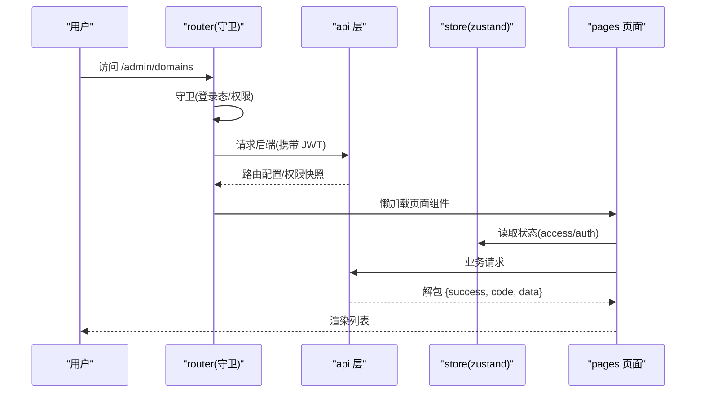
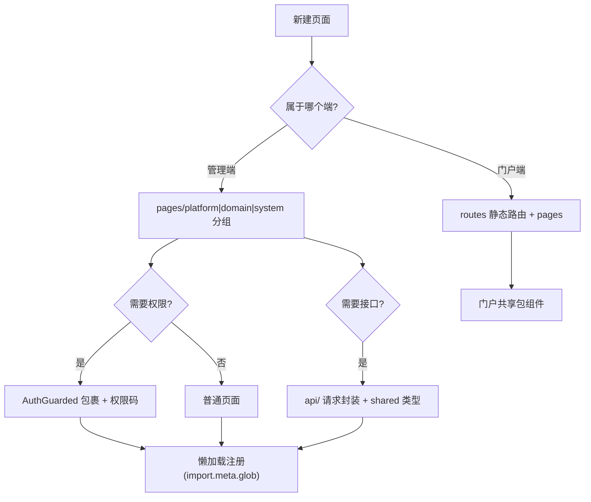
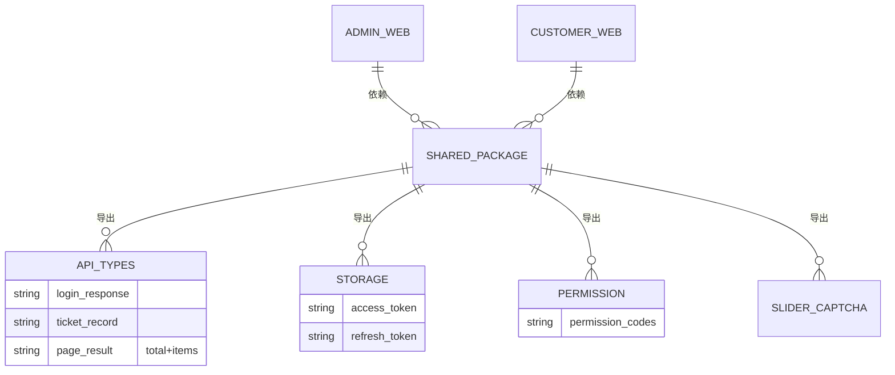
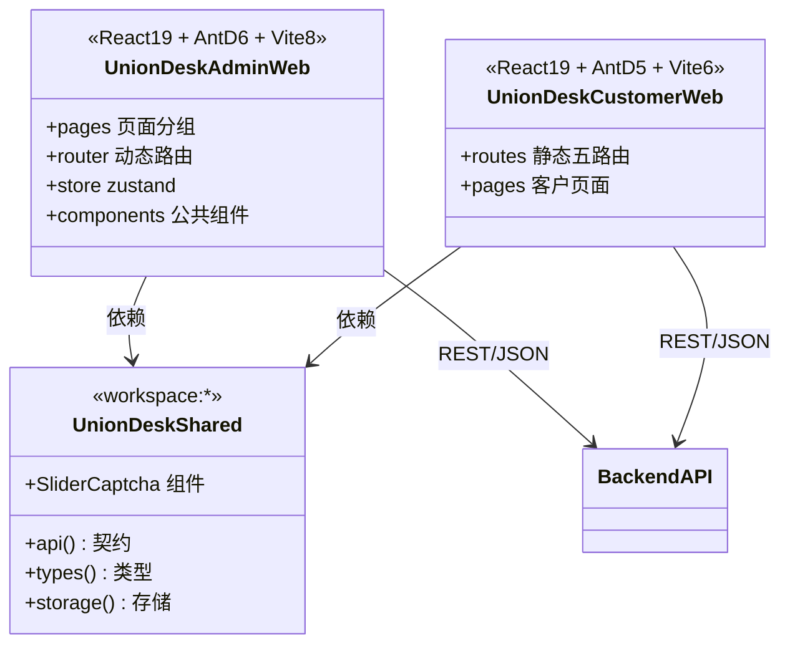

<cite>
- [UnionDeskWeb/apps/UnionDeskAdminWeb/package.json](file://UnionDeskWeb/apps/UnionDeskAdminWeb/package.json#L1-L35)
- [UnionDeskWeb/apps/UnionDeskAdminWeb/package.json](file://UnionDeskWeb/apps/UnionDeskAdminWeb/package.json#L36-L93)
- [UnionDeskWeb/apps/UnionDeskCustomerWeb/package.json](file://UnionDeskWeb/apps/UnionDeskCustomerWeb/package.json#L1-L36)
- [UnionDeskWeb/apps/UnionDeskCustomerWeb/src/routes/index.ts](file://UnionDeskWeb/apps/UnionDeskCustomerWeb/src/routes/index.ts#L1-L13)
- [UnionDeskWeb/packages/shared/src/index.ts](file://UnionDeskWeb/packages/shared/src/index.ts#L1-L10)
- [UnionDeskWeb/apps/UnionDeskAdminWeb/src/router/routes/config.ts](file://UnionDeskWeb/apps/UnionDeskAdminWeb/src/router/routes/config.ts#L1-L7)
- [UnionDeskWeb/apps/UnionDeskAdminWeb/src/router/utils/generate-routes-from-backend.ts](file://UnionDeskWeb/apps/UnionDeskAdminWeb/src/router/utils/generate-routes-from-backend.ts#L14-L48)
- [UnionDeskWeb/apps/UnionDeskAdminWeb/vite.config.ts](file://UnionDeskWeb/apps/UnionDeskAdminWeb/vite.config.ts#L1-L20)
</cite>

# UnionDesk 前端架构总览

## 简介

本文档总览前端架构：`UnionDeskAdminWeb`（平台管理端，React 19 + AntD v6 + Vite 8）与 `UnionDeskCustomerWeb`（客户门户，React 19 + AntD v5 + Vite 6）双应用 + `@uniondesk/shared` 共享包（pnpm workspace）。管理端按「平台/业务域/系统/个人中心」分组页面，门户端为轻量五路由应用。两端共享类型/API/存储/滑块验证码等契约。

章节来源：
- [UnionDeskWeb/apps/UnionDeskAdminWeb/package.json](file://UnionDeskWeb/apps/UnionDeskAdminWeb/package.json#L1-L35)
- [UnionDeskWeb/apps/UnionDeskCustomerWeb/src/routes/index.ts](file://UnionDeskWeb/apps/UnionDeskCustomerWeb/src/routes/index.ts#L1-L13)

## 项目结构

前端 monorepo 结构：

```mermaid
graph TB
    ROOT["UnionDeskWeb/ (pnpm workspace)"]
    ADMIN["apps/UnionDeskAdminWeb 管理端"]
    CUST["apps/UnionDeskCustomerWeb 门户"]
    SHARED["packages/shared 共享包"]
    ADMIN_SRC["src/api + pages + router + store + components"]
    CUST_SRC["src/routes + pages + components"]
    SHARED_SRC["src/types + api + storage + permission + SliderCaptcha"]
    ROOT --> ADMIN & CUST & SHARED
    ADMIN --> ADMIN_SRC
    CUST --> CUST_SRC
    SHARED --> SHARED_SRC
    ADMIN --> SHARED : workspace:*
    CUST --> SHARED : workspace:*
```

图表来源：
- [UnionDeskWeb/apps/UnionDeskAdminWeb/package.json](file://UnionDeskWeb/apps/UnionDeskAdminWeb/package.json#L64-L65)（workspace 依赖）
- [UnionDeskWeb/packages/shared/src/index.ts](file://UnionDeskWeb/packages/shared/src/index.ts#L1-L10)

## 核心组件

**1. UnionDeskAdminWeb 管理端**：React 19 + TypeScript + AntD v6 + Vite 8（package.json L36-93）；目录：`api/`（请求封装）、`pages/`（页面，按 platform/domain/system/personal-center/exception 分组）、`router/`（路由与守卫）、`store/`（zustand 状态）、`components/`（公共组件）、`layout/`（布局）、`hooks/`、`utils/`。

**2. UnionDeskCustomerWeb 门户端**：React 19 + AntD v5 + Vite 6（package.json L1-36）；五路由（`/home /tickets /chat /inbox /me`，routes/index.ts L7-13）——轻量客户视图。

**3. @uniondesk/shared 共享包**：导出 `types/api/storage/permission/customer-portal/customer-portal-live/track` + `SliderCaptcha` 滑块验证码组件（index.ts L1-10）——两端共享契约。

**4. 路由机制**：管理端 `isSendRoutingRequest=true`（config.ts L7）后端下发路由 + `generateRoutesFromBackend` 懒加载（L14-48）；门户端静态路由表。

**5. 工程设施**：vite 配置（别名 `#src`、插件：react/tailwind/checker/fake-server）、eslint（@antfu）、commitlint + simple-git-hooks、vitest 单测、circular-dependency-scanner。

章节来源：
- [UnionDeskWeb/apps/UnionDeskAdminWeb/package.json](file://UnionDeskWeb/apps/UnionDeskAdminWeb/package.json#L36-L154)
- [UnionDeskWeb/packages/shared/src/index.ts](file://UnionDeskWeb/packages/shared/src/index.ts#L1-L10)
- [UnionDeskWeb/apps/UnionDeskCustomerWeb/src/routes/index.ts](file://UnionDeskWeb/apps/UnionDeskCustomerWeb/src/routes/index.ts#L1-L13)

## 架构总览

管理端一次页面加载的链路：



图表来源：
- [UnionDeskWeb/apps/UnionDeskAdminWeb/src/router/utils/generate-routes-from-backend.ts](file://UnionDeskWeb/apps/UnionDeskAdminWeb/src/router/utils/generate-routes-from-backend.ts#L14-L48)
- [UnionDeskWeb/apps/UnionDeskAdminWeb/src/router/routes/config.ts](file://UnionDeskWeb/apps/UnionDeskAdminWeb/src/router/routes/config.ts#L1-L7)

## 详细分析

**架构设计要点**：

1. **双应用按端隔离**：管理端（重交互、配置复杂）用 AntD v6 + Vite 8 + 全套工程设施；门户端（轻量、快速）用 AntD v5 + Vite 6 + 精简结构——两端独立锁版本，仅共享契约包。
2. **共享包收口契约**：`@uniondesk/shared` 承载「类型 + API 客户端 + 存储 + 权限 + 验证码组件」——双端共用一套接口契约（`api.ts` 类型与请求函数），后端接口变更只改一处。
3. **后端下发路由**：管理端 `isSendRoutingRequest=true` 单独拉取路由（config.ts L7）；`generateRoutesFromBackend` 用 `import.meta.glob("/src/pages/**/*.tsx")` 映射组件（L14-18）——后端菜单驱动前端路由（权限联动）。
4. **页面分组语义**：`pages/platform`（平台管理）、`pages/domain`（业务域控制台）、`pages/system`（系统设置）、`pages/personal-center`（个人中心）、`pages/exception`（403/404/500）——与后端权限码作用域对应。
5. **样式方案**：Less + 语义化样式；AntD v6 `ConfigProvider` Design Token 定制（见 AGENTS.md §2）。
6. **状态管理**：zustand（`store/auth/access/tabs/global/preferences`）——轻量、无样板代码。
7. **工程化**：ESLint（@antfu 预设）、commitlint + lint-staged 提交门禁、vitest 单测、循环依赖扫描、vite-plugin-fake-server 本地假数据联调。



图表来源：
- [UnionDeskWeb/apps/UnionDeskAdminWeb/src/router/utils/generate-routes-from-backend.ts](file://UnionDeskWeb/apps/UnionDeskAdminWeb/src/router/utils/generate-routes-from-backend.ts#L14-L48)
- [UnionDeskWeb/apps/UnionDeskCustomerWeb/src/routes/index.ts](file://UnionDeskWeb/apps/UnionDeskCustomerWeb/src/routes/index.ts#L7-L13)

## 数据模型

前端数据契约：



图表来源：
- [UnionDeskWeb/packages/shared/src/index.ts](file://UnionDeskWeb/packages/shared/src/index.ts#L1-L10)
- [UnionDeskWeb/apps/UnionDeskAdminWeb/package.json](file://UnionDeskWeb/apps/UnionDeskAdminWeb/package.json#L64-L65)

## 依赖关系分析



图表来源：
- [UnionDeskWeb/apps/UnionDeskAdminWeb/package.json](file://UnionDeskWeb/apps/UnionDeskAdminWeb/package.json#L64-L65)
- [UnionDeskWeb/apps/UnionDeskCustomerWeb/package.json](file://UnionDeskWeb/apps/UnionDeskCustomerWeb/package.json#L13-L20)
- [UnionDeskWeb/packages/shared/src/index.ts](file://UnionDeskWeb/packages/shared/src/index.ts#L1-L10)

## 性能与安全考虑

- **性能**：页面懒加载（`import.meta.glob` 分包，排除 exception）；Vite 构建 `--max-old-space-size=8192` 防 OOM；zustand 轻量状态；共享包 tree-shaking。
- **安全**：请求统一走 `api/` 封装（拦截器注入 JWT）；`safe-redirect/safe-iframe-url` 工具防开放重定向与 iframe 注入；`AuthGuarded` 权限渲染；滑块验证码共享组件防机器。
- **一致性**：双端共享契约（类型/API）防字段漂移；`{total, items}` 信封统一解包；eslint + commitlint 门禁。
- **可维护性**：circular-dependency-scanner 防循环依赖；taze 依赖升级检查；vitest 单测覆盖核心逻辑。

章节来源：
- [UnionDeskWeb/apps/UnionDeskAdminWeb/package.json](file://UnionDeskWeb/apps/UnionDeskAdminWeb/package.json#L21-L35)
- [UnionDeskWeb/apps/UnionDeskAdminWeb/package.json](file://UnionDeskWeb/apps/UnionDeskAdminWeb/package.json#L94-L154)

## 故障排查指南

| 现象 | 原因 | 处理建议 |
| --- | --- | --- |
| `@uniondesk/shared` 解析失败 | workspace 未生效或共享包未导出 | 检查 pnpm-workspace.yaml；确认 index.ts 导出 |
| 新页面路由 404 | 页面不在 `src/pages/` 或 component 路径不匹配 | 检查 `getComponentPathByRoute` 解析规则 |
| 构建 OOM | 大依赖堆内存不足 | 用 `NODE_OPTIONS=--max-old-space-size=8192 pnpm build` |
| 接口字段 undefined | 后端契约变更未同步 shared 类型 | 更新 `packages/shared/src/api.ts` 类型 |
| 循环依赖报警 | 模块互相引用 | 运行 `pnpm check:circular-deps` 定位修复 |

章节来源：
- [UnionDeskWeb/apps/UnionDeskAdminWeb/package.json](file://UnionDeskWeb/apps/UnionDeskAdminWeb/package.json#L21-L35)
- [UnionDeskWeb/apps/UnionDeskAdminWeb/src/router/utils/generate-routes-from-backend.ts](file://UnionDeskWeb/apps/UnionDeskAdminWeb/src/router/utils/generate-routes-from-backend.ts#L24-L48)

## 结论

前端架构以「**双端隔离、共享契约、后端驱动路由、工程化门禁**」为核心：管理端（AntD6）与门户端（AntD5）按端锁版本，`@uniondesk/shared` 收口类型/API/存储/验证码契约，管理端路由由后端菜单驱动并懒加载，页面按 platform/domain/system/personal-center 分组与权限码对应。工程设施（eslint/commitlint/vitest/循环依赖扫描）保证代码质量与可维护性。

章节来源：
- [UnionDeskWeb/apps/UnionDeskAdminWeb/package.json](file://UnionDeskWeb/apps/UnionDeskAdminWeb/package.json#L1-L154)
- [UnionDeskWeb/packages/shared/src/index.ts](file://UnionDeskWeb/packages/shared/src/index.ts#L1-L10)

## 附录

前端开发命令：

```bash
# 1. 安装依赖（workspace）
cd UnionDeskWeb && pnpm install

# 2. 启动管理端（Vite dev，含 fake-server 假数据）
cd apps/UnionDeskAdminWeb && pnpm dev

# 3. 启动门户端（端口 5173）
cd apps/UnionDeskCustomerWeb && pnpm dev

# 4. 类型检查 + 单测
pnpm typecheck && pnpm test

# 5. 构建管理端（防 OOM）
cd apps/UnionDeskAdminWeb && pnpm build

# 6. 循环依赖检查
pnpm check:circular-deps
```

章节来源：
- [UnionDeskWeb/apps/UnionDeskAdminWeb/package.json](file://UnionDeskWeb/apps/UnionDeskAdminWeb/package.json#L21-L35)
- [UnionDeskWeb/apps/UnionDeskCustomerWeb/package.json](file://UnionDeskWeb/apps/UnionDeskCustomerWeb/package.json#L5-L12)
