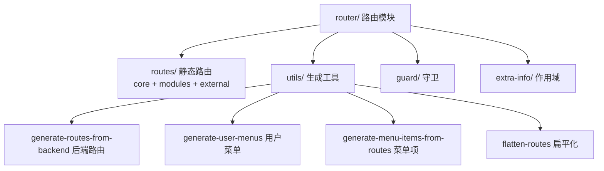
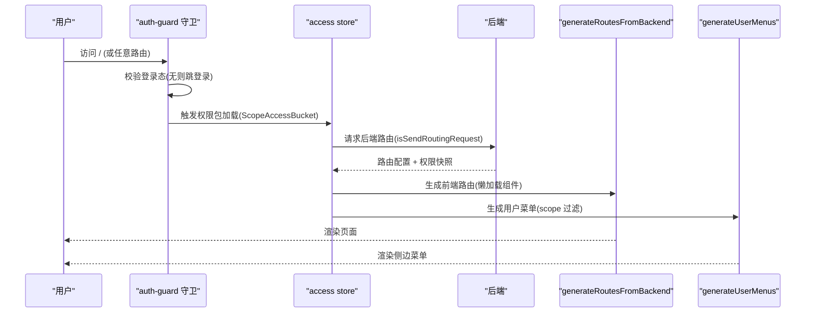
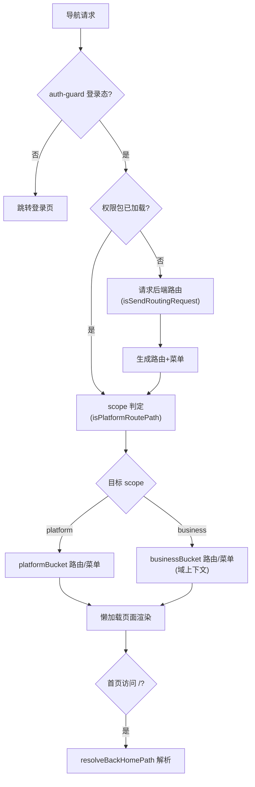
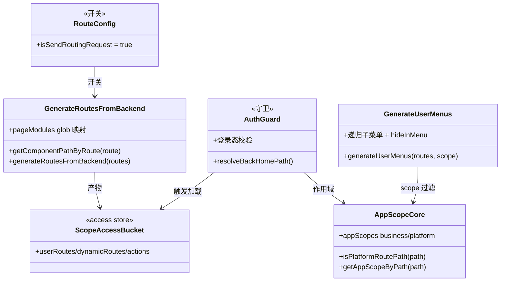

<cite>
- [UnionDeskWeb/apps/UnionDeskAdminWeb/src/router/routes/config.ts](file://UnionDeskWeb/apps/UnionDeskAdminWeb/src/router/routes/config.ts#L1-L7)
- [UnionDeskWeb/apps/UnionDeskAdminWeb/src/router/utils/generate-routes-from-backend.ts](file://UnionDeskWeb/apps/UnionDeskAdminWeb/src/router/utils/generate-routes-from-backend.ts#L14-L48)
- [UnionDeskWeb/apps/UnionDeskAdminWeb/src/router/guard/index.ts](file://UnionDeskWeb/apps/UnionDeskAdminWeb/src/router/guard/index.ts#L1-L1)
- [UnionDeskWeb/apps/UnionDeskAdminWeb/src/router/extra-info/app-scope.ts](file://UnionDeskWeb/apps/UnionDeskAdminWeb/src/router/extra-info/app-scope.ts#L22-L48)
- [UnionDeskWeb/apps/UnionDeskAdminWeb/src/router/extra-info/app-scope-core.ts](file://UnionDeskWeb/apps/UnionDeskAdminWeb/src/router/extra-info/app-scope-core.ts#L1-L23)
- [UnionDeskWeb/apps/UnionDeskAdminWeb/src/router/utils/generate-user-menus.ts](file://UnionDeskWeb/apps/UnionDeskAdminWeb/src/router/utils/generate-user-menus.ts#L19-L49)
- [UnionDeskWeb/apps/UnionDeskAdminWeb/src/store/access.ts](file://UnionDeskWeb/apps/UnionDeskAdminWeb/src/store/access.ts#L17-L54)
- [UnionDeskWeb/apps/UnionDeskCustomerWeb/src/routes/index.ts](file://UnionDeskWeb/apps/UnionDeskCustomerWeb/src/routes/index.ts#L1-L13)
</cite>

# UnionDesk 前端路由机制

## 简介

本文档详解前端路由机制：管理端静态路由（core/modules/external）+ 后端菜单动态路由（`generateRoutesFromBackend` 懒加载）、路由守卫（`guard/auth-guard`）、app-scope 域上下文（platform/business 双作用域）、路由扁平化与菜单生成（`generateUserMenus`/`generateMenuItemsFromRoutes`）；门户端为静态五路由。后端菜单驱动是权限联动的核心。

章节来源：
- [UnionDeskWeb/apps/UnionDeskAdminWeb/src/router/routes/config.ts](file://UnionDeskWeb/apps/UnionDeskAdminWeb/src/router/routes/config.ts#L1-L7)
- [UnionDeskWeb/apps/UnionDeskAdminWeb/src/router/utils/generate-routes-from-backend.ts](file://UnionDeskWeb/apps/UnionDeskAdminWeb/src/router/utils/generate-routes-from-backend.ts#L14-L48)

## 项目结构

路由模块组成：



图表来源：
- [UnionDeskWeb/apps/UnionDeskAdminWeb/src/router/utils/generate-routes-from-backend.ts](file://UnionDeskWeb/apps/UnionDeskAdminWeb/src/router/utils/generate-routes-from-backend.ts#L14-L48)
- [UnionDeskWeb/apps/UnionDeskAdminWeb/src/router/guard/index.ts](file://UnionDeskWeb/apps/UnionDeskAdminWeb/src/router/guard/index.ts#L1-L1)

## 核心组件

**1. 静态路由（routes/）**：`core/`（auth/exception/fallback/personal-center/platform-pages）、`modules/`（domain/home/system 业务分组）、`external/`（privacy-policy/terms-of-service）——登录、异常页、个人中心等基础路由前端固定。

**2. 后端路由开关（config.ts）**：`isSendRoutingRequest=true`（L7）——单独请求后端获取路由数据；`false` 时从用户详情接口附带。

**3. 后端路由生成（generate-routes-from-backend.ts）**：`import.meta.glob(["/src/pages/**/*.tsx", "!/src/pages/exception/**/*.tsx"])`（L14-18）建立组件映射；`getComponentPathByRoute` 解析 component 路径（L24-48）；`generateRoutesFromBackend` 动态加载页面组件（L54+）。

**4. 路由守卫（guard/）**：`guard/index.ts` 汇出 `auth-guard`（L1）——登录态校验、访问 `/` 时解析首页（`resolveBackHomePath` app-scope.ts L44-48）；守卫在路由切换前执行。

**5. app-scope 域上下文（app-scope-core.ts）**：`appScopes = {business, platform}`（L6-9）；`isPlatformRoutePath` 按路径前缀判定（L13-15）；`getAppScopeByPath`（L17-19）、`getAppHomePath`（L21-23）——「平台/业务域」双作用域路由判定，无 store 依赖防循环引用。

**6. 菜单生成（generate-user-menus.ts）**：`generateUserMenus(userRoutes, scope)`（L19-49）——按 scope 过滤（L28-30）、递归子菜单（L32-34）、`hideInMenu` 隐藏（L36-38）、外部链接渲染（L50-68）——后端路由直接生成菜单。

**7. 门户端静态路由**：`/home /tickets /chat /inbox /me` 五路由（routes/index.ts L7-13）——轻量静态。

章节来源：
- [UnionDeskWeb/apps/UnionDeskAdminWeb/src/router/utils/generate-routes-from-backend.ts](file://UnionDeskWeb/apps/UnionDeskAdminWeb/src/router/utils/generate-routes-from-backend.ts#L14-L48)
- [UnionDeskWeb/apps/UnionDeskAdminWeb/src/router/extra-info/app-scope-core.ts](file://UnionDeskWeb/apps/UnionDeskAdminWeb/src/router/extra-info/app-scope-core.ts#L6-L23)
- [UnionDeskWeb/apps/UnionDeskAdminWeb/src/router/utils/generate-user-menus.ts](file://UnionDeskWeb/apps/UnionDeskAdminWeb/src/router/utils/generate-user-menus.ts#L19-L49)

## 架构总览

登录后路由构建与导航时序：



图表来源：
- [UnionDeskWeb/apps/UnionDeskAdminWeb/src/router/routes/config.ts](file://UnionDeskWeb/apps/UnionDeskAdminWeb/src/router/routes/config.ts#L1-L7)
- [UnionDeskWeb/apps/UnionDeskAdminWeb/src/store/access.ts](file://UnionDeskWeb/apps/UnionDeskAdminWeb/src/store/access.ts#L17-L54)
- [UnionDeskWeb/apps/UnionDeskAdminWeb/src/router/utils/generate-user-menus.ts](file://UnionDeskWeb/apps/UnionDeskAdminWeb/src/router/utils/generate-user-menus.ts#L19-L49)

## 详细分析

**路由机制设计要点**：

1. **后端菜单驱动**：`isSendRoutingRequest=true` 单独拉取路由（config.ts L7）→ `generateRoutesFromBackend` 把后端路由配置映射为 React Router 路由（组件懒加载）——菜单/路由/权限三联动，后端加菜单前端即出。
2. **组件路径解析**：`getComponentPathByRoute`（L24-48）处理多种 component 格式（`/src/pages/` 绝对路径、`./` 相对、`.tsx` 后缀、裸路径）——后端只需下发标准路径。
3. **双作用域判定**：`isPlatformRoutePath` 按前缀（`/platform`）判定平台域（L13-15），`getAppScopeByPath` 输出 scope（L17-19）；`generateUserMenus` 按 scope 过滤菜单（L28-30）——同一路由树按作用域切分渲染。
4. **权限包双桶**：`ScopeAccessBucket`（platformBucket/businessBucket，access.ts L17-54）分别缓存两作用域的路由/动作/域 ID——切域不重复请求。
5. **首页解析**：守卫访问 `/` 时 `resolveBackHomePath`（app-scope.ts L44-48）从菜单/角色/动作推断首页（`resolveHomePathFromMenus`）——平台/业务域首页不同。
6. **守卫前置**：`auth-guard` 在路由切换前校验登录态与权限；`guard/index.ts` 统一汇出（L1）。
7. **门户静态路由**：五路由静态表（routes/index.ts L7-13）——门户无后端菜单依赖，轻量直达。



图表来源：
- [UnionDeskWeb/apps/UnionDeskAdminWeb/src/router/extra-info/app-scope-core.ts](file://UnionDeskWeb/apps/UnionDeskAdminWeb/src/router/extra-info/app-scope-core.ts#L13-L23)
- [UnionDeskWeb/apps/UnionDeskAdminWeb/src/router/extra-info/app-scope.ts](file://UnionDeskWeb/apps/UnionDeskAdminWeb/src/router/extra-info/app-scope.ts#L44-L48)
- [UnionDeskWeb/apps/UnionDeskAdminWeb/src/store/access.ts](file://UnionDeskWeb/apps/UnionDeskAdminWeb/src/store/access.ts#L17-L54)

## 数据模型

路由数据对象：

```mermaid
erDiagram
    BACKEND_ROUTES ||--o{ APP_ROUTE_RECORD : "生成"
    APP_ROUTE_RECORD ||--o{ PAGE_MODULE : "懒加载映射"
    APP_ROUTE_RECORD ||--o{ MENU_ITEM : "菜单生成"
    APP_ROUTE_RECORD {
        string path
        string component
        handle_scope "platform/business"
        handle_hideInMenu
        string handle_title
    }
    MENU_ITEM {
        string key
        string label
        string external_link
        children 递归
    }
    SCOPE_ACCESS_BUCKET {
        list user_routes
        list dynamic_routes
        list actions
        number domain_id
    }
```

图表来源：
- [UnionDeskWeb/apps/UnionDeskAdminWeb/src/router/utils/generate-routes-from-backend.ts](file://UnionDeskWeb/apps/UnionDeskAdminWeb/src/router/utils/generate-routes-from-backend.ts#L14-L48)
- [UnionDeskWeb/apps/UnionDeskAdminWeb/src/router/utils/generate-user-menus.ts](file://UnionDeskWeb/apps/UnionDeskAdminWeb/src/router/utils/generate-user-menus.ts#L19-L49)

## 依赖关系分析



图表来源：
- [UnionDeskWeb/apps/UnionDeskAdminWeb/src/router/routes/config.ts](file://UnionDeskWeb/apps/UnionDeskAdminWeb/src/router/routes/config.ts#L1-L7)
- [UnionDeskWeb/apps/UnionDeskAdminWeb/src/router/extra-info/app-scope.ts](file://UnionDeskWeb/apps/UnionDeskAdminWeb/src/router/extra-info/app-scope.ts#L22-L48)
- [UnionDeskWeb/apps/UnionDeskAdminWeb/src/router/extra-info/app-scope-core.ts](file://UnionDeskWeb/apps/UnionDeskAdminWeb/src/router/extra-info/app-scope-core.ts#L6-L23)

## 性能与安全考虑

- **性能**：页面 `import.meta.glob` 懒加载分包（排除 exception 常驻）；权限包双桶缓存（platform/business）防切域重复请求；菜单生成一次缓存。
- **安全**：守卫前置登录态校验；后端路由驱动防前端硬编码越权（路由即权限）；`resolveBackHomePath` 按角色/动作推断首页防越权直达。
- **一致性**：`app-scope-core` 无 store 依赖防循环引用（L4 注释）；双端契约共享；菜单与路由同源生成。
- **可维护性**：静态路由分组（core/modules/external）职责清晰；工具函数纯函数化可单测。

章节来源：
- [UnionDeskWeb/apps/UnionDeskAdminWeb/src/router/extra-info/app-scope-core.ts](file://UnionDeskWeb/apps/UnionDeskAdminWeb/src/router/extra-info/app-scope-core.ts#L1-L9)
- [UnionDeskWeb/apps/UnionDeskAdminWeb/src/store/access.ts](file://UnionDeskWeb/apps/UnionDeskAdminWeb/src/store/access.ts#L17-L54)

## 故障排查指南

| 现象 | 原因 | 处理建议 |
| --- | --- | --- |
| 新页面路由 404 | component 路径与页面文件不匹配 | 检查 `getComponentPathByRoute` 解析；页面放 `src/pages/` |
| 菜单不显示 | 后端未下发路由或 scope 不匹配 | 检查 `generateUserMenus` scope 过滤；后端菜单配置 |
| 刷新后 404（React Router 7） | 动态路由未 remount 或 HMR 槽问题 | 参考 access.ts `remountDynamicRoutes` 注释（L56-67） |
| 平台/业务域菜单混显 | `isPlatformRoutePath` 判定异常 | 检查路径前缀与 `getAppScopeByPath` |
| 首页跳转错误 | `resolveBackHomePath` 输入菜单为空 | 检查权限包加载时序；菜单来源优先级 |

章节来源：
- [UnionDeskWeb/apps/UnionDeskAdminWeb/src/store/access.ts](file://UnionDeskWeb/apps/UnionDeskAdminWeb/src/store/access.ts#L56-L67)
- [UnionDeskWeb/apps/UnionDeskAdminWeb/src/router/utils/generate-routes-from-backend.ts](file://UnionDeskWeb/apps/UnionDeskAdminWeb/src/router/utils/generate-routes-from-backend.ts#L24-L48)

## 结论

前端路由机制以「**后端菜单驱动、双作用域切分、守卫前置、懒加载**」为核心：管理端 `isSendRoutingRequest` 拉取后端路由 → `generateRoutesFromBackend` 懒加载组件 → `generateUserMenus` 按 platform/business 作用域生成菜单，`app-scope-core` 无依赖判定作用域，`auth-guard` 守卫登录与首页解析，权限包双桶缓存；门户端静态五路由轻量直达。路由即权限、菜单同源生成，是管理端权限联动的骨架。

章节来源：
- [UnionDeskWeb/apps/UnionDeskAdminWeb/src/router/utils/generate-routes-from-backend.ts](file://UnionDeskWeb/apps/UnionDeskAdminWeb/src/router/utils/generate-routes-from-backend.ts#L14-L48)
- [UnionDeskWeb/apps/UnionDeskAdminWeb/src/router/extra-info/app-scope-core.ts](file://UnionDeskWeb/apps/UnionDeskAdminWeb/src/router/extra-info/app-scope-core.ts#L6-L23)

## 附录

路由调试命令：

```bash
# 1. 类型检查路由模块
cd apps/UnionDeskAdminWeb && pnpm typecheck

# 2. 菜单生成单测
pnpm vitest run src/router

# 3. 查看后端下发的路由（登录后）
curl http://127.0.0.1:8080/api/v1/me/menu-resources -H "Authorization: Bearer <token>"
```

新增页面接入路由的检查清单：

```bash
# 1. 页面放对目录
ls src/pages/platform/domains/

# 2. component 路径与页面一致（glob 映射）
#    后端下发 component: "./domains/index" → /src/pages/domains/index.tsx

# 3. 权限码挂菜单（后端 iam_admin_menu.permission_code）
# 4. scope 声明（platform/business）决定菜单归属
```

章节来源：
- [UnionDeskWeb/apps/UnionDeskAdminWeb/src/router/utils/generate-routes-from-backend.ts](file://UnionDeskWeb/apps/UnionDeskAdminWeb/src/router/utils/generate-routes-from-backend.ts#L24-L48)
- [UnionDeskWeb/apps/UnionDeskAdminWeb/src/router/utils/generate-user-menus.ts](file://UnionDeskWeb/apps/UnionDeskAdminWeb/src/router/utils/generate-user-menus.ts#L19-L49)
