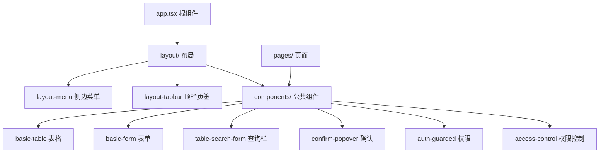
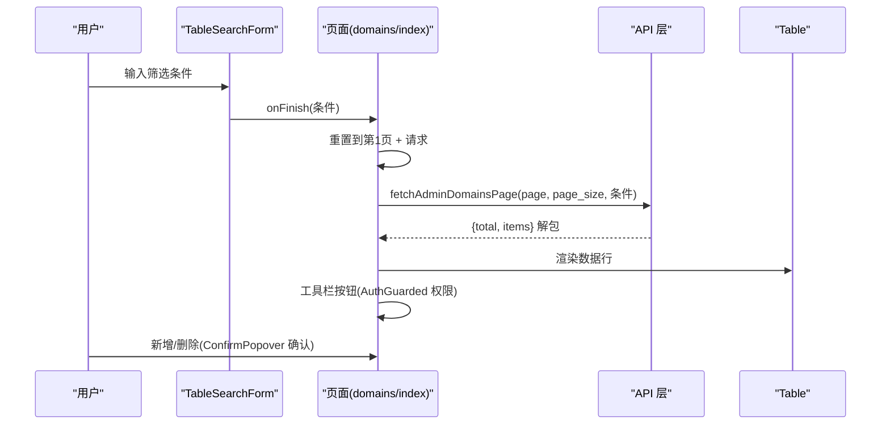
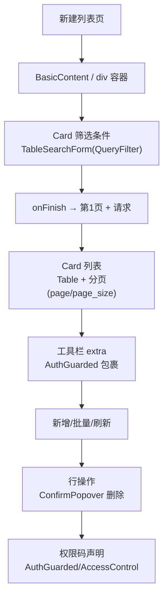
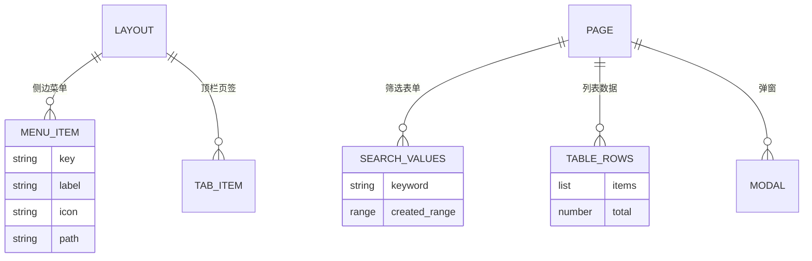
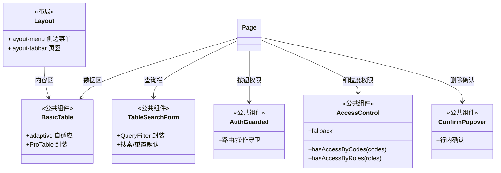

<cite>
- [UnionDeskWeb/apps/UnionDeskAdminWeb/src/components/access-control/index.ts](file://UnionDeskWeb/apps/UnionDeskAdminWeb/src/components/access-control/index.ts#L1-L33)
- [UnionDeskWeb/apps/UnionDeskAdminWeb/src/components/basic-table/index.tsx](file://UnionDeskWeb/apps/UnionDeskAdminWeb/src/components/basic-table/index.tsx#L1-L40)
- [UnionDeskWeb/apps/UnionDeskAdminWeb/src/components/table-search-form/index.tsx](file://UnionDeskWeb/apps/UnionDeskAdminWeb/src/components/table-search-form/index.tsx#L1-L30)
- [UnionDeskWeb/apps/UnionDeskAdminWeb/src/pages/platform/domains/index.tsx](file://UnionDeskWeb/apps/UnionDeskAdminWeb/src/pages/platform/domains/index.tsx#L1-L60)
- [UnionDeskWeb/apps/UnionDeskAdminWeb/src/pages/platform/domains/detail/components/detail-members.tsx](file://UnionDeskWeb/apps/UnionDeskAdminWeb/src/pages/platform/domains/detail/components/detail-members.tsx#L14-L55)
- [UnionDeskWeb/apps/UnionDeskAdminWeb/src/pages/platform/domains/detail/components/detail-members.tsx](file://UnionDeskWeb/apps/UnionDeskAdminWeb/src/pages/platform/domains/detail/components/detail-members.tsx#L533-L540)
- [UnionDeskWeb/apps/UnionDeskAdminWeb/src/layout/layout-menu/index.tsx](file://UnionDeskWeb/apps/UnionDeskAdminWeb/src/layout/layout-menu/index.tsx#L1-L10)
</cite>

# UnionDesk 组件树与页面结构

## 简介

本文档详解前端组件树与页面结构：布局体系（layout/layout-menu/layout-tabbar）、公共组件（BasicTable/BasicForm/TableSearchForm/ConfirmPopover/AuthGuarded/AccessControl）、页面级组件组织（pages 分组 + 域详情 Tab 组件）、列表页「筛选条件 + 数据区」统一骨架。该结构保证页面开发高度模板化、权限一致、样式统一。

章节来源：
- [UnionDeskWeb/apps/UnionDeskAdminWeb/src/components/access-control/index.ts](file://UnionDeskWeb/apps/UnionDeskAdminWeb/src/components/access-control/index.ts#L1-L33)
- [UnionDeskWeb/apps/UnionDeskAdminWeb/src/pages/platform/domains/index.tsx](file://UnionDeskWeb/apps/UnionDeskAdminWeb/src/pages/platform/domains/index.tsx#L1-L60)

## 项目结构

组件树层级：



图表来源：
- [UnionDeskWeb/apps/UnionDeskAdminWeb/src/pages/platform/domains/index.tsx](file://UnionDeskWeb/apps/UnionDeskAdminWeb/src/pages/platform/domains/index.tsx#L8-L16)
- [UnionDeskWeb/apps/UnionDeskAdminWeb/src/layout/layout-menu/index.tsx](file://UnionDeskWeb/apps/UnionDeskAdminWeb/src/layout/layout-menu/index.tsx#L1-L10)

## 核心组件

**1. 布局体系（layout/）**：`layout-menu`（侧边菜单，index.tsx + use-menu.ts + utils.ts 生成菜单数据）、`layout-tabbar`（顶栏页签，tab-navigation.ts 页签导航）——布局承载菜单与多页签。

**2. BasicTable（basic-table/index.tsx）**：ProTable 封装（L1-40）——`adaptive` 自适应高度（L28-37）、分页配置、loading、样式统一（styles.ts + constants.ts）——树形/复杂表格用。

**3. TableSearchForm（table-search-form/index.tsx）**：ProComponents `QueryFilter` 封装（L1-30）——`TABLE_SEARCH_FORM_SEARCH_DEFAULTS` 默认搜索按钮、`TABLE_SEARCH_FORM_SPAN` 栅格、`tableSearchFormCollapseRender` 折叠——列表页查询栏标准件。

**4. AuthGuarded / AccessControl（access-control/index.ts）**：`AccessControl`（L14-33）——`type: code|role` + `codes` 权限值 + `fallback` 无权限占位——按钮级权限渲染；`AuthGuarded` 为路由/操作级守卫。

**5. ConfirmPopover**：行内破坏性操作（删除/禁用）确认弹层——防误操作。

**6. 页面级组织**：`pages/platform/domains/index.tsx`（L1-60）——列表页：`BasicContent` 容器 + `TableSearchForm`（筛选）+ `Card`（列表）+ `DomainsCard/DomainsModal`（子组件）+ `AuthGuarded`（工具栏按钮）+ `PLATFORM_DOMAIN_CREATE` 权限码；域详情 Tab（detail-members.tsx L14-55）——`MembersSearchPanel`（L533-540 筛选 Card）+ `Table` + 三个 Modal（新增/编辑角色/批量状态）。

章节来源：
- [UnionDeskWeb/apps/UnionDeskAdminWeb/src/components/basic-table/index.tsx](file://UnionDeskWeb/apps/UnionDeskAdminWeb/src/components/basic-table/index.tsx#L28-L40)
- [UnionDeskWeb/apps/UnionDeskAdminWeb/src/components/table-search-form/index.tsx](file://UnionDeskWeb/apps/UnionDeskAdminWeb/src/components/table-search-form/index.tsx#L1-L30)
- [UnionDeskWeb/apps/UnionDeskAdminWeb/src/pages/platform/domains/detail/components/detail-members.tsx](file://UnionDeskWeb/apps/UnionDeskAdminWeb/src/pages/platform/domains/detail/components/detail-members.tsx#L533-L540)

## 架构总览

列表页一次查询渲染链路：



图表来源：
- [UnionDeskWeb/apps/UnionDeskAdminWeb/src/pages/platform/domains/index.tsx](file://UnionDeskWeb/apps/UnionDeskAdminWeb/src/pages/platform/domains/index.tsx#L8-L60)
- [UnionDeskWeb/apps/UnionDeskAdminWeb/src/components/table-search-form/index.tsx](file://UnionDeskWeb/apps/UnionDeskAdminWeb/src/components/table-search-form/index.tsx#L1-L30)

## 详细分析

**页面结构设计要点**：

1. **列表页统一骨架**：`BasicContent`（全局页）/`div`（Tab 内）→ `flex flex-col gap-4` → `Card「筛选条件」(TableSearchForm)` + `Card「列表」(Table + 分页)`（AGENTS.md §2.7）——domains/index 与 detail-members 均遵循。
2. **查询栏标准化**：`TableSearchForm`（QueryFilter 封装）禁止自写查询/重置按钮（constants 默认按钮/栅格/折叠）；`onFinish` 查询重置第 1 页、`onReset` 清空重载。
3. **权限渲染三件套**：页面路由 `AuthGuarded`、按钮 `AuthGuarded`（工具栏 extra）、细粒度 `AccessControl`（code/role 双模式 + fallback）——权限粒度从路由到按钮全覆盖。
4. **破坏性操作确认**：删除/禁用走 `ConfirmPopover`（行内确认，防误触）。
5. **页面子组件就近**：`components/` 子目录（DomainsCard/DomainsModal、detail 各 Tab 组件）——同页面组件内聚；跨模块复用才上提公共组件。
6. **域详情 Tab 化**：`detail/` 目录按 Tab 拆组件（detail-members/detail-roles/detail-customers 等）+ `detail-sider` 导航——复杂详情页结构化。
7. **状态管理轻量**：页面用 useState/useMemo 局部状态（domains L52-60）；跨页共享走 zustand。



图表来源：
- [UnionDeskWeb/apps/UnionDeskAdminWeb/src/pages/platform/domains/index.tsx](file://UnionDeskWeb/apps/UnionDeskAdminWeb/src/pages/platform/domains/index.tsx#L8-L60)
- [UnionDeskWeb/apps/UnionDeskAdminWeb/src/components/access-control/index.ts](file://UnionDeskWeb/apps/UnionDeskAdminWeb/src/components/access-control/index.ts#L14-L33)

## 数据模型

组件树数据对象：



图表来源：
- [UnionDeskWeb/apps/UnionDeskAdminWeb/src/pages/platform/domains/index.tsx](file://UnionDeskWeb/apps/UnionDeskAdminWeb/src/pages/platform/domains/index.tsx#L30-L38)
- [UnionDeskWeb/apps/UnionDeskAdminWeb/src/layout/layout-menu/index.tsx](file://UnionDeskWeb/apps/UnionDeskAdminWeb/src/layout/layout-menu/index.tsx#L1-L10)

## 依赖关系分析



图表来源：
- [UnionDeskWeb/apps/UnionDeskAdminWeb/src/components/access-control/index.ts](file://UnionDeskWeb/apps/UnionDeskAdminWeb/src/components/access-control/index.ts#L1-L33)
- [UnionDeskWeb/apps/UnionDeskAdminWeb/src/components/basic-table/index.tsx](file://UnionDeskWeb/apps/UnionDeskAdminWeb/src/components/basic-table/index.tsx#L1-L40)

## 性能与安全考虑

- **性能**：表格 `adaptive` 自适应高度减少滚动开销；列表分页 `page/page_size`；`useMemo` 列配置缓存（detail-members L304）；懒加载路由分包。
- **安全**：按钮/操作级 `AuthGuarded` + `AccessControl`（code/role 双模式）防越权操作；`ConfirmPopover` 防误删；后端权限码与前端渲染一致（`PLATFORM_DOMAIN_CREATE`）。
- **一致性**：列表页骨架统一（筛选+数据区）；查询栏标准化（TableSearchForm）；组件就近组织防过度抽象。
- **可维护性**：公共组件（BasicTable/BasicForm/TableSearchForm/ConfirmPopover/AuthGuarded）沉淀复用；页面子组件内聚。

章节来源：
- [UnionDeskWeb/apps/UnionDeskAdminWeb/src/components/basic-table/index.tsx](file://UnionDeskWeb/apps/UnionDeskAdminWeb/src/components/basic-table/index.tsx#L28-L37)
- [UnionDeskWeb/apps/UnionDeskAdminWeb/src/components/access-control/index.ts](file://UnionDeskWeb/apps/UnionDeskAdminWeb/src/components/access-control/index.ts#L20-L33)

## 故障排查指南

| 现象 | 原因 | 处理建议 |
| --- | --- | --- |
| 查询按钮不生效 | 未走 TableSearchForm 标准件或 onFinish 未接 | 使用标准件；核对 onFinish 重置第 1 页 |
| 按钮不显示 | AuthGuarded 权限码与后端不一致 | 核对 `PLATFORM_DOMAIN_CREATE` 等权限码；检查授权 |
| 表格高度异常 | adaptive 未配或与布局冲突 | 检查 `scroll.y` 与 `adaptive.offsetBottom` |
| 删除无确认直接执行 | 未用 ConfirmPopover | 破坏性操作统一换 ConfirmPopover |
| 新页面样式错乱 | 未遵循统一骨架（自写筛选） | 对照 AGENTS.md §2.7 骨架重构 |

章节来源：
- [UnionDeskWeb/apps/UnionDeskAdminWeb/src/pages/platform/domains/index.tsx](file://UnionDeskWeb/apps/UnionDeskAdminWeb/src/pages/platform/domains/index.tsx#L8-L60)
- [UnionDeskWeb/apps/UnionDeskAdminWeb/src/components/access-control/index.ts](file://UnionDeskWeb/apps/UnionDeskAdminWeb/src/components/access-control/index.ts#L14-L33)

## 结论

组件树与页面结构以「**布局承载、公共组件沉淀、列表骨架统一、权限三件套**」为核心：layout-menu/layout-tabbar 承载导航，BasicTable/TableSearchForm/ConfirmPopover/AuthGuarded/AccessControl 沉淀复用，列表页「筛选条件 + 数据区」骨架统一（TableSearchForm + Table + 分页），按钮权限 AuthGuarded/AccessControl 全覆盖，页面子组件就近内聚。该结构让新页面开发模板化、权限一致、样式统一。

章节来源：
- [UnionDeskWeb/apps/UnionDeskAdminWeb/src/pages/platform/domains/detail/components/detail-members.tsx](file://UnionDeskWeb/apps/UnionDeskAdminWeb/src/pages/platform/domains/detail/components/detail-members.tsx#L533-L540)
- [UnionDeskWeb/apps/UnionDeskAdminWeb/src/components/basic-table/index.tsx](file://UnionDeskWeb/apps/UnionDeskAdminWeb/src/components/basic-table/index.tsx#L1-L40)

## 附录

列表页骨架模板：

```tsx
export default function DemoListPage() {
	return (
		<BasicContent>
			<div className="flex flex-col gap-4">
				{/* 筛选条件 */}
				<Card title={<><SearchOutlined /> 筛选条件</>} bordered={false}>
					<TableSearchForm
						onFinish={(values) => { setPage(1); load(values); }}
						onReset={() => load()}
					>
						<Form.Item name="keyword" label="关键字">
							<Input placeholder="请输入关键字" allowClear />
						</Form.Item>
					</TableSearchForm>
				</Card>

				{/* 数据区 */}
				<Card
					title="列表"
					bordered={false}
					extra={(
						<Space>
							<AuthGuarded code="demo:create">
								<Button type="primary" icon={<PlusOutlined />}>新增</Button>
							</AuthGuarded>
							<Button icon={<ReloadOutlined />} onClick={reload}>刷新</Button>
						</Space>
					)}
				>
					<Table
						rowKey="id"
						columns={columns}
						dataSource={rows}
						pagination={{ page, pageSize, total, showSizeChanger: true, onChange: (p, ps) => { setPage(p); setPageSize(ps); } }}
					/>
				</Card>
			</div>
		</BasicContent>
	);
}
```

章节来源：
- [UnionDeskWeb/apps/UnionDeskAdminWeb/src/pages/platform/domains/index.tsx](file://UnionDeskWeb/apps/UnionDeskAdminWeb/src/pages/platform/domains/index.tsx#L8-L60)
- [UnionDeskWeb/apps/UnionDeskAdminWeb/src/components/table-search-form/index.tsx](file://UnionDeskWeb/apps/UnionDeskAdminWeb/src/components/table-search-form/index.tsx#L1-L30)
