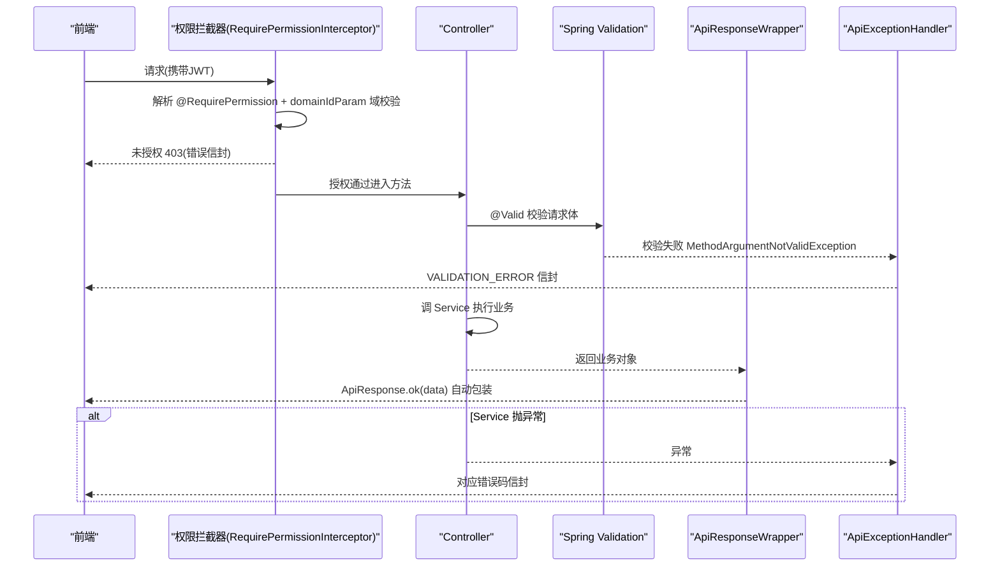
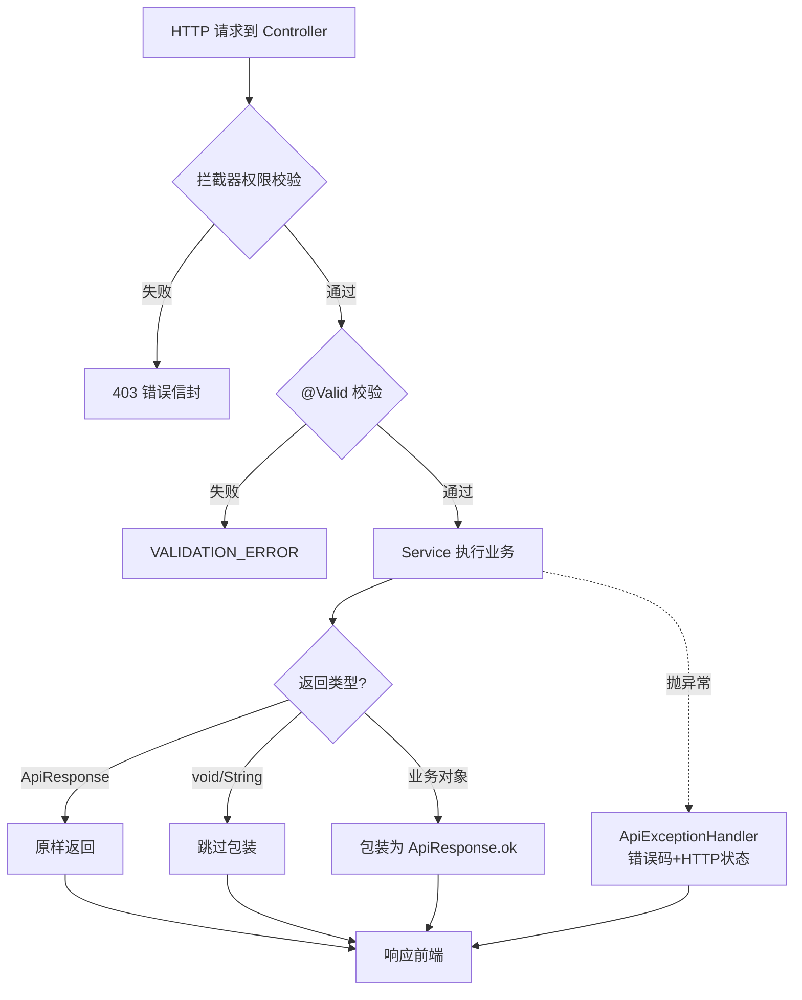
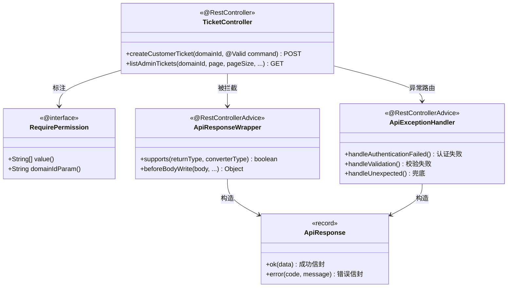

<cite>
- [UnionDesk/uniondesk-ticket/src/main/java/com/uniondesk/ticket/web/TicketController.java](file://UnionDesk/uniondesk-ticket/src/main/java/com/uniondesk/ticket/web/TicketController.java#L22-L45)
- [UnionDesk/uniondesk-ticket/src/main/java/com/uniondesk/ticket/web/TicketController.java](file://UnionDesk/uniondesk-ticket/src/main/java/com/uniondesk/ticket/web/TicketController.java#L83-L107)
- [UnionDesk/uniondesk-app/src/main/java/com/uniondesk/common/web/ApiResponseWrapper.java](file://UnionDesk/uniondesk-app/src/main/java/com/uniondesk/common/web/ApiResponseWrapper.java#L10-L53)
- [UnionDesk/uniondesk-app/src/main/java/com/uniondesk/common/web/ApiExceptionHandler.java](file://UnionDesk/uniondesk-app/src/main/java/com/uniondesk/common/web/ApiExceptionHandler.java#L20-L85)
- [UnionDesk/uniondesk-app/src/main/java/com/uniondesk/common/web/ApiExceptionHandler.java](file://UnionDesk/uniondesk-app/src/main/java/com/uniondesk/common/web/ApiExceptionHandler.java#L87-L108)
- [UnionDesk/uniondesk-iam/src/main/java/com/uniondesk/iam/core/RequirePermission.java](file://UnionDesk/uniondesk-iam/src/main/java/com/uniondesk/iam/core/RequirePermission.java#L8-L19)
- [UnionDesk/uniondesk-common/src/main/java/com/uniondesk/common/web/ApiResponse.java](file://UnionDesk/uniondesk-common/src/main/java/com/uniondesk/common/web/ApiResponse.java#L3-L16)
</cite>

# UnionDesk Controller 层设计

## 简介

本文档详解后端 Controller 层（`web` 包）的设计规范：`@RestController` 声明式风格、`@RequirePermission` 注解权限校验（含域级校验）、`@Valid` 请求 DTO 校验、`ApiResponseWrapper` 统一响应包装、`ApiExceptionHandler` 全局异常处理。Controller 层遵循「零业务逻辑、声明式权限、自动包装、统一异常」四条铁律。

章节来源：
- [UnionDesk/uniondesk-ticket/src/main/java/com/uniondesk/ticket/web/TicketController.java](file://UnionDesk/uniondesk-ticket/src/main/java/com/uniondesk/ticket/web/TicketController.java#L22-L45)
- [UnionDesk/uniondesk-app/src/main/java/com/uniondesk/common/web/ApiResponseWrapper.java](file://UnionDesk/uniondesk-app/src/main/java/com/uniondesk/common/web/ApiResponseWrapper.java#L10-L21)

## 项目结构

Controller 层的组成与依赖：

```mermaid
graph TB
    CT["Controller(web 包)<br/>@RestController"]
    RP["RequirePermission 注解<br/>iam 模块"]
    W["ApiResponseWrapper<br/>app 模块 @RestControllerAdvice"]
    EH["ApiExceptionHandler<br/>app 模块 @RestControllerAdvice"]
    AR["ApiResponse 信封<br/>common 模块"]
    SV["Service(core 包)"]
    DTO["*Dtos / Service record"]
    CT --> RP : 标注
    CT --> SV : 注入
    CT --> DTO : 出入参
    CT --> W : 响应自动包装
    CT --> EH : 异常统一处理
    W --> AR
    EH --> AR
```

图表来源：
- [UnionDesk/uniondesk-ticket/src/main/java/com/uniondesk/ticket/web/TicketController.java](file://UnionDesk/uniondesk-ticket/src/main/java/com/uniondesk/ticket/web/TicketController.java#L22-L36)
- [UnionDesk/uniondesk-app/src/main/java/com/uniondesk/common/web/ApiResponseWrapper.java](file://UnionDesk/uniondesk-app/src/main/java/com/uniondesk/common/web/ApiResponseWrapper.java#L21-L22)

## 核心组件

**1. Controller 声明（TicketController）**：`@RestController @RequestMapping("/api/v1")`（L22-23）；构造器注入 Service（L32-36）；方法注解 `@PostMapping/@GetMapping/@PatchMapping` + `@ResponseStatus(HttpStatus.CREATED)`（L38-39）；`@Valid @RequestBody` 校验请求体（L43）；`@PathVariable("domain_id")` 路径域参数（L42）。

**2. 权限注解（RequirePermission）**：`@Target(METHOD, TYPE)` + `@Retention(RUNTIME)`（L8-9）；`value()` 权限码数组 + `domainIdParam()` 域参数名（L12-18）——非空时按该业务域做域级校验，防域角色跨域越权；用法 `@RequirePermission(value = PermissionCodes.TICKET_CREATE, domainIdParam = "domain_id")`（TicketController L40）。

**3. 统一响应包装（ApiResponseWrapper）**：`@RestControllerAdvice` + `ResponseBodyAdvice<Object>`（L21-22）；`supports` 跳过三类（`void`/已是 `ApiResponse`/`String`，L24-39）；`beforeBodyWrite` 把普通对象包为 `ApiResponse.ok(body)`，null 也包装（L41-52）——Controller 无需手动包装。

**4. 全局异常处理（ApiExceptionHandler）**：`@RestControllerAdvice`（L20-21）；按异常类型映射错误码与 HTTP 状态：`AuthenticationFailedException→AUTH_LOGIN_FAILED`（L25-28）、`AccountAccessException→errorCode()`（L30-33）、`AuthCaptchaException→AUTH_CAPTCHA_FAILED`（L35-38）、`DomainBusinessException→DomainErrorCodes`（L40-45）、`IllegalArgumentException/IllegalStateException→resolveErrorCode 消息嗅探`（L47-54、L87-108）、`ResponseStatusException→fromStatus`（L56-59）、`MethodArgumentNotValidException→VALIDATION_ERROR`（L61-64）、`DataAccessException→INTERNAL_ERROR`（L66-70）、兜底 `Exception→INTERNAL_ERROR`（L72-76）。

**5. 响应信封（ApiResponse）**：`record ApiResponse<T>(success, code, message, data)`（L3-16），`ok(data)` 成功、`error(code,message)` 失败。

章节来源：
- [UnionDesk/uniondesk-ticket/src/main/java/com/uniondesk/ticket/web/TicketController.java](file://UnionDesk/uniondesk-ticket/src/main/java/com/uniondesk/ticket/web/TicketController.java#L38-L45)
- [UnionDesk/uniondesk-app/src/main/java/com/uniondesk/common/web/ApiExceptionHandler.java](file://UnionDesk/uniondesk-app/src/main/java/com/uniondesk/common/web/ApiExceptionHandler.java#L25-L76)
- [UnionDesk/uniondesk-app/src/main/java/com/uniondesk/common/web/ApiResponseWrapper.java](file://UnionDesk/uniondesk-app/src/main/java/com/uniondesk/common/web/ApiResponseWrapper.java#L24-L52)

## 架构总览

一次带校验与权限的请求在 Controller 层的完整流程：



图表来源：
- [UnionDesk/uniondesk-ticket/src/main/java/com/uniondesk/ticket/web/TicketController.java](file://UnionDesk/uniondesk-ticket/src/main/java/com/uniondesk/ticket/web/TicketController.java#L38-L44)
- [UnionDesk/uniondesk-app/src/main/java/com/uniondesk/common/web/ApiExceptionHandler.java](file://UnionDesk/uniondesk-app/src/main/java/com/uniondesk/common/web/ApiExceptionHandler.java#L61-L76)

## 详细分析

**设计细则**：

1. **零业务逻辑**：Controller 方法体只做「取上下文（`requireCurrent()`）→ 传参 → 返回结果」，业务判断、状态机、计算全部在 Service；列表信封 record 就地定义（`TicketListView`），不单独建 DTO 文件。
2. **声明式权限两段式**：`@RequirePermission` 标注 + `RequirePermissionInterceptor` 运行时解析（见安全设计文档）；`domainIdParam` 从 URI 模板变量提取域 ID，做域级校验——这是「平台/域双作用域」权限模型的落地手段。
3. **包装器规则明确**：`ApiResponse` 子类型不二次包装（Controller 可手动返回自定义错误信封）；`String` 返回跳过避免被当 JSON 文本处理；`void` 配合 `@ResponseStatus` 返回 204 语义。
4. **异常嗅探分级**：`resolveErrorCode`（L87-108）按消息关键词（not found/unauthorized/forbidden/required/captcha）映射错误码——非法参数消息可携带业务提示；`containsCjk`（L110-121）辅助判断中文消息。
5. **错误码与 HTTP 状态双轨**：`DomainBusinessException` 用 `DomainErrorCodes`（自带 `status()` 与 `code()`），`ErrorCodes.fromStatus` 由 HTTP 状态反查错误码，保证前端可按 code 分支处理。
6. **DTO 校验前置**：`@Valid` + 请求 DTO 上的 jakarta validation 注解在进入 Service 前拦截非法输入，Service 无需重复防御。



图表来源：
- [UnionDesk/uniondesk-app/src/main/java/com/uniondesk/common/web/ApiResponseWrapper.java](file://UnionDesk/uniondesk-app/src/main/java/com/uniondesk/common/web/ApiResponseWrapper.java#L24-L52)
- [UnionDesk/uniondesk-app/src/main/java/com/uniondesk/common/web/ApiExceptionHandler.java](file://UnionDesk/uniondesk-app/src/main/java/com/uniondesk/common/web/ApiExceptionHandler.java#L47-L54)

## 数据模型

Controller 层与数据对象的关系：

```mermaid
erDiagram
    CONTROLLER ||--o{ REQUEST_DTO : "@Valid 入参"
    CONTROLLER ||--o{ RESPONSE_RECORD : "出参(Service record)"
    CONTROLLER ||--o{ PERMISSION_ANNOTATION : "权限码+域参数"
    PERMISSION_ANNOTATION {
        string value "权限码数组"
        string domain_id_param "域URI变量"
    }
    REQUEST_DTO {
        string title "校验注解"
        long ticket_type_id
        string priority
    }
    RESPONSE_RECORD {
        long ticket_id
        string ticket_no
    }
    API_RESPONSE {
        boolean success
        string code "0=成功"
        string message
        object data
    }
    CONTROLLER --> API_RESPONSE : 自动包装
    EXCEPTION_HANDLER --> API_RESPONSE : 错误信封
```

图表来源：
- [UnionDesk/uniondesk-common/src/main/java/com/uniondesk/common/web/ApiResponse.java](file://UnionDesk/uniondesk-common/src/main/java/com/uniondesk/common/web/ApiResponse.java#L3-L16)
- [UnionDesk/uniondesk-iam/src/main/java/com/uniondesk/iam/core/RequirePermission.java](file://UnionDesk/uniondesk-iam/src/main/java/com/uniondesk/iam/core/RequirePermission.java#L8-L19)

## 依赖关系分析



图表来源：
- [UnionDesk/uniondesk-ticket/src/main/java/com/uniondesk/ticket/web/TicketController.java](file://UnionDesk/uniondesk-ticket/src/main/java/com/uniondesk/ticket/web/TicketController.java#L32-L44)
- [UnionDesk/uniondesk-app/src/main/java/com/uniondesk/common/web/ApiResponseWrapper.java](file://UnionDesk/uniondesk-app/src/main/java/com/uniondesk/common/web/ApiResponseWrapper.java#L21-L52)
- [UnionDesk/uniondesk-iam/src/main/java/com/uniondesk/iam/core/RequirePermission.java](file://UnionDesk/uniondesk-iam/src/main/java/com/uniondesk/iam/core/RequirePermission.java#L8-L19)

## 性能与安全考虑

- **性能**：`ResponseBodyAdvice` 包装在序列化前完成，无二次 IO；分页参数（page/page_size/limit）在 Controller 层归一化（TicketController L87-96 兼容旧调用），避免无效查询。
- **安全**：权限注解 + 拦截器双层校验（方法级 + 域级）；`@Valid` 前置校验防恶意载荷；异常处理器不向客户端泄露堆栈（`INTERNAL_ERROR` 只记日志）；`resolveErrorCode` 消息嗅探需注意避免把敏感信息带回响应。
- **一致性与兼容**：统一信封让前端只需解 `success/code/message/data` 一种结构；`pageSize==null` 回退 `limit` 的兼容逻辑保证旧客户端不破坏。

章节来源：
- [UnionDesk/uniondesk-ticket/src/main/java/com/uniondesk/ticket/web/TicketController.java](file://UnionDesk/uniondesk-ticket/src/main/java/com/uniondesk/ticket/web/TicketController.java#L86-L107)
- [UnionDesk/uniondesk-app/src/main/java/com/uniondesk/common/web/ApiExceptionHandler.java](file://UnionDesk/uniondesk-app/src/main/java/com/uniondesk/common/web/ApiExceptionHandler.java#L66-L76)

## 故障排查指南

| 现象 | 原因 | 处理建议 |
| --- | --- | --- |
| 接口返回双重信封（data 套 data） | 方法返回类型恰为 `ApiResponse` 子类型被跳过，但 Service 已包装 | 确认 Controller 返回普通业务对象，包装交给 Advice；或统一手动返回 ApiResponse |
| 新接口 403 | `@RequirePermission` 权限码未授权或 `domainIdParam` 与路径变量不一致 | 核对 `PermissionCodes` 常量与权限表；检查路径 `@PathVariable` 命名 |
| 返回 String 时前端收到纯文本而非信封 | `String` 返回被包装器跳过 | 返回对象改为 record 包装字符串，或手动 `ApiResponse.ok(str)` |
| 校验失败但响应码不是 VALIDATION_ERROR | DTO 未加 `@Valid` 或异常类型不同 | 确认 `@Valid @RequestBody`；检查抛出的异常类型 |
| 500 兜底但日志无堆栈 | `handleUnexpected` 未触发（异常类型被更具体 handler 捕获） | 检查是否有自定义 handler 提前拦截；核对异常继承关系 |

章节来源：
- [UnionDesk/uniondesk-app/src/main/java/com/uniondesk/common/web/ApiResponseWrapper.java](file://UnionDesk/uniondesk-app/src/main/java/com/uniondesk/common/web/ApiResponseWrapper.java#L30-L39)
- [UnionDesk/uniondesk-app/src/main/java/com/uniondesk/common/web/ApiExceptionHandler.java](file://UnionDesk/uniondesk-app/src/main/java/com/uniondesk/common/web/ApiExceptionHandler.java#L47-L76)

## 结论

Controller 层是后端架构的「薄壳」：`@RestController` 声明端点、`@RequirePermission` 声明权限（含域级）、`@Valid` 声明校验、`ApiResponseWrapper` 自动包装、`ApiExceptionHandler` 统一异常——五者组合让 Controller 方法体保持「取参 → 转发 → 返回」三行式结构。新增端点只需照抄模板并声明权限码，错误处理与响应格式零成本获得。

章节来源：
- [UnionDesk/uniondesk-ticket/src/main/java/com/uniondesk/ticket/web/TicketController.java](file://UnionDesk/uniondesk-ticket/src/main/java/com/uniondesk/ticket/web/TicketController.java#L38-L107)
- [UnionDesk/uniondesk-app/src/main/java/com/uniondesk/common/web/ApiResponseWrapper.java](file://UnionDesk/uniondesk-app/src/main/java/com/uniondesk/common/web/ApiResponseWrapper.java#L10-L21)

## 附录

Controller 层标准模板：

```java
// 1. 标准端点（自动包装 + 权限 + 校验）
@RestController
@RequestMapping("/api/v1")
public class DemoController {

    private final DemoService demoService;

    public DemoController(DemoService demoService) {
        this.demoService = demoService;
    }

    @GetMapping("/domains/{domain_id}/demos")
    @RequirePermission(value = PermissionCodes.DEMO_VIEW, domainIdParam = "domain_id")
    public PageResult<DemoService.DemoRow> list(
            @PathVariable("domain_id") long domainId,
            @RequestParam(defaultValue = "1") int page,
            @RequestParam(name = "page_size", defaultValue = "20") int pageSize) {
        return demoService.list(domainId, page, pageSize);
    }
}
```

错误响应信封示例（异常处理器产出）：

```json
{
  "success": false,
  "code": "403",
  "message": "无权限访问",
  "data": null
}
```

章节来源：
- [UnionDesk/uniondesk-ticket/src/main/java/com/uniondesk/ticket/web/TicketController.java](file://UnionDesk/uniondesk-ticket/src/main/java/com/uniondesk/ticket/web/TicketController.java#L38-L44)
- [UnionDesk/uniondesk-common/src/main/java/com/uniondesk/common/web/ApiResponse.java](file://UnionDesk/uniondesk-common/src/main/java/com/uniondesk/common/web/ApiResponse.java#L3-L16)
