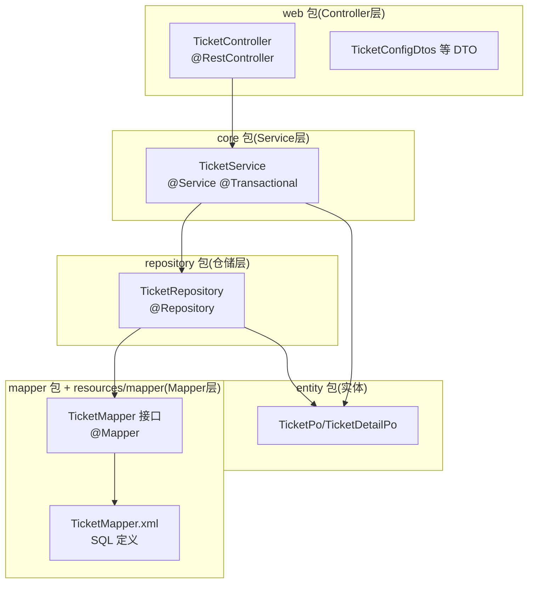
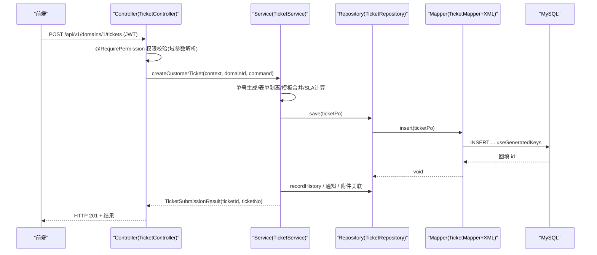
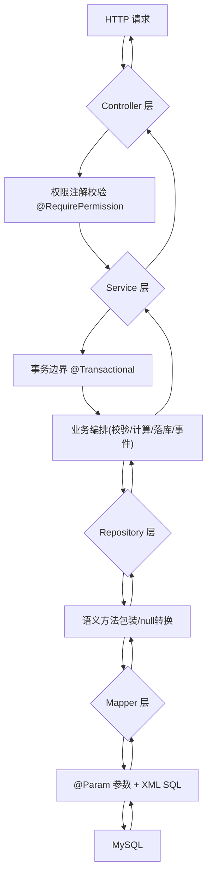
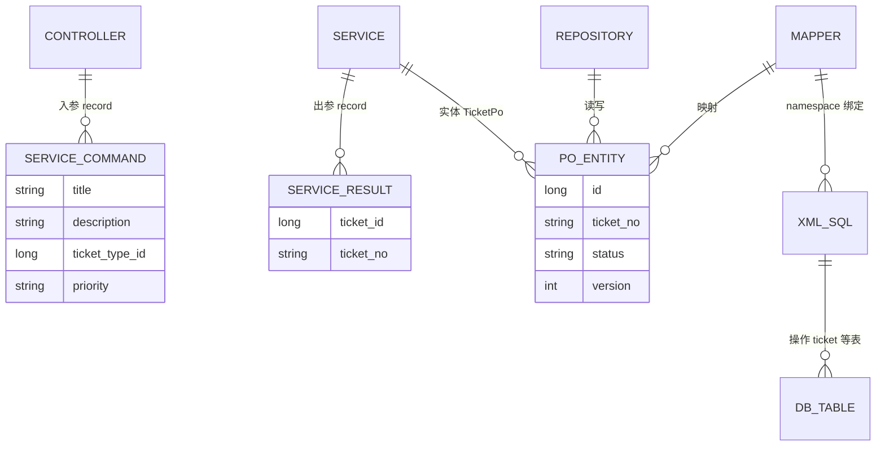
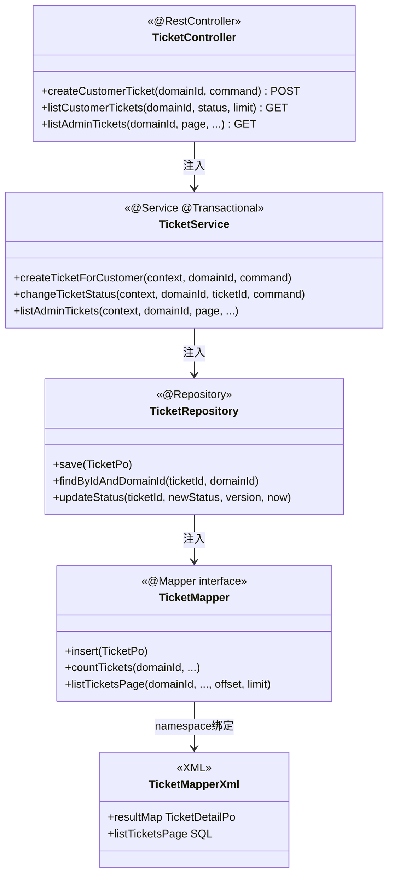

<cite>
- [UnionDesk/uniondesk-ticket/src/main/java/com/uniondesk/ticket/web/TicketController.java](file://UnionDesk/uniondesk-ticket/src/main/java/com/uniondesk/ticket/web/TicketController.java#L22-L45)
- [UnionDesk/uniondesk-ticket/src/main/java/com/uniondesk/ticket/web/TicketController.java](file://UnionDesk/uniondesk-ticket/src/main/java/com/uniondesk/ticket/web/TicketController.java#L83-L107)
- [UnionDesk/uniondesk-ticket/src/main/java/com/uniondesk/ticket/core/TicketService.java](file://UnionDesk/uniondesk-ticket/src/main/java/com/uniondesk/ticket/core/TicketService.java#L52-L77)
- [UnionDesk/uniondesk-ticket/src/main/java/com/uniondesk/ticket/core/TicketService.java](file://UnionDesk/uniondesk-ticket/src/main/java/com/uniondesk/ticket/core/TicketService.java#L124-L192)
- [UnionDesk/uniondesk-ticket/src/main/java/com/uniondesk/ticket/repository/TicketRepository.java](file://UnionDesk/uniondesk-ticket/src/main/java/com/uniondesk/ticket/repository/TicketRepository.java#L10-L33)
- [UnionDesk/uniondesk-ticket/src/main/java/com/uniondesk/ticket/mapper/TicketMapper.java](file://UnionDesk/uniondesk-ticket/src/main/java/com/uniondesk/ticket/mapper/TicketMapper.java#L10-L43)
- [UnionDesk/uniondesk-ticket/src/main/resources/mapper/ticket/TicketMapper.xml](file://UnionDesk/uniondesk-ticket/src/main/resources/mapper/ticket/TicketMapper.xml#L112-L162)
</cite>

# UnionDesk MVC 架构总览

## 简介

本文档覆盖后端 MVC 四层架构的总体设计：Controller（`web` 包）→ Service（`core` 包）→ Repository（`repository` 包）→ Mapper（`mapper` 包 + XML）。该分层在 iam/domain/ticket/support 各业务模块内高度一致地复现，本文以 uniondesk-ticket 模块为标本，说明各层职责、调用方向与典型协作。

章节来源：
- [UnionDesk/uniondesk-ticket/src/main/java/com/uniondesk/ticket/web/TicketController.java](file://UnionDesk/uniondesk-ticket/src/main/java/com/uniondesk/ticket/web/TicketController.java#L22-L45)
- [UnionDesk/uniondesk-ticket/src/main/java/com/uniondesk/ticket/core/TicketService.java](file://UnionDesk/uniondesk-ticket/src/main/java/com/uniondesk/ticket/core/TicketService.java#L52-L77)

## 项目结构

四层包结构在每个业务模块内统一布局：



图表来源：
- [UnionDesk/uniondesk-ticket/src/main/java/com/uniondesk/ticket/web/TicketController.java](file://UnionDesk/uniondesk-ticket/src/main/java/com/uniondesk/ticket/web/TicketController.java#L22-L36)
- [UnionDesk/uniondesk-ticket/src/main/java/com/uniondesk/ticket/repository/TicketRepository.java](file://UnionDesk/uniondesk-ticket/src/main/java/com/uniondesk/ticket/repository/TicketRepository.java#L10-L17)

## 核心组件

**Controller 层（web 包）**：`@RestController` + `@RequestMapping("/api/v1")`；职责仅「参数接收 → 权限声明 → 调 Service → 组装响应」。`@RequirePermission(value = PermissionCodes.TICKET_CREATE, domainIdParam = "domain_id")` 声明权限码与域参数（L38-44）；`@Valid` 校验请求体；返回直接复用 Service 内部 record（`TicketListView` 信封 L28-30）。

**Service 层（core 包）**：`@Service` 业务编排核心。`TicketService` 构造器注入 10+ Repository 与跨领域服务（SLA/通知/附件/事件发布/观察者，L52-77）；`@Transactional` 标记事务方法（L124/130/194）；内部定义 Command/Result record 作为入参出参契约（`CreateTicketCommand`、`TicketSubmissionResult`）。

**Repository 层（repository 包）**：`@Repository` 包装 Mapper，向 Service 暴露领域语义方法（`save/findByIdAndDomainId/findRequiredByIdAndDomainId/listTicketsPage/countTickets/updateStatus`）；负责「null → 异常」转换（`findRequiredByIdAndDomainId` L27-33）与参数整理，屏蔽 MyBatis 细节。

**Mapper 层（mapper 包 + XML）**：`@Mapper` 接口声明方法（`@Param` 显式命名，L10-43）；XML 在同名文件 `resources/mapper/ticket/TicketMapper.xml` 中写 SQL（namespace 绑定）；`@MapperScan("com.uniondesk.**.mapper")` 全模块扫描注入。

**实体层（entity 包）**：`*Po` 纯数据类（`TicketPo`、`TicketDetailPo` 投影 DTO），仅承载字段与 getter/setter，无业务逻辑。

章节来源：
- [UnionDesk/uniondesk-ticket/src/main/java/com/uniondesk/ticket/web/TicketController.java](file://UnionDesk/uniondesk-ticket/src/main/java/com/uniondesk/ticket/web/TicketController.java#L38-L44)
- [UnionDesk/uniondesk-ticket/src/main/java/com/uniondesk/ticket/repository/TicketRepository.java](file://UnionDesk/uniondesk-ticket/src/main/java/com/uniondesk/ticket/repository/TicketRepository.java#L19-L33)
- [UnionDesk/uniondesk-ticket/src/main/java/com/uniondesk/ticket/mapper/TicketMapper.java](file://UnionDesk/uniondesk-ticket/src/main/java/com/uniondesk/ticket/mapper/TicketMapper.java#L10-L43)

## 架构总览

一次「客户提单」请求穿越四层的时序：



图表来源：
- [UnionDesk/uniondesk-ticket/src/main/java/com/uniondesk/ticket/web/TicketController.java](file://UnionDesk/uniondesk-ticket/src/main/java/com/uniondesk/ticket/web/TicketController.java#L38-L45)
- [UnionDesk/uniondesk-ticket/src/main/java/com/uniondesk/ticket/core/TicketService.java](file://UnionDesk/uniondesk-ticket/src/main/java/com/uniondesk/ticket/core/TicketService.java#L124-L192)
- [UnionDesk/uniondesk-ticket/src/main/java/com/uniondesk/ticket/repository/TicketRepository.java](file://UnionDesk/uniondesk-ticket/src/main/java/com/uniondesk/ticket/repository/TicketRepository.java#L19-L21)

## 详细分析

**四层职责边界与约定**：

1. **Controller 零业务**：不写业务判断，只做「认证上下文获取（`requireCurrent()`）→ 参数绑定 → 权限注解 → 转发」。列表信封 record 就地定义在 Controller 内（`TicketListView` L28-30），`PageResult<T>` 作为通用分页信封。
2. **Service 承担全部业务**：`createTicketForCustomer`（L131-192）完整编排：域校验（`ensureCustomerInDomain`）→ 单号生成（`nextTicketNo`）→ 表单剥离（`peelSystemFormValues`）→ 模板合并（`mergeTemplate`）→ 落库 → 历史记录 → 附件关联 → 观察者 → SLA → 通知。事务边界与失败回滚都在此层。
3. **Repository 语义化包装**：把「Mapper 原始方法」包装为领域动作（`findRequiredByIdAndDomainId` 把 null 转 `IllegalArgumentException`）；乐观锁更新方法直接暴露 `version` 参数（`updateStatus(ticketId, newStatus, version, now)` L63-65），Service 层拿影响行数判断并发冲突。
4. **Mapper 纯粹数据访问**：接口只声明 SQL 方法，`@Param` 显式命名避免 XML 中参数歧义；XML 与接口 namespace 一一对应；SQL 复杂逻辑（联表投影、SLA 子查询）全在 XML。
5. **DTO 分层**：请求/响应 DTO 定义在 `web/*Dtos.java`（如 `TicketConfigDtos`）或 Service 内 record；实体 `*Po` 与表结构 1:1，跨层直接复用（Controller 直接返回 Service record，前端解包）。
6. **模块间跨层引用**：Service 可注入他模块 Repository/Service（`TicketService` 注入 `DomainCustomerRepository`、`SlaService`、`NotificationCenterService`），但保持「Service→Repository→Mapper」单向依赖，禁止反向。



图表来源：
- [UnionDesk/uniondesk-ticket/src/main/java/com/uniondesk/ticket/web/TicketController.java](file://UnionDesk/uniondesk-ticket/src/main/java/com/uniondesk/ticket/web/TicketController.java#L83-L107)
- [UnionDesk/uniondesk-ticket/src/main/java/com/uniondesk/ticket/repository/TicketRepository.java](file://UnionDesk/uniondesk-ticket/src/main/java/com/uniondesk/ticket/repository/TicketRepository.java#L63-L77)

## 数据模型

四层与数据对象的关系：



图表来源：
- [UnionDesk/uniondesk-ticket/src/main/java/com/uniondesk/ticket/web/TicketController.java](file://UnionDesk/uniondesk-ticket/src/main/java/com/uniondesk/ticket/web/TicketController.java#L28-L30)（ListView record）
- [UnionDesk/uniondesk-ticket/src/main/java/com/uniondesk/ticket/core/TicketService.java](file://UnionDesk/uniondesk-ticket/src/main/java/com/uniondesk/ticket/core/TicketService.java#L191)（TicketSubmissionResult）

## 依赖关系分析



图表来源：
- [UnionDesk/uniondesk-ticket/src/main/java/com/uniondesk/ticket/web/TicketController.java](file://UnionDesk/uniondesk-ticket/src/main/java/com/uniondesk/ticket/web/TicketController.java#L32-L36)
- [UnionDesk/uniondesk-ticket/src/main/java/com/uniondesk/ticket/repository/TicketRepository.java](file://UnionDesk/uniondesk-ticket/src/main/java/com/uniondesk/ticket/repository/TicketRepository.java#L13-L17)
- [UnionDesk/uniondesk-ticket/src/main/java/com/uniondesk/ticket/mapper/TicketMapper.java](file://UnionDesk/uniondesk-ticket/src/main/java/com/uniondesk/ticket/mapper/TicketMapper.java#L10-L15)

## 性能与安全考虑

- **性能**：分页走 count + list 双查（XML LIMIT/OFFSET），Repository 透传；SLA 违约动作等聚合下沉子查询；`@MapperScan` 全模块通配注入避免逐类注册开销。
- **安全**：权限校验在 Controller 层注解化（`@RequirePermission` + `domainIdParam` 从路径解析域上下文）；`@Valid` 请求体校验前置拦截非法输入；域隔离条件在 Mapper XML WHERE 中强制（`business_domain_id = #{domainId}`）。
- **事务与并发**：Service 层 `@Transactional` 统一事务边界；乐观锁版本参数贯穿 Repository→Mapper（`updateStatus` 带 version），影响行数 0 即并发冲突。
- **可测试性**：四层解耦使各层可独立单测（Mock Repository 测 Service、内存库测 Mapper）。

章节来源：
- [UnionDesk/uniondesk-ticket/src/main/java/com/uniondesk/ticket/web/TicketController.java](file://UnionDesk/uniondesk-ticket/src/main/java/com/uniondesk/ticket/web/TicketController.java#L38-L44)
- [UnionDesk/uniondesk-ticket/src/main/java/com/uniondesk/ticket/repository/TicketRepository.java](file://UnionDesk/uniondesk-ticket/src/main/java/com/uniondesk/ticket/repository/TicketRepository.java#L63-L77)

## 故障排查指南

| 现象 | 原因 | 处理建议 |
| --- | --- | --- |
| 新 Controller 方法 401/403 | `@RequirePermission` 权限码未配置或 `domainIdParam` 与实际路径参数不符 | 核对 `PermissionCodes` 常量与权限表；确认路径变量名一致 |
| Mapper 方法运行时绑定失败 | 接口方法签名与 XML id 或参数名不一致 | 对照 `@Param` 命名与 XML `#{param}`；检查 namespace |
| 事务未生效（部分写入成功） | 方法未标 `@Transactional` 或自调用绕过代理 | 事务标注在 public 方法；避免同类内部调用 |
| 列表接口慢 | Repository 层漏传条件导致全表扫描 | 核对 count/list 参数透传；检查 XML 索引命中 |
| Repository 抛「not found」 | `findRequired*` 语义方法 null 转换 | 检查数据是否存在；确认域 ID 参数 |

章节来源：
- [UnionDesk/uniondesk-ticket/src/main/java/com/uniondesk/ticket/repository/TicketRepository.java](file://UnionDesk/uniondesk-ticket/src/main/java/com/uniondesk/ticket/repository/TicketRepository.java#L27-L33)
- [UnionDesk/uniondesk-ticket/src/main/java/com/uniondesk/ticket/core/TicketService.java](file://UnionDesk/uniondesk-ticket/src/main/java/com/uniondesk/ticket/core/TicketService.java#L124-L131)

## 结论

后端 MVC 四层架构以「**Controller 零业务、Service 全编排、Repository 语义化、Mapper 纯数据**」为铁律，在 iam/domain/ticket/support 各模块一致落地。注解化权限（`@RequirePermission`）、事务化 Service、乐观锁版本贯穿三层、XML SQL 收敛复杂查询——这套分层让业务横向扩展（新增模块照抄结构）与纵向调试（逐层定位）都清晰可控。

章节来源：
- [UnionDesk/uniondesk-ticket/src/main/java/com/uniondesk/ticket/web/TicketController.java](file://UnionDesk/uniondesk-ticket/src/main/java/com/uniondesk/ticket/web/TicketController.java#L22-L45)
- [UnionDesk/uniondesk-ticket/src/main/java/com/uniondesk/ticket/core/TicketService.java](file://UnionDesk/uniondesk-ticket/src/main/java/com/uniondesk/ticket/core/TicketService.java#L52-L77)

## 附录

四层协作的代码骨架：

```java
// Controller 层：声明式权限 + 转发
@RestController
@RequestMapping("/api/v1")
public class TicketController {
    private final TicketService ticketService;
    public TicketController(TicketService ticketService) { this.ticketService = ticketService; }

    @PostMapping("/domains/{domain_id}/tickets")
    @RequirePermission(value = PermissionCodes.TICKET_CREATE, domainIdParam = "domain_id")
    public TicketService.TicketSubmissionResult create(
            @PathVariable("domain_id") long domainId,
            @Valid @RequestBody TicketService.CreateTicketCommand request) {
        return ticketService.createCustomerTicket(requireCurrent(), domainId, request);
    }
}

// Repository 层：语义包装 + null 转换
@Repository
public class TicketRepository {
    private final TicketMapper mapper;
    public TicketDetailPo findRequiredByIdAndDomainId(long ticketId, long domainId) {
        TicketDetailPo po = mapper.findByIdAndDomainId(ticketId, domainId);
        if (po == null) throw new IllegalArgumentException("ticket not found");
        return po;
    }
}

// Mapper 层：@Param 显式命名
@Mapper
public interface TicketMapper {
    long countTickets(@Param("domainId") long domainId, @Param("status") String status);
}
```

章节来源：
- [UnionDesk/uniondesk-ticket/src/main/java/com/uniondesk/ticket/web/TicketController.java](file://UnionDesk/uniondesk-ticket/src/main/java/com/uniondesk/ticket/web/TicketController.java#L38-L45)
- [UnionDesk/uniondesk-ticket/src/main/java/com/uniondesk/ticket/repository/TicketRepository.java](file://UnionDesk/uniondesk-ticket/src/main/java/com/uniondesk/ticket/repository/TicketRepository.java#L27-L33)
- [UnionDesk/uniondesk-ticket/src/main/java/com/uniondesk/ticket/mapper/TicketMapper.java](file://UnionDesk/uniondesk-ticket/src/main/java/com/uniondesk/ticket/mapper/TicketMapper.java#L22-L27)
