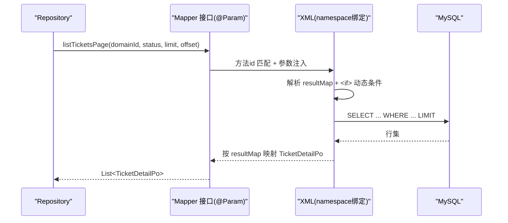
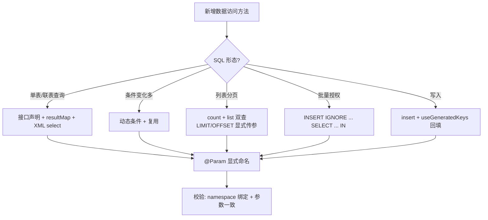
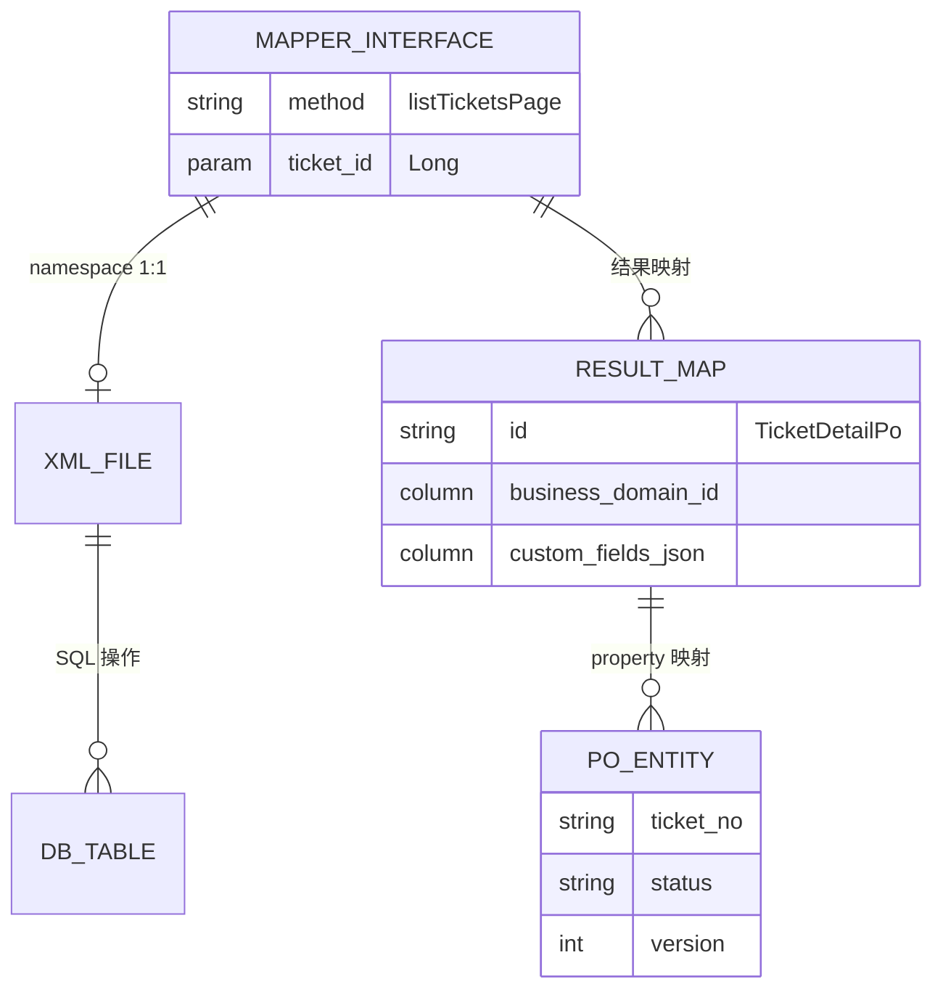
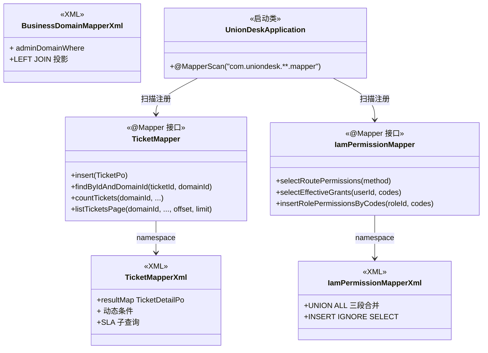

<cite>
- [UnionDesk/uniondesk-ticket/src/main/java/com/uniondesk/ticket/mapper/TicketMapper.java](file://UnionDesk/uniondesk-ticket/src/main/java/com/uniondesk/ticket/mapper/TicketMapper.java#L10-L43)
- [UnionDesk/uniondesk-ticket/src/main/resources/mapper/ticket/TicketMapper.xml](file://UnionDesk/uniondesk-ticket/src/main/resources/mapper/ticket/TicketMapper.xml#L1-L52)
- [UnionDesk/uniondesk-ticket/src/main/resources/mapper/ticket/TicketMapper.xml](file://UnionDesk/uniondesk-ticket/src/main/resources/mapper/ticket/TicketMapper.xml#L54-L110)
- [UnionDesk/uniondesk-ticket/src/main/resources/mapper/ticket/TicketMapper.xml](file://UnionDesk/uniondesk-ticket/src/main/resources/mapper/ticket/TicketMapper.xml#L112-L244)
- [UnionDesk/uniondesk-iam/src/main/java/com/uniondesk/iam/mapper/IamPermissionMapper.java](file://UnionDesk/uniondesk-iam/src/main/java/com/uniondesk/iam/mapper/IamPermissionMapper.java#L10-L20)
- [UnionDesk/uniondesk-iam/src/main/resources/mapper/iam/IamPermissionMapper.xml](file://UnionDesk/uniondesk-iam/src/main/resources/mapper/iam/IamPermissionMapper.xml#L1-L24)
- [UnionDesk/uniondesk-iam/src/main/resources/mapper/iam/IamPermissionMapper.xml](file://UnionDesk/uniondesk-iam/src/main/resources/mapper/iam/IamPermissionMapper.xml#L26-L77)
- [UnionDesk/uniondesk-iam/src/main/resources/mapper/iam/IamPermissionMapper.xml](file://UnionDesk/uniondesk-iam/src/main/resources/mapper/iam/IamPermissionMapper.xml#L79-L94)
- [UnionDesk/uniondesk-domain/src/main/resources/mapper/domain/BusinessDomainMapper.xml](file://UnionDesk/uniondesk-domain/src/main/resources/mapper/domain/BusinessDomainMapper.xml#L26-L75)
- [UnionDesk/uniondesk-app/src/main/java/com/uniondesk/UnionDeskApplication.java](file://UnionDesk/uniondesk-app/src/main/java/com/uniondesk/UnionDeskApplication.java#L9-L17)
</cite>

# UnionDesk Mapper 层设计

## 简介

本文档详解后端 Mapper 层（`mapper` 包 + `resources/mapper` XML）的设计规范：`@Mapper` 接口 + XML namespace 绑定、`@Param` 显式参数命名、resultMap 结果映射、动态 SQL（`<if>/<foreach>/<sql>/<include>`）、分页 limit/offset 参数传递、批量写入模式。以 `TicketMapper` 与 `IamPermissionMapper` 为标本。

章节来源：
- [UnionDesk/uniondesk-ticket/src/main/java/com/uniondesk/ticket/mapper/TicketMapper.java](file://UnionDesk/uniondesk-ticket/src/main/java/com/uniondesk/ticket/mapper/TicketMapper.java#L10-L43)
- [UnionDesk/uniondesk-ticket/src/main/resources/mapper/ticket/TicketMapper.xml](file://UnionDesk/uniondesk-ticket/src/main/resources/mapper/ticket/TicketMapper.xml#L1-L4)

## 项目结构

Mapper 层的物理组织：接口在模块 `mapper` 包，XML 在 `resources/mapper/<子域>/` 同名文件。

```mermaid
graph TB
    subgraph INT["mapper 包(接口)"]
        TM["TicketMapper.java"]
        IPM["IamPermissionMapper.java"]
        BM["BusinessDomainMapper.java"]
    end
    subgraph XML["resources/mapper(映射)"]
        TMX["ticket/TicketMapper.xml"]
        IPMX["iam/IamPermissionMapper.xml"]
        BMX["domain/BusinessDomainMapper.xml"]
    end
    subgraph REG["注册"]
        SCAN["@MapperScan('com.uniondesk.**.mapper')<br/>UnionDeskApplication"]
        NAME["FullyQualifiedAnnotationBeanNameGenerator<br/>防同名冲突"]
    end
    TM --> TMX : namespace
    IPM --> IPMX : namespace
    BM --> BMX : namespace
    SCAN --> TM & IPM & BM
    NAME --> SCAN
```

图表来源：
- [UnionDesk/uniondesk-app/src/main/java/com/uniondesk/UnionDeskApplication.java](file://UnionDesk/uniondesk-app/src/main/java/com/uniondesk/UnionDeskApplication.java#L9-L17)（@MapperScan 通配扫描）
- [UnionDesk/uniondesk-ticket/src/main/resources/mapper/ticket/TicketMapper.xml](file://UnionDesk/uniondesk-ticket/src/main/resources/mapper/ticket/TicketMapper.xml#L1-L4)（namespace 绑定）

## 核心组件

**1. Mapper 接口（@Mapper）**：`TicketMapper`（L10-43）与 `IamPermissionMapper`（L10-20）均标 `@Mapper`；方法签名用 `@Param` 显式命名每个参数（`@Param("ticketId") long ticketId`），保证 XML `#{}` 引用无歧义。

**2. XML 映射文件**：`<mapper namespace="com.uniondesk.ticket.mapper.TicketMapper">` 与接口全限定名绑定（L4）；SQL 与接口方法一一对应（id = 方法名）。

**3. resultMap 结果映射**：`TicketDetailPo` resultMap（L6-36）显式 `column→property` 映射（含 `business_domain_code/name` 联表列与 `custom_fields_json` CAST 列）；`IamPermissionMapper` 的 `RoutePermissionPo`/`EffectivePermissionGrantPo` resultMap（L6-16）。

**4. 动态 SQL**：`<if test="...">` 条件（L154-181）、`<foreach>` IN 列表（IamPermissionMapper L39-40）、`<sql>+<include>` 片段复用（BusinessDomainMapper L26-44、L67-75）。

**5. 分页参数传递**：`LIMIT #{limit} OFFSET #{offset}` 显式传参（TicketMapper.xml L243），count 与 list 同条件成对（L164-244）。

**6. 批量写入**：`INSERT IGNORE ... SELECT`（IamPermissionMapper L88-94）、`<foreach>` 多值 INSERT（AdminMenuMapper batchInsertRoleMenuRelations）。

章节来源：
- [UnionDesk/uniondesk-ticket/src/main/java/com/uniondesk/ticket/mapper/TicketMapper.java](file://UnionDesk/uniondesk-ticket/src/main/java/com/uniondesk/ticket/mapper/TicketMapper.java#L10-L43)
- [UnionDesk/uniondesk-ticket/src/main/resources/mapper/ticket/TicketMapper.xml](file://UnionDesk/uniondesk-ticket/src/main/resources/mapper/ticket/TicketMapper.xml#L6-L36)
- [UnionDesk/uniondesk-iam/src/main/java/com/uniondesk/iam/mapper/IamPermissionMapper.java](file://UnionDesk/uniondesk-iam/src/main/java/com/uniondesk/iam/mapper/IamPermissionMapper.java#L10-L20)

## 架构总览

一次查询从接口到 SQL 执行：



图表来源：
- [UnionDesk/uniondesk-ticket/src/main/java/com/uniondesk/ticket/mapper/TicketMapper.java](file://UnionDesk/uniondesk-ticket/src/main/java/com/uniondesk/ticket/mapper/TicketMapper.java#L29-L36)
- [UnionDesk/uniondesk-ticket/src/main/resources/mapper/ticket/TicketMapper.xml](file://UnionDesk/uniondesk-ticket/src/main/resources/mapper/ticket/TicketMapper.xml#L185-L244)

## 详细分析

**Mapper 层设计细则**：

1. **接口即契约**：Mapper 接口方法签名 = XML SQL 的契约；`@Param` 显式命名（而非 arg0/param1 隐式）防止 XML 引用错位；返回类型（Po/List/Long/int）与 XML 结果对应。
2. **resultMap 与投影**：`TicketDetailPo` 把「工单 + 域名称 + 类型名称 + 回复统计 + SLA 违约动作」投影为聚合 DTO（L6-36），`CAST(custom_fields AS CHAR) AS custom_fields_json` 处理 JSON 列；`EffectivePermissionGrantPo` 用 constructor/result 混合映射。
3. **动态 SQL 三件套**：`<if>` 条件拼装（L154-181）；`<foreach collection="codes" item="code" open="(" separator="," close=")">` IN 列表（IamPermissionMapper L39-40）；`<sql id="...">` 定义公共片段 + `<include refid="...">` 复用（BusinessDomainMapper L26-44）——count/list 条件共享同一片段从结构上防漂移。
4. **分页模式**：显式 `LIMIT #{limit} OFFSET #{offset}`（不依赖插件）；`limit` 默认值由调用方（Controller/Service）归一化；count 返回 `long`。
5. **批量与幂等**：`INSERT IGNORE INTO ... SELECT ... FROM ... WHERE code IN <foreach>`（L88-94）按权限码批量授权，唯一键冲突自动忽略——「一条 SQL 完成授权 + 去重」；`deleteRolePermissionsByCatalog` 用 `JOIN DELETE` 批量解绑（L79-86）。
6. **注册机制**：`@MapperScan(value="com.uniondesk.**.mapper", nameGenerator=FullyQualifiedAnnotationBeanNameGenerator.class)` 通配扫描全模块 Mapper，全限定类名命名规避不同模块同名 Mapper Bean 冲突。



图表来源：
- [UnionDesk/uniondesk-ticket/src/main/resources/mapper/ticket/TicketMapper.xml](file://UnionDesk/uniondesk-ticket/src/main/resources/mapper/ticket/TicketMapper.xml#L38-L52)（insert 回填）
- [UnionDesk/uniondesk-iam/src/main/resources/mapper/iam/IamPermissionMapper.xml](file://UnionDesk/uniondesk-iam/src/main/resources/mapper/iam/IamPermissionMapper.xml#L79-L94)
- [UnionDesk/uniondesk-app/src/main/java/com/uniondesk/UnionDeskApplication.java](file://UnionDesk/uniondesk-app/src/main/java/com/uniondesk/UnionDeskApplication.java#L9-L17)

## 数据模型

Mapper 层与实体/表的关系：



图表来源：
- [UnionDesk/uniondesk-ticket/src/main/resources/mapper/ticket/TicketMapper.xml](file://UnionDesk/uniondesk-ticket/src/main/resources/mapper/ticket/TicketMapper.xml#L6-L36)
- [UnionDesk/uniondesk-ticket/src/main/java/com/uniondesk/ticket/mapper/TicketMapper.java](file://UnionDesk/uniondesk-ticket/src/main/java/com/uniondesk/ticket/mapper/TicketMapper.java#L13-L15)

## 依赖关系分析



图表来源：
- [UnionDesk/uniondesk-ticket/src/main/java/com/uniondesk/ticket/mapper/TicketMapper.java](file://UnionDesk/uniondesk-ticket/src/main/java/com/uniondesk/ticket/mapper/TicketMapper.java#L10-L15)
- [UnionDesk/uniondesk-iam/src/main/java/com/uniondesk/iam/mapper/IamPermissionMapper.java](file://UnionDesk/uniondesk-iam/src/main/java/com/uniondesk/iam/mapper/IamPermissionMapper.java#L10-L20)
- [UnionDesk/uniondesk-app/src/main/java/com/uniondesk/UnionDeskApplication.java](file://UnionDesk/uniondesk-app/src/main/java/com/uniondesk/UnionDeskApplication.java#L9-L17)

## 性能与安全考虑

- **参数安全**：全部 `#{}` 预编译占位，杜绝 SQL 注入；`<foreach>` IN 列表长度受限（MySQL 参数上限），大数据集需分批。
- **查询性能**：分页显式 LIMIT/OFFSET 控制返回量；count 用 `COUNT(*)` 轻量聚合；resultMap 只投影所需列；`<sql>` 片段复用减少维护成本；LIKE 前导通配符不走索引需评估。
- **批量性能**：`INSERT IGNORE ... SELECT` 单条 SQL 批量授权，避免 N 次往返；`<foreach>` 多值 INSERT 同理。
- **健壮性**：`useGeneratedKeys` 回填主键防二次查询；`INSERT IGNORE` 幂等防重复授权；`JOIN DELETE` 精确解绑。

章节来源：
- [UnionDesk/uniondesk-iam/src/main/resources/mapper/iam/IamPermissionMapper.xml](file://UnionDesk/uniondesk-iam/src/main/resources/mapper/iam/IamPermissionMapper.xml#L88-L94)
- [UnionDesk/uniondesk-ticket/src/main/resources/mapper/ticket/TicketMapper.xml](file://UnionDesk/uniondesk-ticket/src/main/resources/mapper/ticket/TicketMapper.xml#L180-L182)

## 故障排查指南

| 现象 | 原因 | 处理建议 |
| --- | --- | --- |
| 启动报 `Invalid bound statement` | 接口方法与 XML id 不匹配或 namespace 拼错 | 核对 XML `namespace` 与接口全限定名；检查方法 id 大小写 |
| SQL 参数绑定失败 | `#{}` 名与 `@Param` 不一致 | 对照 `@Param("xxx")` 与 XML `#{xxx}` |
| 动态条件未生效 | `<if test="...">` 表达式写错（如属性名） | 核对 test 表达式与参数属性名；空字符串判断 |
| 分页查询慢 | LIMIT/OFFSET 大偏移或条件未走索引 | 评估深分页（游标/键集）；检查复合索引前缀 |
| INSERT 不返回主键 | 未配 `useGeneratedKeys` 或 XML 缺 keyProperty | 添加 `useGeneratedKeys="true" keyProperty="id"` |

章节来源：
- [UnionDesk/uniondesk-ticket/src/main/resources/mapper/ticket/TicketMapper.xml](file://UnionDesk/uniondesk-ticket/src/main/resources/mapper/ticket/TicketMapper.xml#L38-L39)（useGeneratedKeys）
- [UnionDesk/uniondesk-ticket/src/main/java/com/uniondesk/ticket/mapper/TicketMapper.java](file://UnionDesk/uniondesk-ticket/src/main/java/com/uniondesk/ticket/mapper/TicketMapper.java#L13-L36)（@Param 命名）

## 结论

Mapper 层是「接口契约 + XML SQL」的双文件模式：`@Mapper` 接口声明方法并 `@Param` 命名参数，XML 以 namespace 绑定并用 resultMap/动态 SQL/分页/批量四类要素承载全部 SQL 逻辑；`@MapperScan` 通配扫描 + 全限定名命名保证多模块装配。新增数据访问照「接口 → XML → 注册」三步，保持参数安全与查询性能。

章节来源：
- [UnionDesk/uniondesk-app/src/main/java/com/uniondesk/UnionDeskApplication.java](file://UnionDesk/uniondesk-app/src/main/java/com/uniondesk/UnionDeskApplication.java#L9-L17)
- [UnionDesk/uniondesk-ticket/src/main/resources/mapper/ticket/TicketMapper.xml](file://UnionDesk/uniondesk-ticket/src/main/resources/mapper/ticket/TicketMapper.xml#L1-L4)

## 附录

Mapper 层标准模板：

```java
// 1. 接口（@Param 显式命名）
@Mapper
public interface DemoMapper {
    long countDemos(@Param("domainId") long domainId, @Param("status") String status);
    List<DemoPo> listDemos(@Param("domainId") long domainId,
                           @Param("status") String status,
                           @Param("limit") int limit,
                           @Param("offset") long offset);
    void insert(DemoPo po);
}
```

```xml
<!-- 2. XML（namespace 绑定 + 动态条件 + 分页） -->
<mapper namespace="com.uniondesk.demo.mapper.DemoMapper">
    <sql id="demoWhere">
        <where>
            <if test="status != null and status != ''">AND status = #{status}</if>
        </where>
    </sql>
    <select id="countDemos" resultType="long">
        SELECT COUNT(*) FROM demo <include refid="demoWhere"/>
    </select>
    <select id="listDemos" resultType="com.uniondesk.demo.entity.DemoPo">
        SELECT id, name, status FROM demo <include refid="demoWhere"/>
        ORDER BY id DESC LIMIT #{limit} OFFSET #{offset}
    </select>
    <insert id="insert" useGeneratedKeys="true" keyProperty="id">
        INSERT INTO demo (name, status) VALUES (#{name}, #{status})
    </insert>
</mapper>
```

章节来源：
- [UnionDesk/uniondesk-ticket/src/main/java/com/uniondesk/ticket/mapper/TicketMapper.java](file://UnionDesk/uniondesk-ticket/src/main/java/com/uniondesk/ticket/mapper/TicketMapper.java#L10-L43)
- [UnionDesk/uniondesk-ticket/src/main/resources/mapper/ticket/TicketMapper.xml](file://UnionDesk/uniondesk-ticket/src/main/resources/mapper/ticket/TicketMapper.xml#L112-L244)
- [UnionDesk/uniondesk-domain/src/main/resources/mapper/domain/BusinessDomainMapper.xml](file://UnionDesk/uniondesk-domain/src/main/resources/mapper/domain/BusinessDomainMapper.xml#L26-L75)
