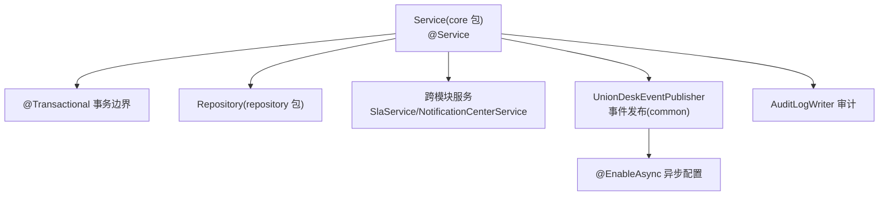
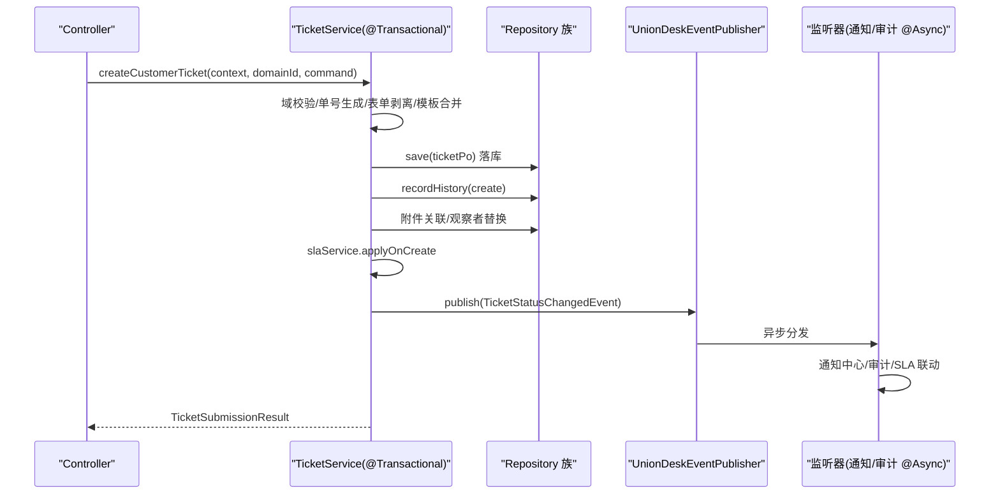
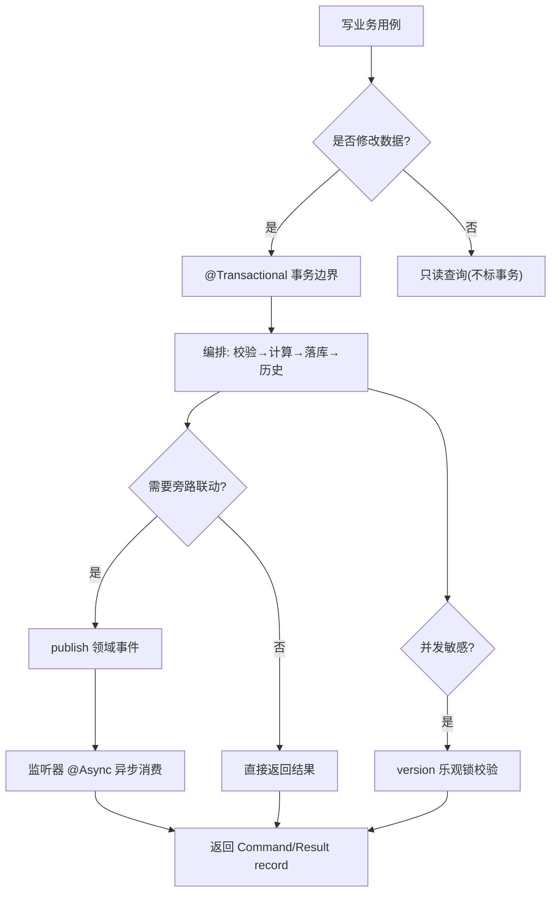
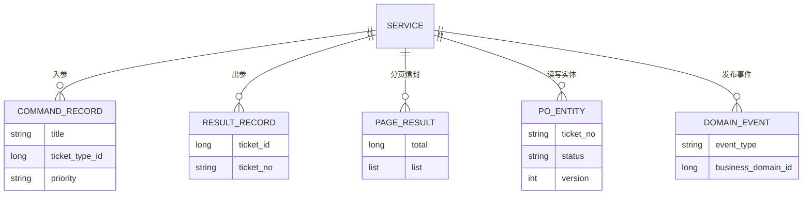
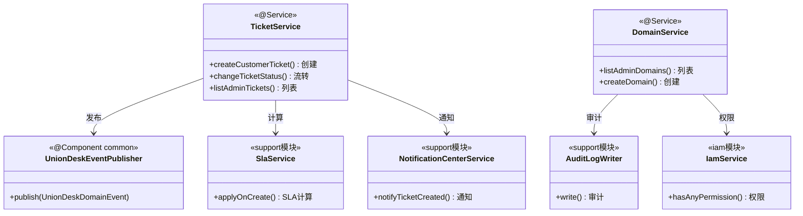

<cite>
- [UnionDesk/uniondesk-ticket/src/main/java/com/uniondesk/ticket/core/TicketService.java](file://UnionDesk/uniondesk-ticket/src/main/java/com/uniondesk/ticket/core/TicketService.java#L52-L77)
- [UnionDesk/uniondesk-ticket/src/main/java/com/uniondesk/ticket/core/TicketService.java](file://UnionDesk/uniondesk-ticket/src/main/java/com/uniondesk/ticket/core/TicketService.java#L79-L122)
- [UnionDesk/uniondesk-ticket/src/main/java/com/uniondesk/ticket/core/TicketService.java](file://UnionDesk/uniondesk-ticket/src/main/java/com/uniondesk/ticket/core/TicketService.java#L124-L192)
- [UnionDesk/uniondesk-ticket/src/main/java/com/uniondesk/ticket/core/TicketService.java](file://UnionDesk/uniondesk-ticket/src/main/java/com/uniondesk/ticket/core/TicketService.java#L194-L198)
- [UnionDesk/uniondesk-domain/src/main/java/com/uniondesk/domain/core/DomainService.java](file://UnionDesk/uniondesk-domain/src/main/java/com/uniondesk/domain/core/DomainService.java#L30-L55)
- [UnionDesk/uniondesk-domain/src/main/java/com/uniondesk/domain/core/DomainService.java](file://UnionDesk/uniondesk-domain/src/main/java/com/uniondesk/domain/core/DomainService.java#L57-L86)
- [UnionDesk/uniondesk-common/src/main/java/com/uniondesk/common/event/UnionDeskEventPublisher.java](file://UnionDesk/uniondesk-common/src/main/java/com/uniondesk/common/event/UnionDeskEventPublisher.java#L6-L18)
- [UnionDesk/uniondesk-app/src/main/java/com/uniondesk/config/AsyncConfiguration.java](file://UnionDesk/uniondesk-app/src/main/java/com/uniondesk/config/AsyncConfiguration.java#L6-L9)
- [UnionDesk/uniondesk-common/src/main/java/com/uniondesk/common/web/PageResult.java](file://UnionDesk/uniondesk-common/src/main/java/com/uniondesk/common/web/PageResult.java#L1-L6)
</cite>

# UnionDesk Service 层设计

## 简介

本文档详解后端 Service 层（`core` 包）的设计规范：事务边界与 `@Transactional` 使用、领域服务职责划分、事件发布（`UnionDeskEventPublisher` + Spring 事件）、构造器依赖注入、跨模块服务协作。以 `TicketService`（工单聚合）与 `DomainService`（业务域）为标本。

章节来源：
- [UnionDesk/uniondesk-ticket/src/main/java/com/uniondesk/ticket/core/TicketService.java](file://UnionDesk/uniondesk-ticket/src/main/java/com/uniondesk/ticket/core/TicketService.java#L52-L77)
- [UnionDesk/uniondesk-domain/src/main/java/com/uniondesk/domain/core/DomainService.java](file://UnionDesk/uniondesk-domain/src/main/java/com/uniondesk/domain/core/DomainService.java#L30-L55)

## 项目结构

Service 层在模块中的位置与协作对象：



图表来源：
- [UnionDesk/uniondesk-ticket/src/main/java/com/uniondesk/ticket/core/TicketService.java](file://UnionDesk/uniondesk-ticket/src/main/java/com/uniondesk/ticket/core/TicketService.java#L57-L77)
- [UnionDesk/uniondesk-common/src/main/java/com/uniondesk/common/event/UnionDeskEventPublisher.java](file://UnionDesk/uniondesk-common/src/main/java/com/uniondesk/common/event/UnionDeskEventPublisher.java#L6-L18)

## 核心组件

**1. 领域服务（@Service）**：`TicketService`（工单聚合根）与 `DomainService`（业务域聚合根）均标 `@Service`；职责为「本领域业务编排」，不直接触碰 HTTP 语义。

**2. 事务边界（@Transactional）**：写操作方法标注 `@Transactional`——`createCustomerTicket`（L124）、`createTicketForCustomer`（L130）、`changeTicketStatus`（L194）；读操作（列表/详情）不标注。

**3. 构造器注入**：`TicketService` 构造器注入 10+ Repository 与 5 个跨领域服务（SLA/通知/附件/事件发布/观察者，L79-122）；`DomainService` 注入 `DomainBootstrapService`、`IamService`、`AuditLogWriter`、`ObjectProvider<DomainTeamTemplateApplier>`（L42-55）——`ObjectProvider` 用于可选/懒加载依赖。

**4. 事件发布（UnionDeskEventPublisher）**：common 模块 `@Component` 包装 Spring `ApplicationEventPublisher`（L6-18），`publish(UnionDeskDomainEvent)` 统一事件出口；业务事件如 `TicketStatusChangedEvent` 由 Service 在事务内发布。

**5. 异步配置（@EnableAsync）**：`AsyncConfiguration` 开启 Spring 异步（L6-9），事件监听器可 `@Async` 执行，旁路联动不阻塞主事务。

**6. 审计协作**：`DomainService` 注入 `AuditLogWriter` + `AuditActionCodes` 常量，业务变更即时写审计。

章节来源：
- [UnionDesk/uniondesk-ticket/src/main/java/com/uniondesk/ticket/core/TicketService.java](file://UnionDesk/uniondesk-ticket/src/main/java/com/uniondesk/ticket/core/TicketService.java#L79-L122)
- [UnionDesk/uniondesk-domain/src/main/java/com/uniondesk/domain/core/DomainService.java](file://UnionDesk/uniondesk-domain/src/main/java/com/uniondesk/domain/core/DomainService.java#L35-L55)
- [UnionDesk/uniondesk-app/src/main/java/com/uniondesk/config/AsyncConfiguration.java](file://UnionDesk/uniondesk-app/src/main/java/com/uniondesk/config/AsyncConfiguration.java#L6-L9)

## 架构总览

工单创建的事务与事件时序：



图表来源：
- [UnionDesk/uniondesk-ticket/src/main/java/com/uniondesk/ticket/core/TicketService.java](file://UnionDesk/uniondesk-ticket/src/main/java/com/uniondesk/ticket/core/TicketService.java#L124-L192)
- [UnionDesk/uniondesk-common/src/main/java/com/uniondesk/common/event/UnionDeskEventPublisher.java](file://UnionDesk/uniondesk-common/src/main/java/com/uniondesk/common/event/UnionDeskEventPublisher.java#L15-L17)

## 详细分析

**Service 层设计细则**：

1. **事务粒度=业务用例**：`@Transactional` 标在完整用例方法上（创建=落库+历史+关联+事件），保证原子性；事件发布在事务内完成，监听器 `@Async` 异步消费——「事务内发布、事务外消费」避免旁路失败拖垮主链路。
2. **构造器注入规范**：全部依赖经构造器注入（无字段注入），利于测试与依赖可见；`ObjectProvider` 处理可选依赖（`DomainTeamTemplateApplier` 可能未装配）。
3. **Command/Result record 契约**：Service 内部定义 `CreateTicketCommand`/`TicketSubmissionResult` 等 record 作为跨层契约，Controller 直接复用（见 MVC 总览），避免 DTO 爆炸。
4. **并发控制**：`changeTicketStatus` 先读 `current.version()` 与 `command.version()` 比对（L196-198），不匹配抛「工单已被他人修改」；乐观锁版本贯穿 Repository→Mapper。
5. **领域服务协作**：`DomainService` 注入 `IamService`（权限校验）与 `AuditLogWriter`（审计），体现「跨模块 Service 协作、单向依赖」。
6. **查询归一化**：分页参数在 Service 层归一化（`Math.max(page,1)`、offset 计算，DomainService L64-68），Controller 无需处理边界。
7. **DTO 投影**：Service 返回 `PageResult<T>` 与领域视图 record（`toDomainView`/`DomainBriefView`），实体不直接出层。



图表来源：
- [UnionDesk/uniondesk-ticket/src/main/java/com/uniondesk/ticket/core/TicketService.java](file://UnionDesk/uniondesk-ticket/src/main/java/com/uniondesk/ticket/core/TicketService.java#L124-L198)
- [UnionDesk/uniondesk-domain/src/main/java/com/uniondesk/domain/core/DomainService.java](file://UnionDesk/uniondesk-domain/src/main/java/com/uniondesk/domain/core/DomainService.java#L57-L74)

## 数据模型

Service 层与数据对象的关系：



图表来源：
- [UnionDesk/uniondesk-ticket/src/main/java/com/uniondesk/ticket/core/TicketService.java](file://UnionDesk/uniondesk-ticket/src/main/java/com/uniondesk/ticket/core/TicketService.java#L191)（TicketSubmissionResult）
- [UnionDesk/uniondesk-common/src/main/java/com/uniondesk/common/web/PageResult.java](file://UnionDesk/uniondesk-common/src/main/java/com/uniondesk/common/web/PageResult.java#L1-L6)

## 依赖关系分析



图表来源：
- [UnionDesk/uniondesk-ticket/src/main/java/com/uniondesk/ticket/core/TicketService.java](file://UnionDesk/uniondesk-ticket/src/main/java/com/uniondesk/ticket/core/TicketService.java#L57-L77)
- [UnionDesk/uniondesk-domain/src/main/java/com/uniondesk/domain/core/DomainService.java](file://UnionDesk/uniondesk-domain/src/main/java/com/uniondesk/domain/core/DomainService.java#L35-L55)

## 性能与安全考虑

- **性能**：读操作不开启事务（减少连接占用）；分页参数归一化防大 offset 非法值；异步监听器让通知/审计不阻塞主事务。
- **事务安全**：`@Transactional` 只标写用例；事务内发布事件、`@Async` 消费，保证「主链路成功则事件必然发出」；乐观锁版本校验防并发覆盖。
- **安全**：Service 层做域校验（`ensureCustomerInDomain`）与权限前置检查（配合 IamService）；Command 参数在进入 Service 前已经 `@Valid` 校验。
- **可测试性**：构造器注入使单测可 mock 全部依赖；事件可断言发布；`ObjectProvider` 可选依赖不破坏装配。

章节来源：
- [UnionDesk/uniondesk-ticket/src/main/java/com/uniondesk/ticket/core/TicketService.java](file://UnionDesk/uniondesk-ticket/src/main/java/com/uniondesk/ticket/core/TicketService.java#L194-L198)
- [UnionDesk/uniondesk-app/src/main/java/com/uniondesk/config/AsyncConfiguration.java](file://UnionDesk/uniondesk-app/src/main/java/com/uniondesk/config/AsyncConfiguration.java#L6-L9)

## 故障排查指南

| 现象 | 原因 | 处理建议 |
| --- | --- | --- |
| 事务未回滚（部分数据已写） | 事务方法自调用（同类内部调用绕过代理）或异常被吞 | 事务方法经代理调用；不要在 try-catch 内吞异常 |
| 事件未触发旁路联动 | 事件在事务内发布但监听器同步失败/未 `@Async` | 检查监听器注解与异常处理；确认 `@EnableAsync` 生效 |
| 依赖注入启动失败 | 构造器新增依赖未在容器中注册（如跨模块服务） | 确认目标模块已加入 app 聚合依赖 |
| 并发流转被拒 | version 不匹配（乐观锁生效） | 前端刷新重载；检查 version 参数传递 |
| 分页列表慢 | 未归一化参数或条件未走索引 | 核对 `Math.max(page,1)` 与 count/list 条件 |

章节来源：
- [UnionDesk/uniondesk-ticket/src/main/java/com/uniondesk/ticket/core/TicketService.java](file://UnionDesk/uniondesk-ticket/src/main/java/com/uniondesk/ticket/core/TicketService.java#L194-L198)
- [UnionDesk/uniondesk-common/src/main/java/com/uniondesk/common/event/UnionDeskEventPublisher.java](file://UnionDesk/uniondesk-common/src/main/java/com/uniondesk/common/event/UnionDeskEventPublisher.java#L15-L17)

## 结论

Service 层是后端架构的「业务心脏」：`@Transactional` 定义用例级事务边界，构造器注入保证依赖清晰，领域事件发布 + `@Async` 消费实现旁路解耦，乐观锁版本贯穿并发控制，Command/Result record 收敛跨层契约。新增业务用例时照「事务 → 编排 → 事件 → 返回」四步模板实现，即可保持与既有 Service 一致的工程质量。

章节来源：
- [UnionDesk/uniondesk-ticket/src/main/java/com/uniondesk/ticket/core/TicketService.java](file://UnionDesk/uniondesk-ticket/src/main/java/com/uniondesk/ticket/core/TicketService.java#L124-L192)
- [UnionDesk/uniondesk-domain/src/main/java/com/uniondesk/domain/core/DomainService.java](file://UnionDesk/uniondesk-domain/src/main/java/com/uniondesk/domain/core/DomainService.java#L57-L86)

## 附录

Service 层标准模板：

```java
@Service
public class DemoService {

    private final DemoRepository demoRepository;
    private final UnionDeskEventPublisher eventPublisher;

    public DemoService(DemoRepository demoRepository, UnionDeskEventPublisher eventPublisher) {
        this.demoRepository = demoRepository;
        this.eventPublisher = eventPublisher;
    }

    /** 写用例：事务 + 编排 + 事件 */
    @Transactional
    public DemoResult createDemo(long domainId, CreateDemoCommand command) {
        DemoPo po = new DemoPo();
        po.setBusinessDomainId(domainId);
        // ... 业务编排
        demoRepository.save(po);
        eventPublisher.publish(new DemoCreatedEvent(domainId, po.getId()));
        return new DemoResult(po.getId());
    }

    /** 读用例：不标事务，分页归一化 */
    public PageResult<DemoView> listDemos(int page, int pageSize) {
        int p = Math.max(page, 1);
        int ps = Math.max(pageSize, 1);
        long total = demoRepository.countDemos();
        List<DemoPo> pos = demoRepository.findDemos(ps, (p - 1L) * ps);
        return new PageResult<>(total, pos.stream().map(this::toView).toList());
    }
}
```

章节来源：
- [UnionDesk/uniondesk-ticket/src/main/java/com/uniondesk/ticket/core/TicketService.java](file://UnionDesk/uniondesk-ticket/src/main/java/com/uniondesk/ticket/core/TicketService.java#L52-L77)
- [UnionDesk/uniondesk-domain/src/main/java/com/uniondesk/domain/core/DomainService.java](file://UnionDesk/uniondesk-domain/src/main/java/com/uniondesk/domain/core/DomainService.java#L57-L74)
- [UnionDesk/uniondesk-common/src/main/java/com/uniondesk/common/web/PageResult.java](file://UnionDesk/uniondesk-common/src/main/java/com/uniondesk/common/web/PageResult.java#L1-L6)
