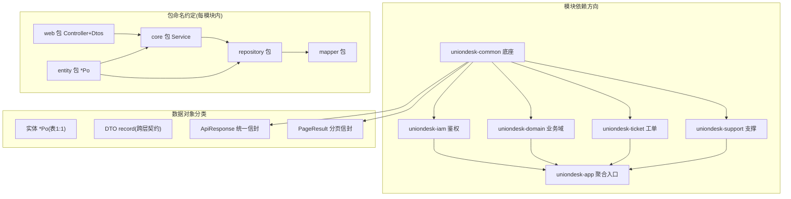
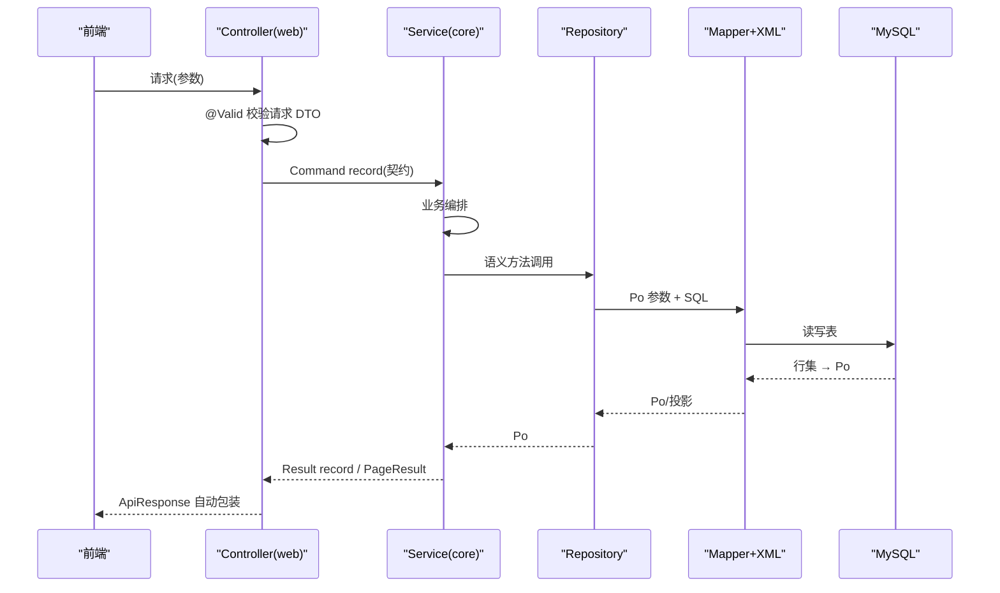
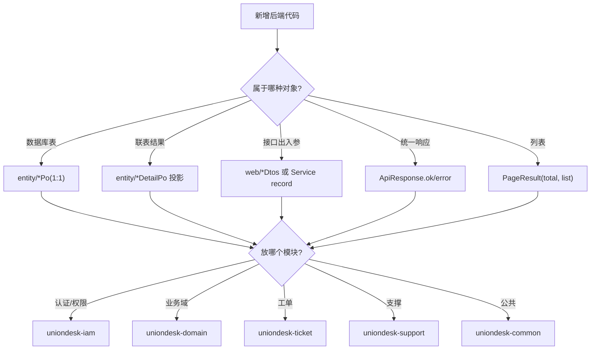
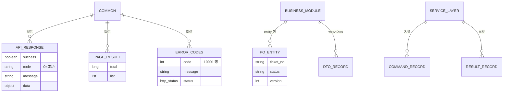
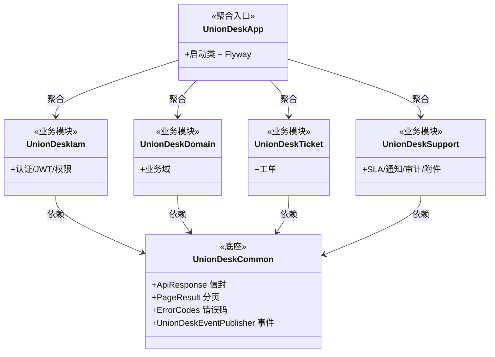

<cite>
- [UnionDesk/pom.xml](file://UnionDesk/pom.xml#L21-L28)
- [UnionDesk/uniondesk-app/pom.xml](file://UnionDesk/uniondesk-app/pom.xml#L17-L37)
- [UnionDesk/uniondesk-common/src/main/java/com/uniondesk/common/web/ApiResponse.java](file://UnionDesk/uniondesk-common/src/main/java/com/uniondesk/common/web/ApiResponse.java#L3-L16)
- [UnionDesk/uniondesk-common/src/main/java/com/uniondesk/common/web/PageResult.java](file://UnionDesk/uniondesk-common/src/main/java/com/uniondesk/common/web/PageResult.java#L1-L6)
- [UnionDesk/uniondesk-common/src/main/java/com/uniondesk/common/web/ErrorCodes.java](file://UnionDesk/uniondesk-common/src/main/java/com/uniondesk/common/web/ErrorCodes.java#L6-L19)
- [UnionDesk/uniondesk-common/src/main/java/com/uniondesk/common/web/ErrorCodes.java](file://UnionDesk/uniondesk-common/src/main/java/com/uniondesk/common/web/ErrorCodes.java#L43-L53)
- [UnionDesk/uniondesk-ticket/src/main/java/com/uniondesk/ticket/entity/TicketPo.java](file://UnionDesk/uniondesk-ticket/src/main/java/com/uniondesk/ticket/entity/TicketPo.java#L5-L31)
- [UnionDesk/uniondesk-ticket/src/main/java/com/uniondesk/ticket/web/TicketController.java](file://UnionDesk/uniondesk-ticket/src/main/java/com/uniondesk/ticket/web/TicketController.java#L22-L45)
</cite>

# UnionDesk 分层设计规范总览

## 简介

本文档总览后端分层设计的分类原则与约定：数据对象分类（实体 `*Po` / DTO / 统一响应 / 分页信封）、包命名约定（core/web/entity/mapper/repository）、模块依赖方向（common 底座 → 业务模块 → app 聚合）、版本与依赖管理。这是新增模块与代码放置的「宪法」。

章节来源：
- [UnionDesk/pom.xml](file://UnionDesk/pom.xml#L21-L28)
- [UnionDesk/uniondesk-common/src/main/java/com/uniondesk/common/web/ApiResponse.java](file://UnionDesk/uniondesk-common/src/main/java/com/uniondesk/common/web/ApiResponse.java#L3-L16)

## 项目结构

分层规范的三个维度：模块、包、数据对象。



图表来源：
- [UnionDesk/pom.xml](file://UnionDesk/pom.xml#L21-L28)
- [UnionDesk/uniondesk-app/pom.xml](file://UnionDesk/uniondesk-app/pom.xml#L17-L37)

## 核心组件

**1. 模块分层**：`uniondesk-common`（统一响应/错误码/审计/事件）为唯一底座；`iam/domain/ticket/support` 四个业务模块只依赖 common；`uniondesk-app` 聚合全部模块并提供启动与迁移——依赖单向、无环。

**2. 包分层（模块内）**：`web`（Controller + *Dtos）、`core`（Service）、`repository`（仓储）、`mapper`（MyBatis 接口）、`entity`（*Po 实体）；调用方向 web → core → repository → mapper，entity 被 core/repository 共享。

**3. 数据对象分类**：
- **实体 `*Po`**：与表 1:1 的纯数据类（`TicketPo` L5-31），无业务逻辑；`*DetailPo`/投影类承载联表结果。
- **DTO**：`web/*Dtos.java`（请求/响应）或 Service 内 record（Command/Result），跨层契约。
- **统一响应 `ApiResponse<T>`**：`(success, code, message, data)` record（L3-16），成功 `ok(data)`、失败 `error(code,message)`。
- **分页信封 `PageResult<T>`**：`(total, list)` record（L1-6），列表统一包装。

**4. 错误码体系 `ErrorCodes`**：枚举绑定 `code/message/HttpStatus`（L6-19）；`fromStatus` 由 HTTP 状态反查（L43-53）；`AUTH_LOGIN_FAILED(10001)`、`FORBIDDEN(40301)`、`INTERNAL_ERROR(50001)` 等语义化。

章节来源：
- [UnionDesk/uniondesk-common/src/main/java/com/uniondesk/common/web/ApiResponse.java](file://UnionDesk/uniondesk-common/src/main/java/com/uniondesk/common/web/ApiResponse.java#L3-L16)
- [UnionDesk/uniondesk-common/src/main/java/com/uniondesk/common/web/ErrorCodes.java](file://UnionDesk/uniondesk-common/src/main/java/com/uniondesk/common/web/ErrorCodes.java#L6-L19)
- [UnionDesk/uniondesk-ticket/src/main/java/com/uniondesk/ticket/entity/TicketPo.java](file://UnionDesk/uniondesk-ticket/src/main/java/com/uniondesk/ticket/entity/TicketPo.java#L5-L31)

## 架构总览

数据对象在分层间的流转：



图表来源：
- [UnionDesk/uniondesk-ticket/src/main/java/com/uniondesk/ticket/web/TicketController.java](file://UnionDesk/uniondesk-ticket/src/main/java/com/uniondesk/ticket/web/TicketController.java#L38-L45)
- [UnionDesk/uniondesk-common/src/main/java/com/uniondesk/common/web/PageResult.java](file://UnionDesk/uniondesk-common/src/main/java/com/uniondesk/common/web/PageResult.java#L1-L6)

## 详细分析

**分层设计决策剖析**：

1. **实体与 DTO 分离**：`*Po` 与表结构 1:1 但不出 Controller（Controller 返回 Service record）；联表投影用独立 DTO（`TicketDetailPo`）而非在 Po 上加冗余字段——「表实体纯净、投影 DTO 按需」。
2. **统一响应收口**：`ApiResponse` 是唯一对外信封，`ApiResponseWrapper` 自动包装（见 Controller 层设计）；错误走 `ErrorCodes` 枚举（code+message+HTTP 状态三合一），前端按 code 分支。
3. **分页信封统一**：所有列表返回 `PageResult<T>(total, list)`，count/list 双查在 Service 层组装，前端解包 `{total, items}`。
4. **模块依赖单向**：业务模块只依赖 common；跨模块协作通过 Service 注入（ticket → support/domain）而非反向依赖；`uniondesk-app` 是唯一可执行聚合，保证「依赖方向 = 模块边界」。
5. **包命名统一**：五个固定包名（web/core/repository/mapper/entity）+ `*Dtos`/`*Po`/`*Service`/`*Controller`/`*Mapper` 后缀约定，任何模块新增代码都能「按名定位、按约定放置」。
6. **版本收敛**：父 POM `dependencyManagement` 统一第三方版本（MyBatis/Flyway/AWS SDK/POI），子模块不重复声明版本。



图表来源：
- [UnionDesk/pom.xml](file://UnionDesk/pom.xml#L21-L28)
- [UnionDesk/uniondesk-common/src/main/java/com/uniondesk/common/web/ApiResponse.java](file://UnionDesk/uniondesk-common/src/main/java/com/uniondesk/common/web/ApiResponse.java#L3-L16)

## 数据模型

数据对象与模块的关系：



图表来源：
- [UnionDesk/uniondesk-common/src/main/java/com/uniondesk/common/web/ApiResponse.java](file://UnionDesk/uniondesk-common/src/main/java/com/uniondesk/common/web/ApiResponse.java#L3-L16)
- [UnionDesk/uniondesk-common/src/main/java/com/uniondesk/common/web/PageResult.java](file://UnionDesk/uniondesk-common/src/main/java/com/uniondesk/common/web/PageResult.java#L1-L6)
- [UnionDesk/uniondesk-common/src/main/java/com/uniondesk/common/web/ErrorCodes.java](file://UnionDesk/uniondesk-common/src/main/java/com/uniondesk/common/web/ErrorCodes.java#L6-L19)

## 依赖关系分析



图表来源：
- [UnionDesk/pom.xml](file://UnionDesk/pom.xml#L21-L28)
- [UnionDesk/uniondesk-app/pom.xml](file://UnionDesk/uniondesk-app/pom.xml#L17-L37)

## 性能与安全考虑

- **性能**：分页信封统一减少 DTO 转换开销；实体/投影分离避免大对象传输；错误码枚举避免字符串散落。
- **安全**：`ApiResponse` 统一包装防响应结构泄露；`ErrorCodes.INTERNAL_ERROR` 只记日志不返回堆栈；依赖单向保证权限/审计等横切能力在 Service 层统一接入。
- **可维护性**：包名与后缀约定让静态检查（如循环依赖扫描）可自动化；`dependencyManagement` 收敛版本防冲突。
- **可测试性**：分层 + 构造器注入使单测隔离（Mock Repository 测 Service）；信封/错误码可断言。

章节来源：
- [UnionDesk/uniondesk-common/src/main/java/com/uniondesk/common/web/ErrorCodes.java](file://UnionDesk/uniondesk-common/src/main/java/com/uniondesk/common/web/ErrorCodes.java#L6-L19)
- [UnionDesk/pom.xml](file://UnionDesk/pom.xml#L38-L93)（dependencyManagement）

## 故障排查指南

| 现象 | 原因 | 处理建议 |
| --- | --- | --- |
| 模块编译循环依赖 | 业务模块互相反向依赖 | 遵守「业务模块只依赖 common」；跨模块用 Service 注入单向引用 |
| 响应结构不统一 | Controller 手动返回了非 ApiResponse 的对象且未走包装器 | 确认 `ApiResponseWrapper` 生效；返回类型避免 `String` |
| 分页字段名不一致 | 前端期望 `{total, items}` 而后端返回 `list` | 统一用 `PageResult(total, list)` + 前端解包 |
| 错误码混乱 | 直接抛 `RuntimeException` 而非业务异常 | 用 `ErrorCodes` 枚举或 `DomainBusinessException` 携带错误码 |
| 新增模块未生效 | 模块未加入父 POM modules 且 app 未依赖 | 在 `uniondesk-parent` 声明模块并在 `uniondesk-app` 加依赖 |

章节来源：
- [UnionDesk/pom.xml](file://UnionDesk/pom.xml#L21-L28)
- [UnionDesk/uniondesk-app/pom.xml](file://UnionDesk/uniondesk-app/pom.xml#L17-L37)
- [UnionDesk/uniondesk-common/src/main/java/com/uniondesk/common/web/ErrorCodes.java](file://UnionDesk/uniondesk-common/src/main/java/com/uniondesk/common/web/ErrorCodes.java#L43-L53)

## 结论

分层设计规范的核心是「**模块单向、包名统一、对象分类、信封收口**」：模块依赖从 common 单向流到 app；五个固定包名让代码按名可定位；实体/投影/DTO 三类数据对象各司其职；`ApiResponse` + `PageResult` + `ErrorCodes` 三件套统一对外契约。这套规范让多模块大型工程保持结构一致性与可维护性，新增代码只需「对号入座」。

章节来源：
- [UnionDesk/pom.xml](file://UnionDesk/pom.xml#L21-L28)
- [UnionDesk/uniondesk-common/src/main/java/com/uniondesk/common/web/ApiResponse.java](file://UnionDesk/uniondesk-common/src/main/java/com/uniondesk/common/web/ApiResponse.java#L3-L16)

## 附录

数据对象使用速查：

```java
// 1. 统一响应（成功/失败）
return ApiResponse.ok(data);                 // {success:true, code:"0", message:"ok", data}
return ApiResponse.error("40301", "无操作权限"); // 错误信封

// 2. 分页信封
return new PageResult<>(total, rows);        // {total: 100, list: [...]}

// 3. 业务异常携带错误码
throw new ResponseStatusException(HttpStatus.NOT_FOUND, "ticket not found");
// → ApiExceptionHandler 按 ErrorCodes.fromStatus 映射为 40401
```

模块放置检查清单（新增代码前逐项确认）：

```bash
# 依赖方向：业务模块 pom 只依赖 common
grep -A2 "artifactId" UnionDesk/uniondesk-ticket/pom.xml

# 模块注册：父 POM modules 含新模块
grep "<module>" UnionDesk/pom.xml
```

章节来源：
- [UnionDesk/uniondesk-common/src/main/java/com/uniondesk/common/web/ApiResponse.java](file://UnionDesk/uniondesk-common/src/main/java/com/uniondesk/common/web/ApiResponse.java#L3-L16)
- [UnionDesk/uniondesk-common/src/main/java/com/uniondesk/common/web/PageResult.java](file://UnionDesk/uniondesk-common/src/main/java/com/uniondesk/common/web/PageResult.java#L1-L6)
- [UnionDesk/uniondesk-app/src/main/java/com/uniondesk/common/web/ApiExceptionHandler.java](file://UnionDesk/uniondesk-app/src/main/java/com/uniondesk/common/web/ApiExceptionHandler.java#L56-L59)
