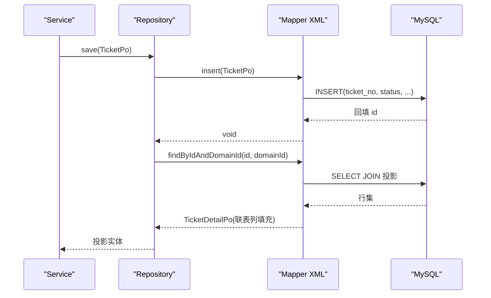
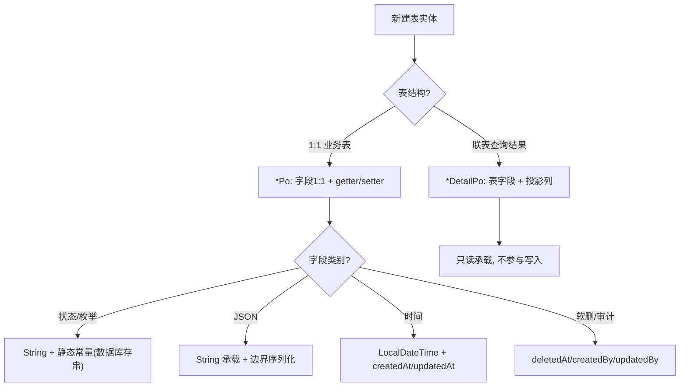
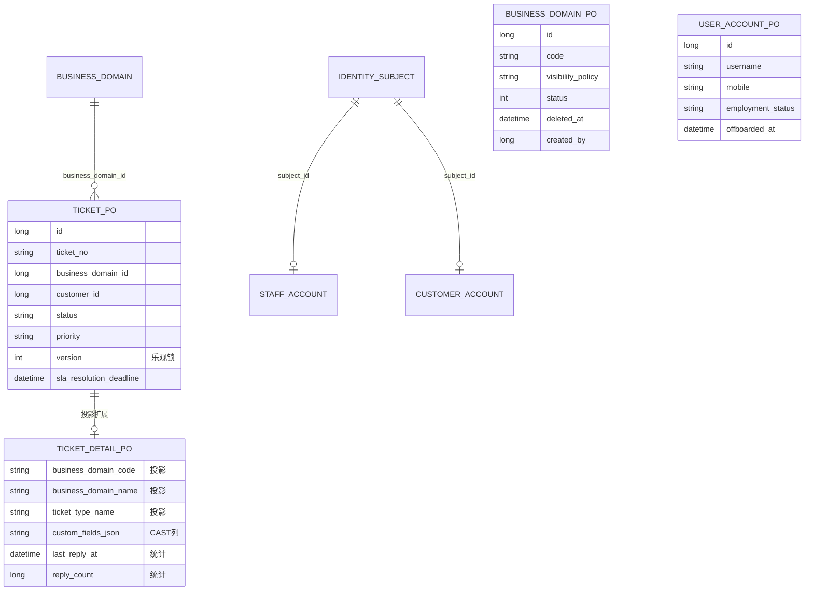
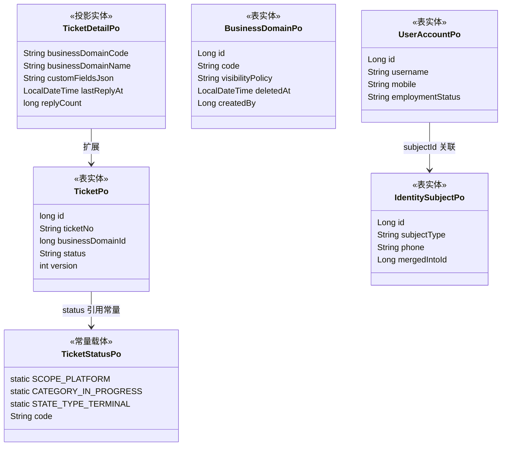

<cite>
- [UnionDesk/uniondesk-ticket/src/main/java/com/uniondesk/ticket/entity/TicketPo.java](file://UnionDesk/uniondesk-ticket/src/main/java/com/uniondesk/ticket/entity/TicketPo.java#L5-L31)
- [UnionDesk/uniondesk-ticket/src/main/java/com/uniondesk/ticket/entity/TicketDetailPo.java](file://UnionDesk/uniondesk-ticket/src/main/java/com/uniondesk/ticket/entity/TicketDetailPo.java#L5-L35)
- [UnionDesk/uniondesk-ticket/src/main/java/com/uniondesk/ticket/entity/TicketStatusPo.java](file://UnionDesk/uniondesk-ticket/src/main/java/com/uniondesk/ticket/entity/TicketStatusPo.java#L5-L34)
- [UnionDesk/uniondesk-domain/src/main/java/com/uniondesk/domain/entity/BusinessDomainPo.java](file://UnionDesk/uniondesk-domain/src/main/java/com/uniondesk/domain/entity/BusinessDomainPo.java#L5-L24)
- [UnionDesk/uniondesk-iam/src/main/java/com/uniondesk/iam/entity/UserAccountPo.java](file://UnionDesk/uniondesk-iam/src/main/java/com/uniondesk/iam/entity/UserAccountPo.java#L5-L44)
- [UnionDesk/uniondesk-iam/src/main/java/com/uniondesk/iam/entity/StaffAccountPo.java](file://UnionDesk/uniondesk-iam/src/main/java/com/uniondesk/iam/entity/StaffAccountPo.java#L5-L56)
- [UnionDesk/uniondesk-support/src/main/java/com/uniondesk/audit/entity/AuditLogWritePo.java](file://UnionDesk/uniondesk-support/src/main/java/com/uniondesk/audit/entity/AuditLogWritePo.java#L3-L14)
- [UnionDesk/uniondesk-iam/src/main/java/com/uniondesk/iam/entity/IdentitySubjectPo.java](file://UnionDesk/uniondesk-iam/src/main/java/com/uniondesk/iam/entity/IdentitySubjectPo.java#L3-L21)
</cite>

# UnionDesk 实体模型

## 简介

本文档详解后端实体模型规范：`*Po` 实体的命名与职责、表字段映射约定（下划线 ↔ 驼峰）、时间字段/审计字段约定、枚举的字符串表示方式、投影 DTO（`*DetailPo`）的使用边界。实体是数据访问层与业务层之间的「语言」。

章节来源：
- [UnionDesk/uniondesk-ticket/src/main/java/com/uniondesk/ticket/entity/TicketPo.java](file://UnionDesk/uniondesk-ticket/src/main/java/com/uniondesk/ticket/entity/TicketPo.java#L5-L31)
- [UnionDesk/uniondesk-domain/src/main/java/com/uniondesk/domain/entity/BusinessDomainPo.java](file://UnionDesk/uniondesk-domain/src/main/java/com/uniondesk/domain/entity/BusinessDomainPo.java#L5-L24)

## 项目结构

实体分布在四个业务模块的 `entity` 包：

```mermaid
graph TB
    subgraph TIC["uniondesk-ticket/entity"]
        T1["TicketPo 工单"]
        T2["TicketDetailPo 投影"]
        T3["TicketStatusPo 状态"]
        T4["TicketReplyPo 回复"]
        T5["TicketTypePo 类型"]
    end
    subgraph DOM["uniondesk-domain/entity"]
        D1["BusinessDomainPo 业务域"]
        D2["DomainMemberPo 域成员"]
        D3["DomainRolePo 域角色"]
    end
    subgraph IAM["uniondesk-iam/entity"]
        I1["UserAccountPo 平台用户"]
        I2["StaffAccountPo 域员工"]
        I3["IdentitySubjectPo 身份主体"]
        I4["RolePo 角色"]
    end
    subgraph SUP["uniondesk-support/entity"]
        S1["AuditLogWritePo 审计写入"]
        S2["SlaRulePo SLA规则"]
        S3["FileAttachmentPo 附件"]
    end
    T1 --> T2 : 投影扩展
    I3 --> I1 & I2 : subject 关联
```

图表来源：
- [UnionDesk/uniondesk-ticket/src/main/java/com/uniondesk/ticket/entity/TicketPo.java](file://UnionDesk/uniondesk-ticket/src/main/java/com/uniondesk/ticket/entity/TicketPo.java#L5-L31)
- [UnionDesk/uniondesk-iam/src/main/java/com/uniondesk/iam/entity/IdentitySubjectPo.java](file://UnionDesk/uniondesk-iam/src/main/java/com/uniondesk/iam/entity/IdentitySubjectPo.java#L3-L21)

## 核心组件

**1. 表实体（*Po，表 1:1）**：
- `TicketPo`（L5-31）：工单表映射，21 个字段——标识（id/ticketNo）、归属（businessDomainId/customerId/ticketTypeId）、内容（title/description/customFields）、流转（status/priority/source/assignedTo）、并发（version）、SLA 组（sla* 7 字段）、时间（createdAt/updatedAt）。
- `BusinessDomainPo`（L5-24）：业务域映射，含审计字段（createdBy/updatedBy/creatorName/updaterName）与软删除（deletedAt）。
- `UserAccountPo`（L5-44）/`StaffAccountPo`（L5-56）：账号实体，含 `subjectId` 关联与 `employmentStatus/offboardedAt` 离职字段。
- `AuditLogWritePo`（L3-14）：审计写入实体（businessDomainId/operatorSubjectId/action/detail/requestId）。

**2. 投影 DTO（*DetailPo）**：`TicketDetailPo`（L5-35）在 `TicketPo` 基础上扩展联表列——`businessDomainCode/Name`（域名称）、`ticketTypeName`（类型名称）、`customFieldsJson`（CAST 后字符串）、`lastReplyAt/replyCount`（回复统计）、`breachActionJson`（SLA 违约动作）。

**3. 常量枚举载体**：`TicketStatusPo`（L5-34）以静态常量表达枚举语义——`SCOPE_PLATFORM/SCOPE_DOMAIN`、`CATEGORY_NOT_STARTED/CATEGORY_IN_PROGRESS/CATEGORY_COMPLETED`、`STATE_TYPE_IN_PROGRESS/PAUSED/TERMINAL`；数据库存字符串，Java 侧常量引用。

章节来源：
- [UnionDesk/uniondesk-ticket/src/main/java/com/uniondesk/ticket/entity/TicketPo.java](file://UnionDesk/uniondesk-ticket/src/main/java/com/uniondesk/ticket/entity/TicketPo.java#L5-L31)
- [UnionDesk/uniondesk-ticket/src/main/java/com/uniondesk/ticket/entity/TicketDetailPo.java](file://UnionDesk/uniondesk-ticket/src/main/java/com/uniondesk/ticket/entity/TicketDetailPo.java#L5-L35)
- [UnionDesk/uniondesk-ticket/src/main/java/com/uniondesk/ticket/entity/TicketStatusPo.java](file://UnionDesk/uniondesk-ticket/src/main/java/com/uniondesk/ticket/entity/TicketStatusPo.java#L5-L34)

## 架构总览

实体在读写链路上的流转：



图表来源：
- [UnionDesk/uniondesk-ticket/src/main/java/com/uniondesk/ticket/entity/TicketPo.java](file://UnionDesk/uniondesk-ticket/src/main/java/com/uniondesk/ticket/entity/TicketPo.java#L5-L31)
- [UnionDesk/uniondesk-ticket/src/main/java/com/uniondesk/ticket/entity/TicketDetailPo.java](file://UnionDesk/uniondesk-ticket/src/main/java/com/uniondesk/ticket/entity/TicketDetailPo.java#L5-L35)

## 详细分析

**实体模型设计细则**：

1. **命名约定**：实体类 `*Po` 后缀（Persistent Object），表名下划线 → 类名/属性驼峰（`business_domain_id` → `businessDomainId`）；MyBatis 开启驼峰映射，resultMap 显式映射兜底。
2. **字段类型约定**：ID 用 `long`（必填）或 `Long`（可空，如 `assignedTo` 未指派）；时间用 `LocalDateTime`；状态/枚举用 `String` + 常量（数据库存字符串便于可读与迁移）；布尔用 `boolean`（`TicketTypePo.system`）或 `Integer`（库 tinyint）。
3. **JSON 字段为 String**：`TicketPo.customFields`（String）对应库 JSON 列，写库前 Service 序列化、读库后 `CAST AS CHAR` 反序列化（`TicketDetailPo.customFieldsJson`）——实体不引入 JSON 类型，序列化在边界完成。
4. **审计与生命周期字段**：通用「createdAt/updatedAt」；业务域级实体加 `createdBy/updatedBy`（含冗余名称 `creatorName/updaterName` 供列表展示）；软删除 `deletedAt`；账号实体加 `employmentStatus/offboardedAt/offboardedBy/offboardReason`。
5. **投影实体使用边界**：`*DetailPo` 只用于「查询结果承载」，不参与写入（写入用表实体）；投影字段（联表名、统计数）是冗余只读，不落库。
6. **实体纯净性**：实体类只含字段 + getter/setter，无业务方法、无继承；业务常量（如 `TicketStatusPo` 的状态类别）作为静态常量挂在相关实体上就近引用。
7. **身份关联**：账号实体持 `subjectId`（`StaffAccountPo`/`CustomerAccountPo` 1:1 关联 `IdentitySubjectPo`），身份主体承载 `subjectType/phone/mergedIntoId`（账号合并锚点）。



图表来源：
- [UnionDesk/uniondesk-ticket/src/main/java/com/uniondesk/ticket/entity/TicketPo.java](file://UnionDesk/uniondesk-ticket/src/main/java/com/uniondesk/ticket/entity/TicketPo.java#L5-L31)
- [UnionDesk/uniondesk-domain/src/main/java/com/uniondesk/domain/entity/BusinessDomainPo.java](file://UnionDesk/uniondesk-domain/src/main/java/com/uniondesk/domain/entity/BusinessDomainPo.java#L5-L24)
- [UnionDesk/uniondesk-ticket/src/main/java/com/uniondesk/ticket/entity/TicketStatusPo.java](file://UnionDesk/uniondesk-ticket/src/main/java/com/uniondesk/ticket/entity/TicketStatusPo.java#L7-L16)

## 数据模型

实体与表的关系：



图表来源：
- [UnionDesk/uniondesk-ticket/src/main/java/com/uniondesk/ticket/entity/TicketPo.java](file://UnionDesk/uniondesk-ticket/src/main/java/com/uniondesk/ticket/entity/TicketPo.java#L5-L31)
- [UnionDesk/uniondesk-ticket/src/main/java/com/uniondesk/ticket/entity/TicketDetailPo.java](file://UnionDesk/uniondesk-ticket/src/main/java/com/uniondesk/ticket/entity/TicketDetailPo.java#L5-L35)
- [UnionDesk/uniondesk-iam/src/main/java/com/uniondesk/iam/entity/UserAccountPo.java](file://UnionDesk/uniondesk-iam/src/main/java/com/uniondesk/iam/entity/UserAccountPo.java#L5-L44)

## 依赖关系分析



图表来源：
- [UnionDesk/uniondesk-ticket/src/main/java/com/uniondesk/ticket/entity/TicketPo.java](file://UnionDesk/uniondesk-ticket/src/main/java/com/uniondesk/ticket/entity/TicketPo.java#L5-L31)
- [UnionDesk/uniondesk-ticket/src/main/java/com/uniondesk/ticket/entity/TicketStatusPo.java](file://UnionDesk/uniondesk-ticket/src/main/java/com/uniondesk/ticket/entity/TicketStatusPo.java#L5-L34)
- [UnionDesk/uniondesk-iam/src/main/java/com/uniondesk/iam/entity/IdentitySubjectPo.java](file://UnionDesk/uniondesk-iam/src/main/java/com/uniondesk/iam/entity/IdentitySubjectPo.java#L3-L21)

## 性能与安全考虑

- **性能**：投影实体只取页面所需列（`TicketDetailPo` 无 description 大字段时可省流）；CAST JSON 在 SQL 层完成避免重复转换；统计列（replyCount）由子查询聚合避免二次查询。
- **安全**：实体不含敏感明文（密码只存 `passwordHash`）；审计实体（`AuditLogWritePo`）语义化字段支撑追溯；软删除字段保证数据可恢复。
- **一致性**：实体与表字段强一致（表结构变更须同步实体）；常量集中在实体类避免字符串散落导致状态漂移。
- **可维护性**：实体纯净（无业务逻辑）使序列化/缓存/比较安全；投影实体只读约束防误写。

章节来源：
- [UnionDesk/uniondesk-ticket/src/main/java/com/uniondesk/ticket/entity/TicketDetailPo.java](file://UnionDesk/uniondesk-ticket/src/main/java/com/uniondesk/ticket/entity/TicketDetailPo.java#L5-L35)
- [UnionDesk/uniondesk-support/src/main/java/com/uniondesk/audit/entity/AuditLogWritePo.java](file://UnionDesk/uniondesk-support/src/main/java/com/uniondesk/audit/entity/AuditLogWritePo.java#L3-L14)

## 故障排查指南

| 现象 | 原因 | 处理建议 |
| --- | --- | --- |
| 查询结果字段为 null | resultMap 列名与属性不匹配（下划线/驼峰） | 核对 `column` 与 `property`；确认驼峰映射开关 |
| 写入时报 SQL 列不存在 | 实体新增字段但表无对应列 | 先走 Flyway 迁移加列，再同步实体（禁止反向） |
| JSON 字段读出来是字符串而非对象 | 实体字段为 String + CAST 传输 | 用 ObjectMapper 在 Service 边界反序列化 |
| 状态比较总是失败 | 字符串字面量 vs 实体常量不一致 | 统一引用 `TicketStatusPo` 常量，禁止手写字面量 |
| 投影实体被误写 | 开发把 `*DetailPo` 当写入实体 | 写入必须用表实体 `*Po`；投影实体只读 |

章节来源：
- [UnionDesk/uniondesk-ticket/src/main/java/com/uniondesk/ticket/entity/TicketPo.java](file://UnionDesk/uniondesk-ticket/src/main/java/com/uniondesk/ticket/entity/TicketPo.java#L5-L31)
- [UnionDesk/uniondesk-ticket/src/main/java/com/uniondesk/ticket/entity/TicketStatusPo.java](file://UnionDesk/uniondesk-ticket/src/main/java/com/uniondesk/ticket/entity/TicketStatusPo.java#L7-L16)

## 结论

实体模型规范的核心是「**表实体 1:1、投影实体只读、枚举字符串化、审计字段内置**」：`*Po` 与表结构严格对齐并承载业务常量，`*DetailPo` 按需投影联表结果，状态枚举以字符串 + 静态常量表达，时间/审计/软删字段统一约定。实体是 Mapper 与 Service 的共享语言，保持其纯净与一致是数据层稳定性的前提。

章节来源：
- [UnionDesk/uniondesk-ticket/src/main/java/com/uniondesk/ticket/entity/TicketPo.java](file://UnionDesk/uniondesk-ticket/src/main/java/com/uniondesk/ticket/entity/TicketPo.java#L5-L31)
- [UnionDesk/uniondesk-domain/src/main/java/com/uniondesk/domain/entity/BusinessDomainPo.java](file://UnionDesk/uniondesk-domain/src/main/java/com/uniondesk/domain/entity/BusinessDomainPo.java#L5-L24)

## 附录

实体定义模板：

```java
// 表实体模板（1:1 映射 + 常量 + 审计字段）
public class DemoPo {
    // 业务常量（枚举字符串化）
    public static final String STATUS_ACTIVE = "active";
    public static final String STATUS_DISABLED = "disabled";

    private Long id;
    private String code;
    private String status;
    private LocalDateTime createdAt;
    private LocalDateTime updatedAt;
    private Long createdBy;
    private Long updatedBy;
    private LocalDateTime deletedAt;

    // getter/setter 略（与字段一一对应）
}
```

```java
// 投影实体模板（联表列 + 统计列，只读）
public class DemoDetailPo extends 不继承 {
    private String domainName;      // JOIN 投影
    private String creatorName;     // 审计冗余名
    private long replyCount;        // 子查询统计
    // getter/setter 略
}
```

章节来源：
- [UnionDesk/uniondesk-ticket/src/main/java/com/uniondesk/ticket/entity/TicketPo.java](file://UnionDesk/uniondesk-ticket/src/main/java/com/uniondesk/ticket/entity/TicketPo.java#L5-L31)
- [UnionDesk/uniondesk-domain/src/main/java/com/uniondesk/domain/entity/BusinessDomainPo.java](file://UnionDesk/uniondesk-domain/src/main/java/com/uniondesk/domain/entity/BusinessDomainPo.java#L5-L24)
- [UnionDesk/uniondesk-ticket/src/main/java/com/uniondesk/ticket/entity/TicketDetailPo.java](file://UnionDesk/uniondesk-ticket/src/main/java/com/uniondesk/ticket/entity/TicketDetailPo.java#L5-L35)
