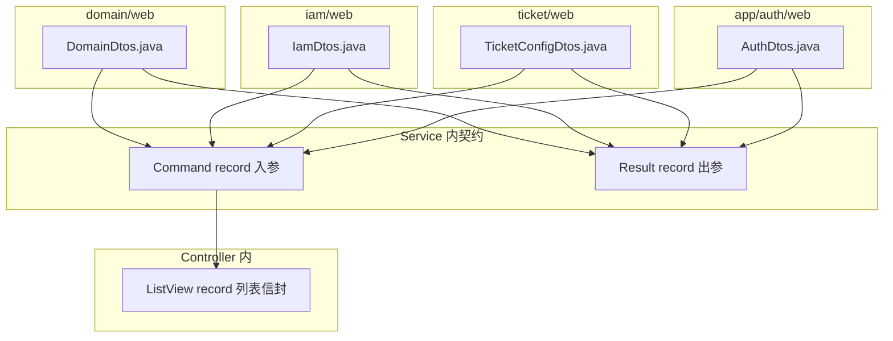
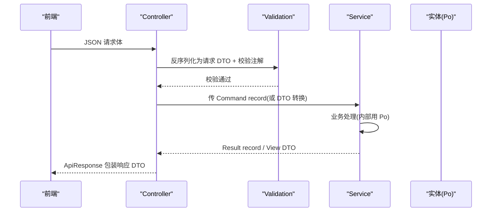
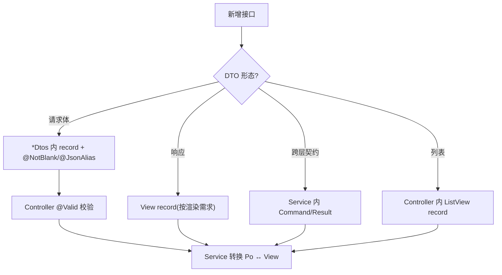
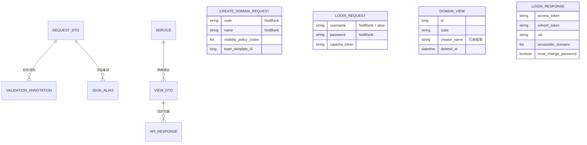
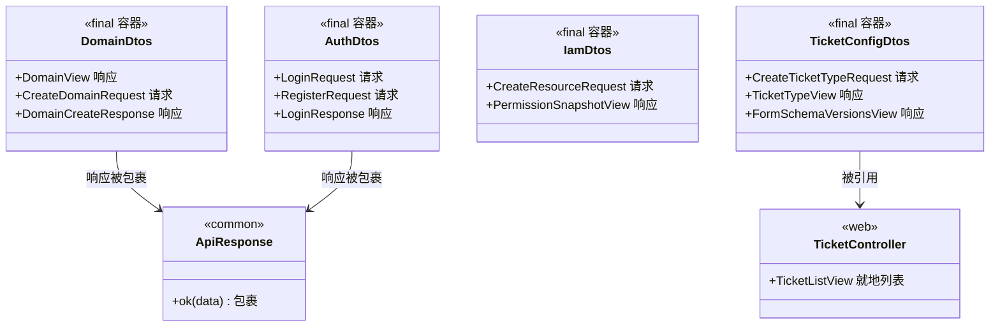

<cite>
- [UnionDesk/uniondesk-domain/src/main/java/com/uniondesk/domain/web/DomainDtos.java](file://UnionDesk/uniondesk-domain/src/main/java/com/uniondesk/domain/web/DomainDtos.java#L7-L62)
- [UnionDesk/uniondesk-app/src/main/java/com/uniondesk/auth/web/AuthDtos.java](file://UnionDesk/uniondesk-app/src/main/java/com/uniondesk/auth/web/AuthDtos.java#L11-L44)
- [UnionDesk/uniondesk-app/src/main/java/com/uniondesk/auth/web/AuthDtos.java](file://UnionDesk/uniondesk-app/src/main/java/com/uniondesk/auth/web/AuthDtos.java#L46-L102)
- [UnionDesk/uniondesk-iam/src/main/java/com/uniondesk/iam/web/IamDtos.java](file://UnionDesk/uniondesk-iam/src/main/java/com/uniondesk/iam/web/IamDtos.java#L8-L78)
- [UnionDesk/uniondesk-ticket/src/main/java/com/uniondesk/ticket/web/TicketConfigDtos.java](file://UnionDesk/uniondesk-ticket/src/main/java/com/uniondesk/ticket/web/TicketConfigDtos.java#L7-L78)
- [UnionDesk/uniondesk-ticket/src/main/java/com/uniondesk/ticket/web/TicketController.java](file://UnionDesk/uniondesk-ticket/src/main/java/com/uniondesk/ticket/web/TicketController.java#L28-L30)
- [UnionDesk/uniondesk-common/src/main/java/com/uniondesk/common/web/ApiResponse.java](file://UnionDesk/uniondesk-common/src/main/java/com/uniondesk/common/web/ApiResponse.java#L3-L16)
</cite>

# UnionDesk 数据传输对象

## 简介

本文档详解后端 DTO（Data Transfer Object）设计规范：`*Dtos.java` 文件的组织方式、请求/响应 DTO 的 record 定义、jakarta validation 校验注解、`@JsonAlias` 字段兼容、DTO 与实体的转换约定、Controller 与 Service 间的传参（Service 内 Command/Result record）。DTO 是接口层与业务层之间的「协议」。

章节来源：
- [UnionDesk/uniondesk-domain/src/main/java/com/uniondesk/domain/web/DomainDtos.java](file://UnionDesk/uniondesk-domain/src/main/java/com/uniondesk/domain/web/DomainDtos.java#L7-L62)
- [UnionDesk/uniondesk-app/src/main/java/com/uniondesk/auth/web/AuthDtos.java](file://UnionDesk/uniondesk-app/src/main/java/com/uniondesk/auth/web/AuthDtos.java#L11-L27)

## 项目结构

DTO 在模块 `web` 包中的组织：



图表来源：
- [UnionDesk/uniondesk-domain/src/main/java/com/uniondesk/domain/web/DomainDtos.java](file://UnionDesk/uniondesk-domain/src/main/java/com/uniondesk/domain/web/DomainDtos.java#L7-L62)
- [UnionDesk/uniondesk-ticket/src/main/java/com/uniondesk/ticket/web/TicketController.java](file://UnionDesk/uniondesk-ticket/src/main/java/com/uniondesk/ticket/web/TicketController.java#L28-L30)

## 核心组件

**1. Dtos 容器类（final + 私有构造）**：`DomainDtos`（L7-10）、`AuthDtos`（L11-14）、`IamDtos`（L8-11）、`TicketConfigDtos`（L7-10）均为 `public final class` + 私有构造器——纯命名空间，内部嵌套 record。

**2. 请求 DTO（带校验注解）**：
- `CreateDomainRequest`（DomainDtos L38-47）：`@NotBlank code/name` 必填，可选字段无注解。
- `LoginRequest`（AuthDtos L16-27）：`@NotBlank username/password` + `@JsonAlias` 兼容旧字段名（identifier/loginName/login_name/captcha_token/portal_type）。
- `RegisterRequest`（L29-38）：`@NotBlank loginName/password/phone` + `@JsonAlias` 别名。
- `CreateResourceRequest`（IamDtos L13-26）：`@NotBlank` 四个必填 + 可选配置字段。

**3. 响应 DTO（View record）**：`DomainView`（L12-29，含审计字段与 creator_name 冗余名）、`DomainBriefView`（L31-36，精简列表）、`LoginResponse`（AuthDtos L85-102，含 token/sid/role/domains 全量登录态）、`PermissionSnapshotView`（IamDtos L63-71，菜单树+动作+域）、`TicketTypeView`（TicketConfigDtos L12-28，含 status_flow/form_schema 快照）。

**4. 校验注解**：`@NotBlank`（字符串非空）、`@NotNull`（对象非空）、`@NotEmpty`（集合非空）、`@Valid`（嵌套校验，TicketConfigDtos L3/L30）。

**5. Service 内契约 record**：`CreateTicketCommand`/`TicketSubmissionResult`（TicketService 内）——跨 Controller↔Service 传参直接复用，Controller 方法签名即 Service 契约（见 MVC 总览）。

**6. Controller 内列表信封**：`TicketListView(total, items)`（TicketController L28-30）——模块内一次性列表响应，不再单独建 DTO 文件。

章节来源：
- [UnionDesk/uniondesk-domain/src/main/java/com/uniondesk/domain/web/DomainDtos.java](file://UnionDesk/uniondesk-domain/src/main/java/com/uniondesk/domain/web/DomainDtos.java#L38-L61)
- [UnionDesk/uniondesk-app/src/main/java/com/uniondesk/auth/web/AuthDtos.java](file://UnionDesk/uniondesk-app/src/main/java/com/uniondesk/auth/web/AuthDtos.java#L16-L44)
- [UnionDesk/uniondesk-iam/src/main/java/com/uniondesk/iam/web/IamDtos.java](file://UnionDesk/uniondesk-iam/src/main/java/com/uniondesk/iam/web/IamDtos.java#L13-L71)

## 架构总览

DTO 在请求/响应链路上的位置：



图表来源：
- [UnionDesk/uniondesk-app/src/main/java/com/uniondesk/auth/web/AuthDtos.java](file://UnionDesk/uniondesk-app/src/main/java/com/uniondesk/auth/web/AuthDtos.java#L16-L27)
- [UnionDesk/uniondesk-domain/src/main/java/com/uniondesk/domain/web/DomainDtos.java](file://UnionDesk/uniondesk-domain/src/main/java/com/uniondesk/domain/web/DomainDtos.java#L12-L29)

## 详细分析

**DTO 设计细则**：

1. **按场景分层定义**：跨模块契约（请求/响应）定义在 `web/*Dtos.java`；Controller↔Service 用例级契约用 Service 内 record（Command/Result）；一次性列表信封就地定义在 Controller。原则：**能用 record 就地就不单独建文件**（对应 AGENTS.md §2.5）。
2. **字段命名兼容双轨**：`@JsonAlias` 让新旧字段名共存——`LoginRequest.username` 接受 `identifier/loginName/login_name`（L16-23）；`RegisterRequest.domainId` 接受 `domain_id`（L35）；`LoginResponse.riskLoginNotified` 接受 `risk_login_notified`（L99-100）——序列化名与内部名解耦，前端 snake_case 兼容后端 camelCase。
3. **校验前置**：请求 DTO 的校验注解在 `@Valid` 触发下由 Spring 执行，失败走 `MethodArgumentNotValidException → VALIDATION_ERROR(40001)`（见统一响应格式）；`@NotEmpty List<@NotBlank String>` 支持集合元素校验（TicketConfigDtos L41-43）。
4. **响应 DTO 即视图模型**：`DomainView` 直接承载联表冗余（`creator_name/updater_name`）、`PermissionSnapshotView` 聚合菜单树+动作+域——响应结构完全按前端渲染需求设计，不泄露 Po 结构。
5. **DTO ↔ 实体转换**：Service 层完成转换（如 `DomainService.toDomainView(po)`，见 Service 层设计）；响应 DTO 不直接引用 Po 字段（如 `TicketTypeView` 的 `form_schema_current_version_no` 由 Service 组装）。
6. **可空与默认值**：可选字段不加注解（可为 null）；分页参数默认值在 Controller `@RequestParam(defaultValue=...)` 归一化（TicketController L87-88）。



图表来源：
- [UnionDesk/uniondesk-domain/src/main/java/com/uniondesk/domain/web/DomainDtos.java](file://UnionDesk/uniondesk-domain/src/main/java/com/uniondesk/domain/web/DomainDtos.java#L7-L62)
- [UnionDesk/uniondesk-app/src/main/java/com/uniondesk/auth/web/AuthDtos.java](file://UnionDesk/uniondesk-app/src/main/java/com/uniondesk/auth/web/AuthDtos.java#L85-L102)

## 数据模型

DTO 与实体/信封的关系：



图表来源：
- [UnionDesk/uniondesk-domain/src/main/java/com/uniondesk/domain/web/DomainDtos.java](file://UnionDesk/uniondesk-domain/src/main/java/com/uniondesk/domain/web/DomainDtos.java#L12-L47)
- [UnionDesk/uniondesk-app/src/main/java/com/uniondesk/auth/web/AuthDtos.java](file://UnionDesk/uniondesk-app/src/main/java/com/uniondesk/auth/web/AuthDtos.java#L85-L102)

## 依赖关系分析



图表来源：
- [UnionDesk/uniondesk-domain/src/main/java/com/uniondesk/domain/web/DomainDtos.java](file://UnionDesk/uniondesk-domain/src/main/java/com/uniondesk/domain/web/DomainDtos.java#L7-L62)
- [UnionDesk/uniondesk-ticket/src/main/java/com/uniondesk/ticket/web/TicketController.java](file://UnionDesk/uniondesk-ticket/src/main/java/com/uniondesk/ticket/web/TicketController.java#L28-L30)

## 性能与安全考虑

- **性能**：响应 DTO 按渲染需求瘦身（`DomainBriefView` 只 4 字段）；嵌套校验只在必要时用 `@Valid`；JSON 反序列化在边界一次完成。
- **安全**：请求 DTO 不暴露内部字段（不引用 Po）；`@JsonAlias` 兼容字段不增加攻击面（仍受校验注解约束）；响应 DTO 只含必要字段防数据泄露（如 `UserView` 只 username/mobile/email，不含 password_hash）。
- **兼容性**：`@JsonAlias` 支持前后端字段名演进而不破坏旧客户端；record 不可变保证线程安全。
- **一致性**：校验注解集中在请求 DTO，错误统一 `40001`；响应结构稳定（View record 不随表结构变化）。

章节来源：
- [UnionDesk/uniondesk-iam/src/main/java/com/uniondesk/iam/web/IamDtos.java](file://UnionDesk/uniondesk-iam/src/main/java/com/uniondesk/iam/web/IamDtos.java#L73-L78)（UserView 最小化）
- [UnionDesk/uniondesk-app/src/main/java/com/uniondesk/auth/web/AuthDtos.java](file://UnionDesk/uniondesk-app/src/main/java/com/uniondesk/auth/web/AuthDtos.java#L16-L23)（@JsonAlias）

## 故障排查指南

| 现象 | 原因 | 处理建议 |
| --- | --- | --- |
| 请求字段传了但后端为 null | 字段名不匹配且无 `@JsonAlias` | 对照 DTO 字段名与前端传参；补充 `@JsonAlias` |
| 必填未传却未报校验错 | 请求 DTO 缺校验注解或 Controller 缺 `@Valid` | 给字段加 `@NotBlank` 等；确认 `@Valid @RequestBody` |
| 响应多出内部字段 | 直接返回了 Po 实体而非 View DTO | Controller/Service 返回 View record，禁止 Po 出层 |
| 兼容旧客户端失败 | 新字段替换了旧字段名且未加别名 | 保留 `@JsonAlias` 旧名 |
| 嵌套对象校验不生效 | 嵌套 DTO 缺 `@Valid` | 在字段上标 `@Valid`（如 `List<@NotBlank String>` 或对象字段） |

章节来源：
- [UnionDesk/uniondesk-app/src/main/java/com/uniondesk/auth/web/AuthDtos.java](file://UnionDesk/uniondesk-app/src/main/java/com/uniondesk/auth/web/AuthDtos.java#L16-L27)
- [UnionDesk/uniondesk-ticket/src/main/java/com/uniondesk/ticket/web/TicketConfigDtos.java](file://UnionDesk/uniondesk-ticket/src/main/java/com/uniondesk/ticket/web/TicketConfigDtos.java#L41-L43)

## 结论

DTO 设计遵循「**容器收口、record 轻量、校验前置、别名兼容、视图化响应**」：`*Dtos.java` 容器类集中定义请求/响应 record，校验注解在边界拦截非法输入，`@JsonAlias` 平滑字段演进，View DTO 按前端渲染需求组装（含冗余投影），用例级契约用 Service 内 Command/Result 就地承载。DTO 层是接口稳定性与内部演进的缓冲带。

章节来源：
- [UnionDesk/uniondesk-domain/src/main/java/com/uniondesk/domain/web/DomainDtos.java](file://UnionDesk/uniondesk-domain/src/main/java/com/uniondesk/domain/web/DomainDtos.java#L7-L62)
- [UnionDesk/uniondesk-app/src/main/java/com/uniondesk/auth/web/AuthDtos.java](file://UnionDesk/uniondesk-app/src/main/java/com/uniondesk/auth/web/AuthDtos.java#L11-L102)

## 附录

DTO 定义模板：

```java
// 1. 容器类 + 请求 DTO（校验 + 别名）
public final class DemoDtos {

    private DemoDtos() {
    }

    public record CreateDemoRequest(
            @JsonAlias({"name", "demo_name"}) @NotBlank String name,
            @JsonAlias({"domain_id"}) @NotNull Long domainId,
            String remark) {
    }

    public record DemoView(
            long id,
            String name,
            String domainName,
            String createdAt) {
    }
}
```

```java
// 2. Controller 使用（@Valid + 别名兼容 + 自动包装）
@PostMapping("/domains/{domain_id}/demos")
@RequirePermission(value = PermissionCodes.DEMO_CREATE, domainIdParam = "domain_id")
public DemoDtos.DemoView create(
        @PathVariable("domain_id") long domainId,
        @Valid @RequestBody DemoDtos.CreateDemoRequest request) {
    return demoService.create(domainId, request);
}
```

章节来源：
- [UnionDesk/uniondesk-domain/src/main/java/com/uniondesk/domain/web/DomainDtos.java](file://UnionDesk/uniondesk-domain/src/main/java/com/uniondesk/domain/web/DomainDtos.java#L38-L47)
- [UnionDesk/uniondesk-app/src/main/java/com/uniondesk/auth/web/AuthDtos.java](file://UnionDesk/uniondesk-app/src/main/java/com/uniondesk/auth/web/AuthDtos.java#L16-L27)
- [UnionDesk/uniondesk-common/src/main/java/com/uniondesk/common/web/ApiResponse.java](file://UnionDesk/uniondesk-common/src/main/java/com/uniondesk/common/web/ApiResponse.java#L3-L16)
