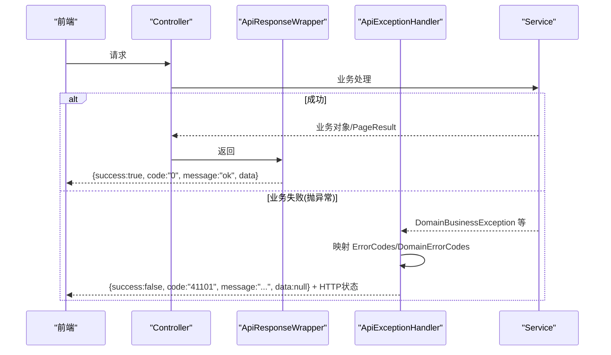
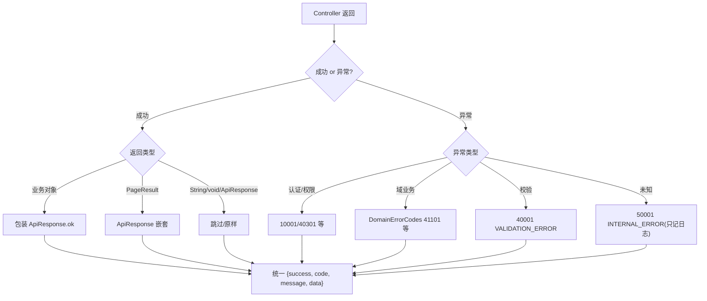
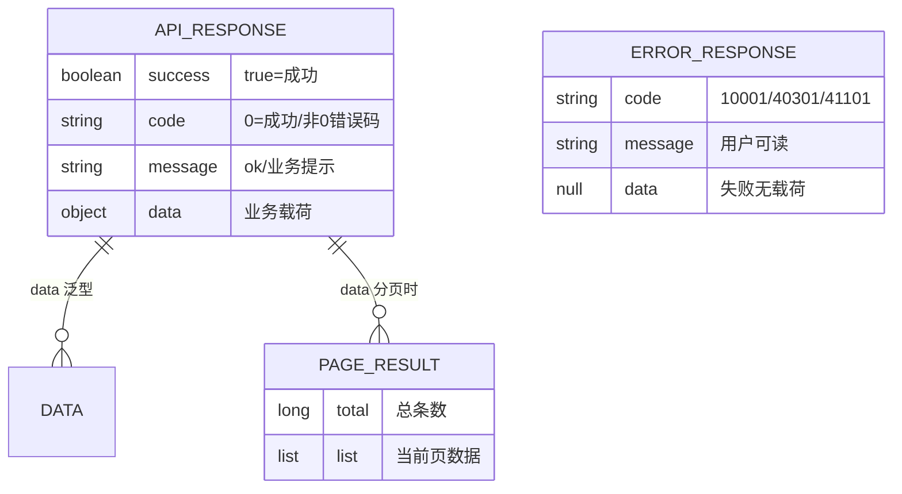
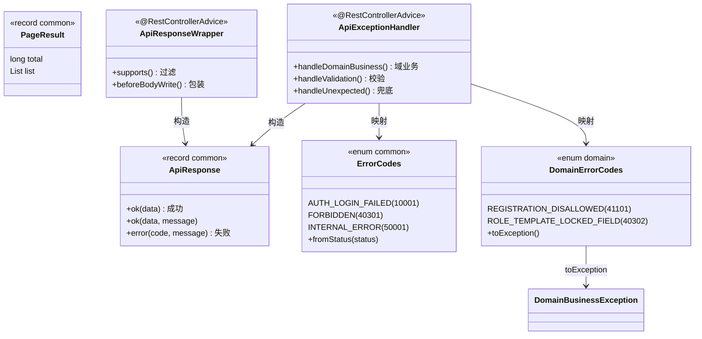

<cite>
- [UnionDesk/uniondesk-common/src/main/java/com/uniondesk/common/web/ApiResponse.java](file://UnionDesk/uniondesk-common/src/main/java/com/uniondesk/common/web/ApiResponse.java#L3-L16)
- [UnionDesk/uniondesk-common/src/main/java/com/uniondesk/common/web/PageResult.java](file://UnionDesk/uniondesk-common/src/main/java/com/uniondesk/common/web/PageResult.java#L1-L6)
- [UnionDesk/uniondesk-common/src/main/java/com/uniondesk/common/web/ErrorCodes.java](file://UnionDesk/uniondesk-common/src/main/java/com/uniondesk/common/web/ErrorCodes.java#L6-L19)
- [UnionDesk/uniondesk-common/src/main/java/com/uniondesk/common/web/ErrorCodes.java](file://UnionDesk/uniondesk-common/src/main/java/com/uniondesk/common/web/ErrorCodes.java#L43-L53)
- [UnionDesk/uniondesk-app/src/main/java/com/uniondesk/common/web/ApiResponseWrapper.java](file://UnionDesk/uniondesk-app/src/main/java/com/uniondesk/common/web/ApiResponseWrapper.java#L10-L53)
- [UnionDesk/uniondesk-app/src/main/java/com/uniondesk/common/web/ApiExceptionHandler.java](file://UnionDesk/uniondesk-app/src/main/java/com/uniondesk/common/web/ApiExceptionHandler.java#L20-L85)
- [UnionDesk/uniondesk-app/src/main/java/com/uniondesk/common/web/ApiExceptionHandler.java](file://UnionDesk/uniondesk-app/src/main/java/com/uniondesk/common/web/ApiExceptionHandler.java#L87-L108)
- [UnionDesk/uniondesk-domain/src/main/java/com/uniondesk/domain/core/DomainErrorCodes.java](file://UnionDesk/uniondesk-domain/src/main/java/com/uniondesk/domain/core/DomainErrorCodes.java#L8-L44)
</cite>

# UnionDesk 统一响应格式

## 简介

本文档详解后端对外响应格式的统一规范：`ApiResponse` 信封（success/code/message/data）、`PageResult` 分页结构（total/list）、`ErrorCodes`/`DomainErrorCodes` 错误码体系、`ApiResponseWrapper` 自动包装、`ApiExceptionHandler` 异常处理链。所有接口（成功与失败）共享同一响应结构，前端只需一套解包逻辑。

章节来源：
- [UnionDesk/uniondesk-common/src/main/java/com/uniondesk/common/web/ApiResponse.java](file://UnionDesk/uniondesk-common/src/main/java/com/uniondesk/common/web/ApiResponse.java#L3-L16)
- [UnionDesk/uniondesk-common/src/main/java/com/uniondesk/common/web/PageResult.java](file://UnionDesk/uniondesk-common/src/main/java/com/uniondesk/common/web/PageResult.java#L1-L6)

## 项目结构

响应格式体系的组件分布：

```mermaid
graph TB
    subgraph COMMON["uniondesk-common"]
        AR["ApiResponse 信封"]
        PR["PageResult 分页"]
        EC["ErrorCodes 通用错误码"]
    end
    subgraph APP["uniondesk-app"]
        W["ApiResponseWrapper<br/>自动包装"]
        EH["ApiExceptionHandler<br/>异常处理链"]
    end
    subgraph DOM["uniondesk-domain"]
        DEC["DomainErrorCodes 域错误码"]
        DBEX["DomainBusinessException"]
    end
    subgraph FE["前端"]
        UNWRAP["API 层统一解包"]
    end
    W --> AR : 构造
    EH --> AR : 构造
    EH --> EC : 映射
    EH --> DEC : 映射
    AR --> FE : 传输
    PR --> FE : 列表解包{total,items}
```

图表来源：
- [UnionDesk/uniondesk-common/src/main/java/com/uniondesk/common/web/ApiResponse.java](file://UnionDesk/uniondesk-common/src/main/java/com/uniondesk/common/web/ApiResponse.java#L3-L16)
- [UnionDesk/uniondesk-app/src/main/java/com/uniondesk/common/web/ApiResponseWrapper.java](file://UnionDesk/uniondesk-app/src/main/java/com/uniondesk/common/web/ApiResponseWrapper.java#L10-L22)

## 核心组件

**1. ApiResponse 信封（common）**：`record ApiResponse<T>(boolean success, String code, String message, T data)`（L3-16）；`ok(data)` 成功（code="0"）、`ok(data, message)` 带消息成功、`error(code, message)` 失败。**code="0" 表示成功**，非 0 为错误码。

**2. PageResult 分页（common）**：`record PageResult<T>(long total, List<T> list)`（L1-6）；与 `ApiResponse` 嵌套使用：`ApiResponse<PageResult<T>>`。

**3. ErrorCodes 通用错误码（common）**：枚举绑定 `code/message/HttpStatus` 三要素（L6-19）：`AUTH_LOGIN_FAILED(10001)`、`AUTH_ACCOUNT_DISABLED(10004)`、`AUTH_NO_ACCESSIBLE_DOMAIN(10005)`、`AUTH_CAPTCHA_FAILED(10003)`、`UNAUTHORIZED(40101)`、`FORBIDDEN(40301)`、`NOT_FOUND(40401)`、`VALIDATION_ERROR(40001)`、`BAD_REQUEST(40002)`、`INTERNAL_ERROR(50001)`；`fromStatus(HttpStatusCode)` 由 HTTP 状态反查错误码（L43-53）。

**4. DomainErrorCodes 域错误码（domain）**：业务域模块专属（L8-44）：`REGISTRATION_DISALLOWED(41101)`、`INVITATION_DISALLOWED(41102)`、`ROLE_TEMPLATE_LOCKED_FIELD(40302)`；`toException()` 快捷构造 `DomainBusinessException`。

**5. ApiResponseWrapper 自动包装（app）**：`@RestControllerAdvice` + `ResponseBodyAdvice`（L21-22）；跳过 `void`/`ApiResponse` 子类型/`String`（L24-39）；其余对象包为 `ApiResponse.ok(body)`（L41-52）。

**6. ApiExceptionHandler 异常链（app）**：按异常类型映射（L25-76）：认证失败/账号访问/验证码/域业务/非法参数（消息嗅探 L87-108）/ResponseStatus/校验失败/数据访问/兜底 Exception；统一产出 `ApiResponse.error` + HTTP 状态（L78-85）。

章节来源：
- [UnionDesk/uniondesk-common/src/main/java/com/uniondesk/common/web/ApiResponse.java](file://UnionDesk/uniondesk-common/src/main/java/com/uniondesk/common/web/ApiResponse.java#L3-L16)
- [UnionDesk/uniondesk-common/src/main/java/com/uniondesk/common/web/ErrorCodes.java](file://UnionDesk/uniondesk-common/src/main/java/com/uniondesk/common/web/ErrorCodes.java#L6-L19)
- [UnionDesk/uniondesk-domain/src/main/java/com/uniondesk/domain/core/DomainErrorCodes.java](file://UnionDesk/uniondesk-domain/src/main/java/com/uniondesk/domain/core/DomainErrorCodes.java#L8-L44)

## 架构总览

成功与失败响应的完整链路：



图表来源：
- [UnionDesk/uniondesk-app/src/main/java/com/uniondesk/common/web/ApiResponseWrapper.java](file://UnionDesk/uniondesk-app/src/main/java/com/uniondesk/common/web/ApiResponseWrapper.java#L41-L52)
- [UnionDesk/uniondesk-app/src/main/java/com/uniondesk/common/web/ApiExceptionHandler.java](file://UnionDesk/uniondesk-app/src/main/java/com/uniondesk/common/web/ApiExceptionHandler.java#L40-L45)

## 详细分析

**响应格式设计要点**：

1. **双轨状态**：HTTP 状态码表达传输语义（200/201/400/401/403/404/500），`code` 表达业务语义（10001/40301/41101…）——前端先按 `success` 分支，再按 `code` 细分错误处理。
2. **错误码分层**：通用错误码（`ErrorCodes`，认证/权限/校验/系统）在 common 供全模块复用；业务错误码（`DomainErrorCodes` 41101/41102 等）在各模块定义，携带专属消息；`DomainBusinessException` 携带 `errorCode()` 供处理器读取（L40-45）。
3. **自动包装规则**：Controller 返回任意业务对象自动包装；`ApiResponse` 子类型不二次包装（可手动控制）；`String` 跳过（防被当 JSON 文本）；`void` 配合 `@ResponseStatus` 表达 204。
4. **异常消息嗅探**：`resolveErrorCode`（L87-108）按消息关键词（not found/unauthorized/forbidden/required/captcha）映射错误码，`IllegalArgumentException` 的中文消息原样透出（L50-51）——非法参数可带业务提示。
5. **分页嵌套**：列表响应为 `ApiResponse<PageResult<T>>`，前端 API 层先解 `data` 再解 `{total, items}` 信封（见前端网络层文档）。
6. **兜底保护**：`DataAccessException`/未知 `Exception` 统一 `INTERNAL_ERROR(50001)` 且只记日志（L66-76），不泄露内部细节。



图表来源：
- [UnionDesk/uniondesk-app/src/main/java/com/uniondesk/common/web/ApiResponseWrapper.java](file://UnionDesk/uniondesk-app/src/main/java/com/uniondesk/common/web/ApiResponseWrapper.java#L24-L52)
- [UnionDesk/uniondesk-app/src/main/java/com/uniondesk/common/web/ApiExceptionHandler.java](file://UnionDesk/uniondesk-app/src/main/java/com/uniondesk/common/web/ApiExceptionHandler.java#L47-L76)

## 数据模型

响应格式的 JSON 结构：



图表来源：
- [UnionDesk/uniondesk-common/src/main/java/com/uniondesk/common/web/ApiResponse.java](file://UnionDesk/uniondesk-common/src/main/java/com/uniondesk/common/web/ApiResponse.java#L3-L16)
- [UnionDesk/uniondesk-common/src/main/java/com/uniondesk/common/web/PageResult.java](file://UnionDesk/uniondesk-common/src/main/java/com/uniondesk/common/web/PageResult.java#L1-L6)

## 依赖关系分析



图表来源：
- [UnionDesk/uniondesk-common/src/main/java/com/uniondesk/common/web/ApiResponse.java](file://UnionDesk/uniondesk-common/src/main/java/com/uniondesk/common/web/ApiResponse.java#L3-L16)
- [UnionDesk/uniondesk-common/src/main/java/com/uniondesk/common/web/ErrorCodes.java](file://UnionDesk/uniondesk-common/src/main/java/com/uniondesk/common/web/ErrorCodes.java#L43-L53)
- [UnionDesk/uniondesk-domain/src/main/java/com/uniondesk/domain/core/DomainErrorCodes.java](file://UnionDesk/uniondesk-domain/src/main/java/com/uniondesk/domain/core/DomainErrorCodes.java#L41-L44)

## 性能与安全考虑

- **性能**：`ResponseBodyAdvice` 在序列化前包装，无二次 IO；`PageResult` 只传当前页数据避免全量传输；错误响应 `data=null` 最小化载荷。
- **安全**：兜底异常只记日志不返回堆栈/内部信息（L66-76）；错误消息使用枚举预设文案，避免反射异常信息泄露；`AUTH_*` 错误码统一「用户名或密码错误」模糊化（10001）防账号枚举。
- **一致性**：成功 code 恒为 "0" 便于前端断言；分页信封结构稳定；错误码分层（通用/业务）防跨模块耦合。
- **可观测性**：`INTERNAL_ERROR` 记 error 日志含堆栈；`request_id` 在审计侧串联请求（AuditLogWritePo）。

章节来源：
- [UnionDesk/uniondesk-app/src/main/java/com/uniondesk/common/web/ApiExceptionHandler.java](file://UnionDesk/uniondesk-app/src/main/java/com/uniondesk/common/web/ApiExceptionHandler.java#L66-L76)
- [UnionDesk/uniondesk-common/src/main/java/com/uniondesk/common/web/ErrorCodes.java](file://UnionDesk/uniondesk-common/src/main/java/com/uniondesk/common/web/ErrorCodes.java#L7-L8)

## 故障排查指南

| 现象 | 原因 | 处理建议 |
| --- | --- | --- |
| 前端收到双重 data 嵌套 | Controller 返回 `ApiResponse` 又走了包装器（返回类型擦除） | 确认方法返回类型为 `ApiResponse` 子类型时包装器跳过；统一返回业务对象 |
| 错误码与 HTTP 状态不一致 | 手动 `ResponseEntity` 覆盖了处理器映射 | 统一抛异常走 `ApiExceptionHandler`，避免手写响应 |
| 校验失败返回 500 而非 40001 | `MethodArgumentNotValidException` 未被捕获（如嵌套对象校验） | 确认 `@Valid` 用法；检查异常类型是否为该处理器覆盖 |
| 业务提示不显示 | `IllegalArgumentException` 消息不含关键词被映射为 BAD_REQUEST 通用文案 | 用业务异常（DomainBusinessException）携带明确消息 |
| 分页 total 为 0 但 list 有值 | count/list 条件不一致 | 对照双查条件；用 `<sql>` 片段统一 |

章节来源：
- [UnionDesk/uniondesk-app/src/main/java/com/uniondesk/common/web/ApiExceptionHandler.java](file://UnionDesk/uniondesk-app/src/main/java/com/uniondesk/common/web/ApiExceptionHandler.java#L47-L54)
- [UnionDesk/uniondesk-app/src/main/java/com/uniondesk/common/web/ApiExceptionHandler.java](file://UnionDesk/uniondesk-app/src/main/java/com/uniondesk/common/web/ApiExceptionHandler.java#L61-L64)

## 结论

统一响应格式以「**单一信封、双轨状态、错误码分层、自动包装**」为原则：`ApiResponse` 是唯一对外结构（成功 code="0"），`PageResult` 统一分页，`ErrorCodes`（通用）+ `DomainErrorCodes`（业务）构成错误码体系，`ApiResponseWrapper` 自动包装 + `ApiExceptionHandler` 统一异常映射。前后端只需各维护一套解包/构造逻辑，新增接口零成本获得一致格式。

章节来源：
- [UnionDesk/uniondesk-common/src/main/java/com/uniondesk/common/web/ApiResponse.java](file://UnionDesk/uniondesk-common/src/main/java/com/uniondesk/common/web/ApiResponse.java#L3-L16)
- [UnionDesk/uniondesk-app/src/main/java/com/uniondesk/common/web/ApiResponseWrapper.java](file://UnionDesk/uniondesk-app/src/main/java/com/uniondesk/common/web/ApiResponseWrapper.java#L10-L21)

## 附录

响应格式示例：

```json
// 成功（单对象）
{
  "success": true,
  "code": "0",
  "message": "ok",
  "data": { "ticketId": 1001, "ticketNo": "TK202608130001" }
}

// 成功（分页）
{
  "success": true,
  "code": "0",
  "message": "ok",
  "data": { "total": 42, "list": [ { "id": 1001, "title": "..." } ] }
}

// 失败（域业务错误码）
{
  "success": false,
  "code": "41101",
  "message": "该业务域不允许自助注册",
  "data": null
}
```

后端构造代码：

```java
// Service 返回业务对象，Controller 不手动包装
return new PageResult<>(total, rows);   // 自动变为 ApiResponse<PageResult>

// 业务失败
throw DomainErrorCodes.REGISTRATION_DISALLOWED.toException();
// → ApiExceptionHandler → {success:false, code:"41101", ...} + HTTP 400
```

章节来源：
- [UnionDesk/uniondesk-common/src/main/java/com/uniondesk/common/web/ApiResponse.java](file://UnionDesk/uniondesk-common/src/main/java/com/uniondesk/common/web/ApiResponse.java#L3-L16)
- [UnionDesk/uniondesk-common/src/main/java/com/uniondesk/common/web/PageResult.java](file://UnionDesk/uniondesk-common/src/main/java/com/uniondesk/common/web/PageResult.java#L1-L6)
- [UnionDesk/uniondesk-domain/src/main/java/com/uniondesk/domain/core/DomainErrorCodes.java](file://UnionDesk/uniondesk-domain/src/main/java/com/uniondesk/domain/core/DomainErrorCodes.java#L41-L44)
