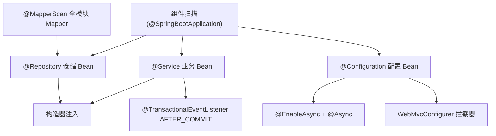
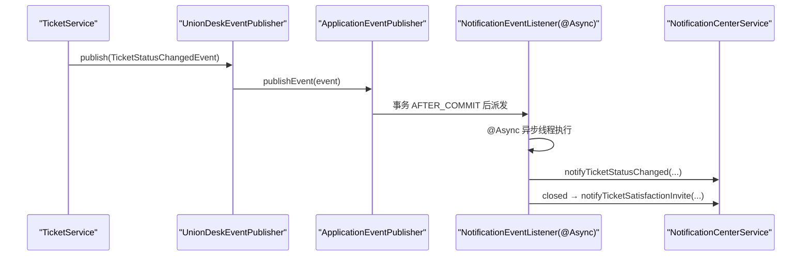
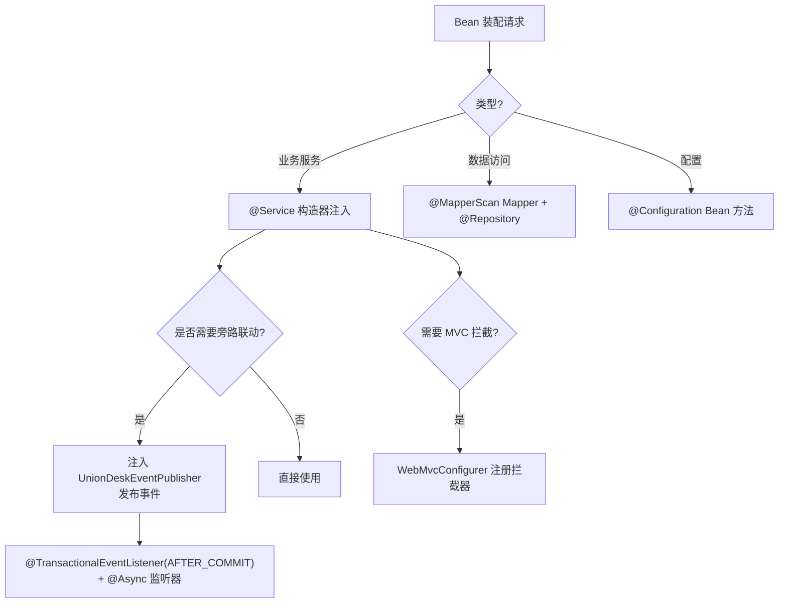
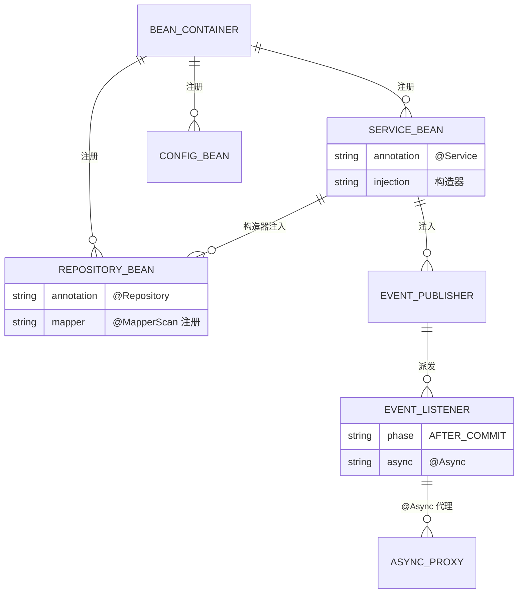
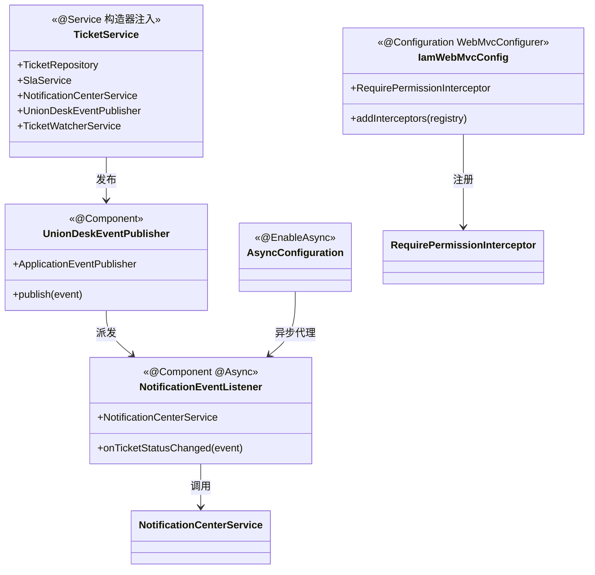

<cite>
- [UnionDesk/uniondesk-iam/src/main/java/com/uniondesk/iam/web/IamWebMvcConfig.java](file://UnionDesk/uniondesk-iam/src/main/java/com/uniondesk/iam/web/IamWebMvcConfig.java#L7-L21)
- [UnionDesk/uniondesk-support/src/main/java/com/uniondesk/notification/event/NotificationEventListener.java](file://UnionDesk/uniondesk-support/src/main/java/com/uniondesk/notification/event/NotificationEventListener.java#L10-L38)
- [UnionDesk/uniondesk-common/src/main/java/com/uniondesk/common/event/UnionDeskEventPublisher.java](file://UnionDesk/uniondesk-common/src/main/java/com/uniondesk/common/event/UnionDeskEventPublisher.java#L6-L18)
- [UnionDesk/uniondesk-app/src/main/java/com/uniondesk/config/AsyncConfiguration.java](file://UnionDesk/uniondesk-app/src/main/java/com/uniondesk/config/AsyncConfiguration.java#L6-L9)
- [UnionDesk/uniondesk-ticket/src/main/java/com/uniondesk/ticket/core/TicketService.java](file://UnionDesk/uniondesk-ticket/src/main/java/com/uniondesk/ticket/core/TicketService.java#L52-L77)
- [UnionDesk/uniondesk-ticket/src/main/java/com/uniondesk/ticket/core/TicketService.java](file://UnionDesk/uniondesk-ticket/src/main/java/com/uniondesk/ticket/core/TicketService.java#L79-L122)
- [UnionDesk/uniondesk-app/src/main/java/com/uniondesk/UnionDeskApplication.java](file://UnionDesk/uniondesk-app/src/main/java/com/uniondesk/UnionDeskApplication.java#L9-L17)
</cite>

# UnionDesk 依赖注入机制

## 简介

本文档详解后端 Spring 依赖注入机制：构造器注入规范（`@Service`/`@Repository`/`@Component` 组件扫描 + 构造器依赖）、跨模块 Bean 装配（业务模块互相注入）、`@Async` 异步执行（`@EnableAsync` + `@Async`）、事件监听（`@TransactionalEventListener` + `@EventListener`）、WebMvc 拦截器装配。这是「Bean 从哪来、何时创建、如何联动」的运行时地图。

章节来源：
- [UnionDesk/uniondesk-app/src/main/java/com/uniondesk/UnionDeskApplication.java](file://UnionDesk/uniondesk-app/src/main/java/com/uniondesk/UnionDeskApplication.java#L9-L17)
- [UnionDesk/uniondesk-ticket/src/main/java/com/uniondesk/ticket/core/TicketService.java](file://UnionDesk/uniondesk-ticket/src/main/java/com/uniondesk/ticket/core/TicketService.java#L52-L77)

## 项目结构

注入机制的组成与装配路径：



图表来源：
- [UnionDesk/uniondesk-app/src/main/java/com/uniondesk/UnionDeskApplication.java](file://UnionDesk/uniondesk-app/src/main/java/com/uniondesk/UnionDeskApplication.java#L9-L17)
- [UnionDesk/uniondesk-iam/src/main/java/com/uniondesk/iam/web/IamWebMvcConfig.java](file://UnionDesk/uniondesk-iam/src/main/java/com/uniondesk/iam/web/IamWebMvcConfig.java#L7-L21)

## 核心组件

**1. 组件扫描**：`@SpringBootApplication`（含 `@ComponentScan`）扫描 `com.uniondesk` 根包下全部模块的 `@Service`/`@Repository`/`@Component`/`@Configuration`；`@MapperScan("com.uniondesk.**.mapper")` 单独注册 Mapper 接口（UnionDeskApplication L9-17）。

**2. 构造器注入**：全项目统一构造器注入（无字段/Setter 注入）——`TicketService` 构造器注入 15+ 依赖（L79-122）、`IamWebMvcConfig` 注入 `RequirePermissionInterceptor`（L12-14）、`NotificationEventListener` 注入 `NotificationCenterService`（L15-17）；`ObjectProvider` 处理可选依赖（DomainService）。

**3. 跨模块 Bean 装配**：业务模块互相注入——`TicketService` 注入 `DomainCustomerRepository`（domain 模块）、`SlaService`/`NotificationCenterService`（support 模块）（L68/73-74）；依赖方向与 pom 一致（见组件依赖总览）。

**4. @Async 异步执行**：`AsyncConfiguration @EnableAsync`（L6-9）开启代理；`NotificationEventListener.onTicketStatusChanged` 标 `@Async`（L19）异步消费事件。

**5. 事件监听**：`@TransactionalEventListener(phase = AFTER_COMMIT)`（L20）——事务提交后触发；`UnionDeskEventPublisher` 包装 `ApplicationEventPublisher.publishEvent`（L15-17）统一发布出口。

**6. WebMvc 拦截器装配**：`IamWebMvcConfig implements WebMvcConfigurer`（L8）在 `addInterceptors` 注册 `RequirePermissionInterceptor` 到 `/api/v1/**`（L17-20）——权限拦截器随 MVC 配置装配。

章节来源：
- [UnionDesk/uniondesk-ticket/src/main/java/com/uniondesk/ticket/core/TicketService.java](file://UnionDesk/uniondesk-ticket/src/main/java/com/uniondesk/ticket/core/TicketService.java#L79-L122)
- [UnionDesk/uniondesk-support/src/main/java/com/uniondesk/notification/event/NotificationEventListener.java](file://UnionDesk/uniondesk-support/src/main/java/com/uniondesk/notification/event/NotificationEventListener.java#L10-L38)
- [UnionDesk/uniondesk-iam/src/main/java/com/uniondesk/iam/web/IamWebMvcConfig.java](file://UnionDesk/uniondesk-iam/src/main/java/com/uniondesk/iam/web/IamWebMvcConfig.java#L12-L20)

## 架构总览

事件从发布到异步消费的完整注入链路：



图表来源：
- [UnionDesk/uniondesk-common/src/main/java/com/uniondesk/common/event/UnionDeskEventPublisher.java](file://UnionDesk/uniondesk-common/src/main/java/com/uniondesk/common/event/UnionDeskEventPublisher.java#L15-L17)
- [UnionDesk/uniondesk-support/src/main/java/com/uniondesk/notification/event/NotificationEventListener.java](file://UnionDesk/uniondesk-support/src/main/java/com/uniondesk/notification/event/NotificationEventListener.java#L19-L38)

## 详细分析

**注入机制设计要点**：

1. **构造器注入唯一规范**：所有 Bean 构造器注入（Spring 官方推荐），不可变性保证线程安全、依赖显式可测；构造器参数即依赖清单，启动时缺失立即失败（fail-fast）。
2. **事件三要素**：发布（`UnionDeskEventPublisher.publish`）→ 事务相位（`@TransactionalEventListener AFTER_COMMIT`）→ 异步消费（`@Async`）——保证「主事务成功才通知、通知不阻塞主链路」；`NotificationEventListener` 内 null 守卫（`event.customerId()==null` return，L22-24）防御无客户场景。
3. **拦截器与配置 Bean**：`IamWebMvcConfig` 构造器注入拦截器并注册到 `/api/v1/**`——权限校验作用于所有业务端点；拦截器本身也是 Bean（`RequirePermissionInterceptor` 注入权限服务）。
4. **跨模块注入靠 pom**：`TicketService` 能注入 domain/support 模块 Bean 的前提是 pom 依赖声明（见组件依赖总览）；注入方向 = 依赖方向，防止循环依赖。
5. **Mapper 特殊装配**：Mapper 接口不走 `@Service`，由 `@MapperScan` + 全限定名生成器注册为 Bean（L11），Repository 构造器注入 Mapper。
6. **可选依赖**：`ObjectProvider<T>` 延迟/可选获取（DomainService 的 `DomainTeamTemplateApplier`），装配缺省不失败。



图表来源：
- [UnionDesk/uniondesk-app/src/main/java/com/uniondesk/UnionDeskApplication.java](file://UnionDesk/uniondesk-app/src/main/java/com/uniondesk/UnionDeskApplication.java#L9-L17)
- [UnionDesk/uniondesk-support/src/main/java/com/uniondesk/notification/event/NotificationEventListener.java](file://UnionDesk/uniondesk-support/src/main/java/com/uniondesk/notification/event/NotificationEventListener.java#L19-L38)
- [UnionDesk/uniondesk-iam/src/main/java/com/uniondesk/iam/web/IamWebMvcConfig.java](file://UnionDesk/uniondesk-iam/src/main/java/com/uniondesk/iam/web/IamWebMvcConfig.java#L16-L20)

## 数据模型

注入关系的数据视角：



图表来源：
- [UnionDesk/uniondesk-common/src/main/java/com/uniondesk/common/event/UnionDeskEventPublisher.java](file://UnionDesk/uniondesk-common/src/main/java/com/uniondesk/common/event/UnionDeskEventPublisher.java#L6-L18)
- [UnionDesk/uniondesk-support/src/main/java/com/uniondesk/notification/event/NotificationEventListener.java](file://UnionDesk/uniondesk-support/src/main/java/com/uniondesk/notification/event/NotificationEventListener.java#L10-L20)

## 依赖关系分析



图表来源：
- [UnionDesk/uniondesk-ticket/src/main/java/com/uniondesk/ticket/core/TicketService.java](file://UnionDesk/uniondesk-ticket/src/main/java/com/uniondesk/ticket/core/TicketService.java#L57-L77)
- [UnionDesk/uniondesk-iam/src/main/java/com/uniondesk/iam/web/IamWebMvcConfig.java](file://UnionDesk/uniondesk-iam/src/main/java/com/uniondesk/iam/web/IamWebMvcConfig.java#L10-L20)

## 性能与安全考虑

- **启动性能**：构造器注入启动期一次解析；`@MapperScan` 批量注册减少注解处理；懒加载（`ObjectProvider`）延迟可选 Bean。
- **异步隔离**：`@Async` 事件消费在线程池执行，不阻塞主事务；`AFTER_COMMIT` 保证事务成功才触发（失败不误通知）。
- **安全**：拦截器经 `WebMvcConfigurer` 注册到 `/api/v1/**` 全路径，权限校验不遗漏；构造器注入不可变防运行时篡改依赖。
- **可测试性**：构造器注入让单测直接 `new Service(mock)`；事件可用 `ApplicationEventPublisher` mock 断言。

章节来源：
- [UnionDesk/uniondesk-app/src/main/java/com/uniondesk/config/AsyncConfiguration.java](file://UnionDesk/uniondesk-app/src/main/java/com/uniondesk/config/AsyncConfiguration.java#L6-L9)
- [UnionDesk/uniondesk-support/src/main/java/com/uniondesk/notification/event/NotificationEventListener.java](file://UnionDesk/uniondesk-support/src/main/java/com/uniondesk/notification/event/NotificationEventListener.java#L19-L21)

## 故障排查指南

| 现象 | 原因 | 处理建议 |
| --- | --- | --- |
| 启动报 `NoSuchBeanDefinitionException` | 构造器依赖的 Bean 未注册（模块未加入 app 聚合/未标 @Service） | 检查 pom 依赖与注解；确认包在扫描范围 |
| 启动报循环依赖 | 两个 Bean 构造器互相注入 | 用 `@Lazy` 或 `ObjectProvider` 打破；重构依赖方向 |
| 事件监听未触发 | 缺 `@TransactionalEventListener`/`@Async`，或发布在事务外 | 确认发布点在事务内；检查监听注解与 `@EnableAsync` |
| 拦截器不生效 | `WebMvcConfigurer` 未装配或路径不匹配 | 检查 `addPathPatterns("/api/v1/**")`；确认 `IamWebMvcConfig` 被扫描 |
| 异步不生效（同步执行） | `@Async` 被同类调用绕过代理 | 监听器经代理调用；确认 `@EnableAsync` 生效 |

章节来源：
- [UnionDesk/uniondesk-support/src/main/java/com/uniondesk/notification/event/NotificationEventListener.java](file://UnionDesk/uniondesk-support/src/main/java/com/uniondesk/notification/event/NotificationEventListener.java#L19-L38)
- [UnionDesk/uniondesk-iam/src/main/java/com/uniondesk/iam/web/IamWebMvcConfig.java](file://UnionDesk/uniondesk-iam/src/main/java/com/uniondesk/iam/web/IamWebMvcConfig.java#L16-L20)

## 结论

依赖注入机制以「**构造器注入唯一、组件扫描+MapperScan 双注册、事件异步解耦、MVC 拦截器统一装配**」为骨架：所有 Bean 构造器注入保证可测性与不可变性，`@MapperScan` 批量注册数据访问层，事件经 `AFTER_COMMIT + @Async` 实现旁路联动不阻塞主链路，权限拦截器经 `WebMvcConfigurer` 覆盖全部业务端点。新增组件只需「标注解 + 构造器声明依赖」即可被容器装配。

章节来源：
- [UnionDesk/uniondesk-app/src/main/java/com/uniondesk/UnionDeskApplication.java](file://UnionDesk/uniondesk-app/src/main/java/com/uniondesk/UnionDeskApplication.java#L9-L17)
- [UnionDesk/uniondesk-common/src/main/java/com/uniondesk/common/event/UnionDeskEventPublisher.java](file://UnionDesk/uniondesk-common/src/main/java/com/uniondesk/common/event/UnionDeskEventPublisher.java#L6-L18)

## 附录

注入模式速查：

```java
// 1. 标准构造器注入（全部 Bean 统一风格）
@Service
public class DemoService {
    private final DemoRepository demoRepository;
    private final UnionDeskEventPublisher eventPublisher;

    public DemoService(DemoRepository demoRepository, UnionDeskEventPublisher eventPublisher) {
        this.demoRepository = demoRepository;
        this.eventPublisher = eventPublisher;
    }
}

// 2. 可选依赖（ObjectProvider）
private final ObjectProvider<DemoApplier> applier;
public DemoService(ObjectProvider<DemoApplier> applier) {
    this.applier = applier;
}

// 3. 异步事件监听（事务提交后）
@Async
@TransactionalEventListener(phase = TransactionPhase.AFTER_COMMIT)
public void onDemoChanged(DemoChangedEvent event) {
    // 异步旁路处理
}
```

章节来源：
- [UnionDesk/uniondesk-ticket/src/main/java/com/uniondesk/ticket/core/TicketService.java](file://UnionDesk/uniondesk-ticket/src/main/java/com/uniondesk/ticket/core/TicketService.java#L79-L122)
- [UnionDesk/uniondesk-support/src/main/java/com/uniondesk/notification/event/NotificationEventListener.java](file://UnionDesk/uniondesk-support/src/main/java/com/uniondesk/notification/event/NotificationEventListener.java#L19-L38)
- [UnionDesk/uniondesk-app/src/main/java/com/uniondesk/config/AsyncConfiguration.java](file://UnionDesk/uniondesk-app/src/main/java/com/uniondesk/config/AsyncConfiguration.java#L6-L9)
