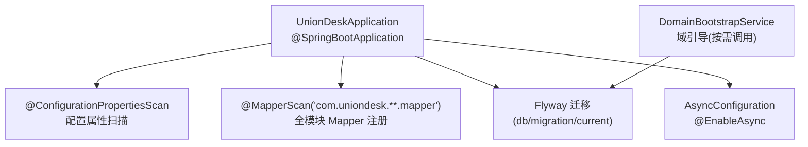
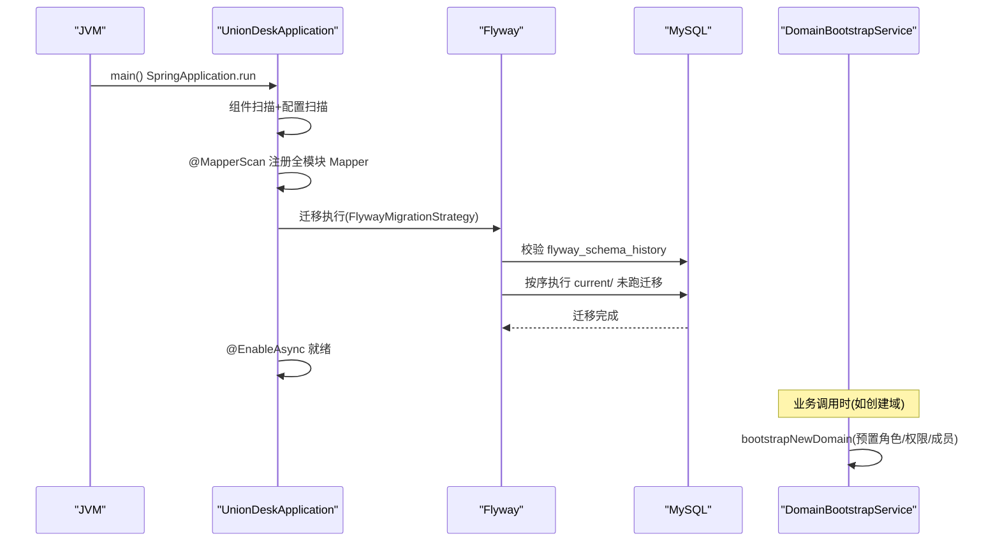
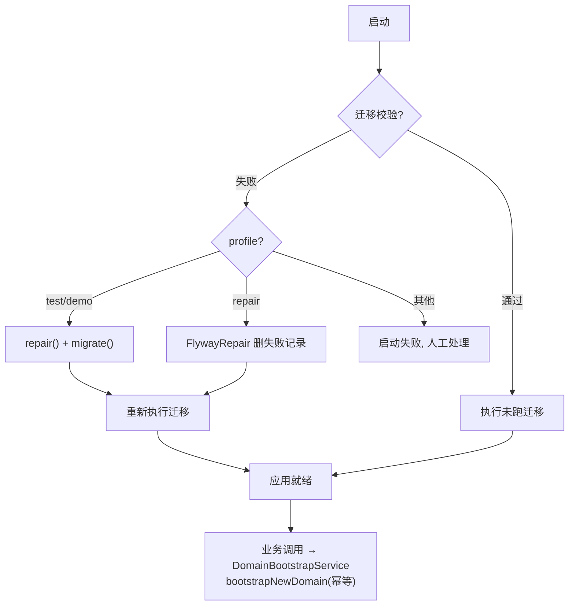
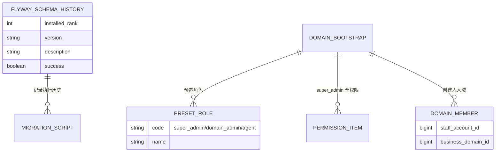
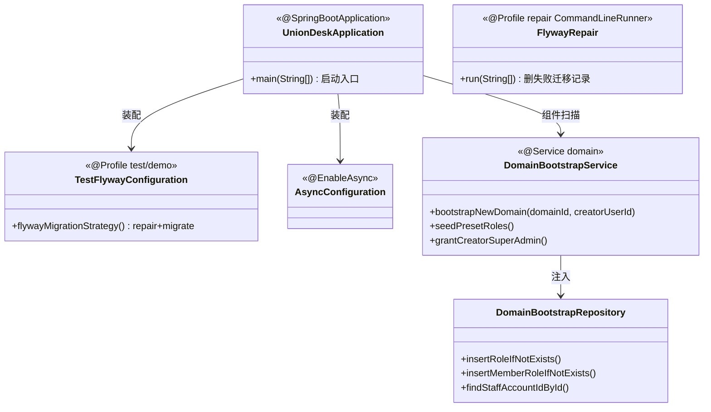

<cite>
- [UnionDesk/uniondesk-app/src/main/java/com/uniondesk/UnionDeskApplication.java](file://UnionDesk/uniondesk-app/src/main/java/com/uniondesk/UnionDeskApplication.java#L9-L17)
- [UnionDesk/uniondesk-app/src/main/java/com/uniondesk/config/FlywayRepair.java](file://UnionDesk/uniondesk-app/src/main/java/com/uniondesk/config/FlywayRepair.java#L10-L64)
- [UnionDesk/uniondesk-app/src/main/java/com/uniondesk/config/TestFlywayConfiguration.java](file://UnionDesk/uniondesk-app/src/main/java/com/uniondesk/config/TestFlywayConfiguration.java#L8-L19)
- [UnionDesk/uniondesk-app/src/main/java/com/uniondesk/config/AsyncConfiguration.java](file://UnionDesk/uniondesk-app/src/main/java/com/uniondesk/config/AsyncConfiguration.java#L6-L9)
- [UnionDesk/uniondesk-domain/src/main/java/com/uniondesk/domain/core/DomainBootstrapService.java](file://UnionDesk/uniondesk-domain/src/main/java/com/uniondesk/domain/core/DomainBootstrapService.java#L8-L28)
- [UnionDesk/uniondesk-domain/src/main/java/com/uniondesk/domain/core/DomainBootstrapService.java](file://UnionDesk/uniondesk-domain/src/main/java/com/uniondesk/domain/core/DomainBootstrapService.java#L30-L78)
- [UnionDesk/uniondesk-app/pom.xml](file://UnionDesk/uniondesk-app/pom.xml#L76-L96)
</cite>

# UnionDesk 应用启动机制

## 简介

本文档详解后端应用启动机制：`UnionDeskApplication` 启动类（`@SpringBootApplication` + `@MapperScan` 通配扫描）、Flyway 迁移执行（`TestFlywayConfiguration` 的 repair+migrate 策略与 `FlywayRepair` 修复工具）、业务域引导服务（`DomainBootstrapService` 预置角色与权限）、异步配置（`@EnableAsync`）。启动顺序与各组件职责是排障「启动失败」的入口。

章节来源：
- [UnionDesk/uniondesk-app/src/main/java/com/uniondesk/UnionDeskApplication.java](file://UnionDesk/uniondesk-app/src/main/java/com/uniondesk/UnionDeskApplication.java#L9-L17)
- [UnionDesk/uniondesk-app/src/main/java/com/uniondesk/config/AsyncConfiguration.java](file://UnionDesk/uniondesk-app/src/main/java/com/uniondesk/config/AsyncConfiguration.java#L6-L9)

## 项目结构

启动相关组件与顺序：



图表来源：
- [UnionDesk/uniondesk-app/src/main/java/com/uniondesk/UnionDeskApplication.java](file://UnionDesk/uniondesk-app/src/main/java/com/uniondesk/UnionDeskApplication.java#L9-L17)
- [UnionDesk/uniondesk-domain/src/main/java/com/uniondesk/domain/core/DomainBootstrapService.java](file://UnionDesk/uniondesk-domain/src/main/java/com/uniondesk/domain/core/DomainBootstrapService.java#L8-L28)

## 核心组件

**1. 启动类（UnionDeskApplication）**：`@SpringBootApplication`（L9）+ `@ConfigurationPropertiesScan`（L10，扫描 `@ConfigurationProperties` 配置类）+ `@MapperScan(value="com.uniondesk.**.mapper", nameGenerator=FullyQualifiedAnnotationBeanNameGenerator.class)`（L11，通配扫描全部模块 Mapper 并以全限定类名命名防冲突）；`main` 启动（L14-16）。

**2. Flyway 迁移**：app 模块 pom 内置 flyway 插件，`locations` 指向 `db/migration/current`（pom L85-87）；应用启动时 Flyway 自动校验并执行未跑迁移。

**3. TestFlywayConfiguration（test/demo profile）**：`@Profile({"test","demo"})`（L9）+ `FlywayMigrationStrategy` Bean（L12-17）——策略为 `repair()` 再 `migrate()`，测试环境容忍迁移记录修复。

**4. FlywayRepair 修复工具**：`@Profile("repair")` + `CommandLineRunner`（L20-21）；查询 `flyway_schema_history` 中 `version=? AND success=0` 的失败记录（L37-41）并删除（L47-50），让 Flyway 重新执行；默认 `@Component` 注释关闭，按需启用（L19-20）。

**5. AsyncConfiguration**：`@Configuration + @EnableAsync`（L6-9）开启 Spring 异步，事件监听器 `@Async` 执行。

**6. DomainBootstrapService 域引导**：`bootstrapNewDomain(domainId, creatorUserId)`（L22-28）四步：①`seedPresetRoles` 预置三个角色（super_admin/domain_admin/agent，L11-14、L30-34）②`seedSuperAdminAllPermissionItems` 给 super_admin 挂全部权限（L71-74）③`resolveStaffAccountId` 解析创建人员工账号（L36-55）④`grantCreatorSuperAdmin` 建域成员并绑定 super_admin（L57-69）。

章节来源：
- [UnionDesk/uniondesk-app/src/main/java/com/uniondesk/UnionDeskApplication.java](file://UnionDesk/uniondesk-app/src/main/java/com/uniondesk/UnionDeskApplication.java#L9-L17)
- [UnionDesk/uniondesk-app/src/main/java/com/uniondesk/config/FlywayRepair.java](file://UnionDesk/uniondesk-app/src/main/java/com/uniondesk/config/FlywayRepair.java#L19-L53)
- [UnionDesk/uniondesk-domain/src/main/java/com/uniondesk/domain/core/DomainBootstrapService.java](file://UnionDesk/uniondesk-domain/src/main/java/com/uniondesk/domain/core/DomainBootstrapService.java#L22-L78)

## 架构总览

应用启动到可用的完整时序：



图表来源：
- [UnionDesk/uniondesk-app/src/main/java/com/uniondesk/UnionDeskApplication.java](file://UnionDesk/uniondesk-app/src/main/java/com/uniondesk/UnionDeskApplication.java#L9-L17)
- [UnionDesk/uniondesk-app/src/main/java/com/uniondesk/config/TestFlywayConfiguration.java](file://UnionDesk/uniondesk-app/src/main/java/com/uniondesk/config/TestFlywayConfiguration.java#L12-L17)
- [UnionDesk/uniondesk-domain/src/main/java/com/uniondesk/domain/core/DomainBootstrapService.java](file://UnionDesk/uniondesk-domain/src/main/java/com/uniondesk/domain/core/DomainBootstrapService.java#L22-L28)

## 详细分析

**启动机制设计要点**：

1. **Mapper 通配扫描**：`@MapperScan("com.uniondesk.**.mapper")` 覆盖全部模块，新模块 Mapper 无需逐类注册；`FullyQualifiedAnnotationBeanNameGenerator` 用全限定类名命名，规避不同模块同名 Mapper 的 Bean 冲突。
2. **迁移策略双轨**：默认环境走 Flyway 自动迁移（校验+执行）；`test/demo` profile 走 `repair()+migrate()` 策略（容忍 checksum 漂移）；`repair` profile 提供手动修复工具（删除失败记录）——三层保护迁移健壮性。
3. **域引导幂等设计**：`insertRoleIfNotExists`/`insertMemberRoleIfNotExists`/`insertIamRoleBindingIfNotExists` 全部「IfNotExists」幂等；`resolveStaffAccountId` 先按 userId 查再按 username 兜底（L36-55），兼容旧数据。
4. **预置角色固化**：`PRESET_ROLES`（L11-14）三固定角色 super_admin/domain_admin/agent；super_admin 自动获得全部权限项（L71-74）；创建人自动成为 super_admin（L57-69）。
5. **异步就绪**：`@EnableAsync` 使 `UnionDeskEventPublisher` 发布的事件可被 `@Async` 监听器消费，旁路联动不阻塞主线程。
6. **修复工具按需启用**：`FlywayRepair` 默认注释 `@Component`，注释说明明确「使用三步法」（启用→启动→关闭），防止误启重复修复。



图表来源：
- [UnionDesk/uniondesk-app/src/main/java/com/uniondesk/config/TestFlywayConfiguration.java](file://UnionDesk/uniondesk-app/src/main/java/com/uniondesk/config/TestFlywayConfiguration.java#L8-L19)
- [UnionDesk/uniondesk-app/src/main/java/com/uniondesk/config/FlywayRepair.java](file://UnionDesk/uniondesk-app/src/main/java/com/uniondesk/config/FlywayRepair.java#L35-L53)
- [UnionDesk/uniondesk-domain/src/main/java/com/uniondesk/domain/core/DomainBootstrapService.java](file://UnionDesk/uniondesk-domain/src/main/java/com/uniondesk/domain/core/DomainBootstrapService.java#L22-L28)

## 数据模型

启动相关数据对象：



图表来源：
- [UnionDesk/uniondesk-app/src/main/java/com/uniondesk/config/FlywayRepair.java](file://UnionDesk/uniondesk-app/src/main/java/com/uniondesk/config/FlywayRepair.java#L37-L50)
- [UnionDesk/uniondesk-domain/src/main/java/com/uniondesk/domain/core/DomainBootstrapService.java](file://UnionDesk/uniondesk-domain/src/main/java/com/uniondesk/domain/core/DomainBootstrapService.java#L11-L14)

## 依赖关系分析



图表来源：
- [UnionDesk/uniondesk-app/src/main/java/com/uniondesk/UnionDeskApplication.java](file://UnionDesk/uniondesk-app/src/main/java/com/uniondesk/UnionDeskApplication.java#L9-L17)
- [UnionDesk/uniondesk-domain/src/main/java/com/uniondesk/domain/core/DomainBootstrapService.java](file://UnionDesk/uniondesk-domain/src/main/java/com/uniondesk/domain/core/DomainBootstrapService.java#L16-L20)

## 性能与安全考虑

- **启动性能**：`@MapperScan` 通配扫描一次注册全部 Mapper，避免逐类注解；`test/demo` 的 repair 策略避免失败迁移阻塞测试启动。
- **迁移安全**：默认环境严格校验 checksum 防篡改；`repair` profile 为显式人工操作（删除失败记录需确认）；`cleanDisabled` 由插件配置控制防误 clean。
- **引导安全**：`DomainBootstrapService` 预置角色与权限幂等写入；创建人 super_admin 绑定经 `insertIamRoleBindingIfNotExists` 幂等，防重复授权。
- **可恢复性**：`FlywayRepair` 删除失败记录后重启自动重跑；域引导异常抛 `IllegalStateException` 明确失败原因（L44/48/52）。

章节来源：
- [UnionDesk/uniondesk-app/src/main/java/com/uniondesk/config/FlywayRepair.java](file://UnionDesk/uniondesk-app/src/main/java/com/uniondesk/config/FlywayRepair.java#L35-L60)
- [UnionDesk/uniondesk-domain/src/main/java/com/uniondesk/domain/core/DomainBootstrapService.java](file://UnionDesk/uniondesk-domain/src/main/java/com/uniondesk/domain/core/DomainBootstrapService.java#L42-L54)

## 故障排查指南

| 现象 | 原因 | 处理建议 |
| --- | --- | --- |
| 启动报 Flyway Validate failed | 已执行迁移脚本被修改（checksum 变化） | 恢复脚本原内容；或临时用 `repair` profile 修复 |
| 启动报 Mapper Bean 重复 | 两个模块存在同名 Mapper 接口 | 确认 `FullyQualifiedAnnotationBeanNameGenerator` 生效；改名避免冲突 |
| 测试环境迁移卡住 | 历史失败记录残留（success=0） | 测试走 `TestFlywayConfiguration` repair+migrate 策略；或清理失败记录 |
| 创建域后无预置角色 | `DomainBootstrapService` 未执行或幂等条件异常 | 检查 `insertRoleIfNotExists` 执行；核对 `PRESET_ROLES` |
| 异步联动未生效 | `@EnableAsync` 缺失或被禁用 | 确认 `AsyncConfiguration` 装配；检查 `@Async` 监听器 |

章节来源：
- [UnionDesk/uniondesk-app/src/main/java/com/uniondesk/config/FlywayRepair.java](file://UnionDesk/uniondesk-app/src/main/java/com/uniondesk/config/FlywayRepair.java#L19-L53)
- [UnionDesk/uniondesk-app/src/main/java/com/uniondesk/config/AsyncConfiguration.java](file://UnionDesk/uniondesk-app/src/main/java/com/uniondesk/config/AsyncConfiguration.java#L6-L9)

## 结论

应用启动机制以「**单入口 + 通配扫描 + 迁移分层保护 + 幂等引导**」为设计：`UnionDeskApplication` 聚合启动、配置扫描与 Mapper 通配注册；Flyway 默认严格校验、test/demo 自动 repair、repair profile 人工修复三层兜底；`DomainBootstrapService` 以幂等方式预置角色/权限/成员；`@EnableAsync` 就绪异步事件链路。理解启动顺序即可快速定位启动类故障。

章节来源：
- [UnionDesk/uniondesk-app/src/main/java/com/uniondesk/UnionDeskApplication.java](file://UnionDesk/uniondesk-app/src/main/java/com/uniondesk/UnionDeskApplication.java#L9-L17)
- [UnionDesk/uniondesk-domain/src/main/java/com/uniondesk/domain/core/DomainBootstrapService.java](file://UnionDesk/uniondesk-domain/src/main/java/com/uniondesk/domain/core/DomainBootstrapService.java#L22-L78)

## 附录

启动相关命令：

```bash
# 1. 正常启动
mvn -pl uniondesk-app -am spring-boot:run

# 2. repair profile 启动（修复失败迁移后重启）
mvn -pl uniondesk-app -am spring-boot:run -Dspring-boot.run.profiles=repair

# 3. 测试环境（repair+migrate 策略）
mvn -pl uniondesk-app test

# 4. 查看迁移历史
mysql -u uniondesk_app -p -h 127.0.0.1 -P 30306 uniondesk \
  -e "SELECT installed_rank, version, description, success FROM flyway_schema_history ORDER BY installed_rank;"
```

域引导调用示例：

```java
// 创建业务域后调用（DomainService 内）
BootstrapResult result = domainBootstrapService.bootstrapNewDomain(domainId, creatorUserId);
// result: staffAccountId + "super_admin"（创建人自动为域超管）
```

章节来源：
- [UnionDesk/uniondesk-app/pom.xml](file://UnionDesk/uniondesk-app/pom.xml#L76-L96)（flyway 插件）
- [UnionDesk/uniondesk-domain/src/main/java/com/uniondesk/domain/core/DomainBootstrapService.java](file://UnionDesk/uniondesk-domain/src/main/java/com/uniondesk/domain/core/DomainBootstrapService.java#L22-L28)
