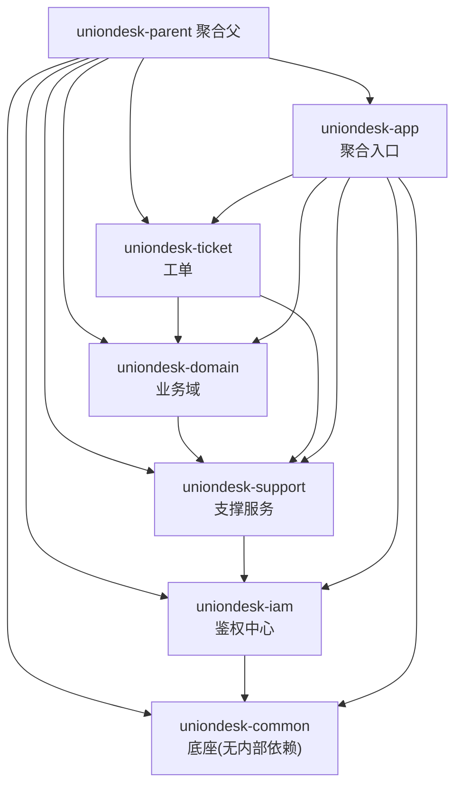
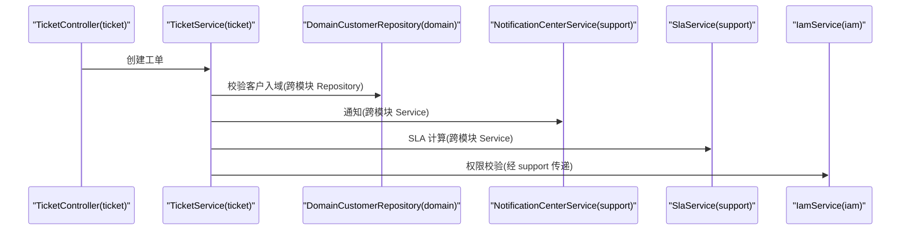
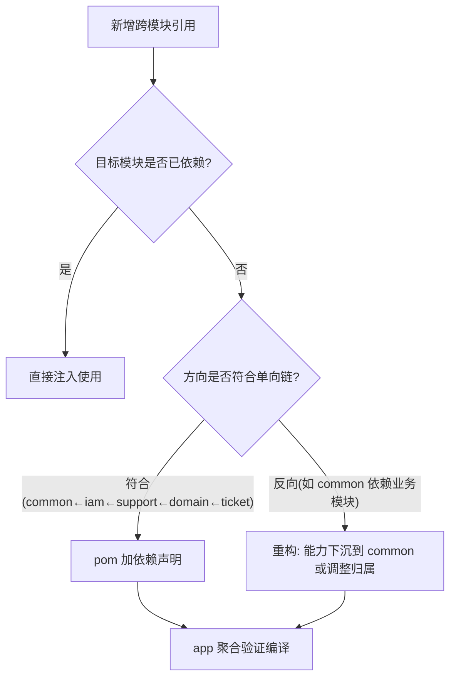
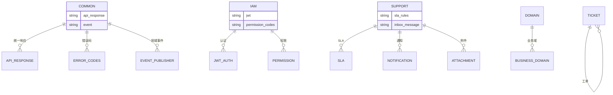
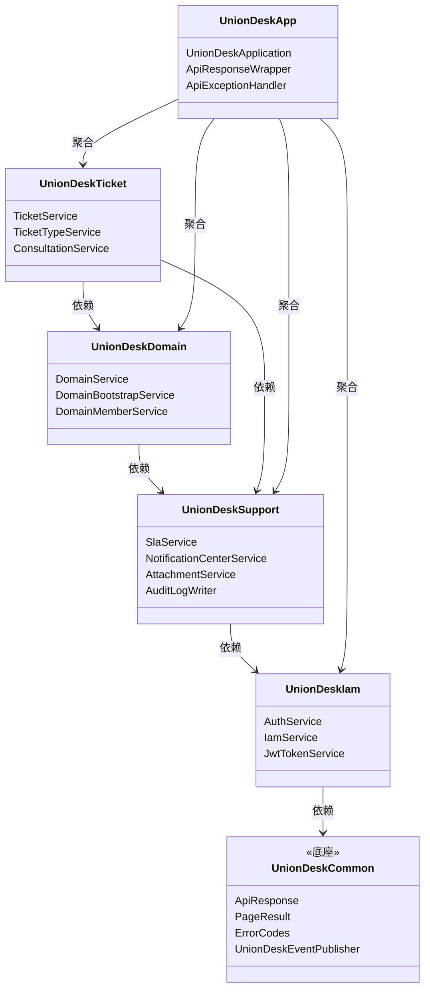

<cite>
- [UnionDesk/pom.xml](file://UnionDesk/pom.xml#L21-L28)
- [UnionDesk/pom.xml](file://UnionDesk/pom.xml#L38-L93)
- [UnionDesk/uniondesk-app/pom.xml](file://UnionDesk/uniondesk-app/pom.xml#L17-L37)
- [UnionDesk/uniondesk-iam/pom.xml](file://UnionDesk/uniondesk-iam/pom.xml#L17-L38)
- [UnionDesk/uniondesk-domain/pom.xml](file://UnionDesk/uniondesk-domain/pom.xml#L17-L31)
- [UnionDesk/uniondesk-ticket/pom.xml](file://UnionDesk/uniondesk-ticket/pom.xml#L17-L33)
- [UnionDesk/uniondesk-support/pom.xml](file://UnionDesk/uniondesk-support/pom.xml#L17-L40)
</cite>

# UnionDesk 组件依赖总览

## 简介

本文档总览后端 Maven 多模块的依赖关系：六个模块（common/iam/domain/support/ticket/app）的相互依赖图、`dependencyManagement` 版本收敛、跨模块 Repository/Service 引用模式（ticket→domain/support、domain→support、support→iam）、第三方依赖分布。这是理解「代码为什么能互相引用」的依赖地图。

章节来源：
- [UnionDesk/pom.xml](file://UnionDesk/pom.xml#L21-L28)
- [UnionDesk/uniondesk-app/pom.xml](file://UnionDesk/uniondesk-app/pom.xml#L17-L37)

## 项目结构

六模块依赖关系图（按 pom.xml 实际声明）：



图表来源：
- [UnionDesk/pom.xml](file://UnionDesk/pom.xml#L21-L28)
- [UnionDesk/uniondesk-iam/pom.xml](file://UnionDesk/uniondesk-iam/pom.xml#L17-L38)
- [UnionDesk/uniondesk-domain/pom.xml](file://UnionDesk/uniondesk-domain/pom.xml#L17-L31)
- [UnionDesk/uniondesk-ticket/pom.xml](file://UnionDesk/uniondesk-ticket/pom.xml#L17-L33)

## 核心组件

**模块依赖明细（按 pom 实际声明）**：

| 模块 | 内部依赖 | 第三方依赖 |
| --- | --- | --- |
| uniondesk-common | 无（纯底座） | （由父 POM 统一管理） |
| uniondesk-iam | uniondesk-common | spring-boot-starter-security、jdbc、mybatis-spring-boot-starter、poi-ooxml |
| uniondesk-support | uniondesk-iam | jdbc、mybatis、aws sdk（MinIO/S3 对象存储） |
| uniondesk-domain | uniondesk-support | jdbc、mybatis |
| uniondesk-ticket | uniondesk-domain、uniondesk-support | jdbc、mybatis |
| uniondesk-app | common/iam/domain/ticket/support 全部 | actuator、flyway-core、flyway-mysql、mysql-connector-j、starter-test |

**依赖链特征**：
- **单向链**：common ← iam ← support ← domain ← ticket，app 收口全部——依赖方向严格单向，无环。
- **传递可达**：ticket 依赖 domain+support 即传递获得 iam/common；domain 依赖 support 即传递获得 iam。
- **版本收敛**：父 POM `dependencyManagement` 统一 MyBatis 3.0.4、Flyway 11.7.2、AWS SDK 2.29.45、POI 5.2.5（L38-93），子模块声明依赖不写版本。

章节来源：
- [UnionDesk/uniondesk-iam/pom.xml](file://UnionDesk/uniondesk-iam/pom.xml#L17-L38)
- [UnionDesk/uniondesk-ticket/pom.xml](file://UnionDesk/uniondesk-ticket/pom.xml#L17-L33)
- [UnionDesk/pom.xml](file://UnionDesk/pom.xml#L38-L93)

## 架构总览

一次跨模块调用链（工单创建依赖链）：



图表来源：
- [UnionDesk/uniondesk-ticket/pom.xml](file://UnionDesk/uniondesk-ticket/pom.xml#L17-L33)（ticket 依赖 domain/support）
- [UnionDesk/uniondesk-domain/pom.xml](file://UnionDesk/uniondesk-domain/pom.xml#L17-L31)（domain 依赖 support）

## 详细分析

**依赖设计决策**：

1. **common 纯净底座**：不依赖任何内部模块，只承载统一响应、错误码、审计目录、领域事件——保证被任意模块引用无环。
2. **iam 是鉴权底座**：support 依赖 iam（支撑服务需要权限/身份能力），domain 经 support 传递获得 iam——`DomainService` 注入 `IamService` 即依赖此链。
3. **支撑优先于业务域**：domain 依赖 support（业务域需要通知/审计/附件），ticket 依赖 domain+support（工单需要域校验与全部支撑）——「支撑能力 → 域能力 → 业务聚合」的层次。
4. **app 聚合收口**：app 依赖全部业务模块并提供启动类、Flyway 迁移、全局配置——业务模块自身不可运行，保证单入口。
5. **跨模块 Repository 引用**：`TicketService` 直接注入 `DomainCustomerRepository`（ticket 依赖 domain 的 repository 包），跨模块共享数据访问（见 Service 层设计 L91）。
6. **版本收敛防冲突**：`dependencyManagement` 统一第三方版本；子模块只声明 artifactId 不写 version（继承父 POM）。
7. **测试隔离**：app 引入 `spring-boot-starter-test`；业务模块测试依赖走传递。



图表来源：
- [UnionDesk/pom.xml](file://UnionDesk/pom.xml#L21-L28)
- [UnionDesk/uniondesk-ticket/pom.xml](file://UnionDesk/uniondesk-ticket/pom.xml#L17-L33)

## 数据模型

模块与能力承载：



图表来源：
- [UnionDesk/uniondesk-iam/pom.xml](file://UnionDesk/uniondesk-iam/pom.xml#L17-L38)
- [UnionDesk/uniondesk-support/pom.xml](file://UnionDesk/uniondesk-support/pom.xml#L17-L40)

## 依赖关系分析



图表来源：
- [UnionDesk/uniondesk-iam/pom.xml](file://UnionDesk/uniondesk-iam/pom.xml#L17-L38)
- [UnionDesk/uniondesk-domain/pom.xml](file://UnionDesk/uniondesk-domain/pom.xml#L17-L31)
- [UnionDesk/uniondesk-ticket/pom.xml](file://UnionDesk/uniondesk-ticket/pom.xml#L17-L33)
- [UnionDesk/uniondesk-app/pom.xml](file://UnionDesk/uniondesk-app/pom.xml#L17-L37)

## 性能与安全考虑

- **构建性能**：模块依赖链清晰，`mvn -pl <module> -am` 可精确增量编译；app 单点打包避免重复产物。
- **安全**：iam 引入 `spring-boot-starter-security` 提供过滤器底座；support 的 S3 SDK 凭据经配置管理；依赖版本由父 POM 锁定防漏洞版本漂移。
- **可维护性**：依赖单向无环使循环依赖扫描可自动化；`dependencyManagement` 集中升级版本（如 Flyway 11.7.2）一处生效。
- **可测试性**：模块边界即测试边界——跨模块依赖可 mock；app 集成测试覆盖全链路。

章节来源：
- [UnionDesk/pom.xml](file://UnionDesk/pom.xml#L30-L93)
- [UnionDesk/uniondesk-app/pom.xml](file://UnionDesk/uniondesk-app/pom.xml#L38-L59)

## 故障排查指南

| 现象 | 原因 | 处理建议 |
| --- | --- | --- |
| 编译报「程序包不存在」 | 引用了未依赖模块的类 | 按单向链在 pom 补依赖声明；检查是否反向引用 |
| 启动报 Bean 缺失（跨模块） | 目标模块未加入 app 聚合依赖 | 在 `uniondesk-app/pom.xml` 补依赖 |
| 依赖版本冲突 | 子模块显式声明了与父 POM 不同版本 | 删除子模块版本号，统一走 `dependencyManagement` |
| 循环依赖编译失败 | 模块间互相依赖 | 重构：公共能力下沉 common；调整模块归属 |
| `mvn -pl X` 构建失败 | 未带 `-am`（also make） | 使用 `mvn -pl X -am` 连同依赖模块一起构建 |

章节来源：
- [UnionDesk/pom.xml](file://UnionDesk/pom.xml#L38-L93)
- [UnionDesk/uniondesk-app/pom.xml](file://UnionDesk/uniondesk-app/pom.xml#L17-L37)

## 结论

组件依赖以「**common 底座、单向依赖链、app 聚合收口、版本集中管理**」为骨架：common ← iam ← support ← domain ← ticket 的严格单向链保证无环与可编译性，跨模块 Repository/Service 引用沿依赖方向进行，`dependencyManagement` 让版本升级一处生效。新增功能时先确认模块归属与依赖方向，即可避免架构腐化。

章节来源：
- [UnionDesk/pom.xml](file://UnionDesk/pom.xml#L21-L28)
- [UnionDesk/uniondesk-ticket/pom.xml](file://UnionDesk/uniondesk-ticket/pom.xml#L17-L33)

## 附录

依赖排查命令：

```bash
# 1. 查看模块完整依赖树
mvn dependency:tree -pl uniondesk-ticket

# 2. 查看模块间内部依赖
mvn -pl uniondesk-ticket dependency:tree -Dincludes=com.uniondesk

# 3. 检查循环依赖
mvn -pl uniondesk-app dependency:analyze

# 4. 增量编译（连带依赖模块）
mvn -pl uniondesk-ticket -am compile
```

新增模块的 pom 模板：

```xml
<!-- 新业务模块按单向链选择依赖 -->
<dependencies>
    <dependency>
        <groupId>com.uniondesk</groupId>
        <artifactId>uniondesk-support</artifactId>
    </dependency>
    <dependency>
        <groupId>org.springframework.boot</groupId>
        <artifactId>spring-boot-starter-jdbc</artifactId>
    </dependency>
    <dependency>
        <groupId>org.mybatis.spring.boot</groupId>
        <artifactId>mybatis-spring-boot-starter</artifactId>
    </dependency>
</dependencies>
```

章节来源：
- [UnionDesk/uniondesk-domain/pom.xml](file://UnionDesk/uniondesk-domain/pom.xml#L17-L31)
- [UnionDesk/pom.xml](file://UnionDesk/pom.xml#L38-L93)
