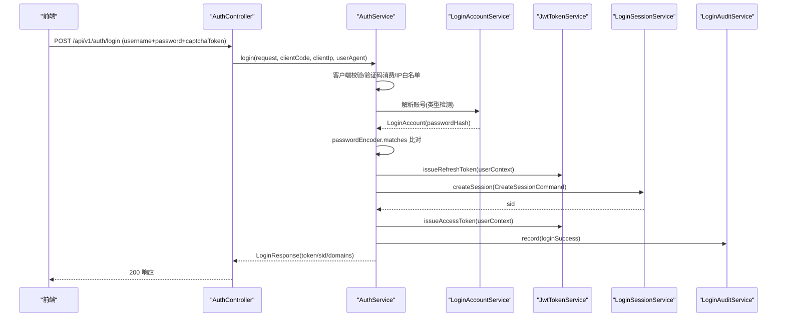
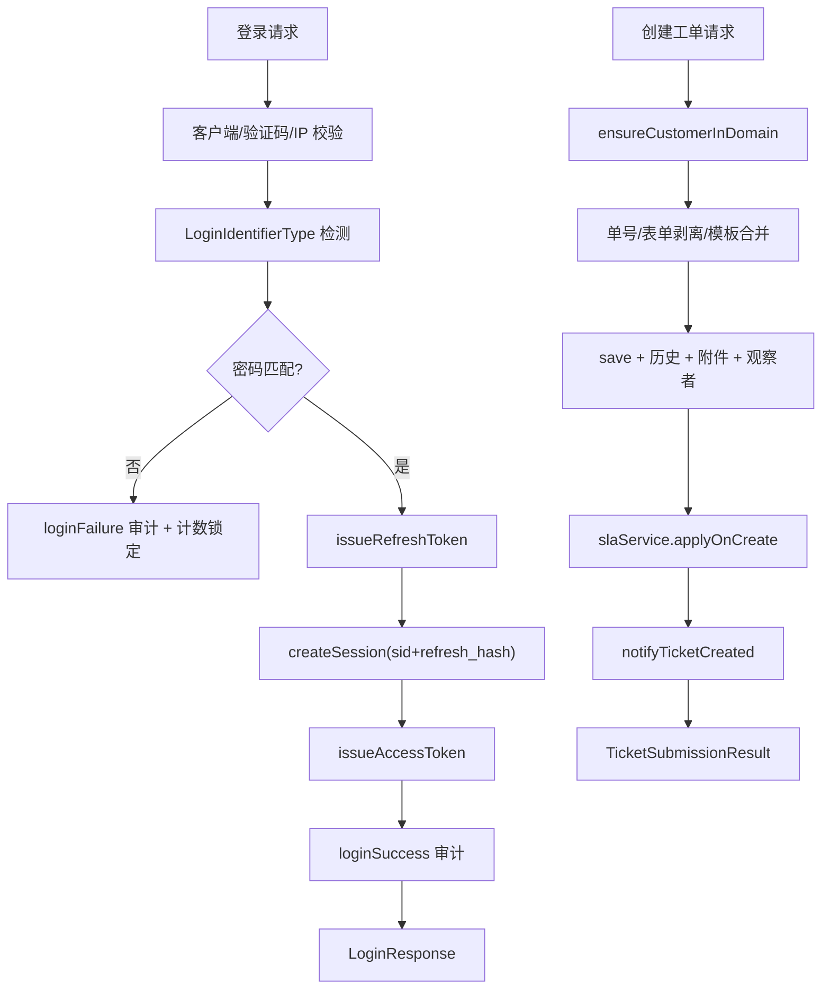
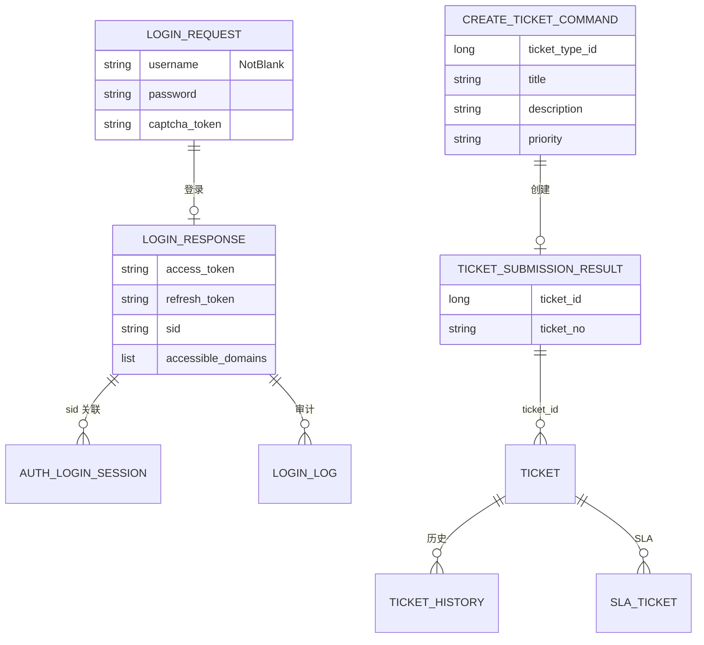
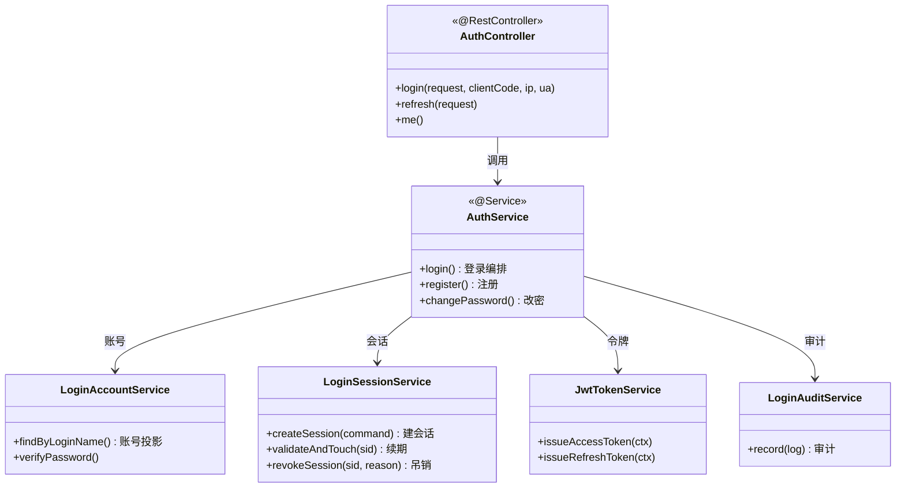

<cite>
- [UnionDesk/uniondesk-app/src/main/java/com/uniondesk/auth/web/AuthController.java](file://UnionDesk/uniondesk-app/src/main/java/com/uniondesk/auth/web/AuthController.java#L31-L96)
- [UnionDesk/uniondesk-app/src/main/java/com/uniondesk/auth/core/AuthService.java](file://UnionDesk/uniondesk-app/src/main/java/com/uniondesk/auth/core/AuthService.java#L42-L106)
- [UnionDesk/uniondesk-app/src/main/java/com/uniondesk/auth/core/AuthService.java](file://UnionDesk/uniondesk-app/src/main/java/com/uniondesk/auth/core/AuthService.java#L108-L130)
- [UnionDesk/uniondesk-app/src/main/java/com/uniondesk/auth/core/AuthService.java](file://UnionDesk/uniondesk-app/src/main/java/com/uniondesk/auth/core/AuthService.java#L183-L199)
- [UnionDesk/uniondesk-iam/src/main/java/com/uniondesk/auth/core/LoginSessionService.java](file://UnionDesk/uniondesk-iam/src/main/java/com/uniondesk/auth/core/LoginSessionService.java#L13-L32)
- [UnionDesk/uniondesk-iam/src/main/java/com/uniondesk/auth/core/LoginSessionService.java](file://UnionDesk/uniondesk-iam/src/main/java/com/uniondesk/auth/core/LoginSessionService.java#L95-L111)
- [UnionDesk/uniondesk-ticket/src/main/java/com/uniondesk/ticket/core/TicketService.java](file://UnionDesk/uniondesk-ticket/src/main/java/com/uniondesk/ticket/core/TicketService.java#L124-L192)
- [UnionDesk/uniondesk-ticket/src/main/java/com/uniondesk/ticket/web/TicketController.java](file://UnionDesk/uniondesk-ticket/src/main/java/com/uniondesk/ticket/web/TicketController.java#L38-L45)
</cite>

# UnionDesk 组件调用链路

## 简介

本文档详述两条典型组件调用链路：①登录认证链路（`AuthController → AuthService → LoginAccountService/LoginSessionService/JwtTokenService → Repository`）②创建工单链路（`TicketController → TicketService → 多 Repository → SLA/通知/事件发布`）。两条链路覆盖「认证 → 授权 → 业务 → 旁路联动」的完整调用范式。

章节来源：
- [UnionDesk/uniondesk-app/src/main/java/com/uniondesk/auth/web/AuthController.java](file://UnionDesk/uniondesk-app/src/main/java/com/uniondesk/auth/web/AuthController.java#L31-L96)
- [UnionDesk/uniondesk-ticket/src/main/java/com/uniondesk/ticket/core/TicketService.java](file://UnionDesk/uniondesk-ticket/src/main/java/com/uniondesk/ticket/core/TicketService.java#L124-L192)

## 项目结构

两条链路涉及的组件：

```mermaid
graph TB
    subgraph LOGIN["登录认证链路"]
        AC["AuthController"]
        AS["AuthService"]
        LAS["LoginAccountService"]
        LSS["LoginSessionService"]
        JWT["JwtTokenService"]
        AUD["LoginAuditService"]
        AC --> AS
        AS --> LAS & LSS & JWT & AUD
    end
    subgraph TICKET["创建工单链路"]
        TC["TicketController"]
        TS["TicketService"]
        TR["TicketRepository 族"]
        SLA["SlaService"]
        NOTI["NotificationCenterService"]
        EVT["UnionDeskEventPublisher"]
        TC --> TS
        TS --> TR & SLA & NOTI & EVT
    end
    AS --> TS : 注册/客户上下文
```

图表来源：
- [UnionDesk/uniondesk-app/src/main/java/com/uniondesk/auth/core/AuthService.java](file://UnionDesk/uniondesk-app/src/main/java/com/uniondesk/auth/core/AuthService.java#L47-L65)
- [UnionDesk/uniondesk-ticket/src/main/java/com/uniondesk/ticket/core/TicketService.java](file://UnionDesk/uniondesk-ticket/src/main/java/com/uniondesk/ticket/core/TicketService.java#L57-L77)

## 核心组件

**登录认证链路组件**：
- `AuthController`（/api/v1/auth）：`login/register/password reset/refresh/me` 等端点（L31-96）。
- `AuthService`：19 个依赖（L47-65）——账号服务、客户端服务、登录配置、会话服务、审计服务、IAM、JWT、密码编码器、验证码、客户/域服务、邀请码、版本、平台角色、用户配置、可信 IP、通知、时钟。
- `LoginSessionService`：会话创建/校验/吊销/刷新（L95-111），`validateAndTouch(sid, clientCode)` 滑动续期。

**创建工单链路组件**：
- `TicketController` → `TicketService`（L38-45）。
- `TicketService`：15+ 依赖（L57-77）——10 个 Repository + SLA/通知/附件/事件发布/观察者。
- 旁路：`SlaService.applyOnCreate`、`NotificationCenterService.notifyTicketCreated`、`UnionDeskEventPublisher.publish`。

章节来源：
- [UnionDesk/uniondesk-app/src/main/java/com/uniondesk/auth/core/AuthService.java](file://UnionDesk/uniondesk-app/src/main/java/com/uniondesk/auth/core/AuthService.java#L47-L106)
- [UnionDesk/uniondesk-iam/src/main/java/com/uniondesk/auth/core/LoginSessionService.java](file://UnionDesk/uniondesk-iam/src/main/java/com/uniondesk/auth/core/LoginSessionService.java#L13-L32)

## 架构总览

登录链路完整时序（密码登录）：



图表来源：
- [UnionDesk/uniondesk-app/src/main/java/com/uniondesk/auth/core/AuthService.java](file://UnionDesk/uniondesk-app/src/main/java/com/uniondesk/auth/core/AuthService.java#L108-L130)
- [UnionDesk/uniondesk-app/src/main/java/com/uniondesk/auth/core/AuthService.java](file://UnionDesk/uniondesk-app/src/main/java/com/uniondesk/auth/core/AuthService.java#L183-L199)

## 详细分析

**链路一：登录认证**（AuthService.login L108-199）：

1. **前置防线**：客户端校验（`authClientService.findByCode` L112-116）→ 验证码消费（L120-125）→ IP 白名单（L127-129）→ 登录方式启用检查（L130）。
2. **账号解析**：`LoginIdentifierType.detect(username)`（L118）判断登录标识类型（手机/用户名/邮箱），`LoginAccountService` 联合投影 staff/customer 账号。
3. **密码比对**：`passwordEncoder.matches`（BCrypt）防时序攻击；失败走 `loginAuditService.loginFailure` 记录（L131）并计数。
4. **会话与令牌**：`issueRefreshToken`（L183）→ `createSession`（L184-195，落库 sid + refresh_token_hash）→ `issueAccessToken`（L196）——JWT 无状态 + 会话可吊销双轨。
5. **审计落库**：`loginAuditService.record(loginSuccess)`（L199）记录 IP/UA/结果。
6. **会话续期**：后续请求 `validateAndTouch(sid, clientCode)`（L95-99）滑动 last_seen 续期；登出 `revokeSession(sid, reason)`（L103）。

**链路二：创建工单**（createTicketForCustomer L131-192）：

1. **域校验**：`ensureCustomerInDomain`（L132）确认客户在域内。
2. **业务组装**：`nextTicketNo`（单号，域 code+日期）→ `peelSystemFormValues`（剥离系统字段）→ `resolveDescriptionFromTypeTemplate`（描述模板）→ `resolvePriority` → `mergeTemplate`（模板合并，L134-155）。
3. **落库**：`ticketRepository.save(ticketPo)`（L173）+ `findIdByTicketNo` 幂等回填（L175）。
4. **历史**：`recordHistory(ticketId, ..., "create", ...)`（L176-179）。
5. **附属**：附件关联（L181-183）、观察者替换（L184-186）。
6. **旁路联动**：`slaService.applyOnCreate`（L188）→ `notificationCenterService.notifyTicketCreated`（L189）→ 返回结果（L191）。



图表来源：
- [UnionDesk/uniondesk-app/src/main/java/com/uniondesk/auth/core/AuthService.java](file://UnionDesk/uniondesk-app/src/main/java/com/uniondesk/auth/core/AuthService.java#L108-L199)
- [UnionDesk/uniondesk-ticket/src/main/java/com/uniondesk/ticket/core/TicketService.java](file://UnionDesk/uniondesk-ticket/src/main/java/com/uniondesk/ticket/core/TicketService.java#L131-L192)

## 数据模型

两条链路的数据对象：



图表来源：
- [UnionDesk/uniondesk-app/src/main/java/com/uniondesk/auth/core/AuthService.java](file://UnionDesk/uniondesk-app/src/main/java/com/uniondesk/auth/core/AuthService.java#L183-L199)
- [UnionDesk/uniondesk-ticket/src/main/java/com/uniondesk/ticket/core/TicketService.java](file://UnionDesk/uniondesk-ticket/src/main/java/com/uniondesk/ticket/core/TicketService.java#L157-L191)

## 依赖关系分析



图表来源：
- [UnionDesk/uniondesk-app/src/main/java/com/uniondesk/auth/web/AuthController.java](file://UnionDesk/uniondesk-app/src/main/java/com/uniondesk/auth/web/AuthController.java#L31-L96)
- [UnionDesk/uniondesk-app/src/main/java/com/uniondesk/auth/core/AuthService.java](file://UnionDesk/uniondesk-app/src/main/java/com/uniondesk/auth/core/AuthService.java#L47-L106)
- [UnionDesk/uniondesk-iam/src/main/java/com/uniondesk/auth/core/LoginSessionService.java](file://UnionDesk/uniondesk-iam/src/main/java/com/uniondesk/auth/core/LoginSessionService.java#L95-L111)

## 性能与安全考虑

- **性能**：登录链路一次事务完成（会话+审计）；工单链路单事务（L124）；`validateAndTouch` 滑动续期减少重建会话开销。
- **安全**：登录前置四道防线（客户端/验证码/IP/方式开关）；BCrypt 密码比对；refresh 令牌哈希存储；会话可吊销；审计全记录。
- **幂等**：工单单号唯一键 + `findIdByTicketNo` 回填；注册/会话创建幂等处理。
- **并发**：工单 `version` 乐观锁贯穿流转；会话 `validateAndTouch` 轻量更新。

章节来源：
- [UnionDesk/uniondesk-app/src/main/java/com/uniondesk/auth/core/AuthService.java](file://UnionDesk/uniondesk-app/src/main/java/com/uniondesk/auth/core/AuthService.java#L108-L130)
- [UnionDesk/uniondesk-ticket/src/main/java/com/uniondesk/ticket/core/TicketService.java](file://UnionDesk/uniondesk-ticket/src/main/java/com/uniondesk/ticket/core/TicketService.java#L124-L192)

## 故障排查指南

| 现象 | 原因 | 处理建议 |
| --- | --- | --- |
| 登录 10001 但密码正确 | 客户端校验/验证码/IP 前置失败 | 检查 `auth_client` 状态、验证码 token、IP 白名单配置 |
| 登录成功但后续 401 | 会话未创建或 accessToken 与 sid 不匹配 | 检查 `createSession` 落库与 `validateAndTouch`；核对 refresh 链路 |
| 工单创建后无 SLA | `applyOnCreate` 未执行或规则缺失 | 检查 `sla_rule` 配置；核对调用点在事务内 |
| 工单创建成功但客户无通知 | `notifyTicketCreated` 异步失败 | 检查通知模板与 `notification_log` |
| 会话清理后在线列表不更新 | `revokeSession` 未触发 | 检查登出接口调用链与 `revokeSessionsByUser` |

章节来源：
- [UnionDesk/uniondesk-iam/src/main/java/com/uniondesk/auth/core/LoginSessionService.java](file://UnionDesk/uniondesk-iam/src/main/java/com/uniondesk/auth/core/LoginSessionService.java#L103-L111)
- [UnionDesk/uniondesk-ticket/src/main/java/com/uniondesk/ticket/core/TicketService.java](file://UnionDesk/uniondesk-ticket/src/main/java/com/uniondesk/ticket/core/TicketService.java#L188-L191)

## 结论

两条典型调用链路展示了 UnionDesk 的调用范式：**登录链路**是「防线前置 → 账号解析 → 令牌+会话双轨 → 审计闭环」；**工单链路**是「域校验 → 业务组装 → 落库+历史 → 旁路联动（SLA/通知/事件）」——两者都遵循「Controller 薄壳 → Service 编排 → 多组件协作」的结构，事务边界与审计埋点位置清晰，是排查与扩展的参考样板。

章节来源：
- [UnionDesk/uniondesk-app/src/main/java/com/uniondesk/auth/core/AuthService.java](file://UnionDesk/uniondesk-app/src/main/java/com/uniondesk/auth/core/AuthService.java#L108-L199)
- [UnionDesk/uniondesk-ticket/src/main/java/com/uniondesk/ticket/core/TicketService.java](file://UnionDesk/uniondesk-ticket/src/main/java/com/uniondesk/ticket/core/TicketService.java#L124-L192)

## 附录

链路验证命令：

```bash
# 1. 登录（获取令牌）
curl -X POST http://127.0.0.1:8080/api/v1/auth/login \
  -H "Content-Type: application/json" \
  -d '{"username":"admin","password":"***","clientCode":"uniondesk-admin"}'

# 2. 携带令牌查询当前用户（验证会话有效）
curl http://127.0.0.1:8080/api/v1/auth/me \
  -H "Authorization: Bearer <accessToken>"

# 3. 创建工单（验证工单链路）
curl -X POST http://127.0.0.1:8080/api/v1/domains/1/tickets \
  -H "Authorization: Bearer <accessToken>" \
  -H "Content-Type: application/json" \
  -d '{"ticket_type_id":5,"title":"测试工单","description":"链路验证","priority":"normal"}'
```

链路断点定位（日志关键字）：

```bash
# 登录链路：关注 AuthService.login 的校验分支与 LoginAuditService 记录
grep "AuthService\|LoginAuditService" logs/*.log

# 工单链路：关注 TicketService.createTicketForCustomer 与通知/SLA 调用
grep "TicketService\|SlaService\|NotificationCenterService" logs/*.log
```

章节来源：
- [UnionDesk/uniondesk-app/src/main/java/com/uniondesk/auth/web/AuthController.java](file://UnionDesk/uniondesk-app/src/main/java/com/uniondesk/auth/web/AuthController.java#L54-L60)
- [UnionDesk/uniondesk-ticket/src/main/java/com/uniondesk/ticket/web/TicketController.java](file://UnionDesk/uniondesk-ticket/src/main/java/com/uniondesk/ticket/web/TicketController.java#L38-L45)
