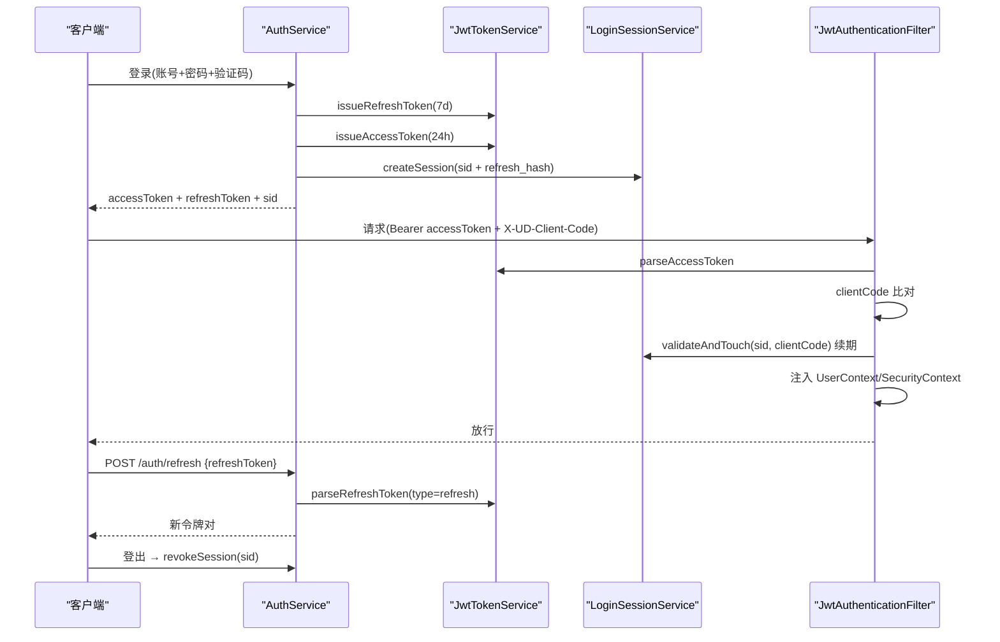
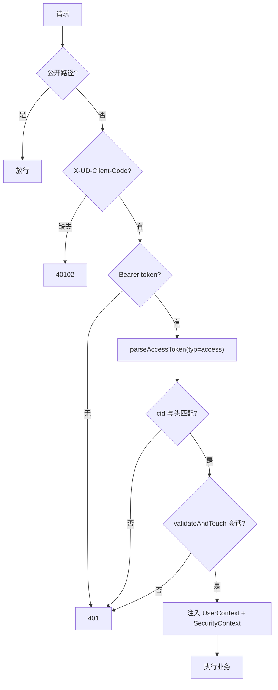
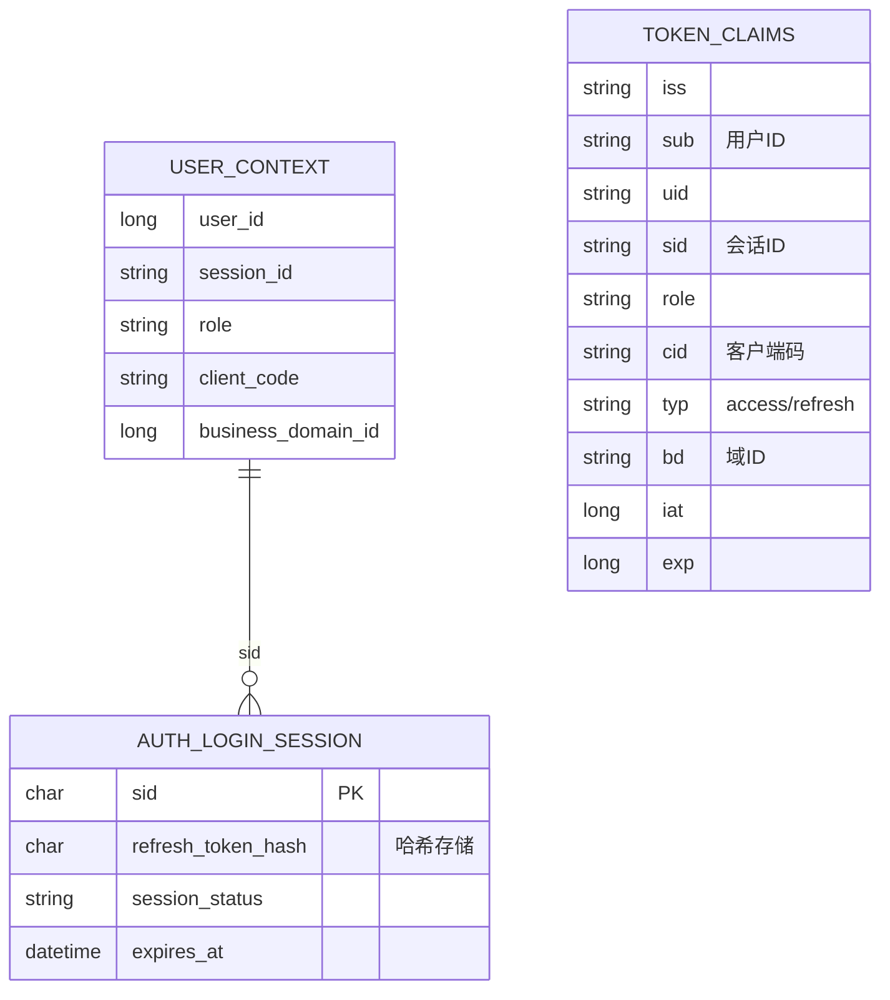
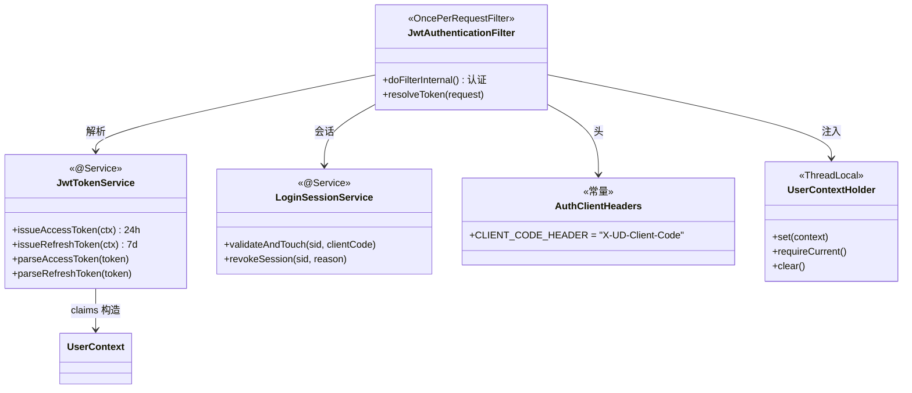

<cite>
- [UnionDesk/uniondesk-iam/src/main/java/com/uniondesk/auth/core/JwtTokenService.java](file://UnionDesk/uniondesk-iam/src/main/java/com/uniondesk/auth/core/JwtTokenService.java#L19-L80)
- [UnionDesk/uniondesk-iam/src/main/java/com/uniondesk/auth/core/JwtAuthenticationFilter.java](file://UnionDesk/uniondesk-iam/src/main/java/com/uniondesk/auth/core/JwtAuthenticationFilter.java#L24-L80)
- [UnionDesk/uniondesk-iam/src/main/java/com/uniondesk/auth/core/LoginSessionService.java](file://UnionDesk/uniondesk-iam/src/main/java/com/uniondesk/auth/core/LoginSessionService.java#L95-L111)
- [UnionDesk/uniondesk-iam/src/main/java/com/uniondesk/auth/core/AuthClientHeaders.java](file://UnionDesk/uniondesk-iam/src/main/java/com/uniondesk/auth/core/AuthClientHeaders.java#L3-L9)
- [UnionDesk/uniondesk-iam/src/main/java/com/uniondesk/auth/core/UserContextHolder.java](file://UnionDesk/uniondesk-iam/src/main/java/com/uniondesk/auth/core/UserContextHolder.java#L5-L31)
- [UnionDesk/uniondesk-iam/src/main/java/com/uniondesk/auth/core/LoginSessionService.java](file://UnionDesk/uniondesk-iam/src/main/java/com/uniondesk/auth/core/LoginSessionService.java#L103-L107)
</cite>

# UnionDesk JWT 认证机制

## 简介

本文档详解 JWT 认证机制：令牌签发（`JwtTokenService` HMAC-SHA256 自实现 access/refresh 双令牌）、校验过滤（`JwtAuthenticationFilter` 解析/客户端比对/会话续期）、过期刷新（refresh 端点换新）、会话管理（`AuthLoginSession` 落库可吊销）、客户端识别（`AuthClientHeaders` 的 `X-UD-Client-Code`）、上下文传递（`UserContextHolder` ThreadLocal）。

章节来源：
- [UnionDesk/uniondesk-iam/src/main/java/com/uniondesk/auth/core/JwtTokenService.java](file://UnionDesk/uniondesk-iam/src/main/java/com/uniondesk/auth/core/JwtTokenService.java#L19-L80)
- [UnionDesk/uniondesk-iam/src/main/java/com/uniondesk/auth/core/JwtAuthenticationFilter.java](file://UnionDesk/uniondesk-iam/src/main/java/com/uniondesk/auth/core/JwtAuthenticationFilter.java#L24-L80)

## 项目结构

JWT 认证组件：

```mermaid
graph TB
    JWT["JwtTokenService 签发/解析"]
    FILTER["JwtAuthenticationFilter 过滤"]
    SESS["LoginSessionService 会话"]
    HEADER["AuthClientHeaders 客户端头"]
    CTX["UserContextHolder 上下文"]
    SEC["Spring Security 链"]
    JWT --> FILTER : 解析
    FILTER --> SESS : 校验续期
    FILTER --> HEADER : 客户端比对
    FILTER --> CTX : 注入
    FILTER --> SEC : SecurityContext
```

图表来源：
- [UnionDesk/uniondesk-iam/src/main/java/com/uniondesk/auth/core/JwtTokenService.java](file://UnionDesk/uniondesk-iam/src/main/java/com/uniondesk/auth/core/JwtTokenService.java#L19-L44)
- [UnionDesk/uniondesk-iam/src/main/java/com/uniondesk/auth/core/JwtAuthenticationFilter.java](file://UnionDesk/uniondesk-iam/src/main/java/com/uniondesk/auth/core/JwtAuthenticationFilter.java#L24-L51)

## 核心组件

**1. JwtTokenService 签发/解析**：HMAC-SHA256 自实现（L22-44）——`signingKey` 从配置 `uniondesk.security.jwt.secret`（L35）；claims：`iss/sub/uid/sid/role/cid/typ/bd(域)/iat/exp`（L66-80）；`issueAccessToken`（24h 默认，L46-48）、`issueRefreshToken`（7d 默认，L50-52）、`parseAccessToken/parseRefreshToken`（L54-60，type 校验）。

**2. JwtAuthenticationFilter 校验**：`OncePerRequestFilter`（L25）——公开路径/OPTIONS 放行（L59-62）；`X-UD-Client-Code` 必填（L63-67）；解析 token → `clientCode` 比对（L72-74）→ `validateAndTouch` 会话校验+续期（L75）→ `UserContextHolder.set` + SecurityContext 注入（L76-80）。

**3. LoginSessionService 会话**：`validateAndTouch(sid, clientCode)`（L95-99）滑动续期；`revokeSession(sid, reason)`（L103）吊销；`revokeSessionsByUser`（L107）批量。

**4. AuthClientHeaders**：`CLIENT_CODE_HEADER = "X-UD-Client-Code"`（L5）——客户端标识头常量。

**5. UserContextHolder 上下文**：ThreadLocal 承载 `UserContext`（L7）；`set/current/requireCurrent/clear`（L12-30）——请求内用户上下文；过滤器入口 clear（防线程池污染）。

章节来源：
- [UnionDesk/uniondesk-iam/src/main/java/com/uniondesk/auth/core/JwtTokenService.java](file://UnionDesk/uniondesk-iam/src/main/java/com/uniondesk/auth/core/JwtTokenService.java#L33-L80)
- [UnionDesk/uniondesk-iam/src/main/java/com/uniondesk/auth/core/JwtAuthenticationFilter.java](file://UnionDesk/uniondesk-iam/src/main/java/com/uniondesk/auth/core/JwtAuthenticationFilter.java#L53-L80)
- [UnionDesk/uniondesk-iam/src/main/java/com/uniondesk/auth/core/UserContextHolder.java](file://UnionDesk/uniondesk-iam/src/main/java/com/uniondesk/auth/core/UserContextHolder.java#L5-L31)

## 架构总览

令牌全生命周期时序：



图表来源：
- [UnionDesk/uniondesk-iam/src/main/java/com/uniondesk/auth/core/JwtTokenService.java](file://UnionDesk/uniondesk-iam/src/main/java/com/uniondesk/auth/core/JwtTokenService.java#L46-L60)
- [UnionDesk/uniondesk-iam/src/main/java/com/uniondesk/auth/core/JwtAuthenticationFilter.java](file://UnionDesk/uniondesk-iam/src/main/java/com/uniondesk/auth/core/JwtAuthenticationFilter.java#L59-L80)
- [UnionDesk/uniondesk-iam/src/main/java/com/uniondesk/auth/core/LoginSessionService.java](file://UnionDesk/uniondesk-iam/src/main/java/com/uniondesk/auth/core/LoginSessionService.java#L95-L107)

## 详细分析

**JWT 机制设计要点**：

1. **双令牌分型**：access（24h，typ=access）与 refresh（7d，typ=refresh）独立签发（L46-52）；解析时校验 tokenType（`parseAccessToken` 只收 access）——refresh 令牌不能当 access 用。
2. **claims 语义**：`sub/uid`（用户）、`sid`（会话 ID，L72）、`role`、`cid`（客户端，L74）、`bd`（域上下文，L76-78）——一次解析全量上下文。
3. **客户端绑定**：token 内 `cid` 与请求头 `X-UD-Client-Code` 比对（L72-74）——令牌不可跨端复用（管理端/门户端隔离）。
4. **无状态 + 可撤销**：access 无状态扩展；但过滤器每次 `validateAndTouch`（L75）查会话——吊销即时生效、续期滑动更新。
5. **上下文 ThreadLocal**：过滤器入口 `clear`（L57-58）防线程池复用污染；`requireCurrent` 供业务取当前用户（L24-26）。
6. **自实现 JWT**：HMAC-SHA256 + Base64URL 手写（L22-23）——零依赖、可控；secret 配置化（L35）——生产环境外置。
7. **刷新防滥用**：refresh 令牌哈希存储于会话表（见认证文档）——库泄露不可逆；刷新成功换新对。



图表来源：
- [UnionDesk/uniondesk-iam/src/main/java/com/uniondesk/auth/core/JwtAuthenticationFilter.java](file://UnionDesk/uniondesk-iam/src/main/java/com/uniondesk/auth/core/JwtAuthenticationFilter.java#L59-L80)
- [UnionDesk/uniondesk-iam/src/main/java/com/uniondesk/auth/core/JwtTokenService.java](file://UnionDesk/uniondesk-iam/src/main/java/com/uniondesk/auth/core/JwtTokenService.java#L66-L80)

## 数据模型

JWT 相关数据：



图表来源：
- [UnionDesk/uniondesk-iam/src/main/java/com/uniondesk/auth/core/JwtTokenService.java](file://UnionDesk/uniondesk-iam/src/main/java/com/uniondesk/auth/core/JwtTokenService.java#L66-L80)
- [UnionDesk/uniondesk-iam/src/main/java/com/uniondesk/auth/core/UserContextHolder.java](file://UnionDesk/uniondesk-iam/src/main/java/com/uniondesk/auth/core/UserContextHolder.java#L5-L26)

## 依赖关系分析



图表来源：
- [UnionDesk/uniondesk-iam/src/main/java/com/uniondesk/auth/core/JwtAuthenticationFilter.java](file://UnionDesk/uniondesk-iam/src/main/java/com/uniondesk/auth/core/JwtAuthenticationFilter.java#L40-L51)
- [UnionDesk/uniondesk-iam/src/main/java/com/uniondesk/auth/core/AuthClientHeaders.java](file://UnionDesk/uniondesk-iam/src/main/java/com/uniondesk/auth/core/AuthClientHeaders.java#L3-L9)

## 性能与安全考虑

- **性能**：JWT 解析免查库（HMAC 本地验签）；`validateAndTouch` 轻量会话更新；access 24h 减少刷新频率。
- **安全**：secret 配置化不硬编码；refresh 哈希存储；typ 分型防令牌混用；cid 绑定防跨端；会话可吊销；ThreadLocal 清理防污染。
- **一致性**：双白名单（Security 链 + 过滤器）同步；401/403 信封统一；会话续期滑动窗口。
- **可观测**：登录/吊销审计；`last_seen_at` 会话活跃度。

章节来源：
- [UnionDesk/uniondesk-iam/src/main/java/com/uniondesk/auth/core/JwtTokenService.java](file://UnionDesk/uniondesk-iam/src/main/java/com/uniondesk/auth/core/JwtTokenService.java#L33-L44)
- [UnionDesk/uniondesk-iam/src/main/java/com/uniondesk/auth/core/JwtAuthenticationFilter.java](file://UnionDesk/uniondesk-iam/src/main/java/com/uniondesk/auth/core/JwtAuthenticationFilter.java#L57-L58)

## 故障排查指南

| 现象 | 原因 | 处理建议 |
| --- | --- | --- |
| 令牌解析失败 | secret 不一致或 token 过期/篡改 | 核对 `uniondesk.security.jwt.secret`；检查 exp |
| 40102 客户端缺失 | 请求未带 `X-UD-Client-Code` | 检查前端头注入；核对头名常量 |
| 401 但 token 有效 | `cid` 不匹配或会话已吊销 | 检查 token 签发客户端；查 `session_status` |
| 刷新失败 | refreshToken 过期或 typ 错误 | 检查 `parseRefreshToken`；重新登录 |
| 线程池任务取到旧用户 | ThreadLocal 未清理 | 检查过滤器 clear；异步任务显式传上下文 |

章节来源：
- [UnionDesk/uniondesk-iam/src/main/java/com/uniondesk/auth/core/JwtAuthenticationFilter.java](file://UnionDesk/uniondesk-iam/src/main/java/com/uniondesk/auth/core/JwtAuthenticationFilter.java#L63-L76)
- [UnionDesk/uniondesk-iam/src/main/java/com/uniondesk/auth/core/UserContextHolder.java](file://UnionDesk/uniondesk-iam/src/main/java/com/uniondesk/auth/core/UserContextHolder.java#L28-L30)

## 结论

JWT 认证机制以「**自实现 HMAC 双令牌、客户端绑定、无状态+可撤销、ThreadLocal 上下文**」为核心：`JwtTokenService` 签发 access/refresh 分型令牌（claims 含 sid/cid/bd 全量上下文），`JwtAuthenticationFilter` 每请求解析+客户端比对+会话续期，`LoginSessionService` 支撑吊销与滑动窗口，`UserContextHolder` 承载请求内上下文。该机制在无状态扩展性与服务端管控之间取得平衡。

章节来源：
- [UnionDesk/uniondesk-iam/src/main/java/com/uniondesk/auth/core/JwtTokenService.java](file://UnionDesk/uniondesk-iam/src/main/java/com/uniondesk/auth/core/JwtTokenService.java#L19-L80)
- [UnionDesk/uniondesk-iam/src/main/java/com/uniondesk/auth/core/JwtAuthenticationFilter.java](file://UnionDesk/uniondesk-iam/src/main/java/com/uniondesk/auth/core/JwtAuthenticationFilter.java#L24-L80)

## 附录

JWT 验证命令：

```bash
# 1. 登录获取令牌
curl -X POST http://127.0.0.1:8080/api/v1/auth/login \
  -H "Content-Type: application/json" -H "X-UD-Client-Code: ud-admin-web" \
  -d '{"username":"admin","password":"***"}'

# 2. 解码 JWT 查看 claims（在线工具或本地）
# eyJ... → header.payload.signature
# payload: {"iss":"uniondesk","sub":"1","uid":1,"sid":"...","role":"platform_admin","cid":"ud-admin-web","typ":"access","iat":...,"exp":...}

# 3. 携带令牌访问（带客户端头）
curl http://127.0.0.1:8080/api/v1/auth/me \
  -H "Authorization: Bearer <accessToken>" -H "X-UD-Client-Code: ud-admin-web"

# 4. 刷新令牌
curl -X POST http://127.0.0.1:8080/api/v1/auth/refresh \
  -H "Content-Type: application/json" \
  -d '{"refreshToken":"<refreshToken>"}'
```

章节来源：
- [UnionDesk/uniondesk-iam/src/main/java/com/uniondesk/auth/core/JwtTokenService.java](file://UnionDesk/uniondesk-iam/src/main/java/com/uniondesk/auth/core/JwtTokenService.java#L66-L80)
- [UnionDesk/uniondesk-iam/src/main/java/com/uniondesk/auth/core/AuthClientHeaders.java](file://UnionDesk/uniondesk-iam/src/main/java/com/uniondesk/auth/core/AuthClientHeaders.java#L3-L9)
