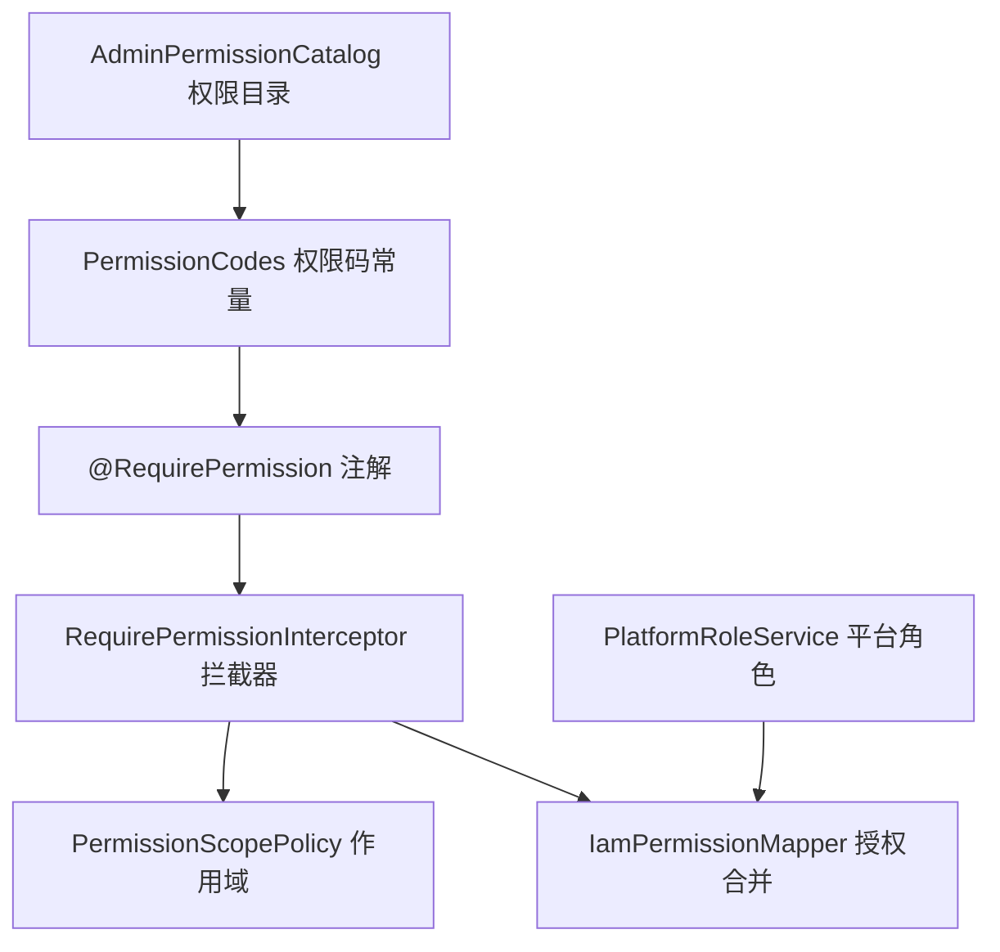
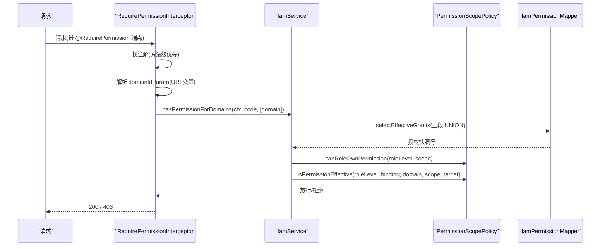
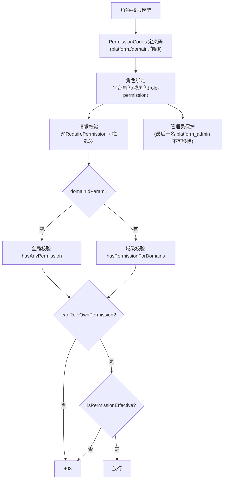
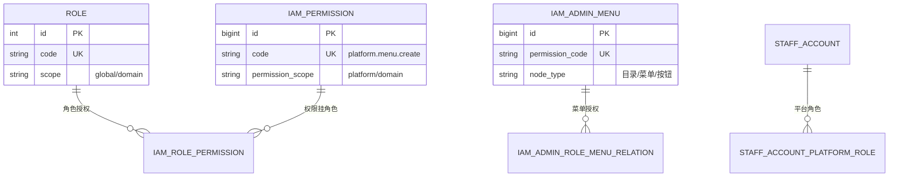
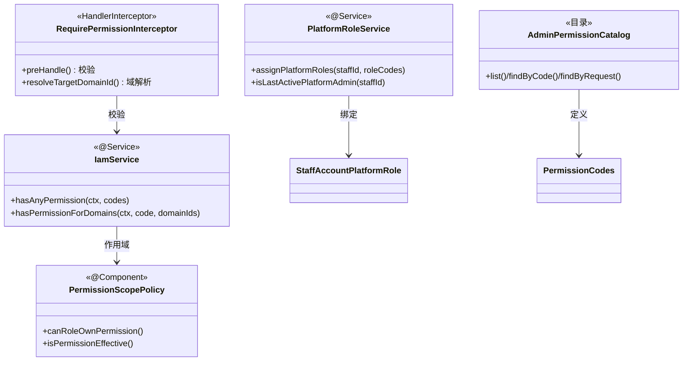

<cite>
- [UnionDesk/uniondesk-iam/src/main/java/com/uniondesk/iam/core/PermissionCodes.java](file://UnionDesk/uniondesk-iam/src/main/java/com/uniondesk/iam/core/PermissionCodes.java#L3-L60)
- [UnionDesk/uniondesk-iam/src/main/java/com/uniondesk/iam/web/RequirePermissionInterceptor.java](file://UnionDesk/uniondesk-iam/src/main/java/com/uniondesk/iam/web/RequirePermissionInterceptor.java#L22-L81)
- [UnionDesk/uniondesk-iam/src/main/java/com/uniondesk/iam/core/PermissionScopePolicy.java](file://UnionDesk/uniondesk-iam/src/main/java/com/uniondesk/iam/core/PermissionScopePolicy.java#L7-L79)
- [UnionDesk/uniondesk-iam/src/main/java/com/uniondesk/iam/core/PlatformRoleService.java](file://UnionDesk/uniondesk-iam/src/main/java/com/uniondesk/iam/core/PlatformRoleService.java#L14-L64)
- [UnionDesk/uniondesk-iam/src/main/java/com/uniondesk/iam/core/PlatformRoleService.java](file://UnionDesk/uniondesk-iam/src/main/java/com/uniondesk/iam/core/PlatformRoleService.java#L84-L104)
- [UnionDesk/uniondesk-iam/src/main/java/com/uniondesk/iam/admin/AdminPermissionCatalog.java](file://UnionDesk/uniondesk-iam/src/main/java/com/uniondesk/iam/admin/AdminPermissionCatalog.java#L12-L12)
- [UnionDesk/uniondesk-iam/src/main/java/com/uniondesk/iam/admin/AdminPermissionCatalog.java](file://UnionDesk/uniondesk-iam/src/main/java/com/uniondesk/iam/admin/AdminPermissionCatalog.java#L457-L499)
- [UnionDesk/uniondesk-iam/src/main/resources/mapper/iam/IamPermissionMapper.xml](file://UnionDesk/uniondesk-iam/src/main/resources/mapper/iam/IamPermissionMapper.xml#L26-L77)
</cite>

# UnionDesk 基于角色的权限控制

## 简介

本文档详解基于角色的权限控制（RBAC）：权限码模型（`PermissionCodes` 常量 + `iam_permission` 表 + `AdminPermissionCatalog` 目录）、`@RequirePermission` 注解 + `RequirePermissionInterceptor` 拦截器（方法/类级 + 域参数）、`PermissionScopePolicy` 数据范围矩阵、角色绑定（平台角色 `PlatformRoleService` / 域角色）、菜单与按钮级权限。RBAC 是「谁在哪个域能做什么」的执行引擎。

章节来源：
- [UnionDesk/uniondesk-iam/src/main/java/com/uniondesk/iam/core/PermissionCodes.java](file://UnionDesk/uniondesk-iam/src/main/java/com/uniondesk/iam/core/PermissionCodes.java#L3-L60)
- [UnionDesk/uniondesk-iam/src/main/java/com/uniondesk/iam/web/RequirePermissionInterceptor.java](file://UnionDesk/uniondesk-iam/src/main/java/com/uniondesk/iam/web/RequirePermissionInterceptor.java#L22-L55)

## 项目结构

RBAC 组件：



图表来源：
- [UnionDesk/uniondesk-iam/src/main/java/com/uniondesk/iam/web/RequirePermissionInterceptor.java](file://UnionDesk/uniondesk-iam/src/main/java/com/uniondesk/iam/web/RequirePermissionInterceptor.java#L22-L29)
- [UnionDesk/uniondesk-iam/src/main/java/com/uniondesk/iam/admin/AdminPermissionCatalog.java](file://UnionDesk/uniondesk-iam/src/main/java/com/uniondesk/iam/admin/AdminPermissionCatalog.java#L12-L12)

## 核心组件

**1. 权限码模型（PermissionCodes）**：`platform.*`/`domain.*` 双前缀常量（L5-60）——`资源.动作` 三段式；Controller 注解直接引用（编译期校验）。

**2. 权限目录（AdminPermissionCatalog）**：`list()` 全量定义（L457）、`findByCode`（L461）、`findByRequest(method, path)`（L468）——权限定义集中注册（含路由映射）；`PermissionDefinition` record（L492-499）。

**3. 注解+拦截器**：`@RequirePermission(value, domainIdParam)`（见 IAM 文档）；拦截器 `preHandle`（L32-55）——方法级注解优先、类级兜底（L72-80）；无域参数全局校验（L42-46）、有域参数解析 URI 变量域级校验（L48-54）。

**4. 作用域策略（PermissionScopePolicy）**：`canRoleOwnPermission`（L16-38）——global 角色只能 platform 前缀权限、domain 角色不能 platform 前缀；`isPermissionEffective`（L40-64）——平台权限仅 global+global 绑定生效、域权限要求域绑定+目标域匹配。

**5. 平台角色（PlatformRoleService）**：`assignPlatformRoles`（L30-64）——回收 platform_admin 前检查「最后一名激活管理员」保护（L33-41）；`isLastActivePlatformAdmin/isLastDomainSuperAdmin/isLastDomainAdmin`（L84-104）——防角色回收导致无管理员。

**6. 授权合并（IamPermissionMapper.selectEffectiveGrants）**：三段 UNION（平台角色/域成员角色/客户角色，L26-77）输出 `role_level/binding_scope/business_domain_id/permission_scope` 快照。

章节来源：
- [UnionDesk/uniondesk-iam/src/main/java/com/uniondesk/iam/web/RequirePermissionInterceptor.java](file://UnionDesk/uniondesk-iam/src/main/java/com/uniondesk/iam/web/RequirePermissionInterceptor.java#L32-L81)
- [UnionDesk/uniondesk-iam/src/main/java/com/uniondesk/iam/core/PlatformRoleService.java](file://UnionDesk/uniondesk-iam/src/main/java/com/uniondesk/iam/core/PlatformRoleService.java#L30-L64)
- [UnionDesk/uniondesk-iam/src/main/java/com/uniondesk/iam/core/PermissionScopePolicy.java](file://UnionDesk/uniondesk-iam/src/main/java/com/uniondesk/iam/core/PermissionScopePolicy.java#L16-L64)

## 架构总览

请求权限判定链路：



图表来源：
- [UnionDesk/uniondesk-iam/src/main/java/com/uniondesk/iam/web/RequirePermissionInterceptor.java](file://UnionDesk/uniondesk-iam/src/main/java/com/uniondesk/iam/web/RequirePermissionInterceptor.java#L32-L55)
- [UnionDesk/uniondesk-iam/src/main/java/com/uniondesk/iam/core/PermissionScopePolicy.java](file://UnionDesk/uniondesk-iam/src/main/java/com/uniondesk/iam/core/PermissionScopePolicy.java#L40-L64)

## 详细分析

**RBAC 设计要点**：

1. **权限码三段式 + 双前缀**：`作用域前缀.资源.动作`（`platform.menu.create`/`domain.customer.read`）——前缀即作用域声明，`PermissionScopePolicy` 用前缀判定角色可拥有性（L24-36）——模型层防越权挂载。
2. **注解双级 + 域参数**：方法级注解优先、类级兜底（L72-80）；`domainIdParam` 从 URI 模板解析目标域（L57-70）——「有权限 + 在目标域」双因子。
3. **作用域有效性矩阵**：`isPermissionEffective`（L40-64）四维判定（roleLevel/bindingScope/domain/scope）——平台权限必须 global+global，域权限必须域绑定且目标域匹配（或 null 通配）。
4. **管理员保护**：`PlatformRoleService`——移除最后一名 platform_admin 拒绝（L33-41）；`isLastDomainSuperAdmin/isLastDomainAdmin`（L104-125）防域角色回收失控。
5. **三段 UNION 授权**：平台角色（global 绑定）+ 域成员角色（域绑定）+ 客户固定角色（customer）合并快照（IamPermissionMapper L26-77）——一次查询完成全部授权数据。
6. **菜单/按钮级权限**：`iam_admin_menu.permission_code` 挂菜单/按钮；前端 `AuthGuarded`/`AccessControl` 渲染——后端接口校验 + 前端按钮隐藏双保险。
7. **权限目录可查**：`AdminPermissionCatalog.findByRequest(method, path)`（L468）——接口路由级权限定义可审计。



图表来源：
- [UnionDesk/uniondesk-iam/src/main/java/com/uniondesk/iam/web/RequirePermissionInterceptor.java](file://UnionDesk/uniondesk-iam/src/main/java/com/uniondesk/iam/web/RequirePermissionInterceptor.java#L42-L55)
- [UnionDesk/uniondesk-iam/src/main/java/com/uniondesk/iam/core/PlatformRoleService.java](file://UnionDesk/uniondesk-iam/src/main/java/com/uniondesk/iam/core/PlatformRoleService.java#L33-L41)
- [UnionDesk/uniondesk-iam/src/main/java/com/uniondesk/iam/core/PermissionScopePolicy.java](file://UnionDesk/uniondesk-iam/src/main/java/com/uniondesk/iam/core/PermissionScopePolicy.java#L24-L38)

## 数据模型

RBAC 数据模型：



图表来源：
- [UnionDesk/uniondesk-iam/src/main/java/com/uniondesk/iam/core/PermissionCodes.java](file://UnionDesk/uniondesk-iam/src/main/java/com/uniondesk/iam/core/PermissionCodes.java#L5-L36)
- [UnionDesk/uniondesk-iam/src/main/resources/mapper/iam/IamPermissionMapper.xml](file://UnionDesk/uniondesk-iam/src/main/resources/mapper/iam/IamPermissionMapper.xml#L26-L77)

## 依赖关系分析



图表来源：
- [UnionDesk/uniondesk-iam/src/main/java/com/uniondesk/iam/web/RequirePermissionInterceptor.java](file://UnionDesk/uniondesk-iam/src/main/java/com/uniondesk/iam/web/RequirePermissionInterceptor.java#L25-L29)
- [UnionDesk/uniondesk-iam/src/main/java/com/uniondesk/iam/core/PlatformRoleService.java](file://UnionDesk/uniondesk-iam/src/main/java/com/uniondesk/iam/core/PlatformRoleService.java#L14-L18)
- [UnionDesk/uniondesk-iam/src/main/java/com/uniondesk/iam/admin/AdminPermissionCatalog.java](file://UnionDesk/uniondesk-iam/src/main/java/com/uniondesk/iam/admin/AdminPermissionCatalog.java#L457-L499)

## 性能与安全考虑

- **性能**：权限快照 30s 缓存；三段 UNION 一次查询；`findByRequest` 目录 O(1) 路由匹配。
- **安全**：作用域矩阵防越权挂载（global/domain 前缀约束）；域参数解析防跨域；管理员保护防权限失控；权限码常量编译期校验防字符串漂移。
- **一致性**：角色-权限复合唯一键；菜单 permission_code 唯一；快照缓存可失效。
- **可审计**：权限变更写审计（`PLATFORM_ROLE_PERMISSIONS_UPDATE`）；`AdminPermissionCatalog` 定义可查。

章节来源：
- [UnionDesk/uniondesk-iam/src/main/java/com/uniondesk/iam/core/PlatformRoleService.java](file://UnionDesk/uniondesk-iam/src/main/java/com/uniondesk/iam/core/PlatformRoleService.java#L30-L64)
- [UnionDesk/uniondesk-iam/src/main/java/com/uniondesk/iam/core/PermissionScopePolicy.java](file://UnionDesk/uniondesk-iam/src/main/java/com/uniondesk/iam/core/PermissionScopePolicy.java#L16-L38)

## 故障排查指南

| 现象 | 原因 | 处理建议 |
| --- | --- | --- |
| 域管理员无法操作 | 权限作用域不匹配（domain 角色挂 platform 权限） | 检查 `PermissionScopePolicy` 前缀规则；重挂权限 |
| 移除平台管理员失败 | 「最后一名」保护触发 | 先指定另一位 platform_admin |
| 接口 403 但角色有码 | 域参数解析失败或绑定缺失 | 检查 `domainIdParam` 与 URI 变量；核对绑定 |
| 菜单显示但操作 403 | 菜单授权与权限码授权不同步 | 同步 `iam_admin_role_menu_relation` 与 `iam_role_permission` |
| 权限变更不生效 | 快照缓存未失效 | 调 `evictAuthorizationCache` |

章节来源：
- [UnionDesk/uniondesk-iam/src/main/java/com/uniondesk/iam/core/PlatformRoleService.java](file://UnionDesk/uniondesk-iam/src/main/java/com/uniondesk/iam/core/PlatformRoleService.java#L36-L41)
- [UnionDesk/uniondesk-iam/src/main/java/com/uniondesk/iam/web/RequirePermissionInterceptor.java](file://UnionDesk/uniondesk-iam/src/main/java/com/uniondesk/iam/web/RequirePermissionInterceptor.java#L48-L54)

## 结论

基于角色的权限控制以「**权限码三段式、注解+拦截器、作用域矩阵、管理员保护**」为核心：`PermissionCodes` 双前缀权限码 + `AdminPermissionCatalog` 目录定义，`@RequirePermission` + 拦截器完成「全局/域级」双模式校验，`PermissionScopePolicy` 用严格矩阵约束权限归属与生效域，`PlatformRoleService` 保护最后一名管理员，三段 UNION 合并授权快照。菜单/按钮/接口三级权限全覆盖，是系统 RBAC 的执行引擎。

章节来源：
- [UnionDesk/uniondesk-iam/src/main/java/com/uniondesk/iam/web/RequirePermissionInterceptor.java](file://UnionDesk/uniondesk-iam/src/main/java/com/uniondesk/iam/web/RequirePermissionInterceptor.java#L22-L81)
- [UnionDesk/uniondesk-iam/src/main/java/com/uniondesk/iam/core/PermissionScopePolicy.java](file://UnionDesk/uniondesk-iam/src/main/java/com/uniondesk/iam/core/PermissionScopePolicy.java#L7-L79)

## 附录

RBAC 验证命令：

```bash
# 1. 权限目录
curl http://127.0.0.1:8080/api/v1/iam/admin-permission-codes -H "Authorization: Bearer <token>"

# 2. 角色列表与权限
curl http://127.0.0.1:8080/api/v1/iam/roles -H "Authorization: Bearer <token>"
curl http://127.0.0.1:8080/api/v1/iam/roles/3/permissions -H "Authorization: Bearer <token>"

# 3. 员工平台角色
curl http://127.0.0.1:8080/api/v1/admin/staff/1001/platform-roles -H "Authorization: Bearer <token>"

# 4. 越权验证（无权限码端点 → 403 信封）
curl http://127.0.0.1:8080/api/v1/admin/domains -H "Authorization: Bearer <guest-token>" -H "X-UD-Client-Code: ud-admin-web"
```

章节来源：
- [UnionDesk/uniondesk-iam/src/main/java/com/uniondesk/iam/admin/AdminPermissionCatalog.java](file://UnionDesk/uniondesk-iam/src/main/java/com/uniondesk/iam/admin/AdminPermissionCatalog.java#L457-L499)
- [UnionDesk/uniondesk-iam/src/main/java/com/uniondesk/iam/core/PlatformRoleService.java](file://UnionDesk/uniondesk-iam/src/main/java/com/uniondesk/iam/core/PlatformRoleService.java#L69-L104)
