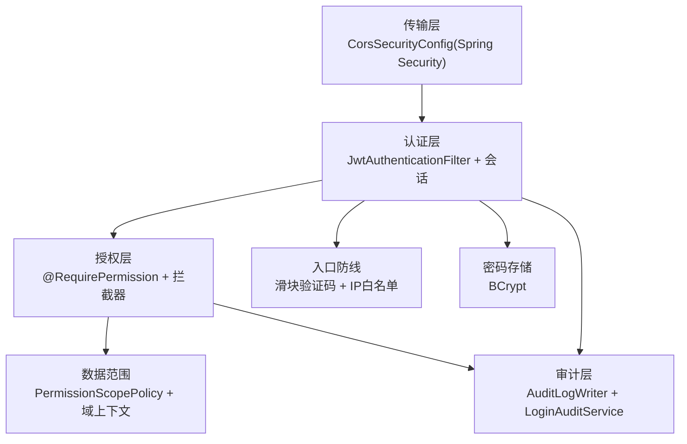
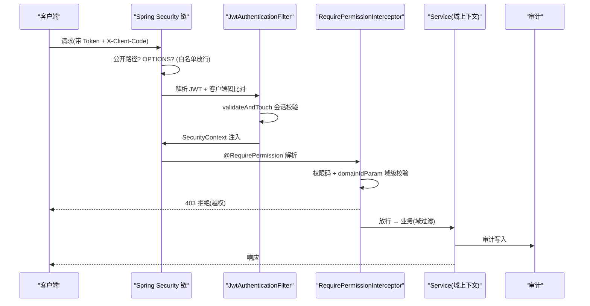
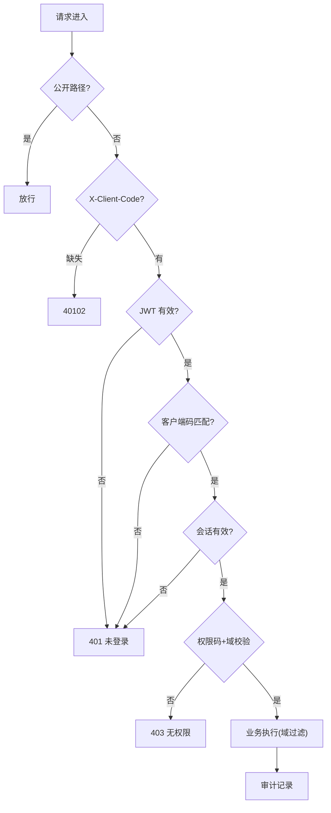
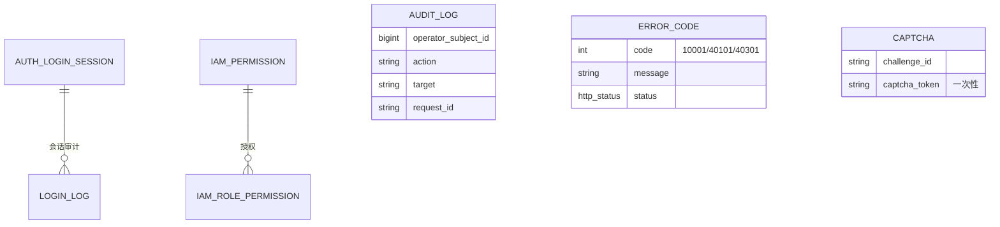
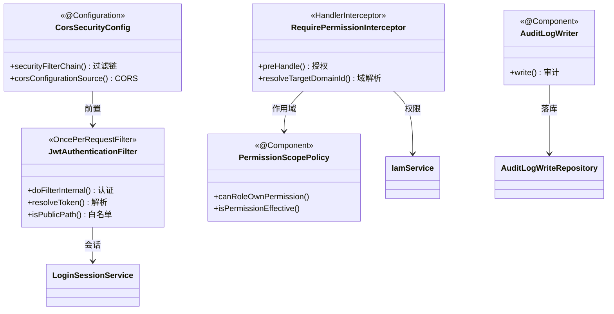

<cite>
- [UnionDesk/uniondesk-app/src/main/java/com/uniondesk/common/web/CorsSecurityConfig.java](file://UnionDesk/uniondesk-app/src/main/java/com/uniondesk/common/web/CorsSecurityConfig.java#L19-L63)
- [UnionDesk/uniondesk-app/src/main/java/com/uniondesk/common/web/CorsSecurityConfig.java](file://UnionDesk/uniondesk-app/src/main/java/com/uniondesk/common/web/CorsSecurityConfig.java#L65-L74)
- [UnionDesk/uniondesk-iam/src/main/java/com/uniondesk/auth/core/JwtAuthenticationFilter.java](file://UnionDesk/uniondesk-iam/src/main/java/com/uniondesk/auth/core/JwtAuthenticationFilter.java#L24-L80)
- [UnionDesk/uniondesk-iam/src/main/java/com/uniondesk/iam/core/RequirePermission.java](file://UnionDesk/uniondesk-iam/src/main/java/com/uniondesk/iam/core/RequirePermission.java#L8-L19)
- [UnionDesk/uniondesk-common/src/main/java/com/uniondesk/common/web/ErrorCodes.java](file://UnionDesk/uniondesk-common/src/main/java/com/uniondesk/common/web/ErrorCodes.java#L6-L19)
- [UnionDesk/uniondesk-iam/src/main/java/com/uniondesk/auth/core/AuthCaptchaService.java](file://UnionDesk/uniondesk-iam/src/main/java/com/uniondesk/auth/core/AuthCaptchaService.java#L39-L59)
- [UnionDesk/uniondesk-support/src/main/java/com/uniondesk/audit/core/AuditLogService.java](file://UnionDesk/uniondesk-support/src/main/java/com/uniondesk/audit/core/AuditLogService.java#L16-L25)
</cite>

# UnionDesk 安全设计总览

## 简介

本文档总览 UnionDesk 安全设计：认证（JWT 过滤器 + 登录会话双轨）、授权（权限码 + 域级数据范围）、传输安全（Spring Security 过滤链 + CORS）、审计与登录日志、密码存储（BCrypt）与滑块验证码。安全防线从「网络层 → 认证层 → 授权层 → 审计层」四层纵深。

章节来源：
- [UnionDesk/uniondesk-app/src/main/java/com/uniondesk/common/web/CorsSecurityConfig.java](file://UnionDesk/uniondesk-app/src/main/java/com/uniondesk/common/web/CorsSecurityConfig.java#L19-L63)
- [UnionDesk/uniondesk-iam/src/main/java/com/uniondesk/auth/core/JwtAuthenticationFilter.java](file://UnionDesk/uniondesk-iam/src/main/java/com/uniondesk/auth/core/JwtAuthenticationFilter.java#L24-L80)

## 项目结构

安全组件分层：



图表来源：
- [UnionDesk/uniondesk-app/src/main/java/com/uniondesk/common/web/CorsSecurityConfig.java](file://UnionDesk/uniondesk-app/src/main/java/com/uniondesk/common/web/CorsSecurityConfig.java#L23-L62)
- [UnionDesk/uniondesk-iam/src/main/java/com/uniondesk/auth/core/JwtAuthenticationFilter.java](file://UnionDesk/uniondesk-iam/src/main/java/com/uniondesk/auth/core/JwtAuthenticationFilter.java#L24-L51)

## 核心组件

**1. 传输层（CorsSecurityConfig）**：`@EnableWebSecurity` 过滤链（L19-21）——CSRF 禁用 + STATELESS 会话（L26-27）；401/403 统一 JSON 信封（L31-43）；公开路径白名单（登录/注册/验证码/刷新/健康，L46-58）+ `/api/v1/**` 需认证（L59）；`JwtAuthenticationFilter` 前置（L61）；CORS 全放行（L65-74，开发友好）。

**2. 认证层（JwtAuthenticationFilter）**：`OncePerRequestFilter`（L25）——公开路径/OPTIONS 直放（L59-62）；`X-Client-Code` 头必填（L63-67，缺失 40102）；解析 Bearer token → 客户端码比对（L72-74）→ `validateAndTouch` 会话校验+续期（L75）→ 注入 SecurityContext（L77-80）。

**3. 授权层**：`@RequirePermission`（value 权限码 + domainIdParam 域参数，L8-19）+ `RequirePermissionInterceptor`（方法/类级注解解析 + 域级校验）——按钮级粒度 + 接口级路由校验。

**4. 数据范围**：`PermissionScopePolicy`（平台/域/shared 三级矩阵）+ 域上下文（`business_domain_id` 全查询强制过滤）——防跨租户越权。

**5. 入口防线**：滑块验证码（轨迹四条件 + 一次性消费，AuthCaptchaService L39-59）+ IP 白名单 + 失败锁定（10006）。

**6. 审计层**：`AuditLogWriter` 操作审计 + `LoginAuditService` 登录审计 + `AuditLogService` 双维度查询（L16-25）——全操作可追溯。

**7. 密码存储**：BCrypt（`PasswordEncoder`）——只存哈希。

章节来源：
- [UnionDesk/uniondesk-app/src/main/java/com/uniondesk/common/web/CorsSecurityConfig.java](file://UnionDesk/uniondesk-app/src/main/java/com/uniondesk/common/web/CorsSecurityConfig.java#L23-L62)
- [UnionDesk/uniondesk-iam/src/main/java/com/uniondesk/auth/core/JwtAuthenticationFilter.java](file://UnionDesk/uniondesk-iam/src/main/java/com/uniondesk/auth/core/JwtAuthenticationFilter.java#L53-L80)
- [UnionDesk/uniondesk-iam/src/main/java/com/uniondesk/iam/core/RequirePermission.java](file://UnionDesk/uniondesk-iam/src/main/java/com/uniondesk/iam/core/RequirePermission.java#L8-L19)

## 架构总览

一次请求穿越四层防线的时序：



图表来源：
- [UnionDesk/uniondesk-app/src/main/java/com/uniondesk/common/web/CorsSecurityConfig.java](file://UnionDesk/uniondesk-app/src/main/java/com/uniondesk/common/web/CorsSecurityConfig.java#L44-L61)
- [UnionDesk/uniondesk-iam/src/main/java/com/uniondesk/auth/core/JwtAuthenticationFilter.java](file://UnionDesk/uniondesk-iam/src/main/java/com/uniondesk/auth/core/JwtAuthenticationFilter.java#L59-L80)

## 详细分析

**安全设计要点**：

1. **双轨认证**：JWT 无状态令牌（扩展性）+ 会话表（`validateAndTouch` 续期、`revokeSession` 吊销）——两者配合：令牌过期可刷新、会话可强制下线。
2. **客户端标识强制**：`X-Client-Code` 缺失即 40102（L63-67）；token 内 `cid` 与头比对（L72-74）——防令牌跨客户端复用。
3. **公开面最小化**：仅登录/注册/验证码/刷新/健康等公开（CorsSecurityConfig L46-58 + JwtAuthenticationFilter L28-38 双白名单）；`/api/v1/**` 一律认证（L59）。
4. **统一错误语义**：401（`UNAUTHORIZED 40101`）+ 403（`FORBIDDEN 40301`）JSON 信封（L31-43）——前端按 code 分支。
5. **域级授权**：权限码 + `domainIdParam` 双因子——「有权限 + 在目标域」才放行；数据范围策略（PermissionScopePolicy）约束权限归属。
6. **审计闭环**：登录/操作全记录（操作者/动作/目标/requestId）——安全事件可追溯。
7. **CORS 策略**：开发全放行（L65-74）——生产应收紧 origin 白名单（配置化）。



图表来源：
- [UnionDesk/uniondesk-app/src/main/java/com/uniondesk/common/web/CorsSecurityConfig.java](file://UnionDesk/uniondesk-app/src/main/java/com/uniondesk/common/web/CorsSecurityConfig.java#L44-L61)
- [UnionDesk/uniondesk-iam/src/main/java/com/uniondesk/auth/core/JwtAuthenticationFilter.java](file://UnionDesk/uniondesk-iam/src/main/java/com/uniondesk/auth/core/JwtAuthenticationFilter.java#L59-L80)

## 数据模型

安全相关实体：



图表来源：
- [UnionDesk/uniondesk-common/src/main/java/com/uniondesk/common/web/ErrorCodes.java](file://UnionDesk/uniondesk-common/src/main/java/com/uniondesk/common/web/ErrorCodes.java#L6-L19)
- [UnionDesk/uniondesk-iam/src/main/java/com/uniondesk/auth/core/AuthCaptchaService.java](file://UnionDesk/uniondesk-iam/src/main/java/com/uniondesk/auth/core/AuthCaptchaService.java#L39-L59)

## 依赖关系分析



图表来源：
- [UnionDesk/uniondesk-app/src/main/java/com/uniondesk/common/web/CorsSecurityConfig.java](file://UnionDesk/uniondesk-app/src/main/java/com/uniondesk/common/web/CorsSecurityConfig.java#L23-L62)
- [UnionDesk/uniondesk-iam/src/main/java/com/uniondesk/auth/core/JwtAuthenticationFilter.java](file://UnionDesk/uniondesk-iam/src/main/java/com/uniondesk/auth/core/JwtAuthenticationFilter.java#L40-L51)

## 性能与安全考虑

- **性能**：JWT 解析免查库（无状态）；会话 `validateAndTouch` 轻量续期；权限快照 30s 缓存。
- **安全**：BCrypt 密码；refresh 令牌哈希存储；验证码一次性消费防重放；`X-Client-Code` 防跨端复用；CSRF 禁用但依赖 Bearer 头（非 Cookie）无 CSRF 面；审计全记录。
- **一致性**：双白名单（Security 链 + 过滤器）保持同步；401/403 信封统一；错误码分层。
- **运维**：CORS 生产收紧；`INTERNAL_ERROR` 只记日志不泄露堆栈。

章节来源：
- [UnionDesk/uniondesk-app/src/main/java/com/uniondesk/common/web/CorsSecurityConfig.java](file://UnionDesk/uniondesk-app/src/main/java/com/uniondesk/common/web/CorsSecurityConfig.java#L26-L43)
- [UnionDesk/uniondesk-iam/src/main/java/com/uniondesk/auth/core/JwtAuthenticationFilter.java](file://UnionDesk/uniondesk-iam/src/main/java/com/uniondesk/auth/core/JwtAuthenticationFilter.java#L63-L80)

## 故障排查指南

| 现象 | 原因 | 处理建议 |
| --- | --- | --- |
| 登录接口 40102 | 请求缺 `X-Client-Code` 头 | 检查前端头注入（CLIENT_CODE_HEADER） |
| 登录后接口 401 | 会话未落库或客户端码不匹配 | 检查 `createSession` 与 token cid 比对 |
| 403 但权限已配 | 权限码绑定缺失或域参数错误 | 核对 `iam_role_permission`；检查 `domainIdParam` |
| CORS 跨域失败 | 生产 origin 未放行 | 收紧/核对 `CorsConfiguration` 白名单 |
| 会话吊销不生效 | `revokeSession` 未触发或缓存 | 检查吊销调用点与 `validateAndTouch` |

章节来源：
- [UnionDesk/uniondesk-iam/src/main/java/com/uniondesk/auth/core/JwtAuthenticationFilter.java](file://UnionDesk/uniondesk-iam/src/main/java/com/uniondesk/auth/core/JwtAuthenticationFilter.java#L63-L76)
- [UnionDesk/uniondesk-app/src/main/java/com/uniondesk/common/web/CorsSecurityConfig.java](file://UnionDesk/uniondesk-app/src/main/java/com/uniondesk/common/web/CorsSecurityConfig.java#L65-L74)

## 结论

UnionDesk 安全设计以「**四层纵深：传输 → 认证 → 授权 → 审计**」为核心：Spring Security 过滤链统一入口（公开面最小化 + 401/403 信封），JWT 过滤器 + 会话双轨认证（客户端码强制 + 会话续期/吊销），`@RequirePermission` + 拦截器 + 作用域策略授权（按钮级 + 域级数据范围），审计与登录日志闭环追溯；密码 BCrypt、验证码防机器、错误码分层。安全是系统全生命周期的第一公民。

章节来源：
- [UnionDesk/uniondesk-app/src/main/java/com/uniondesk/common/web/CorsSecurityConfig.java](file://UnionDesk/uniondesk-app/src/main/java/com/uniondesk/common/web/CorsSecurityConfig.java#L19-L74)
- [UnionDesk/uniondesk-iam/src/main/java/com/uniondesk/auth/core/JwtAuthenticationFilter.java](file://UnionDesk/uniondesk-iam/src/main/java/com/uniondesk/auth/core/JwtAuthenticationFilter.java#L24-L80)

## 附录

安全验证命令：

```bash
# 1. 公开端点（无需 Token）
curl http://127.0.0.1:8080/api/health

# 2. 缺 X-Client-Code（期望 40102）
curl http://127.0.0.1:8080/api/v1/auth/me

# 3. 缺 Token（期望 401 信封）
curl http://127.0.0.1:8080/api/v1/auth/me -H "X-Client-Code: ud-admin-web"

# 4. 越权访问（期望 403 信封）
curl http://127.0.0.1:8080/api/v1/admin/domains -H "Authorization: Bearer <guest-token>" -H "X-Client-Code: ud-admin-web"

# 5. 审计追溯
curl "http://127.0.0.1:8080/api/v1/admin/audit-logs?page=1&page_size=20" -H "Authorization: Bearer <admin-token>"
```

章节来源：
- [UnionDesk/uniondesk-app/src/main/java/com/uniondesk/common/web/CorsSecurityConfig.java](file://UnionDesk/uniondesk-app/src/main/java/com/uniondesk/common/web/CorsSecurityConfig.java#L46-L60)
- [UnionDesk/uniondesk-support/src/main/java/com/uniondesk/audit/core/AuditLogService.java](file://UnionDesk/uniondesk-support/src/main/java/com/uniondesk/audit/core/AuditLogService.java#L16-L25)
