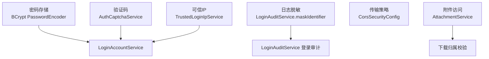
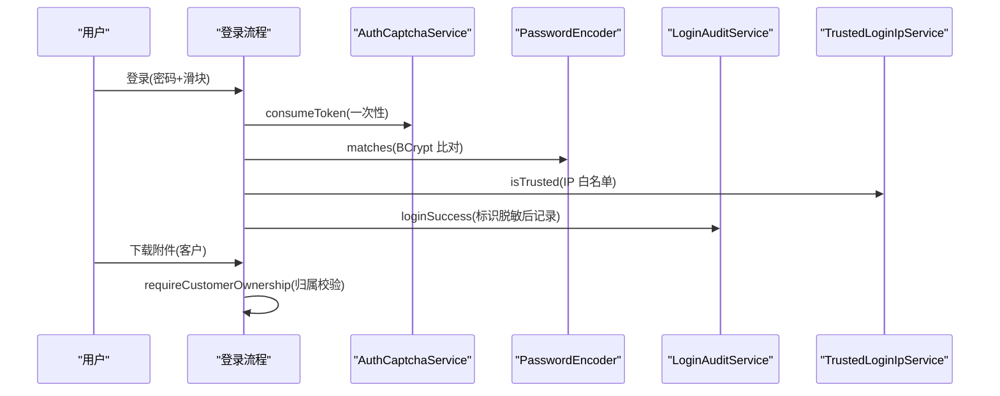
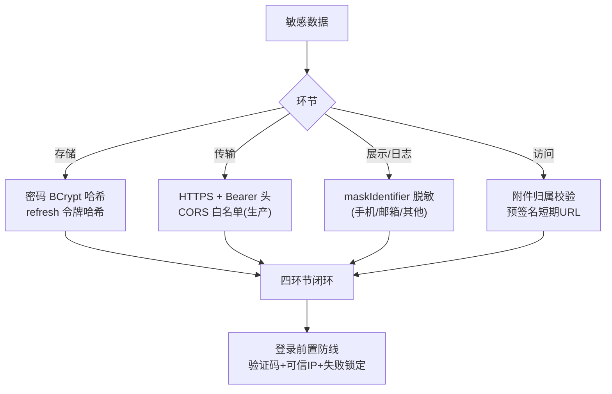
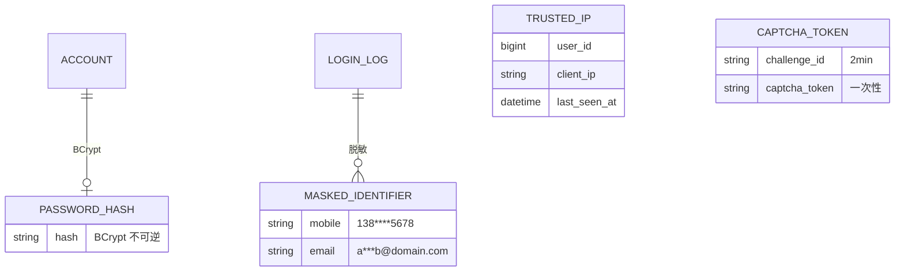
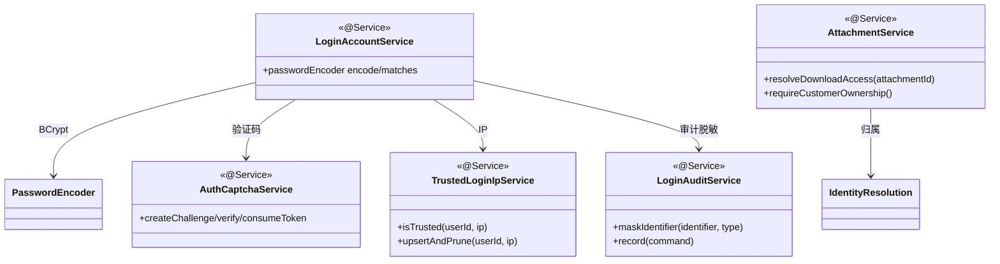

<cite>
- [UnionDesk/uniondesk-iam/src/main/java/com/uniondesk/auth/core/LoginAccountService.java](file://UnionDesk/uniondesk-iam/src/main/java/com/uniondesk/auth/core/LoginAccountService.java#L17-L21)
- [UnionDesk/uniondesk-iam/src/main/java/com/uniondesk/auth/core/LoginAccountService.java](file://UnionDesk/uniondesk-iam/src/main/java/com/uniondesk/auth/core/LoginAccountService.java#L95-L104)
- [UnionDesk/uniondesk-iam/src/main/java/com/uniondesk/auth/core/LoginAuditService.java](file://UnionDesk/uniondesk-iam/src/main/java/com/uniondesk/auth/core/LoginAuditService.java#L64-L81)
- [UnionDesk/uniondesk-iam/src/main/java/com/uniondesk/auth/core/AuthCaptchaService.java](file://UnionDesk/uniondesk-iam/src/main/java/com/uniondesk/auth/core/AuthCaptchaService.java#L39-L59)
- [UnionDesk/uniondesk-iam/src/main/java/com/uniondesk/auth/core/TrustedLoginIpService.java](file://UnionDesk/uniondesk-iam/src/main/java/com/uniondesk/auth/core/TrustedLoginIpService.java#L11-L51)
- [UnionDesk/uniondesk-app/src/main/java/com/uniondesk/common/web/CorsSecurityConfig.java](file://UnionDesk/uniondesk-app/src/main/java/com/uniondesk/common/web/CorsSecurityConfig.java#L65-L74)
- [UnionDesk/uniondesk-support/src/main/java/com/uniondesk/attachment/core/AttachmentService.java](file://UnionDesk/uniondesk-support/src/main/java/com/uniondesk/attachment/core/AttachmentService.java#L153-L173)
</cite>

# UnionDesk 敏感数据保护

## 简介

本文档详解敏感数据保护措施：密码散列存储（BCrypt `PasswordEncoder`）、登录验证码（滑块轨迹校验 + 一次性消费）、可信 IP（`TrustedLoginIpService` 白名单 + 上限裁剪）、登录日志脱敏（`LoginAuditService.maskIdentifier`）、CORS 策略、附件访问控制（下载归属校验）。敏感数据在「存储、传输、展示、访问」四个环节均有保护。

章节来源：
- [UnionDesk/uniondesk-iam/src/main/java/com/uniondesk/auth/core/LoginAccountService.java](file://UnionDesk/uniondesk-iam/src/main/java/com/uniondesk/auth/core/LoginAccountService.java#L17-L21)
- [UnionDesk/uniondesk-iam/src/main/java/com/uniondesk/auth/core/LoginAuditService.java](file://UnionDesk/uniondesk-iam/src/main/java/com/uniondesk/auth/core/LoginAuditService.java#L64-L81)

## 项目结构

敏感数据保护组件：



图表来源：
- [UnionDesk/uniondesk-iam/src/main/java/com/uniondesk/auth/core/LoginAccountService.java](file://UnionDesk/uniondesk-iam/src/main/java/com/uniondesk/auth/core/LoginAccountService.java#L13-L22)
- [UnionDesk/uniondesk-iam/src/main/java/com/uniondesk/auth/core/TrustedLoginIpService.java](file://UnionDesk/uniondesk-iam/src/main/java/com/uniondesk/auth/core/TrustedLoginIpService.java#L11-L21)

## 核心组件

**1. 密码散列存储（BCrypt）**：`LoginAccountService` 注入 `PasswordEncoder`（L17-21）；注册/改密用 `passwordEncoder.encode(rawPassword)`（L95/104）——只存哈希；登录用 `matches` 比对。

**2. 滑块验证码（AuthCaptchaService）**：challenge/verify 两段式（L39-48）——轨迹四条件（点数≥2/时长≥100ms/平均速度≤5/进度≥95）；`consumeToken` 一次性消费（L50-59）防重放。

**3. 可信 IP（TrustedLoginIpService）**：`isTrusted(userId, clientIp)`（L23-29）查询白名单；`upsertAndPrune`（L31-44）——登录成功 upsert + 超 `MAX_TRUSTED_IPS_PER_USER=10` 裁剪最旧（L13/40-43）——可信设备上限管理。

**4. 登录日志脱敏（maskIdentifier）**：手机号 `138****5678`（L69-71）；邮箱 `a***b@domain.com`（L72-79）；其他 `首***尾`（L80）——日志/会话不落明文标识。

**5. CORS 策略（CorsSecurityConfig）**：开发全放行（L65-74）——生产应配置 origin 白名单；配合 Bearer 头认证（非 Cookie）降低 CSRF 面。

**6. 附件访问控制（AttachmentService）**：`resolveDownloadAccess`（L153-162）——客户角色必须归属校验（上传者本人或关联其工单，L164-173）——防跨客户越权下载。

章节来源：
- [UnionDesk/uniondesk-iam/src/main/java/com/uniondesk/auth/core/LoginAccountService.java](file://UnionDesk/uniondesk-iam/src/main/java/com/uniondesk/auth/core/LoginAccountService.java#L95-L104)
- [UnionDesk/uniondesk-iam/src/main/java/com/uniondesk/auth/core/TrustedLoginIpService.java](file://UnionDesk/uniondesk-iam/src/main/java/com/uniondesk/auth/core/TrustedLoginIpService.java#L31-L44)
- [UnionDesk/uniondesk-support/src/main/java/com/uniondesk/attachment/core/AttachmentService.java](file://UnionDesk/uniondesk-support/src/main/java/com/uniondesk/attachment/core/AttachmentService.java#L164-L173)

## 架构总览

敏感数据保护的完整防线：



图表来源：
- [UnionDesk/uniondesk-iam/src/main/java/com/uniondesk/auth/core/AuthCaptchaService.java](file://UnionDesk/uniondesk-iam/src/main/java/com/uniondesk/auth/core/AuthCaptchaService.java#L50-L59)
- [UnionDesk/uniondesk-iam/src/main/java/com/uniondesk/auth/core/TrustedLoginIpService.java](file://UnionDesk/uniondesk-iam/src/main/java/com/uniondesk/auth/core/TrustedLoginIpService.java#L23-L29)

## 详细分析

**敏感数据保护设计要点**：

1. **密码四原则**：BCrypt 单向哈希（不可逆）；`encode` 仅注册/改密（L95/104）；`matches` 恒定时间比对防时序攻击；库中无明文/可逆密文。
2. **验证码双保险**：轨迹规则防机器（L39-48）+ token 一次性消费防重放（L50-59）——`challenges/tokens` 双 Map 内存态 + 过期清理。
3. **可信 IP 上限裁剪**：`upsertAndPrune` 登录成功自动登记（L32-38）+ 超 10 条删最旧（L40-43）——设备白名单有界增长。
4. **日志脱敏策略**：`maskIdentifier` 按标识类型差异化脱敏（L64-81）——手机号保前后缀、邮箱保首字符与域名、其他保首尾——审计/会话/日志不落明文。
5. **传输与跨域**：CORS 开发全放行、生产收紧（L65-74）；Bearer 头认证（非 Cookie）无 CSRF 面；HTTPS 部署传输加密（见部署文档）。
6. **附件归属校验**：客户下载必须「上传者本人」或「附件已关联其工单」（L164-173）——文件访问最小授权；预签名 URL 短期有效（presign 5 分钟）。



图表来源：
- [UnionDesk/uniondesk-iam/src/main/java/com/uniondesk/auth/core/LoginAuditService.java](file://UnionDesk/uniondesk-iam/src/main/java/com/uniondesk/auth/core/LoginAuditService.java#L64-L81)
- [UnionDesk/uniondesk-support/src/main/java/com/uniondesk/attachment/core/AttachmentService.java](file://UnionDesk/uniondesk-support/src/main/java/com/uniondesk/attachment/core/AttachmentService.java#L153-L173)

## 数据模型

敏感数据保护对象：



图表来源：
- [UnionDesk/uniondesk-iam/src/main/java/com/uniondesk/auth/core/TrustedLoginIpService.java](file://UnionDesk/uniondesk-iam/src/main/java/com/uniondesk/auth/core/TrustedLoginIpService.java#L13-L13)
- [UnionDesk/uniondesk-iam/src/main/java/com/uniondesk/auth/core/LoginAuditService.java](file://UnionDesk/uniondesk-iam/src/main/java/com/uniondesk/auth/core/LoginAuditService.java#L64-L81)

## 依赖关系分析



图表来源：
- [UnionDesk/uniondesk-iam/src/main/java/com/uniondesk/auth/core/LoginAccountService.java](file://UnionDesk/uniondesk-iam/src/main/java/com/uniondesk/auth/core/LoginAccountService.java#L16-L22)
- [UnionDesk/uniondesk-support/src/main/java/com/uniondesk/attachment/core/AttachmentService.java](file://UnionDesk/uniondesk-support/src/main/java/com/uniondesk/attachment/core/AttachmentService.java#L153-L162)

## 性能与安全考虑

- **性能**：验证码内存态零 IO；BCrypt 比对为唯一计算开销（可接受）；可信 IP upsert 单行。
- **安全**：密码/令牌只存哈希；日志脱敏防泄露；验证码防重放；IP 白名单 + 失败锁定；附件归属校验 + 短期预签名；CORS 生产收紧。
- **一致性**：脱敏规则统一（maskIdentifier）；可信 IP 上限裁剪防膨胀；错误码分层不泄露细节。
- **合规**：登录审计 + 操作审计全记录（脱敏后）——满足安全事件追溯。

章节来源：
- [UnionDesk/uniondesk-iam/src/main/java/com/uniondesk/auth/core/TrustedLoginIpService.java](file://UnionDesk/uniondesk-iam/src/main/java/com/uniondesk/auth/core/TrustedLoginIpService.java#L31-L44)
- [UnionDesk/uniondesk-iam/src/main/java/com/uniondesk/auth/core/LoginAuditService.java](file://UnionDesk/uniondesk-iam/src/main/java/com/uniondesk/auth/core/LoginAuditService.java#L64-L81)

## 故障排查指南

| 现象 | 原因 | 处理建议 |
| --- | --- | --- |
| 登录失败但密码正确 | 验证码/IP/锁定防线拦截 | 检查验证码 token、可信 IP、失败计数 |
| 日志出现明文手机号 | 脱敏规则未覆盖该路径 | 检查 `maskIdentifier` 调用点覆盖 |
| 可信 IP 列表异常 | upsert 未触发或裁剪误删 | 检查登录成功链路 `upsertAndPrune` |
| 附件下载 403 | 客户非上传者且未关联工单 | 检查 `attachment_ref` 绑定 |
| CORS 生产跨域失败 | origin 未在配置白名单 | 收紧/核对 `CorsConfiguration` |

章节来源：
- [UnionDesk/uniondesk-iam/src/main/java/com/uniondesk/auth/core/TrustedLoginIpService.java](file://UnionDesk/uniondesk-iam/src/main/java/com/uniondesk/auth/core/TrustedLoginIpService.java#L23-L29)
- [UnionDesk/uniondesk-support/src/main/java/com/uniondesk/attachment/core/AttachmentService.java](file://UnionDesk/uniondesk-support/src/main/java/com/uniondesk/attachment/core/AttachmentService.java#L164-L173)

## 结论

敏感数据保护以「**存储哈希化、传输最小化、展示脱敏化、访问授权化**」为核心：密码 BCrypt 不可逆、refresh 令牌哈希存储；滑块验证码 + 可信 IP + 失败锁定前置防线；`maskIdentifier` 按类型差异化脱敏日志与会话；CORS 生产收紧 + Bearer 头认证；附件下载按归属校验 + 短期预签名。四环节闭环保证敏感数据全生命周期可控。

章节来源：
- [UnionDesk/uniondesk-iam/src/main/java/com/uniondesk/auth/core/LoginAccountService.java](file://UnionDesk/uniondesk-iam/src/main/java/com/uniondesk/auth/core/LoginAccountService.java#L95-L104)
- [UnionDesk/uniondesk-iam/src/main/java/com/uniondesk/auth/core/LoginAuditService.java](file://UnionDesk/uniondesk-iam/src/main/java/com/uniondesk/auth/core/LoginAuditService.java#L64-L81)

## 附录

敏感数据验证命令：

```bash
# 1. 密码哈希验证（库中无明文）
mysql -u uniondesk_app -p -h 127.0.0.1 -P 30306 uniondesk \
  -e "SELECT username, password_hash FROM user_account LIMIT 1;"
# password_hash: $2a$10$...（BCrypt）

# 2. 登录日志脱敏检查
mysql -u uniondesk_app -p -h 127.0.0.1 -P 30306 uniondesk \
  -e "SELECT login_identifier_masked FROM auth_login_session LIMIT 5;"
# login_identifier_masked: 138****5678

# 3. 可信 IP 列表
curl http://127.0.0.1:8080/api/v1/auth/session -H "Authorization: Bearer <token>"

# 4. 附件越权验证（期望 403）
curl http://127.0.0.1:8080/api/v1/attachments/1001/download \
  -H "Authorization: Bearer <other-customer-token>"
```

章节来源：
- [UnionDesk/uniondesk-iam/src/main/java/com/uniondesk/auth/core/LoginAuditService.java](file://UnionDesk/uniondesk-iam/src/main/java/com/uniondesk/auth/core/LoginAuditService.java#L69-L80)
- [UnionDesk/uniondesk-app/src/main/java/com/uniondesk/common/web/CorsSecurityConfig.java](file://UnionDesk/uniondesk-app/src/main/java/com/uniondesk/common/web/CorsSecurityConfig.java#L65-L74)
