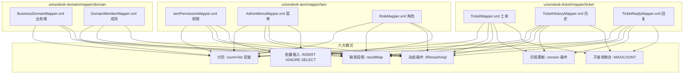
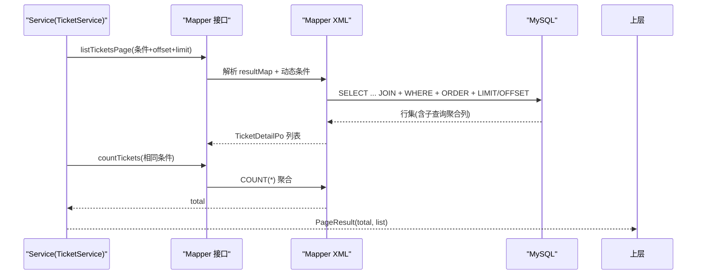
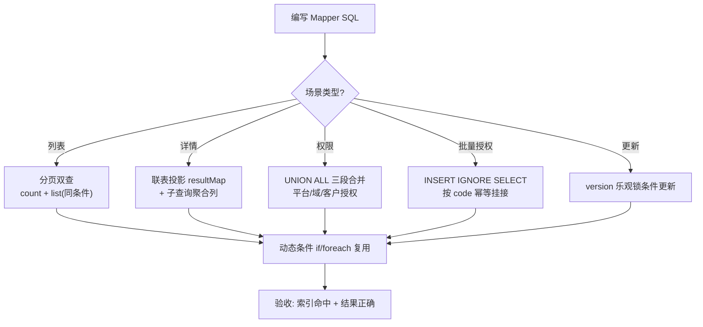
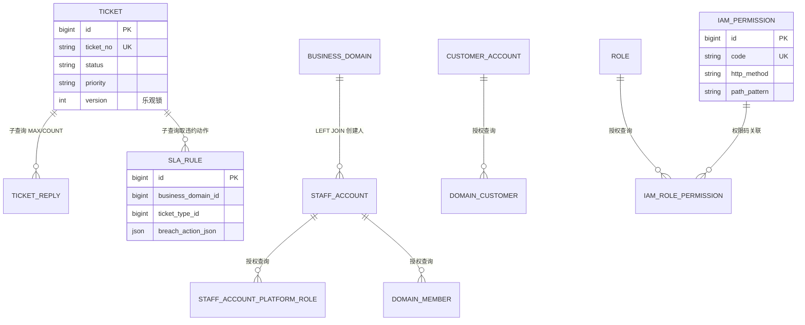
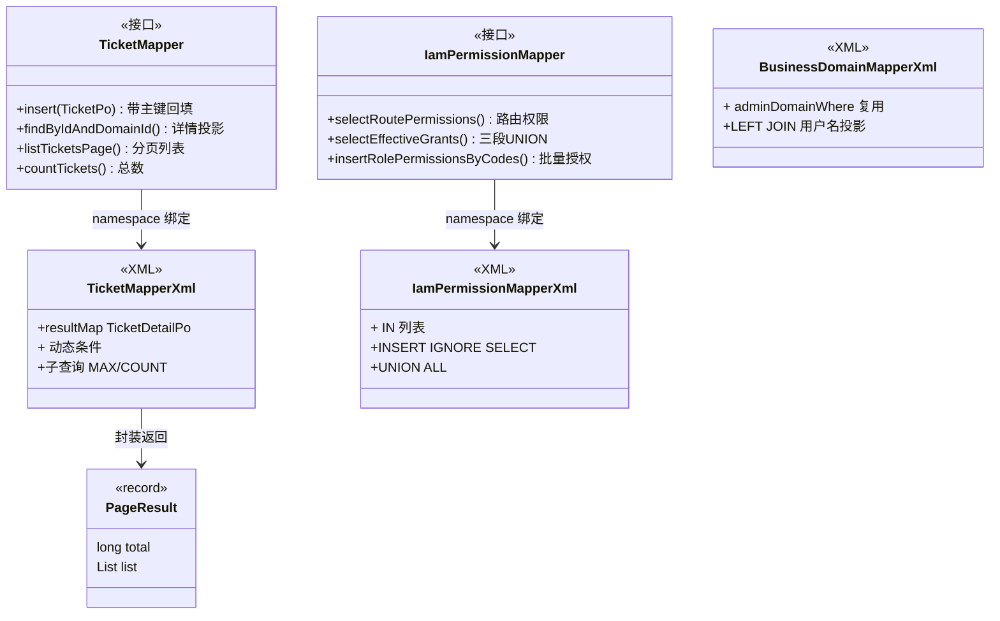

<cite>
- [UnionDesk/uniondesk-ticket/src/main/resources/mapper/ticket/TicketMapper.xml](file://UnionDesk/uniondesk-ticket/src/main/resources/mapper/ticket/TicketMapper.xml#L1-L52)
- [UnionDesk/uniondesk-ticket/src/main/resources/mapper/ticket/TicketMapper.xml](file://UnionDesk/uniondesk-ticket/src/main/resources/mapper/ticket/TicketMapper.xml#L54-L110)
- [UnionDesk/uniondesk-ticket/src/main/resources/mapper/ticket/TicketMapper.xml](file://UnionDesk/uniondesk-ticket/src/main/resources/mapper/ticket/TicketMapper.xml#L112-L162)
- [UnionDesk/uniondesk-ticket/src/main/resources/mapper/ticket/TicketMapper.xml](file://UnionDesk/uniondesk-ticket/src/main/resources/mapper/ticket/TicketMapper.xml#L164-L244)
- [UnionDesk/uniondesk-iam/src/main/resources/mapper/iam/IamPermissionMapper.xml](file://UnionDesk/uniondesk-iam/src/main/resources/mapper/iam/IamPermissionMapper.xml#L6-L24)
- [UnionDesk/uniondesk-iam/src/main/resources/mapper/iam/IamPermissionMapper.xml](file://UnionDesk/uniondesk-iam/src/main/resources/mapper/iam/IamPermissionMapper.xml#L26-L77)
- [UnionDesk/uniondesk-iam/src/main/resources/mapper/iam/IamPermissionMapper.xml](file://UnionDesk/uniondesk-iam/src/main/resources/mapper/iam/IamPermissionMapper.xml#L79-L94)
- [UnionDesk/uniondesk-domain/src/main/resources/mapper/domain/BusinessDomainMapper.xml](file://UnionDesk/uniondesk-domain/src/main/resources/mapper/domain/BusinessDomainMapper.xml#L26-L75)
- [UnionDesk/uniondesk-common/src/main/java/com/uniondesk/common/web/PageResult.java](file://UnionDesk/uniondesk-common/src/main/java/com/uniondesk/common/web/PageResult.java#L1-L6)
</cite>

# UnionDesk 典型查询模式总览

## 简介

本文档归纳 UnionDesk MyBatis XML Mapper 中反复出现的六大查询/写入模式：分页查询（count + list 双查）、联表投影（resultMap + 关联表）、动态条件（`<if>`/`<foreach>`/`<sql>` 复用）、批量插入（INSERT IGNORE SELECT）、乐观更新（version 条件）、子查询聚合（MAX/COUNT）。这些模式贯穿 ticket/iam/domain 各模块 Mapper，是理解与新增 SQL 的模板。

章节来源：
- [UnionDesk/uniondesk-ticket/src/main/resources/mapper/ticket/TicketMapper.xml](file://UnionDesk/uniondesk-ticket/src/main/resources/mapper/ticket/TicketMapper.xml#L112-L244)
- [UnionDesk/uniondesk-common/src/main/java/com/uniondesk/common/web/PageResult.java](file://UnionDesk/uniondesk-common/src/main/java/com/uniondesk/common/web/PageResult.java#L1-L6)

## 项目结构

查询模式按 Mapper 归属分布在各模块 resources/mapper 下：



图表来源：
- [UnionDesk/uniondesk-ticket/src/main/resources/mapper/ticket/TicketMapper.xml](file://UnionDesk/uniondesk-ticket/src/main/resources/mapper/ticket/TicketMapper.xml#L1-L52)
- [UnionDesk/uniondesk-iam/src/main/resources/mapper/iam/IamPermissionMapper.xml](file://UnionDesk/uniondesk-iam/src/main/resources/mapper/iam/IamPermissionMapper.xml#L79-L94)

## 核心组件

**模式一：分页双查（count + list）**
- `countTickets` 与 `listTicketsPage` 成对出现（TicketMapper L164-244）：count 返回 `long`，list 用 `LIMIT #{limit} OFFSET #{offset}`；`PageResult<T>(total, list)` 封装（L5-6）。
- `BusinessDomainMapper` 同样以 `countAdminDomains` + `selectAdminDomains` 成对实现（L46-75）。

**模式二：联表投影 + resultMap**
- `TicketDetailPo` resultMap（L6-36）把工单 + 业务域名称 + 类型名称 + SLA 规则 + 回复统计投影为一个 DTO。
- `selectAdminDomains` LEFT JOIN staff_account 取创建人/更新人用户名（L46-66）。

**模式三：动态条件**
- `<if>` 条件片段（TicketMapper L154-181：customerId/status/assignee/priority/keyword）。
- `<sql id="adminDomainWhere">` 公共条件片段 + `<include>` 复用（BusinessDomainMapper L26-44）。
- `<foreach>` IN 列表（IamPermissionMapper L39-40）。

**模式四：批量插入**
- `insertRolePermissionsByCodes` 用 `INSERT IGNORE ... SELECT` 按权限码批量挂接（L88-94），IGNORE 去重。
- `deleteRolePermissionsByCatalog` 用 JOIN DELETE 按目录码批量解绑（L79-86）。

**模式五：乐观更新**（ticket.version 条件更新，见工单 Service 层）。

**模式六：子查询聚合**
- `MAX(r.created_at)` 取最后回复时间、`COALESCE(COUNT(*),0)` 取回复数（L95-104、L140-149）。

章节来源：
- [UnionDesk/uniondesk-ticket/src/main/resources/mapper/ticket/TicketMapper.xml](file://UnionDesk/uniondesk-ticket/src/main/resources/mapper/ticket/TicketMapper.xml#L6-L36)
- [UnionDesk/uniondesk-iam/src/main/resources/mapper/iam/IamPermissionMapper.xml](file://UnionDesk/uniondesk-iam/src/main/resources/mapper/iam/IamPermissionMapper.xml#L79-L94)
- [UnionDesk/uniondesk-domain/src/main/resources/mapper/domain/BusinessDomainMapper.xml](file://UnionDesk/uniondesk-domain/src/main/resources/mapper/domain/BusinessDomainMapper.xml#L26-L75)

## 架构总览

一次列表请求的查询链路（双查模式）：



图表来源：
- [UnionDesk/uniondesk-ticket/src/main/resources/mapper/ticket/TicketMapper.xml](file://UnionDesk/uniondesk-ticket/src/main/resources/mapper/ticket/TicketMapper.xml#L164-L244)
- [UnionDesk/uniondesk-common/src/main/java/com/uniondesk/common/web/PageResult.java](file://UnionDesk/uniondesk-common/src/main/java/com/uniondesk/common/web/PageResult.java#L1-L6)

## 详细分析

**各模式的写法要点与边界**：

1. **分页双查**：count 与 list 必须使用同一动态条件（TicketMapper L164-183 vs L185-244 条件片段一致）；`LIMIT #{limit} OFFSET #{offset}` 显式传参（非 PageHelper 插件）；`PageResult` 只装 `total + list`，前端再解包 `{total, items}` 信封。
2. **联表投影**：`TicketDetailPo` 用 resultMap 显式列映射，`CAST(custom_fields AS CHAR)` 把 JSON 列转为字符串供 Java 侧反序列化；`breach_action_json` 用「具体优先」子查询（`ORDER BY priority_level_id IS NOT NULL DESC, ticket_type_id IS NOT NULL DESC`）取最优 SLA 规则——SLA 匹配策略落在 SQL 层。
3. **动态条件**：`<sql>` 片段 + `<include>` 消除 count/list 条件重复（BusinessDomainMapper L26-44）；`<if test="... != null and ... != ''">` 处理空值；IN 列表用 `<foreach>` 拼接。
4. **批量写入**：`INSERT IGNORE ... SELECT` 以权限码为键批量授权，唯一键冲突自动忽略，天然幂等；`JOIN DELETE` 按目录批量解绑。
5. **权限汇聚 UNION**：`selectEffectiveGrants`（L26-77）用三段 `UNION ALL` 合并「平台角色授权 + 域成员角色授权 + 客户角色授权」，输出 `role_level/binding_scope/business_domain_id/permission_scope` 权限快照——这是权限校验的核心 SQL 模式。
6. **乐观更新**：工单更新带 `version` 条件（`UPDATE ... SET version=version+1 WHERE id=? AND version=?`），影响行数为 0 时抛并发冲突。



图表来源：
- [UnionDesk/uniondesk-ticket/src/main/resources/mapper/ticket/TicketMapper.xml](file://UnionDesk/uniondesk-ticket/src/main/resources/mapper/ticket/TicketMapper.xml#L54-L110)
- [UnionDesk/uniondesk-iam/src/main/resources/mapper/iam/IamPermissionMapper.xml](file://UnionDesk/uniondesk-iam/src/main/resources/mapper/iam/IamPermissionMapper.xml#L26-L77)
- [UnionDesk/uniondesk-domain/src/main/resources/mapper/domain/BusinessDomainMapper.xml](file://UnionDesk/uniondesk-domain/src/main/resources/mapper/domain/BusinessDomainMapper.xml#L26-L44)

## 数据模型

查询模式与表结构的对应关系：



图表来源：
- [UnionDesk/uniondesk-ticket/src/main/resources/mapper/ticket/TicketMapper.xml](file://UnionDesk/uniondesk-ticket/src/main/resources/mapper/ticket/TicketMapper.xml#L80-L110)
- [UnionDesk/uniondesk-iam/src/main/resources/mapper/iam/IamPermissionMapper.xml](file://UnionDesk/uniondesk-iam/src/main/resources/mapper/iam/IamPermissionMapper.xml#L26-L77)

## 依赖关系分析

Mapper 接口与 XML 的关系：



图表来源：
- [UnionDesk/uniondesk-ticket/src/main/resources/mapper/ticket/TicketMapper.xml](file://UnionDesk/uniondesk-ticket/src/main/resources/mapper/ticket/TicketMapper.xml#L1-L4)（namespace 绑定）
- [UnionDesk/uniondesk-iam/src/main/resources/mapper/iam/IamPermissionMapper.xml](file://UnionDesk/uniondesk-iam/src/main/resources/mapper/iam/IamPermissionMapper.xml#L1-L4)
- [UnionDesk/uniondesk-common/src/main/java/com/uniondesk/common/web/PageResult.java](file://UnionDesk/uniondesk-common/src/main/java/com/uniondesk/common/web/PageResult.java#L1-L6)

## 性能与安全考虑

- **索引依赖**：分页查询依赖复合索引前缀（如 `idx_ticket_domain_status_priority`）；LIKE '%kw%' 无法走索引（TicketMapper L181），关键字搜索需评估数据量；UNION ALL 三段授权查询依赖各段连接键索引（staff_account_id/business_domain_id）。
- **SQL 安全**：全部使用 `#{}` 参数占位（预编译防注入），未使用 `${}` 拼接；`<foreach>` 列表受参数数量限制需分批。
- **一致性**：count/list 条件必须一致防「总页数漂移」；`INSERT IGNORE` 幂等但不报错，调用方需感知实际影响行数；乐观更新影响行数为 0 需显式处理并发冲突。
- **投影瘦身**：resultMap 只投影页面所需列，避免 `SELECT *`；JSON 列 CAST 后传输减少客户端解析负担。

章节来源：
- [UnionDesk/uniondesk-ticket/src/main/resources/mapper/ticket/TicketMapper.xml](file://UnionDesk/uniondesk-ticket/src/main/resources/mapper/ticket/TicketMapper.xml#L180-L182)（LIKE 写法）
- [UnionDesk/uniondesk-iam/src/main/resources/mapper/iam/IamPermissionMapper.xml](file://UnionDesk/uniondesk-iam/src/main/resources/mapper/iam/IamPermissionMapper.xml#L88-L94)（INSERT IGNORE）

## 故障排查指南

| 现象 | 原因 | 处理建议 |
| --- | --- | --- |
| 列表第 2 页以后数据重复/缺失 | `LIMIT/OFFSET` 未传或排序不稳定（无 id 兜底） | 确认 `LIMIT #{limit} OFFSET #{offset}` 与 `ORDER BY ... , id DESC` 兜底 |
| total 与列表数量不匹配 | count 与 list 条件片段不一致 | 用 `<sql>` 片段统一条件；逐项比对 `<if>` |
| 权限校验异常（多出/缺失权限） | `selectEffectiveGrants` UNION 段条件遗漏（如未过滤 deleted_at） | 对照三段 UNION 的过滤条件；核对 status 过滤 |
| 批量授权报语法错误 | `<foreach>` 列表过大超出 SQL 参数上限 | 分批执行；调整 max_allowed_packet 与参数数量 |
| 并发更新丢失更新 | 未带 version 条件更新 | 更新语句加 `WHERE version = #{version}` 并检查影响行数 |

章节来源：
- [UnionDesk/uniondesk-ticket/src/main/resources/mapper/ticket/TicketMapper.xml](file://UnionDesk/uniondesk-ticket/src/main/resources/mapper/ticket/TicketMapper.xml#L242-L243)（LIMIT OFFSET 写法）
- [UnionDesk/uniondesk-iam/src/main/resources/mapper/iam/IamPermissionMapper.xml](file://UnionDesk/uniondesk-iam/src/main/resources/mapper/iam/IamPermissionMapper.xml#L26-L77)

## 结论

UnionDesk 的查询模式高度模板化：**分页双查、联表投影、动态条件复用、批量幂等写入、乐观更新、子查询聚合**六大模式在 ticket/iam/domain 各模块一致复现，配合 `PageResult` 统一分页信封。新增 SQL 时只需「套模式 + 对齐条件 + 确认索引」三步，即可保持与既有代码风格一致且性能可控。

章节来源：
- [UnionDesk/uniondesk-ticket/src/main/resources/mapper/ticket/TicketMapper.xml](file://UnionDesk/uniondesk-ticket/src/main/resources/mapper/ticket/TicketMapper.xml#L112-L244)
- [UnionDesk/uniondesk-domain/src/main/resources/mapper/domain/BusinessDomainMapper.xml](file://UnionDesk/uniondesk-domain/src/main/resources/mapper/domain/BusinessDomainMapper.xml#L46-L75)

## 附录

模式速查代码示例：

```xml
<!-- 模式一：分页双查（count + list 同条件） -->
<select id="countXxx" resultType="long">
    SELECT COUNT(*) FROM xxx t
    <include refid="xxxWhere"/>
</select>
<select id="listXxxPage" resultType="...">
    SELECT ... FROM xxx t
    <include refid="xxxWhere"/>
    ORDER BY t.updated_at DESC, t.id DESC
    LIMIT #{limit} OFFSET #{offset}
</select>

<!-- 模式四：批量幂等授权 -->
<insert id="insertRolePermissionsByCodes">
    INSERT IGNORE INTO iam_role_permission (role_id, permission_id)
    SELECT #{roleId}, p.id
    FROM iam_permission p
    WHERE p.code IN
    <foreach collection="codes" item="code" open="(" separator="," close=")">#{code}</foreach>
</insert>
```

Service 侧分页调用：

```java
// PageResult 封装
long total = mapper.countTickets(cond);
List<TicketDetailPo> list = mapper.listTicketsPage(cond, offset, limit);
return new PageResult<>(total, list);
```

章节来源：
- [UnionDesk/uniondesk-iam/src/main/resources/mapper/iam/IamPermissionMapper.xml](file://UnionDesk/uniondesk-iam/src/main/resources/mapper/iam/IamPermissionMapper.xml#L88-L94)
- [UnionDesk/uniondesk-ticket/src/main/resources/mapper/ticket/TicketMapper.xml](file://UnionDesk/uniondesk-ticket/src/main/resources/mapper/ticket/TicketMapper.xml#L164-L244)
- [UnionDesk/uniondesk-common/src/main/java/com/uniondesk/common/web/PageResult.java](file://UnionDesk/uniondesk-common/src/main/java/com/uniondesk/common/web/PageResult.java#L1-L6)
