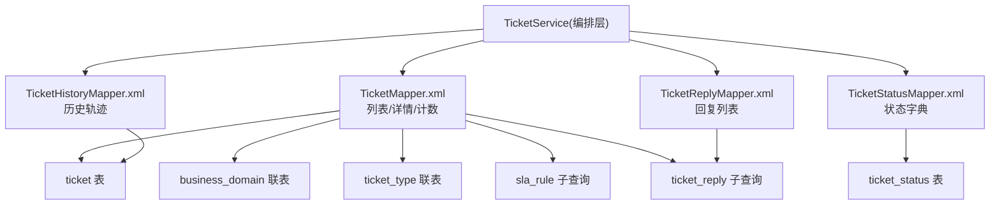
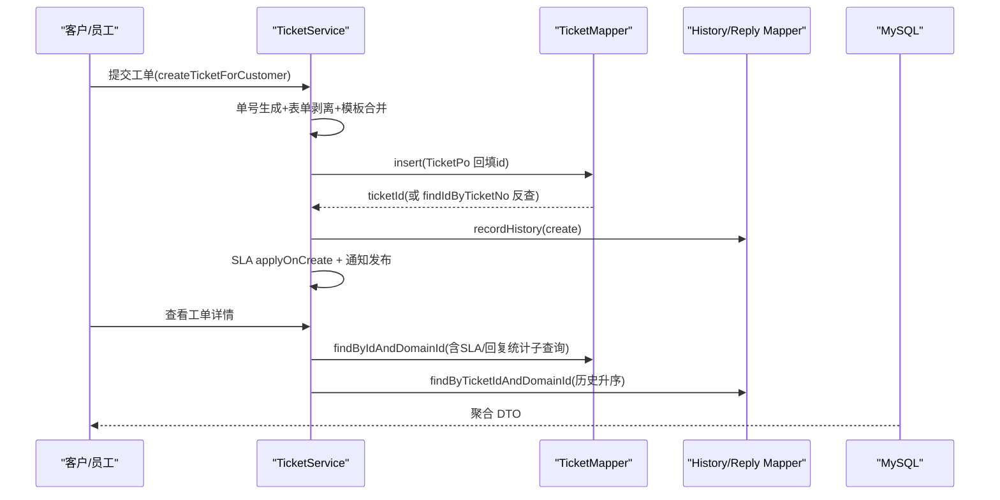
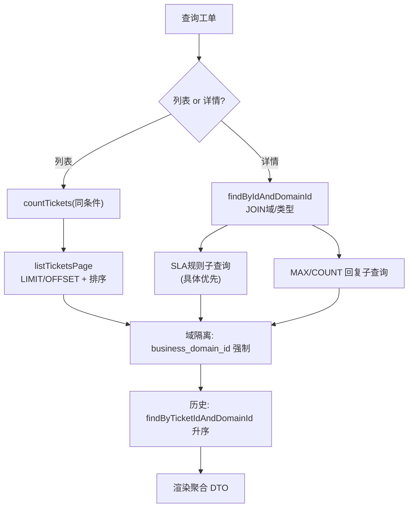
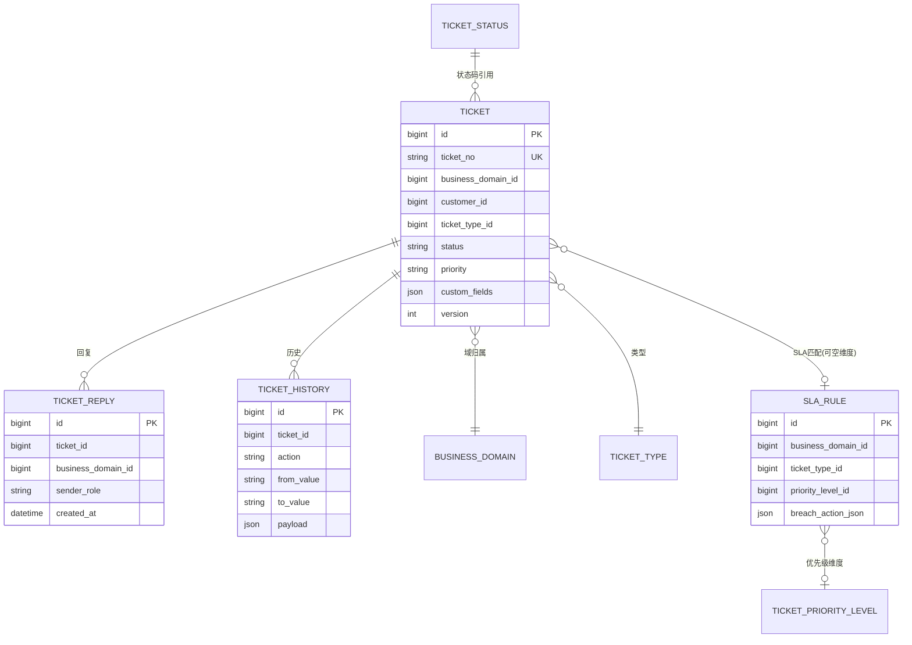
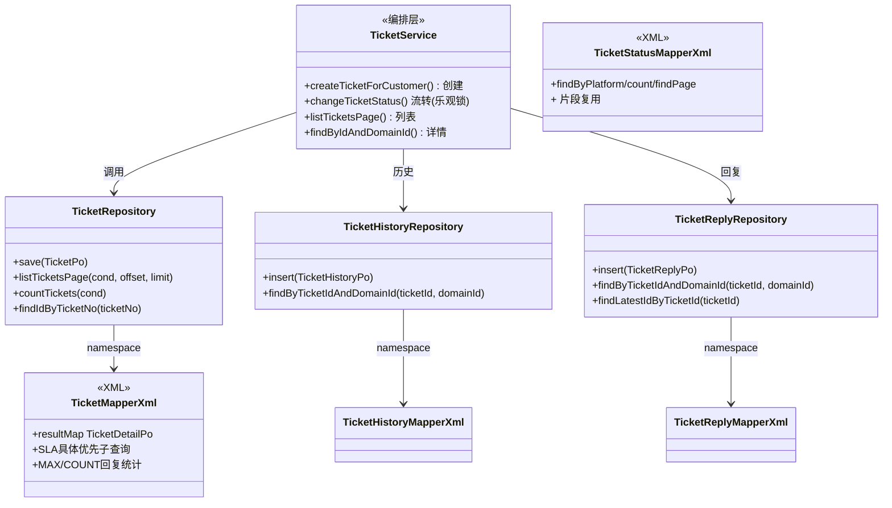

<cite>
- [UnionDesk/uniondesk-ticket/src/main/resources/mapper/ticket/TicketMapper.xml](file://UnionDesk/uniondesk-ticket/src/main/resources/mapper/ticket/TicketMapper.xml#L6-L36)
- [UnionDesk/uniondesk-ticket/src/main/resources/mapper/ticket/TicketMapper.xml](file://UnionDesk/uniondesk-ticket/src/main/resources/mapper/ticket/TicketMapper.xml#L54-L110)
- [UnionDesk/uniondesk-ticket/src/main/resources/mapper/ticket/TicketMapper.xml](file://UnionDesk/uniondesk-ticket/src/main/resources/mapper/ticket/TicketMapper.xml#L164-L244)
- [UnionDesk/uniondesk-ticket/src/main/resources/mapper/ticket/TicketMapper.xml](file://UnionDesk/uniondesk-ticket/src/main/resources/mapper/ticket/TicketMapper.xml#L246-L249)
- [UnionDesk/uniondesk-ticket/src/main/resources/mapper/ticket/TicketHistoryMapper.xml](file://UnionDesk/uniondesk-ticket/src/main/resources/mapper/ticket/TicketHistoryMapper.xml#L6-L44)
- [UnionDesk/uniondesk-ticket/src/main/resources/mapper/ticket/TicketReplyMapper.xml](file://UnionDesk/uniondesk-ticket/src/main/resources/mapper/ticket/TicketReplyMapper.xml#L6-L54)
- [UnionDesk/uniondesk-ticket/src/main/resources/mapper/ticket/TicketStatusMapper.xml](file://UnionDesk/uniondesk-ticket/src/main/resources/mapper/ticket/TicketStatusMapper.xml#L26-L58)
- [UnionDesk/uniondesk-ticket/src/main/java/com/uniondesk/ticket/core/TicketService.java](file://UnionDesk/uniondesk-ticket/src/main/java/com/uniondesk/ticket/core/TicketService.java#L124-L192)
- [UnionDesk/uniondesk-ticket/src/main/java/com/uniondesk/ticket/core/TicketService.java](file://UnionDesk/uniondesk-ticket/src/main/java/com/uniondesk/ticket/core/TicketService.java#L194-L198)
</cite>

# UnionDesk 工单查询模式

## 简介

本文档详解工单领域的高频 SQL 模式：工单列表分页查询、详情聚合查询（联表投影 + SLA 规则子查询 + 回复统计）、历史记录查询、回复查询、状态字典查询，以及 Service 层的调用编排（乐观锁校验、SLA 计算、事件发布）。覆盖 `TicketMapper.xml`、`TicketHistoryMapper.xml`、`TicketReplyMapper.xml`、`TicketStatusMapper.xml` 四个 Mapper 与 `TicketService` 的配合方式。

章节来源：
- [UnionDesk/uniondesk-ticket/src/main/resources/mapper/ticket/TicketMapper.xml](file://UnionDesk/uniondesk-ticket/src/main/resources/mapper/ticket/TicketMapper.xml#L54-L110)
- [UnionDesk/uniondesk-ticket/src/main/java/com/uniondesk/ticket/core/TicketService.java](file://UnionDesk/uniondesk-ticket/src/main/java/com/uniondesk/ticket/core/TicketService.java#L124-L192)

## 项目结构

工单查询涉及的 Mapper 与核心 SQL：



图表来源：
- [UnionDesk/uniondesk-ticket/src/main/resources/mapper/ticket/TicketMapper.xml](file://UnionDesk/uniondesk-ticket/src/main/resources/mapper/ticket/TicketMapper.xml#L54-L110)
- [UnionDesk/uniondesk-ticket/src/main/java/com/uniondesk/ticket/core/TicketService.java](file://UnionDesk/uniondesk-ticket/src/main/java/com/uniondesk/ticket/core/TicketService.java#L79-L122)

## 核心组件

**1. 列表分页（listTicketsPage + countTickets）**：`TicketMapper.xml` L185-244 与 L164-183 成对；动态条件：`customerId/status/assignee/priority/keyword(LIKE '%kw%')`；排序 `updated_at DESC, id DESC`；`LIMIT #{limit} OFFSET #{offset}`；投影含 `last_reply_at`（MAX 子查询）与 `reply_count`（COUNT 子查询）。

**2. 详情聚合（findByIdAndDomainId）**：L54-110 单条查询，`JOIN business_domain`/`JOIN ticket_type` 取名称；`breach_action_json` 用 SLA 规则子查询按「具体优先」排序取最优（L80-92）；`custom_fields` JSON 列 `CAST AS CHAR` 返回；强制 `AND t.business_domain_id = #{domainId}` 域隔离。

**3. 历史轨迹（findByTicketIdAndDomainId）**：`TicketHistoryMapper.xml` L31-44，按 `ticket_id + business_domain_id` 过滤，`created_at ASC, id ASC` 升序还原时间线；`payload` JSON 列 CAST。

**4. 回复列表（findByTicketIdAndDomainId）**：`TicketReplyMapper.xml` L33-46 同过滤 + 升序；`findLatestIdByTicketId`（L48-54）取最新回复 ID（`ORDER BY id DESC LIMIT 1`）。

**5. 状态字典（findByPlatform/countByPlatform/findPageByPlatform）**：`TicketStatusMapper.xml` L26-58 用 `<sql>` 片段复用列清单与平台条件（`scope='platform'` + 关键字），count/list 条件严格一致。

**6. 单号反查（findIdByTicketNo）**：L246-249 按 `ticket_no` 唯一键精确取 ID，用于插入后回填。

章节来源：
- [UnionDesk/uniondesk-ticket/src/main/resources/mapper/ticket/TicketMapper.xml](file://UnionDesk/uniondesk-ticket/src/main/resources/mapper/ticket/TicketMapper.xml#L164-L249)
- [UnionDesk/uniondesk-ticket/src/main/resources/mapper/ticket/TicketHistoryMapper.xml](file://UnionDesk/uniondesk-ticket/src/main/resources/mapper/ticket/TicketHistoryMapper.xml#L31-L44)
- [UnionDesk/uniondesk-ticket/src/main/resources/mapper/ticket/TicketReplyMapper.xml](file://UnionDesk/uniondesk-ticket/src/main/resources/mapper/ticket/TicketReplyMapper.xml#L33-L54)

## 架构总览

客户提单后的查询链路（Service 编排 Mapper）：



图表来源：
- [UnionDesk/uniondesk-ticket/src/main/java/com/uniondesk/ticket/core/TicketService.java](file://UnionDesk/uniondesk-ticket/src/main/java/com/uniondesk/ticket/core/TicketService.java#L124-L192)
- [UnionDesk/uniondesk-ticket/src/main/resources/mapper/ticket/TicketMapper.xml](file://UnionDesk/uniondesk-ticket/src/main/resources/mapper/ticket/TicketMapper.xml#L54-L110)

## 详细分析

**查询细节深度剖析**：

1. **SLA 违约动作的「具体优先」子查询**（L80-92）：按 `priority_level_id IS NOT NULL DESC, ticket_type_id IS NOT NULL DESC, id DESC` 排序取 1 条——优先级维度最具体的规则优先，其次类型维度，最后兜底通配规则。SLA 匹配完全下沉 SQL，Service 层无需二次筛选。
2. **回复统计的 COALESCE 兜底**：`COALESCE((SELECT COUNT(*) ...), 0)` 保证无回复工单返回 0 而非 NULL，避免前端 NPE。
3. **JSON 列传输**：`CAST(t.custom_fields AS CHAR)`/`CAST(payload AS CHAR)` 把 JSON 列转字符串，Java 侧用 ObjectMapper 反序列化——JSON 列不进 resultMap 类型映射，保持 Po 字段为 String。
4. **域隔离强制**：所有工单查询 WHERE 必带 `business_domain_id = #{domainId}`（详情 L108、列表 L153/L167、历史 L42、回复 L44），防止跨域越权。
5. **乐观锁在 Service 层**：`changeTicketStatus` 先读 `current.version()` 与 `command.version()` 比对（L196-198），不匹配抛「工单已被他人修改」——查询模式与并发控制配合的典型场景。
6. **状态字典片段复用**：`<sql id="TicketStatusColumns">`（列清单）与 `<sql id="platformScopeWhere">`（平台条件）被 count/list 两查询 `<include>`，从结构上杜绝 count 与 list 条件漂移。
7. **单号幂等回填**：`findIdByTicketNo` 用唯一键反查（L246-249），`ticket_no` 生成规则含域 code + 日期，保证业务唯一。



图表来源：
- [UnionDesk/uniondesk-ticket/src/main/resources/mapper/ticket/TicketMapper.xml](file://UnionDesk/uniondesk-ticket/src/main/resources/mapper/ticket/TicketMapper.xml#L80-L110)
- [UnionDesk/uniondesk-ticket/src/main/resources/mapper/ticket/TicketHistoryMapper.xml](file://UnionDesk/uniondesk-ticket/src/main/resources/mapper/ticket/TicketHistoryMapper.xml#L31-L44)

## 数据模型

查询模式涉及的表关系：



图表来源：
- [UnionDesk/uniondesk-ticket/src/main/resources/mapper/ticket/TicketMapper.xml](file://UnionDesk/uniondesk-ticket/src/main/resources/mapper/ticket/TicketMapper.xml#L54-L110)
- [UnionDesk/uniondesk-ticket/src/main/resources/mapper/ticket/TicketHistoryMapper.xml](file://UnionDesk/uniondesk-ticket/src/main/resources/mapper/ticket/TicketHistoryMapper.xml#L6-L17)

## 依赖关系分析



图表来源：
- [UnionDesk/uniondesk-ticket/src/main/java/com/uniondesk/ticket/core/TicketService.java](file://UnionDesk/uniondesk-ticket/src/main/java/com/uniondesk/ticket/core/TicketService.java#L79-L122)
- [UnionDesk/uniondesk-ticket/src/main/resources/mapper/ticket/TicketMapper.xml](file://UnionDesk/uniondesk-ticket/src/main/resources/mapper/ticket/TicketMapper.xml#L1-L4)

## 性能与安全考虑

- **索引命中**：列表查询以 `business_domain_id` 为前缀命中 `idx_ticket_domain_status_priority`（复合）；`findByIdAndDomainId` 主键 + 域双条件命中主键/域索引；回复/历史按 `(ticket_id, created_at)` 索引；`findIdByTicketNo` 走 `uk_ticket_no`。
- **子查询代价**：`last_reply_at/reply_count` 两个相关子查询逐行执行（L95-104、L140-149），大数据量下可改为 LEFT JOIN 分组聚合；SLA 子查询依赖 `idx_sla_rule_domain_type`。
- **安全**：域隔离条件强制；`LIKE '%kw%'` 前导通配符不能走索引（L181），需评估关键字量级；JSON 列 CAST 后按字符串返回，避免类型转换异常。
- **一致性**：count/list 同条件防分页漂移；乐观锁版本校验防并发覆盖；历史升序保证时间线正确。

章节来源：
- [UnionDesk/uniondesk-ticket/src/main/resources/mapper/ticket/TicketMapper.xml](file://UnionDesk/uniondesk-ticket/src/main/resources/mapper/ticket/TicketMapper.xml#L95-L110)
- [UnionDesk/uniondesk-ticket/src/main/resources/mapper/ticket/TicketMapper.xml](file://UnionDesk/uniondesk-ticket/src/main/resources/mapper/ticket/TicketMapper.xml#L180-L182)

## 故障排查指南

| 现象 | 原因 | 处理建议 |
| --- | --- | --- |
| 工单列表 total 与页数不符 | count 与 list 条件不一致（如 count 多一个 assignee 条件） | 比对 `countTickets` 与 `listTicketsPage` 的 `<if>` 条件；用 `<sql>` 统一 |
| 详情页 SLA 违约动作显示不对 | SLA 规则子查询「具体优先」排序被改或规则维度错配 | 核对 `ORDER BY priority_level_id IS NOT NULL DESC, ticket_type_id IS NOT NULL DESC` |
| 历史/回复顺序错乱 | 排序未带 `id` 兜底（同 created_at 多行） | 使用 `ORDER BY created_at ASC, id ASC` |
| 无回复工单显示回复数 NULL | COUNT 子查询未包 COALESCE | 使用 `COALESCE((SELECT COUNT(*) ...), 0)` |
| 并发流转报「工单已被他人修改」 | 版本号不匹配（乐观锁生效） | 前端刷新重新加载；确认 version 传递正确 |

章节来源：
- [UnionDesk/uniondesk-ticket/src/main/resources/mapper/ticket/TicketMapper.xml](file://UnionDesk/uniondesk-ticket/src/main/resources/mapper/ticket/TicketMapper.xml#L164-L244)
- [UnionDesk/uniondesk-ticket/src/main/java/com/uniondesk/ticket/core/TicketService.java](file://UnionDesk/uniondesk-ticket/src/main/java/com/uniondesk/ticket/core/TicketService.java#L194-L198)

## 结论

工单查询模式遵循「**双查分页、聚合投影、域隔离强制、乐观锁协作**」：列表 count/list 同条件防漂移，详情一次 SQL 聚合域名称、SLA 违约动作与回复统计，历史/回复按时间线升序还原，状态字典用 `<sql>` 片段复用。Service 层以版本号防并发、以单号唯一键做幂等回填。理解这些模式即可快速定位与扩展工单查询逻辑。

章节来源：
- [UnionDesk/uniondesk-ticket/src/main/resources/mapper/ticket/TicketMapper.xml](file://UnionDesk/uniondesk-ticket/src/main/resources/mapper/ticket/TicketMapper.xml#L112-L244)
- [UnionDesk/uniondesk-ticket/src/main/java/com/uniondesk/ticket/core/TicketService.java](file://UnionDesk/uniondesk-ticket/src/main/java/com/uniondesk/ticket/core/TicketService.java#L124-L192)

## 附录

可直接运行的查询示例：

```sql
-- 1. 工单列表（同 count/list 条件）
SELECT t.id, t.ticket_no, t.title, t.status, t.priority,
       (SELECT MAX(r.created_at) FROM ticket_reply r WHERE r.ticket_id = t.id) AS last_reply_at,
       COALESCE((SELECT COUNT(*) FROM ticket_reply r WHERE r.ticket_id = t.id), 0) AS reply_count
FROM ticket t
WHERE t.business_domain_id = 1
  AND t.status = 'in_progress'
ORDER BY t.updated_at DESC, t.id DESC
LIMIT 20 OFFSET 0;

-- 2. 工单详情（SLA 违约动作「具体优先」）
SELECT t.id, t.ticket_no, t.title, t.status, d.name AS domain_name, tt.name AS type_name,
       (SELECT sr.breach_action_json FROM sla_rule sr
        WHERE sr.business_domain_id = t.business_domain_id
          AND (sr.ticket_type_id = t.ticket_type_id OR sr.ticket_type_id IS NULL)
        ORDER BY sr.ticket_type_id IS NOT NULL DESC, sr.id DESC LIMIT 1) AS breach_action
FROM ticket t
JOIN business_domain d ON d.id = t.business_domain_id
JOIN ticket_type tt ON tt.id = t.ticket_type_id
WHERE t.id = 1001 AND t.business_domain_id = 1;
```

Service 层调用示例：

```java
// 列表查询（PageResult 信封）
long total = ticketRepository.countTickets(cond);
List<TicketDetailPo> list = ticketRepository.listTicketsPage(cond, offset, limit);
return new PageResult<>(total, list);

// 详情查询（域隔离双条件）
TicketDetailPo detail = ticketRepository.findByIdAndDomainId(ticketId, domainId);
```

章节来源：
- [UnionDesk/uniondesk-ticket/src/main/resources/mapper/ticket/TicketMapper.xml](file://UnionDesk/uniondesk-ticket/src/main/resources/mapper/ticket/TicketMapper.xml#L54-L110)
- [UnionDesk/uniondesk-ticket/src/main/resources/mapper/ticket/TicketMapper.xml](file://UnionDesk/uniondesk-ticket/src/main/resources/mapper/ticket/TicketMapper.xml#L185-L244)
- [UnionDesk/uniondesk-ticket/src/main/java/com/uniondesk/ticket/core/TicketService.java](file://UnionDesk/uniondesk-ticket/src/main/java/com/uniondesk/ticket/core/TicketService.java#L79-L122)
