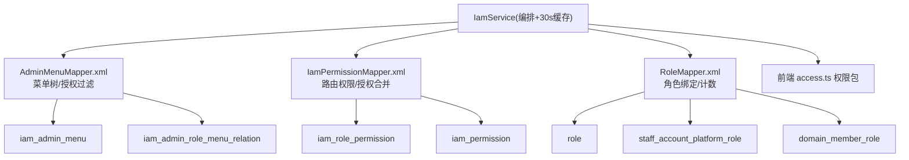
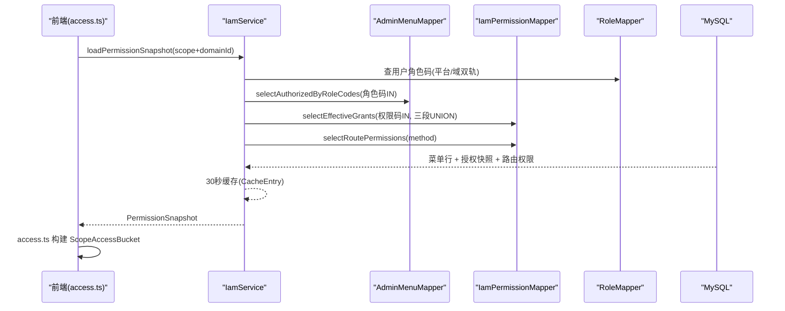
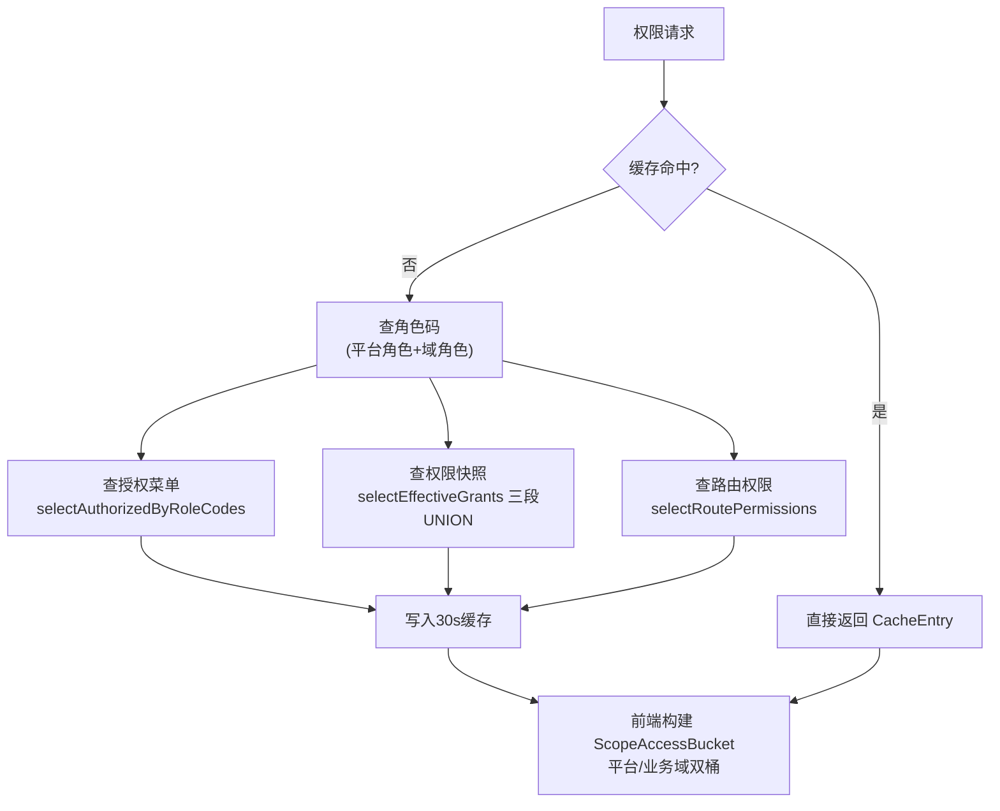
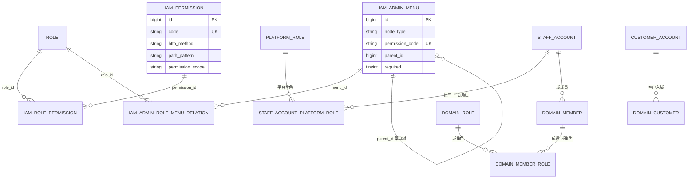
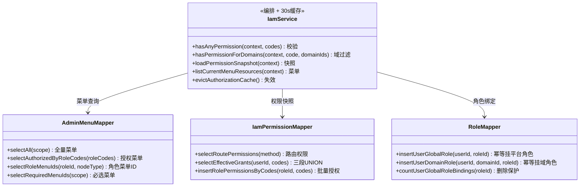

<cite>
- [UnionDesk/uniondesk-iam/src/main/resources/mapper/iam/AdminMenuMapper.xml](file://UnionDesk/uniondesk-iam/src/main/resources/mapper/iam/AdminMenuMapper.xml#L6-L50)
- [UnionDesk/uniondesk-iam/src/main/resources/mapper/iam/AdminMenuMapper.xml](file://UnionDesk/uniondesk-iam/src/main/resources/mapper/iam/AdminMenuMapper.xml#L103-L133)
- [UnionDesk/uniondesk-iam/src/main/resources/mapper/iam/AdminMenuMapper.xml](file://UnionDesk/uniondesk-iam/src/main/resources/mapper/iam/AdminMenuMapper.xml#L147-L189)
- [UnionDesk/uniondesk-iam/src/main/resources/mapper/iam/IamPermissionMapper.xml](file://UnionDesk/uniondesk-iam/src/main/resources/mapper/iam/IamPermissionMapper.xml#L18-L24)
- [UnionDesk/uniondesk-iam/src/main/resources/mapper/iam/IamPermissionMapper.xml](file://UnionDesk/uniondesk-iam/src/main/resources/mapper/iam/IamPermissionMapper.xml#L26-L77)
- [UnionDesk/uniondesk-iam/src/main/resources/mapper/iam/RoleMapper.xml](file://UnionDesk/uniondesk-iam/src/main/resources/mapper/iam/RoleMapper.xml#L50-L100)
- [UnionDesk/uniondesk-iam/src/main/java/com/uniondesk/iam/core/IamService.java](file://UnionDesk/uniondesk-iam/src/main/java/com/uniondesk/iam/core/IamService.java#L34-L77)
- [UnionDesk/uniondesk-iam/src/main/java/com/uniondesk/iam/core/IamService.java](file://UnionDesk/uniondesk-iam/src/main/java/com/uniondesk/iam/core/IamService.java#L102-L146)
- [UnionDesk/uniondesk-iam/src/main/java/com/uniondesk/iam/core/IamService.java](file://UnionDesk/uniondesk-iam/src/main/java/com/uniondesk/iam/core/IamService.java#L491-L495)
- [UnionDeskWeb/apps/UnionDeskAdminWeb/src/store/access.ts](file://UnionDeskWeb/apps/UnionDeskAdminWeb/src/store/access.ts#L17-L54)
</cite>

# UnionDesk 权限与菜单查询

## 简介

本文档详解权限与菜单领域的核心 SQL 模式：菜单树查询（含角色授权过滤）、权限码校验查询（三段 UNION 合并授权）、角色-权限联查、用户角色绑定（平台/域双轨）、必选按钮/菜单的强制授权查询，以及 `IamService` 的 30 秒缓存编排。覆盖 `AdminMenuMapper.xml`、`IamPermissionMapper.xml`、`RoleMapper.xml` 与前端 `access.ts` 权限包的配合。

章节来源：
- [UnionDesk/uniondesk-iam/src/main/resources/mapper/iam/AdminMenuMapper.xml](file://UnionDesk/uniondesk-iam/src/main/resources/mapper/iam/AdminMenuMapper.xml#L103-L133)
- [UnionDesk/uniondesk-iam/src/main/resources/mapper/iam/IamPermissionMapper.xml](file://UnionDesk/uniondesk-iam/src/main/resources/mapper/iam/IamPermissionMapper.xml#L26-L77)

## 项目结构

权限查询涉及的 Mapper 与数据流：



图表来源：
- [UnionDesk/uniondesk-iam/src/main/resources/mapper/iam/AdminMenuMapper.xml](file://UnionDesk/uniondesk-iam/src/main/resources/mapper/iam/AdminMenuMapper.xml#L45-L50)
- [UnionDesk/uniondesk-iam/src/main/resources/mapper/iam/RoleMapper.xml](file://UnionDesk/uniondesk-iam/src/main/resources/mapper/iam/RoleMapper.xml#L50-L64)

## 核心组件

**1. 菜单树查询（selectAll + selectAuthorizedByRoleCodes）**：`AdminMenuMapper.xml` L45-50 全量菜单（`<sql> menuColumns` 列复用 + scope 可选过滤，`ORDER BY order_no, id`）；L103-114 按角色码授权过滤——`iam_admin_role_menu_relation JOIN role JOIN iam_admin_menu`，`WHERE r.code IN <foreach>` + `m.status = 1` + `DISTINCT`，按 `order_no, id` 排序供前端组树。

**2. 角色权限联查（selectRolePermissionRows）**：L116-125 投影 `p.code/p.name/p.http_method/p.path_pattern`（`RolePermissionRowPo`），`role_code IN` + `p.status = 1`，输出权限码快照。

**3. 授权合并（selectEffectiveGrants）**：`IamPermissionMapper.xml` L26-77 三段 `UNION ALL`——①平台角色授权（`staff_account_platform_role → platform_role → role → iam_role_permission → iam_permission`）；②域成员角色授权（`domain_member → domain_member_role → domain_role → role → ...`，要求 `dm.status='active' AND dm.deleted_at IS NULL`）；③客户角色授权（`customer_account → domain_customer(status=active) → role('customer') → ...`）。输出 `role_level/binding_scope/business_domain_id/permission_scope` 快照行。

**4. 路由级权限（selectRoutePermissions）**：L18-24 按 `http_method + path_pattern IS NOT NULL` 取路由权限码，供拦截器路径匹配。

**5. 用户角色绑定（RoleMapper）**：`insertUserGlobalRole`（L81-88）用 `INSERT ... SELECT ... ON DUPLICATE KEY UPDATE` 幂等挂平台角色；`insertUserDomainRole`（L90-100）同理挂域角色（按 `staff_account_id + business_domain_id` 定位域成员）；`countUserGlobalRoleBindings/countUserDomainRoleBindings`（L50-64）删除角色前引用计数。

**6. 必选授权（selectRequiredMenuIds / selectRequiredButtonIdsByParentIds）**：L181-189 查 `required=1` 的菜单/按钮，配合角色授权做「必选补授权」。

章节来源：
- [UnionDesk/uniondesk-iam/src/main/resources/mapper/iam/AdminMenuMapper.xml](file://UnionDesk/uniondesk-iam/src/main/resources/mapper/iam/AdminMenuMapper.xml#L103-L133)
- [UnionDesk/uniondesk-iam/src/main/resources/mapper/iam/IamPermissionMapper.xml](file://UnionDesk/uniondesk-iam/src/main/resources/mapper/iam/IamPermissionMapper.xml#L18-L77)
- [UnionDesk/uniondesk-iam/src/main/resources/mapper/iam/RoleMapper.xml](file://UnionDesk/uniondesk-iam/src/main/resources/mapper/iam/RoleMapper.xml#L50-L100)

## 架构总览

登录后权限快照加载链路（后端查询 → 前端权限包）：



图表来源：
- [UnionDesk/uniondesk-iam/src/main/java/com/uniondesk/iam/core/IamService.java](file://UnionDesk/uniondesk-iam/src/main/java/com/uniondesk/iam/core/IamService.java#L102-L146)
- [UnionDeskWeb/apps/UnionDeskAdminWeb/src/store/access.ts](file://UnionDeskWeb/apps/UnionDeskAdminWeb/src/store/access.ts#L17-L54)

## 详细分析

**关键查询细节**：

1. **三段 UNION 的授权语义**：`selectEffectiveGrants` 把「平台角色（global 作用域）+ 域角色（按 business_domain_id 绑定）+ 客户固定角色」合并成权限快照行；每段输出 `role_level`（platform/domain）与 `binding_scope`，`IamService.hasPermissionForDomains`（L59）按域过滤；`CAST(NULL AS UNSIGNED)` 保证 UNION 列类型一致。
2. **菜单树的两条路径**：平台运营者走「全量菜单 + scope 过滤」；普通角色走「关联表授权过滤」——`selectAuthorizedByRoleCodes` 的 `DISTINCT` 防多角色重复行，`ORDER BY m.order_no, m.id` 稳定组树。
3. **幂等角色绑定**：`INSERT ... SELECT ... ON DUPLICATE KEY UPDATE created_at = VALUES(created_at)` 让「重复挂角色」不报错且刷新绑定时间；`INSERT IGNORE ... SELECT`（IamPermissionMapper L88-94）批量授权同理。
4. **删除保护**：`deleteRole` 前用 `countUserGlobalRoleBindings`（经 `platform_role.code = role.code` 桥接计数）与 `countUserDomainRoleBindings`（经 `domain_role.code = role.code` 桥接计数）校验引用，防止删掉被使用角色。
5. **必选补授权**：`selectRequiredMenuIds`（scope + required=1 + status=1）与 `selectRequiredButtonIdsByParentIds` 组合，保证角色创建时自动带上系统必选菜单/按钮（如首页）。
6. **缓存编排**：`IamService` 用 `ConcurrentHashMap + CacheEntry(30s TTL)`（L36、L42）缓存菜单资源，`evictAuthorizationCache()`（L491-495）在授权变更时主动失效——SQL 查询与缓存策略配合降低权限查询压力。
7. **前端双端权限包**：`access.ts` 的 `ScopeAccessBucket`（platformBucket/businessBucket 双桶）分别缓存平台与业务域权限原料（userRoutes/dynamicRoutes/actions/domainId/loadedAt），切换域时按桶投影，避免重复请求。



图表来源：
- [UnionDesk/uniondesk-iam/src/main/java/com/uniondesk/iam/core/IamService.java](file://UnionDesk/uniondesk-iam/src/main/java/com/uniondesk/iam/core/IamService.java#L36-L77)
- [UnionDesk/uniondesk-iam/src/main/java/com/uniondesk/iam/core/IamService.java](file://UnionDesk/uniondesk-iam/src/main/java/com/uniondesk/iam/core/IamService.java#L491-L495)

## 数据模型

权限查询涉及的表关系：



图表来源：
- [UnionDesk/uniondesk-iam/src/main/resources/mapper/iam/IamPermissionMapper.xml](file://UnionDesk/uniondesk-iam/src/main/resources/mapper/iam/IamPermissionMapper.xml#L26-L77)
- [UnionDesk/uniondesk-iam/src/main/resources/mapper/iam/RoleMapper.xml](file://UnionDesk/uniondesk-iam/src/main/resources/mapper/iam/RoleMapper.xml#L50-L100)

## 依赖关系分析



图表来源：
- [UnionDesk/uniondesk-iam/src/main/java/com/uniondesk/iam/core/IamService.java](file://UnionDesk/uniondesk-iam/src/main/java/com/uniondesk/iam/core/IamService.java#L34-L77)
- [UnionDesk/uniondesk-iam/src/main/java/com/uniondesk/iam/core/IamService.java](file://UnionDesk/uniondesk-iam/src/main/java/com/uniondesk/iam/core/IamService.java#L102-L146)

## 性能与安全考虑

- **索引依赖**：授权查询走 `iam_admin_role_menu_relation`（复合唯一键 role_id+menu_id）、`iam_role_permission`（复合唯一键 role_id+permission_id）、`staff_account_platform_role`/`domain_member_role`（联合主键）——连接键均有索引；`p.code IN` 走 `uk_iam_permission_code`。
- **缓存策略**：30 秒 TTL 的菜单/权限缓存降低高频查询压力；授权变更主动 `evictAuthorizationCache()` 保证强一致窗口可接受；前端双桶缓存减少切换域时的重复请求。
- **安全**：`selectEffectiveGrants` 每段严格过滤（`dm.status='active' AND dm.deleted_at IS NULL`、`p.status=1`）；`role_code IN` 白名单参数化；`selectRoutePermissions` 供拦截器做接口级路径匹配，防越权调用。
- **一致性与防滥用**：`ON DUPLICATE KEY UPDATE`/`INSERT IGNORE` 幂等防重复授权；删除保护计数防误删在用角色；`DISTINCT` 防多角色授权重复。

章节来源：
- [UnionDesk/uniondesk-iam/src/main/java/com/uniondesk/iam/core/IamService.java](file://UnionDesk/uniondesk-iam/src/main/java/com/uniondesk/iam/core/IamService.java#L36-L42)
- [UnionDesk/uniondesk-iam/src/main/resources/mapper/iam/IamPermissionMapper.xml](file://UnionDesk/uniondesk-iam/src/main/resources/mapper/iam/IamPermissionMapper.xml#L26-L77)

## 故障排查指南

| 现象 | 原因 | 处理建议 |
| --- | --- | --- |
| 用户菜单多/少 | `selectAuthorizedByRoleCodes` 的 role_codes 与实际绑定不符，或缓存未失效 | 检查 `staff_account_platform_role`/`domain_member_role` 绑定；调用 `evictAuthorizationCache` |
| 接口 403 但菜单可见 | `selectEffectiveGrants` 未返回该权限码（如域成员 status 非 active） | 核对 `dm.status/deleted_at` 过滤；检查权限码 IN 列表 |
| 删除角色失败 | `countUserGlobalRoleBindings/countUserDomainRoleBindings` 大于 0 | 先解绑用户角色再删；确认平台/域两侧桥接查询 |
| 权限变更后前端仍显示旧菜单 | 后端 30s 缓存 + 前端 access 桶缓存 | 后端 `evictAuthorizationCache`；前端重新登录或刷新 access 桶 |
| 重复授权行 | 关联表缺唯一键或 UNION 未 DISTINCT | 确认复合唯一键；菜单查询用 DISTINCT |

章节来源：
- [UnionDesk/uniondesk-iam/src/main/java/com/uniondesk/iam/core/IamService.java](file://UnionDesk/uniondesk-iam/src/main/java/com/uniondesk/iam/core/IamService.java#L491-L495)
- [UnionDesk/uniondesk-iam/src/main/resources/mapper/iam/AdminMenuMapper.xml](file://UnionDesk/uniondesk-iam/src/main/resources/mapper/iam/AdminMenuMapper.xml#L103-L114)

## 结论

权限与菜单查询模式以「**授权过滤 + 三段 UNION + 幂等绑定 + 缓存编排**」为核心：菜单查询按角色码过滤并稳定排序供组树；权限快照用三段 UNION 合并平台/域/客户授权并输出作用域信息；角色绑定用 `INSERT...SELECT...ON DUPLICATE` 幂等落库；删除保护用桥接计数；`IamService` 30 秒缓存与前端双桶缓存共同控制查询压力。该体系保证权限实时可查、可失效、可追溯。

章节来源：
- [UnionDesk/uniondesk-iam/src/main/resources/mapper/iam/IamPermissionMapper.xml](file://UnionDesk/uniondesk-iam/src/main/resources/mapper/iam/IamPermissionMapper.xml#L26-L77)
- [UnionDesk/uniondesk-iam/src/main/java/com/uniondesk/iam/core/IamService.java](file://UnionDesk/uniondesk-iam/src/main/java/com/uniondesk/iam/core/IamService.java#L102-L146)

## 附录

可直接运行的查询示例：

```sql
-- 1. 按角色码查授权菜单（前端组树原料）
SELECT DISTINCT m.id, m.name, m.route_path, m.component_key, m.permission_code,
       m.parent_id, m.order_no, m.node_type
FROM iam_admin_role_menu_relation relation
JOIN role r ON r.id = relation.role_id
JOIN iam_admin_menu m ON m.id = relation.menu_id
WHERE r.code IN ('domain_admin')
  AND m.status = 1
ORDER BY m.order_no, m.id;

-- 2. 查询用户全部权限码（三段 UNION 之一：平台角色）
SELECT r.scope AS role_level, 'global' AS binding_scope,
       CAST(NULL AS UNSIGNED) AS business_domain_id, p.permission_scope
FROM staff_account_platform_role sapr
JOIN platform_role pr ON pr.id = sapr.platform_role_id
JOIN role r ON r.code = pr.code
JOIN iam_role_permission rp ON rp.role_id = r.id
JOIN iam_permission p ON p.id = rp.permission_id
WHERE sapr.staff_account_id = 1001 AND p.status = 1;

-- 3. 删除角色前引用检查
SELECT
  (SELECT COUNT(*) FROM staff_account_platform_role sapr
    JOIN platform_role pr ON pr.id = sapr.platform_role_id
    JOIN role r ON r.code = pr.code WHERE r.id = 3) AS global_bindings,
  (SELECT COUNT(*) FROM domain_member_role dmr
    JOIN domain_role dr ON dr.id = dmr.domain_role_id
    JOIN role r ON r.code = dr.code WHERE r.id = 3) AS domain_bindings;
```

章节来源：
- [UnionDesk/uniondesk-iam/src/main/resources/mapper/iam/AdminMenuMapper.xml](file://UnionDesk/uniondesk-iam/src/main/resources/mapper/iam/AdminMenuMapper.xml#L103-L114)
- [UnionDesk/uniondesk-iam/src/main/resources/mapper/iam/IamPermissionMapper.xml](file://UnionDesk/uniondesk-iam/src/main/resources/mapper/iam/IamPermissionMapper.xml#L26-L77)
- [UnionDesk/uniondesk-iam/src/main/resources/mapper/iam/RoleMapper.xml](file://UnionDesk/uniondesk-iam/src/main/resources/mapper/iam/RoleMapper.xml#L50-L64)
