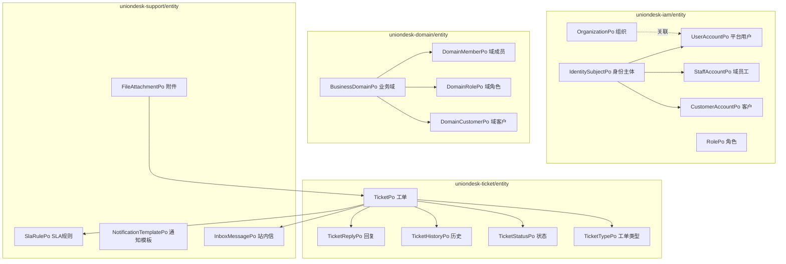
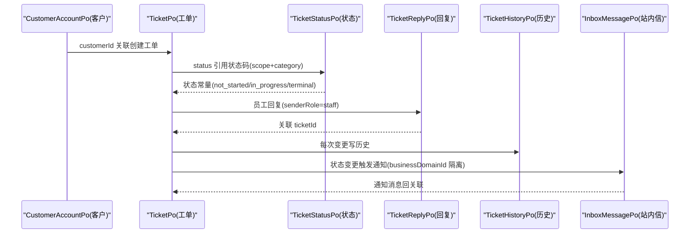
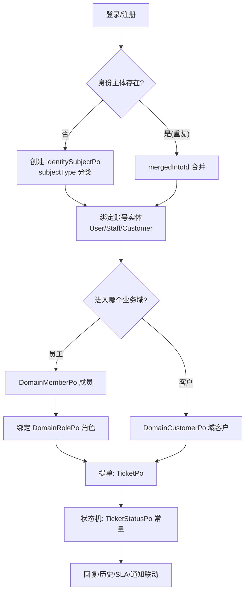
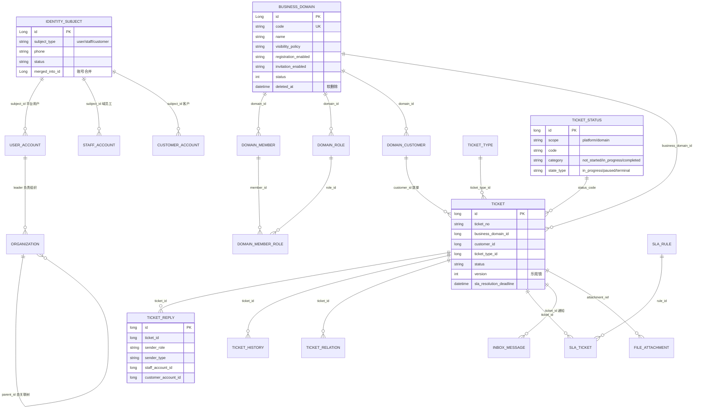
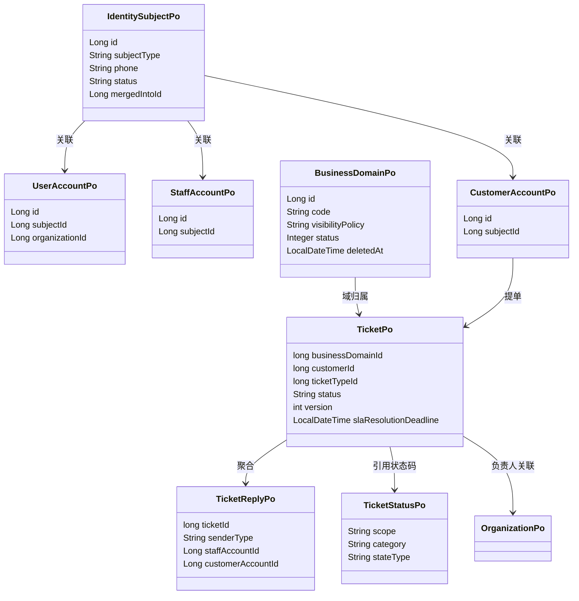

<cite>
- [UnionDesk/uniondesk-ticket/src/main/java/com/uniondesk/ticket/entity/TicketPo.java](file://UnionDesk/uniondesk-ticket/src/main/java/com/uniondesk/ticket/entity/TicketPo.java#L5-L31)
- [UnionDesk/uniondesk-ticket/src/main/java/com/uniondesk/ticket/entity/TicketReplyPo.java](file://UnionDesk/uniondesk-ticket/src/main/java/com/uniondesk/ticket/entity/TicketReplyPo.java#L5-L19)
- [UnionDesk/uniondesk-ticket/src/main/java/com/uniondesk/ticket/entity/TicketStatusPo.java](file://UnionDesk/uniondesk-ticket/src/main/java/com/uniondesk/ticket/entity/TicketStatusPo.java#L5-L34)
- [UnionDesk/uniondesk-iam/src/main/java/com/uniondesk/iam/entity/IdentitySubjectPo.java](file://UnionDesk/uniondesk-iam/src/main/java/com/uniondesk/iam/entity/IdentitySubjectPo.java#L3-L21)
- [UnionDesk/uniondesk-domain/src/main/java/com/uniondesk/domain/entity/BusinessDomainPo.java](file://UnionDesk/uniondesk-domain/src/main/java/com/uniondesk/domain/entity/BusinessDomainPo.java#L5-L24)
- [UnionDesk/uniondesk-iam/src/main/java/com/uniondesk/iam/entity/OrganizationPo.java](file://UnionDesk/uniondesk-iam/src/main/java/com/uniondesk/iam/entity/OrganizationPo.java#L5-L18)
- [UnionDesk/uniondesk-app/src/main/resources/db/migration/current/V202605200002__rebaseline_current_schema.sql](file://UnionDesk/uniondesk-app/src/main/resources/db/migration/current/V202605200002__rebaseline_current_schema.sql#L51-L60)
</cite>

# UnionDesk 实体关系与 ER 图

## 简介

本文档刻画 UnionDesk 核心实体及其关系：以「身份主体」为中心的账号体系（平台用户/域员工/客户）、以「业务域」为中心的租户体系（域成员/域角色/域客户）、以「工单」为中心的业务体系（回复/历史/状态/类型/SLA），以及组织、通知、附件等关联实体。所有关系均通过业务键（`xxx_id`）表达，无数据库外键。

章节来源：
- [UnionDesk/uniondesk-iam/src/main/java/com/uniondesk/iam/entity/IdentitySubjectPo.java](file://UnionDesk/uniondesk-iam/src/main/java/com/uniondesk/iam/entity/IdentitySubjectPo.java#L3-L21)
- [UnionDesk/uniondesk-ticket/src/main/java/com/uniondesk/ticket/entity/TicketPo.java](file://UnionDesk/uniondesk-ticket/src/main/java/com/uniondesk/ticket/entity/TicketPo.java#L5-L31)

## 项目结构

实体按所属模块分布在四个模块的 `entity` 包中，通过「模块 → 实体 → 关系」三层组织：



图表来源：
- [UnionDesk/uniondesk-iam/src/main/java/com/uniondesk/iam/entity/IdentitySubjectPo.java](file://UnionDesk/uniondesk-iam/src/main/java/com/uniondesk/iam/entity/IdentitySubjectPo.java#L3-L21)
- [UnionDesk/uniondesk-domain/src/main/java/com/uniondesk/domain/entity/BusinessDomainPo.java](file://UnionDesk/uniondesk-domain/src/main/java/com/uniondesk/domain/entity/BusinessDomainPo.java#L5-L24)
- [UnionDesk/uniondesk-ticket/src/main/java/com/uniondesk/ticket/entity/TicketPo.java](file://UnionDesk/uniondesk-ticket/src/main/java/com/uniondesk/ticket/entity/TicketPo.java#L5-L31)

## 核心组件

**账号与身份体系**：
- `IdentitySubjectPo`：身份主体（`id/subjectType/phone/status/mergedIntoId`），是账号合并与统一的锚点；`subjectType` 区分用户/员工/客户。
- `UserAccountPo`（平台用户）、`StaffAccountPo`（域员工）、`CustomerAccountPo`（客户）：三类账号与身份主体关联。
- `OrganizationPo`：组织树（`parentId` 自关联、`leaderUserId` 负责人），平台用户归属组织。

**业务域体系**：
- `BusinessDomainPo`：业务域（租户）根实体，含 `code/name/visibilityPolicy/registrationEnabled/invitationEnabled/status/deletedAt` 及审计字段。
- `DomainMemberPo`（域成员）、`DomainRolePo`（域角色）、`DomainCustomerPo`（域客户）、`InvitationCodePo`（邀请码）。

**工单体系**：
- `TicketPo`：工单聚合根（`ticketNo/businessDomainId/customerId/ticketTypeId/status/priority/assignedTo` + SLA 字段组 + `version` 乐观锁）。
- `TicketReplyPo`：回复（`ticketId/senderRole/senderType/staffAccountId/customerAccountId/replyType`）。
- `TicketHistoryPo`：历史轨迹；`TicketStatusPo`：状态定义（`scope/category/stateType` 常量体系）；`TicketTypePo`：工单类型。

**支撑体系**：`SlaRulePo`/`SlaCalendarPo`/`SlaTicketPo`（SLA）、`NotificationTemplatePo`/`InboxMessagePo`/`NotificationLogPo`（通知）、`FileAttachmentPo`/`AttachmentRefPo`（附件）。

章节来源：
- [UnionDesk/uniondesk-iam/src/main/java/com/uniondesk/iam/entity/OrganizationPo.java](file://UnionDesk/uniondesk-iam/src/main/java/com/uniondesk/iam/entity/OrganizationPo.java#L5-L18)
- [UnionDesk/uniondesk-domain/src/main/java/com/uniondesk/domain/entity/BusinessDomainPo.java](file://UnionDesk/uniondesk-domain/src/main/java/com/uniondesk/domain/entity/BusinessDomainPo.java#L5-L24)
- [UnionDesk/uniondesk-ticket/src/main/java/com/uniondesk/ticket/entity/TicketPo.java](file://UnionDesk/uniondesk-ticket/src/main/java/com/uniondesk/ticket/entity/TicketPo.java#L5-L31)

## 架构总览

「客户提单 → 工单处理 → 状态流转 → SLA/通知/历史联动」的实体协作时序：



图表来源：
- [UnionDesk/uniondesk-ticket/src/main/java/com/uniondesk/ticket/entity/TicketPo.java](file://UnionDesk/uniondesk-ticket/src/main/java/com/uniondesk/ticket/entity/TicketPo.java#L9-L27)（业务键字段）
- [UnionDesk/uniondesk-ticket/src/main/java/com/uniondesk/ticket/entity/TicketReplyPo.java](file://UnionDesk/uniondesk-ticket/src/main/java/com/uniondesk/ticket/entity/TicketReplyPo.java#L7-L18)
- [UnionDesk/uniondesk-ticket/src/main/java/com/uniondesk/ticket/entity/TicketStatusPo.java](file://UnionDesk/uniondesk-ticket/src/main/java/com/uniondesk/ticket/entity/TicketStatusPo.java#L7-L16)

## 详细分析

**实体关系要点**：

1. **身份主体是账号统一锚点**：`IdentitySubjectPo.subjectType` 区分三类账号，`mergedIntoId` 支持账号合并（同手机号多身份归一）；`phone` 作为业务查找键。
2. **业务域软删除**：`BusinessDomainPo` 有 `deletedAt` 逻辑删除字段，`status` 整数状态（1=启用）；可见性策略 `visibilityPolicy` + JSON 承载的 `visibilityPolicyCodes`。
3. **工单冗余域归属**：`TicketPo` 直接持有 `businessDomainId`（而非经由客户间接），保证域数据隔离查询单表可完成；`ticketNo` 为业务单号。
4. **SLA 字段内嵌工单**：`slaFirstResponseDeadline/slaResolutionDeadline/slaFirstRespondedAt/slaResolvedAt/slaStatus/slaPausedDuration` 直接落在 `TicketPo`，SLA 计算写入工单行，避免每次查询联表。
5. **乐观锁**：`TicketPo.version` 整数版本号，并发更新用版本校验。
6. **状态定义常量体系**：`TicketStatusPo` 用静态常量定义 `scope`（platform/domain）、`category`（not_started/in_progress/completed）、`stateType`（in_progress/paused/terminal），状态码字符串作为工单 `status` 引用值。
7. **回复双通道**：`TicketReplyPo` 同时携带 `staffAccountId` 与 `customerAccountId` 及 `senderType`，区分员工/客户发言。



图表来源：
- [UnionDesk/uniondesk-iam/src/main/java/com/uniondesk/iam/entity/IdentitySubjectPo.java](file://UnionDesk/uniondesk-iam/src/main/java/com/uniondesk/iam/entity/IdentitySubjectPo.java#L3-L21)
- [UnionDesk/uniondesk-domain/src/main/java/com/uniondesk/domain/entity/BusinessDomainPo.java](file://UnionDesk/uniondesk-domain/src/main/java/com/uniondesk/domain/entity/BusinessDomainPo.java#L5-L24)
- [UnionDesk/uniondesk-ticket/src/main/java/com/uniondesk/ticket/entity/TicketPo.java](file://UnionDesk/uniondesk-ticket/src/main/java/com/uniondesk/ticket/entity/TicketPo.java#L9-L27)

## 数据模型

核心实体完整 ER 图：



图表来源：
- [UnionDesk/uniondesk-ticket/src/main/java/com/uniondesk/ticket/entity/TicketPo.java](file://UnionDesk/uniondesk-ticket/src/main/java/com/uniondesk/ticket/entity/TicketPo.java#L5-L31)
- [UnionDesk/uniondesk-ticket/src/main/java/com/uniondesk/ticket/entity/TicketReplyPo.java](file://UnionDesk/uniondesk-ticket/src/main/java/com/uniondesk/ticket/entity/TicketReplyPo.java#L5-L19)
- [UnionDesk/uniondesk-ticket/src/main/java/com/uniondesk/ticket/entity/TicketStatusPo.java](file://UnionDesk/uniondesk-ticket/src/main/java/com/uniondesk/ticket/entity/TicketStatusPo.java#L5-L34)
- [UnionDesk/uniondesk-iam/src/main/java/com/uniondesk/iam/entity/IdentitySubjectPo.java](file://UnionDesk/uniondesk-iam/src/main/java/com/uniondesk/iam/entity/IdentitySubjectPo.java#L3-L21)
- [UnionDesk/uniondesk-domain/src/main/java/com/uniondesk/domain/entity/BusinessDomainPo.java](file://UnionDesk/uniondesk-domain/src/main/java/com/uniondesk/domain/entity/BusinessDomainPo.java#L5-L24)
- [UnionDesk/uniondesk-iam/src/main/java/com/uniondesk/iam/entity/OrganizationPo.java](file://UnionDesk/uniondesk-iam/src/main/java/com/uniondesk/iam/entity/OrganizationPo.java#L5-L18)

## 依赖关系分析



图表来源：
- [UnionDesk/uniondesk-ticket/src/main/java/com/uniondesk/ticket/entity/TicketPo.java](file://UnionDesk/uniondesk-ticket/src/main/java/com/uniondesk/ticket/entity/TicketPo.java#L9-L27)
- [UnionDesk/uniondesk-iam/src/main/java/com/uniondesk/iam/entity/IdentitySubjectPo.java](file://UnionDesk/uniondesk-iam/src/main/java/com/uniondesk/iam/entity/IdentitySubjectPo.java#L3-L21)
- [UnionDesk/uniondesk-iam/src/main/java/com/uniondesk/iam/entity/OrganizationPo.java](file://UnionDesk/uniondesk-iam/src/main/java/com/uniondesk/iam/entity/OrganizationPo.java#L5-L18)

## 性能与安全考虑

- **查询性能**：工单表冗余 `business_domain_id` 支持按域直接过滤；SLA 字段内嵌工单避免高频联表；`ticket_no` 唯一键支撑单号幂等查询；回复按 `ticket_id` 索引拉取。
- **并发安全**：`TicketPo.version` 乐观锁防并发覆盖；`mergedIntoId` 合并操作需事务保证身份唯一。
- **数据隔离安全**：所有业务实体带 `business_domain_id` 或经身份解析获得域上下文，权限拦截器按域过滤，避免跨租户越权。
- **软删除策略**：`business_domain.deletedAt` 逻辑删除保留审计追溯，物理删除仅限归档流程。

章节来源：
- [UnionDesk/uniondesk-domain/src/main/java/com/uniondesk/domain/entity/BusinessDomainPo.java](file://UnionDesk/uniondesk-domain/src/main/java/com/uniondesk/domain/entity/BusinessDomainPo.java#L5-L24)
- [UnionDesk/uniondesk-ticket/src/main/java/com/uniondesk/ticket/entity/TicketPo.java](file://UnionDesk/uniondesk-ticket/src/main/java/com/uniondesk/ticket/entity/TicketPo.java#L12-L27)

## 故障排查指南

| 现象 | 原因 | 处理建议 |
| --- | --- | --- |
| 客户登录后看不到工单 | `customer_id` 与工单归属不匹配，或身份主体合并（`mergedIntoId`）后未同步 | 检查 `identity_subject.merged_into_id` 链；核对工单 `customer_id` |
| 域管理员看不到域内数据 | 域成员/角色绑定缺失或 `business_domain_id` 隔离查询失败 | 检查 `domain_member`、`domain_member_role` 绑定；确认权限码作用域 |
| 工单状态显示异常 | `status` 字符串与 `ticket_status` 定义码不一致（如删除后引用孤儿码） | 对照 `TicketStatusPo` 常量核对；检查状态迁移规则 |
| SLA 字段为空或过期 | 创建/流转时未触发 SLA 计算，或规则未配置 | 检查 `sla_rule` 配置与 `TicketService` 计算入口；核对 `sla_resolution_deadline` |
| 组织树出现环 | `organization.parent_id` 业务逻辑未校验层级 | 检查组织维护接口的层级校验；修复自关联数据 |

章节来源：
- [UnionDesk/uniondesk-iam/src/main/java/com/uniondesk/iam/entity/IdentitySubjectPo.java](file://UnionDesk/uniondesk-iam/src/main/java/com/uniondesk/iam/entity/IdentitySubjectPo.java#L3-L21)
- [UnionDesk/uniondesk-ticket/src/main/java/com/uniondesk/ticket/entity/TicketStatusPo.java](file://UnionDesk/uniondesk-ticket/src/main/java/com/uniondesk/ticket/entity/TicketStatusPo.java#L5-L34)
- [UnionDesk/uniondesk-iam/src/main/java/com/uniondesk/iam/entity/OrganizationPo.java](file://UnionDesk/uniondesk-iam/src/main/java/com/uniondesk/iam/entity/OrganizationPo.java#L5-L18)

## 结论

UnionDesk 实体关系呈现「**身份主体锚定账号、业务域承载租户、工单聚合业务、无外键业务键关联**」的特征：三类账号收敛到 `identity_subject` 统一管理；工单作为聚合根冗余域归属并内嵌 SLA 字段，兼顾隔离与查询性能；状态用常量化的字符串状态码驱动流转；组织树自关联。理解这四组关系即可覆盖 90% 以上的数据追溯场景。

章节来源：
- [UnionDesk/uniondesk-iam/src/main/java/com/uniondesk/iam/entity/IdentitySubjectPo.java](file://UnionDesk/uniondesk-iam/src/main/java/com/uniondesk/iam/entity/IdentitySubjectPo.java#L3-L21)
- [UnionDesk/uniondesk-domain/src/main/java/com/uniondesk/domain/entity/BusinessDomainPo.java](file://UnionDesk/uniondesk-domain/src/main/java/com/uniondesk/domain/entity/BusinessDomainPo.java#L5-L24)
- [UnionDesk/uniondesk-ticket/src/main/java/com/uniondesk/ticket/entity/TicketPo.java](file://UnionDesk/uniondesk-ticket/src/main/java/com/uniondesk/ticket/entity/TicketPo.java#L5-L31)

## 附录

查询核心关系的数据示例：

```sql
-- 1. 查看某客户的工单（身份→客户→工单链路）
SELECT t.ticket_no, t.status, t.title
FROM ticket t
JOIN customer_account ca ON ca.id = t.customer_id
JOIN identity_subject s ON s.id = ca.subject_id
WHERE s.phone = '13800000000';

-- 2. 查看某业务域的成员及其角色
SELECT dm.id AS member_id, dmr.role_id, dr.name AS role_name
FROM domain_member dm
LEFT JOIN domain_member_role dmr ON dmr.member_id = dm.id
LEFT JOIN domain_role dr ON dr.id = dmr.role_id
WHERE dm.business_domain_id = 1;

-- 3. 查看工单状态分布
SELECT status, COUNT(*) AS cnt
FROM ticket
WHERE business_domain_id = 1
GROUP BY status;
```

对应 Java 实体映射（局部）：

```java
// TicketPo 关键字段
TicketPo t = new TicketPo();
t.setTicketNo("TK202608130001");
t.setBusinessDomainId(1L);
t.setCustomerId(100L);
t.setStatus(TicketStatusPo.CATEGORY_IN_PROGRESS);
t.setVersion(0);
```

章节来源：
- [UnionDesk/uniondesk-ticket/src/main/java/com/uniondesk/ticket/entity/TicketPo.java](file://UnionDesk/uniondesk-ticket/src/main/java/com/uniondesk/ticket/entity/TicketPo.java#L7-L30)
- [UnionDesk/uniondesk-ticket/src/main/java/com/uniondesk/ticket/entity/TicketStatusPo.java](file://UnionDesk/uniondesk-ticket/src/main/java/com/uniondesk/ticket/entity/TicketStatusPo.java#L7-L16)
