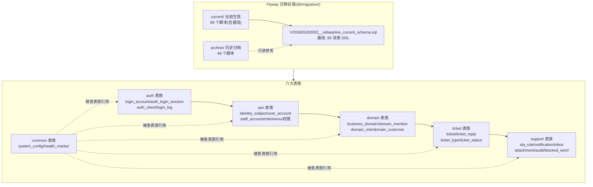
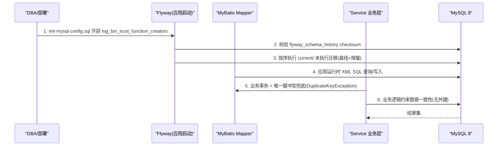
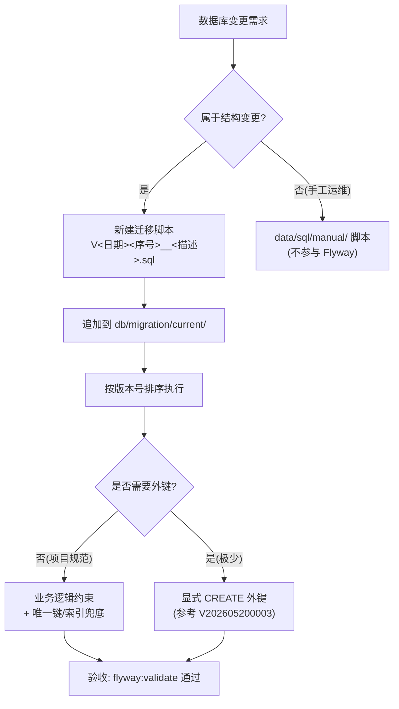
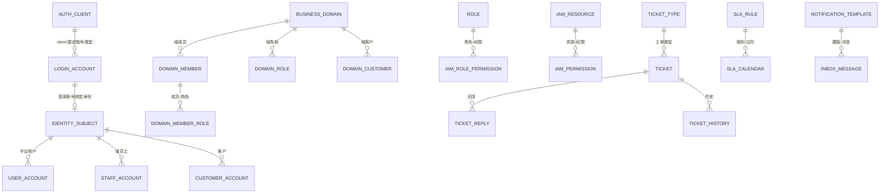
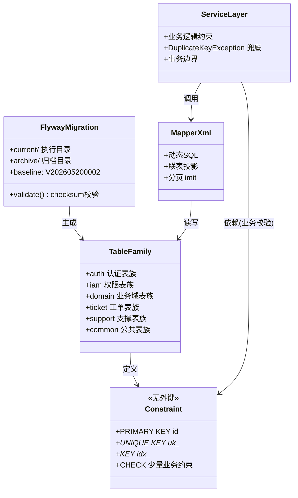

<cite>
- [UnionDesk/uniondesk-app/src/main/resources/db/migration/current/V202605200002__rebaseline_current_schema.sql](file://UnionDesk/uniondesk-app/src/main/resources/db/migration/current/V202605200002__rebaseline_current_schema.sql#L1-L17)
- [UnionDesk/uniondesk-app/src/main/resources/db/migration/current/V202605200002__rebaseline_current_schema.sql](file://UnionDesk/uniondesk-app/src/main/resources/db/migration/current/V202605200002__rebaseline_current_schema.sql#L19-L30)
- [UnionDesk/uniondesk-app/src/main/resources/db/migration/current/V202605200002__rebaseline_current_schema.sql](file://UnionDesk/uniondesk-app/src/main/resources/db/migration/current/V202605200002__rebaseline_current_schema.sql#L32-L49)
- [UnionDesk/uniondesk-app/src/main/resources/db/migration/current/V202605200002__rebaseline_current_schema.sql](file://UnionDesk/uniondesk-app/src/main/resources/db/migration/current/V202605200002__rebaseline_current_schema.sql#L51-L60)
- [UnionDesk/uniondesk-app/src/main/resources/db/migration/current/V202605200003__add_audit_fields_to_business_domain.sql](file://UnionDesk/uniondesk-app/src/main/resources/db/migration/current/V202605200003__add_audit_fields_to_business_domain.sql#L1-L13)
- [UnionDesk/uniondesk-app/src/main/resources/db/init-mysql-config.sql](file://UnionDesk/uniondesk-app/src/main/resources/db/init-mysql-config.sql#L1-L14)
- [UnionDesk/uniondesk-app/pom.xml](file://UnionDesk/uniondesk-app/pom.xml#L76-L96)
</cite>

# UnionDesk 数据库设计总览

## 简介

本文档覆盖 UnionDesk 数据库的整体设计：基于 MySQL 8（utf8mb4 + InnoDB），由 Flyway 11.7.2 以 `archive/current` 双目录管理迁移；全库约 65 张表按业务归属分为 auth（认证）、iam（权限账号）、domain（业务域）、ticket（工单）、support（支撑）、common（公共）六大表族；遵循「不使用外键、仅业务逻辑约束」的项目原则，依赖唯一键 + 索引 + 业务层校验保证数据一致性。

章节来源：
- [UnionDesk/uniondesk-app/src/main/resources/db/migration/current/V202605200002__rebaseline_current_schema.sql](file://UnionDesk/uniondesk-app/src/main/resources/db/migration/current/V202605200002__rebaseline_current_schema.sql#L1-L4)
- [UnionDesk/uniondesk-app/pom.xml](file://UnionDesk/uniondesk-app/pom.xml#L76-L96)

## 项目结构

数据库工程按「迁移目录 + 表族」两个维度组织：迁移目录决定脚本生命周期，表族决定业务归属。



图表来源：
- [UnionDesk/uniondesk-app/src/main/resources/db/migration/current/V202605200002__rebaseline_current_schema.sql](file://UnionDesk/uniondesk-app/src/main/resources/db/migration/current/V202605200002__rebaseline_current_schema.sql#L1-L4)
- [UnionDesk/uniondesk-app/src/main/resources/db/migration/current/V202605200002__rebaseline_current_schema.sql](file://UnionDesk/uniondesk-app/src/main/resources/db/migration/current/V202605200002__rebaseline_current_schema.sql#L6-L17)（access_ip_policy 起）

## 核心组件

**基线表结构规范**（以 rebaseline 脚本为准）：

| 规范要素 | 约定 | 示例 |
| --- | --- | --- |
| 主键 | `id bigint unsigned NOT NULL AUTO_INCREMENT` | `PRIMARY KEY (id)` |
| 唯一键 | `UNIQUE KEY uk_<表>_<字段>` | `uk_access_ip_policy (scope_type,scope_id,portal_type)` |
| 普通索引 | `KEY idx_<表>_<字段>` | `idx_auth_client_status (status)` |
| 业务约束 | 业务逻辑校验 + 少量 `CHECK` 约束 | `chk_auth_client_account_type`（allowed_account_type in admin/customer） |
| 时间字段 | `created_at/updated_at datetime(3)`，默认当前时间、ON UPDATE 自动更新 | 各表通用 |
| 审计字段 | `created_by/updated_by BIGINT UNSIGNED`（后置迁移补充） | `business_domain` 于 V202605200003 补充 |
| 引擎/字符集 | InnoDB + utf8mb4 + utf8mb4_0900_ai_ci | 各表 `ENGINE=InnoDB DEFAULT CHARSET=utf8mb4` |
| JSON 扩展 | 灵活结构用 JSON 列（如 `visibility_policy_codes`、`allowed_types_json`） | 业务域/附件策略 |

**表族清单**（按归属）：

- auth：`auth_client`、`auth_login_config`、`auth_login_session`、`login_log`、`auth_login_log`、`access_ip_policy`、`identity_binding` 等
- iam：`identity_subject`、`user_account`、`staff_account`、`customer_account`、`role`、`platform_role`、`iam_admin_menu`、`iam_permission`、`iam_resource`、`iam_role_permission`、`iam_role_resource`、`iam_admin_role_menu_relation`、`user_global_role`、`user_domain_role`、`user_organization` 等
- domain：`business_domain`、`domain_config`、`domain_member`、`domain_member_role`、`domain_role`、`domain_role_permission`、`domain_customer`、`domain_template`、`invitation_code` 等
- ticket：`ticket`、`ticket_reply`、`ticket_history`、`ticket_relation`、`ticket_event_log`、`ticket_type`、`ticket_template`、`ticket_priority_level`、`consultation_session`、`consultation_message`、`consultation_ticket_link`、`quick_reply_template`、`feedback` 等
- support：`sla_rule`、`sla_calendar`、`notification_template`、`notification_log`、`inbox_message`、`file_attachment`、`attachment_ref`、`attachment_policy`、`audit_log`、`operation_log`、`blocked_word`、`dynamic_field_config`、`staff_presence`、`customer_cancel_request` 等
- common：`system_config`、`health_marker`、`platform_organization`

章节来源：
- [UnionDesk/uniondesk-app/src/main/resources/db/migration/current/V202605200002__rebaseline_current_schema.sql](file://UnionDesk/uniondesk-app/src/main/resources/db/migration/current/V202605200002__rebaseline_current_schema.sql#L6-L60)
- [UnionDesk/uniondesk-app/src/main/resources/db/migration/current/V202605200003__add_audit_fields_to_business_domain.sql](file://UnionDesk/uniondesk-app/src/main/resources/db/migration/current/V202605200003__add_audit_fields_to_business_domain.sql#L1-L13)

## 架构总览

数据库从初始化到业务查询的完整链路：



图表来源：
- [UnionDesk/uniondesk-app/src/main/resources/db/init-mysql-config.sql](file://UnionDesk/uniondesk-app/src/main/resources/db/init-mysql-config.sql#L1-L14)（全局参数初始化）
- [UnionDesk/uniondesk-app/pom.xml](file://UnionDesk/uniondesk-app/pom.xml#L76-L96)（Flyway 插件配置）

## 详细分析

**设计决策剖析**：

1. **无外键约束**：项目规范明确「不使用数据库外键，仅使用业务逻辑进行约束」（AGENTS.md §3）。表间关系（如 `business_domain.created_by → user_account.id`）由 Service 层维护；V202605200003 迁移中的外键注释为「optional but recommended」，实际以业务层为准。
2. **迁移双目录**：`current/` 是唯一执行来源（Flyway locations 指向它），`archive/` 存放被基线替代的旧脚本仅供阅读；基线与增量脚本共存于 current/，通过版本号排序执行。
3. **基线 rebaseline**：`V202605200002__rebaseline_current_schema.sql`（2205 行）一次性重建全部 65 张表，将 46 个 archive 脚本的累积效果固化，新环境只需执行基线 + 后续增量。
4. **类型规范**：ID 统一 `bigint unsigned`；状态用 `tinyint`；策略/扩展用 `json`；时间用 `datetime(3)` 毫秒精度；文本用 `varchar` + `utf8mb4_0900_ai_ci` 排序规则。
5. **约束补充路径**：除唯一键/索引外，允许少量 `CHECK` 约束（如 `chk_auth_client_account_type`），复杂业务规则（如可见性策略 `visibility_policy_codes`）用 JSON 列承载并在 Service 层校验。



图表来源：
- [UnionDesk/uniondesk-app/src/main/resources/db/migration/current/V202605200003__add_audit_fields_to_business_domain.sql](file://UnionDesk/uniondesk-app/src/main/resources/db/migration/current/V202605200003__add_audit_fields_to_business_domain.sql#L1-L13)
- [UnionDesk/uniondesk-app/src/main/resources/db/migration/current/V202605200002__rebaseline_current_schema.sql](file://UnionDesk/uniondesk-app/src/main/resources/db/migration/current/V202605200002__rebaseline_current_schema.sql#L1-L4)

## 数据模型

六大表族的顶层 ER 关系（省略具体字段，关系用业务键表达）：



图表来源：
- [UnionDesk/uniondesk-app/src/main/resources/db/migration/current/V202605200002__rebaseline_current_schema.sql](file://UnionDesk/uniondesk-app/src/main/resources/db/migration/current/V202605200002__rebaseline_current_schema.sql#L32-L60)（auth_client、business_domain 等表）

## 依赖关系分析



图表来源：
- [UnionDesk/uniondesk-app/src/main/resources/db/migration/current/V202605200002__rebaseline_current_schema.sql](file://UnionDesk/uniondesk-app/src/main/resources/db/migration/current/V202605200002__rebaseline_current_schema.sql#L6-L17)
- [UnionDesk/uniondesk-app/src/main/resources/db/init-mysql-config.sql](file://UnionDesk/uniondesk-app/src/main/resources/db/init-mysql-config.sql#L1-L14)

## 性能与安全考虑

- **索引策略**：每个表以 `id` 主键 + 业务唯一键 `uk_*` 保证幂等与去重（如 `uk_access_ip_policy` 复合唯一键）；高频查询字段建立 `idx_*` 普通索引（如 `idx_auth_client_status`）；联表查询在关联列上均有索引支撑。
- **并发安全**：无外键 + 业务层事务控制写并发；唯一键冲突通过捕获 `DuplicateKeyException` 转为业务错误；乐观更新依赖 `updated_at` 时间戳。
- **安全**：迁移脚本含本地开发凭据（插件配置），生产环境凭据外置；`init-mysql-config.sql` 需 root 权限执行，仅设置 `log_bin_trust_function_creators` 全局参数，不改动业务数据。
- **迁移风险**：`cleanDisabled=false` 允许 clean 仅限受控环境；生产禁止 `flyway clean`；`flyway:validate` 作为变更前置校验。

章节来源：
- [UnionDesk/uniondesk-app/src/main/resources/db/init-mysql-config.sql](file://UnionDesk/uniondesk-app/src/main/resources/db/init-mysql-config.sql#L1-L14)
- [UnionDesk/uniondesk-app/pom.xml](file://UnionDesk/uniondesk-app/pom.xml#L76-L96)

## 故障排查指南

| 现象 | 原因 | 处理建议 |
| --- | --- | --- |
| 启动报 `FlywayValidateException` | 已执行脚本被修改（checksum 变化）或迁移顺序错乱 | 恢复脚本原内容；`SELECT * FROM flyway_schema_history ORDER BY installed_rank` 定位差异；必要时修复 `success` 状态 |
| 迁移执行报「函数/触发器权限不足」 | 未先执行 `init-mysql-config.sql` 开启 `log_bin_trust_function_creators` | 以 root 执行 `mysql -u root -p < init-mysql-config.sql` 后重试 |
| 业务写入报重复键 | 唯一键冲突（如同 scope 重复策略、重复邀请码） | 检查业务幂等逻辑；捕获 `DuplicateKeyException` 转为友好错误码 |
| `flyway clean` 误执行导致数据丢失 | 受控环境误操作 | 生产禁止配置 clean；立即从备份恢复（`scripts/DbBackup.java` 生成的备份） |
| 查询慢（联表列表） | 缺失关联索引 | 对照 `idx_*` 规范补索引（新迁移脚本方式），禁止直接改库 |

章节来源：
- [UnionDesk/uniondesk-app/src/main/resources/db/init-mysql-config.sql](file://UnionDesk/uniondesk-app/src/main/resources/db/init-mysql-config.sql#L4-L14)
- [UnionDesk/uniondesk-app/pom.xml](file://UnionDesk/uniondesk-app/pom.xml#L76-L96)

## 结论

UnionDesk 数据库设计以「**MySQL 8 + InnoDB + utf8mb4 基线、Flyway 双目录迁移、无外键业务约束、唯一键/索引兜底**」为核心：65 张表按六大表族组织，`V202605200002` 基线脚本统一结构，后续增量只追加；数据一致性交给 Service 层事务与唯一键冲突处理。该设计在保证多业务域灵活扩展的同时，将结构演进全部收敛到迁移目录，可审计、可回滚。

章节来源：
- [UnionDesk/uniondesk-app/src/main/resources/db/migration/current/V202605200002__rebaseline_current_schema.sql](file://UnionDesk/uniondesk-app/src/main/resources/db/migration/current/V202605200002__rebaseline_current_schema.sql#L1-L4)
- [UnionDesk/uniondesk-app/src/main/resources/db/migration/current/V202605200003__add_audit_fields_to_business_domain.sql](file://UnionDesk/uniondesk-app/src/main/resources/db/migration/current/V202605200003__add_audit_fields_to_business_domain.sql#L1-L13)

## 附录

数据库操作示例：

```bash
# 1. 首次初始化（root 权限）
mysql -u root -p < UnionDesk/uniondesk-app/src/main/resources/db/init-mysql-config.sql

# 2. 查看迁移状态
mvn -pl uniondesk-app flyway:info

# 3. 校验迁移（开发提交前）
mvn -pl uniondesk-app flyway:validate

# 4. 查看已执行历史
mysql -u uniondesk_app -p -h 127.0.0.1 -P 30306 uniondesk \
  -e "SELECT installed_rank, version, description, success FROM flyway_schema_history ORDER BY installed_rank;"
```

新增表的迁移脚本模板：

```sql
-- V202608130001__add_xxx_table.sql
CREATE TABLE IF NOT EXISTS `xxx` (
  `id` bigint unsigned NOT NULL AUTO_INCREMENT,
  `code` varchar(64) NOT NULL,
  `status` tinyint NOT NULL DEFAULT '1',
  `created_at` datetime(3) NOT NULL DEFAULT CURRENT_TIMESTAMP(3),
  `updated_at` datetime(3) NOT NULL DEFAULT CURRENT_TIMESTAMP(3) ON UPDATE CURRENT_TIMESTAMP(3),
  PRIMARY KEY (`id`),
  UNIQUE KEY `uk_xxx_code` (`code`)
) ENGINE=InnoDB DEFAULT CHARSET=utf8mb4 COLLATE=utf8mb4_0900_ai_ci COMMENT='XXX 表';
```

章节来源：
- [UnionDesk/uniondesk-app/src/main/resources/db/migration/current/V202605200002__rebaseline_current_schema.sql](file://UnionDesk/uniondesk-app/src/main/resources/db/migration/current/V202605200002__rebaseline_current_schema.sql#L6-L17)（表 DDL 模板）
- [UnionDesk/uniondesk-app/pom.xml](file://UnionDesk/uniondesk-app/pom.xml#L76-L96)（flyway 命令可用）
