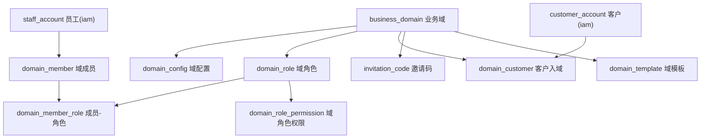
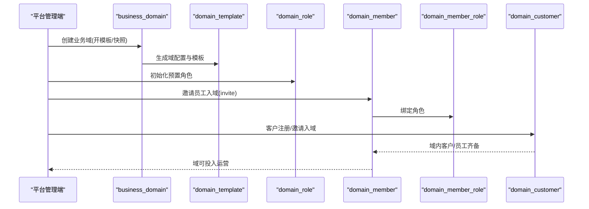
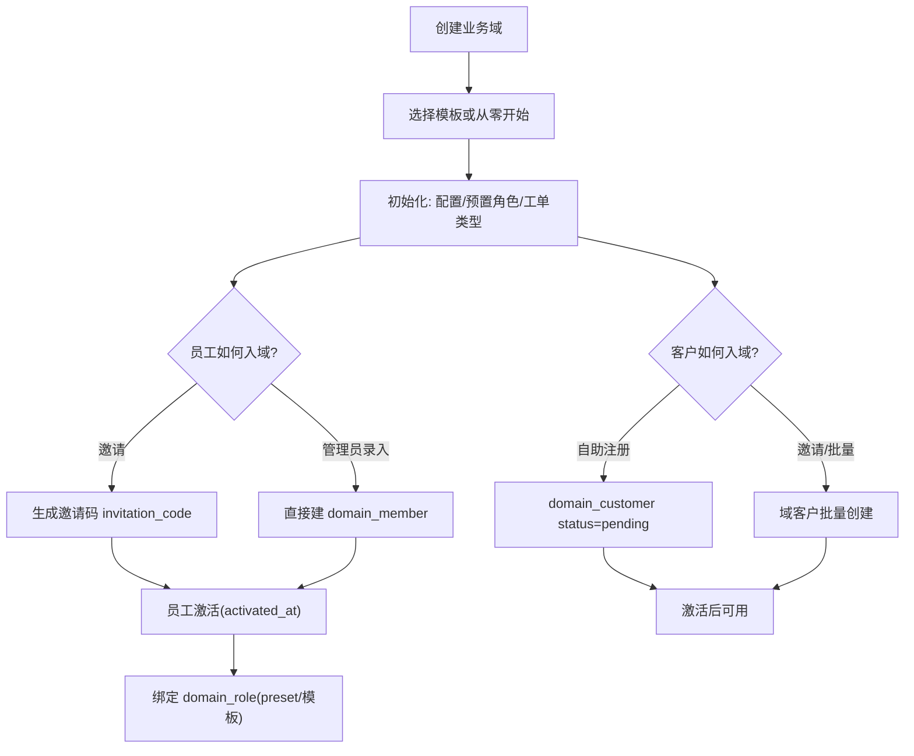
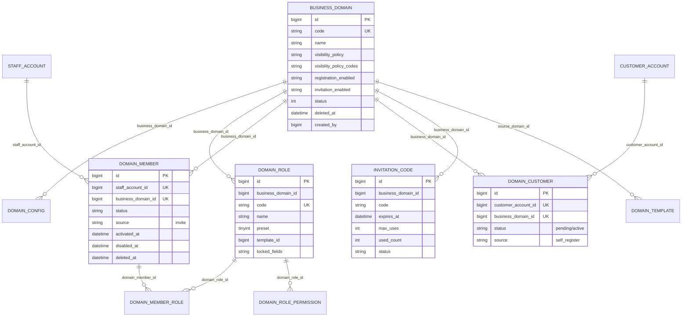
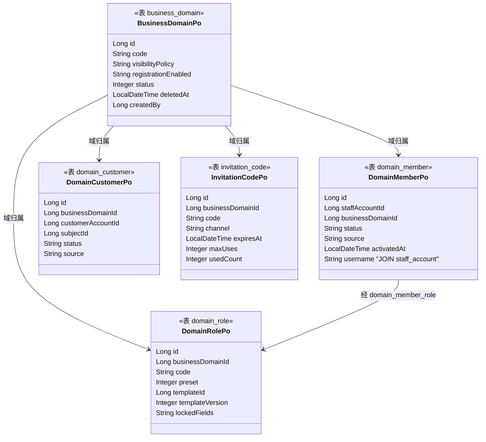

<cite>
- [UnionDesk/uniondesk-app/src/main/resources/db/migration/current/V202605200002__rebaseline_current_schema.sql](file://UnionDesk/uniondesk-app/src/main/resources/db/migration/current/V202605200002__rebaseline_current_schema.sql#L51-L60)
- [UnionDesk/uniondesk-app/src/main/resources/db/migration/current/V202605200002__rebaseline_current_schema.sql](file://UnionDesk/uniondesk-app/src/main/resources/db/migration/current/V202605200002__rebaseline_current_schema.sql#L108-L119)
- [UnionDesk/uniondesk-app/src/main/resources/db/migration/current/V202605200002__rebaseline_current_schema.sql](file://UnionDesk/uniondesk-app/src/main/resources/db/migration/current/V202605200002__rebaseline_current_schema.sql#L121-L132)
- [UnionDesk/uniondesk-app/src/main/resources/db/migration/current/V202605200002__rebaseline_current_schema.sql](file://UnionDesk/uniondesk-app/src/main/resources/db/migration/current/V202605200002__rebaseline_current_schema.sql#L313-L329)
- [UnionDesk/uniondesk-app/src/main/resources/db/migration/current/V202605200002__rebaseline_current_schema.sql](file://UnionDesk/uniondesk-app/src/main/resources/db/migration/current/V202605200002__rebaseline_current_schema.sql#L616-L642)
- [UnionDesk/uniondesk-app/src/main/resources/db/migration/current/V202605200002__rebaseline_current_schema.sql](file://UnionDesk/uniondesk-app/src/main/resources/db/migration/current/V202605200002__rebaseline_current_schema.sql#L134-L147)
- [UnionDesk/uniondesk-domain/src/main/java/com/uniondesk/domain/entity/BusinessDomainPo.java](file://UnionDesk/uniondesk-domain/src/main/java/com/uniondesk/domain/entity/BusinessDomainPo.java#L5-L24)
- [UnionDesk/uniondesk-domain/src/main/java/com/uniondesk/domain/entity/DomainMemberPo.java](file://UnionDesk/uniondesk-domain/src/main/java/com/uniondesk/domain/entity/DomainMemberPo.java#L5-L21)
- [UnionDesk/uniondesk-domain/src/main/java/com/uniondesk/domain/entity/DomainRolePo.java](file://UnionDesk/uniondesk-domain/src/main/java/com/uniondesk/domain/entity/DomainRolePo.java#L5-L16)
- [UnionDesk/uniondesk-domain/src/main/java/com/uniondesk/domain/entity/DomainCustomerPo.java](file://UnionDesk/uniondesk-domain/src/main/java/com/uniondesk/domain/entity/DomainCustomerPo.java#L5-L22)
- [UnionDesk/uniondesk-domain/src/main/java/com/uniondesk/domain/entity/InvitationCodePo.java](file://UnionDesk/uniondesk-domain/src/main/java/com/uniondesk/domain/entity/InvitationCodePo.java#L5-L16)
</cite>

# UnionDesk 业务域表

## 简介

本文档详解 domain 表族全部核心表：`business_domain`（业务域根实体）、`domain_config`（域配置）、`domain_role`（域角色）、`domain_member`（域成员）、`domain_member_role`（成员-角色绑定）、`domain_customer`（客户入域）、`domain_role_permission`（域角色权限）、`invitation_code`（邀请码）、`domain_template`（域模板）。业务域是 UnionDesk 的租户单元，承载「员工、客户、角色、配置」的域内隔离。

章节来源：
- [UnionDesk/uniondesk-app/src/main/resources/db/migration/current/V202605200002__rebaseline_current_schema.sql](file://UnionDesk/uniondesk-app/src/main/resources/db/migration/current/V202605200002__rebaseline_current_schema.sql#L51-L60)
- [UnionDesk/uniondesk-app/src/main/resources/db/migration/current/V202605200002__rebaseline_current_schema.sql](file://UnionDesk/uniondesk-app/src/main/resources/db/migration/current/V202605200002__rebaseline_current_schema.sql#L121-L132)

## 项目结构

业务域表族的结构关系：



图表来源：
- [UnionDesk/uniondesk-app/src/main/resources/db/migration/current/V202605200002__rebaseline_current_schema.sql](file://UnionDesk/uniondesk-app/src/main/resources/db/migration/current/V202605200002__rebaseline_current_schema.sql#L51-L60)
- [UnionDesk/uniondesk-app/src/main/resources/db/migration/current/V202605200002__rebaseline_current_schema.sql](file://UnionDesk/uniondesk-app/src/main/resources/db/migration/current/V202605200002__rebaseline_current_schema.sql#L616-L642)

## 核心组件

**business_domain（L51-60）**：业务域根实体。`code` 唯一业务码；`name` 名称；`visibility_policy`（global 等可见性策略）+ `visibility_policy_codes`（JSON 扩展码）；`registration_enabled/invitation_enabled` 注册/邀请开关；`status` 状态；`deleted_at` 软删除；`created_by/updated_by` 审计字段（V202605200003 补充）。

**domain_config（L108-119）**：域配置键值表。`(business_domain_id, config_key)` 复合唯一；`value_type` 值类型。

**domain_role（L121-132）**：域内角色。`(business_domain_id, code)` 复合唯一；`preset` 预置标记。对应实体 `DomainRolePo` 另有 `template_id/template_version/locked_fields`（模板来源与锁定字段）。

**domain_member（L616-632）**：域成员（员工）。`(staff_account_id, business_domain_id)` 复合唯一；`status`（active）；`source`（invite）；`activated_at/disabled_at/deleted_at` 生命周期。

**domain_member_role（L634-642）**：成员-角色绑定。联合主键 `(domain_member_id, domain_role_id)`，两侧外键。

**domain_customer（L313-329）**：客户入域关系。`(customer_account_id, business_domain_id)` 复合唯一；`status` 默认 `pending`（待激活）；`source` 默认 `self_register`；生命周期字段同成员。

**domain_role_permission（L498）**：域角色权限绑定（`domain_role_id + permission_id`）。

**invitation_code（L378）**：邀请码。`business_domain_id` 归属；`code/channel/expires_at/max_uses/used_count/status` 控制发放与使用。

**domain_template（L134-147）**：域模板。`template_type/name/snapshot_json`（快照 JSON）；`source_domain_id` 溯源；`status`（draft）。

章节来源：
- [UnionDesk/uniondesk-app/src/main/resources/db/migration/current/V202605200002__rebaseline_current_schema.sql](file://UnionDesk/uniondesk-app/src/main/resources/db/migration/current/V202605200002__rebaseline_current_schema.sql#L108-L147)
- [UnionDesk/uniondesk-app/src/main/resources/db/migration/current/V202605200002__rebaseline_current_schema.sql](file://UnionDesk/uniondesk-app/src/main/resources/db/migration/current/V202605200002__rebaseline_current_schema.sql#L313-L329)
- [UnionDesk/uniondesk-app/src/main/resources/db/migration/current/V202605200002__rebaseline_current_schema.sql](file://UnionDesk/uniondesk-app/src/main/resources/db/migration/current/V202605200002__rebaseline_current_schema.sql#L616-L642)

## 架构总览

「创建业务域 → 邀请成员/客户 → 分配角色 → 域内作业」的时序：



图表来源：
- [UnionDesk/uniondesk-app/src/main/resources/db/migration/current/V202605200002__rebaseline_current_schema.sql](file://UnionDesk/uniondesk-app/src/main/resources/db/migration/current/V202605200002__rebaseline_current_schema.sql#L134-L147)（模板）
- [UnionDesk/uniondesk-app/src/main/resources/db/migration/current/V202605200002__rebaseline_current_schema.sql](file://UnionDesk/uniondesk-app/src/main/resources/db/migration/current/V202605200002__rebaseline_current_schema.sql#L616-L642)（成员与角色）

## 详细分析

**关键设计**：

1. **域是租户隔离单元**：`business_domain` 软删除（`deleted_at`）+ 可见性策略（`visibility_policy` + JSON `visibility_policy_codes` 支持 public/domain_customer_only/channel_only 等扩展）；`registration_enabled/invitation_enabled` 控制入域方式。
2. **成员与客户双轨入域**：员工走 `domain_member`（source=invite，管理端邀请）；客户走 `domain_customer`（source=self_register 默认 pending，需激活）。两者均为「账号 × 域」复合唯一，同一账号可入多域。
3. **域角色三层绑定**：`domain_role`（域内角色定义，preset 预置）→ `domain_role_permission`（角色挂权限码）→ `domain_member_role`（成员挂角色）。`DomainRolePo` 的 `template_id/template_version/locked_fields` 支持角色模板继承与字段锁定（模板升级后锁定字段不可本地改）。
4. **域配置键值化**：`domain_config` 用 `(domain_id, config_key)` 复合唯一存任意域级配置，避免频繁 ALTER。
5. **模板快照**：`domain_template.snapshot_json` 存角色/权限/工单类型等整体快照，`source_domain_id` 支持「从现有域复制」建新域；`DomainTeamTemplateApplier` 负责把模板应用到目标域。
6. **邀请码风控**：`invitation_code` 的 `expires_at/max_uses/used_count` 控制邀请码有效期与用量，防止滥用。



图表来源：
- [UnionDesk/uniondesk-app/src/main/resources/db/migration/current/V202605200002__rebaseline_current_schema.sql](file://UnionDesk/uniondesk-app/src/main/resources/db/migration/current/V202605200002__rebaseline_current_schema.sql#L313-L329)（客户入域状态机）
- [UnionDesk/uniondesk-app/src/main/resources/db/migration/current/V202605200002__rebaseline_current_schema.sql](file://UnionDesk/uniondesk-app/src/main/resources/db/migration/current/V202605200002__rebaseline_current_schema.sql#L616-L642)（成员与角色绑定）

## 数据模型

业务域表族 ER 图：



图表来源：
- [UnionDesk/uniondesk-app/src/main/resources/db/migration/current/V202605200002__rebaseline_current_schema.sql](file://UnionDesk/uniondesk-app/src/main/resources/db/migration/current/V202605200002__rebaseline_current_schema.sql#L51-L60)
- [UnionDesk/uniondesk-app/src/main/resources/db/migration/current/V202605200002__rebaseline_current_schema.sql](file://UnionDesk/uniondesk-app/src/main/resources/db/migration/current/V202605200002__rebaseline_current_schema.sql#L616-L642)
- [UnionDesk/uniondesk-app/src/main/resources/db/migration/current/V202605200002__rebaseline_current_schema.sql](file://UnionDesk/uniondesk-app/src/main/resources/db/migration/current/V202605200002__rebaseline_current_schema.sql#L313-L329)

## 依赖关系分析

实体类 ↔ 表映射：



图表来源：
- [UnionDesk/uniondesk-domain/src/main/java/com/uniondesk/domain/entity/BusinessDomainPo.java](file://UnionDesk/uniondesk-domain/src/main/java/com/uniondesk/domain/entity/BusinessDomainPo.java#L5-L24)
- [UnionDesk/uniondesk-domain/src/main/java/com/uniondesk/domain/entity/DomainMemberPo.java](file://UnionDesk/uniondesk-domain/src/main/java/com/uniondesk/domain/entity/DomainMemberPo.java#L5-L21)
- [UnionDesk/uniondesk-domain/src/main/java/com/uniondesk/domain/entity/DomainRolePo.java](file://UnionDesk/uniondesk-domain/src/main/java/com/uniondesk/domain/entity/DomainRolePo.java#L5-L16)
- [UnionDesk/uniondesk-domain/src/main/java/com/uniondesk/domain/entity/DomainCustomerPo.java](file://UnionDesk/uniondesk-domain/src/main/java/com/uniondesk/domain/entity/DomainCustomerPo.java#L5-L22)
- [UnionDesk/uniondesk-domain/src/main/java/com/uniondesk/domain/entity/InvitationCodePo.java](file://UnionDesk/uniondesk-domain/src/main/java/com/uniondesk/domain/entity/InvitationCodePo.java#L5-L16)

## 性能与安全考虑

- **索引**：`domain_member`/`domain_customer` 的 `(xxx_id, business_domain_id)` 复合唯一键防重复入域；`idx_domain_member_domain_status`/`idx_domain_customer_domain_status` 支撑「按域+状态」列表查询；`domain_config` 复合唯一键支撑键值读写。
- **隔离安全**：所有域内数据以 `business_domain_id` 为过滤维度，配合权限拦截器实现租户隔离；`visibility_policy` 控制域对外的可见性。
- **入域风控**：`domain_customer.status` 默认 pending，需激活才能提单；邀请码限时限量；员工 `source=invite` 可追溯来源。
- **数据治理**：软删除（`deleted_at`）保留审计，物理清理走归档流程；模板快照 JSON 版本化便于追溯。

章节来源：
- [UnionDesk/uniondesk-app/src/main/resources/db/migration/current/V202605200002__rebaseline_current_schema.sql](file://UnionDesk/uniondesk-app/src/main/resources/db/migration/current/V202605200002__rebaseline_current_schema.sql#L313-L329)
- [UnionDesk/uniondesk-app/src/main/resources/db/migration/current/V202605200002__rebaseline_current_schema.sql](file://UnionDesk/uniondesk-app/src/main/resources/db/migration/current/V202605200002__rebaseline_current_schema.sql#L616-L642)

## 故障排查指南

| 现象 | 原因 | 处理建议 |
| --- | --- | --- |
| 员工无法登录域控制台 | `domain_member` 无记录或 `status != active`/`deleted_at` 非空 | 检查成员记录与激活状态；重新邀请或激活 |
| 客户入域后不能提单 | `domain_customer.status=pending` 未激活 | 激活客户入域记录（activated_at 落值） |
| 域管理员看不到角色 | `domain_role` 与 `domain_member_role` 绑定缺失 | 核对成员-角色关联；确认角色 preset/模板状态 |
| 邀请码失效 | `expires_at` 过期或 `used_count >= max_uses` | 检查邀请码状态字段；重新生成 |
| 模板应用后角色字段丢失 | `domain_template.snapshot_json` 与目标域结构不兼容 | 核对快照版本；检查 `locked_fields` 锁定策略 |

章节来源：
- [UnionDesk/uniondesk-app/src/main/resources/db/migration/current/V202605200002__rebaseline_current_schema.sql](file://UnionDesk/uniondesk-app/src/main/resources/db/migration/current/V202605200002__rebaseline_current_schema.sql#L134-L147)（模板）
- [UnionDesk/uniondesk-app/src/main/resources/db/migration/current/V202605200002__rebaseline_current_schema.sql](file://UnionDesk/uniondesk-app/src/main/resources/db/migration/current/V202605200002__rebaseline_current_schema.sql#L313-L329)（客户入域）

## 结论

业务域表族是 UnionDesk 多租户能力的载体：`business_domain` 为根，`domain_config` 承载配置，`domain_member`/`domain_customer` 双轨承载员工与客户入域，`domain_role`+`domain_member_role`+`domain_role_permission` 完成域内权限闭环，`invitation_code` 与 `domain_template` 提供引流与批量建域能力。所有成员/客户/角色均以「账号 × 域」复合唯一键约束，保证跨域数据隔离与可追溯。

章节来源：
- [UnionDesk/uniondesk-app/src/main/resources/db/migration/current/V202605200002__rebaseline_current_schema.sql](file://UnionDesk/uniondesk-app/src/main/resources/db/migration/current/V202605200002__rebaseline_current_schema.sql#L51-L60)
- [UnionDesk/uniondesk-app/src/main/resources/db/migration/current/V202605200002__rebaseline_current_schema.sql](file://UnionDesk/uniondesk-app/src/main/resources/db/migration/current/V202605200002__rebaseline_current_schema.sql#L616-L642)

## 附录

业务域相关 SQL 示例：

```sql
-- 1. 查询某域全部成员及其角色
SELECT dm.id AS member_id, sa.login_name, dm.status AS member_status,
       dr.name AS role_name
FROM domain_member dm
JOIN staff_account sa ON sa.id = dm.staff_account_id
LEFT JOIN domain_member_role dmr ON dmr.domain_member_id = dm.id
LEFT JOIN domain_role dr ON dr.id = dmr.domain_role_id
WHERE dm.business_domain_id = 1 AND dm.deleted_at IS NULL;

-- 2. 查询某域客户入域状态分布
SELECT status, COUNT(*) AS cnt
FROM domain_customer
WHERE business_domain_id = 1
GROUP BY status;

-- 3. 校验邀请码可用性
SELECT code, expires_at, max_uses, used_count, status
FROM invitation_code
WHERE business_domain_id = 1 AND code = 'INV2026'
  AND status = 'active' AND expires_at > NOW() AND used_count < max_uses;
```

实体映射示例：

```java
// 员工入域
DomainMemberPo member = new DomainMemberPo();
member.setStaffAccountId(1001L);
member.setBusinessDomainId(1L);
member.setStatus("active");
member.setSource("invite");
member.setActivatedAt(LocalDateTime.now());
```

章节来源：
- [UnionDesk/uniondesk-domain/src/main/java/com/uniondesk/domain/entity/DomainMemberPo.java](file://UnionDesk/uniondesk-domain/src/main/java/com/uniondesk/domain/entity/DomainMemberPo.java#L5-L21)
- [UnionDesk/uniondesk-domain/src/main/java/com/uniondesk/domain/entity/InvitationCodePo.java](file://UnionDesk/uniondesk-domain/src/main/java/com/uniondesk/domain/entity/InvitationCodePo.java#L5-L16)
