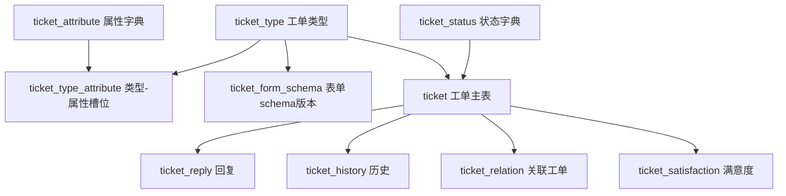
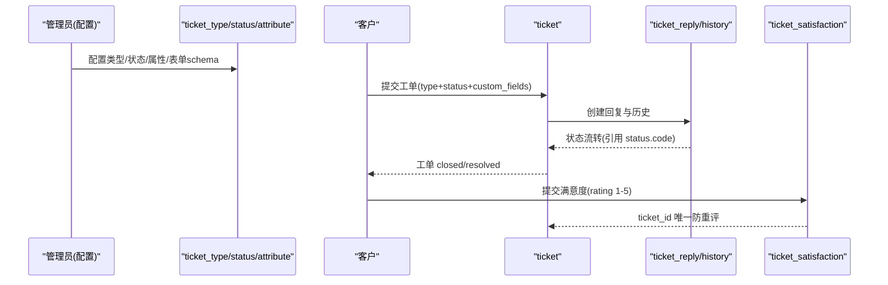
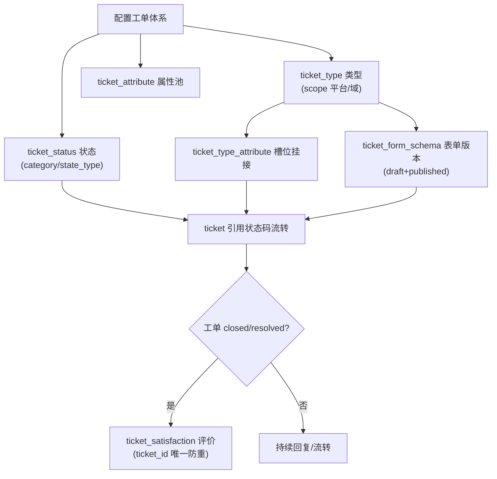
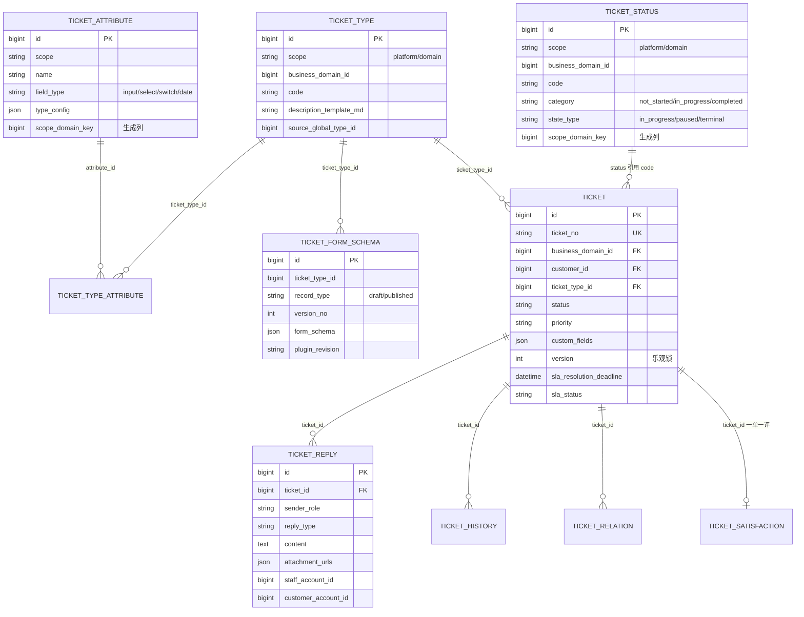
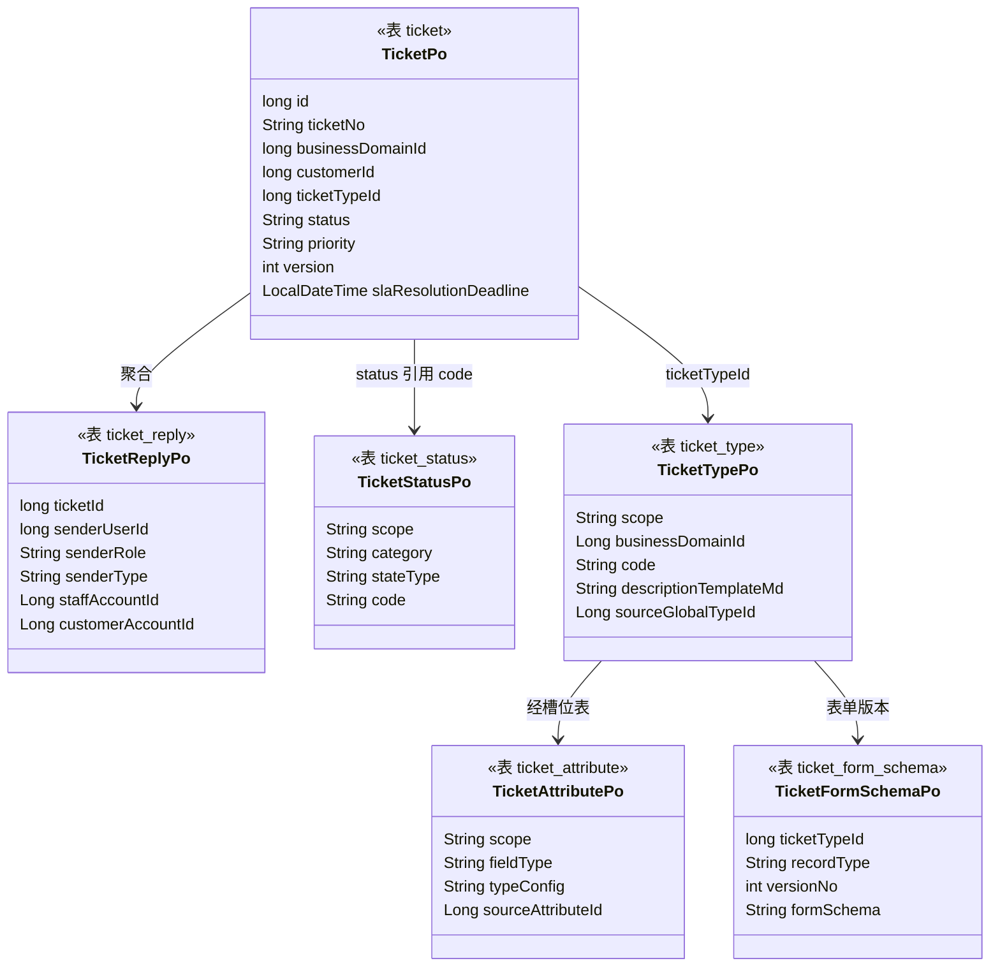

<cite>
- [UnionDesk/uniondesk-app/src/main/resources/db/migration/current/V202605200002__rebaseline_current_schema.sql](file://UnionDesk/uniondesk-app/src/main/resources/db/migration/current/V202605200002__rebaseline_current_schema.sql#L963-L1003)
- [UnionDesk/uniondesk-app/src/main/resources/db/migration/current/V202605200002__rebaseline_current_schema.sql](file://UnionDesk/uniondesk-app/src/main/resources/db/migration/current/V202605200002__rebaseline_current_schema.sql#L1079-L1100)
- [UnionDesk/uniondesk-app/src/main/resources/db/migration/current/V202607070001__ticket_status_table.sql](file://UnionDesk/uniondesk-app/src/main/resources/db/migration/current/V202607070001__ticket_status_table.sql#L1-L27)
- [UnionDesk/uniondesk-app/src/main/resources/db/migration/current/V202606210001__ticket_attribute_and_slots.sql](file://UnionDesk/uniondesk-app/src/main/resources/db/migration/current/V202606210001__ticket_attribute_and_slots.sql#L3-L40)
- [UnionDesk/uniondesk-app/src/main/resources/db/migration/current/V202606200001__ticket_form_schema_version_table.sql](file://UnionDesk/uniondesk-app/src/main/resources/db/migration/current/V202606200001__ticket_form_schema_version_table.sql#L1-L18)
- [UnionDesk/uniondesk-app/src/main/resources/db/migration/current/V20260813130000__ticket_satisfaction.sql](file://UnionDesk/uniondesk-app/src/main/resources/db/migration/current/V20260813130000__ticket_satisfaction.sql#L2-L17)
- [UnionDesk/uniondesk-ticket/src/main/java/com/uniondesk/ticket/entity/TicketPo.java](file://UnionDesk/uniondesk-ticket/src/main/java/com/uniondesk/ticket/entity/TicketPo.java#L5-L31)
- [UnionDesk/uniondesk-ticket/src/main/java/com/uniondesk/ticket/entity/TicketReplyPo.java](file://UnionDesk/uniondesk-ticket/src/main/java/com/uniondesk/ticket/entity/TicketReplyPo.java#L5-L19)
- [UnionDesk/uniondesk-ticket/src/main/java/com/uniondesk/ticket/entity/TicketStatusPo.java](file://UnionDesk/uniondesk-ticket/src/main/java/com/uniondesk/ticket/entity/TicketStatusPo.java#L5-L34)
- [UnionDesk/uniondesk-ticket/src/main/java/com/uniondesk/ticket/entity/TicketTypePo.java](file://UnionDesk/uniondesk-ticket/src/main/java/com/uniondesk/ticket/entity/TicketTypePo.java#L5-L27)
- [UnionDesk/uniondesk-ticket/src/main/java/com/uniondesk/ticket/entity/TicketAttributePo.java](file://UnionDesk/uniondesk-ticket/src/main/java/com/uniondesk/ticket/entity/TicketAttributePo.java#L5-L28)
- [UnionDesk/uniondesk-ticket/src/main/java/com/uniondesk/ticket/entity/TicketFormSchemaPo.java](file://UnionDesk/uniondesk-ticket/src/main/java/com/uniondesk/ticket/entity/TicketFormSchemaPo.java#L5-L21)
</cite>

# UnionDesk 工单核心表

## 简介

本文档详解 ticket 表族全部核心表：`ticket`（工单主表）、`ticket_reply`（回复）、`ticket_history`（历史）、`ticket_relation`（关联）、`ticket_status`（状态字典）、`ticket_type`（工单类型）、`ticket_attribute`（属性字典）+ `ticket_type_attribute`（类型-属性槽位）、`ticket_form_schema`（表单 schema 版本）、`ticket_satisfaction`（满意度）。覆盖字段、索引、版本化机制与实体映射。

章节来源：
- [UnionDesk/uniondesk-app/src/main/resources/db/migration/current/V202605200002__rebaseline_current_schema.sql](file://UnionDesk/uniondesk-app/src/main/resources/db/migration/current/V202605200002__rebaseline_current_schema.sql#L963-L1003)
- [UnionDesk/uniondesk-app/src/main/resources/db/migration/current/V202607070001__ticket_status_table.sql](file://UnionDesk/uniondesk-app/src/main/resources/db/migration/current/V202607070001__ticket_status_table.sql#L1-L27)

## 项目结构

工单表族以 `ticket` 为聚合根，配置类表（类型/状态/属性/schema）与运行类表（回复/历史/关系/满意度）分列两侧：



图表来源：
- [UnionDesk/uniondesk-app/src/main/resources/db/migration/current/V202605200002__rebaseline_current_schema.sql](file://UnionDesk/uniondesk-app/src/main/resources/db/migration/current/V202605200002__rebaseline_current_schema.sql#L963-L1100)
- [UnionDesk/uniondesk-app/src/main/resources/db/migration/current/V202606210001__ticket_attribute_and_slots.sql](file://UnionDesk/uniondesk-app/src/main/resources/db/migration/current/V202606210001__ticket_attribute_and_slots.sql#L27-L40)

## 核心组件

**ticket（L963-1003）**：工单主表。`ticket_no` 唯一业务单号；`business_domain_id/customer_id/ticket_type_id` 三重归属；`status/priority/source/assigned_to/assignee_staff_account_id` 流转字段；`custom_fields` JSON 自定义字段；`version` 乐观锁；SLA 字段组内嵌（`sla_first_response_deadline/sla_resolution_deadline/sla_first_responded_at/sla_resolved_at/sla_status/sla_paused_duration/sla_pause_started_at`）；复合索引覆盖「域+状态+优先级」「客户+时间」「负责人+状态」。

**ticket_reply（L1079-1100）**：回复表。`ticket_id` 归属；`sender_user_id/sender_role/sender_type` 发送方；`staff_account_id/customer_account_id` 双通道；`reply_type` 回复类型；`content` 文本 + `attachment_urls` JSON 附件；索引 `idx_ticket_reply_ticket_created`。

**ticket_history（L1040）**：工单历史轨迹（状态/字段变更留痕）。

**ticket_relation（L1060）**：工单关联关系（关联单号）。

**ticket_status（V202607070001 L3-27）**：状态字典。`scope`（platform/domain）+ `business_domain_id`（platform 为 NULL）；`code/name/category（not_started/in_progress/completed）/state_type（in_progress/paused/terminal）`；**生成列** `scope_domain_key`（platform 恒为 0）支撑跨作用域唯一键：`uk_ticket_status_scope_domain_code`、`uk_ticket_status_scope_domain_name`。

**ticket_type（L696）**：工单类型。`scope`（platform/domain）+ `business_domain_id`；`code/name/description_template_md/icon/category/status/sort_order/system/source_global_type_id`（域类型溯源平台类型）。

**ticket_attribute（V202606210001 L3-24）**：属性字典。`scope + business_domain_id`；`name/field_type（input/select/switch/date）/type_config JSON/status/sort_order/is_system/system_key/source_attribute_id`；生成列 `scope_domain_key` + 唯一键 `uk_ticket_attribute_scope_domain_name`。

**ticket_type_attribute（V202606210001 L27-40）**：类型-属性槽位。`(ticket_type_id, attribute_id)` 复合唯一；`sort_order/slot_config JSON/status`。

**ticket_form_schema（V202606200001 L3-18）**：表单 schema 版本表。`(ticket_type_id, record_type, version_no)` 复合唯一；`record_type` 限 `draft/published`（draft=0，published=1..n，最多保留 10 条）；`form_schema` JSON + `plugin_revision`；索引 `idx_ticket_form_schema_domain_type`、`idx_ticket_form_schema_type_published_at`。

**ticket_satisfaction（V20260813130000 L5-17）**：满意度评价。`(ticket_id)` 唯一约束「一单一评」；`rating` 1-5 星 + `comment`；仅工单 closed/resolved 后客户本人评价一次。

章节来源：
- [UnionDesk/uniondesk-app/src/main/resources/db/migration/current/V202605200002__rebaseline_current_schema.sql](file://UnionDesk/uniondesk-app/src/main/resources/db/migration/current/V202605200002__rebaseline_current_schema.sql#L963-L1003)
- [UnionDesk/uniondesk-app/src/main/resources/db/migration/current/V202607070001__ticket_status_table.sql](file://UnionDesk/uniondesk-app/src/main/resources/db/migration/current/V202607070001__ticket_status_table.sql#L3-L27)
- [UnionDesk/uniondesk-app/src/main/resources/db/migration/current/V202606210001__ticket_attribute_and_slots.sql](file://UnionDesk/uniondesk-app/src/main/resources/db/migration/current/V202606210001__ticket_attribute_and_slots.sql#L3-L40)

## 架构总览

「配置 → 提单 → 处理 → 评价」全链路数据流：



图表来源：
- [UnionDesk/uniondesk-app/src/main/resources/db/migration/current/V202605200002__rebaseline_current_schema.sql](file://UnionDesk/uniondesk-app/src/main/resources/db/migration/current/V202605200002__rebaseline_current_schema.sql#L963-L1100)
- [UnionDesk/uniondesk-app/src/main/resources/db/migration/current/V20260813130000__ticket_satisfaction.sql](file://UnionDesk/uniondesk-app/src/main/resources/db/migration/current/V20260813130000__ticket_satisfaction.sql#L5-L17)

## 详细分析

**关键设计决策**：

1. **工单主表聚合 SLA 与乐观锁**：`ticket` 内嵌 7 个 SLA 字段（时限/响应/暂停），避免高频联表；`version` 乐观锁防并发覆盖。
2. **状态字典用生成列实现跨作用域唯一**：`ticket_status`/`ticket_attribute` 的 `scope_domain_key = CASE WHEN scope='platform' THEN 0 ELSE business_domain_id END`，使「平台状态 code 与域状态 code 互不冲突」由数据库唯一键兜底——同一域内 code/name 唯一，平台与各域独立命名空间。
3. **属性-类型槽位化**：`ticket_attribute` 定义属性池，`ticket_type_attribute` 以槽位（sort_order + slot_config）挂到具体类型，支持不同类型复用属性并差异化配置（必填/默认值等）。
4. **表单 schema 双记录版本化**：`ticket_form_schema` 的 `record_type=draft|published` + `version_no`（draft=0，published=1..n）支撑「草稿编辑 + 发布历史」；`plugin_revision` 记录表单设计器插件版本保证渲染兼容；published 最多保留 10 条。
5. **域类型溯源平台**：`ticket_type.source_global_type_id` 记录域类型复制自哪个平台类型，`ticket_attribute.source_attribute_id` 同理——平台模板 → 域实例的可追溯链。
6. **一单一评**：`ticket_satisfaction` 的 `uk_satisfaction_ticket` 唯一键从数据库层防重复评价；注释明确「仅工单 closed/resolved 后可由客户本人评价一次」。



图表来源：
- [UnionDesk/uniondesk-app/src/main/resources/db/migration/current/V202607070001__ticket_status_table.sql](file://UnionDesk/uniondesk-app/src/main/resources/db/migration/current/V202607070001__ticket_status_table.sql#L21-L27)（生成列与唯一键）
- [UnionDesk/uniondesk-app/src/main/resources/db/migration/current/V202606200001__ticket_form_schema_version_table.sql](file://UnionDesk/uniondesk-app/src/main/resources/db/migration/current/V202606200001__ticket_form_schema_version_table.sql#L1-L18)
- [UnionDesk/uniondesk-app/src/main/resources/db/migration/current/V20260813130000__ticket_satisfaction.sql](file://UnionDesk/uniondesk-app/src/main/resources/db/migration/current/V20260813130000__ticket_satisfaction.sql#L2-L17)

## 数据模型

工单表族 ER 图：



图表来源：
- [UnionDesk/uniondesk-app/src/main/resources/db/migration/current/V202605200002__rebaseline_current_schema.sql](file://UnionDesk/uniondesk-app/src/main/resources/db/migration/current/V202605200002__rebaseline_current_schema.sql#L963-L1003)
- [UnionDesk/uniondesk-app/src/main/resources/db/migration/current/V202607070001__ticket_status_table.sql](file://UnionDesk/uniondesk-app/src/main/resources/db/migration/current/V202607070001__ticket_status_table.sql#L3-L27)
- [UnionDesk/uniondesk-app/src/main/resources/db/migration/current/V202606210001__ticket_attribute_and_slots.sql](file://UnionDesk/uniondesk-app/src/main/resources/db/migration/current/V202606210001__ticket_attribute_and_slots.sql#L3-L40)

## 依赖关系分析

实体类 ↔ 表映射：



图表来源：
- [UnionDesk/uniondesk-ticket/src/main/java/com/uniondesk/ticket/entity/TicketPo.java](file://UnionDesk/uniondesk-ticket/src/main/java/com/uniondesk/ticket/entity/TicketPo.java#L5-L31)
- [UnionDesk/uniondesk-ticket/src/main/java/com/uniondesk/ticket/entity/TicketStatusPo.java](file://UnionDesk/uniondesk-ticket/src/main/java/com/uniondesk/ticket/entity/TicketStatusPo.java#L5-L34)
- [UnionDesk/uniondesk-ticket/src/main/java/com/uniondesk/ticket/entity/TicketTypePo.java](file://UnionDesk/uniondesk-ticket/src/main/java/com/uniondesk/ticket/entity/TicketTypePo.java#L5-L27)
- [UnionDesk/uniondesk-ticket/src/main/java/com/uniondesk/ticket/entity/TicketAttributePo.java](file://UnionDesk/uniondesk-ticket/src/main/java/com/uniondesk/ticket/entity/TicketAttributePo.java#L5-L28)
- [UnionDesk/uniondesk-ticket/src/main/java/com/uniondesk/ticket/entity/TicketFormSchemaPo.java](file://UnionDesk/uniondesk-ticket/src/main/java/com/uniondesk/ticket/entity/TicketFormSchemaPo.java#L5-L21)

## 性能与安全考虑

- **索引**：`ticket` 三复合索引（域+状态+优先级 / 客户+时间 / 负责人+状态）覆盖列表与队列查询；`ticket_reply` 的 `(ticket_id, created_at)` 支撑按单拉取；`ticket_form_schema` 的 `(ticket_type_id, record_type, version_no)` 唯一键支撑版本精确命中。
- **版本化**：`ticket.version` 乐观锁防并发覆盖；schema 版本化（draft/published）保证表单变更可追溯、发布可回退。
- **安全**：`uk_satisfaction_ticket` 防重复评价；`ticket_no` 唯一防重复提单；`business_domain_id` 全表冗余支撑域隔离过滤；`ticket_relation` 关联关系需业务校验防环。
- **数据治理**：历史表随工单量增长需归档；`ticket_form_schema` published 历史限制 10 条防止无限膨胀。

章节来源：
- [UnionDesk/uniondesk-app/src/main/resources/db/migration/current/V202605200002__rebaseline_current_schema.sql](file://UnionDesk/uniondesk-app/src/main/resources/db/migration/current/V202605200002__rebaseline_current_schema.sql#L989-L996)（ticket 索引）
- [UnionDesk/uniondesk-app/src/main/resources/db/migration/current/V202606200001__ticket_form_schema_version_table.sql](file://UnionDesk/uniondesk-app/src/main/resources/db/migration/current/V202606200001__ticket_form_schema_version_table.sql#L15-L17)

## 故障排查指南

| 现象 | 原因 | 处理建议 |
| --- | --- | --- |
| 工单状态显示为未知值 | `ticket.status` 引用了被禁用/删除的状态码 | 对照 `ticket_status` 字典核对 code；检查状态迁移规则是否校验目标状态 |
| 表单发布后客户端渲染异常 | `form_schema` 与 `plugin_revision` 不兼容 | 检查 schema 版本与表单设计器插件版本；回退到上一 published 版本 |
| 满意度无法提交 | 工单未 closed/resolved，或已评价（唯一键冲突） | 核对工单状态；查询 `ticket_satisfaction` 是否已有记录 |
| 同类型重复属性名报唯一键冲突 | 域内属性名已存在（`uk_ticket_attribute_scope_domain_name`） | 更换属性名；确认 scope_domain_key 归属 |
| 工单列表慢 | 查询条件未命中复合索引前缀 | 确认按 `business_domain_id` 前缀查询；必要时补索引（新迁移） |

章节来源：
- [UnionDesk/uniondesk-app/src/main/resources/db/migration/current/V202607070001__ticket_status_table.sql](file://UnionDesk/uniondesk-app/src/main/resources/db/migration/current/V202607070001__ticket_status_table.sql#L24-L27)
- [UnionDesk/uniondesk-app/src/main/resources/db/migration/current/V20260813130000__ticket_satisfaction.sql](file://UnionDesk/uniondesk-app/src/main/resources/db/migration/current/V20260813130000__ticket_satisfaction.sql#L15-L17)

## 结论

工单核心表族以「**配置字典化 + 主表聚合 + 版本化发布 + 数据库唯一键兜底**」为设计主线：`ticket` 聚合归属、流转、SLA 与乐观锁；状态/属性用生成列实现平台与域独立命名空间；类型-属性槽位化支撑灵活表单；schema 双记录版本化支撑发布管理；满意度一单一评由唯一键保证。该结构让工单从配置到评价全链路可追溯、可配置、可扩展。

章节来源：
- [UnionDesk/uniondesk-app/src/main/resources/db/migration/current/V202605200002__rebaseline_current_schema.sql](file://UnionDesk/uniondesk-app/src/main/resources/db/migration/current/V202605200002__rebaseline_current_schema.sql#L963-L1003)
- [UnionDesk/uniondesk-app/src/main/resources/db/migration/current/V202606210001__ticket_attribute_and_slots.sql](file://UnionDesk/uniondesk-app/src/main/resources/db/migration/current/V202606210001__ticket_attribute_and_slots.sql#L3-L40)

## 附录

工单相关 SQL 示例：

```sql
-- 1. 查询某域工单列表（复合索引路径）
SELECT ticket_no, title, status, priority, sla_resolution_deadline
FROM ticket
WHERE business_domain_id = 1 AND status = 'in_progress'
ORDER BY created_at DESC LIMIT 20;

-- 2. 查询工单完整对话
SELECT r.reply_type, r.sender_role, r.content, r.created_at
FROM ticket_reply r
WHERE r.ticket_id = 1001
ORDER BY r.created_at;

-- 3. 查询某类型表单已发布版本
SELECT version_no, published_at, plugin_revision
FROM ticket_form_schema
WHERE ticket_type_id = 5 AND record_type = 'published'
ORDER BY version_no DESC LIMIT 10;

-- 4. 查询状态字典（含生成列效果）
SELECT scope, COALESCE(business_domain_id, 0) AS scope_domain_key, code, category, state_type
FROM ticket_status
ORDER BY scope, scope_domain_key, sort_order;
```

实体映射示例：

```java
// 创建工单
TicketPo ticket = new TicketPo();
ticket.setTicketNo("TK202608130001");
ticket.setBusinessDomainId(1L);
ticket.setCustomerId(100L);
ticket.setTicketTypeId(5L);
ticket.setStatus("open");
ticket.setPriority("high");
ticket.setVersion(0);
```

章节来源：
- [UnionDesk/uniondesk-ticket/src/main/java/com/uniondesk/ticket/entity/TicketPo.java](file://UnionDesk/uniondesk-ticket/src/main/java/com/uniondesk/ticket/entity/TicketPo.java#L5-L31)
- [UnionDesk/uniondesk-ticket/src/main/java/com/uniondesk/ticket/entity/TicketReplyPo.java](file://UnionDesk/uniondesk-ticket/src/main/java/com/uniondesk/ticket/entity/TicketReplyPo.java#L5-L19)
