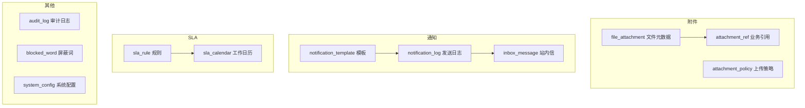
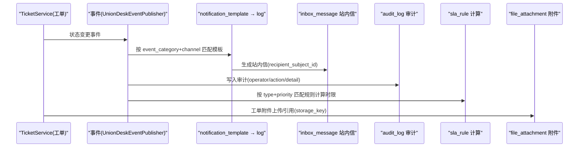
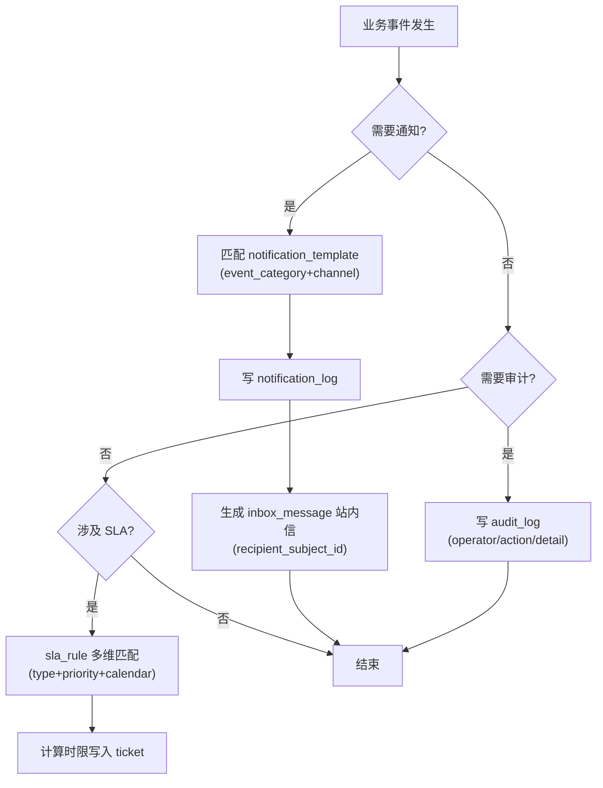
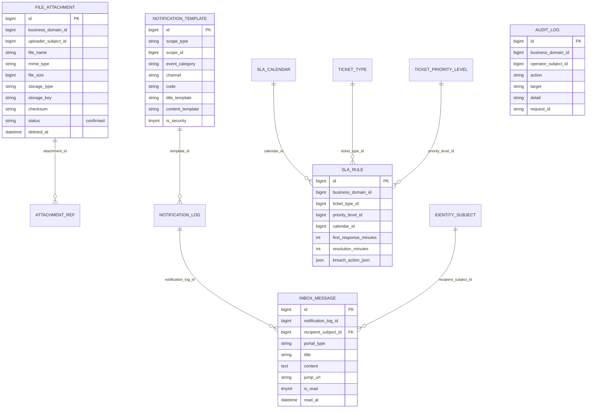
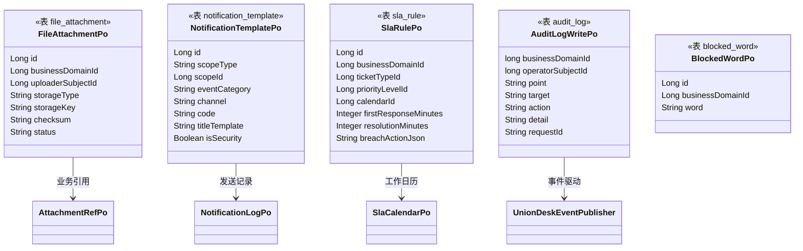

<cite>
- [UnionDesk/uniondesk-app/src/main/resources/db/migration/current/V202605200002__rebaseline_current_schema.sql](file://UnionDesk/uniondesk-app/src/main/resources/db/migration/current/V202605200002__rebaseline_current_schema.sql#L19-L30)
- [UnionDesk/uniondesk-app/src/main/resources/db/migration/current/V202605200002__rebaseline_current_schema.sql](file://UnionDesk/uniondesk-app/src/main/resources/db/migration/current/V202605200002__rebaseline_current_schema.sql#L331-L348)
- [UnionDesk/uniondesk-app/src/main/resources/db/migration/current/V202605200002__rebaseline_current_schema.sql](file://UnionDesk/uniondesk-app/src/main/resources/db/migration/current/V202605200002__rebaseline_current_schema.sql#L445-L468)
- [UnionDesk/uniondesk-app/src/main/resources/db/migration/current/V202605200002__rebaseline_current_schema.sql](file://UnionDesk/uniondesk-app/src/main/resources/db/migration/current/V202605200002__rebaseline_current_schema.sql#L727-L757)
- [UnionDesk/uniondesk-app/src/main/resources/db/migration/current/V202605200002__rebaseline_current_schema.sql](file://UnionDesk/uniondesk-app/src/main/resources/db/migration/current/V202605200002__rebaseline_current_schema.sql#L670-L679)
- [UnionDesk/uniondesk-support/src/main/java/com/uniondesk/attachment/entity/FileAttachmentPo.java](file://UnionDesk/uniondesk-support/src/main/java/com/uniondesk/attachment/entity/FileAttachmentPo.java#L5-L19)
- [UnionDesk/uniondesk-support/src/main/java/com/uniondesk/notification/entity/NotificationTemplatePo.java](file://UnionDesk/uniondesk-support/src/main/java/com/uniondesk/notification/entity/NotificationTemplatePo.java#L5-L19)
- [UnionDesk/uniondesk-support/src/main/java/com/uniondesk/sla/entity/SlaRulePo.java](file://UnionDesk/uniondesk-support/src/main/java/com/uniondesk/sla/entity/SlaRulePo.java#L5-L18)
- [UnionDesk/uniondesk-support/src/main/java/com/uniondesk/audit/entity/AuditLogWritePo.java](file://UnionDesk/uniondesk-support/src/main/java/com/uniondesk/audit/entity/AuditLogWritePo.java#L3-L14)
- [UnionDesk/uniondesk-support/src/main/java/com/uniondesk/blockedword/entity/BlockedWordPo.java](file://UnionDesk/uniondesk-support/src/main/java/com/uniondesk/blockedword/entity/BlockedWordPo.java#L5-L11)
</cite>

# UnionDesk 支撑服务表

## 简介

本文档详解 support 表族的全部核心表：附件（`file_attachment`/`attachment_ref`/`attachment_policy`）、通知（`notification_template`/`notification_log`/`inbox_message`）、SLA（`sla_rule`/`sla_calendar`）、审计（`audit_log`）、屏蔽词（`blocked_word`）、系统配置（`system_config`）。这些表为工单与业务域提供横切支撑能力。

章节来源：
- [UnionDesk/uniondesk-app/src/main/resources/db/migration/current/V202605200002__rebaseline_current_schema.sql](file://UnionDesk/uniondesk-app/src/main/resources/db/migration/current/V202605200002__rebaseline_current_schema.sql#L19-L30)
- [UnionDesk/uniondesk-app/src/main/resources/db/migration/current/V202605200002__rebaseline_current_schema.sql](file://UnionDesk/uniondesk-app/src/main/resources/db/migration/current/V202605200002__rebaseline_current_schema.sql#L445-L468)

## 项目结构

支撑表族按六大能力组织：



图表来源：
- [UnionDesk/uniondesk-app/src/main/resources/db/migration/current/V202605200002__rebaseline_current_schema.sql](file://UnionDesk/uniondesk-app/src/main/resources/db/migration/current/V202605200002__rebaseline_current_schema.sql#L331-L348)
- [UnionDesk/uniondesk-app/src/main/resources/db/migration/current/V202605200002__rebaseline_current_schema.sql](file://UnionDesk/uniondesk-app/src/main/resources/db/migration/current/V202605200002__rebaseline_current_schema.sql#L445-L468)

## 核心组件

**附件组**：
- `file_attachment`（L331-348）：文件元数据。`business_domain_id` 域归属（可空）；`uploader_subject_id` 上传者身份；`portal_type` 门户类型；`file_name/mime_type/file_size/checksum` 文件信息；`storage_type/storage_key` 对象存储定位；`status`（confirmed）；`deleted_at` 软删除。索引 `idx_file_attachment_domain_created`、`idx_file_attachment_subject`。
- `attachment_ref`（L352）：业务引用绑定（业务类型/业务 ID ↔ 附件）。
- `attachment_policy`（L19-30）：上传策略。`(scope_type, scope_id)` 复合唯一；`allowed_types_json`（类型白名单）、`max_single_size_mb`/`max_total_size_mb`（大小限制）。

**通知组**：
- `notification_template`（L468）：模板。`scope_type+scope_id` 作用域；`event_category` 事件分类；`channel` 渠道；`code` 模板码；`title_template/content_template` 标题/内容模板；`is_security`（安全通知不可退订）、`is_unsubscribable`。
- `notification_log`（L421）：发送日志（模板/接收方/渠道/状态）。
- `inbox_message`（L445-468）：站内信。`notification_log_id` 溯源；`recipient_subject_id` 接收方（外键 identity_subject）；`portal_type`；`title/content/jump_url`；`is_read/read_at` 已读状态；软删除。索引 `idx_inbox_recipient_read`（接收方+已读+时间）。

**SLA 组**：
- `sla_rule`（L727-757）：SLA 规则。`business_domain_id` 归属；`ticket_type_id/priority_level_id/calendar_id` 匹配维度（可空=通配）；`first_response_minutes/resolution_minutes` 时限（分钟）；`is_urgent_config`；`breach_action_json` 违约动作。索引 `idx_sla_rule_domain_type`。
- `sla_calendar`（L584）：工作日历（工作日/节假日/工作时间段）。

**审计与治理**：
- `audit_log`（L250）：审计日志（操作者、动作、目标、详情、结果、request_id）。
- `blocked_word`（L98）：屏蔽词。`business_domain_id` 归属 + `word` 词条。
- `system_config`（L670-679）：平台系统配置。`config_key` 唯一；`config_value` text；`value_type`（string 等）；`description`。

章节来源：
- [UnionDesk/uniondesk-app/src/main/resources/db/migration/current/V202605200002__rebaseline_current_schema.sql](file://UnionDesk/uniondesk-app/src/main/resources/db/migration/current/V202605200002__rebaseline_current_schema.sql#L19-L30)
- [UnionDesk/uniondesk-app/src/main/resources/db/migration/current/V202605200002__rebaseline_current_schema.sql](file://UnionDesk/uniondesk-app/src/main/resources/db/migration/current/V202605200002__rebaseline_current_schema.sql#L445-L468)
- [UnionDesk/uniondesk-app/src/main/resources/db/migration/current/V202605200002__rebaseline_current_schema.sql](file://UnionDesk/uniondesk-app/src/main/resources/db/migration/current/V202605200002__rebaseline_current_schema.sql#L727-L757)

## 架构总览

「工单事件 → 通知/审计/SLA 联动」的支撑链路：



图表来源：
- [UnionDesk/uniondesk-app/src/main/resources/db/migration/current/V202605200002__rebaseline_current_schema.sql](file://UnionDesk/uniondesk-app/src/main/resources/db/migration/current/V202605200002__rebaseline_current_schema.sql#L445-L468)（站内信）
- [UnionDesk/uniondesk-app/src/main/resources/db/migration/current/V202605200002__rebaseline_current_schema.sql](file://UnionDesk/uniondesk-app/src/main/resources/db/migration/current/V202605200002__rebaseline_current_schema.sql#L727-L757)（SLA 规则）

## 详细分析

**关键设计决策**：

1. **附件双层模型**：`file_attachment` 存文件本体元数据（存储定位+校验和），`attachment_ref` 存业务引用（工单/回复 ↔ 附件），文件可被多处引用而只存一份；`attachment_policy` 按 scope 控制上传类型与大小，`FileAttachmentPo` 实体字段与 DDL 一一对应。
2. **通知模板化 + 日志溯源**：`notification_template` 用 `event_category+channel+code` 定位模板；`notification_log` 记录每次发送；`inbox_message.notification_log_id` 反查发送链路；`is_security` 标记安全类通知强制送达。
3. **SLA 规则多维匹配**：`sla_rule` 以 `business_domain_id` + 可空的 `ticket_type_id/priority_level_id/calendar_id` 做「具体优先、通配兜底」匹配；时限存分钟数（`first_response_minutes/resolution_minutes`）；`breach_action_json` 定义超时动作；`SlaRulePo` 实体完整映射。
4. **审计字段语义化**：`AuditLogWritePo` 的 `business_domain_id/operator_subject_id/operator_actor_type/point/target/action/detail/result/request_id` 支持按域、按操作者、按动作多维检索，`request_id` 串联一次请求的完整审计轨迹。
5. **屏蔽词按域隔离**：`blocked_word` 按 `business_domain_id` 归属，内容检测（回复/评论）按域加载词库。
6. **配置键值化**：`system_config.config_key` 唯一，`value_type` 声明类型，平台级配置统一入口。



图表来源：
- [UnionDesk/uniondesk-app/src/main/resources/db/migration/current/V202605200002__rebaseline_current_schema.sql](file://UnionDesk/uniondesk-app/src/main/resources/db/migration/current/V202605200002__rebaseline_current_schema.sql#L445-L468)
- [UnionDesk/uniondesk-app/src/main/resources/db/migration/current/V202605200002__rebaseline_current_schema.sql](file://UnionDesk/uniondesk-app/src/main/resources/db/migration/current/V202605200002__rebaseline_current_schema.sql#L727-L757)
- [UnionDesk/uniondesk-support/src/main/java/com/uniondesk/audit/entity/AuditLogWritePo.java](file://UnionDesk/uniondesk-support/src/main/java/com/uniondesk/audit/entity/AuditLogWritePo.java#L3-L14)

## 数据模型

支撑表族 ER 图：



图表来源：
- [UnionDesk/uniondesk-app/src/main/resources/db/migration/current/V202605200002__rebaseline_current_schema.sql](file://UnionDesk/uniondesk-app/src/main/resources/db/migration/current/V202605200002__rebaseline_current_schema.sql#L331-L348)
- [UnionDesk/uniondesk-app/src/main/resources/db/migration/current/V202605200002__rebaseline_current_schema.sql](file://UnionDesk/uniondesk-app/src/main/resources/db/migration/current/V202605200002__rebaseline_current_schema.sql#L445-L468)
- [UnionDesk/uniondesk-app/src/main/resources/db/migration/current/V202605200002__rebaseline_current_schema.sql](file://UnionDesk/uniondesk-app/src/main/resources/db/migration/current/V202605200002__rebaseline_current_schema.sql#L727-L757)

## 依赖关系分析

实体类 ↔ 表映射：



图表来源：
- [UnionDesk/uniondesk-support/src/main/java/com/uniondesk/attachment/entity/FileAttachmentPo.java](file://UnionDesk/uniondesk-support/src/main/java/com/uniondesk/attachment/entity/FileAttachmentPo.java#L5-L19)
- [UnionDesk/uniondesk-support/src/main/java/com/uniondesk/notification/entity/NotificationTemplatePo.java](file://UnionDesk/uniondesk-support/src/main/java/com/uniondesk/notification/entity/NotificationTemplatePo.java#L5-L19)
- [UnionDesk/uniondesk-support/src/main/java/com/uniondesk/sla/entity/SlaRulePo.java](file://UnionDesk/uniondesk-support/src/main/java/com/uniondesk/sla/entity/SlaRulePo.java#L5-L18)
- [UnionDesk/uniondesk-support/src/main/java/com/uniondesk/audit/entity/AuditLogWritePo.java](file://UnionDesk/uniondesk-support/src/main/java/com/uniondesk/audit/entity/AuditLogWritePo.java#L3-L14)
- [UnionDesk/uniondesk-support/src/main/java/com/uniondesk/blockedword/entity/BlockedWordPo.java](file://UnionDesk/uniondesk-support/src/main/java/com/uniondesk/blockedword/entity/BlockedWordPo.java#L5-L11)

## 性能与安全考虑

- **索引**：`idx_inbox_recipient_read`（接收方+已读+时间）支撑站内信列表与未读统计；`idx_sla_rule_domain_type` 支撑规则匹配；`idx_file_attachment_domain_created` 支撑域内附件列表；`audit_log` 需按 `(business_domain_id, created_at)` 规划检索索引。
- **容量治理**：`inbox_message`/`notification_log`/`audit_log` 高增长表需按时间归档；`file_attachment` 对象存储与元数据分离，删除走软删除 + 异步物理清理。
- **安全**：`checksum` 校验文件完整性；`attachment_policy` 限制上传类型与大小防恶意文件；`is_security` 通知强制送达；审计 `request_id` 串联请求；`blocked_word` 按域加载词库防内容违规。
- **幂等**：`uk_satisfaction_ticket` 等唯一键保证业务幂等（支撑表协同场景）。

章节来源：
- [UnionDesk/uniondesk-app/src/main/resources/db/migration/current/V202605200002__rebaseline_current_schema.sql](file://UnionDesk/uniondesk-app/src/main/resources/db/migration/current/V202605200002__rebaseline_current_schema.sql#L445-L468)
- [UnionDesk/uniondesk-app/src/main/resources/db/migration/current/V202605200002__rebaseline_current_schema.sql](file://UnionDesk/uniondesk-app/src/main/resources/db/migration/current/V202605200002__rebaseline_current_schema.sql#L19-L30)

## 故障排查指南

| 现象 | 原因 | 处理建议 |
| --- | --- | --- |
| 客户收不到站内信 | 模板未配置或 `notification_log` 发送失败 | 检查 `notification_template` 的 event_category+channel+code；查看 `notification_log` 状态 |
| 附件上传被拒 | `attachment_policy` 类型/大小限制命中 | 核对 `allowed_types_json`、`max_single_size_mb`；调整策略 |
| SLA 未计算 | `sla_rule` 无匹配规则（type/priority 全空或错配） | 检查规则匹配维度；确认 `sla_calendar` 存在 |
| 站内信已读状态异常 | `is_read/read_at` 未同步 | 检查 `idx_inbox_recipient_read` 查询与已读更新接口 |
| 审计日志缺失 | 事件未发布或写入失败 | 检查 `UnionDeskEventPublisher` 链路与 `audit_log` 写入点 |

章节来源：
- [UnionDesk/uniondesk-app/src/main/resources/db/migration/current/V202605200002__rebaseline_current_schema.sql](file://UnionDesk/uniondesk-app/src/main/resources/db/migration/current/V202605200002__rebaseline_current_schema.sql#L445-L468)
- [UnionDesk/uniondesk-app/src/main/resources/db/migration/current/V202605200002__rebaseline_current_schema.sql](file://UnionDesk/uniondesk-app/src/main/resources/db/migration/current/V202605200002__rebaseline_current_schema.sql#L727-L757)

## 结论

支撑服务表族以「**文件双层引用、通知模板化溯源、SLA 多维匹配、审计语义化**」为特征：附件元数据与业务引用分离支撑多引用复用，通知模板+日志+站内信三级模型保证消息可追溯，SLA 规则用可空匹配维度实现通配兜底，审计日志用语义化字段支撑多维检索。这些表是工单主链路之外的横切能力底座，与工单表族通过业务键松散耦合。

章节来源：
- [UnionDesk/uniondesk-app/src/main/resources/db/migration/current/V202605200002__rebaseline_current_schema.sql](file://UnionDesk/uniondesk-app/src/main/resources/db/migration/current/V202605200002__rebaseline_current_schema.sql#L445-L468)
- [UnionDesk/uniondesk-app/src/main/resources/db/migration/current/V202605200002__rebaseline_current_schema.sql](file://UnionDesk/uniondesk-app/src/main/resources/db/migration/current/V202605200002__rebaseline_current_schema.sql#L727-L757)

## 附录

支撑服务 SQL 示例：

```sql
-- 1. 查询未读站内信
SELECT id, title, content, jump_url, created_at
FROM inbox_message
WHERE recipient_subject_id = 1001 AND is_read = 0 AND deleted_at IS NULL
ORDER BY created_at DESC LIMIT 20;

-- 2. 按域+类型匹配 SLA 规则（具体优先）
SELECT id, first_response_minutes, resolution_minutes
FROM sla_rule
WHERE business_domain_id = 1
  AND (ticket_type_id = 5 OR ticket_type_id IS NULL)
  AND (priority_level_id = 2 OR priority_level_id IS NULL)
ORDER BY (ticket_type_id IS NOT NULL) DESC, (priority_level_id IS NOT NULL) DESC
LIMIT 1;

-- 3. 查询附件业务引用
SELECT fa.file_name, fa.storage_key, fa.file_size, ar.biz_type, ar.biz_id
FROM file_attachment fa
JOIN attachment_ref ar ON ar.attachment_id = fa.id
WHERE fa.business_domain_id = 1 AND fa.deleted_at IS NULL;

-- 4. 查询某操作的审计轨迹
SELECT operator_subject_id, action, target, detail, result, request_id, created_at
FROM audit_log
WHERE business_domain_id = 1 AND request_id = 'REQ-20260813-001'
ORDER BY created_at;
```

实体映射示例：

```java
// 上传附件元数据
FileAttachmentPo file = new FileAttachmentPo();
file.setBusinessDomainId(1L);
file.setUploaderSubjectId(1001L);
file.setFileName("工单截图.png");
file.setMimeType("image/png");
file.setStorageType("minio");
file.setStorageKey("ticket/1001/20260813/xxx.png");
file.setStatus("confirmed");
```

章节来源：
- [UnionDesk/uniondesk-support/src/main/java/com/uniondesk/attachment/entity/FileAttachmentPo.java](file://UnionDesk/uniondesk-support/src/main/java/com/uniondesk/attachment/entity/FileAttachmentPo.java#L5-L19)
- [UnionDesk/uniondesk-support/src/main/java/com/uniondesk/sla/entity/SlaRulePo.java](file://UnionDesk/uniondesk-support/src/main/java/com/uniondesk/sla/entity/SlaRulePo.java#L5-L18)
