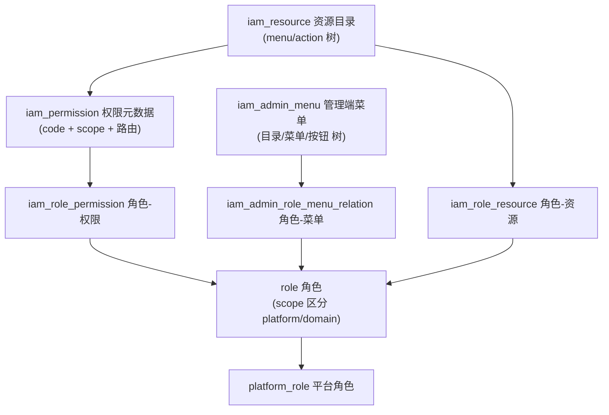
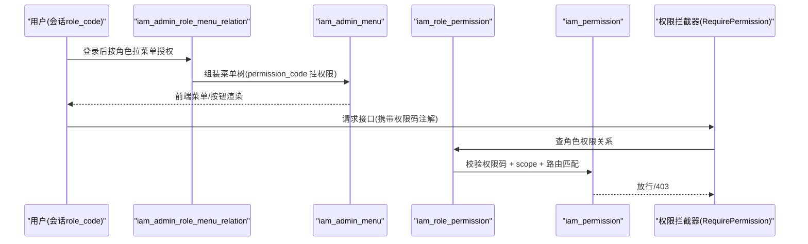
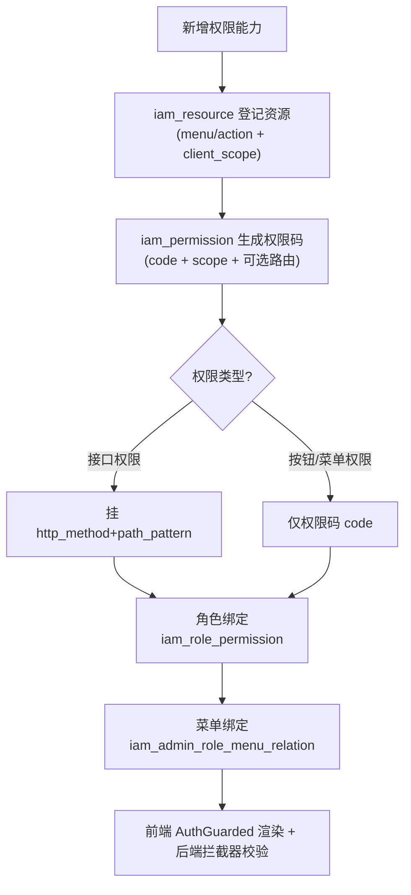
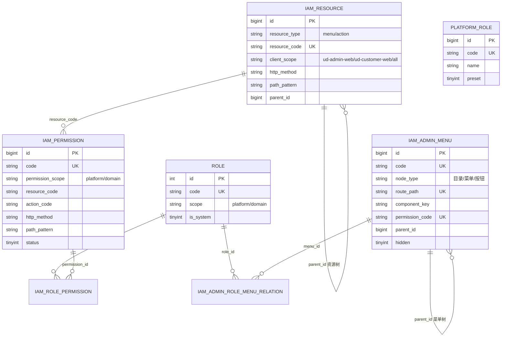
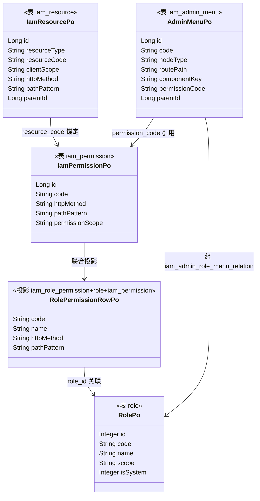

<cite>
- [UnionDesk/uniondesk-app/src/main/resources/db/migration/current/V202605200002__rebaseline_current_schema.sql](file://UnionDesk/uniondesk-app/src/main/resources/db/migration/current/V202605200002__rebaseline_current_schema.sql#L155-L186)
- [UnionDesk/uniondesk-app/src/main/resources/db/migration/current/V202605200002__rebaseline_current_schema.sql](file://UnionDesk/uniondesk-app/src/main/resources/db/migration/current/V202605200002__rebaseline_current_schema.sql#L187-L216)
- [UnionDesk/uniondesk-app/src/main/resources/db/migration/current/V202605200002__rebaseline_current_schema.sql](file://UnionDesk/uniondesk-app/src/main/resources/db/migration/current/V202605200002__rebaseline_current_schema.sql#L208-L232)
- [UnionDesk/uniondesk-app/src/main/resources/db/migration/current/V202605200002__rebaseline_current_schema.sql](file://UnionDesk/uniondesk-app/src/main/resources/db/migration/current/V202605200002__rebaseline_current_schema.sql#L508-L520)
- [UnionDesk/uniondesk-app/src/main/resources/db/migration/current/V202605200002__rebaseline_current_schema.sql](file://UnionDesk/uniondesk-app/src/main/resources/db/migration/current/V202605200002__rebaseline_current_schema.sql#L536-L546)
- [UnionDesk/uniondesk-app/src/main/resources/db/migration/current/V202605200002__rebaseline_current_schema.sql](file://UnionDesk/uniondesk-app/src/main/resources/db/migration/current/V202605200002__rebaseline_current_schema.sql#L548-L570)
- [UnionDesk/uniondesk-iam/src/main/java/com/uniondesk/iam/entity/IamResourcePo.java](file://UnionDesk/uniondesk-iam/src/main/java/com/uniondesk/iam/entity/IamResourcePo.java#L3-L45)
- [UnionDesk/uniondesk-iam/src/main/java/com/uniondesk/iam/entity/IamPermissionPo.java](file://UnionDesk/uniondesk-iam/src/main/java/com/uniondesk/iam/entity/IamPermissionPo.java#L3-L27)
- [UnionDesk/uniondesk-iam/src/main/java/com/uniondesk/iam/entity/AdminMenuPo.java](file://UnionDesk/uniondesk-iam/src/main/java/com/uniondesk/iam/entity/AdminMenuPo.java#L3-L48)
- [UnionDesk/uniondesk-iam/src/main/java/com/uniondesk/iam/entity/RolePo.java](file://UnionDesk/uniondesk-iam/src/main/java/com/uniondesk/iam/entity/RolePo.java#L3-L21)
- [UnionDesk/uniondesk-iam/src/main/java/com/uniondesk/iam/entity/RolePermissionRowPo.java](file://UnionDesk/uniondesk-iam/src/main/java/com/uniondesk/iam/entity/RolePermissionRowPo.java#L3-L21)
</cite>

# UnionDesk 权限与菜单表

## 简介

本文档详解 iam 表族的权限与菜单核心表：`iam_resource`（资源目录）、`iam_permission`（权限元数据）、`iam_admin_menu`（管理端菜单树）、`role`（角色）、`platform_role`（平台角色）、关联表 `iam_role_permission`/`iam_admin_role_menu_relation`/`iam_role_resource`。核心是「资源-权限-角色-菜单」四层权限码模型，支持平台/域双作用域与路由级校验。

章节来源：
- [UnionDesk/uniondesk-app/src/main/resources/db/migration/current/V202605200002__rebaseline_current_schema.sql](file://UnionDesk/uniondesk-app/src/main/resources/db/migration/current/V202605200002__rebaseline_current_schema.sql#L187-L216)
- [UnionDesk/uniondesk-app/src/main/resources/db/migration/current/V202605200002__rebaseline_current_schema.sql](file://UnionDesk/uniondesk-app/src/main/resources/db/migration/current/V202605200002__rebaseline_current_schema.sql#L536-L546)

## 项目结构

权限模型的表结构与层次：



图表来源：
- [UnionDesk/uniondesk-app/src/main/resources/db/migration/current/V202605200002__rebaseline_current_schema.sql](file://UnionDesk/uniondesk-app/src/main/resources/db/migration/current/V202605200002__rebaseline_current_schema.sql#L548-L570)（关联表）
- [UnionDesk/uniondesk-app/src/main/resources/db/migration/current/V202605200002__rebaseline_current_schema.sql](file://UnionDesk/uniondesk-app/src/main/resources/db/migration/current/V202605200002__rebaseline_current_schema.sql#L208-L232)（资源表）

## 核心组件

**iam_resource（L208-232）**：资源目录树。`resource_type` CHECK 限 `menu/action`；`client_scope` CHECK 限 `ud-admin-web/ud-customer-web/all`（客户端作用域）；`resource_code` 唯一；`http_method+path_pattern` 仅 action 类型必填（CHECK 保证 menu 无路由、action 有路由）；`parent_id` 自关联树。

**iam_permission（L187-216）**：权限元数据表，权限码模型核心：
- `code` 唯一权限码（如 `ticket:create`）；`permission_scope` CHECK 限 `platform/domain` 双作用域。
- `resource_code + action_code` 组合定位资源动作。
- `http_method + path_pattern` 可空配对（CHECK 同空同非空），用于接口路由级权限。
- 索引 `idx_iam_permission_route` 支撑路径匹配校验。

**iam_admin_menu（L155-186）**：管理端菜单树。`code/route_path/permission_code` 三唯一键；`node_type` 区分目录/菜单/按钮（按钮类型 CHECK：无路由/组件、必须 permission_code）；`parent_id` 自关联；`scope`（business/platform）；`hidden/required/order_no/icon` 控制展示。

**role（L536-546）**：角色基础表。`code` 唯一；`scope`（platform/domain）；`is_system` 系统预置标记。权限与菜单通过关联表挂接。

**platform_role（L508-520）**：平台角色。`code` 唯一、`preset` 预置标记，用于平台级用户授权。

**关联表**：
- `iam_role_permission`（L560-570）：角色-权限，`(role_id,permission_id)` 复合唯一，两侧外键。
- `iam_admin_role_menu_relation`（L548-558）：角色-菜单授权，`(role_id,menu_id)` 复合唯一。
- `iam_role_resource`（L572）：角色-资源授权。

章节来源：
- [UnionDesk/uniondesk-app/src/main/resources/db/migration/current/V202605200002__rebaseline_current_schema.sql](file://UnionDesk/uniondesk-app/src/main/resources/db/migration/current/V202605200002__rebaseline_current_schema.sql#L155-L216)
- [UnionDesk/uniondesk-app/src/main/resources/db/migration/current/V202605200002__rebaseline_current_schema.sql](file://UnionDesk/uniondesk-app/src/main/resources/db/migration/current/V202605200002__rebaseline_current_schema.sql#L508-L570)

## 架构总览

用户请求的权限校验链路：



图表来源：
- [UnionDesk/uniondesk-app/src/main/resources/db/migration/current/V202605200002__rebaseline_current_schema.sql](file://UnionDesk/uniondesk-app/src/main/resources/db/migration/current/V202605200002__rebaseline_current_schema.sql#L155-L186)（菜单表）
- [UnionDesk/uniondesk-app/src/main/resources/db/migration/current/V202605200002__rebaseline_current_schema.sql](file://UnionDesk/uniondesk-app/src/main/resources/db/migration/current/V202605200002__rebaseline_current_schema.sql#L560-L570)（角色权限关系）

## 详细分析

**权限码模型四层结构**：

1. **资源层（iam_resource）**：声明「有什么」（menu 菜单资源 / action 动作资源），树形目录 + 客户端作用域（admin-web/customer-web/all），action 必须绑定 HTTP 路由。
2. **权限层（iam_permission）**：声明「能做什么」——权限码 `code` 唯一、`permission_scope` 限定作用域（platform/domain）、`resource_code+action_code` 锚定资源动作、可选路由映射做接口级校验。
3. **角色层（role / platform_role）**：角色是权限的集合，`scope` 决定角色归属平台还是域；系统预置角色 `is_system/preset` 不可删改。
4. **绑定层（关联表）**：`iam_role_permission`（权限挂角色）、`iam_admin_role_menu_relation`（菜单挂角色）、`iam_role_resource`（资源挂角色）三张关联表各自复合唯一键防重复授权。

**关键约束**：
- `iam_permission` 的 `http_method/path_pattern` CHECK「同空同非空」：要么纯权限码（按钮/菜单级），要么带路由（接口级）。
- `iam_admin_menu` 按钮节点 CHECK「无路由无组件、必须有 permission_code」：按钮只能挂权限码，不允许配页面。
- `iam_resource` CHECK「menu 无路由、action 有路由」：资源类型与路由字段强绑定。
- 双作用域隔离：`permission_scope=domain` 的权限必须配合 `business_domain_id` 域上下文使用，平台权限作用于全局。



图表来源：
- [UnionDesk/uniondesk-app/src/main/resources/db/migration/current/V202605200002__rebaseline_current_schema.sql](file://UnionDesk/uniondesk-app/src/main/resources/db/migration/current/V202605200002__rebaseline_current_schema.sql#L187-L216)（permission 约束）
- [UnionDesk/uniondesk-app/src/main/resources/db/migration/current/V202605200002__rebaseline_current_schema.sql](file://UnionDesk/uniondesk-app/src/main/resources/db/migration/current/V202605200002__rebaseline_current_schema.sql#L155-L186)（菜单按钮约束）

## 数据模型

权限表族 ER 图：



图表来源：
- [UnionDesk/uniondesk-app/src/main/resources/db/migration/current/V202605200002__rebaseline_current_schema.sql](file://UnionDesk/uniondesk-app/src/main/resources/db/migration/current/V202605200002__rebaseline_current_schema.sql#L155-L232)
- [UnionDesk/uniondesk-app/src/main/resources/db/migration/current/V202605200002__rebaseline_current_schema.sql](file://UnionDesk/uniondesk-app/src/main/resources/db/migration/current/V202605200002__rebaseline_current_schema.sql#L508-L570)

## 依赖关系分析

实体类 ↔ 表映射关系：



图表来源：
- [UnionDesk/uniondesk-iam/src/main/java/com/uniondesk/iam/entity/IamResourcePo.java](file://UnionDesk/uniondesk-iam/src/main/java/com/uniondesk/iam/entity/IamResourcePo.java#L3-L45)
- [UnionDesk/uniondesk-iam/src/main/java/com/uniondesk/iam/entity/IamPermissionPo.java](file://UnionDesk/uniondesk-iam/src/main/java/com/uniondesk/iam/entity/IamPermissionPo.java#L3-L27)
- [UnionDesk/uniondesk-iam/src/main/java/com/uniondesk/iam/entity/AdminMenuPo.java](file://UnionDesk/uniondesk-iam/src/main/java/com/uniondesk/iam/entity/AdminMenuPo.java#L3-L48)
- [UnionDesk/uniondesk-iam/src/main/java/com/uniondesk/iam/entity/RolePo.java](file://UnionDesk/uniondesk-iam/src/main/java/com/uniondesk/iam/entity/RolePo.java#L3-L21)
- [UnionDesk/uniondesk-iam/src/main/java/com/uniondesk/iam/entity/RolePermissionRowPo.java](file://UnionDesk/uniondesk-iam/src/main/java/com/uniondesk/iam/entity/RolePermissionRowPo.java#L3-L21)

## 性能与安全考虑

- **索引**：`iam_permission` 的 `uk_iam_permission_code` 权限码精确查找、`idx_iam_permission_route`（http_method+path_pattern）路由匹配、`idx_iam_permission_scope_status` 作用域过滤；菜单表 `idx_iam_admin_menu_parent_order` 树遍历；关联表复合唯一键防重复授权并支撑按角色反查。
- **校验性能**：路由级权限匹配用路径模式索引前缀查找，避免全表扫描；权限快照可按角色预聚合缓存。
- **安全**：权限码唯一防伪造；`permission_scope` CHECK 防越权注册 domain 权限到 platform；菜单按钮强制挂权限码防前端裸奔按钮；`is_system/preset` 预置角色保护。
- **变更纪律**：权限/菜单变更走迁移脚本（`V20260xxxx__*_permissions.sql` 系列），禁止手工改表，保证多环境一致。

章节来源：
- [UnionDesk/uniondesk-app/src/main/resources/db/migration/current/V202605200002__rebaseline_current_schema.sql](file://UnionDesk/uniondesk-app/src/main/resources/db/migration/current/V202605200002__rebaseline_current_schema.sql#L155-L216)
- [UnionDesk/uniondesk-app/src/main/resources/db/migration/current/V202605200002__rebaseline_current_schema.sql](file://UnionDesk/uniondesk-app/src/main/resources/db/migration/current/V202605200002__rebaseline_current_schema.sql#L548-L570)

## 故障排查指南

| 现象 | 原因 | 处理建议 |
| --- | --- | --- |
| 接口 403 但权限码已配 | 角色未绑定 `iam_role_permission`，或权限 `permission_scope` 与请求作用域不符 | 核对 `iam_role_permission` 绑定；确认 scope 为 domain 的权限在域上下文请求 |
| 菜单不显示 | `iam_admin_menu.permission_code` 未绑定角色，或菜单 `status/hidden` 状态 | 检查 `iam_admin_role_menu_relation`；核对菜单节点状态与角色授权 |
| 按钮不显示 | 按钮节点缺 `permission_code` 或该码未授权 | 检查按钮节点 CHECK 约束数据；核对前端 AuthGuarded 使用的权限码 |
| 路由级权限不生效 | `iam_permission.http_method/path_pattern` 未配置或路径不匹配 | 对照 `idx_iam_permission_route` 检查；确认路径模式与请求路径一致 |
| 角色删除失败 | 角色仍被 `iam_role_permission` 等关联表引用 | 先解绑关联（role_id 外键约束），再删角色 |

章节来源：
- [UnionDesk/uniondesk-app/src/main/resources/db/migration/current/V202605200002__rebaseline_current_schema.sql](file://UnionDesk/uniondesk-app/src/main/resources/db/migration/current/V202605200002__rebaseline_current_schema.sql#L187-L216)
- [UnionDesk/uniondesk-app/src/main/resources/db/migration/current/V202605200002__rebaseline_current_schema.sql](file://UnionDesk/uniondesk-app/src/main/resources/db/migration/current/V202605200002__rebaseline_current_schema.sql#L155-L186)

## 结论

UnionDesk 权限模型是「**资源登记 → 权限码化 → 角色聚合 → 菜单/按钮挂接**」的四层结构：`iam_resource` 管资产声明、`iam_permission` 管权限码与作用域（支持路由级）、`role`/`platform_role` 管角色、三张关联表管绑定。菜单与权限通过 `permission_code` 唯一键打通前后端，CHECK 约束保证模型自洽。该模型支撑平台/域双作用域、按钮级粒度与接口级校验，是系统权限治理的骨架。

章节来源：
- [UnionDesk/uniondesk-app/src/main/resources/db/migration/current/V202605200002__rebaseline_current_schema.sql](file://UnionDesk/uniondesk-app/src/main/resources/db/migration/current/V202605200002__rebaseline_current_schema.sql#L155-L216)
- [UnionDesk/uniondesk-app/src/main/resources/db/migration/current/V202605200002__rebaseline_current_schema.sql](file://UnionDesk/uniondesk-app/src/main/resources/db/migration/current/V202605200002__rebaseline_current_schema.sql#L536-L570)

## 附录

权限模型查询示例：

```sql
-- 1. 查询角色全部权限码（含作用域）
SELECT r.code AS role_code, p.code AS permission_code, p.permission_scope
FROM role r
JOIN iam_role_permission rp ON rp.role_id = r.id
JOIN iam_permission p ON p.id = rp.permission_id
WHERE r.code = 'domain_admin';

-- 2. 查询角色可见菜单树
SELECT m.id, m.name, m.route_path, m.permission_code, m.parent_id
FROM iam_admin_menu m
JOIN iam_admin_role_menu_relation rm ON rm.menu_id = m.id
WHERE rm.role_id = 2 AND m.status = 1
ORDER BY m.parent_id, m.order_no;

-- 3. 查询路由级权限定义
SELECT code, permission_scope, http_method, path_pattern
FROM iam_permission
WHERE http_method IS NOT NULL AND path_pattern IS NOT NULL
ORDER BY permission_scope, code;
```

实体映射示例：

```java
// 权限码校验（拦截器内）
IamPermissionPo permission = new IamPermissionPo();
permission.setCode("ticket:list");
permission.setPermissionScope("domain");
permission.setHttpMethod("GET");
permission.setPathPattern("/api/domain/tickets");
```

章节来源：
- [UnionDesk/uniondesk-iam/src/main/java/com/uniondesk/iam/entity/IamPermissionPo.java](file://UnionDesk/uniondesk-iam/src/main/java/com/uniondesk/iam/entity/IamPermissionPo.java#L3-L27)
- [UnionDesk/uniondesk-iam/src/main/java/com/uniondesk/iam/entity/RolePermissionRowPo.java](file://UnionDesk/uniondesk-iam/src/main/java/com/uniondesk/iam/entity/RolePermissionRowPo.java#L3-L21)
