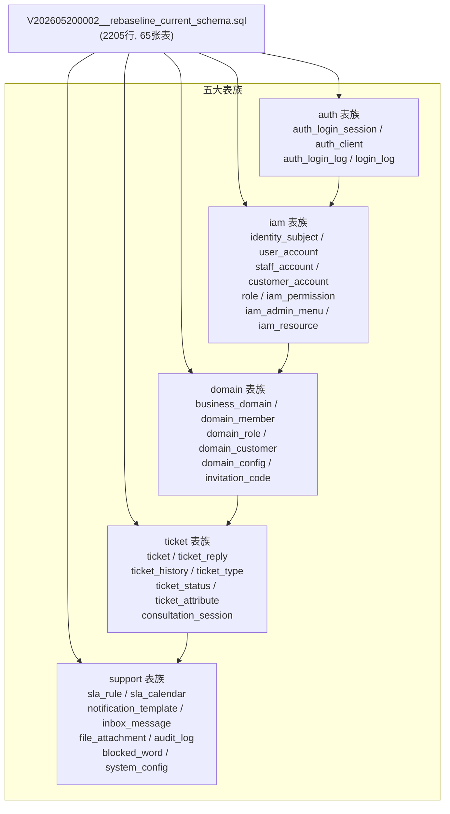
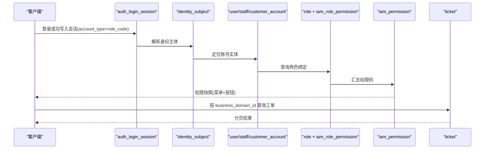
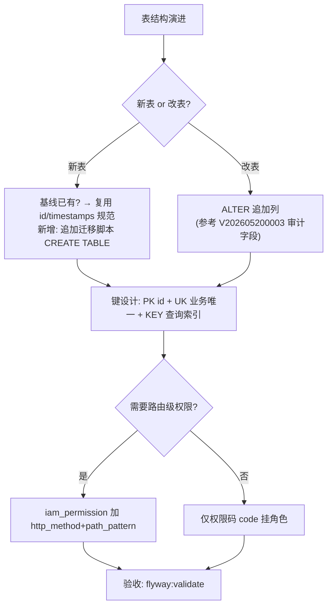
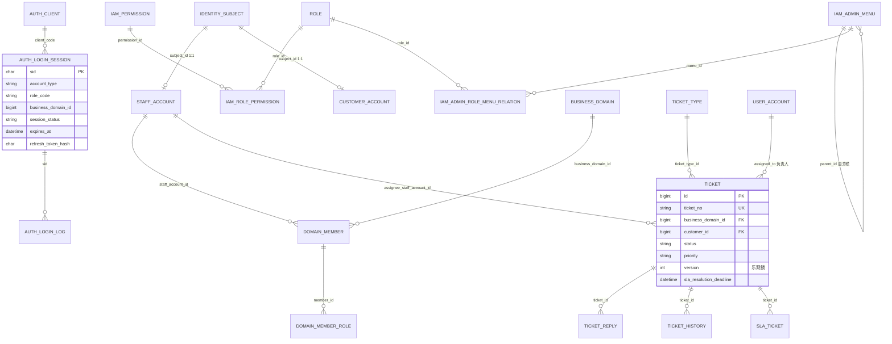
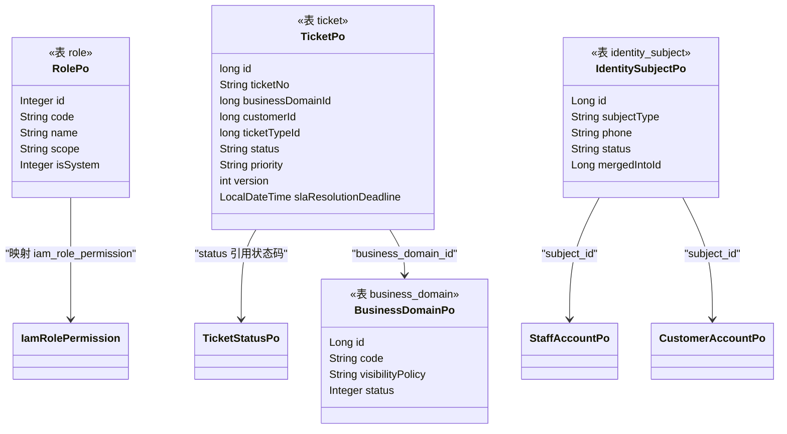

<cite>
- [UnionDesk/uniondesk-app/src/main/resources/db/migration/current/V202605200002__rebaseline_current_schema.sql](file://UnionDesk/uniondesk-app/src/main/resources/db/migration/current/V202605200002__rebaseline_current_schema.sql#L67-L98)
- [UnionDesk/uniondesk-app/src/main/resources/db/migration/current/V202605200002__rebaseline_current_schema.sql](file://UnionDesk/uniondesk-app/src/main/resources/db/migration/current/V202605200002__rebaseline_current_schema.sql#L155-L186)
- [UnionDesk/uniondesk-app/src/main/resources/db/migration/current/V202605200002__rebaseline_current_schema.sql](file://UnionDesk/uniondesk-app/src/main/resources/db/migration/current/V202605200002__rebaseline_current_schema.sql#L187-L216)
- [UnionDesk/uniondesk-app/src/main/resources/db/migration/current/V202605200002__rebaseline_current_schema.sql](file://UnionDesk/uniondesk-app/src/main/resources/db/migration/current/V202605200002__rebaseline_current_schema.sql#L269-L296)
- [UnionDesk/uniondesk-app/src/main/resources/db/migration/current/V202605200002__rebaseline_current_schema.sql](file://UnionDesk/uniondesk-app/src/main/resources/db/migration/current/V202605200002__rebaseline_current_schema.sql#L536-L550)
- [UnionDesk/uniondesk-app/src/main/resources/db/migration/current/V202605200002__rebaseline_current_schema.sql](file://UnionDesk/uniondesk-app/src/main/resources/db/migration/current/V202605200002__rebaseline_current_schema.sql#L596-L616)
- [UnionDesk/uniondesk-app/src/main/resources/db/migration/current/V202605200002__rebaseline_current_schema.sql](file://UnionDesk/uniondesk-app/src/main/resources/db/migration/current/V202605200002__rebaseline_current_schema.sql#L770-L800)
- [UnionDesk/uniondesk-app/src/main/resources/db/migration/current/V202605200002__rebaseline_current_schema.sql](file://UnionDesk/uniondesk-app/src/main/resources/db/migration/current/V202605200002__rebaseline_current_schema.sql#L963-L1003)
- [UnionDesk/uniondesk-iam/src/main/java/com/uniondesk/iam/entity/RolePo.java](file://UnionDesk/uniondesk-iam/src/main/java/com/uniondesk/iam/entity/RolePo.java#L3-L21)
- [UnionDesk/uniondesk-ticket/src/main/java/com/uniondesk/ticket/entity/TicketPo.java](file://UnionDesk/uniondesk-ticket/src/main/java/com/uniondesk/ticket/entity/TicketPo.java#L5-L31)
</cite>

# UnionDesk 表结构详解总览

## 简介

本文档是 UnionDesk 数据库全部核心表的字段结构索引：按 auth（认证会话）、iam（账号权限）、domain（业务域）、ticket（工单）、support（支撑）五大表族给出关键表的字段、类型、键与约束，作为各表族专篇（认证与账号表 / 权限与菜单表 / 业务域表 / 工单核心表 / 支撑服务表）的导航入口。DDL 权威来源为 `db/migration/current/V202605200002__rebaseline_current_schema.sql`（2205 行基线）。

章节来源：
- [UnionDesk/uniondesk-app/src/main/resources/db/migration/current/V202605200002__rebaseline_current_schema.sql](file://UnionDesk/uniondesk-app/src/main/resources/db/migration/current/V202605200002__rebaseline_current_schema.sql#L1-L4)
- [UnionDesk/uniondesk-app/src/main/resources/db/migration/current/V202605200002__rebaseline_current_schema.sql](file://UnionDesk/uniondesk-app/src/main/resources/db/migration/current/V202605200002__rebaseline_current_schema.sql#L963-L1003)

## 项目结构

五大表族与基线脚本的物理位置关系：



图表来源：
- [UnionDesk/uniondesk-app/src/main/resources/db/migration/current/V202605200002__rebaseline_current_schema.sql](file://UnionDesk/uniondesk-app/src/main/resources/db/migration/current/V202605200002__rebaseline_current_schema.sql#L67-L1003)（各表族 DDL 分布）

## 核心组件

**auth 表族**：
- `auth_login_session`（L67-98）：登录会话，`sid char(36)` 主键；含 `user_id/client_code/account_type/role_code/business_domain_id/session_status/refresh_token_hash/expires_at`；复合索引覆盖 user_status/status_expires/last_seen；`account_type` 限 staff/customer（CHECK）。
- `auth_client`：客户端定义，`client_code` 主键，限定 `allowed_account_type`（admin/customer）。
- `auth_login_config`：登录配置键值对。
- `auth_login_log`/`login_log`：登录日志（`sid/user_id` 关联）。

**iam 表族**：
- `user_account`（L770-800）：平台用户，唯一键 `uk_user_mobile/uk_user_username/uk_user_email`，`auth_version` 权限版本号，`account_type` 限 admin/customer。
- `staff_account`（L596-616）：域员工，`subject_id` 唯一键关联身份主体，`must_change_password`、`auth_version`。
- `customer_account`（L269-296）：客户账号，`subject_id` 唯一键关联身份主体。
- `role`（L536-550）：角色基础表（`code/name/scope/is_system`，`uk_role_code`）。
- `iam_permission`（L187-216）：权限元数据（`code` 唯一、`permission_scope` 限 platform/domain、`resource_code+action_code`、可选 `http_method+path_pattern` 路由映射）。
- `iam_resource`：资源目录（树形 `parent_id`）。
- `iam_admin_menu`（L155-186）：管理端菜单（`code/route_path/permission_code` 均唯一、`node_type` 区分目录/菜单/按钮、自关联 `parent_id`）。
- 关联表：`iam_role_permission`、`iam_admin_role_menu_relation`、`iam_role_resource`（均含复合唯一键）。

**domain 表族**：`business_domain`（租户根）、`domain_member`（员工-域成员，`staff_account_id+business_domain_id`）、`domain_member_role`、`domain_role`、`domain_role_permission`、`domain_customer`、`domain_config`、`invitation_code`、`domain_template`。

**ticket 表族**：
- `ticket`（L963-1003）：工单主表（见下方详细分析）。
- `ticket_reply`/`ticket_history`/`ticket_relation`/`ticket_event_log`：工单流转附属。
- `ticket_type`/`ticket_template`/`ticket_priority_level`/`ticket_status`/`ticket_attribute`：配置表族。
- `consultation_session`/`consultation_message`/`consultation_ticket_link`：在线咨询。

**support 表族**：`sla_rule`/`sla_calendar`、`notification_template`/`notification_log`/`inbox_message`、`file_attachment`/`attachment_ref`/`attachment_policy`、`audit_log`/`operation_log`、`blocked_word`、`system_config`、`dynamic_field_config`、`staff_presence`、`customer_cancel_request`。

章节来源：
- [UnionDesk/uniondesk-app/src/main/resources/db/migration/current/V202605200002__rebaseline_current_schema.sql](file://UnionDesk/uniondesk-app/src/main/resources/db/migration/current/V202605200002__rebaseline_current_schema.sql#L67-L98)（auth_login_session）
- [UnionDesk/uniondesk-app/src/main/resources/db/migration/current/V202605200002__rebaseline_current_schema.sql](file://UnionDesk/uniondesk-app/src/main/resources/db/migration/current/V202605200002__rebaseline_current_schema.sql#L770-L800)（user_account）
- [UnionDesk/uniondesk-app/src/main/resources/db/migration/current/V202605200002__rebaseline_current_schema.sql](file://UnionDesk/uniondesk-app/src/main/resources/db/migration/current/V202605200002__rebaseline_current_schema.sql#L536-L550)（role）
- [UnionDesk/uniondesk-app/src/main/resources/db/migration/current/V202605200002__rebaseline_current_schema.sql](file://UnionDesk/uniondesk-app/src/main/resources/db/migration/current/V202605200002__rebaseline_current_schema.sql#L187-L216)（iam_permission）

## 架构总览

一次登录到工单查询涉及的表族协作：



图表来源：
- [UnionDesk/uniondesk-app/src/main/resources/db/migration/current/V202605200002__rebaseline_current_schema.sql](file://UnionDesk/uniondesk-app/src/main/resources/db/migration/current/V202605200002__rebaseline_current_schema.sql#L67-L98)（会话表）
- [UnionDesk/uniondesk-app/src/main/resources/db/migration/current/V202605200002__rebaseline_current_schema.sql](file://UnionDesk/uniondesk-app/src/main/resources/db/migration/current/V202605200002__rebaseline_current_schema.sql#L187-L216)（权限表）
- [UnionDesk/uniondesk-app/src/main/resources/db/migration/current/V202605200002__rebaseline_current_schema.sql](file://UnionDesk/uniondesk-app/src/main/resources/db/migration/current/V202605200002__rebaseline_current_schema.sql#L963-L1003)（工单表）

## 详细分析

**ticket 表字段深度解析**（L963-1003）：

| 字段组 | 字段 | 说明 |
| --- | --- | --- |
| 标识 | `id`、`ticket_no`（uk） | 自增主键 + 业务单号 |
| 归属 | `business_domain_id`（fk）、`customer_id`（fk）、`ticket_type_id`（fk） | 域/客户/类型三重归属 |
| 内容 | `title`、`description`(text)、`custom_fields`(json) | 标题/描述/自定义字段 |
| 流转 | `status`、`priority`、`source`、`assigned_to`、`assignee_staff_account_id` | 状态/优先级/来源/负责人 |
| 并发 | `version`（乐观锁，默认 1） | 防并发覆盖 |
| SLA | `sla_first_response_deadline`、`sla_resolution_deadline`、`sla_first_responded_at`、`sla_resolved_at`、`sla_status`、`sla_paused_duration`、`sla_pause_started_at` | SLA 时限与暂停 |
| 时间 | `created_at`、`updated_at` | 审计时间 |
| 索引 | `idx_ticket_domain_status_priority`(复合)、`idx_ticket_customer_created`、`idx_ticket_assigned_status`、`idx_ticket_assignee_staff` | 域+状态+优先级、客户+时间、负责人+状态 |

**user_account 表要点**（L770-800）：三个唯一键（mobile/username/email）+ `account_type` CHECK（admin/customer）+ `auth_version` 版本化权限 + `employment_status/offboarded_at` 离职管理字段。

**iam_permission 表要点**（L187-216）：`code` 唯一权限码；`permission_scope` CHECK 限 platform/domain（双作用域）；`http_method+path_pattern` 可空配对（CHECK 保证同空同非空）用于路由级权限；`idx_iam_permission_route` 支撑路径匹配。

**role 表**（L536-550）：极简角色定义（`code/name/scope/is_system`），权限通过关联表 `iam_role_permission`（role_id+permission_id 复合唯一）挂接——角色-权限多对多无外键语义。



图表来源：
- [UnionDesk/uniondesk-app/src/main/resources/db/migration/current/V202605200002__rebaseline_current_schema.sql](file://UnionDesk/uniondesk-app/src/main/resources/db/migration/current/V202605200002__rebaseline_current_schema.sql#L963-L1003)
- [UnionDesk/uniondesk-app/src/main/resources/db/migration/current/V202605200002__rebaseline_current_schema.sql](file://UnionDesk/uniondesk-app/src/main/resources/db/migration/current/V202605200002__rebaseline_current_schema.sql#L187-L216)

## 数据模型

核心表族的 ER 总览（关键表 + 关系）：



图表来源：
- [UnionDesk/uniondesk-app/src/main/resources/db/migration/current/V202605200002__rebaseline_current_schema.sql](file://UnionDesk/uniondesk-app/src/main/resources/db/migration/current/V202605200002__rebaseline_current_schema.sql#L67-L98)
- [UnionDesk/uniondesk-app/src/main/resources/db/migration/current/V202605200002__rebaseline_current_schema.sql](file://UnionDesk/uniondesk-app/src/main/resources/db/migration/current/V202605200002__rebaseline_current_schema.sql#L963-L1003)

## 依赖关系分析

实体类与表结构的映射关系：



图表来源：
- [UnionDesk/uniondesk-iam/src/main/java/com/uniondesk/iam/entity/RolePo.java](file://UnionDesk/uniondesk-iam/src/main/java/com/uniondesk/iam/entity/RolePo.java#L3-L21)
- [UnionDesk/uniondesk-ticket/src/main/java/com/uniondesk/ticket/entity/TicketPo.java](file://UnionDesk/uniondesk-ticket/src/main/java/com/uniondesk/ticket/entity/TicketPo.java#L5-L31)

## 性能与安全考虑

- **索引策略**：工单表三个复合索引分别覆盖「域+状态+优先级」「客户+创建时间」「负责人+状态」典型查询路径；会话表 `idx_*_status_expires` 支撑过期清理任务；权限表 `idx_iam_permission_route` 支撑路由匹配；唯一键保证幂等（ticket_no/mobile/username/code）。
- **并发控制**：`ticket.version` 乐观锁；会话 `refresh_token_hash` 哈希存储防泄露；`auth_version` 权限版本用于强制重登。
- **安全约束**：CHECK 约束收敛枚举（account_type、permission_scope、session_type）；密码只存 `password_hash`；会话含 `client_ip/user_agent` 供风控。
- **数据保留**：会话表大量索引需定期清理过期记录（`expires_at` 索引支撑）；日志类表按时间归档。

章节来源：
- [UnionDesk/uniondesk-app/src/main/resources/db/migration/current/V202605200002__rebaseline_current_schema.sql](file://UnionDesk/uniondesk-app/src/main/resources/db/migration/current/V202605200002__rebaseline_current_schema.sql#L963-L1003)（ticket 索引）
- [UnionDesk/uniondesk-app/src/main/resources/db/migration/current/V202605200002__rebaseline_current_schema.sql](file://UnionDesk/uniondesk-app/src/main/resources/db/migration/current/V202605200002__rebaseline_current_schema.sql#L67-L98)（会话索引）

## 故障排查指南

| 现象 | 原因 | 处理建议 |
| --- | --- | --- |
| 登录后会话查询慢 | `auth_login_session` 过期数据堆积 + 索引缺失 | 检查 `idx_auth_login_session_status_expires`；按 `expires_at` 定期清理 |
| 用户无法登录（唯一键冲突） | `user_account.mobile/username/email` 与既有数据重复 | 查询唯一键冲突明细；走账号合并（`identity_subject.merged_into_id`） |
| 菜单不显示但权限码正确 | `iam_admin_menu.permission_code` 与 `iam_permission.code` 不一致 | 对照菜单表与权限表 code 值；检查 `uk_iam_admin_menu_permission_code` |
| 工单列表超时 | 复合索引未命中（如仅按 priority 过滤） | 确认查询条件走 `idx_ticket_domain_status_priority` 前缀列 |
| 迁移 Validate 失败 | 基线脚本被改动 | 恢复 `V202605200002` 原内容；新增增量脚本 |

章节来源：
- [UnionDesk/uniondesk-app/src/main/resources/db/migration/current/V202605200002__rebaseline_current_schema.sql](file://UnionDesk/uniondesk-app/src/main/resources/db/migration/current/V202605200002__rebaseline_current_schema.sql#L155-L186)（菜单表唯一键）
- [UnionDesk/uniondesk-app/src/main/resources/db/migration/current/V202605200002__rebaseline_current_schema.sql](file://UnionDesk/uniondesk-app/src/main/resources/db/migration/current/V202605200002__rebaseline_current_schema.sql#L770-L800)（user_account 唯一键）

## 结论

UnionDesk 表结构遵循「**基线统一 + 表族清晰 + 复合索引先行 + CHECK 收敛枚举 + 无外键业务约束**」：65 张表归入五大表族，`ticket` 是字段最丰富的主业务表（含 SLA 内嵌与乐观锁），权限体系由 `role` + `iam_permission` + 关联表三层挂接，会话表族承担认证状态。本总览可作为各表族专篇的导航与字段速查索引。

章节来源：
- [UnionDesk/uniondesk-app/src/main/resources/db/migration/current/V202605200002__rebaseline_current_schema.sql](file://UnionDesk/uniondesk-app/src/main/resources/db/migration/current/V202605200002__rebaseline_current_schema.sql#L963-L1003)
- [UnionDesk/uniondesk-app/src/main/resources/db/migration/current/V202605200002__rebaseline_current_schema.sql](file://UnionDesk/uniondesk-app/src/main/resources/db/migration/current/V202605200002__rebaseline_current_schema.sql#L187-L216)

## 附录

查看全部表结构的命令与示例：

```bash
# 1. 列出全部表
mysql -u uniondesk_app -p -h 127.0.0.1 -P 30306 uniondesk -e "SHOW TABLES;"

# 2. 查看某表完整 DDL
mysql -u uniondesk_app -p -h 127.0.0.1 -P 30306 uniondesk -e "SHOW CREATE TABLE ticket\G"

# 3. 查看索引
mysql -u uniondesk_app -p -h 127.0.0.1 -P 30306 uniondesk -e "SHOW INDEX FROM ticket;"

# 4. 从基线脚本检索表定义
grep -n "CREATE TABLE IF NOT EXISTS \`ticket\`" \
  UnionDesk/uniondesk-app/src/main/resources/db/migration/current/V202605200002__rebaseline_current_schema.sql
```

典型权限挂接查询（role ↔ permission）：

```sql
SELECT r.code AS role_code, p.code AS permission_code, p.permission_scope
FROM role r
JOIN iam_role_permission rp ON rp.role_id = r.id
JOIN iam_permission p ON p.id = rp.permission_id
WHERE r.scope = 'platform'
ORDER BY r.code, p.code;
```

章节来源：
- [UnionDesk/uniondesk-app/src/main/resources/db/migration/current/V202605200002__rebaseline_current_schema.sql](file://UnionDesk/uniondesk-app/src/main/resources/db/migration/current/V202605200002__rebaseline_current_schema.sql#L536-L550)（role 表）
- [UnionDesk/uniondesk-app/src/main/resources/db/migration/current/V202605200002__rebaseline_current_schema.sql](file://UnionDesk/uniondesk-app/src/main/resources/db/migration/current/V202605200002__rebaseline_current_schema.sql#L187-L216)（iam_permission 表）
