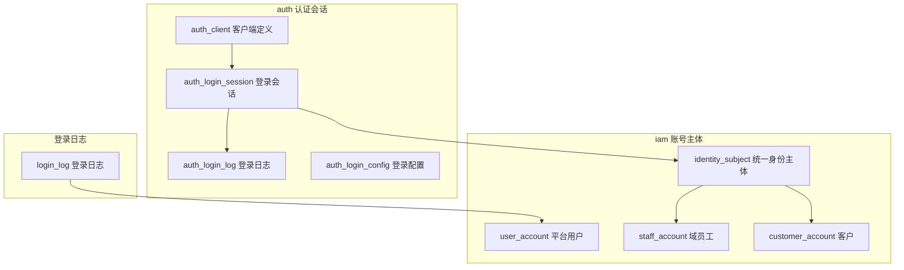
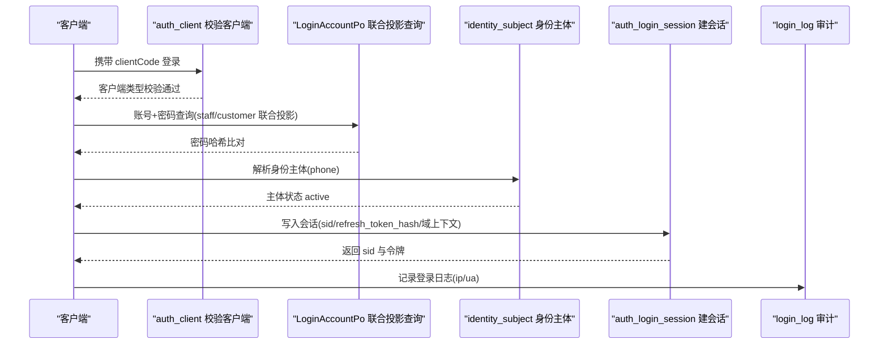
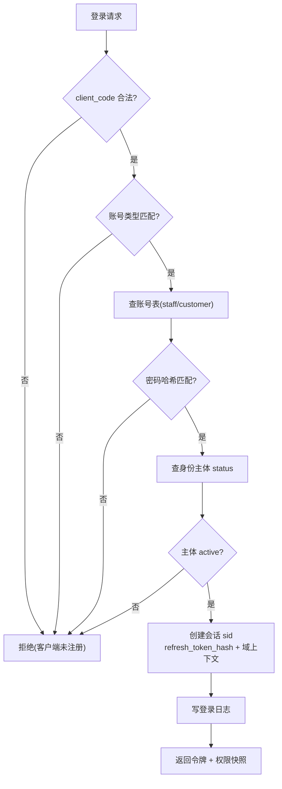
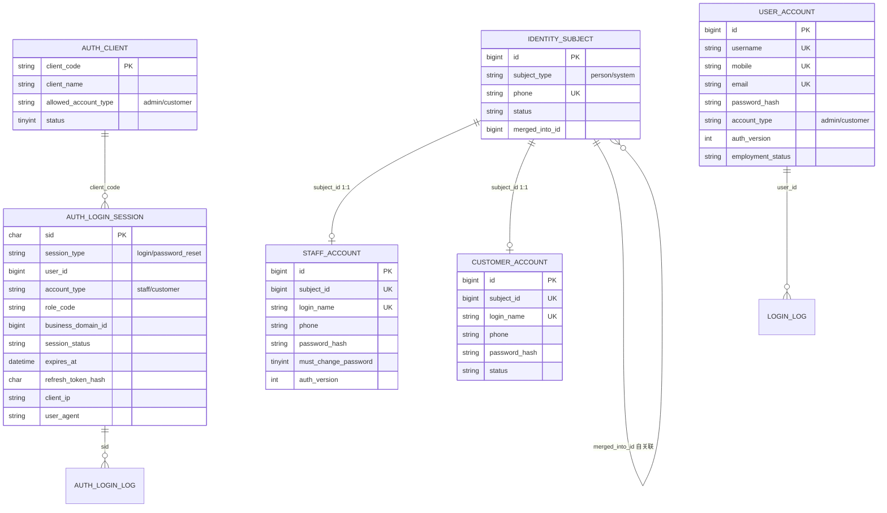

<cite>
- [UnionDesk/uniondesk-app/src/main/resources/db/migration/current/V202605200002__rebaseline_current_schema.sql](file://UnionDesk/uniondesk-app/src/main/resources/db/migration/current/V202605200002__rebaseline_current_schema.sql#L32-L42)
- [UnionDesk/uniondesk-app/src/main/resources/db/migration/current/V202605200002__rebaseline_current_schema.sql](file://UnionDesk/uniondesk-app/src/main/resources/db/migration/current/V202605200002__rebaseline_current_schema.sql#L67-L98)
- [UnionDesk/uniondesk-app/src/main/resources/db/migration/current/V202605200002__rebaseline_current_schema.sql](file://UnionDesk/uniondesk-app/src/main/resources/db/migration/current/V202605200002__rebaseline_current_schema.sql#L235-L250)
- [UnionDesk/uniondesk-app/src/main/resources/db/migration/current/V202605200002__rebaseline_current_schema.sql](file://UnionDesk/uniondesk-app/src/main/resources/db/migration/current/V202605200002__rebaseline_current_schema.sql#L269-L296)
- [UnionDesk/uniondesk-app/src/main/resources/db/migration/current/V202605200002__rebaseline_current_schema.sql](file://UnionDesk/uniondesk-app/src/main/resources/db/migration/current/V202605200002__rebaseline_current_schema.sql#L596-L616)
- [UnionDesk/uniondesk-app/src/main/resources/db/migration/current/V202605200002__rebaseline_current_schema.sql](file://UnionDesk/uniondesk-app/src/main/resources/db/migration/current/V202605200002__rebaseline_current_schema.sql#L770-L800)
- [UnionDesk/uniondesk-iam/src/main/java/com/uniondesk/auth/entity/LoginAccountPo.java](file://UnionDesk/uniondesk-iam/src/main/java/com/uniondesk/auth/entity/LoginAccountPo.java#L3-L36)
- [UnionDesk/uniondesk-iam/src/main/java/com/uniondesk/auth/entity/AuthLoginSessionPo.java](file://UnionDesk/uniondesk-iam/src/main/java/com/uniondesk/auth/entity/AuthLoginSessionPo.java#L5-L58)
- [UnionDesk/uniondesk-iam/src/main/java/com/uniondesk/iam/entity/IdentitySubjectPo.java](file://UnionDesk/uniondesk-iam/src/main/java/com/uniondesk/iam/entity/IdentitySubjectPo.java#L3-L21)
- [UnionDesk/uniondesk-iam/src/main/java/com/uniondesk/iam/entity/UserAccountPo.java](file://UnionDesk/uniondesk-iam/src/main/java/com/uniondesk/iam/entity/UserAccountPo.java#L5-L44)
- [UnionDesk/uniondesk-iam/src/main/java/com/uniondesk/iam/entity/StaffAccountPo.java](file://UnionDesk/uniondesk-iam/src/main/java/com/uniondesk/iam/entity/StaffAccountPo.java#L5-L56)
- [UnionDesk/uniondesk-iam/src/main/java/com/uniondesk/iam/entity/CustomerAccountPo.java](file://UnionDesk/uniondesk-iam/src/main/java/com/uniondesk/iam/entity/CustomerAccountPo.java#L3-L39)
</cite>

# UnionDesk 认证与账号表

## 简介

本文档详解 auth/iam 表族中与「认证、会话、账号」相关的全部核心表：`auth_client`（客户端）、`auth_login_session`（登录会话）、`identity_subject`（统一身份主体）、`user_account`（平台用户）、`staff_account`（域员工）、`customer_account`（客户）、`login_log`/`auth_login_log`（登录日志）。覆盖字段、类型、索引、约束与实体映射。

章节来源：
- [UnionDesk/uniondesk-app/src/main/resources/db/migration/current/V202605200002__rebaseline_current_schema.sql](file://UnionDesk/uniondesk-app/src/main/resources/db/migration/current/V202605200002__rebaseline_current_schema.sql#L32-L42)
- [UnionDesk/uniondesk-app/src/main/resources/db/migration/current/V202605200002__rebaseline_current_schema.sql](file://UnionDesk/uniondesk-app/src/main/resources/db/migration/current/V202605200002__rebaseline_current_schema.sql#L235-L250)

## 项目结构

认证与账号表族在库中的布局与关系：



图表来源：
- [UnionDesk/uniondesk-app/src/main/resources/db/migration/current/V202605200002__rebaseline_current_schema.sql](file://UnionDesk/uniondesk-app/src/main/resources/db/migration/current/V202605200002__rebaseline_current_schema.sql#L32-L98)
- [UnionDesk/uniondesk-app/src/main/resources/db/migration/current/V202605200002__rebaseline_current_schema.sql](file://UnionDesk/uniondesk-app/src/main/resources/db/migration/current/V202605200002__rebaseline_current_schema.sql#L235-L296)

## 核心组件

**auth_client（L32-42）**：客户端注册表。`client_code` 主键（如 uniondesk-admin）；`allowed_account_type` CHECK 限 `admin/customer`，决定该客户端可登录的账号类型；`status` 状态开关。

**auth_login_session（L67-98）**：登录会话表，核心认证状态载体：
- 主键 `sid char(36)`（UUID）；`session_type` 限 `login/password_reset`（CHECK）。
- 身份快照：`user_id`、`client_code`、`account_type`（限 staff/customer）、`role_code`、`business_domain_id`（域上下文）。
- 状态与安全：`session_status`（active）、`issued_at/expires_at/last_seen_at/revoked_at/revoked_reason`、`refresh_token_hash char(64)`（哈希存储）、`client_ip`、`user_agent`、`login_identifier_masked`（脱敏登录标识）。
- 索引：`idx_*_user_status`、`idx_*_status_expires`、`idx_*_last_seen`、`idx_*_client_status`、`idx_*_type_status_expires` 五个复合索引覆盖清理与查询。

**identity_subject（L235-250）**：统一身份主体，账号体系锚点。`subject_type` CHECK 限 `person/system`；`phone` 唯一键；`merged_into_id` 自关联支持账号合并。

**user_account（L770-800）**：平台用户。三唯一键（`uk_user_mobile/uk_user_username/uk_user_email`）；`account_type` CHECK 限 admin/customer；`auth_version` 权限版本号；`employment_status/offboarded_at/offboarded_by/offboard_reason` 离职管理。

**staff_account（L596-616）**：域员工。`uk_staff_account_login`（login_name）、`uk_staff_account_subject`（subject_id 1:1）；`must_change_password`、`source`（local/invite）、`auth_version`。

**customer_account（L269-296）**：客户。`uk_customer_account_login`、`uk_customer_account_subject`；含 `display_name/avatar_url/must_change_password`。

**login_log（L394）/ auth_login_log（L797）**：登录日志（`sid/user_id/client_ip/user_agent` 等），供登录审计查询。

章节来源：
- [UnionDesk/uniondesk-app/src/main/resources/db/migration/current/V202605200002__rebaseline_current_schema.sql](file://UnionDesk/uniondesk-app/src/main/resources/db/migration/current/V202605200002__rebaseline_current_schema.sql#L67-L98)
- [UnionDesk/uniondesk-app/src/main/resources/db/migration/current/V202605200002__rebaseline_current_schema.sql](file://UnionDesk/uniondesk-app/src/main/resources/db/migration/current/V202605200002__rebaseline_current_schema.sql#L235-L250)
- [UnionDesk/uniondesk-app/src/main/resources/db/migration/current/V202605200002__rebaseline_current_schema.sql](file://UnionDesk/uniondesk-app/src/main/resources/db/migration/current/V202605200002__rebaseline_current_schema.sql#L770-L800)

## 架构总览

一次登录的完整数据链路：



图表来源：
- [UnionDesk/uniondesk-app/src/main/resources/db/migration/current/V202605200002__rebaseline_current_schema.sql](file://UnionDesk/uniondesk-app/src/main/resources/db/migration/current/V202605200002__rebaseline_current_schema.sql#L67-L98)
- [UnionDesk/uniondesk-iam/src/main/java/com/uniondesk/auth/entity/LoginAccountPo.java](file://UnionDesk/uniondesk-iam/src/main/java/com/uniondesk/auth/entity/LoginAccountPo.java#L3-L36)

## 详细分析

**关键设计决策**：

1. **会话表承载认证状态而非纯 JWT**：`auth_login_session` 落库（而非内存），`refresh_token_hash` 哈希存储 refresh 令牌，`session_status/revoked_*` 支持服务端吊销——JWT 无状态 + 会话库可撤销双轨制。
2. **身份主体统一锚点**：`identity_subject.phone` 唯一，三类账号表通过 `subject_id` 唯一键 1:1 挂接；`merged_into_id` 支持同手机号多账号合并（如客户升级员工）。
3. **登录查询联合投影**：`LoginAccountPo` 是 staff/customer 两表联合投影的查询结果对象（`username/mobile/email/passwordHash/accountType/employmentStatus/mustChangePassword`），登录时按 `login_name` 或手机号命中对应账号表。
4. **脱敏与哈希**：`login_identifier_masked` 存脱敏后的登录标识；refresh 令牌只存 `sha256` 哈希（`char(64)`），数据库泄露不可逆。
5. **域上下文随会话**：`business_domain_id` 写入会话行，后续请求凭会话确定当前业务域，支撑域隔离。
6. **权限版本号**：`user_account.auth_version`/`staff_account.auth_version` 用于权限变更后强制旧会话失效（版本不匹配重新登录）。
7. **离职管理**：`user_account.employment_status + offboarded_at/offboarded_by/offboard_reason` 支持员工离职工单关闭、禁用登录等联动。



图表来源：
- [UnionDesk/uniondesk-iam/src/main/java/com/uniondesk/auth/entity/AuthLoginSessionPo.java](file://UnionDesk/uniondesk-iam/src/main/java/com/uniondesk/auth/entity/AuthLoginSessionPo.java#L5-L58)
- [UnionDesk/uniondesk-iam/src/main/java/com/uniondesk/iam/entity/IdentitySubjectPo.java](file://UnionDesk/uniondesk-iam/src/main/java/com/uniondesk/iam/entity/IdentitySubjectPo.java#L3-L21)
- [UnionDesk/uniondesk-iam/src/main/java/com/uniondesk/auth/entity/LoginAccountPo.java](file://UnionDesk/uniondesk-iam/src/main/java/com/uniondesk/auth/entity/LoginAccountPo.java#L3-L36)

## 数据模型

认证与账号表族 ER 图：



图表来源：
- [UnionDesk/uniondesk-app/src/main/resources/db/migration/current/V202605200002__rebaseline_current_schema.sql](file://UnionDesk/uniondesk-app/src/main/resources/db/migration/current/V202605200002__rebaseline_current_schema.sql#L32-L98)
- [UnionDesk/uniondesk-app/src/main/resources/db/migration/current/V202605200002__rebaseline_current_schema.sql](file://UnionDesk/uniondesk-app/src/main/resources/db/migration/current/V202605200002__rebaseline_current_schema.sql#L235-L296)
- [UnionDesk/uniondesk-app/src/main/resources/db/migration/current/V202605200002__rebaseline_current_schema.sql](file://UnionDesk/uniondesk-app/src/main/resources/db/migration/current/V202605200002__rebaseline_current_schema.sql#L596-L616)
- [UnionDesk/uniondesk-app/src/main/resources/db/migration/current/V202605200002__rebaseline_current_schema.sql](file://UnionDesk/uniondesk-app/src/main/resources/db/migration/current/V202605200002__rebaseline_current_schema.sql#L770-L800)

## 依赖关系分析

实体类 ↔ 表映射：

```mermaid
classDiagram
    class AuthLoginSessionPo {
        String sid
        String sessionType
        String accountType
        long userId
        String roleCode
        Long businessDomainId
        String refreshTokenHash
        LocalDateTime expiresAt
        <<表 auth_login_session>>
    }
    class LoginAccountPo {
        long id
        String username
        String mobile
        String passwordHash
        String accountType
        String employmentStatus
        int mustChangePassword
        <<投影 staff/customer>>
    }
    class IdentitySubjectPo {
        Long id
        String subjectType
        String phone
        String status
        Long mergedIntoId
        <<表 identity_subject>>
    }
    class UserAccountPo {
        Long id
        String username
        String mobile
        Integer status
        String employmentStatus
        <<表 user_account>>
    }
    class StaffAccountPo {
        Long id
        Long subjectId
        String phone
        Integer authVersion
        String passwordHash
        <<表 staff_account>>
    }
    class CustomerAccountPo {
        Long id
        Long subjectId
        String phone
        String status
        <<表 customer_account>>
    }
    AuthLoginSessionPo --> LoginAccountPo : 登录校验
    LoginAccountPo --> IdentitySubjectPo : 解析主体
    IdentitySubjectPo --> StaffAccountPo : 1:1
    IdentitySubjectPo --> CustomerAccountPo : 1:1
    UserAccountPo --> LoginLogPo : 审计关联
```

图表来源：
- [UnionDesk/uniondesk-iam/src/main/java/com/uniondesk/auth/entity/AuthLoginSessionPo.java](file://UnionDesk/uniondesk-iam/src/main/java/com/uniondesk/auth/entity/AuthLoginSessionPo.java#L5-L58)
- [UnionDesk/uniondesk-iam/src/main/java/com/uniondesk/iam/entity/IdentitySubjectPo.java](file://UnionDesk/uniondesk-iam/src/main/java/com/uniondesk/iam/entity/IdentitySubjectPo.java#L3-L21)
- [UnionDesk/uniondesk-iam/src/main/java/com/uniondesk/iam/entity/StaffAccountPo.java](file://UnionDesk/uniondesk-iam/src/main/java/com/uniondesk/iam/entity/StaffAccountPo.java#L5-L56)
- [UnionDesk/uniondesk-iam/src/main/java/com/uniondesk/iam/entity/CustomerAccountPo.java](file://UnionDesk/uniondesk-iam/src/main/java/com/uniondesk/iam/entity/CustomerAccountPo.java#L3-L39)

## 性能与安全考虑

- **索引**：会话表五复合索引覆盖「用户状态、状态+过期、最后活跃、客户端+状态、类型+状态」查询路径；`expires_at` 支撑定时清理；账号表三唯一键防重复注册；`merged_into_id` 索引支撑合并链查询。
- **密码安全**：只存 `password_hash`；refresh 令牌哈希存储；`login_identifier_masked` 脱敏展示。
- **会话安全**：`client_ip/user_agent` 记录供风控；`revoked_at/revoked_reason` 支持强制登出；`auth_version` 权限变更即失效。
- **审计合规**：登录成功/失败均写 `login_log`，含 `sid/user_id` 关联，可追溯异常登录。
- **数据量控制**：会话与日志表需定期归档清理（依赖 `expires_at`/时间索引），避免表膨胀拖慢登录。

章节来源：
- [UnionDesk/uniondesk-app/src/main/resources/db/migration/current/V202605200002__rebaseline_current_schema.sql](file://UnionDesk/uniondesk-app/src/main/resources/db/migration/current/V202605200002__rebaseline_current_schema.sql#L67-L98)
- [UnionDesk/uniondesk-iam/src/main/java/com/uniondesk/auth/entity/AuthLoginSessionPo.java](file://UnionDesk/uniondesk-iam/src/main/java/com/uniondesk/auth/entity/AuthLoginSessionPo.java#L5-L58)

## 故障排查指南

| 现象 | 原因 | 处理建议 |
| --- | --- | --- |
| 登录报「客户端未注册」 | `auth_client.client_code` 不存在或 `status=0` | 检查客户端表记录；确认前端传参 clientCode 正确 |
| 登录报「账号或密码错误」但密码正确 | 密码哈希算法/盐不一致，或账号命中错误的表（staff 当 customer 查） | 确认 `account_type` 与 `auth_client.allowed_account_type` 匹配；核对密码哈希算法版本 |
| 登录后立即 401 循环 | 会话过期/吊销，或 `auth_version` 已递增 | 检查 `auth_login_session.session_status/revoked_at`；核对账号 `auth_version` 是否被权限变更推进 |
| 同一手机号两个账号冲突 | `identity_subject.phone` 唯一键冲突或未合并 | 检查 `merged_into_id` 链；走账号合并流程 |
| 会话清理后登录变慢 | 会话表数据堆积 | 按 `idx_auth_login_session_status_expires` 批量清理过期会话 |

章节来源：
- [UnionDesk/uniondesk-app/src/main/resources/db/migration/current/V202605200002__rebaseline_current_schema.sql](file://UnionDesk/uniondesk-app/src/main/resources/db/migration/current/V202605200002__rebaseline_current_schema.sql#L32-L42)（auth_client）
- [UnionDesk/uniondesk-app/src/main/resources/db/migration/current/V202605200002__rebaseline_current_schema.sql](file://UnionDesk/uniondesk-app/src/main/resources/db/migration/current/V202605200002__rebaseline_current_schema.sql#L235-L250)（identity_subject）

## 结论

认证与账号表族围绕「**客户端隔离 + 会话落库 + 身份统一**」三原则设计：`auth_client` 限定登录入口类型，`auth_login_session` 以落库会话支撑可吊销认证，`identity_subject` 统一 person 身份并支持合并，三类账号表（user/staff/customer）通过 `subject_id` 1:1 挂接并各自携带密码哈希与权限版本。该结构兼顾 JWT 无状态扩展性与服务端管控能力，是 UnionDesk 安全的根基。

章节来源：
- [UnionDesk/uniondesk-app/src/main/resources/db/migration/current/V202605200002__rebaseline_current_schema.sql](file://UnionDesk/uniondesk-app/src/main/resources/db/migration/current/V202605200002__rebaseline_current_schema.sql#L67-L98)
- [UnionDesk/uniondesk-iam/src/main/java/com/uniondesk/iam/entity/IdentitySubjectPo.java](file://UnionDesk/uniondesk-iam/src/main/java/com/uniondesk/iam/entity/IdentitySubjectPo.java#L3-L21)

## 附录

认证相关 SQL 示例：

```sql
-- 1. 查询活跃会话（含域上下文）
SELECT sid, account_type, role_code, business_domain_id, expires_at
FROM auth_login_session
WHERE user_id = 1001 AND session_status = 'active'
ORDER BY issued_at DESC LIMIT 10;

-- 2. 按手机号解析身份主体并挂接的账号
SELECT s.id AS subject_id, s.phone, s.status,
       sa.id AS staff_id, ca.id AS customer_id
FROM identity_subject s
LEFT JOIN staff_account sa ON sa.subject_id = s.id
LEFT JOIN customer_account ca ON ca.subject_id = s.id
WHERE s.phone = '13800000000';

-- 3. 清理过期会话
DELETE FROM auth_login_session
WHERE session_status = 'active' AND expires_at < NOW() - INTERVAL 7 DAY;
```

实体映射示例：

```java
// 登录成功后写入会话
AuthLoginSessionPo session = new AuthLoginSessionPo();
session.setSid(UUID.randomUUID().toString());
session.setAccountType("staff");
session.setUserId(staffId);
session.setRoleCode("domain_admin");
session.setBusinessDomainId(1L);
session.setRefreshTokenHash(sha256Hex(refreshToken));
session.setExpiresAt(LocalDateTime.now().plusDays(7));
```

章节来源：
- [UnionDesk/uniondesk-iam/src/main/java/com/uniondesk/auth/entity/AuthLoginSessionPo.java](file://UnionDesk/uniondesk-iam/src/main/java/com/uniondesk/auth/entity/AuthLoginSessionPo.java#L5-L58)
- [UnionDesk/uniondesk-iam/src/main/java/com/uniondesk/iam/entity/IdentitySubjectPo.java](file://UnionDesk/uniondesk-iam/src/main/java/com/uniondesk/iam/entity/IdentitySubjectPo.java#L3-L21)
